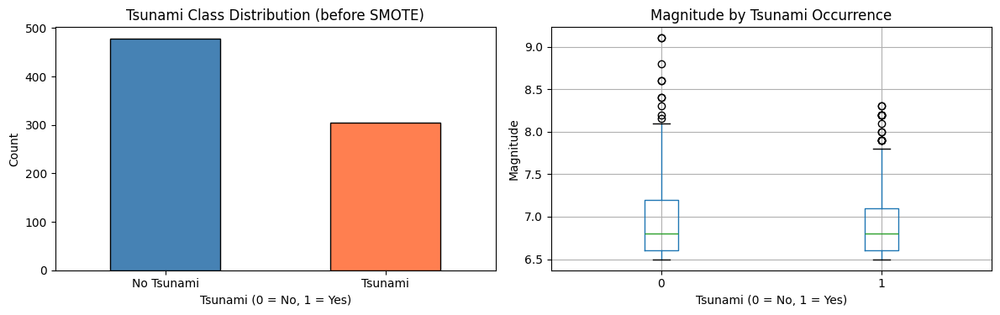
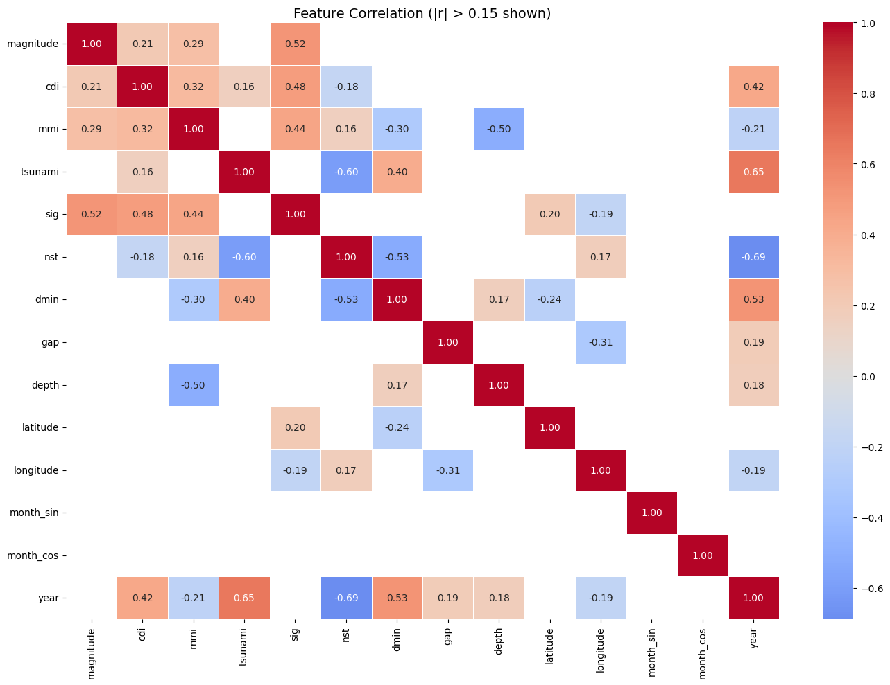
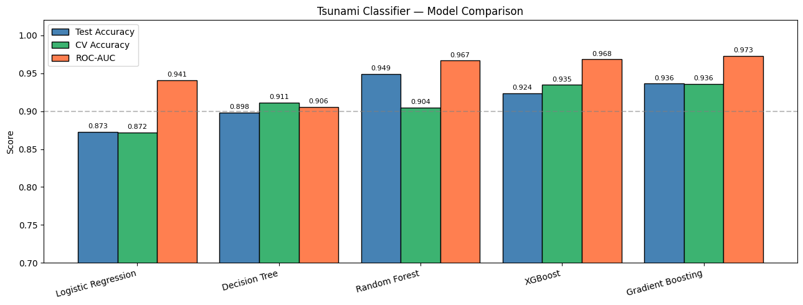
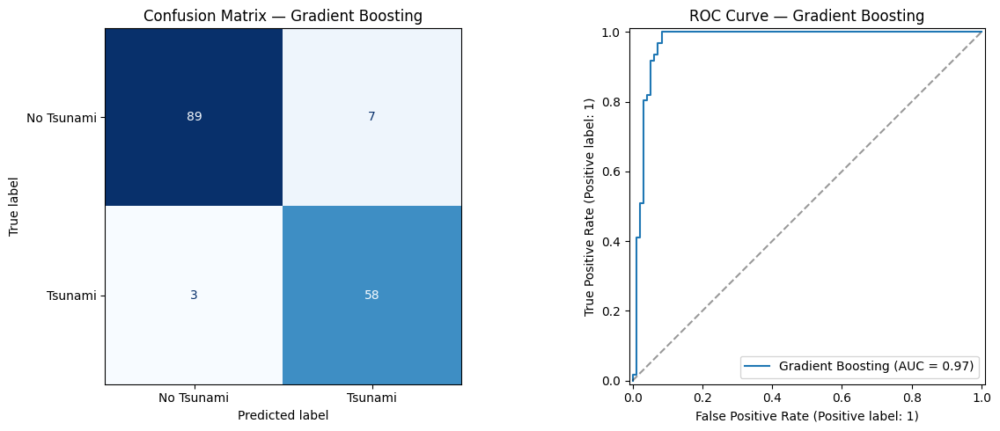
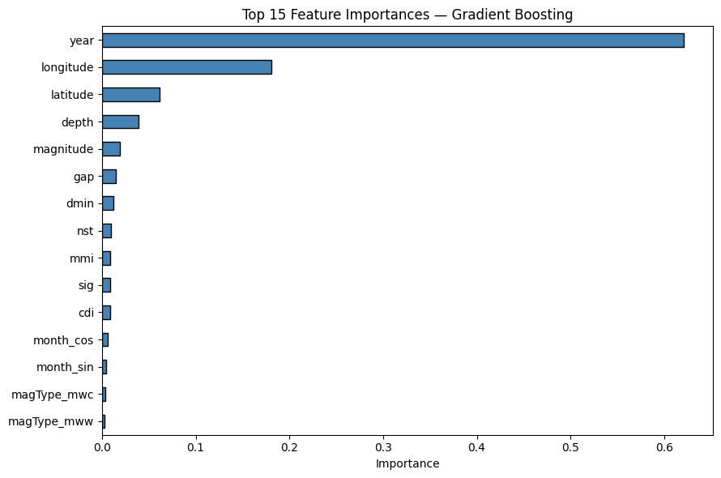
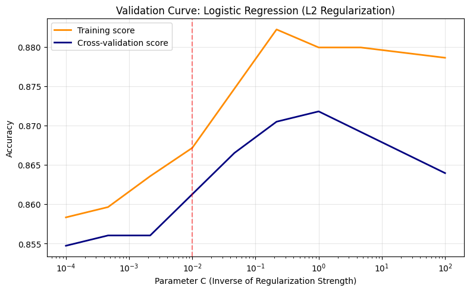
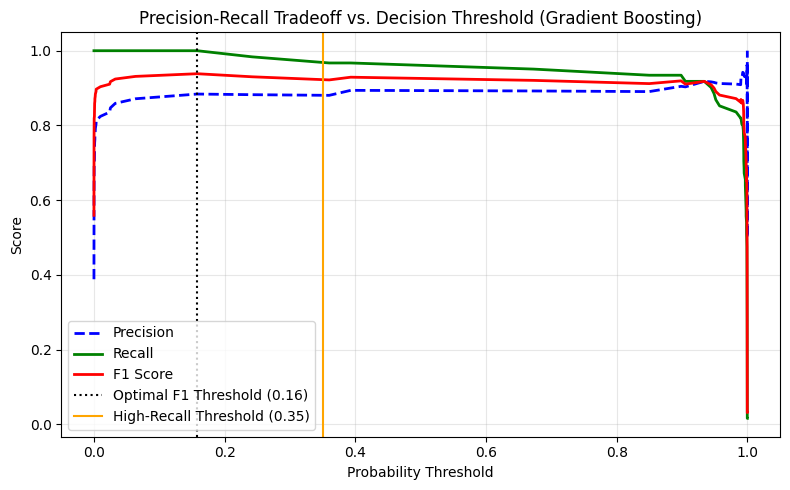

```python
import numpy as np
import pandas as pd
import matplotlib.pyplot as plt
import seaborn as sns
import warnings
import joblib
import os
 
from sklearn.linear_model       import LogisticRegression
from sklearn.tree               import DecisionTreeClassifier
from sklearn.ensemble           import RandomForestClassifier, GradientBoostingClassifier
from sklearn.model_selection    import train_test_split, StratifiedKFold, cross_val_score
from sklearn.metrics            import (accuracy_score, classification_report,
                                        confusion_matrix, roc_auc_score,
                                        RocCurveDisplay, ConfusionMatrixDisplay)
from sklearn.preprocessing      import StandardScaler
from imblearn.over_sampling     import SMOTE
import xgboost as xgb
 
warnings.filterwarnings('ignore')
pd.set_option('display.max_columns', None)
```

## Load Data


```python
df = pd.read_csv('../data/earthquake_data.csv')
print(f"Shape: {df.shape}")
df.head()
```

    Shape: (782, 19)


<div>
<style scoped>
    .dataframe tbody tr th:only-of-type {
        vertical-align: middle;
    }

    .dataframe tbody tr th {
        vertical-align: top;
    }

    .dataframe thead th {
        text-align: right;
    }
</style>
<table border="1" class="dataframe">
  <thead>
    <tr style="text-align: right;">
      <th></th>
      <th>title</th>
      <th>magnitude</th>
      <th>date_time</th>
      <th>cdi</th>
      <th>mmi</th>
      <th>alert</th>
      <th>tsunami</th>
      <th>sig</th>
      <th>net</th>
      <th>nst</th>
      <th>dmin</th>
      <th>gap</th>
      <th>magType</th>
      <th>depth</th>
      <th>latitude</th>
      <th>longitude</th>
      <th>location</th>
      <th>continent</th>
      <th>country</th>
    </tr>
  </thead>
  <tbody>
    <tr>
      <th>0</th>
      <td>M 7.0 - 18 km SW of Malango, Solomon Islands</td>
      <td>7.0</td>
      <td>22-11-2022 02:03</td>
      <td>8</td>
      <td>7</td>
      <td>green</td>
      <td>1</td>
      <td>768</td>
      <td>us</td>
      <td>117</td>
      <td>0.509</td>
      <td>17.0</td>
      <td>mww</td>
      <td>14.000</td>
      <td>-9.7963</td>
      <td>159.596</td>
      <td>Malango, Solomon Islands</td>
      <td>Oceania</td>
      <td>Solomon Islands</td>
    </tr>
    <tr>
      <th>1</th>
      <td>M 6.9 - 204 km SW of Bengkulu, Indonesia</td>
      <td>6.9</td>
      <td>18-11-2022 13:37</td>
      <td>4</td>
      <td>4</td>
      <td>green</td>
      <td>0</td>
      <td>735</td>
      <td>us</td>
      <td>99</td>
      <td>2.229</td>
      <td>34.0</td>
      <td>mww</td>
      <td>25.000</td>
      <td>-4.9559</td>
      <td>100.738</td>
      <td>Bengkulu, Indonesia</td>
      <td>NaN</td>
      <td>NaN</td>
    </tr>
    <tr>
      <th>2</th>
      <td>M 7.0 -</td>
      <td>7.0</td>
      <td>12-11-2022 07:09</td>
      <td>3</td>
      <td>3</td>
      <td>green</td>
      <td>1</td>
      <td>755</td>
      <td>us</td>
      <td>147</td>
      <td>3.125</td>
      <td>18.0</td>
      <td>mww</td>
      <td>579.000</td>
      <td>-20.0508</td>
      <td>-178.346</td>
      <td>NaN</td>
      <td>Oceania</td>
      <td>Fiji</td>
    </tr>
    <tr>
      <th>3</th>
      <td>M 7.3 - 205 km ESE of Neiafu, Tonga</td>
      <td>7.3</td>
      <td>11-11-2022 10:48</td>
      <td>5</td>
      <td>5</td>
      <td>green</td>
      <td>1</td>
      <td>833</td>
      <td>us</td>
      <td>149</td>
      <td>1.865</td>
      <td>21.0</td>
      <td>mww</td>
      <td>37.000</td>
      <td>-19.2918</td>
      <td>-172.129</td>
      <td>Neiafu, Tonga</td>
      <td>NaN</td>
      <td>NaN</td>
    </tr>
    <tr>
      <th>4</th>
      <td>M 6.6 -</td>
      <td>6.6</td>
      <td>09-11-2022 10:14</td>
      <td>0</td>
      <td>2</td>
      <td>green</td>
      <td>1</td>
      <td>670</td>
      <td>us</td>
      <td>131</td>
      <td>4.998</td>
      <td>27.0</td>
      <td>mww</td>
      <td>624.464</td>
      <td>-25.5948</td>
      <td>178.278</td>
      <td>NaN</td>
      <td>NaN</td>
      <td>NaN</td>
    </tr>
  </tbody>
</table>
</div>


## Preprocessing


```python
# Keep only the columns we'll use — drop high-null and non-informative cols.
# We keep magType because it encodes seismic measurement method (informative).
# We drop: title (free text), location/continent/country (high null + lat/lng
# already capture geography), alert (47% null — we'd lose half the dataset),
# net (95% US — near-zero variance).
 
KEEP_COLS = ['magnitude', 'cdi', 'mmi', 'tsunami', 'sig',
             'nst', 'dmin', 'gap', 'magType', 'depth',
             'latitude', 'longitude', 'date_time']
 
df = df[KEEP_COLS].copy()
 
# Parse date and extract cyclical time features
df['date_time'] = pd.to_datetime(df['date_time'], dayfirst=True)
df['month_sin'] = np.sin(2 * np.pi * df['date_time'].dt.month / 12)
df['month_cos'] = np.cos(2 * np.pi * df['date_time'].dt.month / 12)
df['year']      = df['date_time'].dt.year
df.drop('date_time', axis=1, inplace=True)
 
# Encode magType — use pd.get_dummies (one-hot) to avoid ordinal assumption
df = pd.get_dummies(df, columns=['magType'], drop_first=True)
 
print("Null counts after cleaning:")
print(df.isnull().sum())
print(f"\nFinal shape: {df.shape}")
df.head()
```

    Null counts after cleaning:
    magnitude      0
    cdi            0
    mmi            0
    tsunami        0
    sig            0
    nst            0
    dmin           0
    gap            0
    depth          0
    latitude       0
    longitude      0
    month_sin      0
    month_cos      0
    year           0
    magType_mb     0
    magType_md     0
    magType_ml     0
    magType_ms     0
    magType_mw     0
    magType_mwb    0
    magType_mwc    0
    magType_mww    0
    dtype: int64
    
    Final shape: (782, 22)


<div>
<style scoped>
    .dataframe tbody tr th:only-of-type {
        vertical-align: middle;
    }

    .dataframe tbody tr th {
        vertical-align: top;
    }

    .dataframe thead th {
        text-align: right;
    }
</style>
<table border="1" class="dataframe">
  <thead>
    <tr style="text-align: right;">
      <th></th>
      <th>magnitude</th>
      <th>cdi</th>
      <th>mmi</th>
      <th>tsunami</th>
      <th>sig</th>
      <th>nst</th>
      <th>dmin</th>
      <th>gap</th>
      <th>depth</th>
      <th>latitude</th>
      <th>longitude</th>
      <th>month_sin</th>
      <th>month_cos</th>
      <th>year</th>
      <th>magType_mb</th>
      <th>magType_md</th>
      <th>magType_ml</th>
      <th>magType_ms</th>
      <th>magType_mw</th>
      <th>magType_mwb</th>
      <th>magType_mwc</th>
      <th>magType_mww</th>
    </tr>
  </thead>
  <tbody>
    <tr>
      <th>0</th>
      <td>7.0</td>
      <td>8</td>
      <td>7</td>
      <td>1</td>
      <td>768</td>
      <td>117</td>
      <td>0.509</td>
      <td>17.0</td>
      <td>14.000</td>
      <td>-9.7963</td>
      <td>159.596</td>
      <td>-0.5</td>
      <td>0.866025</td>
      <td>2022</td>
      <td>False</td>
      <td>False</td>
      <td>False</td>
      <td>False</td>
      <td>False</td>
      <td>False</td>
      <td>False</td>
      <td>True</td>
    </tr>
    <tr>
      <th>1</th>
      <td>6.9</td>
      <td>4</td>
      <td>4</td>
      <td>0</td>
      <td>735</td>
      <td>99</td>
      <td>2.229</td>
      <td>34.0</td>
      <td>25.000</td>
      <td>-4.9559</td>
      <td>100.738</td>
      <td>-0.5</td>
      <td>0.866025</td>
      <td>2022</td>
      <td>False</td>
      <td>False</td>
      <td>False</td>
      <td>False</td>
      <td>False</td>
      <td>False</td>
      <td>False</td>
      <td>True</td>
    </tr>
    <tr>
      <th>2</th>
      <td>7.0</td>
      <td>3</td>
      <td>3</td>
      <td>1</td>
      <td>755</td>
      <td>147</td>
      <td>3.125</td>
      <td>18.0</td>
      <td>579.000</td>
      <td>-20.0508</td>
      <td>-178.346</td>
      <td>-0.5</td>
      <td>0.866025</td>
      <td>2022</td>
      <td>False</td>
      <td>False</td>
      <td>False</td>
      <td>False</td>
      <td>False</td>
      <td>False</td>
      <td>False</td>
      <td>True</td>
    </tr>
    <tr>
      <th>3</th>
      <td>7.3</td>
      <td>5</td>
      <td>5</td>
      <td>1</td>
      <td>833</td>
      <td>149</td>
      <td>1.865</td>
      <td>21.0</td>
      <td>37.000</td>
      <td>-19.2918</td>
      <td>-172.129</td>
      <td>-0.5</td>
      <td>0.866025</td>
      <td>2022</td>
      <td>False</td>
      <td>False</td>
      <td>False</td>
      <td>False</td>
      <td>False</td>
      <td>False</td>
      <td>False</td>
      <td>True</td>
    </tr>
    <tr>
      <th>4</th>
      <td>6.6</td>
      <td>0</td>
      <td>2</td>
      <td>1</td>
      <td>670</td>
      <td>131</td>
      <td>4.998</td>
      <td>27.0</td>
      <td>624.464</td>
      <td>-25.5948</td>
      <td>178.278</td>
      <td>-0.5</td>
      <td>0.866025</td>
      <td>2022</td>
      <td>False</td>
      <td>False</td>
      <td>False</td>
      <td>False</td>
      <td>False</td>
      <td>False</td>
      <td>False</td>
      <td>True</td>
    </tr>
  </tbody>
</table>
</div>


## EDA — Target Distribution


```python
fig, axes = plt.subplots(1, 2, figsize=(12, 4))
 
# Class balance
df['tsunami'].value_counts().plot(kind='bar', ax=axes[0],
                                   color=['steelblue', 'coral'], edgecolor='black')
axes[0].set_title('Tsunami Class Distribution (before SMOTE)')
axes[0].set_xlabel('Tsunami (0 = No, 1 = Yes)')
axes[0].set_ylabel('Count')
axes[0].set_xticklabels(['No Tsunami', 'Tsunami'], rotation=0)
 
# Magnitude vs tsunami
df.boxplot(column='magnitude', by='tsunami', ax=axes[1])
axes[1].set_title('Magnitude by Tsunami Occurrence')
axes[1].set_xlabel('Tsunami (0 = No, 1 = Yes)')
axes[1].set_ylabel('Magnitude')
plt.suptitle('')
plt.tight_layout()
plt.show()
 
print(f"Class balance:\n{df['tsunami'].value_counts()}")
print(f"Tsunami rate: {df['tsunami'].mean():.1%}")
```


    

    


    Class balance:
    tsunami
    0    478
    1    304
    Name: count, dtype: int64
    Tsunami rate: 38.9%


## Correlation Heatmap


```python
numeric_df = df.select_dtypes(include=[np.number])
corr = numeric_df.corr()
 
plt.figure(figsize=(14, 10))
mask = np.abs(corr) < 0.15   # hide near-zero correlations for readability
sns.heatmap(corr, mask=mask, annot=True, fmt='.2f',
            cmap='coolwarm', center=0, linewidths=0.5)
plt.title('Feature Correlation (|r| > 0.15 shown)', fontsize=14)
plt.tight_layout()
plt.show()
```


    

    


## Train/Test Split — BEFORE scaling


```python
FEATURES = [c for c in df.columns if c != 'tsunami']
TARGET   = 'tsunami'
 
X = df[FEATURES]
y = df[TARGET]
 
# Stratified split preserves class ratio in both sets
X_train, X_test, y_train, y_test = train_test_split(
    X, y, test_size=0.2, random_state=42, stratify=y
)
 
# Scale AFTER splitting — fit only on train, transform both
scaler  = StandardScaler()
X_train_sc = scaler.fit_transform(X_train)
X_test_sc  = scaler.transform(X_test)          # ← transform only, never fit
 
X_train_sc = pd.DataFrame(X_train_sc, columns=FEATURES)
X_test_sc  = pd.DataFrame(X_test_sc,  columns=FEATURES)
 
print(f"Train: {X_train_sc.shape} | Test: {X_test_sc.shape}")
print(f"Train class balance:\n{y_train.value_counts()}")
```

    Train: (625, 21) | Test: (157, 21)
    Train class balance:
    tsunami
    0    382
    1    243
    Name: count, dtype: int64


## Handle Class Imbalance with SMOTE


```python
# SMOTE only on training data — never touch the test set
sm = SMOTE(random_state=42)
X_train_res, y_train_res = sm.fit_resample(X_train_sc, y_train)
 
print(f"After SMOTE — Train shape: {X_train_res.shape}")
print(f"Class balance after SMOTE:\n{pd.Series(y_train_res).value_counts()}")
```

    After SMOTE — Train shape: (764, 21)
    Class balance after SMOTE:
    tsunami
    0    382
    1    382
    Name: count, dtype: int64


## Train Multiple Models


```python
models = {
    "Logistic Regression": LogisticRegression(max_iter=1000, random_state=42),
    "Decision Tree":       DecisionTreeClassifier(max_depth=8, random_state=42),
    "Random Forest":       RandomForestClassifier(n_estimators=200, max_depth=10,
                                                  random_state=42, n_jobs=-1),
    "XGBoost":             xgb.XGBClassifier(n_estimators=200, max_depth=6,
                                             learning_rate=0.1, use_label_encoder=False,
                                             eval_metric='logloss', random_state=42),
    "Gradient Boosting":   GradientBoostingClassifier(n_estimators=200, max_depth=5,
                                                      learning_rate=0.1, random_state=42),
}
 
results = {}
 
for name, model in models.items():
    model.fit(X_train_res, y_train_res)
    y_pred = model.predict(X_test_sc)
    y_prob = (model.predict_proba(X_test_sc)[:, 1]
              if hasattr(model, 'predict_proba') else None)
 
    acc    = accuracy_score(y_test, y_pred)
    roc    = roc_auc_score(y_test, y_prob) if y_prob is not None else None
    cv_acc = cross_val_score(model, X_train_res, y_train_res,
                             cv=StratifiedKFold(5), scoring='accuracy').mean()
 
    results[name] = {'model': model, 'acc': acc, 'roc_auc': roc, 'cv_acc': cv_acc,
                     'y_pred': y_pred, 'y_prob': y_prob}
 
    print(f"\n{'='*55}")
    print(f"  {name}")
    print(f"{'='*55}")
    print(f"  Test Accuracy : {acc:.4f}")
    print(f"  ROC-AUC       : {roc:.4f}" if roc else "  ROC-AUC: N/A")
    print(f"  CV Accuracy   : {cv_acc:.4f}  (5-fold, on train set)")
    print(f"\n{classification_report(y_test, y_pred, target_names=['No Tsunami','Tsunami'])}")
 
```

    
    =======================================================
      Logistic Regression
    =======================================================
      Test Accuracy : 0.8726
      ROC-AUC       : 0.9406
      CV Accuracy   : 0.8718  (5-fold, on train set)
    
                  precision    recall  f1-score   support
    
      No Tsunami       0.95      0.83      0.89        96
         Tsunami       0.78      0.93      0.85        61
    
        accuracy                           0.87       157
       macro avg       0.87      0.88      0.87       157
    weighted avg       0.89      0.87      0.87       157
    
    
    =======================================================
      Decision Tree
    =======================================================
      Test Accuracy : 0.8981
      ROC-AUC       : 0.9057
      CV Accuracy   : 0.9111  (5-fold, on train set)
    
                  precision    recall  f1-score   support
    
      No Tsunami       0.92      0.92      0.92        96
         Tsunami       0.87      0.87      0.87        61
    
        accuracy                           0.90       157
       macro avg       0.89      0.89      0.89       157
    weighted avg       0.90      0.90      0.90       157
    
    
    =======================================================
      Random Forest
    =======================================================
      Test Accuracy : 0.9490
      ROC-AUC       : 0.9667
      CV Accuracy   : 0.9045  (5-fold, on train set)
    
                  precision    recall  f1-score   support
    
      No Tsunami       0.99      0.93      0.96        96
         Tsunami       0.90      0.98      0.94        61
    
        accuracy                           0.95       157
       macro avg       0.94      0.96      0.95       157
    weighted avg       0.95      0.95      0.95       157
    
    
    =======================================================
      XGBoost
    =======================================================
      Test Accuracy : 0.9236
      ROC-AUC       : 0.9682
      CV Accuracy   : 0.9346  (5-fold, on train set)
    
                  precision    recall  f1-score   support
    
      No Tsunami       0.96      0.92      0.94        96
         Tsunami       0.88      0.93      0.90        61
    
        accuracy                           0.92       157
       macro avg       0.92      0.93      0.92       157
    weighted avg       0.93      0.92      0.92       157
    
    
    =======================================================
      Gradient Boosting
    =======================================================
      Test Accuracy : 0.9363
      ROC-AUC       : 0.9727
      CV Accuracy   : 0.9359  (5-fold, on train set)
    
                  precision    recall  f1-score   support
    
      No Tsunami       0.97      0.93      0.95        96
         Tsunami       0.89      0.95      0.92        61
    
        accuracy                           0.94       157
       macro avg       0.93      0.94      0.93       157
    weighted avg       0.94      0.94      0.94       157
    


## Visual Comparison


```python
names   = list(results.keys())
accs    = [results[n]['acc']     for n in names]
rocs    = [results[n]['roc_auc'] for n in names]
cv_accs = [results[n]['cv_acc']  for n in names]
 
x = np.arange(len(names))
width = 0.28
 
fig, ax = plt.subplots(figsize=(13, 5))
ax.bar(x - width, accs,    width, label='Test Accuracy',   color='steelblue',  edgecolor='black')
ax.bar(x,         cv_accs, width, label='CV Accuracy',     color='mediumseagreen', edgecolor='black')
ax.bar(x + width, rocs,    width, label='ROC-AUC',         color='coral',      edgecolor='black')
 
ax.set_xticks(x)
ax.set_xticklabels(names, rotation=15, ha='right')
ax.set_ylim(0.7, 1.02)
ax.set_ylabel('Score')
ax.set_title('Tsunami Classifier — Model Comparison')
ax.legend()
ax.axhline(0.9, color='gray', linestyle='--', alpha=0.5, label='0.9 threshold')
 
for i, (a, c, r) in enumerate(zip(accs, cv_accs, rocs)):
    ax.text(i - width, a + 0.003, f'{a:.3f}', ha='center', va='bottom', fontsize=8)
    ax.text(i,         c + 0.003, f'{c:.3f}', ha='center', va='bottom', fontsize=8)
    ax.text(i + width, r + 0.003, f'{r:.3f}', ha='center', va='bottom', fontsize=8)
 
plt.tight_layout()
plt.show()
```


    

    


## Best Model — Confusion Matrix & ROC Curve


```python
# Pick best by ROC-AUC
best_name  = max(results, key=lambda n: results[n]['roc_auc'])
best       = results[best_name]
print(f"Best model: {best_name}  (ROC-AUC = {best['roc_auc']:.4f})")
 
fig, axes = plt.subplots(1, 2, figsize=(13, 5))
 
# Confusion matrix
ConfusionMatrixDisplay(
    confusion_matrix(y_test, best['y_pred']),
    display_labels=['No Tsunami', 'Tsunami']
).plot(ax=axes[0], colorbar=False, cmap='Blues')
axes[0].set_title(f'Confusion Matrix — {best_name}')
 
# ROC curve
RocCurveDisplay.from_predictions(
    y_test, best['y_prob'], name=best_name, ax=axes[1]
)
axes[1].set_title(f'ROC Curve — {best_name}')
axes[1].plot([0,1],[0,1], 'k--', alpha=0.4)
 
plt.tight_layout()
plt.show()
```

    Best model: Gradient Boosting  (ROC-AUC = 0.9727)


    

    


## Feature Importance (for tree-based best model)


```python
model_obj = best['model']
 
if hasattr(model_obj, 'feature_importances_'):
    imp = pd.Series(model_obj.feature_importances_, index=FEATURES).sort_values(ascending=True)
    top = imp.tail(15)
 
    plt.figure(figsize=(9, 6))
    top.plot(kind='barh', color='steelblue', edgecolor='black')
    plt.title(f'Top 15 Feature Importances — {best_name}')
    plt.xlabel('Importance')
    plt.tight_layout()
    plt.show()
elif hasattr(model_obj, 'coef_'):
    coefs = pd.Series(np.abs(model_obj.coef_[0]), index=FEATURES).sort_values(ascending=True)
    top = coefs.tail(15)
    plt.figure(figsize=(9, 6))
    top.plot(kind='barh', color='steelblue', edgecolor='black')
    plt.title(f'Top 15 Feature Coefficients (|value|) — {best_name}')
    plt.xlabel('|Coefficient|')
    plt.tight_layout()
    plt.show()
```


    

    


## Validation Curve


```python
from sklearn.model_selection import validation_curve

# Step 4: Analyzing Bias-Variance Tradeoff via Regularization (L2 Penalty)
param_range = np.logspace(-4, 2, 10) # Testing C from 0.0001 to 100

train_scores, test_scores = validation_curve(
    LogisticRegression(penalty='l2', max_iter=1000, random_state=42),
    X_train_res, y_train_res, 
    param_name="C", 
    param_range=param_range,
    cv=5, scoring="accuracy", n_jobs=-1
)

train_mean = np.mean(train_scores, axis=1)
test_mean = np.mean(test_scores, axis=1)

plt.figure(figsize=(8, 5))
plt.semilogx(param_range, train_mean, label="Training score", color="darkorange", lw=2)
plt.semilogx(param_range, test_mean, label="Cross-validation score", color="navy", lw=2)
plt.title("Validation Curve: Logistic Regression (L2 Regularization)")
plt.xlabel("Parameter C (Inverse of Regularization Strength)")
plt.ylabel("Accuracy")
plt.legend(loc="best")
plt.grid(True, alpha=0.3)
plt.axvline(x=0.01, color='red', linestyle='--', alpha=0.5, label='Optimal Regularization')
plt.tight_layout()
plt.show()
```


    

    


## Threshold Tuning


```python
from sklearn.metrics import precision_recall_curve, f1_score

# Step 5: Threshold Selection Impact
best_model = best['model']
y_prob_best = best['y_prob']

precisions, recalls, thresholds = precision_recall_curve(y_test, y_prob_best)

# Calculate F1 scores across all thresholds
f1_scores = 2 * (precisions[:-1] * recalls[:-1]) / (precisions[:-1] + recalls[:-1])
optimal_idx = np.argmax(f1_scores)
optimal_threshold = thresholds[optimal_idx]

plt.figure(figsize=(8, 5))
plt.plot(thresholds, precisions[:-1], "b--", label="Precision", lw=2)
plt.plot(thresholds, recalls[:-1], "g-", label="Recall", lw=2)
plt.plot(thresholds, f1_scores, "r-", label="F1 Score", lw=2)
plt.axvline(x=optimal_threshold, color='black', linestyle=':', label=f'Optimal F1 Threshold ({optimal_threshold:.2f})')

# Disaster Management adjustment: Shift threshold left to prioritize Recall
safe_threshold = 0.35 
plt.axvline(x=safe_threshold, color='orange', linestyle='-', label=f'High-Recall Threshold ({safe_threshold:.2f})')

plt.title(f"Precision-Recall Tradeoff vs. Decision Threshold ({best_name})")
plt.xlabel("Probability Threshold")
plt.ylabel("Score")
plt.legend(loc="best")
plt.grid(True, alpha=0.3)
plt.tight_layout()
plt.show()

# Show impact of changing threshold
y_pred_default = (y_prob_best >= 0.5).astype(int)
y_pred_safe = (y_prob_best >= safe_threshold).astype(int)

print(f"Default Threshold (0.50) Recall : {classification_report(y_test, y_pred_default, output_dict=True)['1']['recall']:.4f}")
print(f"Safe Threshold ({safe_threshold:.2f}) Recall    : {classification_report(y_test, y_pred_safe, output_dict=True)['1']['recall']:.4f}")
```


    

    


    Default Threshold (0.50) Recall : 0.9508
    Safe Threshold (0.35) Recall    : 0.9672


## Save Best Model + Scaler


```python
os.makedirs('../models', exist_ok=True)
 
joblib.dump(best['model'], '../models/tsunami_model.pkl')
joblib.dump(scaler,        '../models/tsunami_scaler.pkl')
joblib.dump(FEATURES,      '../models/tsunami_features.pkl')
 
print(f"Saved tsunami_model.pkl  ({best_name})")
print(f"Saved tsunami_scaler.pkl")
print(f"Saved tsunami_features.pkl")
print(f"\nFinal model performance:")
print(f"  Test Accuracy : {best['acc']:.4f}")
print(f"  ROC-AUC       : {best['roc_auc']:.4f}")
print(f"  CV Accuracy   : {best['cv_acc']:.4f}")
```

    Saved tsunami_model.pkl  (Gradient Boosting)
    Saved tsunami_scaler.pkl
    Saved tsunami_features.pkl
    
    Final model performance:
      Test Accuracy : 0.9363
      ROC-AUC       : 0.9727
      CV Accuracy   : 0.9359

