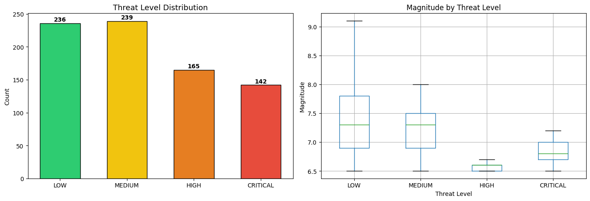
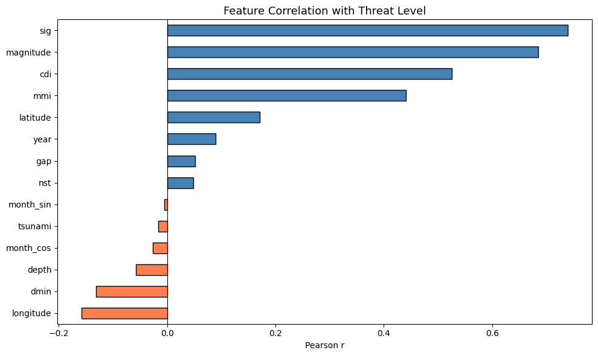
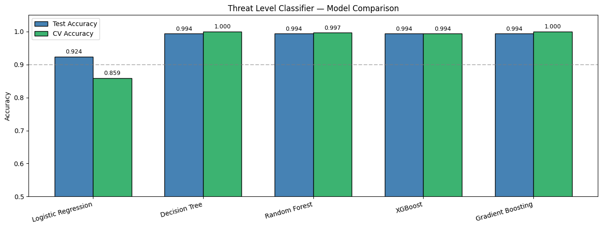
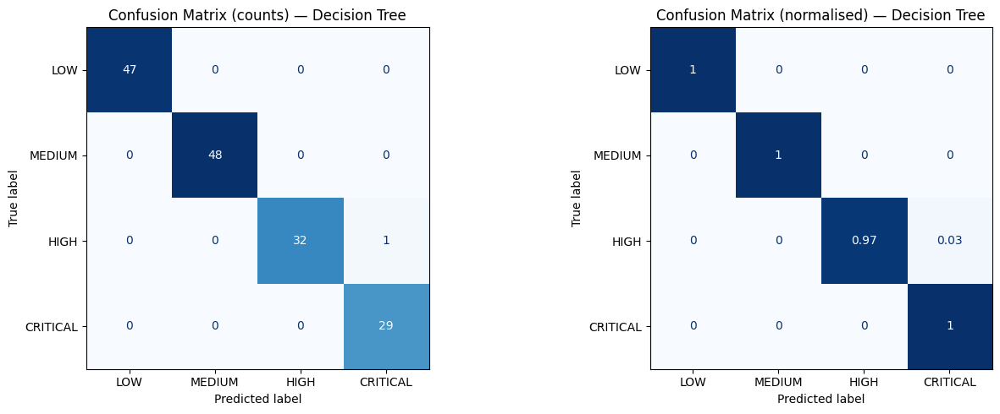
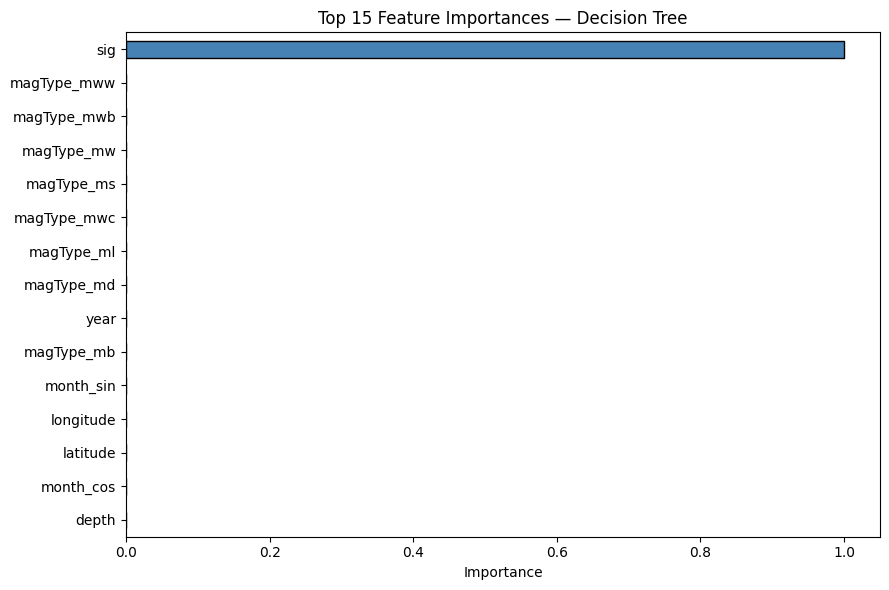

```python
import numpy as np
import pandas as pd
import matplotlib.pyplot as plt
import seaborn as sns
import warnings
import joblib
import os
 
from sklearn.linear_model       import LogisticRegression
from sklearn.tree               import DecisionTreeClassifier
from sklearn.ensemble           import RandomForestClassifier, GradientBoostingClassifier
from sklearn.model_selection    import train_test_split, StratifiedKFold, cross_val_score
from sklearn.metrics            import (accuracy_score, classification_report,
                                        confusion_matrix, ConfusionMatrixDisplay)
from sklearn.preprocessing      import StandardScaler, LabelEncoder
from imblearn.over_sampling     import SMOTE
from imblearn.pipeline import Pipeline
import xgboost as xgb
 
warnings.filterwarnings('ignore')
pd.set_option('display.max_columns', None)
```

## Load Data


```python
df = pd.read_csv('../data/earthquake_data.csv')
print(f"Shape: {df.shape}")
df.head()
```

    Shape: (782, 19)


<div>
<style scoped>
    .dataframe tbody tr th:only-of-type {
        vertical-align: middle;
    }

    .dataframe tbody tr th {
        vertical-align: top;
    }

    .dataframe thead th {
        text-align: right;
    }
</style>
<table border="1" class="dataframe">
  <thead>
    <tr style="text-align: right;">
      <th></th>
      <th>title</th>
      <th>magnitude</th>
      <th>date_time</th>
      <th>cdi</th>
      <th>mmi</th>
      <th>alert</th>
      <th>tsunami</th>
      <th>sig</th>
      <th>net</th>
      <th>nst</th>
      <th>dmin</th>
      <th>gap</th>
      <th>magType</th>
      <th>depth</th>
      <th>latitude</th>
      <th>longitude</th>
      <th>location</th>
      <th>continent</th>
      <th>country</th>
    </tr>
  </thead>
  <tbody>
    <tr>
      <th>0</th>
      <td>M 7.0 - 18 km SW of Malango, Solomon Islands</td>
      <td>7.0</td>
      <td>22-11-2022 02:03</td>
      <td>8</td>
      <td>7</td>
      <td>green</td>
      <td>1</td>
      <td>768</td>
      <td>us</td>
      <td>117</td>
      <td>0.509</td>
      <td>17.0</td>
      <td>mww</td>
      <td>14.000</td>
      <td>-9.7963</td>
      <td>159.596</td>
      <td>Malango, Solomon Islands</td>
      <td>Oceania</td>
      <td>Solomon Islands</td>
    </tr>
    <tr>
      <th>1</th>
      <td>M 6.9 - 204 km SW of Bengkulu, Indonesia</td>
      <td>6.9</td>
      <td>18-11-2022 13:37</td>
      <td>4</td>
      <td>4</td>
      <td>green</td>
      <td>0</td>
      <td>735</td>
      <td>us</td>
      <td>99</td>
      <td>2.229</td>
      <td>34.0</td>
      <td>mww</td>
      <td>25.000</td>
      <td>-4.9559</td>
      <td>100.738</td>
      <td>Bengkulu, Indonesia</td>
      <td>NaN</td>
      <td>NaN</td>
    </tr>
    <tr>
      <th>2</th>
      <td>M 7.0 -</td>
      <td>7.0</td>
      <td>12-11-2022 07:09</td>
      <td>3</td>
      <td>3</td>
      <td>green</td>
      <td>1</td>
      <td>755</td>
      <td>us</td>
      <td>147</td>
      <td>3.125</td>
      <td>18.0</td>
      <td>mww</td>
      <td>579.000</td>
      <td>-20.0508</td>
      <td>-178.346</td>
      <td>NaN</td>
      <td>Oceania</td>
      <td>Fiji</td>
    </tr>
    <tr>
      <th>3</th>
      <td>M 7.3 - 205 km ESE of Neiafu, Tonga</td>
      <td>7.3</td>
      <td>11-11-2022 10:48</td>
      <td>5</td>
      <td>5</td>
      <td>green</td>
      <td>1</td>
      <td>833</td>
      <td>us</td>
      <td>149</td>
      <td>1.865</td>
      <td>21.0</td>
      <td>mww</td>
      <td>37.000</td>
      <td>-19.2918</td>
      <td>-172.129</td>
      <td>Neiafu, Tonga</td>
      <td>NaN</td>
      <td>NaN</td>
    </tr>
    <tr>
      <th>4</th>
      <td>M 6.6 -</td>
      <td>6.6</td>
      <td>09-11-2022 10:14</td>
      <td>0</td>
      <td>2</td>
      <td>green</td>
      <td>1</td>
      <td>670</td>
      <td>us</td>
      <td>131</td>
      <td>4.998</td>
      <td>27.0</td>
      <td>mww</td>
      <td>624.464</td>
      <td>-25.5948</td>
      <td>178.278</td>
      <td>NaN</td>
      <td>NaN</td>
      <td>NaN</td>
    </tr>
  </tbody>
</table>
</div>


## Create Threat Level Label from `sig`


```python
# We engineer our target from the 'sig' (significance) column.
# Using `sig` over `alert` because:
#   - alert has 47% nulls → we'd lose half the dataset
#   - sig is available for all 782 records, no imputation needed
#   - sig is computed from magnitude, MMI, felt reports, and estimated impact
#     so it's a richer signal than alert alone
#
# Bins chosen from df.describe():
#   sig min=650, 25%=691, 50%=754, 75%=909, max=2910
#
#   LOW      : sig < 700   → minor event, localised impact
#   MEDIUM   : 700 ≤ sig < 800  → moderate, regional impact
#   HIGH     : 800 ≤ sig < 1000 → significant, national-level response
#   CRITICAL : sig ≥ 1000  → major disaster, international response
 
def assign_threat(sig):
    if   sig < 700:   return 'LOW'
    elif sig < 800:   return 'MEDIUM'
    elif sig < 1000:  return 'HIGH'
    else:             return 'CRITICAL'
 
df['threat_level'] = df['sig'].apply(assign_threat)
 
print("Threat level distribution:")
print(df['threat_level'].value_counts())
print(f"\nProportions:\n{df['threat_level'].value_counts(normalize=True).round(3)}")
```

    Threat level distribution:
    threat_level
    MEDIUM      239
    LOW         236
    HIGH        165
    CRITICAL    142
    Name: count, dtype: int64
    
    Proportions:
    threat_level
    MEDIUM      0.306
    LOW         0.302
    HIGH        0.211
    CRITICAL    0.182
    Name: proportion, dtype: float64


## Visualise the new label


```python
fig, axes = plt.subplots(1, 2, figsize=(14, 5))
 
order = ['LOW', 'MEDIUM', 'HIGH', 'CRITICAL']
palette = {'LOW': '#2ecc71', 'MEDIUM': '#f1c40f', 'HIGH': '#e67e22', 'CRITICAL': '#e74c3c'}
 
# Class counts
counts = df['threat_level'].value_counts().reindex(order)
axes[0].bar(order, counts.values,
            color=[palette[o] for o in order], edgecolor='black', width=0.6)
axes[0].set_title('Threat Level Distribution', fontsize=13)
axes[0].set_ylabel('Count')
for i, v in enumerate(counts.values):
    axes[0].text(i, v + 3, str(v), ha='center', fontweight='bold')
 
# Magnitude by threat level
df.boxplot(column='magnitude', by='threat_level',
           ax=axes[1], positions=[0, 1, 2, 3])
axes[1].set_xticklabels(order)
axes[1].set_title('Magnitude by Threat Level')
axes[1].set_xlabel('Threat Level')
axes[1].set_ylabel('Magnitude')
plt.suptitle('')
 
plt.tight_layout()
plt.show()
```


    

    


## Preprocessing


```python
KEEP_COLS = ['magnitude', 'cdi', 'mmi', 'tsunami', 'sig',
             'nst', 'dmin', 'gap', 'magType', 'depth',
             'latitude', 'longitude', 'date_time', 'threat_level']
 
df = df[KEEP_COLS].copy()
 
# Parse date — cyclical encoding for month (better than raw integer)
df['date_time'] = pd.to_datetime(df['date_time'], dayfirst=True)
df['month_sin'] = np.sin(2 * np.pi * df['date_time'].dt.month / 12)
df['month_cos'] = np.cos(2 * np.pi * df['date_time'].dt.month / 12)
df['year']      = df['date_time'].dt.year
df.drop('date_time', axis=1, inplace=True)
 
# One-hot encode magType (avoids ordinal assumption of LabelEncoder)
df = pd.get_dummies(df, columns=['magType'], drop_first=True)
 
# Encode target with a consistent label encoder (so we can decode predictions later)
le = LabelEncoder()
le.classes_ = np.array(order)           # fix the order: LOW=0, MEDIUM=1, HIGH=2, CRITICAL=3
df['threat_encoded'] = le.transform(df['threat_level'])
 
print("Label encoding:")
for i, cls in enumerate(le.classes_):
    print(f"  {i} → {cls}")
 
print(f"\nNull counts:\n{df.isnull().sum()}")
print(f"Final shape: {df.shape}")
```

    Label encoding:
      0 → LOW
      1 → MEDIUM
      2 → HIGH
      3 → CRITICAL
    
    Null counts:
    magnitude         0
    cdi               0
    mmi               0
    tsunami           0
    sig               0
    nst               0
    dmin              0
    gap               0
    depth             0
    latitude          0
    longitude         0
    threat_level      0
    month_sin         0
    month_cos         0
    year              0
    magType_mb        0
    magType_md        0
    magType_ml        0
    magType_ms        0
    magType_mw        0
    magType_mwb       0
    magType_mwc       0
    magType_mww       0
    threat_encoded    0
    dtype: int64
    Final shape: (782, 24)


## Correlation of features with threat level


```python
numeric_df = df.select_dtypes(include=[np.number])
corr_threat = numeric_df.corr()['threat_encoded'].drop('threat_encoded').sort_values()
 
plt.figure(figsize=(10, 6))
colors = ['coral' if v < 0 else 'steelblue' for v in corr_threat]
corr_threat.plot(kind='barh', color=colors, edgecolor='black')
plt.axvline(0, color='black', linewidth=0.8)
plt.title('Feature Correlation with Threat Level', fontsize=13)
plt.xlabel('Pearson r')
plt.tight_layout()
plt.show()
```


    

    


## Train/Test Split


```python
FEATURES = [c for c in df.columns if c not in ['threat_level', 'threat_encoded']]
TARGET   = 'threat_encoded'
 
X = df[FEATURES]
y = df[TARGET]
 
X_train, X_test, y_train, y_test = train_test_split(
    X, y, test_size=0.2, random_state=42, stratify=y
)
 
# Scale after split — scaler fitted on train only
scaler     = StandardScaler()
X_train_sc = scaler.fit_transform(X_train)
X_test_sc  = scaler.transform(X_test)
 
X_train_sc = pd.DataFrame(X_train_sc, columns=FEATURES)
X_test_sc  = pd.DataFrame(X_test_sc,  columns=FEATURES)
 
print(f"Train: {X_train_sc.shape} | Test: {X_test_sc.shape}")
print(f"\nTrain class distribution:\n{pd.Series(y_train).value_counts().sort_index()}")
```

    Train: (625, 22) | Test: (157, 22)
    
    Train class distribution:
    threat_encoded
    0    189
    1    191
    2    132
    3    113
    Name: count, dtype: int64


## Handle Class Imbalance with SMOTE


```python
sm = SMOTE(random_state=42, k_neighbors=3)   # k=3 safer for small minority classes
X_train_res, y_train_res = sm.fit_resample(X_train_sc, y_train)
 
print(f"After SMOTE — shape: {X_train_res.shape}")
print(f"Class balance:\n{pd.Series(y_train_res).value_counts().sort_index()}")
```

    After SMOTE — shape: (764, 22)
    Class balance:
    threat_encoded
    0    191
    1    191
    2    191
    3    191
    Name: count, dtype: int64


## Train Multiple Models


```python
# Add this to your Cell 1 imports:
# from imblearn.pipeline import Pipeline

models = {
    "Logistic Regression": LogisticRegression(max_iter=1000, solver='lbfgs', random_state=42),
    "Decision Tree":       DecisionTreeClassifier(max_depth=8, random_state=42),
    "Random Forest":       RandomForestClassifier(n_estimators=200, max_depth=10, random_state=42, n_jobs=-1),
    "XGBoost":             xgb.XGBClassifier(n_estimators=200, max_depth=6, learning_rate=0.1, objective='multi:softprob', num_class=4, eval_metric='mlogloss', random_state=42),
    "Gradient Boosting":   GradientBoostingClassifier(n_estimators=200, max_depth=5, learning_rate=0.1, random_state=42),
}

results = {}
target_names = list(le.classes_)   # ['LOW', 'MEDIUM', 'HIGH', 'CRITICAL']

for name, model in models.items():
    # 1. Fit the model on the resampled data for the final test set prediction
    model.fit(X_train_res, y_train_res)
    y_pred = model.predict(X_test_sc)
    acc = accuracy_score(y_test, y_pred)

    # 2. Use a Pipeline for Cross-Validation to prevent data leakage
    pipeline = Pipeline([
        ('smote', SMOTE(random_state=42, k_neighbors=3)),
        ('model', model)
    ])
    
    # Notice we pass X_train_sc and y_train here, NOT the _res versions
    cv_acc = cross_val_score(pipeline, X_train_sc, y_train, 
                             cv=StratifiedKFold(5), scoring='accuracy').mean()

    results[name] = {'model': model, 'acc': acc, 'cv_acc': cv_acc, 'y_pred': y_pred}

    print(f"\n{'='*55}")
    print(f"  {name}")
    print(f"{'='*55}")
    print(f"  Test Accuracy : {acc:.4f}")
    print(f"  CV Accuracy   : {cv_acc:.4f}  (5-fold, on train set)")
    print(f"\n{classification_report(y_test, y_pred, target_names=target_names)}")
```

    
    =======================================================
      Logistic Regression
    =======================================================
      Test Accuracy : 0.9236
      CV Accuracy   : 0.8592  (5-fold, on train set)
    
                  precision    recall  f1-score   support
    
             LOW       0.90      0.96      0.93        47
          MEDIUM       0.91      0.88      0.89        48
            HIGH       0.94      0.88      0.91        33
        CRITICAL       0.97      1.00      0.98        29
    
        accuracy                           0.92       157
       macro avg       0.93      0.93      0.93       157
    weighted avg       0.92      0.92      0.92       157
    
    
    =======================================================
      Decision Tree
    =======================================================
      Test Accuracy : 0.9936
      CV Accuracy   : 1.0000  (5-fold, on train set)
    
                  precision    recall  f1-score   support
    
             LOW       1.00      1.00      1.00        47
          MEDIUM       1.00      1.00      1.00        48
            HIGH       1.00      0.97      0.98        33
        CRITICAL       0.97      1.00      0.98        29
    
        accuracy                           0.99       157
       macro avg       0.99      0.99      0.99       157
    weighted avg       0.99      0.99      0.99       157
    
    
    =======================================================
      Random Forest
    =======================================================
      Test Accuracy : 0.9936
      CV Accuracy   : 0.9968  (5-fold, on train set)
    
                  precision    recall  f1-score   support
    
             LOW       1.00      1.00      1.00        47
          MEDIUM       1.00      1.00      1.00        48
            HIGH       1.00      0.97      0.98        33
        CRITICAL       0.97      1.00      0.98        29
    
        accuracy                           0.99       157
       macro avg       0.99      0.99      0.99       157
    weighted avg       0.99      0.99      0.99       157
    
    
    =======================================================
      XGBoost
    =======================================================
      Test Accuracy : 0.9936
      CV Accuracy   : 0.9936  (5-fold, on train set)
    
                  precision    recall  f1-score   support
    
             LOW       0.98      1.00      0.99        47
          MEDIUM       1.00      0.98      0.99        48
            HIGH       1.00      1.00      1.00        33
        CRITICAL       1.00      1.00      1.00        29
    
        accuracy                           0.99       157
       macro avg       0.99      0.99      0.99       157
    weighted avg       0.99      0.99      0.99       157
    
    
    =======================================================
      Gradient Boosting
    =======================================================
      Test Accuracy : 0.9936
      CV Accuracy   : 1.0000  (5-fold, on train set)
    
                  precision    recall  f1-score   support
    
             LOW       1.00      1.00      1.00        47
          MEDIUM       1.00      1.00      1.00        48
            HIGH       1.00      0.97      0.98        33
        CRITICAL       0.97      1.00      0.98        29
    
        accuracy                           0.99       157
       macro avg       0.99      0.99      0.99       157
    weighted avg       0.99      0.99      0.99       157
    


## Visual Comparison


```python
names   = list(results.keys())
accs    = [results[n]['acc']    for n in names]
cv_accs = [results[n]['cv_acc'] for n in names]
 
x = np.arange(len(names))
width = 0.35
 
fig, ax = plt.subplots(figsize=(13, 5))
ax.bar(x - width/2, accs,    width, label='Test Accuracy', color='steelblue', edgecolor='black')
ax.bar(x + width/2, cv_accs, width, label='CV Accuracy',   color='mediumseagreen', edgecolor='black')
 
ax.set_xticks(x)
ax.set_xticklabels(names, rotation=15, ha='right')
ax.set_ylim(0.5, 1.05)
ax.set_ylabel('Accuracy')
ax.set_title('Threat Level Classifier — Model Comparison')
ax.legend()
ax.axhline(0.9, color='gray', linestyle='--', alpha=0.5)
 
for i, (a, c) in enumerate(zip(accs, cv_accs)):
    ax.text(i - width/2, a + 0.005, f'{a:.3f}', ha='center', va='bottom', fontsize=9)
    ax.text(i + width/2, c + 0.005, f'{c:.3f}', ha='center', va='bottom', fontsize=9)
 
plt.tight_layout()
plt.show()
```


    

    


## Best Model — Confusion Matrix


```python
best_name = max(results, key=lambda n: results[n]['acc'])
best      = results[best_name]
print(f"Best model: {best_name}  (Test Accuracy = {best['acc']:.4f})")
 
fig, axes = plt.subplots(1, 2, figsize=(14, 5))
 
# Normalised confusion matrix (proportions)
cm     = confusion_matrix(y_test, best['y_pred'])
cm_norm = cm.astype('float') / cm.sum(axis=1, keepdims=True)
 
ConfusionMatrixDisplay(cm, display_labels=target_names).plot(
    ax=axes[0], colorbar=False, cmap='Blues')
axes[0].set_title(f'Confusion Matrix (counts) — {best_name}')
 
ConfusionMatrixDisplay(np.round(cm_norm, 2), display_labels=target_names).plot(
    ax=axes[1], colorbar=False, cmap='Blues')
axes[1].set_title(f'Confusion Matrix (normalised) — {best_name}')
 
plt.tight_layout()
plt.show()
```

    Best model: Decision Tree  (Test Accuracy = 0.9936)


    

    


## Feature Importance


```python
model_obj = best['model']
 
if hasattr(model_obj, 'feature_importances_'):
    imp = pd.Series(model_obj.feature_importances_, index=FEATURES).sort_values(ascending=True)
    top = imp.tail(15)
 
    plt.figure(figsize=(9, 6))
    top.plot(kind='barh', color='steelblue', edgecolor='black')
    plt.title(f'Top 15 Feature Importances — {best_name}')
    plt.xlabel('Importance')
    plt.tight_layout()
    plt.show()
 
elif hasattr(model_obj, 'coef_'):
    # For multinomial logistic, coef_ is (n_classes, n_features) — take mean abs
    imp = pd.Series(np.abs(model_obj.coef_).mean(axis=0), index=FEATURES).sort_values(ascending=True)
    top = imp.tail(15)
    plt.figure(figsize=(9, 6))
    top.plot(kind='barh', color='steelblue', edgecolor='black')
    plt.title(f'Top 15 Feature Coefficients (mean |value|) — {best_name}')
    plt.xlabel('Mean |Coefficient|')
    plt.tight_layout()
    plt.show()
 
```


    

    


## Save Best Model + Scaler + Encoder


```python
os.makedirs('../models', exist_ok=True)
 
joblib.dump(best['model'], '../models/threat_model.pkl')
joblib.dump(scaler,        '../models/threat_scaler.pkl')
joblib.dump(le,            '../models/threat_label_encoder.pkl')
joblib.dump(FEATURES,      '../models/threat_features.pkl')
 
print(f"Saved threat_model.pkl  ({best_name})")
print(f"Saved threat_scaler.pkl")
print(f"Saved threat_label_encoder.pkl")
print(f"Saved threat_features.pkl")
print(f"\nClass labels: {list(le.classes_)}")
print(f"  → model outputs integers 0–3, decode with le.inverse_transform([pred])")
 
print(f"\nFinal model performance:")
print(f"  Test Accuracy : {best['acc']:.4f}")
print(f"  CV Accuracy   : {best['cv_acc']:.4f}")
```

    Saved threat_model.pkl  (Decision Tree)
    Saved threat_scaler.pkl
    Saved threat_label_encoder.pkl
    Saved threat_features.pkl
    
    Class labels: [np.str_('LOW'), np.str_('MEDIUM'), np.str_('HIGH'), np.str_('CRITICAL')]
      → model outputs integers 0–3, decode with le.inverse_transform([pred])
    
    Final model performance:
      Test Accuracy : 0.9936
      CV Accuracy   : 1.0000


## Quick Inference Test


```python
# Shows how the AI notebook will call this model
 
def predict_threat(input_dict, model_path='../models/'):
    """
    input_dict keys must match FEATURES exactly.
    Example call — see below.
    """
    model    = joblib.load(model_path + 'threat_model.pkl')
    scaler   = joblib.load(model_path + 'threat_scaler.pkl')
    le       = joblib.load(model_path + 'threat_label_encoder.pkl')
    features = joblib.load(model_path + 'threat_features.pkl')
 
    row = pd.DataFrame([input_dict])[features]
    row_sc = scaler.transform(row)
    pred   = model.predict(row_sc)[0]
    return le.inverse_transform([pred])[0]
 
 
# Example
sample = X_test.iloc[0].to_dict()
print(f"Input features:\n{pd.Series(sample)}\n")
predicted = predict_threat(sample)
actual    = le.inverse_transform([y_test.iloc[0]])[0]
print(f"Sample prediction  : {predicted}")
print(f"Actual label       : {actual}")
```

    Input features:
    magnitude          7.1
    cdi                  0
    mmi                  5
    tsunami              1
    sig                776
    nst                  0
    dmin             7.043
    gap               20.0
    depth            133.0
    latitude      -58.5446
    longitude     -26.3856
    month_sin         -0.0
    month_cos          1.0
    year              2018
    magType_mb       False
    magType_md       False
    magType_ml       False
    magType_ms       False
    magType_mw       False
    magType_mwb      False
    magType_mwc      False
    magType_mww       True
    dtype: object
    
    Sample prediction  : MEDIUM
    Actual label       : MEDIUM

