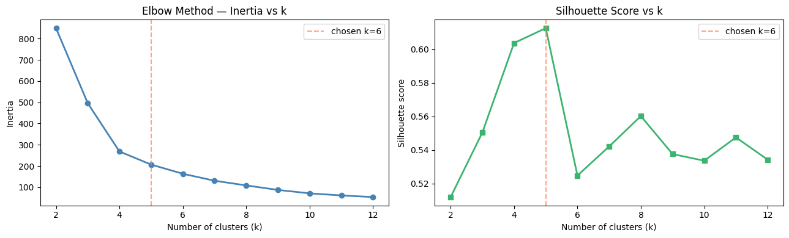
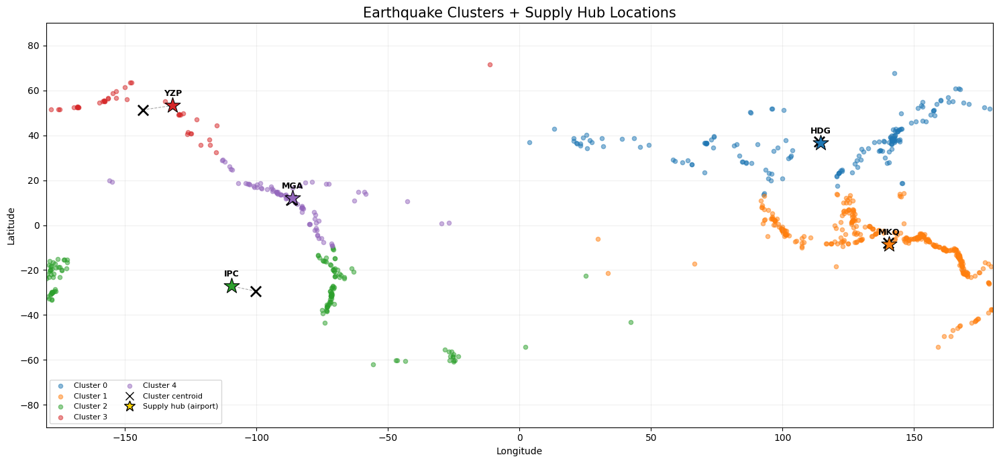

```python
import numpy as np
import pandas as pd
import matplotlib.pyplot as plt
import seaborn as sns
import folium
import joblib
import os
import warnings
from sklearn.cluster          import KMeans
from sklearn.metrics          import silhouette_score
from sklearn.preprocessing    import StandardScaler
from scipy.spatial.distance   import cdist
 
warnings.filterwarnings('ignore')
pd.set_option('display.max_columns', None)
```

##  Load Datasets


```python
eq  = pd.read_csv('../data/earthquake_data.csv')
apt = pd.read_csv('../data/airports.csv')          # adjust path as needed
 
print(f"Earthquakes : {eq.shape}")
print(f"Airports    : {apt.shape}")
eq.head(3)
```

    Earthquakes : (782, 19)
    Airports    : (85549, 19)


<div>
<style scoped>
    .dataframe tbody tr th:only-of-type {
        vertical-align: middle;
    }

    .dataframe tbody tr th {
        vertical-align: top;
    }

    .dataframe thead th {
        text-align: right;
    }
</style>
<table border="1" class="dataframe">
  <thead>
    <tr style="text-align: right;">
      <th></th>
      <th>title</th>
      <th>magnitude</th>
      <th>date_time</th>
      <th>cdi</th>
      <th>mmi</th>
      <th>alert</th>
      <th>tsunami</th>
      <th>sig</th>
      <th>net</th>
      <th>nst</th>
      <th>dmin</th>
      <th>gap</th>
      <th>magType</th>
      <th>depth</th>
      <th>latitude</th>
      <th>longitude</th>
      <th>location</th>
      <th>continent</th>
      <th>country</th>
    </tr>
  </thead>
  <tbody>
    <tr>
      <th>0</th>
      <td>M 7.0 - 18 km SW of Malango, Solomon Islands</td>
      <td>7.0</td>
      <td>22-11-2022 02:03</td>
      <td>8</td>
      <td>7</td>
      <td>green</td>
      <td>1</td>
      <td>768</td>
      <td>us</td>
      <td>117</td>
      <td>0.509</td>
      <td>17.0</td>
      <td>mww</td>
      <td>14.0</td>
      <td>-9.7963</td>
      <td>159.596</td>
      <td>Malango, Solomon Islands</td>
      <td>Oceania</td>
      <td>Solomon Islands</td>
    </tr>
    <tr>
      <th>1</th>
      <td>M 6.9 - 204 km SW of Bengkulu, Indonesia</td>
      <td>6.9</td>
      <td>18-11-2022 13:37</td>
      <td>4</td>
      <td>4</td>
      <td>green</td>
      <td>0</td>
      <td>735</td>
      <td>us</td>
      <td>99</td>
      <td>2.229</td>
      <td>34.0</td>
      <td>mww</td>
      <td>25.0</td>
      <td>-4.9559</td>
      <td>100.738</td>
      <td>Bengkulu, Indonesia</td>
      <td>NaN</td>
      <td>NaN</td>
    </tr>
    <tr>
      <th>2</th>
      <td>M 7.0 -</td>
      <td>7.0</td>
      <td>12-11-2022 07:09</td>
      <td>3</td>
      <td>3</td>
      <td>green</td>
      <td>1</td>
      <td>755</td>
      <td>us</td>
      <td>147</td>
      <td>3.125</td>
      <td>18.0</td>
      <td>mww</td>
      <td>579.0</td>
      <td>-20.0508</td>
      <td>-178.346</td>
      <td>NaN</td>
      <td>Oceania</td>
      <td>Fiji</td>
    </tr>
  </tbody>
</table>
</div>


## Clean Earthquake Data


```python
# We only need coordinates for clustering
coords_eq = eq[['latitude', 'longitude']].dropna().reset_index(drop=True)
print(f"Clean earthquake coords: {coords_eq.shape}")
```

    Clean earthquake coords: (782, 2)


## Clean Airport Data


```python
# Keep only airports with scheduled service (real commercial airports)
# and valid coordinates.  Filter by type to avoid helipads and balloonports.

KEEP_TYPES = ['large_airport', 'medium_airport']
 
apt_clean = (
    apt[apt['type'].isin(KEEP_TYPES)]
      .dropna(subset=['latitude_deg', 'longitude_deg'])
      .rename(columns={'latitude_deg': 'lat', 'longitude_deg': 'lon'})
      [['name', 'iata_code', 'type', 'lat', 'lon', 'iso_country', 'municipality']]
      .reset_index(drop=True)
)
 
print(f"Usable airports: {apt_clean.shape[0]}")
apt_clean['type'].value_counts()
 
```

    Usable airports: 5277


    type
    medium_airport    4099
    large_airport     1178
    Name: count, dtype: int64


## Find Optimal k with Elbow + Silhouette 


```python
# We scale lat/lon so degrees of latitude and longitude have equal weight.
# (One degree of longitude at the equator ≈ one degree of latitude ≈ 111 km,
#  but near the poles longitude degrees compress — scaling handles this.)
 
scaler   = StandardScaler()
X_scaled = scaler.fit_transform(coords_eq[['latitude', 'longitude']])
 
k_range    = range(2, 13)
inertias   = []
silhouettes = []
 
for k in k_range:
    km = KMeans(n_clusters=k, random_state=42, n_init=15)
    labels = km.fit_predict(X_scaled)
    inertias.append(km.inertia_)
    silhouettes.append(silhouette_score(X_scaled, labels))
 
fig, axes = plt.subplots(1, 2, figsize=(13, 4))
 
axes[0].plot(list(k_range), inertias, 'o-', color='steelblue', linewidth=2)
axes[0].set_title('Elbow Method — Inertia vs k')
axes[0].set_xlabel('Number of clusters (k)')
axes[0].set_ylabel('Inertia')
axes[0].axvline(x=5, color='coral', linestyle='--', alpha=0.7, label='chosen k=6')
axes[0].legend()
 
axes[1].plot(list(k_range), silhouettes, 's-', color='mediumseagreen', linewidth=2)
axes[1].set_title('Silhouette Score vs k')
axes[1].set_xlabel('Number of clusters (k)')
axes[1].set_ylabel('Silhouette score')
axes[1].axvline(x=5, color='coral', linestyle='--', alpha=0.7, label='chosen k=6')
axes[1].legend()
 
plt.tight_layout()
plt.show()
 
# Print the scores
results_df = pd.DataFrame({'k': list(k_range),
                            'inertia': inertias,
                            'silhouette': silhouettes})
print(results_df.to_string(index=False))
```


    

    


     k    inertia  silhouette
     2 848.952449    0.511877
     3 495.913344    0.550373
     4 268.689215    0.603815
     5 207.030923    0.612680
     6 163.838618    0.524711
     7 131.059800    0.542073
     8 108.965617    0.560213
     9  87.772560    0.537555
    10  71.661413    0.533556
    11  61.806190    0.547495
    12  54.268121    0.534196


## Fit Final KMeans (k=6)


```python
# Adjust k here based on what the elbow/silhouette plots told you above.
CHOSEN_K = 5
 
km_final = KMeans(n_clusters=CHOSEN_K, random_state=42, n_init=15)
coords_eq['cluster'] = km_final.fit_predict(X_scaled)
 
# Inverse-transform centroids back to real lat/lon
centroids_scaled = km_final.cluster_centers_
centroids_latlon = scaler.inverse_transform(centroids_scaled)
centroids_df = pd.DataFrame(centroids_latlon, columns=['centroid_lat', 'centroid_lon'])
centroids_df['cluster_id'] = range(CHOSEN_K)
 
print("Raw cluster centroids (may be in water):")
print(centroids_df.round(4))
```

    Raw cluster centroids (may be in water):
       centroid_lat  centroid_lon  cluster_id
    0       37.2626      114.0146           0
    1       -7.9266      140.3354           1
    2      -29.4159     -100.1896           2
    3       51.3679     -143.2088           3
    4       11.1873      -86.9120           4


## Snap Each Centroid to Nearest Airport


```python
# Haversine distance — properly accounts for Earth's curvature.
 
def haversine_km(lat1, lon1, lat2, lon2):
    """Vectorised haversine: returns distance in km between (lat1,lon1) and arrays (lat2,lon2)."""
    R = 6371.0
    lat1, lon1, lat2, lon2 = map(np.radians, [lat1, lon1, lat2, lon2])
    dlat = lat2 - lat1
    dlon = lon2 - lon1
    a = np.sin(dlat/2)**2 + np.cos(lat1) * np.cos(lat2) * np.sin(dlon/2)**2
    return 2 * R * np.arcsin(np.sqrt(a))
 
 
apt_lats = apt_clean['lat'].values
apt_lons = apt_clean['lon'].values
 
hubs = []
for _, row in centroids_df.iterrows():
    dists = haversine_km(row['centroid_lat'], row['centroid_lon'], apt_lats, apt_lons)
    nearest_idx = np.argmin(dists)
    nearest_apt = apt_clean.iloc[nearest_idx]
    hubs.append({
        'hub_id'        : int(row['cluster_id']),
        'centroid_lat'  : row['centroid_lat'],
        'centroid_lon'  : row['centroid_lon'],
        'hub_lat'       : nearest_apt['lat'],
        'hub_lon'       : nearest_apt['lon'],
        'airport_name'  : nearest_apt['name'],
        'iata_code'     : nearest_apt['iata_code'],
        'country'       : nearest_apt['iso_country'],
        'airport_type'  : nearest_apt['type'],
        'dist_centroid_to_hub_km': round(dists[nearest_idx], 1),
    })
 
hubs_df = pd.DataFrame(hubs)
print("\nFinal supply hubs (snapped to airports):")
print(hubs_df[['hub_id','airport_name','iata_code','country',
               'hub_lat','hub_lon','dist_centroid_to_hub_km']].to_string(index=False))
 
```

    
    Final supply hubs (snapped to airports):
     hub_id                                       airport_name iata_code country    hub_lat     hub_lon  dist_centroid_to_hub_km
          0                                     Handan Airport       HDG      CN  36.524824  114.424126                     89.8
          1                        Mopah International Airport       MKQ      ID  -8.523898  140.419693                     67.1
          2                     Mataveri International Airport       IPC      CL -27.165411 -109.421027                    937.6
          3                                   Sandspit Airport       YZP      CA  53.254299 -131.813995                    801.6
          4 Augusto C. Sandino (Managua) International Airport       MGA      NI  12.141500  -86.168198                    133.5


## Cluster Summary Statistics


```python
cluster_stats = coords_eq.groupby('cluster').agg(
    earthquake_count=('latitude', 'count'),
    mean_lat=('latitude', 'mean'),
    mean_lon=('longitude', 'mean'),
).reset_index()
 
summary = cluster_stats.merge(
    hubs_df[['hub_id','airport_name','iata_code','country','dist_centroid_to_hub_km']],
    left_on='cluster', right_on='hub_id'
).drop('hub_id', axis=1)
 
print("\nCluster summary:")
print(summary.to_string(index=False))
```

    
    Cluster summary:
     cluster  earthquake_count   mean_lat    mean_lon                                       airport_name iata_code country  dist_centroid_to_hub_km
           0               168  37.262595  114.014649                                     Handan Airport       HDG      CN                     89.8
           1               350  -7.926588  140.335395                        Mopah International Airport       MKQ      ID                     67.1
           2               133 -29.415943 -100.189622                     Mataveri International Airport       IPC      CL                    937.6
           3                43  51.367898 -143.208770                                   Sandspit Airport       YZP      CA                    801.6
           4                88  11.187328  -86.912027 Augusto C. Sandino (Managua) International Airport       MGA      NI                    133.5


## Matplotlib Overview Map


```python
fig, ax = plt.subplots(figsize=(15, 7))
 
palette = plt.cm.tab10.colors
for c_id in range(CHOSEN_K):
    mask = coords_eq['cluster'] == c_id
    ax.scatter(
        coords_eq.loc[mask, 'longitude'],
        coords_eq.loc[mask, 'latitude'],
        s=20, alpha=0.5, color=palette[c_id], label=f'Cluster {c_id}'
    )
    # Raw centroid
    ax.scatter(
        centroids_df.loc[c_id, 'centroid_lon'],
        centroids_df.loc[c_id, 'centroid_lat'],
        marker='x', s=120, color='black', linewidths=2, zorder=5
    )
    # Snapped hub
    ax.scatter(
        hubs_df.loc[c_id, 'hub_lon'],
        hubs_df.loc[c_id, 'hub_lat'],
        marker='*', s=300, color=palette[c_id], edgecolors='black', linewidths=0.8, zorder=6
    )
    # Line from centroid to hub
    ax.plot(
        [centroids_df.loc[c_id, 'centroid_lon'], hubs_df.loc[c_id, 'hub_lon']],
        [centroids_df.loc[c_id, 'centroid_lat'], hubs_df.loc[c_id, 'hub_lat']],
        '--', color='gray', linewidth=0.8, alpha=0.7, zorder=4
    )
    # Label
    ax.annotate(
        hubs_df.loc[c_id, 'iata_code'] if pd.notna(hubs_df.loc[c_id, 'iata_code'])
        else hubs_df.loc[c_id, 'airport_name'][:8],
        xy=(hubs_df.loc[c_id, 'hub_lon'], hubs_df.loc[c_id, 'hub_lat']),
        fontsize=9, fontweight='bold', ha='center', va='bottom',
        xytext=(0, 8), textcoords='offset points'
    )
 
# Legend entries
from matplotlib.lines import Line2D
legend_extra = [
    Line2D([0],[0], marker='x',  color='black', linestyle='None', markersize=8, label='Cluster centroid'),
    Line2D([0],[0], marker='*',  color='gold',  linestyle='None', markersize=12,
           markeredgecolor='black', label='Supply hub (airport)'),
]
handles, labels = ax.get_legend_handles_labels()
ax.legend(handles=handles + legend_extra,
          loc='lower left', fontsize=8, ncol=2)
 
ax.set_title('Earthquake Clusters + Supply Hub Locations', fontsize=15)
ax.set_xlabel('Longitude')
ax.set_ylabel('Latitude')
ax.set_xlim(-180, 180)
ax.set_ylim(-90, 90)
ax.grid(True, alpha=0.2)
plt.tight_layout()
plt.show()
 
```


    

    


## Interactive Folium Map


```python
hub_colors = ['red','blue','green','purple','orange','darkred',
              'lightred','beige','darkblue','darkgreen']
 
m = folium.Map(location=[0, 100], zoom_start=3, tiles='CartoDB positron')
 
# Earthquake points — per cluster
for c_id in range(CHOSEN_K):
    cluster_pts = coords_eq[coords_eq['cluster'] == c_id]
    for _, pt in cluster_pts.iterrows():
        folium.CircleMarker(
            location=[pt['latitude'], pt['longitude']],
            radius=3, color=hub_colors[c_id % len(hub_colors)],
            fill=True, fill_opacity=0.4, weight=0,
            tooltip=f"Cluster {c_id}"
        ).add_to(m)
 
# Supply hubs — star markers
for _, hub in hubs_df.iterrows():
    cid = int(hub['hub_id'])
    name = hub['airport_name']
    iata = hub['iata_code'] if pd.notna(hub['iata_code']) else 'N/A'
    folium.Marker(
        location=[hub['hub_lat'], hub['hub_lon']],
        icon=folium.Icon(color=hub_colors[cid % len(hub_colors)],
                         icon='plane', prefix='fa'),
        popup=folium.Popup(
            f"<b>Supply Hub {cid}</b><br>"
            f"{name}<br>"
            f"IATA: {iata}<br>"
            f"Country: {hub['country']}<br>"
            f"Cluster size: {summary.loc[summary['cluster']==cid,'earthquake_count'].values[0]}",
            max_width=250
        ),
        tooltip=f"Hub {cid}: {iata}"
    ).add_to(m)
 
    # Dashed line: centroid → hub
    folium.PolyLine(
        locations=[
            [hub['centroid_lat'], hub['centroid_lon']],
            [hub['hub_lat'],      hub['hub_lon']]
        ],
        color='gray', weight=1.5, dash_array='6 4',
        tooltip=f"Shift: {hub['dist_centroid_to_hub_km']} km"
    ).add_to(m)
 
m.save('../maps/supply_hubs_map.html')
print("Saved: supply_hubs_map.html")
m   # renders inline in Jupyter
```

    Saved: supply_hubs_map.html


<div style="width:100%;"><div style="position:relative;width:100%;height:0;padding-bottom:60%;"><span style="color:#565656">Make this Notebook Trusted to load map: File -> Trust Notebook</span><iframe srcdoc="&lt;!DOCTYPE html&gt;
&lt;html&gt;
&lt;head&gt;

    &lt;meta http-equiv=&quot;content-type&quot; content=&quot;text/html; charset=UTF-8&quot; /&gt;
    &lt;script src=&quot;https://cdn.jsdelivr.net/npm/leaflet@1.9.3/dist/leaflet.js&quot;&gt;&lt;/script&gt;
    &lt;script src=&quot;https://code.jquery.com/jquery-3.7.1.min.js&quot;&gt;&lt;/script&gt;
    &lt;script src=&quot;https://cdn.jsdelivr.net/npm/bootstrap@5.2.2/dist/js/bootstrap.bundle.min.js&quot;&gt;&lt;/script&gt;
    &lt;script src=&quot;https://cdnjs.cloudflare.com/ajax/libs/Leaflet.awesome-markers/2.0.2/leaflet.awesome-markers.js&quot;&gt;&lt;/script&gt;
    &lt;link rel=&quot;stylesheet&quot; href=&quot;https://cdn.jsdelivr.net/npm/leaflet@1.9.3/dist/leaflet.css&quot;/&gt;
    &lt;link rel=&quot;stylesheet&quot; href=&quot;https://cdn.jsdelivr.net/npm/bootstrap@5.2.2/dist/css/bootstrap.min.css&quot;/&gt;
    &lt;link rel=&quot;stylesheet&quot; href=&quot;https://netdna.bootstrapcdn.com/bootstrap/3.0.0/css/bootstrap-glyphicons.css&quot;/&gt;
    &lt;link rel=&quot;stylesheet&quot; href=&quot;https://cdn.jsdelivr.net/npm/@fortawesome/fontawesome-free@6.2.0/css/all.min.css&quot;/&gt;
    &lt;link rel=&quot;stylesheet&quot; href=&quot;https://cdnjs.cloudflare.com/ajax/libs/Leaflet.awesome-markers/2.0.2/leaflet.awesome-markers.css&quot;/&gt;
    &lt;link rel=&quot;stylesheet&quot; href=&quot;https://cdn.jsdelivr.net/gh/python-visualization/folium/folium/templates/leaflet.awesome.rotate.min.css&quot;/&gt;

            &lt;meta name=&quot;viewport&quot; content=&quot;width=device-width,
                initial-scale=1.0, maximum-scale=1.0, user-scalable=no&quot; /&gt;
            &lt;style&gt;
                #map_a7bb13664bdad53e3339e58e01b665cd {
                    position: relative;
                    width: 100.0%;
                    height: 100.0%;
                    left: 0.0%;
                    top: 0.0%;
                }
                .leaflet-container { font-size: 1rem; }
            &lt;/style&gt;

            &lt;style&gt;html, body {
                width: 100%;
                height: 100%;
                margin: 0;
                padding: 0;
            }
            &lt;/style&gt;

            &lt;style&gt;#map {
                position:absolute;
                top:0;
                bottom:0;
                right:0;
                left:0;
                }
            &lt;/style&gt;

            &lt;script&gt;
                L_NO_TOUCH = false;
                L_DISABLE_3D = false;
            &lt;/script&gt;


&lt;/head&gt;
&lt;body&gt;


            &lt;div class=&quot;folium-map&quot; id=&quot;map_a7bb13664bdad53e3339e58e01b665cd&quot; &gt;&lt;/div&gt;

&lt;/body&gt;
&lt;script&gt;


            var map_a7bb13664bdad53e3339e58e01b665cd = L.map(
                &quot;map_a7bb13664bdad53e3339e58e01b665cd&quot;,
                {
                    center: [0.0, 100.0],
                    crs: L.CRS.EPSG3857,
                    ...{
  &quot;zoom&quot;: 3,
  &quot;zoomControl&quot;: true,
  &quot;preferCanvas&quot;: false,
}

                }
            );


            var tile_layer_b88df3cd368b2bef601984d6a790ed89 = L.tileLayer(
                &quot;https://{s}.basemaps.cartocdn.com/light_all/{z}/{x}/{y}{r}.png&quot;,
                {
  &quot;minZoom&quot;: 0,
  &quot;maxZoom&quot;: 20,
  &quot;maxNativeZoom&quot;: 20,
  &quot;noWrap&quot;: false,
  &quot;attribution&quot;: &quot;\u0026copy; \u003ca href=\&quot;https://www.openstreetmap.org/copyright\&quot;\u003eOpenStreetMap\u003c/a\u003e contributors \u0026copy; \u003ca href=\&quot;https://carto.com/attributions\&quot;\u003eCARTO\u003c/a\u003e&quot;,
  &quot;subdomains&quot;: &quot;abcd&quot;,
  &quot;detectRetina&quot;: false,
  &quot;tms&quot;: false,
  &quot;opacity&quot;: 1,
}

            );


            tile_layer_b88df3cd368b2bef601984d6a790ed89.addTo(map_a7bb13664bdad53e3339e58e01b665cd);


            var circle_marker_1b7ea190ce35ee9245ee200d7dd166c1 = L.circleMarker(
                [23.1444, 121.307],
                {&quot;bubblingMouseEvents&quot;: true, &quot;color&quot;: &quot;red&quot;, &quot;dashArray&quot;: null, &quot;dashOffset&quot;: null, &quot;fill&quot;: true, &quot;fillColor&quot;: &quot;red&quot;, &quot;fillOpacity&quot;: 0.4, &quot;fillRule&quot;: &quot;evenodd&quot;, &quot;lineCap&quot;: &quot;round&quot;, &quot;lineJoin&quot;: &quot;round&quot;, &quot;opacity&quot;: 1.0, &quot;radius&quot;: 3, &quot;stroke&quot;: true, &quot;weight&quot;: 0}
            ).addTo(map_a7bb13664bdad53e3339e58e01b665cd);


            circle_marker_1b7ea190ce35ee9245ee200d7dd166c1.bindTooltip(
                `&lt;div&gt;
                     Cluster 0
                 &lt;/div&gt;`,
                {
  &quot;sticky&quot;: true,
}
            );


            var circle_marker_9f802f197da6e652a91fd9430b94d8c2 = L.circleMarker(
                [23.029, 121.348],
                {&quot;bubblingMouseEvents&quot;: true, &quot;color&quot;: &quot;red&quot;, &quot;dashArray&quot;: null, &quot;dashOffset&quot;: null, &quot;fill&quot;: true, &quot;fillColor&quot;: &quot;red&quot;, &quot;fillOpacity&quot;: 0.4, &quot;fillRule&quot;: &quot;evenodd&quot;, &quot;lineCap&quot;: &quot;round&quot;, &quot;lineJoin&quot;: &quot;round&quot;, &quot;opacity&quot;: 1.0, &quot;radius&quot;: 3, &quot;stroke&quot;: true, &quot;weight&quot;: 0}
            ).addTo(map_a7bb13664bdad53e3339e58e01b665cd);


            circle_marker_9f802f197da6e652a91fd9430b94d8c2.bindTooltip(
                `&lt;div&gt;
                     Cluster 0
                 &lt;/div&gt;`,
                {
  &quot;sticky&quot;: true,
}
            );


            var circle_marker_276fb90e4ba4255c8bf24032a4f07985 = L.circleMarker(
                [29.7263, 102.279],
                {&quot;bubblingMouseEvents&quot;: true, &quot;color&quot;: &quot;red&quot;, &quot;dashArray&quot;: null, &quot;dashOffset&quot;: null, &quot;fill&quot;: true, &quot;fillColor&quot;: &quot;red&quot;, &quot;fillOpacity&quot;: 0.4, &quot;fillRule&quot;: &quot;evenodd&quot;, &quot;lineCap&quot;: &quot;round&quot;, &quot;lineJoin&quot;: &quot;round&quot;, &quot;opacity&quot;: 1.0, &quot;radius&quot;: 3, &quot;stroke&quot;: true, &quot;weight&quot;: 0}
            ).addTo(map_a7bb13664bdad53e3339e58e01b665cd);


            circle_marker_276fb90e4ba4255c8bf24032a4f07985.bindTooltip(
                `&lt;div&gt;
                     Cluster 0
                 &lt;/div&gt;`,
                {
  &quot;sticky&quot;: true,
}
            );


            var circle_marker_7caa7540bd5e31404c5c053e71e900b5 = L.circleMarker(
                [17.5978, 120.809],
                {&quot;bubblingMouseEvents&quot;: true, &quot;color&quot;: &quot;red&quot;, &quot;dashArray&quot;: null, &quot;dashOffset&quot;: null, &quot;fill&quot;: true, &quot;fillColor&quot;: &quot;red&quot;, &quot;fillOpacity&quot;: 0.4, &quot;fillRule&quot;: &quot;evenodd&quot;, &quot;lineCap&quot;: &quot;round&quot;, &quot;lineJoin&quot;: &quot;round&quot;, &quot;opacity&quot;: 1.0, &quot;radius&quot;: 3, &quot;stroke&quot;: true, &quot;weight&quot;: 0}
            ).addTo(map_a7bb13664bdad53e3339e58e01b665cd);


            circle_marker_7caa7540bd5e31404c5c053e71e900b5.bindTooltip(
                `&lt;div&gt;
                     Cluster 0
                 &lt;/div&gt;`,
                {
  &quot;sticky&quot;: true,
}
            );


            var circle_marker_ce32b4141e82b30e66e05bf9dfd04a32 = L.circleMarker(
                [23.3421, 121.636],
                {&quot;bubblingMouseEvents&quot;: true, &quot;color&quot;: &quot;red&quot;, &quot;dashArray&quot;: null, &quot;dashOffset&quot;: null, &quot;fill&quot;: true, &quot;fillColor&quot;: &quot;red&quot;, &quot;fillOpacity&quot;: 0.4, &quot;fillRule&quot;: &quot;evenodd&quot;, &quot;lineCap&quot;: &quot;round&quot;, &quot;lineJoin&quot;: &quot;round&quot;, &quot;opacity&quot;: 1.0, &quot;radius&quot;: 3, &quot;stroke&quot;: true, &quot;weight&quot;: 0}
            ).addTo(map_a7bb13664bdad53e3339e58e01b665cd);


            circle_marker_ce32b4141e82b30e66e05bf9dfd04a32.bindTooltip(
                `&lt;div&gt;
                     Cluster 0
                 &lt;/div&gt;`,
                {
  &quot;sticky&quot;: true,
}
            );


            var circle_marker_dd3676275cdb7ae866c81dc8d195eb1d = L.circleMarker(
                [37.7015, 141.587],
                {&quot;bubblingMouseEvents&quot;: true, &quot;color&quot;: &quot;red&quot;, &quot;dashArray&quot;: null, &quot;dashOffset&quot;: null, &quot;fill&quot;: true, &quot;fillColor&quot;: &quot;red&quot;, &quot;fillOpacity&quot;: 0.4, &quot;fillRule&quot;: &quot;evenodd&quot;, &quot;lineCap&quot;: &quot;round&quot;, &quot;lineJoin&quot;: &quot;round&quot;, &quot;opacity&quot;: 1.0, &quot;radius&quot;: 3, &quot;stroke&quot;: true, &quot;weight&quot;: 0}
            ).addTo(map_a7bb13664bdad53e3339e58e01b665cd);


            circle_marker_dd3676275cdb7ae866c81dc8d195eb1d.bindTooltip(
                `&lt;div&gt;
                     Cluster 0
                 &lt;/div&gt;`,
                {
  &quot;sticky&quot;: true,
}
            );


            var circle_marker_d1bb172efa4599039cb9f49035635132 = L.circleMarker(
                [35.1456, 31.9095],
                {&quot;bubblingMouseEvents&quot;: true, &quot;color&quot;: &quot;red&quot;, &quot;dashArray&quot;: null, &quot;dashOffset&quot;: null, &quot;fill&quot;: true, &quot;fillColor&quot;: &quot;red&quot;, &quot;fillOpacity&quot;: 0.4, &quot;fillRule&quot;: &quot;evenodd&quot;, &quot;lineCap&quot;: &quot;round&quot;, &quot;lineJoin&quot;: &quot;round&quot;, &quot;opacity&quot;: 1.0, &quot;radius&quot;: 3, &quot;stroke&quot;: true, &quot;weight&quot;: 0}
            ).addTo(map_a7bb13664bdad53e3339e58e01b665cd);


            circle_marker_d1bb172efa4599039cb9f49035635132.bindTooltip(
                `&lt;div&gt;
                     Cluster 0
                 &lt;/div&gt;`,
                {
  &quot;sticky&quot;: true,
}
            );


            var circle_marker_238233dec62405809a7d5e56b4c9f770 = L.circleMarker(
                [37.8167, 101.299],
                {&quot;bubblingMouseEvents&quot;: true, &quot;color&quot;: &quot;red&quot;, &quot;dashArray&quot;: null, &quot;dashOffset&quot;: null, &quot;fill&quot;: true, &quot;fillColor&quot;: &quot;red&quot;, &quot;fillOpacity&quot;: 0.4, &quot;fillRule&quot;: &quot;evenodd&quot;, &quot;lineCap&quot;: &quot;round&quot;, &quot;lineJoin&quot;: &quot;round&quot;, &quot;opacity&quot;: 1.0, &quot;radius&quot;: 3, &quot;stroke&quot;: true, &quot;weight&quot;: 0}
            ).addTo(map_a7bb13664bdad53e3339e58e01b665cd);


            circle_marker_238233dec62405809a7d5e56b4c9f770.bindTooltip(
                `&lt;div&gt;
                     Cluster 0
                 &lt;/div&gt;`,
                {
  &quot;sticky&quot;: true,
}
            );


            var circle_marker_b3edd108498f8a0b24c159159a2ff4c4 = L.circleMarker(
                [23.5414, 126.48],
                {&quot;bubblingMouseEvents&quot;: true, &quot;color&quot;: &quot;red&quot;, &quot;dashArray&quot;: null, &quot;dashOffset&quot;: null, &quot;fill&quot;: true, &quot;fillColor&quot;: &quot;red&quot;, &quot;fillOpacity&quot;: 0.4, &quot;fillRule&quot;: &quot;evenodd&quot;, &quot;lineCap&quot;: &quot;round&quot;, &quot;lineJoin&quot;: &quot;round&quot;, &quot;opacity&quot;: 1.0, &quot;radius&quot;: 3, &quot;stroke&quot;: true, &quot;weight&quot;: 0}
            ).addTo(map_a7bb13664bdad53e3339e58e01b665cd);


            circle_marker_b3edd108498f8a0b24c159159a2ff4c4.bindTooltip(
                `&lt;div&gt;
                     Cluster 0
                 &lt;/div&gt;`,
                {
  &quot;sticky&quot;: true,
}
            );


            var circle_marker_2855c3b32969058ebc28cc5fb1abcfe0 = L.circleMarker(
                [34.5861, 98.2551],
                {&quot;bubblingMouseEvents&quot;: true, &quot;color&quot;: &quot;red&quot;, &quot;dashArray&quot;: null, &quot;dashOffset&quot;: null, &quot;fill&quot;: true, &quot;fillColor&quot;: &quot;red&quot;, &quot;fillOpacity&quot;: 0.4, &quot;fillRule&quot;: &quot;evenodd&quot;, &quot;lineCap&quot;: &quot;round&quot;, &quot;lineJoin&quot;: &quot;round&quot;, &quot;opacity&quot;: 1.0, &quot;radius&quot;: 3, &quot;stroke&quot;: true, &quot;weight&quot;: 0}
            ).addTo(map_a7bb13664bdad53e3339e58e01b665cd);


            circle_marker_2855c3b32969058ebc28cc5fb1abcfe0.bindTooltip(
                `&lt;div&gt;
                     Cluster 0
                 &lt;/div&gt;`,
                {
  &quot;sticky&quot;: true,
}
            );


            var circle_marker_3739c3c33eee7cd365aae2b61ec7b088 = L.circleMarker(
                [38.2296, 141.665],
                {&quot;bubblingMouseEvents&quot;: true, &quot;color&quot;: &quot;red&quot;, &quot;dashArray&quot;: null, &quot;dashOffset&quot;: null, &quot;fill&quot;: true, &quot;fillColor&quot;: &quot;red&quot;, &quot;fillOpacity&quot;: 0.4, &quot;fillRule&quot;: &quot;evenodd&quot;, &quot;lineCap&quot;: &quot;round&quot;, &quot;lineJoin&quot;: &quot;round&quot;, &quot;opacity&quot;: 1.0, &quot;radius&quot;: 3, &quot;stroke&quot;: true, &quot;weight&quot;: 0}
            ).addTo(map_a7bb13664bdad53e3339e58e01b665cd);


            circle_marker_3739c3c33eee7cd365aae2b61ec7b088.bindTooltip(
                `&lt;div&gt;
                     Cluster 0
                 &lt;/div&gt;`,
                {
  &quot;sticky&quot;: true,
}
            );


            var circle_marker_c2452d859bd412286b87c98310b308dd = L.circleMarker(
                [38.4752, 141.607],
                {&quot;bubblingMouseEvents&quot;: true, &quot;color&quot;: &quot;red&quot;, &quot;dashArray&quot;: null, &quot;dashOffset&quot;: null, &quot;fill&quot;: true, &quot;fillColor&quot;: &quot;red&quot;, &quot;fillOpacity&quot;: 0.4, &quot;fillRule&quot;: &quot;evenodd&quot;, &quot;lineCap&quot;: &quot;round&quot;, &quot;lineJoin&quot;: &quot;round&quot;, &quot;opacity&quot;: 1.0, &quot;radius&quot;: 3, &quot;stroke&quot;: true, &quot;weight&quot;: 0}
            ).addTo(map_a7bb13664bdad53e3339e58e01b665cd);


            circle_marker_c2452d859bd412286b87c98310b308dd.bindTooltip(
                `&lt;div&gt;
                     Cluster 0
                 &lt;/div&gt;`,
                {
  &quot;sticky&quot;: true,
}
            );


            var circle_marker_fe9fc75e419cf025eb606608be0580da = L.circleMarker(
                [54.7018, 163.208],
                {&quot;bubblingMouseEvents&quot;: true, &quot;color&quot;: &quot;red&quot;, &quot;dashArray&quot;: null, &quot;dashOffset&quot;: null, &quot;fill&quot;: true, &quot;fillColor&quot;: &quot;red&quot;, &quot;fillOpacity&quot;: 0.4, &quot;fillRule&quot;: &quot;evenodd&quot;, &quot;lineCap&quot;: &quot;round&quot;, &quot;lineJoin&quot;: &quot;round&quot;, &quot;opacity&quot;: 1.0, &quot;radius&quot;: 3, &quot;stroke&quot;: true, &quot;weight&quot;: 0}
            ).addTo(map_a7bb13664bdad53e3339e58e01b665cd);


            circle_marker_fe9fc75e419cf025eb606608be0580da.bindTooltip(
                `&lt;div&gt;
                     Cluster 0
                 &lt;/div&gt;`,
                {
  &quot;sticky&quot;: true,
}
            );


            var circle_marker_6ddec486e665ba4887c089b3609ea534 = L.circleMarker(
                [37.6856, 141.992],
                {&quot;bubblingMouseEvents&quot;: true, &quot;color&quot;: &quot;red&quot;, &quot;dashArray&quot;: null, &quot;dashOffset&quot;: null, &quot;fill&quot;: true, &quot;fillColor&quot;: &quot;red&quot;, &quot;fillOpacity&quot;: 0.4, &quot;fillRule&quot;: &quot;evenodd&quot;, &quot;lineCap&quot;: &quot;round&quot;, &quot;lineJoin&quot;: &quot;round&quot;, &quot;opacity&quot;: 1.0, &quot;radius&quot;: 3, &quot;stroke&quot;: true, &quot;weight&quot;: 0}
            ).addTo(map_a7bb13664bdad53e3339e58e01b665cd);


            circle_marker_6ddec486e665ba4887c089b3609ea534.bindTooltip(
                `&lt;div&gt;
                     Cluster 0
                 &lt;/div&gt;`,
                {
  &quot;sticky&quot;: true,
}
            );


            var circle_marker_e219de55e156a9f1b22c3f57b0efb810 = L.circleMarker(
                [51.2407, 100.443],
                {&quot;bubblingMouseEvents&quot;: true, &quot;color&quot;: &quot;red&quot;, &quot;dashArray&quot;: null, &quot;dashOffset&quot;: null, &quot;fill&quot;: true, &quot;fillColor&quot;: &quot;red&quot;, &quot;fillOpacity&quot;: 0.4, &quot;fillRule&quot;: &quot;evenodd&quot;, &quot;lineCap&quot;: &quot;round&quot;, &quot;lineJoin&quot;: &quot;round&quot;, &quot;opacity&quot;: 1.0, &quot;radius&quot;: 3, &quot;stroke&quot;: true, &quot;weight&quot;: 0}
            ).addTo(map_a7bb13664bdad53e3339e58e01b665cd);


            circle_marker_e219de55e156a9f1b22c3f57b0efb810.bindTooltip(
                `&lt;div&gt;
                     Cluster 0
                 &lt;/div&gt;`,
                {
  &quot;sticky&quot;: true,
}
            );


            var circle_marker_024c503be8efc423da5b31a06f912282 = L.circleMarker(
                [37.8973, 26.7953],
                {&quot;bubblingMouseEvents&quot;: true, &quot;color&quot;: &quot;red&quot;, &quot;dashArray&quot;: null, &quot;dashOffset&quot;: null, &quot;fill&quot;: true, &quot;fillColor&quot;: &quot;red&quot;, &quot;fillOpacity&quot;: 0.4, &quot;fillRule&quot;: &quot;evenodd&quot;, &quot;lineCap&quot;: &quot;round&quot;, &quot;lineJoin&quot;: &quot;round&quot;, &quot;opacity&quot;: 1.0, &quot;radius&quot;: 3, &quot;stroke&quot;: true, &quot;weight&quot;: 0}
            ).addTo(map_a7bb13664bdad53e3339e58e01b665cd);


            circle_marker_024c503be8efc423da5b31a06f912282.bindTooltip(
                `&lt;div&gt;
                     Cluster 0
                 &lt;/div&gt;`,
                {
  &quot;sticky&quot;: true,
}
            );


            var circle_marker_2109ed3d0d2b6e13e6299802a76c1947 = L.circleMarker(
                [28.9386, 128.262],
                {&quot;bubblingMouseEvents&quot;: true, &quot;color&quot;: &quot;red&quot;, &quot;dashArray&quot;: null, &quot;dashOffset&quot;: null, &quot;fill&quot;: true, &quot;fillColor&quot;: &quot;red&quot;, &quot;fillOpacity&quot;: 0.4, &quot;fillRule&quot;: &quot;evenodd&quot;, &quot;lineCap&quot;: &quot;round&quot;, &quot;lineJoin&quot;: &quot;round&quot;, &quot;opacity&quot;: 1.0, &quot;radius&quot;: 3, &quot;stroke&quot;: true, &quot;weight&quot;: 0}
            ).addTo(map_a7bb13664bdad53e3339e58e01b665cd);


            circle_marker_2109ed3d0d2b6e13e6299802a76c1947.bindTooltip(
                `&lt;div&gt;
                     Cluster 0
                 &lt;/div&gt;`,
                {
  &quot;sticky&quot;: true,
}
            );


            var circle_marker_65b6a339e85992647ac01a628d4231c4 = L.circleMarker(
                [34.1818, 25.7101],
                {&quot;bubblingMouseEvents&quot;: true, &quot;color&quot;: &quot;red&quot;, &quot;dashArray&quot;: null, &quot;dashOffset&quot;: null, &quot;fill&quot;: true, &quot;fillColor&quot;: &quot;red&quot;, &quot;fillOpacity&quot;: 0.4, &quot;fillRule&quot;: &quot;evenodd&quot;, &quot;lineCap&quot;: &quot;round&quot;, &quot;lineJoin&quot;: &quot;round&quot;, &quot;opacity&quot;: 1.0, &quot;radius&quot;: 3, &quot;stroke&quot;: true, &quot;weight&quot;: 0}
            ).addTo(map_a7bb13664bdad53e3339e58e01b665cd);


            circle_marker_65b6a339e85992647ac01a628d4231c4.bindTooltip(
                `&lt;div&gt;
                     Cluster 0
                 &lt;/div&gt;`,
                {
  &quot;sticky&quot;: true,
}
            );


            var circle_marker_3927822b15da0df74dbb4f1f7182aeff = L.circleMarker(
                [48.9638, 157.695],
                {&quot;bubblingMouseEvents&quot;: true, &quot;color&quot;: &quot;red&quot;, &quot;dashArray&quot;: null, &quot;dashOffset&quot;: null, &quot;fill&quot;: true, &quot;fillColor&quot;: &quot;red&quot;, &quot;fillOpacity&quot;: 0.4, &quot;fillRule&quot;: &quot;evenodd&quot;, &quot;lineCap&quot;: &quot;round&quot;, &quot;lineJoin&quot;: &quot;round&quot;, &quot;opacity&quot;: 1.0, &quot;radius&quot;: 3, &quot;stroke&quot;: true, &quot;weight&quot;: 0}
            ).addTo(map_a7bb13664bdad53e3339e58e01b665cd);


            circle_marker_3927822b15da0df74dbb4f1f7182aeff.bindTooltip(
                `&lt;div&gt;
                     Cluster 0
                 &lt;/div&gt;`,
                {
  &quot;sticky&quot;: true,
}
            );


            var circle_marker_ca474bb3ea8b216a171c35facfcffd10 = L.circleMarker(
                [45.6161, 148.959],
                {&quot;bubblingMouseEvents&quot;: true, &quot;color&quot;: &quot;red&quot;, &quot;dashArray&quot;: null, &quot;dashOffset&quot;: null, &quot;fill&quot;: true, &quot;fillColor&quot;: &quot;red&quot;, &quot;fillOpacity&quot;: 0.4, &quot;fillRule&quot;: &quot;evenodd&quot;, &quot;lineCap&quot;: &quot;round&quot;, &quot;lineJoin&quot;: &quot;round&quot;, &quot;opacity&quot;: 1.0, &quot;radius&quot;: 3, &quot;stroke&quot;: true, &quot;weight&quot;: 0}
            ).addTo(map_a7bb13664bdad53e3339e58e01b665cd);


            circle_marker_ca474bb3ea8b216a171c35facfcffd10.bindTooltip(
                `&lt;div&gt;
                     Cluster 0
                 &lt;/div&gt;`,
                {
  &quot;sticky&quot;: true,
}
            );


            var circle_marker_6b9cbf609521d90da873ec2805ebba5d = L.circleMarker(
                [38.4312, 39.0609],
                {&quot;bubblingMouseEvents&quot;: true, &quot;color&quot;: &quot;red&quot;, &quot;dashArray&quot;: null, &quot;dashOffset&quot;: null, &quot;fill&quot;: true, &quot;fillColor&quot;: &quot;red&quot;, &quot;fillOpacity&quot;: 0.4, &quot;fillRule&quot;: &quot;evenodd&quot;, &quot;lineCap&quot;: &quot;round&quot;, &quot;lineJoin&quot;: &quot;round&quot;, &quot;opacity&quot;: 1.0, &quot;radius&quot;: 3, &quot;stroke&quot;: true, &quot;weight&quot;: 0}
            ).addTo(map_a7bb13664bdad53e3339e58e01b665cd);


            circle_marker_6b9cbf609521d90da873ec2805ebba5d.bindTooltip(
                `&lt;div&gt;
                     Cluster 0
                 &lt;/div&gt;`,
                {
  &quot;sticky&quot;: true,
}
            );


            var circle_marker_1a7dc783c9f0621cb13373995c870acf = L.circleMarker(
                [55.0999, 164.699],
                {&quot;bubblingMouseEvents&quot;: true, &quot;color&quot;: &quot;red&quot;, &quot;dashArray&quot;: null, &quot;dashOffset&quot;: null, &quot;fill&quot;: true, &quot;fillColor&quot;: &quot;red&quot;, &quot;fillOpacity&quot;: 0.4, &quot;fillRule&quot;: &quot;evenodd&quot;, &quot;lineCap&quot;: &quot;round&quot;, &quot;lineJoin&quot;: &quot;round&quot;, &quot;opacity&quot;: 1.0, &quot;radius&quot;: 3, &quot;stroke&quot;: true, &quot;weight&quot;: 0}
            ).addTo(map_a7bb13664bdad53e3339e58e01b665cd);


            circle_marker_1a7dc783c9f0621cb13373995c870acf.bindTooltip(
                `&lt;div&gt;
                     Cluster 0
                 &lt;/div&gt;`,
                {
  &quot;sticky&quot;: true,
}
            );


            var circle_marker_fe8f52dd98f504cb25f6448d3f29fdcc = L.circleMarker(
                [37.5203, 20.5565],
                {&quot;bubblingMouseEvents&quot;: true, &quot;color&quot;: &quot;red&quot;, &quot;dashArray&quot;: null, &quot;dashOffset&quot;: null, &quot;fill&quot;: true, &quot;fillColor&quot;: &quot;red&quot;, &quot;fillOpacity&quot;: 0.4, &quot;fillRule&quot;: &quot;evenodd&quot;, &quot;lineCap&quot;: &quot;round&quot;, &quot;lineJoin&quot;: &quot;round&quot;, &quot;opacity&quot;: 1.0, &quot;radius&quot;: 3, &quot;stroke&quot;: true, &quot;weight&quot;: 0}
            ).addTo(map_a7bb13664bdad53e3339e58e01b665cd);


            circle_marker_fe8f52dd98f504cb25f6448d3f29fdcc.bindTooltip(
                `&lt;div&gt;
                     Cluster 0
                 &lt;/div&gt;`,
                {
  &quot;sticky&quot;: true,
}
            );


            var circle_marker_e80791b8305790aec761f64b35594479 = L.circleMarker(
                [52.8549, 153.243],
                {&quot;bubblingMouseEvents&quot;: true, &quot;color&quot;: &quot;red&quot;, &quot;dashArray&quot;: null, &quot;dashOffset&quot;: null, &quot;fill&quot;: true, &quot;fillColor&quot;: &quot;red&quot;, &quot;fillOpacity&quot;: 0.4, &quot;fillRule&quot;: &quot;evenodd&quot;, &quot;lineCap&quot;: &quot;round&quot;, &quot;lineJoin&quot;: &quot;round&quot;, &quot;opacity&quot;: 1.0, &quot;radius&quot;: 3, &quot;stroke&quot;: true, &quot;weight&quot;: 0}
            ).addTo(map_a7bb13664bdad53e3339e58e01b665cd);


            circle_marker_e80791b8305790aec761f64b35594479.bindTooltip(
                `&lt;div&gt;
                     Cluster 0
                 &lt;/div&gt;`,
                {
  &quot;sticky&quot;: true,
}
            );


            var circle_marker_410ade7ae0ed2c6ed0c85ae81fc14b52 = L.circleMarker(
                [49.2902, 156.297],
                {&quot;bubblingMouseEvents&quot;: true, &quot;color&quot;: &quot;red&quot;, &quot;dashArray&quot;: null, &quot;dashOffset&quot;: null, &quot;fill&quot;: true, &quot;fillColor&quot;: &quot;red&quot;, &quot;fillOpacity&quot;: 0.4, &quot;fillRule&quot;: &quot;evenodd&quot;, &quot;lineCap&quot;: &quot;round&quot;, &quot;lineJoin&quot;: &quot;round&quot;, &quot;opacity&quot;: 1.0, &quot;radius&quot;: 3, &quot;stroke&quot;: true, &quot;weight&quot;: 0}
            ).addTo(map_a7bb13664bdad53e3339e58e01b665cd);


            circle_marker_410ade7ae0ed2c6ed0c85ae81fc14b52.bindTooltip(
                `&lt;div&gt;
                     Cluster 0
                 &lt;/div&gt;`,
                {
  &quot;sticky&quot;: true,
}
            );


            var circle_marker_673bdd59cee95f5d718eb486778a7216 = L.circleMarker(
                [42.6861, 141.929],
                {&quot;bubblingMouseEvents&quot;: true, &quot;color&quot;: &quot;red&quot;, &quot;dashArray&quot;: null, &quot;dashOffset&quot;: null, &quot;fill&quot;: true, &quot;fillColor&quot;: &quot;red&quot;, &quot;fillOpacity&quot;: 0.4, &quot;fillRule&quot;: &quot;evenodd&quot;, &quot;lineCap&quot;: &quot;round&quot;, &quot;lineJoin&quot;: &quot;round&quot;, &quot;opacity&quot;: 1.0, &quot;radius&quot;: 3, &quot;stroke&quot;: true, &quot;weight&quot;: 0}
            ).addTo(map_a7bb13664bdad53e3339e58e01b665cd);


            circle_marker_673bdd59cee95f5d718eb486778a7216.bindTooltip(
                `&lt;div&gt;
                     Cluster 0
                 &lt;/div&gt;`,
                {
  &quot;sticky&quot;: true,
}
            );


            var circle_marker_26a4be77582ef0a7e19b677c4214fe21 = L.circleMarker(
                [34.9109, 45.9592],
                {&quot;bubblingMouseEvents&quot;: true, &quot;color&quot;: &quot;red&quot;, &quot;dashArray&quot;: null, &quot;dashOffset&quot;: null, &quot;fill&quot;: true, &quot;fillColor&quot;: &quot;red&quot;, &quot;fillOpacity&quot;: 0.4, &quot;fillRule&quot;: &quot;evenodd&quot;, &quot;lineCap&quot;: &quot;round&quot;, &quot;lineJoin&quot;: &quot;round&quot;, &quot;opacity&quot;: 1.0, &quot;radius&quot;: 3, &quot;stroke&quot;: true, &quot;weight&quot;: 0}
            ).addTo(map_a7bb13664bdad53e3339e58e01b665cd);


            circle_marker_26a4be77582ef0a7e19b677c4214fe21.bindTooltip(
                `&lt;div&gt;
                     Cluster 0
                 &lt;/div&gt;`,
                {
  &quot;sticky&quot;: true,
}
            );


            var circle_marker_e23697c6125efce8dc3b7f8bf8235d52 = L.circleMarker(
                [52.3909, 176.769],
                {&quot;bubblingMouseEvents&quot;: true, &quot;color&quot;: &quot;red&quot;, &quot;dashArray&quot;: null, &quot;dashOffset&quot;: null, &quot;fill&quot;: true, &quot;fillColor&quot;: &quot;red&quot;, &quot;fillOpacity&quot;: 0.4, &quot;fillRule&quot;: &quot;evenodd&quot;, &quot;lineCap&quot;: &quot;round&quot;, &quot;lineJoin&quot;: &quot;round&quot;, &quot;opacity&quot;: 1.0, &quot;radius&quot;: 3, &quot;stroke&quot;: true, &quot;weight&quot;: 0}
            ).addTo(map_a7bb13664bdad53e3339e58e01b665cd);


            circle_marker_e23697c6125efce8dc3b7f8bf8235d52.bindTooltip(
                `&lt;div&gt;
                     Cluster 0
                 &lt;/div&gt;`,
                {
  &quot;sticky&quot;: true,
}
            );


            var circle_marker_89ed1693770649d8c6b0c8fdae1b1519 = L.circleMarker(
                [33.1926, 103.855],
                {&quot;bubblingMouseEvents&quot;: true, &quot;color&quot;: &quot;red&quot;, &quot;dashArray&quot;: null, &quot;dashOffset&quot;: null, &quot;fill&quot;: true, &quot;fillColor&quot;: &quot;red&quot;, &quot;fillOpacity&quot;: 0.4, &quot;fillRule&quot;: &quot;evenodd&quot;, &quot;lineCap&quot;: &quot;round&quot;, &quot;lineJoin&quot;: &quot;round&quot;, &quot;opacity&quot;: 1.0, &quot;radius&quot;: 3, &quot;stroke&quot;: true, &quot;weight&quot;: 0}
            ).addTo(map_a7bb13664bdad53e3339e58e01b665cd);


            circle_marker_89ed1693770649d8c6b0c8fdae1b1519.bindTooltip(
                `&lt;div&gt;
                     Cluster 0
                 &lt;/div&gt;`,
                {
  &quot;sticky&quot;: true,
}
            );


            var circle_marker_9688086c33cfc164e205c054d96f486b = L.circleMarker(
                [36.9293, 27.4139],
                {&quot;bubblingMouseEvents&quot;: true, &quot;color&quot;: &quot;red&quot;, &quot;dashArray&quot;: null, &quot;dashOffset&quot;: null, &quot;fill&quot;: true, &quot;fillColor&quot;: &quot;red&quot;, &quot;fillOpacity&quot;: 0.4, &quot;fillRule&quot;: &quot;evenodd&quot;, &quot;lineCap&quot;: &quot;round&quot;, &quot;lineJoin&quot;: &quot;round&quot;, &quot;opacity&quot;: 1.0, &quot;radius&quot;: 3, &quot;stroke&quot;: true, &quot;weight&quot;: 0}
            ).addTo(map_a7bb13664bdad53e3339e58e01b665cd);


            circle_marker_9688086c33cfc164e205c054d96f486b.bindTooltip(
                `&lt;div&gt;
                     Cluster 0
                 &lt;/div&gt;`,
                {
  &quot;sticky&quot;: true,
}
            );


            var circle_marker_4535d2c5e8cd2a21c2567464cd98a39d = L.circleMarker(
                [54.4434, 168.857],
                {&quot;bubblingMouseEvents&quot;: true, &quot;color&quot;: &quot;red&quot;, &quot;dashArray&quot;: null, &quot;dashOffset&quot;: null, &quot;fill&quot;: true, &quot;fillColor&quot;: &quot;red&quot;, &quot;fillOpacity&quot;: 0.4, &quot;fillRule&quot;: &quot;evenodd&quot;, &quot;lineCap&quot;: &quot;round&quot;, &quot;lineJoin&quot;: &quot;round&quot;, &quot;opacity&quot;: 1.0, &quot;radius&quot;: 3, &quot;stroke&quot;: true, &quot;weight&quot;: 0}
            ).addTo(map_a7bb13664bdad53e3339e58e01b665cd);


            circle_marker_4535d2c5e8cd2a21c2567464cd98a39d.bindTooltip(
                `&lt;div&gt;
                     Cluster 0
                 &lt;/div&gt;`,
                {
  &quot;sticky&quot;: true,
}
            );


            var circle_marker_3acaac6b506ed30f28c969e7386297fe = L.circleMarker(
                [54.0312, 170.92],
                {&quot;bubblingMouseEvents&quot;: true, &quot;color&quot;: &quot;red&quot;, &quot;dashArray&quot;: null, &quot;dashOffset&quot;: null, &quot;fill&quot;: true, &quot;fillColor&quot;: &quot;red&quot;, &quot;fillOpacity&quot;: 0.4, &quot;fillRule&quot;: &quot;evenodd&quot;, &quot;lineCap&quot;: &quot;round&quot;, &quot;lineJoin&quot;: &quot;round&quot;, &quot;opacity&quot;: 1.0, &quot;radius&quot;: 3, &quot;stroke&quot;: true, &quot;weight&quot;: 0}
            ).addTo(map_a7bb13664bdad53e3339e58e01b665cd);


            circle_marker_3acaac6b506ed30f28c969e7386297fe.bindTooltip(
                `&lt;div&gt;
                     Cluster 0
                 &lt;/div&gt;`,
                {
  &quot;sticky&quot;: true,
}
            );


            var circle_marker_f045b1b22d9f5a6d212f467fa49ba546 = L.circleMarker(
                [56.9401, 162.786],
                {&quot;bubblingMouseEvents&quot;: true, &quot;color&quot;: &quot;red&quot;, &quot;dashArray&quot;: null, &quot;dashOffset&quot;: null, &quot;fill&quot;: true, &quot;fillColor&quot;: &quot;red&quot;, &quot;fillOpacity&quot;: 0.4, &quot;fillRule&quot;: &quot;evenodd&quot;, &quot;lineCap&quot;: &quot;round&quot;, &quot;lineJoin&quot;: &quot;round&quot;, &quot;opacity&quot;: 1.0, &quot;radius&quot;: 3, &quot;stroke&quot;: true, &quot;weight&quot;: 0}
            ).addTo(map_a7bb13664bdad53e3339e58e01b665cd);


            circle_marker_f045b1b22d9f5a6d212f467fa49ba546.bindTooltip(
                `&lt;div&gt;
                     Cluster 0
                 &lt;/div&gt;`,
                {
  &quot;sticky&quot;: true,
}
            );


            var circle_marker_ac4ff393f02f6c42c498f1771c0f7d9c = L.circleMarker(
                [39.2732, 73.9776],
                {&quot;bubblingMouseEvents&quot;: true, &quot;color&quot;: &quot;red&quot;, &quot;dashArray&quot;: null, &quot;dashOffset&quot;: null, &quot;fill&quot;: true, &quot;fillColor&quot;: &quot;red&quot;, &quot;fillOpacity&quot;: 0.4, &quot;fillRule&quot;: &quot;evenodd&quot;, &quot;lineCap&quot;: &quot;round&quot;, &quot;lineJoin&quot;: &quot;round&quot;, &quot;opacity&quot;: 1.0, &quot;radius&quot;: 3, &quot;stroke&quot;: true, &quot;weight&quot;: 0}
            ).addTo(map_a7bb13664bdad53e3339e58e01b665cd);


            circle_marker_ac4ff393f02f6c42c498f1771c0f7d9c.bindTooltip(
                `&lt;div&gt;
                     Cluster 0
                 &lt;/div&gt;`,
                {
  &quot;sticky&quot;: true,
}
            );


            var circle_marker_a4785f47b33b52466d1595af9fc8e925 = L.circleMarker(
                [37.3931, 141.387],
                {&quot;bubblingMouseEvents&quot;: true, &quot;color&quot;: &quot;red&quot;, &quot;dashArray&quot;: null, &quot;dashOffset&quot;: null, &quot;fill&quot;: true, &quot;fillColor&quot;: &quot;red&quot;, &quot;fillOpacity&quot;: 0.4, &quot;fillRule&quot;: &quot;evenodd&quot;, &quot;lineCap&quot;: &quot;round&quot;, &quot;lineJoin&quot;: &quot;round&quot;, &quot;opacity&quot;: 1.0, &quot;radius&quot;: 3, &quot;stroke&quot;: true, &quot;weight&quot;: 0}
            ).addTo(map_a7bb13664bdad53e3339e58e01b665cd);


            circle_marker_a4785f47b33b52466d1595af9fc8e925.bindTooltip(
                `&lt;div&gt;
                     Cluster 0
                 &lt;/div&gt;`,
                {
  &quot;sticky&quot;: true,
}
            );


            var circle_marker_8bfffb8b1fc8da1cd80f912912251668 = L.circleMarker(
                [42.8621, 13.0961],
                {&quot;bubblingMouseEvents&quot;: true, &quot;color&quot;: &quot;red&quot;, &quot;dashArray&quot;: null, &quot;dashOffset&quot;: null, &quot;fill&quot;: true, &quot;fillColor&quot;: &quot;red&quot;, &quot;fillOpacity&quot;: 0.4, &quot;fillRule&quot;: &quot;evenodd&quot;, &quot;lineCap&quot;: &quot;round&quot;, &quot;lineJoin&quot;: &quot;round&quot;, &quot;opacity&quot;: 1.0, &quot;radius&quot;: 3, &quot;stroke&quot;: true, &quot;weight&quot;: 0}
            ).addTo(map_a7bb13664bdad53e3339e58e01b665cd);


            circle_marker_8bfffb8b1fc8da1cd80f912912251668.bindTooltip(
                `&lt;div&gt;
                     Cluster 0
                 &lt;/div&gt;`,
                {
  &quot;sticky&quot;: true,
}
            );


            var circle_marker_e78a809128d7078585c5dee73a75b2a3 = L.circleMarker(
                [20.9228, 94.569],
                {&quot;bubblingMouseEvents&quot;: true, &quot;color&quot;: &quot;red&quot;, &quot;dashArray&quot;: null, &quot;dashOffset&quot;: null, &quot;fill&quot;: true, &quot;fillColor&quot;: &quot;red&quot;, &quot;fillOpacity&quot;: 0.4, &quot;fillRule&quot;: &quot;evenodd&quot;, &quot;lineCap&quot;: &quot;round&quot;, &quot;lineJoin&quot;: &quot;round&quot;, &quot;opacity&quot;: 1.0, &quot;radius&quot;: 3, &quot;stroke&quot;: true, &quot;weight&quot;: 0}
            ).addTo(map_a7bb13664bdad53e3339e58e01b665cd);


            circle_marker_e78a809128d7078585c5dee73a75b2a3.bindTooltip(
                `&lt;div&gt;
                     Cluster 0
                 &lt;/div&gt;`,
                {
  &quot;sticky&quot;: true,
}
            );


            var circle_marker_8029555526ab00e5b15a058e59e607b5 = L.circleMarker(
                [18.5429, 145.507],
                {&quot;bubblingMouseEvents&quot;: true, &quot;color&quot;: &quot;red&quot;, &quot;dashArray&quot;: null, &quot;dashOffset&quot;: null, &quot;fill&quot;: true, &quot;fillColor&quot;: &quot;red&quot;, &quot;fillOpacity&quot;: 0.4, &quot;fillRule&quot;: &quot;evenodd&quot;, &quot;lineCap&quot;: &quot;round&quot;, &quot;lineJoin&quot;: &quot;round&quot;, &quot;opacity&quot;: 1.0, &quot;radius&quot;: 3, &quot;stroke&quot;: true, &quot;weight&quot;: 0}
            ).addTo(map_a7bb13664bdad53e3339e58e01b665cd);


            circle_marker_8029555526ab00e5b15a058e59e607b5.bindTooltip(
                `&lt;div&gt;
                     Cluster 0
                 &lt;/div&gt;`,
                {
  &quot;sticky&quot;: true,
}
            );


            var circle_marker_da1ef0f26814e6c52cc5e8b150869bb9 = L.circleMarker(
                [32.7906, 130.754],
                {&quot;bubblingMouseEvents&quot;: true, &quot;color&quot;: &quot;red&quot;, &quot;dashArray&quot;: null, &quot;dashOffset&quot;: null, &quot;fill&quot;: true, &quot;fillColor&quot;: &quot;red&quot;, &quot;fillOpacity&quot;: 0.4, &quot;fillRule&quot;: &quot;evenodd&quot;, &quot;lineCap&quot;: &quot;round&quot;, &quot;lineJoin&quot;: &quot;round&quot;, &quot;opacity&quot;: 1.0, &quot;radius&quot;: 3, &quot;stroke&quot;: true, &quot;weight&quot;: 0}
            ).addTo(map_a7bb13664bdad53e3339e58e01b665cd);


            circle_marker_da1ef0f26814e6c52cc5e8b150869bb9.bindTooltip(
                `&lt;div&gt;
                     Cluster 0
                 &lt;/div&gt;`,
                {
  &quot;sticky&quot;: true,
}
            );


            var circle_marker_b29f62a516f1dfa26d46a20160254545 = L.circleMarker(
                [23.0944, 94.8654],
                {&quot;bubblingMouseEvents&quot;: true, &quot;color&quot;: &quot;red&quot;, &quot;dashArray&quot;: null, &quot;dashOffset&quot;: null, &quot;fill&quot;: true, &quot;fillColor&quot;: &quot;red&quot;, &quot;fillOpacity&quot;: 0.4, &quot;fillRule&quot;: &quot;evenodd&quot;, &quot;lineCap&quot;: &quot;round&quot;, &quot;lineJoin&quot;: &quot;round&quot;, &quot;opacity&quot;: 1.0, &quot;radius&quot;: 3, &quot;stroke&quot;: true, &quot;weight&quot;: 0}
            ).addTo(map_a7bb13664bdad53e3339e58e01b665cd);


            circle_marker_b29f62a516f1dfa26d46a20160254545.bindTooltip(
                `&lt;div&gt;
                     Cluster 0
                 &lt;/div&gt;`,
                {
  &quot;sticky&quot;: true,
}
            );


            var circle_marker_6648fb878a2b090f847909c6e3f3e229 = L.circleMarker(
                [36.4725, 71.1311],
                {&quot;bubblingMouseEvents&quot;: true, &quot;color&quot;: &quot;red&quot;, &quot;dashArray&quot;: null, &quot;dashOffset&quot;: null, &quot;fill&quot;: true, &quot;fillColor&quot;: &quot;red&quot;, &quot;fillOpacity&quot;: 0.4, &quot;fillRule&quot;: &quot;evenodd&quot;, &quot;lineCap&quot;: &quot;round&quot;, &quot;lineJoin&quot;: &quot;round&quot;, &quot;opacity&quot;: 1.0, &quot;radius&quot;: 3, &quot;stroke&quot;: true, &quot;weight&quot;: 0}
            ).addTo(map_a7bb13664bdad53e3339e58e01b665cd);


            circle_marker_6648fb878a2b090f847909c6e3f3e229.bindTooltip(
                `&lt;div&gt;
                     Cluster 0
                 &lt;/div&gt;`,
                {
  &quot;sticky&quot;: true,
}
            );


            var circle_marker_2fe1ab00d106ac425457dbfd7b7decb7 = L.circleMarker(
                [53.9776, 158.546],
                {&quot;bubblingMouseEvents&quot;: true, &quot;color&quot;: &quot;red&quot;, &quot;dashArray&quot;: null, &quot;dashOffset&quot;: null, &quot;fill&quot;: true, &quot;fillColor&quot;: &quot;red&quot;, &quot;fillOpacity&quot;: 0.4, &quot;fillRule&quot;: &quot;evenodd&quot;, &quot;lineCap&quot;: &quot;round&quot;, &quot;lineJoin&quot;: &quot;round&quot;, &quot;opacity&quot;: 1.0, &quot;radius&quot;: 3, &quot;stroke&quot;: true, &quot;weight&quot;: 0}
            ).addTo(map_a7bb13664bdad53e3339e58e01b665cd);


            circle_marker_2fe1ab00d106ac425457dbfd7b7decb7.bindTooltip(
                `&lt;div&gt;
                     Cluster 0
                 &lt;/div&gt;`,
                {
  &quot;sticky&quot;: true,
}
            );


            var circle_marker_5c4bfbafd94c15436ecaaa65c3ee8d93 = L.circleMarker(
                [41.9723, 142.781],
                {&quot;bubblingMouseEvents&quot;: true, &quot;color&quot;: &quot;red&quot;, &quot;dashArray&quot;: null, &quot;dashOffset&quot;: null, &quot;fill&quot;: true, &quot;fillColor&quot;: &quot;red&quot;, &quot;fillOpacity&quot;: 0.4, &quot;fillRule&quot;: &quot;evenodd&quot;, &quot;lineCap&quot;: &quot;round&quot;, &quot;lineJoin&quot;: &quot;round&quot;, &quot;opacity&quot;: 1.0, &quot;radius&quot;: 3, &quot;stroke&quot;: true, &quot;weight&quot;: 0}
            ).addTo(map_a7bb13664bdad53e3339e58e01b665cd);


            circle_marker_5c4bfbafd94c15436ecaaa65c3ee8d93.bindTooltip(
                `&lt;div&gt;
                     Cluster 0
                 &lt;/div&gt;`,
                {
  &quot;sticky&quot;: true,
}
            );


            var circle_marker_3b6707d16c4af3701f85deb06e22b585 = L.circleMarker(
                [24.8036, 93.6505],
                {&quot;bubblingMouseEvents&quot;: true, &quot;color&quot;: &quot;red&quot;, &quot;dashArray&quot;: null, &quot;dashOffset&quot;: null, &quot;fill&quot;: true, &quot;fillColor&quot;: &quot;red&quot;, &quot;fillOpacity&quot;: 0.4, &quot;fillRule&quot;: &quot;evenodd&quot;, &quot;lineCap&quot;: &quot;round&quot;, &quot;lineJoin&quot;: &quot;round&quot;, &quot;opacity&quot;: 1.0, &quot;radius&quot;: 3, &quot;stroke&quot;: true, &quot;weight&quot;: 0}
            ).addTo(map_a7bb13664bdad53e3339e58e01b665cd);


            circle_marker_3b6707d16c4af3701f85deb06e22b585.bindTooltip(
                `&lt;div&gt;
                     Cluster 0
                 &lt;/div&gt;`,
                {
  &quot;sticky&quot;: true,
}
            );


            var circle_marker_4e8bc593a4e85a1db0fc175d93ae7705 = L.circleMarker(
                [38.2107, 72.7797],
                {&quot;bubblingMouseEvents&quot;: true, &quot;color&quot;: &quot;red&quot;, &quot;dashArray&quot;: null, &quot;dashOffset&quot;: null, &quot;fill&quot;: true, &quot;fillColor&quot;: &quot;red&quot;, &quot;fillOpacity&quot;: 0.4, &quot;fillRule&quot;: &quot;evenodd&quot;, &quot;lineCap&quot;: &quot;round&quot;, &quot;lineJoin&quot;: &quot;round&quot;, &quot;opacity&quot;: 1.0, &quot;radius&quot;: 3, &quot;stroke&quot;: true, &quot;weight&quot;: 0}
            ).addTo(map_a7bb13664bdad53e3339e58e01b665cd);


            circle_marker_4e8bc593a4e85a1db0fc175d93ae7705.bindTooltip(
                `&lt;div&gt;
                     Cluster 0
                 &lt;/div&gt;`,
                {
  &quot;sticky&quot;: true,
}
            );


            var circle_marker_09b08f56bba5965fb0d0107ba1c3c916 = L.circleMarker(
                [38.67, 20.6],
                {&quot;bubblingMouseEvents&quot;: true, &quot;color&quot;: &quot;red&quot;, &quot;dashArray&quot;: null, &quot;dashOffset&quot;: null, &quot;fill&quot;: true, &quot;fillColor&quot;: &quot;red&quot;, &quot;fillOpacity&quot;: 0.4, &quot;fillRule&quot;: &quot;evenodd&quot;, &quot;lineCap&quot;: &quot;round&quot;, &quot;lineJoin&quot;: &quot;round&quot;, &quot;opacity&quot;: 1.0, &quot;radius&quot;: 3, &quot;stroke&quot;: true, &quot;weight&quot;: 0}
            ).addTo(map_a7bb13664bdad53e3339e58e01b665cd);


            circle_marker_09b08f56bba5965fb0d0107ba1c3c916.bindTooltip(
                `&lt;div&gt;
                     Cluster 0
                 &lt;/div&gt;`,
                {
  &quot;sticky&quot;: true,
}
            );


            var circle_marker_4b510a0fb263ff7a550eeee38e654335 = L.circleMarker(
                [31.0009, 128.873],
                {&quot;bubblingMouseEvents&quot;: true, &quot;color&quot;: &quot;red&quot;, &quot;dashArray&quot;: null, &quot;dashOffset&quot;: null, &quot;fill&quot;: true, &quot;fillColor&quot;: &quot;red&quot;, &quot;fillOpacity&quot;: 0.4, &quot;fillRule&quot;: &quot;evenodd&quot;, &quot;lineCap&quot;: &quot;round&quot;, &quot;lineJoin&quot;: &quot;round&quot;, &quot;opacity&quot;: 1.0, &quot;radius&quot;: 3, &quot;stroke&quot;: true, &quot;weight&quot;: 0}
            ).addTo(map_a7bb13664bdad53e3339e58e01b665cd);


            circle_marker_4b510a0fb263ff7a550eeee38e654335.bindTooltip(
                `&lt;div&gt;
                     Cluster 0
                 &lt;/div&gt;`,
                {
  &quot;sticky&quot;: true,
}
            );


            var circle_marker_3ab6c61ff2c3f877773eb48f518fd4a3 = L.circleMarker(
                [36.5244, 70.3676],
                {&quot;bubblingMouseEvents&quot;: true, &quot;color&quot;: &quot;red&quot;, &quot;dashArray&quot;: null, &quot;dashOffset&quot;: null, &quot;fill&quot;: true, &quot;fillColor&quot;: &quot;red&quot;, &quot;fillOpacity&quot;: 0.4, &quot;fillRule&quot;: &quot;evenodd&quot;, &quot;lineCap&quot;: &quot;round&quot;, &quot;lineJoin&quot;: &quot;round&quot;, &quot;opacity&quot;: 1.0, &quot;radius&quot;: 3, &quot;stroke&quot;: true, &quot;weight&quot;: 0}
            ).addTo(map_a7bb13664bdad53e3339e58e01b665cd);


            circle_marker_3ab6c61ff2c3f877773eb48f518fd4a3.bindTooltip(
                `&lt;div&gt;
                     Cluster 0
                 &lt;/div&gt;`,
                {
  &quot;sticky&quot;: true,
}
            );


            var circle_marker_e409c5a20be58a8b99380be289df9989 = L.circleMarker(
                [27.7375, 139.725],
                {&quot;bubblingMouseEvents&quot;: true, &quot;color&quot;: &quot;red&quot;, &quot;dashArray&quot;: null, &quot;dashOffset&quot;: null, &quot;fill&quot;: true, &quot;fillColor&quot;: &quot;red&quot;, &quot;fillOpacity&quot;: 0.4, &quot;fillRule&quot;: &quot;evenodd&quot;, &quot;lineCap&quot;: &quot;round&quot;, &quot;lineJoin&quot;: &quot;round&quot;, &quot;opacity&quot;: 1.0, &quot;radius&quot;: 3, &quot;stroke&quot;: true, &quot;weight&quot;: 0}
            ).addTo(map_a7bb13664bdad53e3339e58e01b665cd);


            circle_marker_e409c5a20be58a8b99380be289df9989.bindTooltip(
                `&lt;div&gt;
                     Cluster 0
                 &lt;/div&gt;`,
                {
  &quot;sticky&quot;: true,
}
            );


            var circle_marker_be60741c95d2694434cb022206a543bb = L.circleMarker(
                [27.8386, 140.493],
                {&quot;bubblingMouseEvents&quot;: true, &quot;color&quot;: &quot;red&quot;, &quot;dashArray&quot;: null, &quot;dashOffset&quot;: null, &quot;fill&quot;: true, &quot;fillColor&quot;: &quot;red&quot;, &quot;fillOpacity&quot;: 0.4, &quot;fillRule&quot;: &quot;evenodd&quot;, &quot;lineCap&quot;: &quot;round&quot;, &quot;lineJoin&quot;: &quot;round&quot;, &quot;opacity&quot;: 1.0, &quot;radius&quot;: 3, &quot;stroke&quot;: true, &quot;weight&quot;: 0}
            ).addTo(map_a7bb13664bdad53e3339e58e01b665cd);


            circle_marker_be60741c95d2694434cb022206a543bb.bindTooltip(
                `&lt;div&gt;
                     Cluster 0
                 &lt;/div&gt;`,
                {
  &quot;sticky&quot;: true,
}
            );


            var circle_marker_7d0f7895e1c83b43e672ef9e36ce6421 = L.circleMarker(
                [38.9056, 142.032],
                {&quot;bubblingMouseEvents&quot;: true, &quot;color&quot;: &quot;red&quot;, &quot;dashArray&quot;: null, &quot;dashOffset&quot;: null, &quot;fill&quot;: true, &quot;fillColor&quot;: &quot;red&quot;, &quot;fillOpacity&quot;: 0.4, &quot;fillRule&quot;: &quot;evenodd&quot;, &quot;lineCap&quot;: &quot;round&quot;, &quot;lineJoin&quot;: &quot;round&quot;, &quot;opacity&quot;: 1.0, &quot;radius&quot;: 3, &quot;stroke&quot;: true, &quot;weight&quot;: 0}
            ).addTo(map_a7bb13664bdad53e3339e58e01b665cd);


            circle_marker_7d0f7895e1c83b43e672ef9e36ce6421.bindTooltip(
                `&lt;div&gt;
                     Cluster 0
                 &lt;/div&gt;`,
                {
  &quot;sticky&quot;: true,
}
            );


            var circle_marker_6ac497c04b96c7440c53973082da84bc = L.circleMarker(
                [27.8087, 86.0655],
                {&quot;bubblingMouseEvents&quot;: true, &quot;color&quot;: &quot;red&quot;, &quot;dashArray&quot;: null, &quot;dashOffset&quot;: null, &quot;fill&quot;: true, &quot;fillColor&quot;: &quot;red&quot;, &quot;fillOpacity&quot;: 0.4, &quot;fillRule&quot;: &quot;evenodd&quot;, &quot;lineCap&quot;: &quot;round&quot;, &quot;lineJoin&quot;: &quot;round&quot;, &quot;opacity&quot;: 1.0, &quot;radius&quot;: 3, &quot;stroke&quot;: true, &quot;weight&quot;: 0}
            ).addTo(map_a7bb13664bdad53e3339e58e01b665cd);


            circle_marker_6ac497c04b96c7440c53973082da84bc.bindTooltip(
                `&lt;div&gt;
                     Cluster 0
                 &lt;/div&gt;`,
                {
  &quot;sticky&quot;: true,
}
            );


            var circle_marker_90b3652aa41be31f42921889b74c126b = L.circleMarker(
                [27.7711, 86.0173],
                {&quot;bubblingMouseEvents&quot;: true, &quot;color&quot;: &quot;red&quot;, &quot;dashArray&quot;: null, &quot;dashOffset&quot;: null, &quot;fill&quot;: true, &quot;fillColor&quot;: &quot;red&quot;, &quot;fillOpacity&quot;: 0.4, &quot;fillRule&quot;: &quot;evenodd&quot;, &quot;lineCap&quot;: &quot;round&quot;, &quot;lineJoin&quot;: &quot;round&quot;, &quot;opacity&quot;: 1.0, &quot;radius&quot;: 3, &quot;stroke&quot;: true, &quot;weight&quot;: 0}
            ).addTo(map_a7bb13664bdad53e3339e58e01b665cd);


            circle_marker_90b3652aa41be31f42921889b74c126b.bindTooltip(
                `&lt;div&gt;
                     Cluster 0
                 &lt;/div&gt;`,
                {
  &quot;sticky&quot;: true,
}
            );


            var circle_marker_efff7588e44e6eed965b049c66645df6 = L.circleMarker(
                [28.2244, 84.8216],
                {&quot;bubblingMouseEvents&quot;: true, &quot;color&quot;: &quot;red&quot;, &quot;dashArray&quot;: null, &quot;dashOffset&quot;: null, &quot;fill&quot;: true, &quot;fillColor&quot;: &quot;red&quot;, &quot;fillOpacity&quot;: 0.4, &quot;fillRule&quot;: &quot;evenodd&quot;, &quot;lineCap&quot;: &quot;round&quot;, &quot;lineJoin&quot;: &quot;round&quot;, &quot;opacity&quot;: 1.0, &quot;radius&quot;: 3, &quot;stroke&quot;: true, &quot;weight&quot;: 0}
            ).addTo(map_a7bb13664bdad53e3339e58e01b665cd);


            circle_marker_efff7588e44e6eed965b049c66645df6.bindTooltip(
                `&lt;div&gt;
                     Cluster 0
                 &lt;/div&gt;`,
                {
  &quot;sticky&quot;: true,
}
            );


            var circle_marker_3632bc78e4a4bada0fa9e30b63d65fd0 = L.circleMarker(
                [28.2305, 84.7314],
                {&quot;bubblingMouseEvents&quot;: true, &quot;color&quot;: &quot;red&quot;, &quot;dashArray&quot;: null, &quot;dashOffset&quot;: null, &quot;fill&quot;: true, &quot;fillColor&quot;: &quot;red&quot;, &quot;fillOpacity&quot;: 0.4, &quot;fillRule&quot;: &quot;evenodd&quot;, &quot;lineCap&quot;: &quot;round&quot;, &quot;lineJoin&quot;: &quot;round&quot;, &quot;opacity&quot;: 1.0, &quot;radius&quot;: 3, &quot;stroke&quot;: true, &quot;weight&quot;: 0}
            ).addTo(map_a7bb13664bdad53e3339e58e01b665cd);


            circle_marker_3632bc78e4a4bada0fa9e30b63d65fd0.bindTooltip(
                `&lt;div&gt;
                     Cluster 0
                 &lt;/div&gt;`,
                {
  &quot;sticky&quot;: true,
}
            );


            var circle_marker_158f2d565556e408ad08a1b6f4ff9de6 = L.circleMarker(
                [39.8558, 142.881],
                {&quot;bubblingMouseEvents&quot;: true, &quot;color&quot;: &quot;red&quot;, &quot;dashArray&quot;: null, &quot;dashOffset&quot;: null, &quot;fill&quot;: true, &quot;fillColor&quot;: &quot;red&quot;, &quot;fillOpacity&quot;: 0.4, &quot;fillRule&quot;: &quot;evenodd&quot;, &quot;lineCap&quot;: &quot;round&quot;, &quot;lineJoin&quot;: &quot;round&quot;, &quot;opacity&quot;: 1.0, &quot;radius&quot;: 3, &quot;stroke&quot;: true, &quot;weight&quot;: 0}
            ).addTo(map_a7bb13664bdad53e3339e58e01b665cd);


            circle_marker_158f2d565556e408ad08a1b6f4ff9de6.bindTooltip(
                `&lt;div&gt;
                     Cluster 0
                 &lt;/div&gt;`,
                {
  &quot;sticky&quot;: true,
}
            );


            var circle_marker_497e06b9d4f70b64108b7826aad8ab26 = L.circleMarker(
                [37.0052, 142.452],
                {&quot;bubblingMouseEvents&quot;: true, &quot;color&quot;: &quot;red&quot;, &quot;dashArray&quot;: null, &quot;dashOffset&quot;: null, &quot;fill&quot;: true, &quot;fillColor&quot;: &quot;red&quot;, &quot;fillOpacity&quot;: 0.4, &quot;fillRule&quot;: &quot;evenodd&quot;, &quot;lineCap&quot;: &quot;round&quot;, &quot;lineJoin&quot;: &quot;round&quot;, &quot;opacity&quot;: 1.0, &quot;radius&quot;: 3, &quot;stroke&quot;: true, &quot;weight&quot;: 0}
            ).addTo(map_a7bb13664bdad53e3339e58e01b665cd);


            circle_marker_497e06b9d4f70b64108b7826aad8ab26.bindTooltip(
                `&lt;div&gt;
                     Cluster 0
                 &lt;/div&gt;`,
                {
  &quot;sticky&quot;: true,
}
            );


            var circle_marker_acce4955637ac9005f6854c107b3ca26 = L.circleMarker(
                [51.8486, 178.735],
                {&quot;bubblingMouseEvents&quot;: true, &quot;color&quot;: &quot;red&quot;, &quot;dashArray&quot;: null, &quot;dashOffset&quot;: null, &quot;fill&quot;: true, &quot;fillColor&quot;: &quot;red&quot;, &quot;fillOpacity&quot;: 0.4, &quot;fillRule&quot;: &quot;evenodd&quot;, &quot;lineCap&quot;: &quot;round&quot;, &quot;lineJoin&quot;: &quot;round&quot;, &quot;opacity&quot;: 1.0, &quot;radius&quot;: 3, &quot;stroke&quot;: true, &quot;weight&quot;: 0}
            ).addTo(map_a7bb13664bdad53e3339e58e01b665cd);


            circle_marker_acce4955637ac9005f6854c107b3ca26.bindTooltip(
                `&lt;div&gt;
                     Cluster 0
                 &lt;/div&gt;`,
                {
  &quot;sticky&quot;: true,
}
            );


            var circle_marker_4bbb2c3b0af6801e6f7d70e4f89567c1 = L.circleMarker(
                [40.2893, 25.3889],
                {&quot;bubblingMouseEvents&quot;: true, &quot;color&quot;: &quot;red&quot;, &quot;dashArray&quot;: null, &quot;dashOffset&quot;: null, &quot;fill&quot;: true, &quot;fillColor&quot;: &quot;red&quot;, &quot;fillOpacity&quot;: 0.4, &quot;fillRule&quot;: &quot;evenodd&quot;, &quot;lineCap&quot;: &quot;round&quot;, &quot;lineJoin&quot;: &quot;round&quot;, &quot;opacity&quot;: 1.0, &quot;radius&quot;: 3, &quot;stroke&quot;: true, &quot;weight&quot;: 0}
            ).addTo(map_a7bb13664bdad53e3339e58e01b665cd);


            circle_marker_4bbb2c3b0af6801e6f7d70e4f89567c1.bindTooltip(
                `&lt;div&gt;
                     Cluster 0
                 &lt;/div&gt;`,
                {
  &quot;sticky&quot;: true,
}
            );


            var circle_marker_3956523bda8dd580ab39fe2177c9025e = L.circleMarker(
                [27.4312, 127.367],
                {&quot;bubblingMouseEvents&quot;: true, &quot;color&quot;: &quot;red&quot;, &quot;dashArray&quot;: null, &quot;dashOffset&quot;: null, &quot;fill&quot;: true, &quot;fillColor&quot;: &quot;red&quot;, &quot;fillOpacity&quot;: 0.4, &quot;fillRule&quot;: &quot;evenodd&quot;, &quot;lineCap&quot;: &quot;round&quot;, &quot;lineJoin&quot;: &quot;round&quot;, &quot;opacity&quot;: 1.0, &quot;radius&quot;: 3, &quot;stroke&quot;: true, &quot;weight&quot;: 0}
            ).addTo(map_a7bb13664bdad53e3339e58e01b665cd);


            circle_marker_3956523bda8dd580ab39fe2177c9025e.bindTooltip(
                `&lt;div&gt;
                     Cluster 0
                 &lt;/div&gt;`,
                {
  &quot;sticky&quot;: true,
}
            );


            var circle_marker_e21958a965adb3d6bd491c41ef940f51 = L.circleMarker(
                [35.9053, 82.5864],
                {&quot;bubblingMouseEvents&quot;: true, &quot;color&quot;: &quot;red&quot;, &quot;dashArray&quot;: null, &quot;dashOffset&quot;: null, &quot;fill&quot;: true, &quot;fillColor&quot;: &quot;red&quot;, &quot;fillOpacity&quot;: 0.4, &quot;fillRule&quot;: &quot;evenodd&quot;, &quot;lineCap&quot;: &quot;round&quot;, &quot;lineJoin&quot;: &quot;round&quot;, &quot;opacity&quot;: 1.0, &quot;radius&quot;: 3, &quot;stroke&quot;: true, &quot;weight&quot;: 0}
            ).addTo(map_a7bb13664bdad53e3339e58e01b665cd);


            circle_marker_e21958a965adb3d6bd491c41ef940f51.bindTooltip(
                `&lt;div&gt;
                     Cluster 0
                 &lt;/div&gt;`,
                {
  &quot;sticky&quot;: true,
}
            );


            var circle_marker_6f599d53734aca3690dc2f8e5e133889 = L.circleMarker(
                [37.1557, 144.661],
                {&quot;bubblingMouseEvents&quot;: true, &quot;color&quot;: &quot;red&quot;, &quot;dashArray&quot;: null, &quot;dashOffset&quot;: null, &quot;fill&quot;: true, &quot;fillColor&quot;: &quot;red&quot;, &quot;fillOpacity&quot;: 0.4, &quot;fillRule&quot;: &quot;evenodd&quot;, &quot;lineCap&quot;: &quot;round&quot;, &quot;lineJoin&quot;: &quot;round&quot;, &quot;opacity&quot;: 1.0, &quot;radius&quot;: 3, &quot;stroke&quot;: true, &quot;weight&quot;: 0}
            ).addTo(map_a7bb13664bdad53e3339e58e01b665cd);


            circle_marker_6f599d53734aca3690dc2f8e5e133889.bindTooltip(
                `&lt;div&gt;
                     Cluster 0
                 &lt;/div&gt;`,
                {
  &quot;sticky&quot;: true,
}
            );


            var circle_marker_f5438ecbcab42529e6223f631e8af472 = L.circleMarker(
                [35.5142, 23.2523],
                {&quot;bubblingMouseEvents&quot;: true, &quot;color&quot;: &quot;red&quot;, &quot;dashArray&quot;: null, &quot;dashOffset&quot;: null, &quot;fill&quot;: true, &quot;fillColor&quot;: &quot;red&quot;, &quot;fillOpacity&quot;: 0.4, &quot;fillRule&quot;: &quot;evenodd&quot;, &quot;lineCap&quot;: &quot;round&quot;, &quot;lineJoin&quot;: &quot;round&quot;, &quot;opacity&quot;: 1.0, &quot;radius&quot;: 3, &quot;stroke&quot;: true, &quot;weight&quot;: 0}
            ).addTo(map_a7bb13664bdad53e3339e58e01b665cd);


            circle_marker_f5438ecbcab42529e6223f631e8af472.bindTooltip(
                `&lt;div&gt;
                     Cluster 0
                 &lt;/div&gt;`,
                {
  &quot;sticky&quot;: true,
}
            );


            var circle_marker_5f49b875af5cf3e75aa305fddf1625d8 = L.circleMarker(
                [53.1995, 152.786],
                {&quot;bubblingMouseEvents&quot;: true, &quot;color&quot;: &quot;red&quot;, &quot;dashArray&quot;: null, &quot;dashOffset&quot;: null, &quot;fill&quot;: true, &quot;fillColor&quot;: &quot;red&quot;, &quot;fillOpacity&quot;: 0.4, &quot;fillRule&quot;: &quot;evenodd&quot;, &quot;lineCap&quot;: &quot;round&quot;, &quot;lineJoin&quot;: &quot;round&quot;, &quot;opacity&quot;: 1.0, &quot;radius&quot;: 3, &quot;stroke&quot;: true, &quot;weight&quot;: 0}
            ).addTo(map_a7bb13664bdad53e3339e58e01b665cd);


            circle_marker_5f49b875af5cf3e75aa305fddf1625d8.bindTooltip(
                `&lt;div&gt;
                     Cluster 0
                 &lt;/div&gt;`,
                {
  &quot;sticky&quot;: true,
}
            );


            var circle_marker_9fb5022d26319055fd5d0ca899c121c5 = L.circleMarker(
                [27.1825, 65.5052],
                {&quot;bubblingMouseEvents&quot;: true, &quot;color&quot;: &quot;red&quot;, &quot;dashArray&quot;: null, &quot;dashOffset&quot;: null, &quot;fill&quot;: true, &quot;fillColor&quot;: &quot;red&quot;, &quot;fillOpacity&quot;: 0.4, &quot;fillRule&quot;: &quot;evenodd&quot;, &quot;lineCap&quot;: &quot;round&quot;, &quot;lineJoin&quot;: &quot;round&quot;, &quot;opacity&quot;: 1.0, &quot;radius&quot;: 3, &quot;stroke&quot;: true, &quot;weight&quot;: 0}
            ).addTo(map_a7bb13664bdad53e3339e58e01b665cd);


            circle_marker_9fb5022d26319055fd5d0ca899c121c5.bindTooltip(
                `&lt;div&gt;
                     Cluster 0
                 &lt;/div&gt;`,
                {
  &quot;sticky&quot;: true,
}
            );


            var circle_marker_13a4e022d26631df50157fad22b46635 = L.circleMarker(
                [26.951, 65.5009],
                {&quot;bubblingMouseEvents&quot;: true, &quot;color&quot;: &quot;red&quot;, &quot;dashArray&quot;: null, &quot;dashOffset&quot;: null, &quot;fill&quot;: true, &quot;fillColor&quot;: &quot;red&quot;, &quot;fillOpacity&quot;: 0.4, &quot;fillRule&quot;: &quot;evenodd&quot;, &quot;lineCap&quot;: &quot;round&quot;, &quot;lineJoin&quot;: &quot;round&quot;, &quot;opacity&quot;: 1.0, &quot;radius&quot;: 3, &quot;stroke&quot;: true, &quot;weight&quot;: 0}
            ).addTo(map_a7bb13664bdad53e3339e58e01b665cd);


            circle_marker_13a4e022d26631df50157fad22b46635.bindTooltip(
                `&lt;div&gt;
                     Cluster 0
                 &lt;/div&gt;`,
                {
  &quot;sticky&quot;: true,
}
            );


            var circle_marker_f6a5365a81e3fcc21360141db7b216c1 = L.circleMarker(
                [29.9377, 138.833],
                {&quot;bubblingMouseEvents&quot;: true, &quot;color&quot;: &quot;red&quot;, &quot;dashArray&quot;: null, &quot;dashOffset&quot;: null, &quot;fill&quot;: true, &quot;fillColor&quot;: &quot;red&quot;, &quot;fillOpacity&quot;: 0.4, &quot;fillRule&quot;: &quot;evenodd&quot;, &quot;lineCap&quot;: &quot;round&quot;, &quot;lineJoin&quot;: &quot;round&quot;, &quot;opacity&quot;: 1.0, &quot;radius&quot;: 3, &quot;stroke&quot;: true, &quot;weight&quot;: 0}
            ).addTo(map_a7bb13664bdad53e3339e58e01b665cd);


            circle_marker_f6a5365a81e3fcc21360141db7b216c1.bindTooltip(
                `&lt;div&gt;
                     Cluster 0
                 &lt;/div&gt;`,
                {
  &quot;sticky&quot;: true,
}
            );


            var circle_marker_d3c40c58998578d48b7054ee24ae14ea = L.circleMarker(
                [52.235, 151.444],
                {&quot;bubblingMouseEvents&quot;: true, &quot;color&quot;: &quot;red&quot;, &quot;dashArray&quot;: null, &quot;dashOffset&quot;: null, &quot;fill&quot;: true, &quot;fillColor&quot;: &quot;red&quot;, &quot;fillOpacity&quot;: 0.4, &quot;fillRule&quot;: &quot;evenodd&quot;, &quot;lineCap&quot;: &quot;round&quot;, &quot;lineJoin&quot;: &quot;round&quot;, &quot;opacity&quot;: 1.0, &quot;radius&quot;: 3, &quot;stroke&quot;: true, &quot;weight&quot;: 0}
            ).addTo(map_a7bb13664bdad53e3339e58e01b665cd);


            circle_marker_d3c40c58998578d48b7054ee24ae14ea.bindTooltip(
                `&lt;div&gt;
                     Cluster 0
                 &lt;/div&gt;`,
                {
  &quot;sticky&quot;: true,
}
            );


            var circle_marker_aec39a282b6c7ec4441819d3237a9da8 = L.circleMarker(
                [54.892, 153.221],
                {&quot;bubblingMouseEvents&quot;: true, &quot;color&quot;: &quot;red&quot;, &quot;dashArray&quot;: null, &quot;dashOffset&quot;: null, &quot;fill&quot;: true, &quot;fillColor&quot;: &quot;red&quot;, &quot;fillOpacity&quot;: 0.4, &quot;fillRule&quot;: &quot;evenodd&quot;, &quot;lineCap&quot;: &quot;round&quot;, &quot;lineJoin&quot;: &quot;round&quot;, &quot;opacity&quot;: 1.0, &quot;radius&quot;: 3, &quot;stroke&quot;: true, &quot;weight&quot;: 0}
            ).addTo(map_a7bb13664bdad53e3339e58e01b665cd);


            circle_marker_aec39a282b6c7ec4441819d3237a9da8.bindTooltip(
                `&lt;div&gt;
                     Cluster 0
                 &lt;/div&gt;`,
                {
  &quot;sticky&quot;: true,
}
            );


            var circle_marker_d34f19633f0db5013424866b96530ae0 = L.circleMarker(
                [18.728, 145.288],
                {&quot;bubblingMouseEvents&quot;: true, &quot;color&quot;: &quot;red&quot;, &quot;dashArray&quot;: null, &quot;dashOffset&quot;: null, &quot;fill&quot;: true, &quot;fillColor&quot;: &quot;red&quot;, &quot;fillOpacity&quot;: 0.4, &quot;fillRule&quot;: &quot;evenodd&quot;, &quot;lineCap&quot;: &quot;round&quot;, &quot;lineJoin&quot;: &quot;round&quot;, &quot;opacity&quot;: 1.0, &quot;radius&quot;: 3, &quot;stroke&quot;: true, &quot;weight&quot;: 0}
            ).addTo(map_a7bb13664bdad53e3339e58e01b665cd);


            circle_marker_d34f19633f0db5013424866b96530ae0.bindTooltip(
                `&lt;div&gt;
                     Cluster 0
                 &lt;/div&gt;`,
                {
  &quot;sticky&quot;: true,
}
            );


            var circle_marker_1deb05fbc9555091c262a4bee890f464 = L.circleMarker(
                [30.308, 102.888],
                {&quot;bubblingMouseEvents&quot;: true, &quot;color&quot;: &quot;red&quot;, &quot;dashArray&quot;: null, &quot;dashOffset&quot;: null, &quot;fill&quot;: true, &quot;fillColor&quot;: &quot;red&quot;, &quot;fillOpacity&quot;: 0.4, &quot;fillRule&quot;: &quot;evenodd&quot;, &quot;lineCap&quot;: &quot;round&quot;, &quot;lineJoin&quot;: &quot;round&quot;, &quot;opacity&quot;: 1.0, &quot;radius&quot;: 3, &quot;stroke&quot;: true, &quot;weight&quot;: 0}
            ).addTo(map_a7bb13664bdad53e3339e58e01b665cd);


            circle_marker_1deb05fbc9555091c262a4bee890f464.bindTooltip(
                `&lt;div&gt;
                     Cluster 0
                 &lt;/div&gt;`,
                {
  &quot;sticky&quot;: true,
}
            );


            var circle_marker_fbf86c5331a897d59ca83d03e8e0bdd9 = L.circleMarker(
                [46.221, 150.788],
                {&quot;bubblingMouseEvents&quot;: true, &quot;color&quot;: &quot;red&quot;, &quot;dashArray&quot;: null, &quot;dashOffset&quot;: null, &quot;fill&quot;: true, &quot;fillColor&quot;: &quot;red&quot;, &quot;fillOpacity&quot;: 0.4, &quot;fillRule&quot;: &quot;evenodd&quot;, &quot;lineCap&quot;: &quot;round&quot;, &quot;lineJoin&quot;: &quot;round&quot;, &quot;opacity&quot;: 1.0, &quot;radius&quot;: 3, &quot;stroke&quot;: true, &quot;weight&quot;: 0}
            ).addTo(map_a7bb13664bdad53e3339e58e01b665cd);


            circle_marker_fbf86c5331a897d59ca83d03e8e0bdd9.bindTooltip(
                `&lt;div&gt;
                     Cluster 0
                 &lt;/div&gt;`,
                {
  &quot;sticky&quot;: true,
}
            );


            var circle_marker_014f55121ba1c8ab9aa3a19553a35232 = L.circleMarker(
                [28.033, 61.996],
                {&quot;bubblingMouseEvents&quot;: true, &quot;color&quot;: &quot;red&quot;, &quot;dashArray&quot;: null, &quot;dashOffset&quot;: null, &quot;fill&quot;: true, &quot;fillColor&quot;: &quot;red&quot;, &quot;fillOpacity&quot;: 0.4, &quot;fillRule&quot;: &quot;evenodd&quot;, &quot;lineCap&quot;: &quot;round&quot;, &quot;lineJoin&quot;: &quot;round&quot;, &quot;opacity&quot;: 1.0, &quot;radius&quot;: 3, &quot;stroke&quot;: true, &quot;weight&quot;: 0}
            ).addTo(map_a7bb13664bdad53e3339e58e01b665cd);


            circle_marker_014f55121ba1c8ab9aa3a19553a35232.bindTooltip(
                `&lt;div&gt;
                     Cluster 0
                 &lt;/div&gt;`,
                {
  &quot;sticky&quot;: true,
}
            );


            var circle_marker_bb9c8278f1bbead83cbd66b174e5d857 = L.circleMarker(
                [50.958, 157.408],
                {&quot;bubblingMouseEvents&quot;: true, &quot;color&quot;: &quot;red&quot;, &quot;dashArray&quot;: null, &quot;dashOffset&quot;: null, &quot;fill&quot;: true, &quot;fillColor&quot;: &quot;red&quot;, &quot;fillOpacity&quot;: 0.4, &quot;fillRule&quot;: &quot;evenodd&quot;, &quot;lineCap&quot;: &quot;round&quot;, &quot;lineJoin&quot;: &quot;round&quot;, &quot;opacity&quot;: 1.0, &quot;radius&quot;: 3, &quot;stroke&quot;: true, &quot;weight&quot;: 0}
            ).addTo(map_a7bb13664bdad53e3339e58e01b665cd);


            circle_marker_bb9c8278f1bbead83cbd66b174e5d857.bindTooltip(
                `&lt;div&gt;
                     Cluster 0
                 &lt;/div&gt;`,
                {
  &quot;sticky&quot;: true,
}
            );


            var circle_marker_90022bb439561b3692aadaac6e768a79 = L.circleMarker(
                [50.954, 157.283],
                {&quot;bubblingMouseEvents&quot;: true, &quot;color&quot;: &quot;red&quot;, &quot;dashArray&quot;: null, &quot;dashOffset&quot;: null, &quot;fill&quot;: true, &quot;fillColor&quot;: &quot;red&quot;, &quot;fillOpacity&quot;: 0.4, &quot;fillRule&quot;: &quot;evenodd&quot;, &quot;lineCap&quot;: &quot;round&quot;, &quot;lineJoin&quot;: &quot;round&quot;, &quot;opacity&quot;: 1.0, &quot;radius&quot;: 3, &quot;stroke&quot;: true, &quot;weight&quot;: 0}
            ).addTo(map_a7bb13664bdad53e3339e58e01b665cd);


            circle_marker_90022bb439561b3692aadaac6e768a79.bindTooltip(
                `&lt;div&gt;
                     Cluster 0
                 &lt;/div&gt;`,
                {
  &quot;sticky&quot;: true,
}
            );


            var circle_marker_384e11bd267048661b8f7dd883bd2317 = L.circleMarker(
                [67.631, 142.508],
                {&quot;bubblingMouseEvents&quot;: true, &quot;color&quot;: &quot;red&quot;, &quot;dashArray&quot;: null, &quot;dashOffset&quot;: null, &quot;fill&quot;: true, &quot;fillColor&quot;: &quot;red&quot;, &quot;fillOpacity&quot;: 0.4, &quot;fillRule&quot;: &quot;evenodd&quot;, &quot;lineCap&quot;: &quot;round&quot;, &quot;lineJoin&quot;: &quot;round&quot;, &quot;opacity&quot;: 1.0, &quot;radius&quot;: 3, &quot;stroke&quot;: true, &quot;weight&quot;: 0}
            ).addTo(map_a7bb13664bdad53e3339e58e01b665cd);


            circle_marker_384e11bd267048661b8f7dd883bd2317.bindTooltip(
                `&lt;div&gt;
                     Cluster 0
                 &lt;/div&gt;`,
                {
  &quot;sticky&quot;: true,
}
            );


            var circle_marker_950715c9c15b2bf3393d76cd9b5a31b4 = L.circleMarker(
                [42.77, 143.092],
                {&quot;bubblingMouseEvents&quot;: true, &quot;color&quot;: &quot;red&quot;, &quot;dashArray&quot;: null, &quot;dashOffset&quot;: null, &quot;fill&quot;: true, &quot;fillColor&quot;: &quot;red&quot;, &quot;fillOpacity&quot;: 0.4, &quot;fillRule&quot;: &quot;evenodd&quot;, &quot;lineCap&quot;: &quot;round&quot;, &quot;lineJoin&quot;: &quot;round&quot;, &quot;opacity&quot;: 1.0, &quot;radius&quot;: 3, &quot;stroke&quot;: true, &quot;weight&quot;: 0}
            ).addTo(map_a7bb13664bdad53e3339e58e01b665cd);


            circle_marker_950715c9c15b2bf3393d76cd9b5a31b4.bindTooltip(
                `&lt;div&gt;
                     Cluster 0
                 &lt;/div&gt;`,
                {
  &quot;sticky&quot;: true,
}
            );


            var circle_marker_0eb09871e7e7b3c37b27f2dda67708ad = L.circleMarker(
                [37.89, 143.949],
                {&quot;bubblingMouseEvents&quot;: true, &quot;color&quot;: &quot;red&quot;, &quot;dashArray&quot;: null, &quot;dashOffset&quot;: null, &quot;fill&quot;: true, &quot;fillColor&quot;: &quot;red&quot;, &quot;fillOpacity&quot;: 0.4, &quot;fillRule&quot;: &quot;evenodd&quot;, &quot;lineCap&quot;: &quot;round&quot;, &quot;lineJoin&quot;: &quot;round&quot;, &quot;opacity&quot;: 1.0, &quot;radius&quot;: 3, &quot;stroke&quot;: true, &quot;weight&quot;: 0}
            ).addTo(map_a7bb13664bdad53e3339e58e01b665cd);


            circle_marker_0eb09871e7e7b3c37b27f2dda67708ad.bindTooltip(
                `&lt;div&gt;
                     Cluster 0
                 &lt;/div&gt;`,
                {
  &quot;sticky&quot;: true,
}
            );


            var circle_marker_85bd86e04e67f4ebf560146d6d5f6913 = L.circleMarker(
                [23.005, 95.885],
                {&quot;bubblingMouseEvents&quot;: true, &quot;color&quot;: &quot;red&quot;, &quot;dashArray&quot;: null, &quot;dashOffset&quot;: null, &quot;fill&quot;: true, &quot;fillColor&quot;: &quot;red&quot;, &quot;fillOpacity&quot;: 0.4, &quot;fillRule&quot;: &quot;evenodd&quot;, &quot;lineCap&quot;: &quot;round&quot;, &quot;lineJoin&quot;: &quot;round&quot;, &quot;opacity&quot;: 1.0, &quot;radius&quot;: 3, &quot;stroke&quot;: true, &quot;weight&quot;: 0}
            ).addTo(map_a7bb13664bdad53e3339e58e01b665cd);


            circle_marker_85bd86e04e67f4ebf560146d6d5f6913.bindTooltip(
                `&lt;div&gt;
                     Cluster 0
                 &lt;/div&gt;`,
                {
  &quot;sticky&quot;: true,
}
            );


            var circle_marker_c1768e912e1b4691c9def9554229b381 = L.circleMarker(
                [49.8, 145.064],
                {&quot;bubblingMouseEvents&quot;: true, &quot;color&quot;: &quot;red&quot;, &quot;dashArray&quot;: null, &quot;dashOffset&quot;: null, &quot;fill&quot;: true, &quot;fillColor&quot;: &quot;red&quot;, &quot;fillOpacity&quot;: 0.4, &quot;fillRule&quot;: &quot;evenodd&quot;, &quot;lineCap&quot;: &quot;round&quot;, &quot;lineJoin&quot;: &quot;round&quot;, &quot;opacity&quot;: 1.0, &quot;radius&quot;: 3, &quot;stroke&quot;: true, &quot;weight&quot;: 0}
            ).addTo(map_a7bb13664bdad53e3339e58e01b665cd);


            circle_marker_c1768e912e1b4691c9def9554229b381.bindTooltip(
                `&lt;div&gt;
                     Cluster 0
                 &lt;/div&gt;`,
                {
  &quot;sticky&quot;: true,
}
            );


            var circle_marker_61f1c1954f09d3c1625e6fc26d20b9a4 = L.circleMarker(
                [51.708, 95.991],
                {&quot;bubblingMouseEvents&quot;: true, &quot;color&quot;: &quot;red&quot;, &quot;dashArray&quot;: null, &quot;dashOffset&quot;: null, &quot;fill&quot;: true, &quot;fillColor&quot;: &quot;red&quot;, &quot;fillOpacity&quot;: 0.4, &quot;fillRule&quot;: &quot;evenodd&quot;, &quot;lineCap&quot;: &quot;round&quot;, &quot;lineJoin&quot;: &quot;round&quot;, &quot;opacity&quot;: 1.0, &quot;radius&quot;: 3, &quot;stroke&quot;: true, &quot;weight&quot;: 0}
            ).addTo(map_a7bb13664bdad53e3339e58e01b665cd);


            circle_marker_61f1c1954f09d3c1625e6fc26d20b9a4.bindTooltip(
                `&lt;div&gt;
                     Cluster 0
                 &lt;/div&gt;`,
                {
  &quot;sticky&quot;: true,
}
            );


            var circle_marker_54e2969b8f293e57bf439248d2822770 = L.circleMarker(
                [51.842, 95.911],
                {&quot;bubblingMouseEvents&quot;: true, &quot;color&quot;: &quot;red&quot;, &quot;dashArray&quot;: null, &quot;dashOffset&quot;: null, &quot;fill&quot;: true, &quot;fillColor&quot;: &quot;red&quot;, &quot;fillOpacity&quot;: 0.4, &quot;fillRule&quot;: &quot;evenodd&quot;, &quot;lineCap&quot;: &quot;round&quot;, &quot;lineJoin&quot;: &quot;round&quot;, &quot;opacity&quot;: 1.0, &quot;radius&quot;: 3, &quot;stroke&quot;: true, &quot;weight&quot;: 0}
            ).addTo(map_a7bb13664bdad53e3339e58e01b665cd);


            circle_marker_54e2969b8f293e57bf439248d2822770.bindTooltip(
                `&lt;div&gt;
                     Cluster 0
                 &lt;/div&gt;`,
                {
  &quot;sticky&quot;: true,
}
            );


            var circle_marker_730b39bdf945ee04e10f74825406a313 = L.circleMarker(
                [38.721, 43.508],
                {&quot;bubblingMouseEvents&quot;: true, &quot;color&quot;: &quot;red&quot;, &quot;dashArray&quot;: null, &quot;dashOffset&quot;: null, &quot;fill&quot;: true, &quot;fillColor&quot;: &quot;red&quot;, &quot;fillOpacity&quot;: 0.4, &quot;fillRule&quot;: &quot;evenodd&quot;, &quot;lineCap&quot;: &quot;round&quot;, &quot;lineJoin&quot;: &quot;round&quot;, &quot;opacity&quot;: 1.0, &quot;radius&quot;: 3, &quot;stroke&quot;: true, &quot;weight&quot;: 0}
            ).addTo(map_a7bb13664bdad53e3339e58e01b665cd);


            circle_marker_730b39bdf945ee04e10f74825406a313.bindTooltip(
                `&lt;div&gt;
                     Cluster 0
                 &lt;/div&gt;`,
                {
  &quot;sticky&quot;: true,
}
            );


            var circle_marker_b95d825f2a37373fc0777895c3b0ec49 = L.circleMarker(
                [27.73, 88.155],
                {&quot;bubblingMouseEvents&quot;: true, &quot;color&quot;: &quot;red&quot;, &quot;dashArray&quot;: null, &quot;dashOffset&quot;: null, &quot;fill&quot;: true, &quot;fillColor&quot;: &quot;red&quot;, &quot;fillOpacity&quot;: 0.4, &quot;fillRule&quot;: &quot;evenodd&quot;, &quot;lineCap&quot;: &quot;round&quot;, &quot;lineJoin&quot;: &quot;round&quot;, &quot;opacity&quot;: 1.0, &quot;radius&quot;: 3, &quot;stroke&quot;: true, &quot;weight&quot;: 0}
            ).addTo(map_a7bb13664bdad53e3339e58e01b665cd);


            circle_marker_b95d825f2a37373fc0777895c3b0ec49.bindTooltip(
                `&lt;div&gt;
                     Cluster 0
                 &lt;/div&gt;`,
                {
  &quot;sticky&quot;: true,
}
            );


            var circle_marker_2fc11147342ead8225170fbeb98361d5 = L.circleMarker(
                [40.273, 142.779],
                {&quot;bubblingMouseEvents&quot;: true, &quot;color&quot;: &quot;red&quot;, &quot;dashArray&quot;: null, &quot;dashOffset&quot;: null, &quot;fill&quot;: true, &quot;fillColor&quot;: &quot;red&quot;, &quot;fillOpacity&quot;: 0.4, &quot;fillRule&quot;: &quot;evenodd&quot;, &quot;lineCap&quot;: &quot;round&quot;, &quot;lineJoin&quot;: &quot;round&quot;, &quot;opacity&quot;: 1.0, &quot;radius&quot;: 3, &quot;stroke&quot;: true, &quot;weight&quot;: 0}
            ).addTo(map_a7bb13664bdad53e3339e58e01b665cd);


            circle_marker_2fc11147342ead8225170fbeb98361d5.bindTooltip(
                `&lt;div&gt;
                     Cluster 0
                 &lt;/div&gt;`,
                {
  &quot;sticky&quot;: true,
}
            );


            var circle_marker_db364e9a2a74ea1ae052c3aceb0d0519 = L.circleMarker(
                [39.955, 142.205],
                {&quot;bubblingMouseEvents&quot;: true, &quot;color&quot;: &quot;red&quot;, &quot;dashArray&quot;: null, &quot;dashOffset&quot;: null, &quot;fill&quot;: true, &quot;fillColor&quot;: &quot;red&quot;, &quot;fillOpacity&quot;: 0.4, &quot;fillRule&quot;: &quot;evenodd&quot;, &quot;lineCap&quot;: &quot;round&quot;, &quot;lineJoin&quot;: &quot;round&quot;, &quot;opacity&quot;: 1.0, &quot;radius&quot;: 3, &quot;stroke&quot;: true, &quot;weight&quot;: 0}
            ).addTo(map_a7bb13664bdad53e3339e58e01b665cd);


            circle_marker_db364e9a2a74ea1ae052c3aceb0d0519.bindTooltip(
                `&lt;div&gt;
                     Cluster 0
                 &lt;/div&gt;`,
                {
  &quot;sticky&quot;: true,
}
            );


            var circle_marker_cbe4609a27a7878f6e0801cafde7fd80 = L.circleMarker(
                [37.001, 140.401],
                {&quot;bubblingMouseEvents&quot;: true, &quot;color&quot;: &quot;red&quot;, &quot;dashArray&quot;: null, &quot;dashOffset&quot;: null, &quot;fill&quot;: true, &quot;fillColor&quot;: &quot;red&quot;, &quot;fillOpacity&quot;: 0.4, &quot;fillRule&quot;: &quot;evenodd&quot;, &quot;lineCap&quot;: &quot;round&quot;, &quot;lineJoin&quot;: &quot;round&quot;, &quot;opacity&quot;: 1.0, &quot;radius&quot;: 3, &quot;stroke&quot;: true, &quot;weight&quot;: 0}
            ).addTo(map_a7bb13664bdad53e3339e58e01b665cd);


            circle_marker_cbe4609a27a7878f6e0801cafde7fd80.bindTooltip(
                `&lt;div&gt;
                     Cluster 0
                 &lt;/div&gt;`,
                {
  &quot;sticky&quot;: true,
}
            );


            var circle_marker_9144d72e9c4453962b88dfb7662e8a6e = L.circleMarker(
                [38.276, 141.588],
                {&quot;bubblingMouseEvents&quot;: true, &quot;color&quot;: &quot;red&quot;, &quot;dashArray&quot;: null, &quot;dashOffset&quot;: null, &quot;fill&quot;: true, &quot;fillColor&quot;: &quot;red&quot;, &quot;fillOpacity&quot;: 0.4, &quot;fillRule&quot;: &quot;evenodd&quot;, &quot;lineCap&quot;: &quot;round&quot;, &quot;lineJoin&quot;: &quot;round&quot;, &quot;opacity&quot;: 1.0, &quot;radius&quot;: 3, &quot;stroke&quot;: true, &quot;weight&quot;: 0}
            ).addTo(map_a7bb13664bdad53e3339e58e01b665cd);


            circle_marker_9144d72e9c4453962b88dfb7662e8a6e.bindTooltip(
                `&lt;div&gt;
                     Cluster 0
                 &lt;/div&gt;`,
                {
  &quot;sticky&quot;: true,
}
            );


            var circle_marker_6eb7b1e75a11b701395d95470e9bfb1d = L.circleMarker(
                [20.687, 99.822],
                {&quot;bubblingMouseEvents&quot;: true, &quot;color&quot;: &quot;red&quot;, &quot;dashArray&quot;: null, &quot;dashOffset&quot;: null, &quot;fill&quot;: true, &quot;fillColor&quot;: &quot;red&quot;, &quot;fillOpacity&quot;: 0.4, &quot;fillRule&quot;: &quot;evenodd&quot;, &quot;lineCap&quot;: &quot;round&quot;, &quot;lineJoin&quot;: &quot;round&quot;, &quot;opacity&quot;: 1.0, &quot;radius&quot;: 3, &quot;stroke&quot;: true, &quot;weight&quot;: 0}
            ).addTo(map_a7bb13664bdad53e3339e58e01b665cd);


            circle_marker_6eb7b1e75a11b701395d95470e9bfb1d.bindTooltip(
                `&lt;div&gt;
                     Cluster 0
                 &lt;/div&gt;`,
                {
  &quot;sticky&quot;: true,
}
            );


            var circle_marker_3175dd5ecf18c6e1e9d880f17b32714b = L.circleMarker(
                [39.241, 142.463],
                {&quot;bubblingMouseEvents&quot;: true, &quot;color&quot;: &quot;red&quot;, &quot;dashArray&quot;: null, &quot;dashOffset&quot;: null, &quot;fill&quot;: true, &quot;fillColor&quot;: &quot;red&quot;, &quot;fillOpacity&quot;: 0.4, &quot;fillRule&quot;: &quot;evenodd&quot;, &quot;lineCap&quot;: &quot;round&quot;, &quot;lineJoin&quot;: &quot;round&quot;, &quot;opacity&quot;: 1.0, &quot;radius&quot;: 3, &quot;stroke&quot;: true, &quot;weight&quot;: 0}
            ).addTo(map_a7bb13664bdad53e3339e58e01b665cd);


            circle_marker_3175dd5ecf18c6e1e9d880f17b32714b.bindTooltip(
                `&lt;div&gt;
                     Cluster 0
                 &lt;/div&gt;`,
                {
  &quot;sticky&quot;: true,
}
            );


            var circle_marker_0a1bbd1ca499f82a3f3fa643cd3da702 = L.circleMarker(
                [36.166, 141.562],
                {&quot;bubblingMouseEvents&quot;: true, &quot;color&quot;: &quot;red&quot;, &quot;dashArray&quot;: null, &quot;dashOffset&quot;: null, &quot;fill&quot;: true, &quot;fillColor&quot;: &quot;red&quot;, &quot;fillOpacity&quot;: 0.4, &quot;fillRule&quot;: &quot;evenodd&quot;, &quot;lineCap&quot;: &quot;round&quot;, &quot;lineJoin&quot;: &quot;round&quot;, &quot;opacity&quot;: 1.0, &quot;radius&quot;: 3, &quot;stroke&quot;: true, &quot;weight&quot;: 0}
            ).addTo(map_a7bb13664bdad53e3339e58e01b665cd);


            circle_marker_0a1bbd1ca499f82a3f3fa643cd3da702.bindTooltip(
                `&lt;div&gt;
                     Cluster 0
                 &lt;/div&gt;`,
                {
  &quot;sticky&quot;: true,
}
            );


            var circle_marker_b580c3bbf169745533fcfefcc92b2077 = L.circleMarker(
                [38.058, 144.59],
                {&quot;bubblingMouseEvents&quot;: true, &quot;color&quot;: &quot;red&quot;, &quot;dashArray&quot;: null, &quot;dashOffset&quot;: null, &quot;fill&quot;: true, &quot;fillColor&quot;: &quot;red&quot;, &quot;fillOpacity&quot;: 0.4, &quot;fillRule&quot;: &quot;evenodd&quot;, &quot;lineCap&quot;: &quot;round&quot;, &quot;lineJoin&quot;: &quot;round&quot;, &quot;opacity&quot;: 1.0, &quot;radius&quot;: 3, &quot;stroke&quot;: true, &quot;weight&quot;: 0}
            ).addTo(map_a7bb13664bdad53e3339e58e01b665cd);


            circle_marker_b580c3bbf169745533fcfefcc92b2077.bindTooltip(
                `&lt;div&gt;
                     Cluster 0
                 &lt;/div&gt;`,
                {
  &quot;sticky&quot;: true,
}
            );


            var circle_marker_6afbd4538d239a6b844c6627dfc154d3 = L.circleMarker(
                [36.281, 141.111],
                {&quot;bubblingMouseEvents&quot;: true, &quot;color&quot;: &quot;red&quot;, &quot;dashArray&quot;: null, &quot;dashOffset&quot;: null, &quot;fill&quot;: true, &quot;fillColor&quot;: &quot;red&quot;, &quot;fillOpacity&quot;: 0.4, &quot;fillRule&quot;: &quot;evenodd&quot;, &quot;lineCap&quot;: &quot;round&quot;, &quot;lineJoin&quot;: &quot;round&quot;, &quot;opacity&quot;: 1.0, &quot;radius&quot;: 3, &quot;stroke&quot;: true, &quot;weight&quot;: 0}
            ).addTo(map_a7bb13664bdad53e3339e58e01b665cd);


            circle_marker_6afbd4538d239a6b844c6627dfc154d3.bindTooltip(
                `&lt;div&gt;
                     Cluster 0
                 &lt;/div&gt;`,
                {
  &quot;sticky&quot;: true,
}
            );


            var circle_marker_4ba3933d21ab019852546bce7aaa858b = L.circleMarker(
                [38.297, 142.373],
                {&quot;bubblingMouseEvents&quot;: true, &quot;color&quot;: &quot;red&quot;, &quot;dashArray&quot;: null, &quot;dashOffset&quot;: null, &quot;fill&quot;: true, &quot;fillColor&quot;: &quot;red&quot;, &quot;fillOpacity&quot;: 0.4, &quot;fillRule&quot;: &quot;evenodd&quot;, &quot;lineCap&quot;: &quot;round&quot;, &quot;lineJoin&quot;: &quot;round&quot;, &quot;opacity&quot;: 1.0, &quot;radius&quot;: 3, &quot;stroke&quot;: true, &quot;weight&quot;: 0}
            ).addTo(map_a7bb13664bdad53e3339e58e01b665cd);


            circle_marker_4ba3933d21ab019852546bce7aaa858b.bindTooltip(
                `&lt;div&gt;
                     Cluster 0
                 &lt;/div&gt;`,
                {
  &quot;sticky&quot;: true,
}
            );


            var circle_marker_42ca1dd63ae380a6448d7273e6b340d0 = L.circleMarker(
                [38.435, 142.842],
                {&quot;bubblingMouseEvents&quot;: true, &quot;color&quot;: &quot;red&quot;, &quot;dashArray&quot;: null, &quot;dashOffset&quot;: null, &quot;fill&quot;: true, &quot;fillColor&quot;: &quot;red&quot;, &quot;fillOpacity&quot;: 0.4, &quot;fillRule&quot;: &quot;evenodd&quot;, &quot;lineCap&quot;: &quot;round&quot;, &quot;lineJoin&quot;: &quot;round&quot;, &quot;opacity&quot;: 1.0, &quot;radius&quot;: 3, &quot;stroke&quot;: true, &quot;weight&quot;: 0}
            ).addTo(map_a7bb13664bdad53e3339e58e01b665cd);


            circle_marker_42ca1dd63ae380a6448d7273e6b340d0.bindTooltip(
                `&lt;div&gt;
                     Cluster 0
                 &lt;/div&gt;`,
                {
  &quot;sticky&quot;: true,
}
            );


            var circle_marker_c5fbffea38c892adbb3c624cfe491bb7 = L.circleMarker(
                [28.777, 63.951],
                {&quot;bubblingMouseEvents&quot;: true, &quot;color&quot;: &quot;red&quot;, &quot;dashArray&quot;: null, &quot;dashOffset&quot;: null, &quot;fill&quot;: true, &quot;fillColor&quot;: &quot;red&quot;, &quot;fillOpacity&quot;: 0.4, &quot;fillRule&quot;: &quot;evenodd&quot;, &quot;lineCap&quot;: &quot;round&quot;, &quot;lineJoin&quot;: &quot;round&quot;, &quot;opacity&quot;: 1.0, &quot;radius&quot;: 3, &quot;stroke&quot;: true, &quot;weight&quot;: 0}
            ).addTo(map_a7bb13664bdad53e3339e58e01b665cd);


            circle_marker_c5fbffea38c892adbb3c624cfe491bb7.bindTooltip(
                `&lt;div&gt;
                     Cluster 0
                 &lt;/div&gt;`,
                {
  &quot;sticky&quot;: true,
}
            );


            var circle_marker_1968719cca7320f01cd4fd4cae7e4d5b = L.circleMarker(
                [28.412, 59.18],
                {&quot;bubblingMouseEvents&quot;: true, &quot;color&quot;: &quot;red&quot;, &quot;dashArray&quot;: null, &quot;dashOffset&quot;: null, &quot;fill&quot;: true, &quot;fillColor&quot;: &quot;red&quot;, &quot;fillOpacity&quot;: 0.4, &quot;fillRule&quot;: &quot;evenodd&quot;, &quot;lineCap&quot;: &quot;round&quot;, &quot;lineJoin&quot;: &quot;round&quot;, &quot;opacity&quot;: 1.0, &quot;radius&quot;: 3, &quot;stroke&quot;: true, &quot;weight&quot;: 0}
            ).addTo(map_a7bb13664bdad53e3339e58e01b665cd);


            circle_marker_1968719cca7320f01cd4fd4cae7e4d5b.bindTooltip(
                `&lt;div&gt;
                     Cluster 0
                 &lt;/div&gt;`,
                {
  &quot;sticky&quot;: true,
}
            );


            var circle_marker_03d78a4754f1fdfd5e98cefcb0c3bf68 = L.circleMarker(
                [33.165, 96.548],
                {&quot;bubblingMouseEvents&quot;: true, &quot;color&quot;: &quot;red&quot;, &quot;dashArray&quot;: null, &quot;dashOffset&quot;: null, &quot;fill&quot;: true, &quot;fillColor&quot;: &quot;red&quot;, &quot;fillOpacity&quot;: 0.4, &quot;fillRule&quot;: &quot;evenodd&quot;, &quot;lineCap&quot;: &quot;round&quot;, &quot;lineJoin&quot;: &quot;round&quot;, &quot;opacity&quot;: 1.0, &quot;radius&quot;: 3, &quot;stroke&quot;: true, &quot;weight&quot;: 0}
            ).addTo(map_a7bb13664bdad53e3339e58e01b665cd);


            circle_marker_03d78a4754f1fdfd5e98cefcb0c3bf68.bindTooltip(
                `&lt;div&gt;
                     Cluster 0
                 &lt;/div&gt;`,
                {
  &quot;sticky&quot;: true,
}
            );


            var circle_marker_dba737a1a64c34a9c579c8d3e0bc3dc1 = L.circleMarker(
                [13.667, 92.831],
                {&quot;bubblingMouseEvents&quot;: true, &quot;color&quot;: &quot;red&quot;, &quot;dashArray&quot;: null, &quot;dashOffset&quot;: null, &quot;fill&quot;: true, &quot;fillColor&quot;: &quot;red&quot;, &quot;fillOpacity&quot;: 0.4, &quot;fillRule&quot;: &quot;evenodd&quot;, &quot;lineCap&quot;: &quot;round&quot;, &quot;lineJoin&quot;: &quot;round&quot;, &quot;opacity&quot;: 1.0, &quot;radius&quot;: 3, &quot;stroke&quot;: true, &quot;weight&quot;: 0}
            ).addTo(map_a7bb13664bdad53e3339e58e01b665cd);


            circle_marker_dba737a1a64c34a9c579c8d3e0bc3dc1.bindTooltip(
                `&lt;div&gt;
                     Cluster 0
                 &lt;/div&gt;`,
                {
  &quot;sticky&quot;: true,
}
            );


            var circle_marker_7bb198a58ee224b674b8a674516446b1 = L.circleMarker(
                [37.745, 141.59],
                {&quot;bubblingMouseEvents&quot;: true, &quot;color&quot;: &quot;red&quot;, &quot;dashArray&quot;: null, &quot;dashOffset&quot;: null, &quot;fill&quot;: true, &quot;fillColor&quot;: &quot;red&quot;, &quot;fillOpacity&quot;: 0.4, &quot;fillRule&quot;: &quot;evenodd&quot;, &quot;lineCap&quot;: &quot;round&quot;, &quot;lineJoin&quot;: &quot;round&quot;, &quot;opacity&quot;: 1.0, &quot;radius&quot;: 3, &quot;stroke&quot;: true, &quot;weight&quot;: 0}
            ).addTo(map_a7bb13664bdad53e3339e58e01b665cd);


            circle_marker_7bb198a58ee224b674b8a674516446b1.bindTooltip(
                `&lt;div&gt;
                     Cluster 0
                 &lt;/div&gt;`,
                {
  &quot;sticky&quot;: true,
}
            );


            var circle_marker_6c18f7058f545a8aa32660689fa95d3f = L.circleMarker(
                [25.93, 128.425],
                {&quot;bubblingMouseEvents&quot;: true, &quot;color&quot;: &quot;red&quot;, &quot;dashArray&quot;: null, &quot;dashOffset&quot;: null, &quot;fill&quot;: true, &quot;fillColor&quot;: &quot;red&quot;, &quot;fillOpacity&quot;: 0.4, &quot;fillRule&quot;: &quot;evenodd&quot;, &quot;lineCap&quot;: &quot;round&quot;, &quot;lineJoin&quot;: &quot;round&quot;, &quot;opacity&quot;: 1.0, &quot;radius&quot;: 3, &quot;stroke&quot;: true, &quot;weight&quot;: 0}
            ).addTo(map_a7bb13664bdad53e3339e58e01b665cd);


            circle_marker_6c18f7058f545a8aa32660689fa95d3f.bindTooltip(
                `&lt;div&gt;
                     Cluster 0
                 &lt;/div&gt;`,
                {
  &quot;sticky&quot;: true,
}
            );


            var circle_marker_c1df9987b30cfad6f5aa31a0f9242ced = L.circleMarker(
                [29.218, 129.782],
                {&quot;bubblingMouseEvents&quot;: true, &quot;color&quot;: &quot;red&quot;, &quot;dashArray&quot;: null, &quot;dashOffset&quot;: null, &quot;fill&quot;: true, &quot;fillColor&quot;: &quot;red&quot;, &quot;fillOpacity&quot;: 0.4, &quot;fillRule&quot;: &quot;evenodd&quot;, &quot;lineCap&quot;: &quot;round&quot;, &quot;lineJoin&quot;: &quot;round&quot;, &quot;opacity&quot;: 1.0, &quot;radius&quot;: 3, &quot;stroke&quot;: true, &quot;weight&quot;: 0}
            ).addTo(map_a7bb13664bdad53e3339e58e01b665cd);


            circle_marker_c1df9987b30cfad6f5aa31a0f9242ced.bindTooltip(
                `&lt;div&gt;
                     Cluster 0
                 &lt;/div&gt;`,
                {
  &quot;sticky&quot;: true,
}
            );


            var circle_marker_4c68d71861ac3b1ca69c534b896285fb = L.circleMarker(
                [32.821, 140.395],
                {&quot;bubblingMouseEvents&quot;: true, &quot;color&quot;: &quot;red&quot;, &quot;dashArray&quot;: null, &quot;dashOffset&quot;: null, &quot;fill&quot;: true, &quot;fillColor&quot;: &quot;red&quot;, &quot;fillOpacity&quot;: 0.4, &quot;fillRule&quot;: &quot;evenodd&quot;, &quot;lineCap&quot;: &quot;round&quot;, &quot;lineJoin&quot;: &quot;round&quot;, &quot;opacity&quot;: 1.0, &quot;radius&quot;: 3, &quot;stroke&quot;: true, &quot;weight&quot;: 0}
            ).addTo(map_a7bb13664bdad53e3339e58e01b665cd);


            circle_marker_4c68d71861ac3b1ca69c534b896285fb.bindTooltip(
                `&lt;div&gt;
                     Cluster 0
                 &lt;/div&gt;`,
                {
  &quot;sticky&quot;: true,
}
            );


            var circle_marker_6a2e3c66a05add715b7424b4e852ae4c = L.circleMarker(
                [14.099, 92.902],
                {&quot;bubblingMouseEvents&quot;: true, &quot;color&quot;: &quot;red&quot;, &quot;dashArray&quot;: null, &quot;dashOffset&quot;: null, &quot;fill&quot;: true, &quot;fillColor&quot;: &quot;red&quot;, &quot;fillOpacity&quot;: 0.4, &quot;fillRule&quot;: &quot;evenodd&quot;, &quot;lineCap&quot;: &quot;round&quot;, &quot;lineJoin&quot;: &quot;round&quot;, &quot;opacity&quot;: 1.0, &quot;radius&quot;: 3, &quot;stroke&quot;: true, &quot;weight&quot;: 0}
            ).addTo(map_a7bb13664bdad53e3339e58e01b665cd);


            circle_marker_6a2e3c66a05add715b7424b4e852ae4c.bindTooltip(
                `&lt;div&gt;
                     Cluster 0
                 &lt;/div&gt;`,
                {
  &quot;sticky&quot;: true,
}
            );


            var circle_marker_87db2ba7629b615924a4183682d53e3d = L.circleMarker(
                [33.167, 137.944],
                {&quot;bubblingMouseEvents&quot;: true, &quot;color&quot;: &quot;red&quot;, &quot;dashArray&quot;: null, &quot;dashOffset&quot;: null, &quot;fill&quot;: true, &quot;fillColor&quot;: &quot;red&quot;, &quot;fillOpacity&quot;: 0.4, &quot;fillRule&quot;: &quot;evenodd&quot;, &quot;lineCap&quot;: &quot;round&quot;, &quot;lineJoin&quot;: &quot;round&quot;, &quot;opacity&quot;: 1.0, &quot;radius&quot;: 3, &quot;stroke&quot;: true, &quot;weight&quot;: 0}
            ).addTo(map_a7bb13664bdad53e3339e58e01b665cd);


            circle_marker_87db2ba7629b615924a4183682d53e3d.bindTooltip(
                `&lt;div&gt;
                     Cluster 0
                 &lt;/div&gt;`,
                {
  &quot;sticky&quot;: true,
}
            );


            var circle_marker_44c266e28fa1784d52815965073246f1 = L.circleMarker(
                [36.419, 70.743],
                {&quot;bubblingMouseEvents&quot;: true, &quot;color&quot;: &quot;red&quot;, &quot;dashArray&quot;: null, &quot;dashOffset&quot;: null, &quot;fill&quot;: true, &quot;fillColor&quot;: &quot;red&quot;, &quot;fillOpacity&quot;: 0.4, &quot;fillRule&quot;: &quot;evenodd&quot;, &quot;lineCap&quot;: &quot;round&quot;, &quot;lineJoin&quot;: &quot;round&quot;, &quot;opacity&quot;: 1.0, &quot;radius&quot;: 3, &quot;stroke&quot;: true, &quot;weight&quot;: 0}
            ).addTo(map_a7bb13664bdad53e3339e58e01b665cd);


            circle_marker_44c266e28fa1784d52815965073246f1.bindTooltip(
                `&lt;div&gt;
                     Cluster 0
                 &lt;/div&gt;`,
                {
  &quot;sticky&quot;: true,
}
            );


            var circle_marker_b76d7adcdedad3d8867c1448e25e5fa0 = L.circleMarker(
                [39.533, 73.824],
                {&quot;bubblingMouseEvents&quot;: true, &quot;color&quot;: &quot;red&quot;, &quot;dashArray&quot;: null, &quot;dashOffset&quot;: null, &quot;fill&quot;: true, &quot;fillColor&quot;: &quot;red&quot;, &quot;fillOpacity&quot;: 0.4, &quot;fillRule&quot;: &quot;evenodd&quot;, &quot;lineCap&quot;: &quot;round&quot;, &quot;lineJoin&quot;: &quot;round&quot;, &quot;opacity&quot;: 1.0, &quot;radius&quot;: 3, &quot;stroke&quot;: true, &quot;weight&quot;: 0}
            ).addTo(map_a7bb13664bdad53e3339e58e01b665cd);


            circle_marker_b76d7adcdedad3d8867c1448e25e5fa0.bindTooltip(
                `&lt;div&gt;
                     Cluster 0
                 &lt;/div&gt;`,
                {
  &quot;sticky&quot;: true,
}
            );


            var circle_marker_1db51df9dac8f0b2a519d93df55b0ebf = L.circleMarker(
                [41.892, 143.754],
                {&quot;bubblingMouseEvents&quot;: true, &quot;color&quot;: &quot;red&quot;, &quot;dashArray&quot;: null, &quot;dashOffset&quot;: null, &quot;fill&quot;: true, &quot;fillColor&quot;: &quot;red&quot;, &quot;fillOpacity&quot;: 0.4, &quot;fillRule&quot;: &quot;evenodd&quot;, &quot;lineCap&quot;: &quot;round&quot;, &quot;lineJoin&quot;: &quot;round&quot;, &quot;opacity&quot;: 1.0, &quot;radius&quot;: 3, &quot;stroke&quot;: true, &quot;weight&quot;: 0}
            ).addTo(map_a7bb13664bdad53e3339e58e01b665cd);


            circle_marker_1db51df9dac8f0b2a519d93df55b0ebf.bindTooltip(
                `&lt;div&gt;
                     Cluster 0
                 &lt;/div&gt;`,
                {
  &quot;sticky&quot;: true,
}
            );


            var circle_marker_d9bab4c47391abdff5527592910db1f4 = L.circleMarker(
                [30.901, 83.52],
                {&quot;bubblingMouseEvents&quot;: true, &quot;color&quot;: &quot;red&quot;, &quot;dashArray&quot;: null, &quot;dashOffset&quot;: null, &quot;fill&quot;: true, &quot;fillColor&quot;: &quot;red&quot;, &quot;fillOpacity&quot;: 0.4, &quot;fillRule&quot;: &quot;evenodd&quot;, &quot;lineCap&quot;: &quot;round&quot;, &quot;lineJoin&quot;: &quot;round&quot;, &quot;opacity&quot;: 1.0, &quot;radius&quot;: 3, &quot;stroke&quot;: true, &quot;weight&quot;: 0}
            ).addTo(map_a7bb13664bdad53e3339e58e01b665cd);


            circle_marker_d9bab4c47391abdff5527592910db1f4.bindTooltip(
                `&lt;div&gt;
                     Cluster 0
                 &lt;/div&gt;`,
                {
  &quot;sticky&quot;: true,
}
            );


            var circle_marker_68b97113545f8be3733d08c74a4d09a6 = L.circleMarker(
                [39.802, 141.464],
                {&quot;bubblingMouseEvents&quot;: true, &quot;color&quot;: &quot;red&quot;, &quot;dashArray&quot;: null, &quot;dashOffset&quot;: null, &quot;fill&quot;: true, &quot;fillColor&quot;: &quot;red&quot;, &quot;fillOpacity&quot;: 0.4, &quot;fillRule&quot;: &quot;evenodd&quot;, &quot;lineCap&quot;: &quot;round&quot;, &quot;lineJoin&quot;: &quot;round&quot;, &quot;opacity&quot;: 1.0, &quot;radius&quot;: 3, &quot;stroke&quot;: true, &quot;weight&quot;: 0}
            ).addTo(map_a7bb13664bdad53e3339e58e01b665cd);


            circle_marker_68b97113545f8be3733d08c74a4d09a6.bindTooltip(
                `&lt;div&gt;
                     Cluster 0
                 &lt;/div&gt;`,
                {
  &quot;sticky&quot;: true,
}
            );


            var circle_marker_46573db0166a2009c2f05a51329537d5 = L.circleMarker(
                [37.552, 142.214],
                {&quot;bubblingMouseEvents&quot;: true, &quot;color&quot;: &quot;red&quot;, &quot;dashArray&quot;: null, &quot;dashOffset&quot;: null, &quot;fill&quot;: true, &quot;fillColor&quot;: &quot;red&quot;, &quot;fillOpacity&quot;: 0.4, &quot;fillRule&quot;: &quot;evenodd&quot;, &quot;lineCap&quot;: &quot;round&quot;, &quot;lineJoin&quot;: &quot;round&quot;, &quot;opacity&quot;: 1.0, &quot;radius&quot;: 3, &quot;stroke&quot;: true, &quot;weight&quot;: 0}
            ).addTo(map_a7bb13664bdad53e3339e58e01b665cd);


            circle_marker_46573db0166a2009c2f05a51329537d5.bindTooltip(
                `&lt;div&gt;
                     Cluster 0
                 &lt;/div&gt;`,
                {
  &quot;sticky&quot;: true,
}
            );


            var circle_marker_ae23025c95cba84dd5765f9a754b4d09 = L.circleMarker(
                [37.55, 142.714],
                {&quot;bubblingMouseEvents&quot;: true, &quot;color&quot;: &quot;red&quot;, &quot;dashArray&quot;: null, &quot;dashOffset&quot;: null, &quot;fill&quot;: true, &quot;fillColor&quot;: &quot;red&quot;, &quot;fillOpacity&quot;: 0.4, &quot;fillRule&quot;: &quot;evenodd&quot;, &quot;lineCap&quot;: &quot;round&quot;, &quot;lineJoin&quot;: &quot;round&quot;, &quot;opacity&quot;: 1.0, &quot;radius&quot;: 3, &quot;stroke&quot;: true, &quot;weight&quot;: 0}
            ).addTo(map_a7bb13664bdad53e3339e58e01b665cd);


            circle_marker_ae23025c95cba84dd5765f9a754b4d09.bindTooltip(
                `&lt;div&gt;
                     Cluster 0
                 &lt;/div&gt;`,
                {
  &quot;sticky&quot;: true,
}
            );


            var circle_marker_13150e4adda6b4f3e4f40858a1f8a66b = L.circleMarker(
                [39.03, 140.881],
                {&quot;bubblingMouseEvents&quot;: true, &quot;color&quot;: &quot;red&quot;, &quot;dashArray&quot;: null, &quot;dashOffset&quot;: null, &quot;fill&quot;: true, &quot;fillColor&quot;: &quot;red&quot;, &quot;fillOpacity&quot;: 0.4, &quot;fillRule&quot;: &quot;evenodd&quot;, &quot;lineCap&quot;: &quot;round&quot;, &quot;lineJoin&quot;: &quot;round&quot;, &quot;opacity&quot;: 1.0, &quot;radius&quot;: 3, &quot;stroke&quot;: true, &quot;weight&quot;: 0}
            ).addTo(map_a7bb13664bdad53e3339e58e01b665cd);


            circle_marker_13150e4adda6b4f3e4f40858a1f8a66b.bindTooltip(
                `&lt;div&gt;
                     Cluster 0
                 &lt;/div&gt;`,
                {
  &quot;sticky&quot;: true,
}
            );


            var circle_marker_97d04f6cb39ba79cce193028a80e84a9 = L.circleMarker(
                [31.002, 103.322],
                {&quot;bubblingMouseEvents&quot;: true, &quot;color&quot;: &quot;red&quot;, &quot;dashArray&quot;: null, &quot;dashOffset&quot;: null, &quot;fill&quot;: true, &quot;fillColor&quot;: &quot;red&quot;, &quot;fillOpacity&quot;: 0.4, &quot;fillRule&quot;: &quot;evenodd&quot;, &quot;lineCap&quot;: &quot;round&quot;, &quot;lineJoin&quot;: &quot;round&quot;, &quot;opacity&quot;: 1.0, &quot;radius&quot;: 3, &quot;stroke&quot;: true, &quot;weight&quot;: 0}
            ).addTo(map_a7bb13664bdad53e3339e58e01b665cd);


            circle_marker_97d04f6cb39ba79cce193028a80e84a9.bindTooltip(
                `&lt;div&gt;
                     Cluster 0
                 &lt;/div&gt;`,
                {
  &quot;sticky&quot;: true,
}
            );


            var circle_marker_e9b10fcfbf1e372e27db62d294fba4ae = L.circleMarker(
                [36.164, 141.526],
                {&quot;bubblingMouseEvents&quot;: true, &quot;color&quot;: &quot;red&quot;, &quot;dashArray&quot;: null, &quot;dashOffset&quot;: null, &quot;fill&quot;: true, &quot;fillColor&quot;: &quot;red&quot;, &quot;fillOpacity&quot;: 0.4, &quot;fillRule&quot;: &quot;evenodd&quot;, &quot;lineCap&quot;: &quot;round&quot;, &quot;lineJoin&quot;: &quot;round&quot;, &quot;opacity&quot;: 1.0, &quot;radius&quot;: 3, &quot;stroke&quot;: true, &quot;weight&quot;: 0}
            ).addTo(map_a7bb13664bdad53e3339e58e01b665cd);


            circle_marker_e9b10fcfbf1e372e27db62d294fba4ae.bindTooltip(
                `&lt;div&gt;
                     Cluster 0
                 &lt;/div&gt;`,
                {
  &quot;sticky&quot;: true,
}
            );


            var circle_marker_6f461c615bc542dd1051525a3c0cb22c = L.circleMarker(
                [35.49, 81.467],
                {&quot;bubblingMouseEvents&quot;: true, &quot;color&quot;: &quot;red&quot;, &quot;dashArray&quot;: null, &quot;dashOffset&quot;: null, &quot;fill&quot;: true, &quot;fillColor&quot;: &quot;red&quot;, &quot;fillOpacity&quot;: 0.4, &quot;fillRule&quot;: &quot;evenodd&quot;, &quot;lineCap&quot;: &quot;round&quot;, &quot;lineJoin&quot;: &quot;round&quot;, &quot;opacity&quot;: 1.0, &quot;radius&quot;: 3, &quot;stroke&quot;: true, &quot;weight&quot;: 0}
            ).addTo(map_a7bb13664bdad53e3339e58e01b665cd);


            circle_marker_6f461c615bc542dd1051525a3c0cb22c.bindTooltip(
                `&lt;div&gt;
                     Cluster 0
                 &lt;/div&gt;`,
                {
  &quot;sticky&quot;: true,
}
            );


            var circle_marker_3fc0b01fa998ef7def30bdd7f9a6a82f = L.circleMarker(
                [36.345, 21.863],
                {&quot;bubblingMouseEvents&quot;: true, &quot;color&quot;: &quot;red&quot;, &quot;dashArray&quot;: null, &quot;dashOffset&quot;: null, &quot;fill&quot;: true, &quot;fillColor&quot;: &quot;red&quot;, &quot;fillOpacity&quot;: 0.4, &quot;fillRule&quot;: &quot;evenodd&quot;, &quot;lineCap&quot;: &quot;round&quot;, &quot;lineJoin&quot;: &quot;round&quot;, &quot;opacity&quot;: 1.0, &quot;radius&quot;: 3, &quot;stroke&quot;: true, &quot;weight&quot;: 0}
            ).addTo(map_a7bb13664bdad53e3339e58e01b665cd);


            circle_marker_3fc0b01fa998ef7def30bdd7f9a6a82f.bindTooltip(
                `&lt;div&gt;
                     Cluster 0
                 &lt;/div&gt;`,
                {
  &quot;sticky&quot;: true,
}
            );


            var circle_marker_ee631bb178c5cfa8c672f986f1743839 = L.circleMarker(
                [36.501, 21.67],
                {&quot;bubblingMouseEvents&quot;: true, &quot;color&quot;: &quot;red&quot;, &quot;dashArray&quot;: null, &quot;dashOffset&quot;: null, &quot;fill&quot;: true, &quot;fillColor&quot;: &quot;red&quot;, &quot;fillOpacity&quot;: 0.4, &quot;fillRule&quot;: &quot;evenodd&quot;, &quot;lineCap&quot;: &quot;round&quot;, &quot;lineJoin&quot;: &quot;round&quot;, &quot;opacity&quot;: 1.0, &quot;radius&quot;: 3, &quot;stroke&quot;: true, &quot;weight&quot;: 0}
            ).addTo(map_a7bb13664bdad53e3339e58e01b665cd);


            circle_marker_ee631bb178c5cfa8c672f986f1743839.bindTooltip(
                `&lt;div&gt;
                     Cluster 0
                 &lt;/div&gt;`,
                {
  &quot;sticky&quot;: true,
}
            );


            var circle_marker_0ab05b8b25c6677eb46c7231e8d191f6 = L.circleMarker(
                [36.808, 134.85],
                {&quot;bubblingMouseEvents&quot;: true, &quot;color&quot;: &quot;red&quot;, &quot;dashArray&quot;: null, &quot;dashOffset&quot;: null, &quot;fill&quot;: true, &quot;fillColor&quot;: &quot;red&quot;, &quot;fillOpacity&quot;: 0.4, &quot;fillRule&quot;: &quot;evenodd&quot;, &quot;lineCap&quot;: &quot;round&quot;, &quot;lineJoin&quot;: &quot;round&quot;, &quot;opacity&quot;: 1.0, &quot;radius&quot;: 3, &quot;stroke&quot;: true, &quot;weight&quot;: 0}
            ).addTo(map_a7bb13664bdad53e3339e58e01b665cd);


            circle_marker_0ab05b8b25c6677eb46c7231e8d191f6.bindTooltip(
                `&lt;div&gt;
                     Cluster 0
                 &lt;/div&gt;`,
                {
  &quot;sticky&quot;: true,
}
            );


            var circle_marker_7343e45289309c58422ce97c0fb82551 = L.circleMarker(
                [37.535, 138.446],
                {&quot;bubblingMouseEvents&quot;: true, &quot;color&quot;: &quot;red&quot;, &quot;dashArray&quot;: null, &quot;dashOffset&quot;: null, &quot;fill&quot;: true, &quot;fillColor&quot;: &quot;red&quot;, &quot;fillOpacity&quot;: 0.4, &quot;fillRule&quot;: &quot;evenodd&quot;, &quot;lineCap&quot;: &quot;round&quot;, &quot;lineJoin&quot;: &quot;round&quot;, &quot;opacity&quot;: 1.0, &quot;radius&quot;: 3, &quot;stroke&quot;: true, &quot;weight&quot;: 0}
            ).addTo(map_a7bb13664bdad53e3339e58e01b665cd);


            circle_marker_7343e45289309c58422ce97c0fb82551.bindTooltip(
                `&lt;div&gt;
                     Cluster 0
                 &lt;/div&gt;`,
                {
  &quot;sticky&quot;: true,
}
            );


            var circle_marker_7abfa5af05836f008f911bce08076e88 = L.circleMarker(
                [37.336, 136.588],
                {&quot;bubblingMouseEvents&quot;: true, &quot;color&quot;: &quot;red&quot;, &quot;dashArray&quot;: null, &quot;dashOffset&quot;: null, &quot;fill&quot;: true, &quot;fillColor&quot;: &quot;red&quot;, &quot;fillOpacity&quot;: 0.4, &quot;fillRule&quot;: &quot;evenodd&quot;, &quot;lineCap&quot;: &quot;round&quot;, &quot;lineJoin&quot;: &quot;round&quot;, &quot;opacity&quot;: 1.0, &quot;radius&quot;: 3, &quot;stroke&quot;: true, &quot;weight&quot;: 0}
            ).addTo(map_a7bb13664bdad53e3339e58e01b665cd);


            circle_marker_7abfa5af05836f008f911bce08076e88.bindTooltip(
                `&lt;div&gt;
                     Cluster 0
                 &lt;/div&gt;`,
                {
  &quot;sticky&quot;: true,
}
            );


            var circle_marker_eb9a9e5f8ac238fecf5dd887585effc0 = L.circleMarker(
                [46.243, 154.524],
                {&quot;bubblingMouseEvents&quot;: true, &quot;color&quot;: &quot;red&quot;, &quot;dashArray&quot;: null, &quot;dashOffset&quot;: null, &quot;fill&quot;: true, &quot;fillColor&quot;: &quot;red&quot;, &quot;fillOpacity&quot;: 0.4, &quot;fillRule&quot;: &quot;evenodd&quot;, &quot;lineCap&quot;: &quot;round&quot;, &quot;lineJoin&quot;: &quot;round&quot;, &quot;opacity&quot;: 1.0, &quot;radius&quot;: 3, &quot;stroke&quot;: true, &quot;weight&quot;: 0}
            ).addTo(map_a7bb13664bdad53e3339e58e01b665cd);


            circle_marker_eb9a9e5f8ac238fecf5dd887585effc0.bindTooltip(
                `&lt;div&gt;
                     Cluster 0
                 &lt;/div&gt;`,
                {
  &quot;sticky&quot;: true,
}
            );


            var circle_marker_105a39fc15c99f931e80723a935029b8 = L.circleMarker(
                [21.974, 120.493],
                {&quot;bubblingMouseEvents&quot;: true, &quot;color&quot;: &quot;red&quot;, &quot;dashArray&quot;: null, &quot;dashOffset&quot;: null, &quot;fill&quot;: true, &quot;fillColor&quot;: &quot;red&quot;, &quot;fillOpacity&quot;: 0.4, &quot;fillRule&quot;: &quot;evenodd&quot;, &quot;lineCap&quot;: &quot;round&quot;, &quot;lineJoin&quot;: &quot;round&quot;, &quot;opacity&quot;: 1.0, &quot;radius&quot;: 3, &quot;stroke&quot;: true, &quot;weight&quot;: 0}
            ).addTo(map_a7bb13664bdad53e3339e58e01b665cd);


            circle_marker_105a39fc15c99f931e80723a935029b8.bindTooltip(
                `&lt;div&gt;
                     Cluster 0
                 &lt;/div&gt;`,
                {
  &quot;sticky&quot;: true,
}
            );


            var circle_marker_a07c652429442fe5664b4bb11b917ea7 = L.circleMarker(
                [21.799, 120.547],
                {&quot;bubblingMouseEvents&quot;: true, &quot;color&quot;: &quot;red&quot;, &quot;dashArray&quot;: null, &quot;dashOffset&quot;: null, &quot;fill&quot;: true, &quot;fillColor&quot;: &quot;red&quot;, &quot;fillOpacity&quot;: 0.4, &quot;fillRule&quot;: &quot;evenodd&quot;, &quot;lineCap&quot;: &quot;round&quot;, &quot;lineJoin&quot;: &quot;round&quot;, &quot;opacity&quot;: 1.0, &quot;radius&quot;: 3, &quot;stroke&quot;: true, &quot;weight&quot;: 0}
            ).addTo(map_a7bb13664bdad53e3339e58e01b665cd);


            circle_marker_a07c652429442fe5664b4bb11b917ea7.bindTooltip(
                `&lt;div&gt;
                     Cluster 0
                 &lt;/div&gt;`,
                {
  &quot;sticky&quot;: true,
}
            );


            var circle_marker_d1b138590f8359d0b450288db3cb70a1 = L.circleMarker(
                [46.592, 153.266],
                {&quot;bubblingMouseEvents&quot;: true, &quot;color&quot;: &quot;red&quot;, &quot;dashArray&quot;: null, &quot;dashOffset&quot;: null, &quot;fill&quot;: true, &quot;fillColor&quot;: &quot;red&quot;, &quot;fillOpacity&quot;: 0.4, &quot;fillRule&quot;: &quot;evenodd&quot;, &quot;lineCap&quot;: &quot;round&quot;, &quot;lineJoin&quot;: &quot;round&quot;, &quot;opacity&quot;: 1.0, &quot;radius&quot;: 3, &quot;stroke&quot;: true, &quot;weight&quot;: 0}
            ).addTo(map_a7bb13664bdad53e3339e58e01b665cd);


            circle_marker_d1b138590f8359d0b450288db3cb70a1.bindTooltip(
                `&lt;div&gt;
                     Cluster 0
                 &lt;/div&gt;`,
                {
  &quot;sticky&quot;: true,
}
            );


            var circle_marker_0632d9e4e5f2d91f4f2d3f14657fbf2a = L.circleMarker(
                [51.148, 157.522],
                {&quot;bubblingMouseEvents&quot;: true, &quot;color&quot;: &quot;red&quot;, &quot;dashArray&quot;: null, &quot;dashOffset&quot;: null, &quot;fill&quot;: true, &quot;fillColor&quot;: &quot;red&quot;, &quot;fillOpacity&quot;: 0.4, &quot;fillRule&quot;: &quot;evenodd&quot;, &quot;lineCap&quot;: &quot;round&quot;, &quot;lineJoin&quot;: &quot;round&quot;, &quot;opacity&quot;: 1.0, &quot;radius&quot;: 3, &quot;stroke&quot;: true, &quot;weight&quot;: 0}
            ).addTo(map_a7bb13664bdad53e3339e58e01b665cd);


            circle_marker_0632d9e4e5f2d91f4f2d3f14657fbf2a.bindTooltip(
                `&lt;div&gt;
                     Cluster 0
                 &lt;/div&gt;`,
                {
  &quot;sticky&quot;: true,
}
            );


            var circle_marker_8366b85f24ccf106f9cbfe2b40902713 = L.circleMarker(
                [60.772, 165.743],
                {&quot;bubblingMouseEvents&quot;: true, &quot;color&quot;: &quot;red&quot;, &quot;dashArray&quot;: null, &quot;dashOffset&quot;: null, &quot;fill&quot;: true, &quot;fillColor&quot;: &quot;red&quot;, &quot;fillOpacity&quot;: 0.4, &quot;fillRule&quot;: &quot;evenodd&quot;, &quot;lineCap&quot;: &quot;round&quot;, &quot;lineJoin&quot;: &quot;round&quot;, &quot;opacity&quot;: 1.0, &quot;radius&quot;: 3, &quot;stroke&quot;: true, &quot;weight&quot;: 0}
            ).addTo(map_a7bb13664bdad53e3339e58e01b665cd);


            circle_marker_8366b85f24ccf106f9cbfe2b40902713.bindTooltip(
                `&lt;div&gt;
                     Cluster 0
                 &lt;/div&gt;`,
                {
  &quot;sticky&quot;: true,
}
            );


            var circle_marker_beb6b7c47b1f43d5fa54dcaa4fd5e480 = L.circleMarker(
                [60.491, 167.516],
                {&quot;bubblingMouseEvents&quot;: true, &quot;color&quot;: &quot;red&quot;, &quot;dashArray&quot;: null, &quot;dashOffset&quot;: null, &quot;fill&quot;: true, &quot;fillColor&quot;: &quot;red&quot;, &quot;fillOpacity&quot;: 0.4, &quot;fillRule&quot;: &quot;evenodd&quot;, &quot;lineCap&quot;: &quot;round&quot;, &quot;lineJoin&quot;: &quot;round&quot;, &quot;opacity&quot;: 1.0, &quot;radius&quot;: 3, &quot;stroke&quot;: true, &quot;weight&quot;: 0}
            ).addTo(map_a7bb13664bdad53e3339e58e01b665cd);


            circle_marker_beb6b7c47b1f43d5fa54dcaa4fd5e480.bindTooltip(
                `&lt;div&gt;
                     Cluster 0
                 &lt;/div&gt;`,
                {
  &quot;sticky&quot;: true,
}
            );


            var circle_marker_77c142968340496ed5eab8e20bd4e49a = L.circleMarker(
                [60.949, 167.089],
                {&quot;bubblingMouseEvents&quot;: true, &quot;color&quot;: &quot;red&quot;, &quot;dashArray&quot;: null, &quot;dashOffset&quot;: null, &quot;fill&quot;: true, &quot;fillColor&quot;: &quot;red&quot;, &quot;fillOpacity&quot;: 0.4, &quot;fillRule&quot;: &quot;evenodd&quot;, &quot;lineCap&quot;: &quot;round&quot;, &quot;lineJoin&quot;: &quot;round&quot;, &quot;opacity&quot;: 1.0, &quot;radius&quot;: 3, &quot;stroke&quot;: true, &quot;weight&quot;: 0}
            ).addTo(map_a7bb13664bdad53e3339e58e01b665cd);


            circle_marker_77c142968340496ed5eab8e20bd4e49a.bindTooltip(
                `&lt;div&gt;
                     Cluster 0
                 &lt;/div&gt;`,
                {
  &quot;sticky&quot;: true,
}
            );


            var circle_marker_d09a75c6714a1dd68a90baeb2c8fe02d = L.circleMarker(
                [36.311, 23.212],
                {&quot;bubblingMouseEvents&quot;: true, &quot;color&quot;: &quot;red&quot;, &quot;dashArray&quot;: null, &quot;dashOffset&quot;: null, &quot;fill&quot;: true, &quot;fillColor&quot;: &quot;red&quot;, &quot;fillOpacity&quot;: 0.4, &quot;fillRule&quot;: &quot;evenodd&quot;, &quot;lineCap&quot;: &quot;round&quot;, &quot;lineJoin&quot;: &quot;round&quot;, &quot;opacity&quot;: 1.0, &quot;radius&quot;: 3, &quot;stroke&quot;: true, &quot;weight&quot;: 0}
            ).addTo(map_a7bb13664bdad53e3339e58e01b665cd);


            circle_marker_d09a75c6714a1dd68a90baeb2c8fe02d.bindTooltip(
                `&lt;div&gt;
                     Cluster 0
                 &lt;/div&gt;`,
                {
  &quot;sticky&quot;: true,
}
            );


            var circle_marker_76238084118918a03a7d295cd71c0f19 = L.circleMarker(
                [36.357, 71.093],
                {&quot;bubblingMouseEvents&quot;: true, &quot;color&quot;: &quot;red&quot;, &quot;dashArray&quot;: null, &quot;dashOffset&quot;: null, &quot;fill&quot;: true, &quot;fillColor&quot;: &quot;red&quot;, &quot;fillOpacity&quot;: 0.4, &quot;fillRule&quot;: &quot;evenodd&quot;, &quot;lineCap&quot;: &quot;round&quot;, &quot;lineJoin&quot;: &quot;round&quot;, &quot;opacity&quot;: 1.0, &quot;radius&quot;: 3, &quot;stroke&quot;: true, &quot;weight&quot;: 0}
            ).addTo(map_a7bb13664bdad53e3339e58e01b665cd);


            circle_marker_76238084118918a03a7d295cd71c0f19.bindTooltip(
                `&lt;div&gt;
                     Cluster 0
                 &lt;/div&gt;`,
                {
  &quot;sticky&quot;: true,
}
            );


            var circle_marker_de171d95a993d1c3813730055502c7f8 = L.circleMarker(
                [38.089, 142.122],
                {&quot;bubblingMouseEvents&quot;: true, &quot;color&quot;: &quot;red&quot;, &quot;dashArray&quot;: null, &quot;dashOffset&quot;: null, &quot;fill&quot;: true, &quot;fillColor&quot;: &quot;red&quot;, &quot;fillOpacity&quot;: 0.4, &quot;fillRule&quot;: &quot;evenodd&quot;, &quot;lineCap&quot;: &quot;round&quot;, &quot;lineJoin&quot;: &quot;round&quot;, &quot;opacity&quot;: 1.0, &quot;radius&quot;: 3, &quot;stroke&quot;: true, &quot;weight&quot;: 0}
            ).addTo(map_a7bb13664bdad53e3339e58e01b665cd);


            circle_marker_de171d95a993d1c3813730055502c7f8.bindTooltip(
                `&lt;div&gt;
                     Cluster 0
                 &lt;/div&gt;`,
                {
  &quot;sticky&quot;: true,
}
            );


            var circle_marker_2b42602355741f7bec0a313a89b9a591 = L.circleMarker(
                [34.539, 73.588],
                {&quot;bubblingMouseEvents&quot;: true, &quot;color&quot;: &quot;red&quot;, &quot;dashArray&quot;: null, &quot;dashOffset&quot;: null, &quot;fill&quot;: true, &quot;fillColor&quot;: &quot;red&quot;, &quot;fillOpacity&quot;: 0.4, &quot;fillRule&quot;: &quot;evenodd&quot;, &quot;lineCap&quot;: &quot;round&quot;, &quot;lineJoin&quot;: &quot;round&quot;, &quot;opacity&quot;: 1.0, &quot;radius&quot;: 3, &quot;stroke&quot;: true, &quot;weight&quot;: 0}
            ).addTo(map_a7bb13664bdad53e3339e58e01b665cd);


            circle_marker_2b42602355741f7bec0a313a89b9a591.bindTooltip(
                `&lt;div&gt;
                     Cluster 0
                 &lt;/div&gt;`,
                {
  &quot;sticky&quot;: true,
}
            );


            var circle_marker_081cd69b52b4d6b4be1b73e26b7c7c92 = L.circleMarker(
                [38.276, 142.039],
                {&quot;bubblingMouseEvents&quot;: true, &quot;color&quot;: &quot;red&quot;, &quot;dashArray&quot;: null, &quot;dashOffset&quot;: null, &quot;fill&quot;: true, &quot;fillColor&quot;: &quot;red&quot;, &quot;fillOpacity&quot;: 0.4, &quot;fillRule&quot;: &quot;evenodd&quot;, &quot;lineCap&quot;: &quot;round&quot;, &quot;lineJoin&quot;: &quot;round&quot;, &quot;opacity&quot;: 1.0, &quot;radius&quot;: 3, &quot;stroke&quot;: true, &quot;weight&quot;: 0}
            ).addTo(map_a7bb13664bdad53e3339e58e01b665cd);


            circle_marker_081cd69b52b4d6b4be1b73e26b7c7c92.bindTooltip(
                `&lt;div&gt;
                     Cluster 0
                 &lt;/div&gt;`,
                {
  &quot;sticky&quot;: true,
}
            );


            var circle_marker_c10bd29cb73284a8986f1e4ec3bb3343 = L.circleMarker(
                [33.807, 130.131],
                {&quot;bubblingMouseEvents&quot;: true, &quot;color&quot;: &quot;red&quot;, &quot;dashArray&quot;: null, &quot;dashOffset&quot;: null, &quot;fill&quot;: true, &quot;fillColor&quot;: &quot;red&quot;, &quot;fillOpacity&quot;: 0.4, &quot;fillRule&quot;: &quot;evenodd&quot;, &quot;lineCap&quot;: &quot;round&quot;, &quot;lineJoin&quot;: &quot;round&quot;, &quot;opacity&quot;: 1.0, &quot;radius&quot;: 3, &quot;stroke&quot;: true, &quot;weight&quot;: 0}
            ).addTo(map_a7bb13664bdad53e3339e58e01b665cd);


            circle_marker_c10bd29cb73284a8986f1e4ec3bb3343.bindTooltip(
                `&lt;div&gt;
                     Cluster 0
                 &lt;/div&gt;`,
                {
  &quot;sticky&quot;: true,
}
            );


            var circle_marker_d6a7059811f5aef8728ba908fa30a087 = L.circleMarker(
                [34.064, 141.491],
                {&quot;bubblingMouseEvents&quot;: true, &quot;color&quot;: &quot;red&quot;, &quot;dashArray&quot;: null, &quot;dashOffset&quot;: null, &quot;fill&quot;: true, &quot;fillColor&quot;: &quot;red&quot;, &quot;fillOpacity&quot;: 0.4, &quot;fillRule&quot;: &quot;evenodd&quot;, &quot;lineCap&quot;: &quot;round&quot;, &quot;lineJoin&quot;: &quot;round&quot;, &quot;opacity&quot;: 1.0, &quot;radius&quot;: 3, &quot;stroke&quot;: true, &quot;weight&quot;: 0}
            ).addTo(map_a7bb13664bdad53e3339e58e01b665cd);


            circle_marker_d6a7059811f5aef8728ba908fa30a087.bindTooltip(
                `&lt;div&gt;
                     Cluster 0
                 &lt;/div&gt;`,
                {
  &quot;sticky&quot;: true,
}
            );


            var circle_marker_9a97dce40724ea5be77b3a3724367032 = L.circleMarker(
                [42.9, 145.228],
                {&quot;bubblingMouseEvents&quot;: true, &quot;color&quot;: &quot;red&quot;, &quot;dashArray&quot;: null, &quot;dashOffset&quot;: null, &quot;fill&quot;: true, &quot;fillColor&quot;: &quot;red&quot;, &quot;fillOpacity&quot;: 0.4, &quot;fillRule&quot;: &quot;evenodd&quot;, &quot;lineCap&quot;: &quot;round&quot;, &quot;lineJoin&quot;: &quot;round&quot;, &quot;opacity&quot;: 1.0, &quot;radius&quot;: 3, &quot;stroke&quot;: true, &quot;weight&quot;: 0}
            ).addTo(map_a7bb13664bdad53e3339e58e01b665cd);


            circle_marker_9a97dce40724ea5be77b3a3724367032.bindTooltip(
                `&lt;div&gt;
                     Cluster 0
                 &lt;/div&gt;`,
                {
  &quot;sticky&quot;: true,
}
            );


            var circle_marker_b92e0ea6220fd5e909d33f964a34d8c1 = L.circleMarker(
                [43.006, 145.119],
                {&quot;bubblingMouseEvents&quot;: true, &quot;color&quot;: &quot;red&quot;, &quot;dashArray&quot;: null, &quot;dashOffset&quot;: null, &quot;fill&quot;: true, &quot;fillColor&quot;: &quot;red&quot;, &quot;fillOpacity&quot;: 0.4, &quot;fillRule&quot;: &quot;evenodd&quot;, &quot;lineCap&quot;: &quot;round&quot;, &quot;lineJoin&quot;: &quot;round&quot;, &quot;opacity&quot;: 1.0, &quot;radius&quot;: 3, &quot;stroke&quot;: true, &quot;weight&quot;: 0}
            ).addTo(map_a7bb13664bdad53e3339e58e01b665cd);


            circle_marker_b92e0ea6220fd5e909d33f964a34d8c1.bindTooltip(
                `&lt;div&gt;
                     Cluster 0
                 &lt;/div&gt;`,
                {
  &quot;sticky&quot;: true,
}
            );


            var circle_marker_fba4036fab6dca89c14bb4712c8cd5db = L.circleMarker(
                [37.226, 138.779],
                {&quot;bubblingMouseEvents&quot;: true, &quot;color&quot;: &quot;red&quot;, &quot;dashArray&quot;: null, &quot;dashOffset&quot;: null, &quot;fill&quot;: true, &quot;fillColor&quot;: &quot;red&quot;, &quot;fillOpacity&quot;: 0.4, &quot;fillRule&quot;: &quot;evenodd&quot;, &quot;lineCap&quot;: &quot;round&quot;, &quot;lineJoin&quot;: &quot;round&quot;, &quot;opacity&quot;: 1.0, &quot;radius&quot;: 3, &quot;stroke&quot;: true, &quot;weight&quot;: 0}
            ).addTo(map_a7bb13664bdad53e3339e58e01b665cd);


            circle_marker_fba4036fab6dca89c14bb4712c8cd5db.bindTooltip(
                `&lt;div&gt;
                     Cluster 0
                 &lt;/div&gt;`,
                {
  &quot;sticky&quot;: true,
}
            );


            var circle_marker_8c89e8fc736374fe2e12d2551dbeac57 = L.circleMarker(
                [24.53, 122.694],
                {&quot;bubblingMouseEvents&quot;: true, &quot;color&quot;: &quot;red&quot;, &quot;dashArray&quot;: null, &quot;dashOffset&quot;: null, &quot;fill&quot;: true, &quot;fillColor&quot;: &quot;red&quot;, &quot;fillOpacity&quot;: 0.4, &quot;fillRule&quot;: &quot;evenodd&quot;, &quot;lineCap&quot;: &quot;round&quot;, &quot;lineJoin&quot;: &quot;round&quot;, &quot;opacity&quot;: 1.0, &quot;radius&quot;: 3, &quot;stroke&quot;: true, &quot;weight&quot;: 0}
            ).addTo(map_a7bb13664bdad53e3339e58e01b665cd);


            circle_marker_8c89e8fc736374fe2e12d2551dbeac57.bindTooltip(
                `&lt;div&gt;
                     Cluster 0
                 &lt;/div&gt;`,
                {
  &quot;sticky&quot;: true,
}
            );


            var circle_marker_9558fe734410332b9892961206b414bc = L.circleMarker(
                [33.205, 137.227],
                {&quot;bubblingMouseEvents&quot;: true, &quot;color&quot;: &quot;red&quot;, &quot;dashArray&quot;: null, &quot;dashOffset&quot;: null, &quot;fill&quot;: true, &quot;fillColor&quot;: &quot;red&quot;, &quot;fillOpacity&quot;: 0.4, &quot;fillRule&quot;: &quot;evenodd&quot;, &quot;lineCap&quot;: &quot;round&quot;, &quot;lineJoin&quot;: &quot;round&quot;, &quot;opacity&quot;: 1.0, &quot;radius&quot;: 3, &quot;stroke&quot;: true, &quot;weight&quot;: 0}
            ).addTo(map_a7bb13664bdad53e3339e58e01b665cd);


            circle_marker_9558fe734410332b9892961206b414bc.bindTooltip(
                `&lt;div&gt;
                     Cluster 0
                 &lt;/div&gt;`,
                {
  &quot;sticky&quot;: true,
}
            );


            var circle_marker_7ba473979379d4ea8fa9647c9f66efa5 = L.circleMarker(
                [33.184, 137.071],
                {&quot;bubblingMouseEvents&quot;: true, &quot;color&quot;: &quot;red&quot;, &quot;dashArray&quot;: null, &quot;dashOffset&quot;: null, &quot;fill&quot;: true, &quot;fillColor&quot;: &quot;red&quot;, &quot;fillOpacity&quot;: 0.4, &quot;fillRule&quot;: &quot;evenodd&quot;, &quot;lineCap&quot;: &quot;round&quot;, &quot;lineJoin&quot;: &quot;round&quot;, &quot;opacity&quot;: 1.0, &quot;radius&quot;: 3, &quot;stroke&quot;: true, &quot;weight&quot;: 0}
            ).addTo(map_a7bb13664bdad53e3339e58e01b665cd);


            circle_marker_7ba473979379d4ea8fa9647c9f66efa5.bindTooltip(
                `&lt;div&gt;
                     Cluster 0
                 &lt;/div&gt;`,
                {
  &quot;sticky&quot;: true,
}
            );


            var circle_marker_6d63652f4979fd4b6e6a0985cc12d0ba = L.circleMarker(
                [33.07, 136.618],
                {&quot;bubblingMouseEvents&quot;: true, &quot;color&quot;: &quot;red&quot;, &quot;dashArray&quot;: null, &quot;dashOffset&quot;: null, &quot;fill&quot;: true, &quot;fillColor&quot;: &quot;red&quot;, &quot;fillOpacity&quot;: 0.4, &quot;fillRule&quot;: &quot;evenodd&quot;, &quot;lineCap&quot;: &quot;round&quot;, &quot;lineJoin&quot;: &quot;round&quot;, &quot;opacity&quot;: 1.0, &quot;radius&quot;: 3, &quot;stroke&quot;: true, &quot;weight&quot;: 0}
            ).addTo(map_a7bb13664bdad53e3339e58e01b665cd);


            circle_marker_6d63652f4979fd4b6e6a0985cc12d0ba.bindTooltip(
                `&lt;div&gt;
                     Cluster 0
                 &lt;/div&gt;`,
                {
  &quot;sticky&quot;: true,
}
            );


            var circle_marker_d362a3e71d2c934d4ef01ae0ac7b8308 = L.circleMarker(
                [55.682, 160.003],
                {&quot;bubblingMouseEvents&quot;: true, &quot;color&quot;: &quot;red&quot;, &quot;dashArray&quot;: null, &quot;dashOffset&quot;: null, &quot;fill&quot;: true, &quot;fillColor&quot;: &quot;red&quot;, &quot;fillOpacity&quot;: 0.4, &quot;fillRule&quot;: &quot;evenodd&quot;, &quot;lineCap&quot;: &quot;round&quot;, &quot;lineJoin&quot;: &quot;round&quot;, &quot;opacity&quot;: 1.0, &quot;radius&quot;: 3, &quot;stroke&quot;: true, &quot;weight&quot;: 0}
            ).addTo(map_a7bb13664bdad53e3339e58e01b665cd);


            circle_marker_d362a3e71d2c934d4ef01ae0ac7b8308.bindTooltip(
                `&lt;div&gt;
                     Cluster 0
                 &lt;/div&gt;`,
                {
  &quot;sticky&quot;: true,
}
            );


            var circle_marker_7b1d70ce86ab03d6f47ab80defec7fb0 = L.circleMarker(
                [36.512, 71.029],
                {&quot;bubblingMouseEvents&quot;: true, &quot;color&quot;: &quot;red&quot;, &quot;dashArray&quot;: null, &quot;dashOffset&quot;: null, &quot;fill&quot;: true, &quot;fillColor&quot;: &quot;red&quot;, &quot;fillOpacity&quot;: 0.4, &quot;fillRule&quot;: &quot;evenodd&quot;, &quot;lineCap&quot;: &quot;round&quot;, &quot;lineJoin&quot;: &quot;round&quot;, &quot;opacity&quot;: 1.0, &quot;radius&quot;: 3, &quot;stroke&quot;: true, &quot;weight&quot;: 0}
            ).addTo(map_a7bb13664bdad53e3339e58e01b665cd);


            circle_marker_7b1d70ce86ab03d6f47ab80defec7fb0.bindTooltip(
                `&lt;div&gt;
                     Cluster 0
                 &lt;/div&gt;`,
                {
  &quot;sticky&quot;: true,
}
            );


            var circle_marker_9512d44bbd024cddbf2a5fd9ba600b7f = L.circleMarker(
                [28.995, 58.311],
                {&quot;bubblingMouseEvents&quot;: true, &quot;color&quot;: &quot;red&quot;, &quot;dashArray&quot;: null, &quot;dashOffset&quot;: null, &quot;fill&quot;: true, &quot;fillColor&quot;: &quot;red&quot;, &quot;fillOpacity&quot;: 0.4, &quot;fillRule&quot;: &quot;evenodd&quot;, &quot;lineCap&quot;: &quot;round&quot;, &quot;lineJoin&quot;: &quot;round&quot;, &quot;opacity&quot;: 1.0, &quot;radius&quot;: 3, &quot;stroke&quot;: true, &quot;weight&quot;: 0}
            ).addTo(map_a7bb13664bdad53e3339e58e01b665cd);


            circle_marker_9512d44bbd024cddbf2a5fd9ba600b7f.bindTooltip(
                `&lt;div&gt;
                     Cluster 0
                 &lt;/div&gt;`,
                {
  &quot;sticky&quot;: true,
}
            );


            var circle_marker_afba4fa1b633e0f38fa2f6f2a7f6ff11 = L.circleMarker(
                [23.039, 121.362],
                {&quot;bubblingMouseEvents&quot;: true, &quot;color&quot;: &quot;red&quot;, &quot;dashArray&quot;: null, &quot;dashOffset&quot;: null, &quot;fill&quot;: true, &quot;fillColor&quot;: &quot;red&quot;, &quot;fillOpacity&quot;: 0.4, &quot;fillRule&quot;: &quot;evenodd&quot;, &quot;lineCap&quot;: &quot;round&quot;, &quot;lineJoin&quot;: &quot;round&quot;, &quot;opacity&quot;: 1.0, &quot;radius&quot;: 3, &quot;stroke&quot;: true, &quot;weight&quot;: 0}
            ).addTo(map_a7bb13664bdad53e3339e58e01b665cd);


            circle_marker_afba4fa1b633e0f38fa2f6f2a7f6ff11.bindTooltip(
                `&lt;div&gt;
                     Cluster 0
                 &lt;/div&gt;`,
                {
  &quot;sticky&quot;: true,
}
            );


            var circle_marker_f23170ac4e0156e8abac76c6071e61af = L.circleMarker(
                [37.812, 142.619],
                {&quot;bubblingMouseEvents&quot;: true, &quot;color&quot;: &quot;red&quot;, &quot;dashArray&quot;: null, &quot;dashOffset&quot;: null, &quot;fill&quot;: true, &quot;fillColor&quot;: &quot;red&quot;, &quot;fillOpacity&quot;: 0.4, &quot;fillRule&quot;: &quot;evenodd&quot;, &quot;lineCap&quot;: &quot;round&quot;, &quot;lineJoin&quot;: &quot;round&quot;, &quot;opacity&quot;: 1.0, &quot;radius&quot;: 3, &quot;stroke&quot;: true, &quot;weight&quot;: 0}
            ).addTo(map_a7bb13664bdad53e3339e58e01b665cd);


            circle_marker_f23170ac4e0156e8abac76c6071e61af.bindTooltip(
                `&lt;div&gt;
                     Cluster 0
                 &lt;/div&gt;`,
                {
  &quot;sticky&quot;: true,
}
            );


            var circle_marker_72db314e87b571329c70aa992f98f83c = L.circleMarker(
                [42.648, 144.57],
                {&quot;bubblingMouseEvents&quot;: true, &quot;color&quot;: &quot;red&quot;, &quot;dashArray&quot;: null, &quot;dashOffset&quot;: null, &quot;fill&quot;: true, &quot;fillColor&quot;: &quot;red&quot;, &quot;fillOpacity&quot;: 0.4, &quot;fillRule&quot;: &quot;evenodd&quot;, &quot;lineCap&quot;: &quot;round&quot;, &quot;lineJoin&quot;: &quot;round&quot;, &quot;opacity&quot;: 1.0, &quot;radius&quot;: 3, &quot;stroke&quot;: true, &quot;weight&quot;: 0}
            ).addTo(map_a7bb13664bdad53e3339e58e01b665cd);


            circle_marker_72db314e87b571329c70aa992f98f83c.bindTooltip(
                `&lt;div&gt;
                     Cluster 0
                 &lt;/div&gt;`,
                {
  &quot;sticky&quot;: true,
}
            );


            var circle_marker_112876b841ea5f4afb77f65403634ea0 = L.circleMarker(
                [50.211, 87.721],
                {&quot;bubblingMouseEvents&quot;: true, &quot;color&quot;: &quot;red&quot;, &quot;dashArray&quot;: null, &quot;dashOffset&quot;: null, &quot;fill&quot;: true, &quot;fillColor&quot;: &quot;red&quot;, &quot;fillOpacity&quot;: 0.4, &quot;fillRule&quot;: &quot;evenodd&quot;, &quot;lineCap&quot;: &quot;round&quot;, &quot;lineJoin&quot;: &quot;round&quot;, &quot;opacity&quot;: 1.0, &quot;radius&quot;: 3, &quot;stroke&quot;: true, &quot;weight&quot;: 0}
            ).addTo(map_a7bb13664bdad53e3339e58e01b665cd);


            circle_marker_112876b841ea5f4afb77f65403634ea0.bindTooltip(
                `&lt;div&gt;
                     Cluster 0
                 &lt;/div&gt;`,
                {
  &quot;sticky&quot;: true,
}
            );


            var circle_marker_91d22d84ba14068abb0b5daf89d0d778 = L.circleMarker(
                [42.45, 144.38],
                {&quot;bubblingMouseEvents&quot;: true, &quot;color&quot;: &quot;red&quot;, &quot;dashArray&quot;: null, &quot;dashOffset&quot;: null, &quot;fill&quot;: true, &quot;fillColor&quot;: &quot;red&quot;, &quot;fillOpacity&quot;: 0.4, &quot;fillRule&quot;: &quot;evenodd&quot;, &quot;lineCap&quot;: &quot;round&quot;, &quot;lineJoin&quot;: &quot;round&quot;, &quot;opacity&quot;: 1.0, &quot;radius&quot;: 3, &quot;stroke&quot;: true, &quot;weight&quot;: 0}
            ).addTo(map_a7bb13664bdad53e3339e58e01b665cd);


            circle_marker_91d22d84ba14068abb0b5daf89d0d778.bindTooltip(
                `&lt;div&gt;
                     Cluster 0
                 &lt;/div&gt;`,
                {
  &quot;sticky&quot;: true,
}
            );


            var circle_marker_75c9ee88189f1f181cccafa6a1d6e568 = L.circleMarker(
                [50.038, 87.813],
                {&quot;bubblingMouseEvents&quot;: true, &quot;color&quot;: &quot;red&quot;, &quot;dashArray&quot;: null, &quot;dashOffset&quot;: null, &quot;fill&quot;: true, &quot;fillColor&quot;: &quot;red&quot;, &quot;fillOpacity&quot;: 0.4, &quot;fillRule&quot;: &quot;evenodd&quot;, &quot;lineCap&quot;: &quot;round&quot;, &quot;lineJoin&quot;: &quot;round&quot;, &quot;opacity&quot;: 1.0, &quot;radius&quot;: 3, &quot;stroke&quot;: true, &quot;weight&quot;: 0}
            ).addTo(map_a7bb13664bdad53e3339e58e01b665cd);


            circle_marker_75c9ee88189f1f181cccafa6a1d6e568.bindTooltip(
                `&lt;div&gt;
                     Cluster 0
                 &lt;/div&gt;`,
                {
  &quot;sticky&quot;: true,
}
            );


            var circle_marker_9e4a7b40a647dada57bb9f05d5b50240 = L.circleMarker(
                [41.774, 143.593],
                {&quot;bubblingMouseEvents&quot;: true, &quot;color&quot;: &quot;red&quot;, &quot;dashArray&quot;: null, &quot;dashOffset&quot;: null, &quot;fill&quot;: true, &quot;fillColor&quot;: &quot;red&quot;, &quot;fillOpacity&quot;: 0.4, &quot;fillRule&quot;: &quot;evenodd&quot;, &quot;lineCap&quot;: &quot;round&quot;, &quot;lineJoin&quot;: &quot;round&quot;, &quot;opacity&quot;: 1.0, &quot;radius&quot;: 3, &quot;stroke&quot;: true, &quot;weight&quot;: 0}
            ).addTo(map_a7bb13664bdad53e3339e58e01b665cd);


            circle_marker_9e4a7b40a647dada57bb9f05d5b50240.bindTooltip(
                `&lt;div&gt;
                     Cluster 0
                 &lt;/div&gt;`,
                {
  &quot;sticky&quot;: true,
}
            );


            var circle_marker_3328e948e445f275a275d2f558668a83 = L.circleMarker(
                [41.815, 143.91],
                {&quot;bubblingMouseEvents&quot;: true, &quot;color&quot;: &quot;red&quot;, &quot;dashArray&quot;: null, &quot;dashOffset&quot;: null, &quot;fill&quot;: true, &quot;fillColor&quot;: &quot;red&quot;, &quot;fillOpacity&quot;: 0.4, &quot;fillRule&quot;: &quot;evenodd&quot;, &quot;lineCap&quot;: &quot;round&quot;, &quot;lineJoin&quot;: &quot;round&quot;, &quot;opacity&quot;: 1.0, &quot;radius&quot;: 3, &quot;stroke&quot;: true, &quot;weight&quot;: 0}
            ).addTo(map_a7bb13664bdad53e3339e58e01b665cd);


            circle_marker_3328e948e445f275a275d2f558668a83.bindTooltip(
                `&lt;div&gt;
                     Cluster 0
                 &lt;/div&gt;`,
                {
  &quot;sticky&quot;: true,
}
            );


            var circle_marker_2b3e95ac3bfe8e1e68efef61b7c89381 = L.circleMarker(
                [19.917, 95.672],
                {&quot;bubblingMouseEvents&quot;: true, &quot;color&quot;: &quot;red&quot;, &quot;dashArray&quot;: null, &quot;dashOffset&quot;: null, &quot;fill&quot;: true, &quot;fillColor&quot;: &quot;red&quot;, &quot;fillOpacity&quot;: 0.4, &quot;fillRule&quot;: &quot;evenodd&quot;, &quot;lineCap&quot;: &quot;round&quot;, &quot;lineJoin&quot;: &quot;round&quot;, &quot;opacity&quot;: 1.0, &quot;radius&quot;: 3, &quot;stroke&quot;: true, &quot;weight&quot;: 0}
            ).addTo(map_a7bb13664bdad53e3339e58e01b665cd);


            circle_marker_2b3e95ac3bfe8e1e68efef61b7c89381.bindTooltip(
                `&lt;div&gt;
                     Cluster 0
                 &lt;/div&gt;`,
                {
  &quot;sticky&quot;: true,
}
            );


            var circle_marker_52e9f9f91b66920b804cbf32a6a43ff9 = L.circleMarker(
                [55.492, 159.999],
                {&quot;bubblingMouseEvents&quot;: true, &quot;color&quot;: &quot;red&quot;, &quot;dashArray&quot;: null, &quot;dashOffset&quot;: null, &quot;fill&quot;: true, &quot;fillColor&quot;: &quot;red&quot;, &quot;fillOpacity&quot;: 0.4, &quot;fillRule&quot;: &quot;evenodd&quot;, &quot;lineCap&quot;: &quot;round&quot;, &quot;lineJoin&quot;: &quot;round&quot;, &quot;opacity&quot;: 1.0, &quot;radius&quot;: 3, &quot;stroke&quot;: true, &quot;weight&quot;: 0}
            ).addTo(map_a7bb13664bdad53e3339e58e01b665cd);


            circle_marker_52e9f9f91b66920b804cbf32a6a43ff9.bindTooltip(
                `&lt;div&gt;
                     Cluster 0
                 &lt;/div&gt;`,
                {
  &quot;sticky&quot;: true,
}
            );


            var circle_marker_3343b6702a2254ea524d64a5f820d8c2 = L.circleMarker(
                [38.849, 141.568],
                {&quot;bubblingMouseEvents&quot;: true, &quot;color&quot;: &quot;red&quot;, &quot;dashArray&quot;: null, &quot;dashOffset&quot;: null, &quot;fill&quot;: true, &quot;fillColor&quot;: &quot;red&quot;, &quot;fillOpacity&quot;: 0.4, &quot;fillRule&quot;: &quot;evenodd&quot;, &quot;lineCap&quot;: &quot;round&quot;, &quot;lineJoin&quot;: &quot;round&quot;, &quot;opacity&quot;: 1.0, &quot;radius&quot;: 3, &quot;stroke&quot;: true, &quot;weight&quot;: 0}
            ).addTo(map_a7bb13664bdad53e3339e58e01b665cd);


            circle_marker_3343b6702a2254ea524d64a5f820d8c2.bindTooltip(
                `&lt;div&gt;
                     Cluster 0
                 &lt;/div&gt;`,
                {
  &quot;sticky&quot;: true,
}
            );


            var circle_marker_081eb8807220731ae1e892a939334cf4 = L.circleMarker(
                [36.964, 3.634],
                {&quot;bubblingMouseEvents&quot;: true, &quot;color&quot;: &quot;red&quot;, &quot;dashArray&quot;: null, &quot;dashOffset&quot;: null, &quot;fill&quot;: true, &quot;fillColor&quot;: &quot;red&quot;, &quot;fillOpacity&quot;: 0.4, &quot;fillRule&quot;: &quot;evenodd&quot;, &quot;lineCap&quot;: &quot;round&quot;, &quot;lineJoin&quot;: &quot;round&quot;, &quot;opacity&quot;: 1.0, &quot;radius&quot;: 3, &quot;stroke&quot;: true, &quot;weight&quot;: 0}
            ).addTo(map_a7bb13664bdad53e3339e58e01b665cd);


            circle_marker_081eb8807220731ae1e892a939334cf4.bindTooltip(
                `&lt;div&gt;
                     Cluster 0
                 &lt;/div&gt;`,
                {
  &quot;sticky&quot;: true,
}
            );


            var circle_marker_2dfbe0df4fe8cba27e8b2efc83b26b99 = L.circleMarker(
                [35.626, 49.047],
                {&quot;bubblingMouseEvents&quot;: true, &quot;color&quot;: &quot;red&quot;, &quot;dashArray&quot;: null, &quot;dashOffset&quot;: null, &quot;fill&quot;: true, &quot;fillColor&quot;: &quot;red&quot;, &quot;fillOpacity&quot;: 0.4, &quot;fillRule&quot;: &quot;evenodd&quot;, &quot;lineCap&quot;: &quot;round&quot;, &quot;lineJoin&quot;: &quot;round&quot;, &quot;opacity&quot;: 1.0, &quot;radius&quot;: 3, &quot;stroke&quot;: true, &quot;weight&quot;: 0}
            ).addTo(map_a7bb13664bdad53e3339e58e01b665cd);


            circle_marker_2dfbe0df4fe8cba27e8b2efc83b26b99.bindTooltip(
                `&lt;div&gt;
                     Cluster 0
                 &lt;/div&gt;`,
                {
  &quot;sticky&quot;: true,
}
            );


            var circle_marker_54bc6aa27f8d5ce4d8c504e1913a7c5c = L.circleMarker(
                [24.279, 122.179],
                {&quot;bubblingMouseEvents&quot;: true, &quot;color&quot;: &quot;red&quot;, &quot;dashArray&quot;: null, &quot;dashOffset&quot;: null, &quot;fill&quot;: true, &quot;fillColor&quot;: &quot;red&quot;, &quot;fillOpacity&quot;: 0.4, &quot;fillRule&quot;: &quot;evenodd&quot;, &quot;lineCap&quot;: &quot;round&quot;, &quot;lineJoin&quot;: &quot;round&quot;, &quot;opacity&quot;: 1.0, &quot;radius&quot;: 3, &quot;stroke&quot;: true, &quot;weight&quot;: 0}
            ).addTo(map_a7bb13664bdad53e3339e58e01b665cd);


            circle_marker_54bc6aa27f8d5ce4d8c504e1913a7c5c.bindTooltip(
                `&lt;div&gt;
                     Cluster 0
                 &lt;/div&gt;`,
                {
  &quot;sticky&quot;: true,
}
            );


            var circle_marker_3e4d91a31f78b8e388ea2b19bf9b25a5 = L.circleMarker(
                [36.502, 70.482],
                {&quot;bubblingMouseEvents&quot;: true, &quot;color&quot;: &quot;red&quot;, &quot;dashArray&quot;: null, &quot;dashOffset&quot;: null, &quot;fill&quot;: true, &quot;fillColor&quot;: &quot;red&quot;, &quot;fillOpacity&quot;: 0.4, &quot;fillRule&quot;: &quot;evenodd&quot;, &quot;lineCap&quot;: &quot;round&quot;, &quot;lineJoin&quot;: &quot;round&quot;, &quot;opacity&quot;: 1.0, &quot;radius&quot;: 3, &quot;stroke&quot;: true, &quot;weight&quot;: 0}
            ).addTo(map_a7bb13664bdad53e3339e58e01b665cd);


            circle_marker_3e4d91a31f78b8e388ea2b19bf9b25a5.bindTooltip(
                `&lt;div&gt;
                     Cluster 0
                 &lt;/div&gt;`,
                {
  &quot;sticky&quot;: true,
}
            );


            var circle_marker_29aa82b8ff115c2da9ec1b2591057eed = L.circleMarker(
                [38.573, 31.271],
                {&quot;bubblingMouseEvents&quot;: true, &quot;color&quot;: &quot;red&quot;, &quot;dashArray&quot;: null, &quot;dashOffset&quot;: null, &quot;fill&quot;: true, &quot;fillColor&quot;: &quot;red&quot;, &quot;fillOpacity&quot;: 0.4, &quot;fillRule&quot;: &quot;evenodd&quot;, &quot;lineCap&quot;: &quot;round&quot;, &quot;lineJoin&quot;: &quot;round&quot;, &quot;opacity&quot;: 1.0, &quot;radius&quot;: 3, &quot;stroke&quot;: true, &quot;weight&quot;: 0}
            ).addTo(map_a7bb13664bdad53e3339e58e01b665cd);


            circle_marker_29aa82b8ff115c2da9ec1b2591057eed.bindTooltip(
                `&lt;div&gt;
                     Cluster 0
                 &lt;/div&gt;`,
                {
  &quot;sticky&quot;: true,
}
            );


            var circle_marker_d861b9e68c365335f45ecad916e00169 = L.circleMarker(
                [23.954, 122.734],
                {&quot;bubblingMouseEvents&quot;: true, &quot;color&quot;: &quot;red&quot;, &quot;dashArray&quot;: null, &quot;dashOffset&quot;: null, &quot;fill&quot;: true, &quot;fillColor&quot;: &quot;red&quot;, &quot;fillOpacity&quot;: 0.4, &quot;fillRule&quot;: &quot;evenodd&quot;, &quot;lineCap&quot;: &quot;round&quot;, &quot;lineJoin&quot;: &quot;round&quot;, &quot;opacity&quot;: 1.0, &quot;radius&quot;: 3, &quot;stroke&quot;: true, &quot;weight&quot;: 0}
            ).addTo(map_a7bb13664bdad53e3339e58e01b665cd);


            circle_marker_d861b9e68c365335f45ecad916e00169.bindTooltip(
                `&lt;div&gt;
                     Cluster 0
                 &lt;/div&gt;`,
                {
  &quot;sticky&quot;: true,
}
            );


            var circle_marker_f3be4bff11526cb2d2a3a411027182cc = L.circleMarker(
                [39.402, 141.089],
                {&quot;bubblingMouseEvents&quot;: true, &quot;color&quot;: &quot;red&quot;, &quot;dashArray&quot;: null, &quot;dashOffset&quot;: null, &quot;fill&quot;: true, &quot;fillColor&quot;: &quot;red&quot;, &quot;fillOpacity&quot;: 0.4, &quot;fillRule&quot;: &quot;evenodd&quot;, &quot;lineCap&quot;: &quot;round&quot;, &quot;lineJoin&quot;: &quot;round&quot;, &quot;opacity&quot;: 1.0, &quot;radius&quot;: 3, &quot;stroke&quot;: true, &quot;weight&quot;: 0}
            ).addTo(map_a7bb13664bdad53e3339e58e01b665cd);


            circle_marker_f3be4bff11526cb2d2a3a411027182cc.bindTooltip(
                `&lt;div&gt;
                     Cluster 0
                 &lt;/div&gt;`,
                {
  &quot;sticky&quot;: true,
}
            );


            var circle_marker_0c2410d3eec9592a04cf18c896dffba3 = L.circleMarker(
                [35.946, 90.541],
                {&quot;bubblingMouseEvents&quot;: true, &quot;color&quot;: &quot;red&quot;, &quot;dashArray&quot;: null, &quot;dashOffset&quot;: null, &quot;fill&quot;: true, &quot;fillColor&quot;: &quot;red&quot;, &quot;fillOpacity&quot;: 0.4, &quot;fillRule&quot;: &quot;evenodd&quot;, &quot;lineCap&quot;: &quot;round&quot;, &quot;lineJoin&quot;: &quot;round&quot;, &quot;opacity&quot;: 1.0, &quot;radius&quot;: 3, &quot;stroke&quot;: true, &quot;weight&quot;: 0}
            ).addTo(map_a7bb13664bdad53e3339e58e01b665cd);


            circle_marker_0c2410d3eec9592a04cf18c896dffba3.bindTooltip(
                `&lt;div&gt;
                     Cluster 0
                 &lt;/div&gt;`,
                {
  &quot;sticky&quot;: true,
}
            );


            var circle_marker_34b045ac9758b4b5bce946b93d68414a = L.circleMarker(
                [39.059, 24.244],
                {&quot;bubblingMouseEvents&quot;: true, &quot;color&quot;: &quot;red&quot;, &quot;dashArray&quot;: null, &quot;dashOffset&quot;: null, &quot;fill&quot;: true, &quot;fillColor&quot;: &quot;red&quot;, &quot;fillOpacity&quot;: 0.4, &quot;fillRule&quot;: &quot;evenodd&quot;, &quot;lineCap&quot;: &quot;round&quot;, &quot;lineJoin&quot;: &quot;round&quot;, &quot;opacity&quot;: 1.0, &quot;radius&quot;: 3, &quot;stroke&quot;: true, &quot;weight&quot;: 0}
            ).addTo(map_a7bb13664bdad53e3339e58e01b665cd);


            circle_marker_34b045ac9758b4b5bce946b93d68414a.bindTooltip(
                `&lt;div&gt;
                     Cluster 0
                 &lt;/div&gt;`,
                {
  &quot;sticky&quot;: true,
}
            );


            var circle_marker_8e66abe7f3ab5b7420b2aaf9e1386479 = L.circleMarker(
                [34.083, 132.526],
                {&quot;bubblingMouseEvents&quot;: true, &quot;color&quot;: &quot;red&quot;, &quot;dashArray&quot;: null, &quot;dashOffset&quot;: null, &quot;fill&quot;: true, &quot;fillColor&quot;: &quot;red&quot;, &quot;fillOpacity&quot;: 0.4, &quot;fillRule&quot;: &quot;evenodd&quot;, &quot;lineCap&quot;: &quot;round&quot;, &quot;lineJoin&quot;: &quot;round&quot;, &quot;opacity&quot;: 1.0, &quot;radius&quot;: 3, &quot;stroke&quot;: true, &quot;weight&quot;: 0}
            ).addTo(map_a7bb13664bdad53e3339e58e01b665cd);


            circle_marker_8e66abe7f3ab5b7420b2aaf9e1386479.bindTooltip(
                `&lt;div&gt;
                     Cluster 0
                 &lt;/div&gt;`,
                {
  &quot;sticky&quot;: true,
}
            );


            var circle_marker_bb4dc48aab41fdc9c2d5d507db6f44ee = L.circleMarker(
                [23.419, 70.232],
                {&quot;bubblingMouseEvents&quot;: true, &quot;color&quot;: &quot;red&quot;, &quot;dashArray&quot;: null, &quot;dashOffset&quot;: null, &quot;fill&quot;: true, &quot;fillColor&quot;: &quot;red&quot;, &quot;fillOpacity&quot;: 0.4, &quot;fillRule&quot;: &quot;evenodd&quot;, &quot;lineCap&quot;: &quot;round&quot;, &quot;lineJoin&quot;: &quot;round&quot;, &quot;opacity&quot;: 1.0, &quot;radius&quot;: 3, &quot;stroke&quot;: true, &quot;weight&quot;: 0}
            ).addTo(map_a7bb13664bdad53e3339e58e01b665cd);


            circle_marker_bb4dc48aab41fdc9c2d5d507db6f44ee.bindTooltip(
                `&lt;div&gt;
                     Cluster 0
                 &lt;/div&gt;`,
                {
  &quot;sticky&quot;: true,
}
            );


            var circle_marker_c654d97722f64b58473a0699c9e930df = L.circleMarker(
                [-9.7963, 159.596],
                {&quot;bubblingMouseEvents&quot;: true, &quot;color&quot;: &quot;blue&quot;, &quot;dashArray&quot;: null, &quot;dashOffset&quot;: null, &quot;fill&quot;: true, &quot;fillColor&quot;: &quot;blue&quot;, &quot;fillOpacity&quot;: 0.4, &quot;fillRule&quot;: &quot;evenodd&quot;, &quot;lineCap&quot;: &quot;round&quot;, &quot;lineJoin&quot;: &quot;round&quot;, &quot;opacity&quot;: 1.0, &quot;radius&quot;: 3, &quot;stroke&quot;: true, &quot;weight&quot;: 0}
            ).addTo(map_a7bb13664bdad53e3339e58e01b665cd);


            circle_marker_c654d97722f64b58473a0699c9e930df.bindTooltip(
                `&lt;div&gt;
                     Cluster 1
                 &lt;/div&gt;`,
                {
  &quot;sticky&quot;: true,
}
            );


            var circle_marker_1a6c9f5fc74487991acae2d8811688fd = L.circleMarker(
                [-4.9559, 100.738],
                {&quot;bubblingMouseEvents&quot;: true, &quot;color&quot;: &quot;blue&quot;, &quot;dashArray&quot;: null, &quot;dashOffset&quot;: null, &quot;fill&quot;: true, &quot;fillColor&quot;: &quot;blue&quot;, &quot;fillOpacity&quot;: 0.4, &quot;fillRule&quot;: &quot;evenodd&quot;, &quot;lineCap&quot;: &quot;round&quot;, &quot;lineJoin&quot;: &quot;round&quot;, &quot;opacity&quot;: 1.0, &quot;radius&quot;: 3, &quot;stroke&quot;: true, &quot;weight&quot;: 0}
            ).addTo(map_a7bb13664bdad53e3339e58e01b665cd);


            circle_marker_1a6c9f5fc74487991acae2d8811688fd.bindTooltip(
                `&lt;div&gt;
                     Cluster 1
                 &lt;/div&gt;`,
                {
  &quot;sticky&quot;: true,
}
            );


            var circle_marker_3254c435fb4254046bf0bd91c568bebc = L.circleMarker(
                [-25.5948, 178.278],
                {&quot;bubblingMouseEvents&quot;: true, &quot;color&quot;: &quot;blue&quot;, &quot;dashArray&quot;: null, &quot;dashOffset&quot;: null, &quot;fill&quot;: true, &quot;fillColor&quot;: &quot;blue&quot;, &quot;fillOpacity&quot;: 0.4, &quot;fillRule&quot;: &quot;evenodd&quot;, &quot;lineCap&quot;: &quot;round&quot;, &quot;lineJoin&quot;: &quot;round&quot;, &quot;opacity&quot;: 1.0, &quot;radius&quot;: 3, &quot;stroke&quot;: true, &quot;weight&quot;: 0}
            ).addTo(map_a7bb13664bdad53e3339e58e01b665cd);


            circle_marker_3254c435fb4254046bf0bd91c568bebc.bindTooltip(
                `&lt;div&gt;
                     Cluster 1
                 &lt;/div&gt;`,
                {
  &quot;sticky&quot;: true,
}
            );


            var circle_marker_0777b274995739ce73998a42905172ca = L.circleMarker(
                [-26.0442, 178.381],
                {&quot;bubblingMouseEvents&quot;: true, &quot;color&quot;: &quot;blue&quot;, &quot;dashArray&quot;: null, &quot;dashOffset&quot;: null, &quot;fill&quot;: true, &quot;fillColor&quot;: &quot;blue&quot;, &quot;fillOpacity&quot;: 0.4, &quot;fillRule&quot;: &quot;evenodd&quot;, &quot;lineCap&quot;: &quot;round&quot;, &quot;lineJoin&quot;: &quot;round&quot;, &quot;opacity&quot;: 1.0, &quot;radius&quot;: 3, &quot;stroke&quot;: true, &quot;weight&quot;: 0}
            ).addTo(map_a7bb13664bdad53e3339e58e01b665cd);


            circle_marker_0777b274995739ce73998a42905172ca.bindTooltip(
                `&lt;div&gt;
                     Cluster 1
                 &lt;/div&gt;`,
                {
  &quot;sticky&quot;: true,
}
            );


            var circle_marker_da436b6cd0d4b777ae1e16b195fb3f51 = L.circleMarker(
                [-25.9678, 178.363],
                {&quot;bubblingMouseEvents&quot;: true, &quot;color&quot;: &quot;blue&quot;, &quot;dashArray&quot;: null, &quot;dashOffset&quot;: null, &quot;fill&quot;: true, &quot;fillColor&quot;: &quot;blue&quot;, &quot;fillOpacity&quot;: 0.4, &quot;fillRule&quot;: &quot;evenodd&quot;, &quot;lineCap&quot;: &quot;round&quot;, &quot;lineJoin&quot;: &quot;round&quot;, &quot;opacity&quot;: 1.0, &quot;radius&quot;: 3, &quot;stroke&quot;: true, &quot;weight&quot;: 0}
            ).addTo(map_a7bb13664bdad53e3339e58e01b665cd);


            circle_marker_da436b6cd0d4b777ae1e16b195fb3f51.bindTooltip(
                `&lt;div&gt;
                     Cluster 1
                 &lt;/div&gt;`,
                {
  &quot;sticky&quot;: true,
}
            );


            var circle_marker_5edc5ff87eff5fa796d7eca2a99ec0a6 = L.circleMarker(
                [-21.2077, 170.239],
                {&quot;bubblingMouseEvents&quot;: true, &quot;color&quot;: &quot;blue&quot;, &quot;dashArray&quot;: null, &quot;dashOffset&quot;: null, &quot;fill&quot;: true, &quot;fillColor&quot;: &quot;blue&quot;, &quot;fillOpacity&quot;: 0.4, &quot;fillRule&quot;: &quot;evenodd&quot;, &quot;lineCap&quot;: &quot;round&quot;, &quot;lineJoin&quot;: &quot;round&quot;, &quot;opacity&quot;: 1.0, &quot;radius&quot;: 3, &quot;stroke&quot;: true, &quot;weight&quot;: 0}
            ).addTo(map_a7bb13664bdad53e3339e58e01b665cd);


            circle_marker_5edc5ff87eff5fa796d7eca2a99ec0a6.bindTooltip(
                `&lt;div&gt;
                     Cluster 1
                 &lt;/div&gt;`,
                {
  &quot;sticky&quot;: true,
}
            );


            var circle_marker_49666e2d3666927dd8221e0295e7845b = L.circleMarker(
                [-6.2237, 146.471],
                {&quot;bubblingMouseEvents&quot;: true, &quot;color&quot;: &quot;blue&quot;, &quot;dashArray&quot;: null, &quot;dashOffset&quot;: null, &quot;fill&quot;: true, &quot;fillColor&quot;: &quot;blue&quot;, &quot;fillOpacity&quot;: 0.4, &quot;fillRule&quot;: &quot;evenodd&quot;, &quot;lineCap&quot;: &quot;round&quot;, &quot;lineJoin&quot;: &quot;round&quot;, &quot;opacity&quot;: 1.0, &quot;radius&quot;: 3, &quot;stroke&quot;: true, &quot;weight&quot;: 0}
            ).addTo(map_a7bb13664bdad53e3339e58e01b665cd);


            circle_marker_49666e2d3666927dd8221e0295e7845b.bindTooltip(
                `&lt;div&gt;
                     Cluster 1
                 &lt;/div&gt;`,
                {
  &quot;sticky&quot;: true,
}
            );


            var circle_marker_7952b323b5d05e97d8c5cb2ac739e8b7 = L.circleMarker(
                [-54.1325, 159.027],
                {&quot;bubblingMouseEvents&quot;: true, &quot;color&quot;: &quot;blue&quot;, &quot;dashArray&quot;: null, &quot;dashOffset&quot;: null, &quot;fill&quot;: true, &quot;fillColor&quot;: &quot;blue&quot;, &quot;fillOpacity&quot;: 0.4, &quot;fillRule&quot;: &quot;evenodd&quot;, &quot;lineCap&quot;: &quot;round&quot;, &quot;lineJoin&quot;: &quot;round&quot;, &quot;opacity&quot;: 1.0, &quot;radius&quot;: 3, &quot;stroke&quot;: true, &quot;weight&quot;: 0}
            ).addTo(map_a7bb13664bdad53e3339e58e01b665cd);


            circle_marker_7952b323b5d05e97d8c5cb2ac739e8b7.bindTooltip(
                `&lt;div&gt;
                     Cluster 1
                 &lt;/div&gt;`,
                {
  &quot;sticky&quot;: true,
}
            );


            var circle_marker_13e1fd031f018fcd626f9ada7c5f5421 = L.circleMarker(
                [-22.5732, 170.349],
                {&quot;bubblingMouseEvents&quot;: true, &quot;color&quot;: &quot;blue&quot;, &quot;dashArray&quot;: null, &quot;dashOffset&quot;: null, &quot;fill&quot;: true, &quot;fillColor&quot;: &quot;blue&quot;, &quot;fillOpacity&quot;: 0.4, &quot;fillRule&quot;: &quot;evenodd&quot;, &quot;lineCap&quot;: &quot;round&quot;, &quot;lineJoin&quot;: &quot;round&quot;, &quot;opacity&quot;: 1.0, &quot;radius&quot;: 3, &quot;stroke&quot;: true, &quot;weight&quot;: 0}
            ).addTo(map_a7bb13664bdad53e3339e58e01b665cd);


            circle_marker_13e1fd031f018fcd626f9ada7c5f5421.bindTooltip(
                `&lt;div&gt;
                     Cluster 1
                 &lt;/div&gt;`,
                {
  &quot;sticky&quot;: true,
}
            );


            var circle_marker_a52be7a3d71f6b9c20a59a8baaea7cea = L.circleMarker(
                [-22.72, 170.277],
                {&quot;bubblingMouseEvents&quot;: true, &quot;color&quot;: &quot;blue&quot;, &quot;dashArray&quot;: null, &quot;dashOffset&quot;: null, &quot;fill&quot;: true, &quot;fillColor&quot;: &quot;blue&quot;, &quot;fillOpacity&quot;: 0.4, &quot;fillRule&quot;: &quot;evenodd&quot;, &quot;lineCap&quot;: &quot;round&quot;, &quot;lineJoin&quot;: &quot;round&quot;, &quot;opacity&quot;: 1.0, &quot;radius&quot;: 3, &quot;stroke&quot;: true, &quot;weight&quot;: 0}
            ).addTo(map_a7bb13664bdad53e3339e58e01b665cd);


            circle_marker_a52be7a3d71f6b9c20a59a8baaea7cea.bindTooltip(
                `&lt;div&gt;
                     Cluster 1
                 &lt;/div&gt;`,
                {
  &quot;sticky&quot;: true,
}
            );


            var circle_marker_4e137199bf09852023c6e36a54463ad1 = L.circleMarker(
                [-0.6831, 98.6034],
                {&quot;bubblingMouseEvents&quot;: true, &quot;color&quot;: &quot;blue&quot;, &quot;dashArray&quot;: null, &quot;dashOffset&quot;: null, &quot;fill&quot;: true, &quot;fillColor&quot;: &quot;blue&quot;, &quot;fillOpacity&quot;: 0.4, &quot;fillRule&quot;: &quot;evenodd&quot;, &quot;lineCap&quot;: &quot;round&quot;, &quot;lineJoin&quot;: &quot;round&quot;, &quot;opacity&quot;: 1.0, &quot;radius&quot;: 3, &quot;stroke&quot;: true, &quot;weight&quot;: 0}
            ).addTo(map_a7bb13664bdad53e3339e58e01b665cd);


            circle_marker_4e137199bf09852023c6e36a54463ad1.bindTooltip(
                `&lt;div&gt;
                     Cluster 1
                 &lt;/div&gt;`,
                {
  &quot;sticky&quot;: true,
}
            );


            var circle_marker_0a2598ddd76485f01934f1f5f9b3f578 = L.circleMarker(
                [-6.9291, 105.251],
                {&quot;bubblingMouseEvents&quot;: true, &quot;color&quot;: &quot;blue&quot;, &quot;dashArray&quot;: null, &quot;dashOffset&quot;: null, &quot;fill&quot;: true, &quot;fillColor&quot;: &quot;blue&quot;, &quot;fillOpacity&quot;: 0.4, &quot;fillRule&quot;: &quot;evenodd&quot;, &quot;lineCap&quot;: &quot;round&quot;, &quot;lineJoin&quot;: &quot;round&quot;, &quot;opacity&quot;: 1.0, &quot;radius&quot;: 3, &quot;stroke&quot;: true, &quot;weight&quot;: 0}
            ).addTo(map_a7bb13664bdad53e3339e58e01b665cd);


            circle_marker_0a2598ddd76485f01934f1f5f9b3f578.bindTooltip(
                `&lt;div&gt;
                     Cluster 1
                 &lt;/div&gt;`,
                {
  &quot;sticky&quot;: true,
}
            );


            var circle_marker_4e1af74335e66e8441287177ae65b836 = L.circleMarker(
                [-7.5924, 127.581],
                {&quot;bubblingMouseEvents&quot;: true, &quot;color&quot;: &quot;blue&quot;, &quot;dashArray&quot;: null, &quot;dashOffset&quot;: null, &quot;fill&quot;: true, &quot;fillColor&quot;: &quot;blue&quot;, &quot;fillOpacity&quot;: 0.4, &quot;fillRule&quot;: &quot;evenodd&quot;, &quot;lineCap&quot;: &quot;round&quot;, &quot;lineJoin&quot;: &quot;round&quot;, &quot;opacity&quot;: 1.0, &quot;radius&quot;: 3, &quot;stroke&quot;: true, &quot;weight&quot;: 0}
            ).addTo(map_a7bb13664bdad53e3339e58e01b665cd);


            circle_marker_4e1af74335e66e8441287177ae65b836.bindTooltip(
                `&lt;div&gt;
                     Cluster 1
                 &lt;/div&gt;`,
                {
  &quot;sticky&quot;: true,
}
            );


            var circle_marker_fcc9b3cc16ed9c7acc0d752b381653e5 = L.circleMarker(
                [-7.6033, 122.2],
                {&quot;bubblingMouseEvents&quot;: true, &quot;color&quot;: &quot;blue&quot;, &quot;dashArray&quot;: null, &quot;dashOffset&quot;: null, &quot;fill&quot;: true, &quot;fillColor&quot;: &quot;blue&quot;, &quot;fillOpacity&quot;: 0.4, &quot;fillRule&quot;: &quot;evenodd&quot;, &quot;lineCap&quot;: &quot;round&quot;, &quot;lineJoin&quot;: &quot;round&quot;, &quot;opacity&quot;: 1.0, &quot;radius&quot;: 3, &quot;stroke&quot;: true, &quot;weight&quot;: 0}
            ).addTo(map_a7bb13664bdad53e3339e58e01b665cd);


            circle_marker_fcc9b3cc16ed9c7acc0d752b381653e5.bindTooltip(
                `&lt;div&gt;
                     Cluster 1
                 &lt;/div&gt;`,
                {
  &quot;sticky&quot;: true,
}
            );


            var circle_marker_3007abce0b0efb172eee61f78a8cfdd5 = L.circleMarker(
                [-21.1704, 174.54],
                {&quot;bubblingMouseEvents&quot;: true, &quot;color&quot;: &quot;blue&quot;, &quot;dashArray&quot;: null, &quot;dashOffset&quot;: null, &quot;fill&quot;: true, &quot;fillColor&quot;: &quot;blue&quot;, &quot;fillOpacity&quot;: 0.4, &quot;fillRule&quot;: &quot;evenodd&quot;, &quot;lineCap&quot;: &quot;round&quot;, &quot;lineJoin&quot;: &quot;round&quot;, &quot;opacity&quot;: 1.0, &quot;radius&quot;: 3, &quot;stroke&quot;: true, &quot;weight&quot;: 0}
            ).addTo(map_a7bb13664bdad53e3339e58e01b665cd);


            circle_marker_3007abce0b0efb172eee61f78a8cfdd5.bindTooltip(
                `&lt;div&gt;
                     Cluster 1
                 &lt;/div&gt;`,
                {
  &quot;sticky&quot;: true,
}
            );


            var circle_marker_9cb0d66a634fbd1d99dda65c6ae2de0c = L.circleMarker(
                [-21.1036, 174.895],
                {&quot;bubblingMouseEvents&quot;: true, &quot;color&quot;: &quot;blue&quot;, &quot;dashArray&quot;: null, &quot;dashOffset&quot;: null, &quot;fill&quot;: true, &quot;fillColor&quot;: &quot;blue&quot;, &quot;fillOpacity&quot;: 0.4, &quot;fillRule&quot;: &quot;evenodd&quot;, &quot;lineCap&quot;: &quot;round&quot;, &quot;lineJoin&quot;: &quot;round&quot;, &quot;opacity&quot;: 1.0, &quot;radius&quot;: 3, &quot;stroke&quot;: true, &quot;weight&quot;: 0}
            ).addTo(map_a7bb13664bdad53e3339e58e01b665cd);


            circle_marker_9cb0d66a634fbd1d99dda65c6ae2de0c.bindTooltip(
                `&lt;div&gt;
                     Cluster 1
                 &lt;/div&gt;`,
                {
  &quot;sticky&quot;: true,
}
            );


            var circle_marker_443461d14332f38f70944a9361cd9d9c = L.circleMarker(
                [-14.892, 167.085],
                {&quot;bubblingMouseEvents&quot;: true, &quot;color&quot;: &quot;blue&quot;, &quot;dashArray&quot;: null, &quot;dashOffset&quot;: null, &quot;fill&quot;: true, &quot;fillColor&quot;: &quot;blue&quot;, &quot;fillOpacity&quot;: 0.4, &quot;fillRule&quot;: &quot;evenodd&quot;, &quot;lineCap&quot;: &quot;round&quot;, &quot;lineJoin&quot;: &quot;round&quot;, &quot;opacity&quot;: 1.0, &quot;radius&quot;: 3, &quot;stroke&quot;: true, &quot;weight&quot;: 0}
            ).addTo(map_a7bb13664bdad53e3339e58e01b665cd);


            circle_marker_443461d14332f38f70944a9361cd9d9c.bindTooltip(
                `&lt;div&gt;
                     Cluster 1
                 &lt;/div&gt;`,
                {
  &quot;sticky&quot;: true,
}
            );


            var circle_marker_ec8a9f61a2bfb0a4897ca3bb5d2f15ac = L.circleMarker(
                [6.4547, 126.742],
                {&quot;bubblingMouseEvents&quot;: true, &quot;color&quot;: &quot;blue&quot;, &quot;dashArray&quot;: null, &quot;dashOffset&quot;: null, &quot;fill&quot;: true, &quot;fillColor&quot;: &quot;blue&quot;, &quot;fillOpacity&quot;: 0.4, &quot;fillRule&quot;: &quot;evenodd&quot;, &quot;lineCap&quot;: &quot;round&quot;, &quot;lineJoin&quot;: &quot;round&quot;, &quot;opacity&quot;: 1.0, &quot;radius&quot;: 3, &quot;stroke&quot;: true, &quot;weight&quot;: 0}
            ).addTo(map_a7bb13664bdad53e3339e58e01b665cd);


            circle_marker_ec8a9f61a2bfb0a4897ca3bb5d2f15ac.bindTooltip(
                `&lt;div&gt;
                     Cluster 1
                 &lt;/div&gt;`,
                {
  &quot;sticky&quot;: true,
}
            );


            var circle_marker_1e9de4c80c5ca359f2c61469777f57f7 = L.circleMarker(
                [13.6989, 120.713],
                {&quot;bubblingMouseEvents&quot;: true, &quot;color&quot;: &quot;blue&quot;, &quot;dashArray&quot;: null, &quot;dashOffset&quot;: null, &quot;fill&quot;: true, &quot;fillColor&quot;: &quot;blue&quot;, &quot;fillOpacity&quot;: 0.4, &quot;fillRule&quot;: &quot;evenodd&quot;, &quot;lineCap&quot;: &quot;round&quot;, &quot;lineJoin&quot;: &quot;round&quot;, &quot;opacity&quot;: 1.0, &quot;radius&quot;: 3, &quot;stroke&quot;: true, &quot;weight&quot;: 0}
            ).addTo(map_a7bb13664bdad53e3339e58e01b665cd);


            circle_marker_1e9de4c80c5ca359f2c61469777f57f7.bindTooltip(
                `&lt;div&gt;
                     Cluster 1
                 &lt;/div&gt;`,
                {
  &quot;sticky&quot;: true,
}
            );


            var circle_marker_6e4c71ed7d02e843519cef2f088752e8 = L.circleMarker(
                [0.1684, 96.6475],
                {&quot;bubblingMouseEvents&quot;: true, &quot;color&quot;: &quot;blue&quot;, &quot;dashArray&quot;: null, &quot;dashOffset&quot;: null, &quot;fill&quot;: true, &quot;fillColor&quot;: &quot;blue&quot;, &quot;fillOpacity&quot;: 0.4, &quot;fillRule&quot;: &quot;evenodd&quot;, &quot;lineCap&quot;: &quot;round&quot;, &quot;lineJoin&quot;: &quot;round&quot;, &quot;opacity&quot;: 1.0, &quot;radius&quot;: 3, &quot;stroke&quot;: true, &quot;weight&quot;: 0}
            ).addTo(map_a7bb13664bdad53e3339e58e01b665cd);


            circle_marker_6e4c71ed7d02e843519cef2f088752e8.bindTooltip(
                `&lt;div&gt;
                     Cluster 1
                 &lt;/div&gt;`,
                {
  &quot;sticky&quot;: true,
}
            );


            var circle_marker_962f509c36f734c155c837c3933a29ad = L.circleMarker(
                [-17.2495, 66.3745],
                {&quot;bubblingMouseEvents&quot;: true, &quot;color&quot;: &quot;blue&quot;, &quot;dashArray&quot;: null, &quot;dashOffset&quot;: null, &quot;fill&quot;: true, &quot;fillColor&quot;: &quot;blue&quot;, &quot;fillOpacity&quot;: 0.4, &quot;fillRule&quot;: &quot;evenodd&quot;, &quot;lineCap&quot;: &quot;round&quot;, &quot;lineJoin&quot;: &quot;round&quot;, &quot;opacity&quot;: 1.0, &quot;radius&quot;: 3, &quot;stroke&quot;: true, &quot;weight&quot;: 0}
            ).addTo(map_a7bb13664bdad53e3339e58e01b665cd);


            circle_marker_962f509c36f734c155c837c3933a29ad.bindTooltip(
                `&lt;div&gt;
                     Cluster 1
                 &lt;/div&gt;`,
                {
  &quot;sticky&quot;: true,
}
            );


            var circle_marker_81febb3c5ca5b5d234910fea46397eee = L.circleMarker(
                [-37.596, 179.544],
                {&quot;bubblingMouseEvents&quot;: true, &quot;color&quot;: &quot;blue&quot;, &quot;dashArray&quot;: null, &quot;dashOffset&quot;: null, &quot;fill&quot;: true, &quot;fillColor&quot;: &quot;blue&quot;, &quot;fillOpacity&quot;: 0.4, &quot;fillRule&quot;: &quot;evenodd&quot;, &quot;lineCap&quot;: &quot;round&quot;, &quot;lineJoin&quot;: &quot;round&quot;, &quot;opacity&quot;: 1.0, &quot;radius&quot;: 3, &quot;stroke&quot;: true, &quot;weight&quot;: 0}
            ).addTo(map_a7bb13664bdad53e3339e58e01b665cd);


            circle_marker_81febb3c5ca5b5d234910fea46397eee.bindTooltip(
                `&lt;div&gt;
                     Cluster 1
                 &lt;/div&gt;`,
                {
  &quot;sticky&quot;: true,
}
            );


            var circle_marker_aed89b16473a36d5e5564fb28a87173c = L.circleMarker(
                [-23.2787, 171.489],
                {&quot;bubblingMouseEvents&quot;: true, &quot;color&quot;: &quot;blue&quot;, &quot;dashArray&quot;: null, &quot;dashOffset&quot;: null, &quot;fill&quot;: true, &quot;fillColor&quot;: &quot;blue&quot;, &quot;fillOpacity&quot;: 0.4, &quot;fillRule&quot;: &quot;evenodd&quot;, &quot;lineCap&quot;: &quot;round&quot;, &quot;lineJoin&quot;: &quot;round&quot;, &quot;opacity&quot;: 1.0, &quot;radius&quot;: 3, &quot;stroke&quot;: true, &quot;weight&quot;: 0}
            ).addTo(map_a7bb13664bdad53e3339e58e01b665cd);


            circle_marker_aed89b16473a36d5e5564fb28a87173c.bindTooltip(
                `&lt;div&gt;
                     Cluster 1
                 &lt;/div&gt;`,
                {
  &quot;sticky&quot;: true,
}
            );


            var circle_marker_5e13ec64e3222b09170f417fd3f41b01 = L.circleMarker(
                [5.0074, 127.517],
                {&quot;bubblingMouseEvents&quot;: true, &quot;color&quot;: &quot;blue&quot;, &quot;dashArray&quot;: null, &quot;dashOffset&quot;: null, &quot;fill&quot;: true, &quot;fillColor&quot;: &quot;blue&quot;, &quot;fillOpacity&quot;: 0.4, &quot;fillRule&quot;: &quot;evenodd&quot;, &quot;lineCap&quot;: &quot;round&quot;, &quot;lineJoin&quot;: &quot;round&quot;, &quot;opacity&quot;: 1.0, &quot;radius&quot;: 3, &quot;stroke&quot;: true, &quot;weight&quot;: 0}
            ).addTo(map_a7bb13664bdad53e3339e58e01b665cd);


            circle_marker_5e13ec64e3222b09170f417fd3f41b01.bindTooltip(
                `&lt;div&gt;
                     Cluster 1
                 &lt;/div&gt;`,
                {
  &quot;sticky&quot;: true,
}
            );


            var circle_marker_a0ab3bcd2cfacfb8a6f78bed101335e2 = L.circleMarker(
                [-6.6704, 123.493],
                {&quot;bubblingMouseEvents&quot;: true, &quot;color&quot;: &quot;blue&quot;, &quot;dashArray&quot;: null, &quot;dashOffset&quot;: null, &quot;fill&quot;: true, &quot;fillColor&quot;: &quot;blue&quot;, &quot;fillOpacity&quot;: 0.4, &quot;fillRule&quot;: &quot;evenodd&quot;, &quot;lineCap&quot;: &quot;round&quot;, &quot;lineJoin&quot;: &quot;round&quot;, &quot;opacity&quot;: 1.0, &quot;radius&quot;: 3, &quot;stroke&quot;: true, &quot;weight&quot;: 0}
            ).addTo(map_a7bb13664bdad53e3339e58e01b665cd);


            circle_marker_a0ab3bcd2cfacfb8a6f78bed101335e2.bindTooltip(
                `&lt;div&gt;
                     Cluster 1
                 &lt;/div&gt;`,
                {
  &quot;sticky&quot;: true,
}
            );


            var circle_marker_f4dc011d0c8c3e5f1d3b7fa1a36a3ad7 = L.circleMarker(
                [-4.2791, 101.215],
                {&quot;bubblingMouseEvents&quot;: true, &quot;color&quot;: &quot;blue&quot;, &quot;dashArray&quot;: null, &quot;dashOffset&quot;: null, &quot;fill&quot;: true, &quot;fillColor&quot;: &quot;blue&quot;, &quot;fillOpacity&quot;: 0.4, &quot;fillRule&quot;: &quot;evenodd&quot;, &quot;lineCap&quot;: &quot;round&quot;, &quot;lineJoin&quot;: &quot;round&quot;, &quot;opacity&quot;: 1.0, &quot;radius&quot;: 3, &quot;stroke&quot;: true, &quot;weight&quot;: 0}
            ).addTo(map_a7bb13664bdad53e3339e58e01b665cd);


            circle_marker_f4dc011d0c8c3e5f1d3b7fa1a36a3ad7.bindTooltip(
                `&lt;div&gt;
                     Cluster 1
                 &lt;/div&gt;`,
                {
  &quot;sticky&quot;: true,
}
            );


            var circle_marker_78d8c3ea471fefca8ed30a65c27e7099 = L.circleMarker(
                [-4.3724, 101.095],
                {&quot;bubblingMouseEvents&quot;: true, &quot;color&quot;: &quot;blue&quot;, &quot;dashArray&quot;: null, &quot;dashOffset&quot;: null, &quot;fill&quot;: true, &quot;fillColor&quot;: &quot;blue&quot;, &quot;fillOpacity&quot;: 0.4, &quot;fillRule&quot;: &quot;evenodd&quot;, &quot;lineCap&quot;: &quot;round&quot;, &quot;lineJoin&quot;: &quot;round&quot;, &quot;opacity&quot;: 1.0, &quot;radius&quot;: 3, &quot;stroke&quot;: true, &quot;weight&quot;: 0}
            ).addTo(map_a7bb13664bdad53e3339e58e01b665cd);


            circle_marker_78d8c3ea471fefca8ed30a65c27e7099.bindTooltip(
                `&lt;div&gt;
                     Cluster 1
                 &lt;/div&gt;`,
                {
  &quot;sticky&quot;: true,
}
            );


            var circle_marker_2af8bcde5839d2c9152f2a9b5266cd11 = L.circleMarker(
                [12.0065, 124.13],
                {&quot;bubblingMouseEvents&quot;: true, &quot;color&quot;: &quot;blue&quot;, &quot;dashArray&quot;: null, &quot;dashOffset&quot;: null, &quot;fill&quot;: true, &quot;fillColor&quot;: &quot;blue&quot;, &quot;fillOpacity&quot;: 0.4, &quot;fillRule&quot;: &quot;evenodd&quot;, &quot;lineCap&quot;: &quot;round&quot;, &quot;lineJoin&quot;: &quot;round&quot;, &quot;opacity&quot;: 1.0, &quot;radius&quot;: 3, &quot;stroke&quot;: true, &quot;weight&quot;: 0}
            ).addTo(map_a7bb13664bdad53e3339e58e01b665cd);


            circle_marker_2af8bcde5839d2c9152f2a9b5266cd11.bindTooltip(
                `&lt;div&gt;
                     Cluster 1
                 &lt;/div&gt;`,
                {
  &quot;sticky&quot;: true,
}
            );


            var circle_marker_3da08f06ee7bfaf176d480010618e6a2 = L.circleMarker(
                [-7.847, 147.755],
                {&quot;bubblingMouseEvents&quot;: true, &quot;color&quot;: &quot;blue&quot;, &quot;dashArray&quot;: null, &quot;dashOffset&quot;: null, &quot;fill&quot;: true, &quot;fillColor&quot;: &quot;blue&quot;, &quot;fillOpacity&quot;: 0.4, &quot;fillRule&quot;: &quot;evenodd&quot;, &quot;lineCap&quot;: &quot;round&quot;, &quot;lineJoin&quot;: &quot;round&quot;, &quot;opacity&quot;: 1.0, &quot;radius&quot;: 3, &quot;stroke&quot;: true, &quot;weight&quot;: 0}
            ).addTo(map_a7bb13664bdad53e3339e58e01b665cd);


            circle_marker_3da08f06ee7bfaf176d480010618e6a2.bindTooltip(
                `&lt;div&gt;
                     Cluster 1
                 &lt;/div&gt;`,
                {
  &quot;sticky&quot;: true,
}
            );


            var circle_marker_cefe4c994f104ae46326881eba1821bf = L.circleMarker(
                [-5.6368, 110.678],
                {&quot;bubblingMouseEvents&quot;: true, &quot;color&quot;: &quot;blue&quot;, &quot;dashArray&quot;: null, &quot;dashOffset&quot;: null, &quot;fill&quot;: true, &quot;fillColor&quot;: &quot;blue&quot;, &quot;fillOpacity&quot;: 0.4, &quot;fillRule&quot;: &quot;evenodd&quot;, &quot;lineCap&quot;: &quot;round&quot;, &quot;lineJoin&quot;: &quot;round&quot;, &quot;opacity&quot;: 1.0, &quot;radius&quot;: 3, &quot;stroke&quot;: true, &quot;weight&quot;: 0}
            ).addTo(map_a7bb13664bdad53e3339e58e01b665cd);


            circle_marker_cefe4c994f104ae46326881eba1821bf.bindTooltip(
                `&lt;div&gt;
                     Cluster 1
                 &lt;/div&gt;`,
                {
  &quot;sticky&quot;: true,
}
            );


            var circle_marker_f28f5f2b12d22f2f40aa054bb76209f6 = L.circleMarker(
                [-12.0662, 166.648],
                {&quot;bubblingMouseEvents&quot;: true, &quot;color&quot;: &quot;blue&quot;, &quot;dashArray&quot;: null, &quot;dashOffset&quot;: null, &quot;fill&quot;: true, &quot;fillColor&quot;: &quot;blue&quot;, &quot;fillOpacity&quot;: 0.4, &quot;fillRule&quot;: &quot;evenodd&quot;, &quot;lineCap&quot;: &quot;round&quot;, &quot;lineJoin&quot;: &quot;round&quot;, &quot;opacity&quot;: 1.0, &quot;radius&quot;: 3, &quot;stroke&quot;: true, &quot;weight&quot;: 0}
            ).addTo(map_a7bb13664bdad53e3339e58e01b665cd);


            circle_marker_f28f5f2b12d22f2f40aa054bb76209f6.bindTooltip(
                `&lt;div&gt;
                     Cluster 1
                 &lt;/div&gt;`,
                {
  &quot;sticky&quot;: true,
}
            );


            var circle_marker_121a1a9b5fe86c8f487bee94aa9797ec = L.circleMarker(
                [-6.7762, 129.785],
                {&quot;bubblingMouseEvents&quot;: true, &quot;color&quot;: &quot;blue&quot;, &quot;dashArray&quot;: null, &quot;dashOffset&quot;: null, &quot;fill&quot;: true, &quot;fillColor&quot;: &quot;blue&quot;, &quot;fillOpacity&quot;: 0.4, &quot;fillRule&quot;: &quot;evenodd&quot;, &quot;lineCap&quot;: &quot;round&quot;, &quot;lineJoin&quot;: &quot;round&quot;, &quot;opacity&quot;: 1.0, &quot;radius&quot;: 3, &quot;stroke&quot;: true, &quot;weight&quot;: 0}
            ).addTo(map_a7bb13664bdad53e3339e58e01b665cd);


            circle_marker_121a1a9b5fe86c8f487bee94aa9797ec.bindTooltip(
                `&lt;div&gt;
                     Cluster 1
                 &lt;/div&gt;`,
                {
  &quot;sticky&quot;: true,
}
            );


            var circle_marker_d0132a0fb9bc0799ac8f30bb517690fc = L.circleMarker(
                [6.6969, 125.174],
                {&quot;bubblingMouseEvents&quot;: true, &quot;color&quot;: &quot;blue&quot;, &quot;dashArray&quot;: null, &quot;dashOffset&quot;: null, &quot;fill&quot;: true, &quot;fillColor&quot;: &quot;blue&quot;, &quot;fillOpacity&quot;: 0.4, &quot;fillRule&quot;: &quot;evenodd&quot;, &quot;lineCap&quot;: &quot;round&quot;, &quot;lineJoin&quot;: &quot;round&quot;, &quot;opacity&quot;: 1.0, &quot;radius&quot;: 3, &quot;stroke&quot;: true, &quot;weight&quot;: 0}
            ).addTo(map_a7bb13664bdad53e3339e58e01b665cd);


            circle_marker_d0132a0fb9bc0799ac8f30bb517690fc.bindTooltip(
                `&lt;div&gt;
                     Cluster 1
                 &lt;/div&gt;`,
                {
  &quot;sticky&quot;: true,
}
            );


            var circle_marker_5272c0bb7cf0f781f680c65f19e49560 = L.circleMarker(
                [1.6213, 126.416],
                {&quot;bubblingMouseEvents&quot;: true, &quot;color&quot;: &quot;blue&quot;, &quot;dashArray&quot;: null, &quot;dashOffset&quot;: null, &quot;fill&quot;: true, &quot;fillColor&quot;: &quot;blue&quot;, &quot;fillOpacity&quot;: 0.4, &quot;fillRule&quot;: &quot;evenodd&quot;, &quot;lineCap&quot;: &quot;round&quot;, &quot;lineJoin&quot;: &quot;round&quot;, &quot;opacity&quot;: 1.0, &quot;radius&quot;: 3, &quot;stroke&quot;: true, &quot;weight&quot;: 0}
            ).addTo(map_a7bb13664bdad53e3339e58e01b665cd);


            circle_marker_5272c0bb7cf0f781f680c65f19e49560.bindTooltip(
                `&lt;div&gt;
                     Cluster 1
                 &lt;/div&gt;`,
                {
  &quot;sticky&quot;: true,
}
            );


            var circle_marker_ea4f2ce7a7fcfb8c7e6f3dc101edb5d1 = L.circleMarker(
                [6.9098, 125.178],
                {&quot;bubblingMouseEvents&quot;: true, &quot;color&quot;: &quot;blue&quot;, &quot;dashArray&quot;: null, &quot;dashOffset&quot;: null, &quot;fill&quot;: true, &quot;fillColor&quot;: &quot;blue&quot;, &quot;fillOpacity&quot;: 0.4, &quot;fillRule&quot;: &quot;evenodd&quot;, &quot;lineCap&quot;: &quot;round&quot;, &quot;lineJoin&quot;: &quot;round&quot;, &quot;opacity&quot;: 1.0, &quot;radius&quot;: 3, &quot;stroke&quot;: true, &quot;weight&quot;: 0}
            ).addTo(map_a7bb13664bdad53e3339e58e01b665cd);


            circle_marker_ea4f2ce7a7fcfb8c7e6f3dc101edb5d1.bindTooltip(
                `&lt;div&gt;
                     Cluster 1
                 &lt;/div&gt;`,
                {
  &quot;sticky&quot;: true,
}
            );


            var circle_marker_98d89c23654897e7e1dc9a46319776c6 = L.circleMarker(
                [6.7567, 125.008],
                {&quot;bubblingMouseEvents&quot;: true, &quot;color&quot;: &quot;blue&quot;, &quot;dashArray&quot;: null, &quot;dashOffset&quot;: null, &quot;fill&quot;: true, &quot;fillColor&quot;: &quot;blue&quot;, &quot;fillOpacity&quot;: 0.4, &quot;fillRule&quot;: &quot;evenodd&quot;, &quot;lineCap&quot;: &quot;round&quot;, &quot;lineJoin&quot;: &quot;round&quot;, &quot;opacity&quot;: 1.0, &quot;radius&quot;: 3, &quot;stroke&quot;: true, &quot;weight&quot;: 0}
            ).addTo(map_a7bb13664bdad53e3339e58e01b665cd);


            circle_marker_98d89c23654897e7e1dc9a46319776c6.bindTooltip(
                `&lt;div&gt;
                     Cluster 1
                 &lt;/div&gt;`,
                {
  &quot;sticky&quot;: true,
}
            );


            var circle_marker_2d4e012a2d7519149e6155b227be820a = L.circleMarker(
                [-3.4528, 128.37],
                {&quot;bubblingMouseEvents&quot;: true, &quot;color&quot;: &quot;blue&quot;, &quot;dashArray&quot;: null, &quot;dashOffset&quot;: null, &quot;fill&quot;: true, &quot;fillColor&quot;: &quot;blue&quot;, &quot;fillOpacity&quot;: 0.4, &quot;fillRule&quot;: &quot;evenodd&quot;, &quot;lineCap&quot;: &quot;round&quot;, &quot;lineJoin&quot;: &quot;round&quot;, &quot;opacity&quot;: 1.0, &quot;radius&quot;: 3, &quot;stroke&quot;: true, &quot;weight&quot;: 0}
            ).addTo(map_a7bb13664bdad53e3339e58e01b665cd);


            circle_marker_2d4e012a2d7519149e6155b227be820a.bindTooltip(
                `&lt;div&gt;
                     Cluster 1
                 &lt;/div&gt;`,
                {
  &quot;sticky&quot;: true,
}
            );


            var circle_marker_2f9ba7b61474eb0e2ee2b596e7e543a2 = L.circleMarker(
                [-7.2822, 104.791],
                {&quot;bubblingMouseEvents&quot;: true, &quot;color&quot;: &quot;blue&quot;, &quot;dashArray&quot;: null, &quot;dashOffset&quot;: null, &quot;fill&quot;: true, &quot;fillColor&quot;: &quot;blue&quot;, &quot;fillOpacity&quot;: 0.4, &quot;fillRule&quot;: &quot;evenodd&quot;, &quot;lineCap&quot;: &quot;round&quot;, &quot;lineJoin&quot;: &quot;round&quot;, &quot;opacity&quot;: 1.0, &quot;radius&quot;: 3, &quot;stroke&quot;: true, &quot;weight&quot;: 0}
            ).addTo(map_a7bb13664bdad53e3339e58e01b665cd);


            circle_marker_2f9ba7b61474eb0e2ee2b596e7e543a2.bindTooltip(
                `&lt;div&gt;
                     Cluster 1
                 &lt;/div&gt;`,
                {
  &quot;sticky&quot;: true,
}
            );


            var circle_marker_a160ef81778db5a80daac95fb0db3da6 = L.circleMarker(
                [-16.1985, 167.998],
                {&quot;bubblingMouseEvents&quot;: true, &quot;color&quot;: &quot;blue&quot;, &quot;dashArray&quot;: null, &quot;dashOffset&quot;: null, &quot;fill&quot;: true, &quot;fillColor&quot;: &quot;blue&quot;, &quot;fillOpacity&quot;: 0.4, &quot;fillRule&quot;: &quot;evenodd&quot;, &quot;lineCap&quot;: &quot;round&quot;, &quot;lineJoin&quot;: &quot;round&quot;, &quot;opacity&quot;: 1.0, &quot;radius&quot;: 3, &quot;stroke&quot;: true, &quot;weight&quot;: 0}
            ).addTo(map_a7bb13664bdad53e3339e58e01b665cd);


            circle_marker_a160ef81778db5a80daac95fb0db3da6.bindTooltip(
                `&lt;div&gt;
                     Cluster 1
                 &lt;/div&gt;`,
                {
  &quot;sticky&quot;: true,
}
            );


            var circle_marker_520b759446bc460528400e077ab506af = L.circleMarker(
                [-0.5858, 128.034],
                {&quot;bubblingMouseEvents&quot;: true, &quot;color&quot;: &quot;blue&quot;, &quot;dashArray&quot;: null, &quot;dashOffset&quot;: null, &quot;fill&quot;: true, &quot;fillColor&quot;: &quot;blue&quot;, &quot;fillOpacity&quot;: 0.4, &quot;fillRule&quot;: &quot;evenodd&quot;, &quot;lineCap&quot;: &quot;round&quot;, &quot;lineJoin&quot;: &quot;round&quot;, &quot;opacity&quot;: 1.0, &quot;radius&quot;: 3, &quot;stroke&quot;: true, &quot;weight&quot;: 0}
            ).addTo(map_a7bb13664bdad53e3339e58e01b665cd);


            circle_marker_520b759446bc460528400e077ab506af.bindTooltip(
                `&lt;div&gt;
                     Cluster 1
                 &lt;/div&gt;`,
                {
  &quot;sticky&quot;: true,
}
            );


            var circle_marker_a911bd1a130a1d26f0b18abc865436de = L.circleMarker(
                [-18.2242, 120.358],
                {&quot;bubblingMouseEvents&quot;: true, &quot;color&quot;: &quot;blue&quot;, &quot;dashArray&quot;: null, &quot;dashOffset&quot;: null, &quot;fill&quot;: true, &quot;fillColor&quot;: &quot;blue&quot;, &quot;fillOpacity&quot;: 0.4, &quot;fillRule&quot;: &quot;evenodd&quot;, &quot;lineCap&quot;: &quot;round&quot;, &quot;lineJoin&quot;: &quot;round&quot;, &quot;opacity&quot;: 1.0, &quot;radius&quot;: 3, &quot;stroke&quot;: true, &quot;weight&quot;: 0}
            ).addTo(map_a7bb13664bdad53e3339e58e01b665cd);


            circle_marker_a911bd1a130a1d26f0b18abc865436de.bindTooltip(
                `&lt;div&gt;
                     Cluster 1
                 &lt;/div&gt;`,
                {
  &quot;sticky&quot;: true,
}
            );


            var circle_marker_faf17c0aa013ca8301368c338c97d2e0 = L.circleMarker(
                [0.5126, 126.189],
                {&quot;bubblingMouseEvents&quot;: true, &quot;color&quot;: &quot;blue&quot;, &quot;dashArray&quot;: null, &quot;dashOffset&quot;: null, &quot;fill&quot;: true, &quot;fillColor&quot;: &quot;blue&quot;, &quot;fillOpacity&quot;: 0.4, &quot;fillRule&quot;: &quot;evenodd&quot;, &quot;lineCap&quot;: &quot;round&quot;, &quot;lineJoin&quot;: &quot;round&quot;, &quot;opacity&quot;: 1.0, &quot;radius&quot;: 3, &quot;stroke&quot;: true, &quot;weight&quot;: 0}
            ).addTo(map_a7bb13664bdad53e3339e58e01b665cd);


            circle_marker_faf17c0aa013ca8301368c338c97d2e0.bindTooltip(
                `&lt;div&gt;
                     Cluster 1
                 &lt;/div&gt;`,
                {
  &quot;sticky&quot;: true,
}
            );


            var circle_marker_a76253b4f0669dc1d889d3ea952193b2 = L.circleMarker(
                [-6.4078, 129.169],
                {&quot;bubblingMouseEvents&quot;: true, &quot;color&quot;: &quot;blue&quot;, &quot;dashArray&quot;: null, &quot;dashOffset&quot;: null, &quot;fill&quot;: true, &quot;fillColor&quot;: &quot;blue&quot;, &quot;fillOpacity&quot;: 0.4, &quot;fillRule&quot;: &quot;evenodd&quot;, &quot;lineCap&quot;: &quot;round&quot;, &quot;lineJoin&quot;: &quot;round&quot;, &quot;opacity&quot;: 1.0, &quot;radius&quot;: 3, &quot;stroke&quot;: true, &quot;weight&quot;: 0}
            ).addTo(map_a7bb13664bdad53e3339e58e01b665cd);


            circle_marker_a76253b4f0669dc1d889d3ea952193b2.bindTooltip(
                `&lt;div&gt;
                     Cluster 1
                 &lt;/div&gt;`,
                {
  &quot;sticky&quot;: true,
}
            );


            var circle_marker_7386b2bd3aa1fa0c03cc7ec71b93a790 = L.circleMarker(
                [-4.051, 152.597],
                {&quot;bubblingMouseEvents&quot;: true, &quot;color&quot;: &quot;blue&quot;, &quot;dashArray&quot;: null, &quot;dashOffset&quot;: null, &quot;fill&quot;: true, &quot;fillColor&quot;: &quot;blue&quot;, &quot;fillOpacity&quot;: 0.4, &quot;fillRule&quot;: &quot;evenodd&quot;, &quot;lineCap&quot;: &quot;round&quot;, &quot;lineJoin&quot;: &quot;round&quot;, &quot;opacity&quot;: 1.0, &quot;radius&quot;: 3, &quot;stroke&quot;: true, &quot;weight&quot;: 0}
            ).addTo(map_a7bb13664bdad53e3339e58e01b665cd);


            circle_marker_7386b2bd3aa1fa0c03cc7ec71b93a790.bindTooltip(
                `&lt;div&gt;
                     Cluster 1
                 &lt;/div&gt;`,
                {
  &quot;sticky&quot;: true,
}
            );


            var circle_marker_9bf6e7b5830cadce71487dd8056eb943 = L.circleMarker(
                [-6.9746, 146.449],
                {&quot;bubblingMouseEvents&quot;: true, &quot;color&quot;: &quot;blue&quot;, &quot;dashArray&quot;: null, &quot;dashOffset&quot;: null, &quot;fill&quot;: true, &quot;fillColor&quot;: &quot;blue&quot;, &quot;fillOpacity&quot;: 0.4, &quot;fillRule&quot;: &quot;evenodd&quot;, &quot;lineCap&quot;: &quot;round&quot;, &quot;lineJoin&quot;: &quot;round&quot;, &quot;opacity&quot;: 1.0, &quot;radius&quot;: 3, &quot;stroke&quot;: true, &quot;weight&quot;: 0}
            ).addTo(map_a7bb13664bdad53e3339e58e01b665cd);


            circle_marker_9bf6e7b5830cadce71487dd8056eb943.bindTooltip(
                `&lt;div&gt;
                     Cluster 1
                 &lt;/div&gt;`,
                {
  &quot;sticky&quot;: true,
}
            );


            var circle_marker_748b2214c7497915f0dc97bfe585b506 = L.circleMarker(
                [-1.8146, 122.58],
                {&quot;bubblingMouseEvents&quot;: true, &quot;color&quot;: &quot;blue&quot;, &quot;dashArray&quot;: null, &quot;dashOffset&quot;: null, &quot;fill&quot;: true, &quot;fillColor&quot;: &quot;blue&quot;, &quot;fillOpacity&quot;: 0.4, &quot;fillRule&quot;: &quot;evenodd&quot;, &quot;lineCap&quot;: &quot;round&quot;, &quot;lineJoin&quot;: &quot;round&quot;, &quot;opacity&quot;: 1.0, &quot;radius&quot;: 3, &quot;stroke&quot;: true, &quot;weight&quot;: 0}
            ).addTo(map_a7bb13664bdad53e3339e58e01b665cd);


            circle_marker_748b2214c7497915f0dc97bfe585b506.bindTooltip(
                `&lt;div&gt;
                     Cluster 1
                 &lt;/div&gt;`,
                {
  &quot;sticky&quot;: true,
}
            );


            var circle_marker_64a45e47e5c18f5900b86af03bbdce9d = L.circleMarker(
                [-13.336, 166.875],
                {&quot;bubblingMouseEvents&quot;: true, &quot;color&quot;: &quot;blue&quot;, &quot;dashArray&quot;: null, &quot;dashOffset&quot;: null, &quot;fill&quot;: true, &quot;fillColor&quot;: &quot;blue&quot;, &quot;fillOpacity&quot;: 0.4, &quot;fillRule&quot;: &quot;evenodd&quot;, &quot;lineCap&quot;: &quot;round&quot;, &quot;lineJoin&quot;: &quot;round&quot;, &quot;opacity&quot;: 1.0, &quot;radius&quot;: 3, &quot;stroke&quot;: true, &quot;weight&quot;: 0}
            ).addTo(map_a7bb13664bdad53e3339e58e01b665cd);


            circle_marker_64a45e47e5c18f5900b86af03bbdce9d.bindTooltip(
                `&lt;div&gt;
                     Cluster 1
                 &lt;/div&gt;`,
                {
  &quot;sticky&quot;: true,
}
            );


            var circle_marker_c425be3096be1cf8bdea1e239eea67a3 = L.circleMarker(
                [2.258, 126.758],
                {&quot;bubblingMouseEvents&quot;: true, &quot;color&quot;: &quot;blue&quot;, &quot;dashArray&quot;: null, &quot;dashOffset&quot;: null, &quot;fill&quot;: true, &quot;fillColor&quot;: &quot;blue&quot;, &quot;fillOpacity&quot;: 0.4, &quot;fillRule&quot;: &quot;evenodd&quot;, &quot;lineCap&quot;: &quot;round&quot;, &quot;lineJoin&quot;: &quot;round&quot;, &quot;opacity&quot;: 1.0, &quot;radius&quot;: 3, &quot;stroke&quot;: true, &quot;weight&quot;: 0}
            ).addTo(map_a7bb13664bdad53e3339e58e01b665cd);


            circle_marker_c425be3096be1cf8bdea1e239eea67a3.bindTooltip(
                `&lt;div&gt;
                     Cluster 1
                 &lt;/div&gt;`,
                {
  &quot;sticky&quot;: true,
}
            );


            var circle_marker_f6f48c4dcc972bba7a9c41a2a89a1f48 = L.circleMarker(
                [5.8983, 126.921],
                {&quot;bubblingMouseEvents&quot;: true, &quot;color&quot;: &quot;blue&quot;, &quot;dashArray&quot;: null, &quot;dashOffset&quot;: null, &quot;fill&quot;: true, &quot;fillColor&quot;: &quot;blue&quot;, &quot;fillOpacity&quot;: 0.4, &quot;fillRule&quot;: &quot;evenodd&quot;, &quot;lineCap&quot;: &quot;round&quot;, &quot;lineJoin&quot;: &quot;round&quot;, &quot;opacity&quot;: 1.0, &quot;radius&quot;: 3, &quot;stroke&quot;: true, &quot;weight&quot;: 0}
            ).addTo(map_a7bb13664bdad53e3339e58e01b665cd);


            circle_marker_f6f48c4dcc972bba7a9c41a2a89a1f48.bindTooltip(
                `&lt;div&gt;
                     Cluster 1
                 &lt;/div&gt;`,
                {
  &quot;sticky&quot;: true,
}
            );


            var circle_marker_36c9737874f72f746d5cf7748a1e3a97 = L.circleMarker(
                [-22.0629, 169.733],
                {&quot;bubblingMouseEvents&quot;: true, &quot;color&quot;: &quot;blue&quot;, &quot;dashArray&quot;: null, &quot;dashOffset&quot;: null, &quot;fill&quot;: true, &quot;fillColor&quot;: &quot;blue&quot;, &quot;fillOpacity&quot;: 0.4, &quot;fillRule&quot;: &quot;evenodd&quot;, &quot;lineCap&quot;: &quot;round&quot;, &quot;lineJoin&quot;: &quot;round&quot;, &quot;opacity&quot;: 1.0, &quot;radius&quot;: 3, &quot;stroke&quot;: true, &quot;weight&quot;: 0}
            ).addTo(map_a7bb13664bdad53e3339e58e01b665cd);


            circle_marker_36c9737874f72f746d5cf7748a1e3a97.bindTooltip(
                `&lt;div&gt;
                     Cluster 1
                 &lt;/div&gt;`,
                {
  &quot;sticky&quot;: true,
}
            );


            var circle_marker_05a2fbb7545a476f920426bae46e3346 = L.circleMarker(
                [-21.9496, 169.427],
                {&quot;bubblingMouseEvents&quot;: true, &quot;color&quot;: &quot;blue&quot;, &quot;dashArray&quot;: null, &quot;dashOffset&quot;: null, &quot;fill&quot;: true, &quot;fillColor&quot;: &quot;blue&quot;, &quot;fillOpacity&quot;: 0.4, &quot;fillRule&quot;: &quot;evenodd&quot;, &quot;lineCap&quot;: &quot;round&quot;, &quot;lineJoin&quot;: &quot;round&quot;, &quot;opacity&quot;: 1.0, &quot;radius&quot;: 3, &quot;stroke&quot;: true, &quot;weight&quot;: 0}
            ).addTo(map_a7bb13664bdad53e3339e58e01b665cd);


            circle_marker_05a2fbb7545a476f920426bae46e3346.bindTooltip(
                `&lt;div&gt;
                     Cluster 1
                 &lt;/div&gt;`,
                {
  &quot;sticky&quot;: true,
}
            );


            var circle_marker_cd0b983da1a5eb3ab2d199a096163574 = L.circleMarker(
                [-21.7427, 169.522],
                {&quot;bubblingMouseEvents&quot;: true, &quot;color&quot;: &quot;blue&quot;, &quot;dashArray&quot;: null, &quot;dashOffset&quot;: null, &quot;fill&quot;: true, &quot;fillColor&quot;: &quot;blue&quot;, &quot;fillOpacity&quot;: 0.4, &quot;fillRule&quot;: &quot;evenodd&quot;, &quot;lineCap&quot;: &quot;round&quot;, &quot;lineJoin&quot;: &quot;round&quot;, &quot;opacity&quot;: 1.0, &quot;radius&quot;: 3, &quot;stroke&quot;: true, &quot;weight&quot;: 0}
            ).addTo(map_a7bb13664bdad53e3339e58e01b665cd);


            circle_marker_cd0b983da1a5eb3ab2d199a096163574.bindTooltip(
                `&lt;div&gt;
                     Cluster 1
                 &lt;/div&gt;`,
                {
  &quot;sticky&quot;: true,
}
            );


            var circle_marker_49ce5cd4e90a939de35ee84a2588b865 = L.circleMarker(
                [-5.7012, 151.205],
                {&quot;bubblingMouseEvents&quot;: true, &quot;color&quot;: &quot;blue&quot;, &quot;dashArray&quot;: null, &quot;dashOffset&quot;: null, &quot;fill&quot;: true, &quot;fillColor&quot;: &quot;blue&quot;, &quot;fillOpacity&quot;: 0.4, &quot;fillRule&quot;: &quot;evenodd&quot;, &quot;lineCap&quot;: &quot;round&quot;, &quot;lineJoin&quot;: &quot;round&quot;, &quot;opacity&quot;: 1.0, &quot;radius&quot;: 3, &quot;stroke&quot;: true, &quot;weight&quot;: 0}
            ).addTo(map_a7bb13664bdad53e3339e58e01b665cd);


            circle_marker_49ce5cd4e90a939de35ee84a2588b865.bindTooltip(
                `&lt;div&gt;
                     Cluster 1
                 &lt;/div&gt;`,
                {
  &quot;sticky&quot;: true,
}
            );


            var circle_marker_e7c045db03c6a3a20e091f79fd44f3a7 = L.circleMarker(
                [-0.2559, 119.846],
                {&quot;bubblingMouseEvents&quot;: true, &quot;color&quot;: &quot;blue&quot;, &quot;dashArray&quot;: null, &quot;dashOffset&quot;: null, &quot;fill&quot;: true, &quot;fillColor&quot;: &quot;blue&quot;, &quot;fillOpacity&quot;: 0.4, &quot;fillRule&quot;: &quot;evenodd&quot;, &quot;lineCap&quot;: &quot;round&quot;, &quot;lineJoin&quot;: &quot;round&quot;, &quot;opacity&quot;: 1.0, &quot;radius&quot;: 3, &quot;stroke&quot;: true, &quot;weight&quot;: 0}
            ).addTo(map_a7bb13664bdad53e3339e58e01b665cd);


            circle_marker_e7c045db03c6a3a20e091f79fd44f3a7.bindTooltip(
                `&lt;div&gt;
                     Cluster 1
                 &lt;/div&gt;`,
                {
  &quot;sticky&quot;: true,
}
            );


            var circle_marker_15ffcc83eca9b093d351a1d478d50a85 = L.circleMarker(
                [-25.415, 178.199],
                {&quot;bubblingMouseEvents&quot;: true, &quot;color&quot;: &quot;blue&quot;, &quot;dashArray&quot;: null, &quot;dashOffset&quot;: null, &quot;fill&quot;: true, &quot;fillColor&quot;: &quot;blue&quot;, &quot;fillOpacity&quot;: 0.4, &quot;fillRule&quot;: &quot;evenodd&quot;, &quot;lineCap&quot;: &quot;round&quot;, &quot;lineJoin&quot;: &quot;round&quot;, &quot;opacity&quot;: 1.0, &quot;radius&quot;: 3, &quot;stroke&quot;: true, &quot;weight&quot;: 0}
            ).addTo(map_a7bb13664bdad53e3339e58e01b665cd);


            circle_marker_15ffcc83eca9b093d351a1d478d50a85.bindTooltip(
                `&lt;div&gt;
                     Cluster 1
                 &lt;/div&gt;`,
                {
  &quot;sticky&quot;: true,
}
            );


            var circle_marker_523b19ca9248171fd25bfcaa121f006b = L.circleMarker(
                [-10.0207, 161.503],
                {&quot;bubblingMouseEvents&quot;: true, &quot;color&quot;: &quot;blue&quot;, &quot;dashArray&quot;: null, &quot;dashOffset&quot;: null, &quot;fill&quot;: true, &quot;fillColor&quot;: &quot;blue&quot;, &quot;fillOpacity&quot;: 0.4, &quot;fillRule&quot;: &quot;evenodd&quot;, &quot;lineCap&quot;: &quot;round&quot;, &quot;lineJoin&quot;: &quot;round&quot;, &quot;opacity&quot;: 1.0, &quot;radius&quot;: 3, &quot;stroke&quot;: true, &quot;weight&quot;: 0}
            ).addTo(map_a7bb13664bdad53e3339e58e01b665cd);


            circle_marker_523b19ca9248171fd25bfcaa121f006b.bindTooltip(
                `&lt;div&gt;
                     Cluster 1
                 &lt;/div&gt;`,
                {
  &quot;sticky&quot;: true,
}
            );


            var circle_marker_cbe4d01370e433c6e8df57f47b1fbdf5 = L.circleMarker(
                [-18.4743, 179.35],
                {&quot;bubblingMouseEvents&quot;: true, &quot;color&quot;: &quot;blue&quot;, &quot;dashArray&quot;: null, &quot;dashOffset&quot;: null, &quot;fill&quot;: true, &quot;fillColor&quot;: &quot;blue&quot;, &quot;fillOpacity&quot;: 0.4, &quot;fillRule&quot;: &quot;evenodd&quot;, &quot;lineCap&quot;: &quot;round&quot;, &quot;lineJoin&quot;: &quot;round&quot;, &quot;opacity&quot;: 1.0, &quot;radius&quot;: 3, &quot;stroke&quot;: true, &quot;weight&quot;: 0}
            ).addTo(map_a7bb13664bdad53e3339e58e01b665cd);


            circle_marker_cbe4d01370e433c6e8df57f47b1fbdf5.bindTooltip(
                `&lt;div&gt;
                     Cluster 1
                 &lt;/div&gt;`,
                {
  &quot;sticky&quot;: true,
}
            );


            var circle_marker_fba68c75d93b7e4098f6b2199e58a36d = L.circleMarker(
                [-22.0295, 170.126],
                {&quot;bubblingMouseEvents&quot;: true, &quot;color&quot;: &quot;blue&quot;, &quot;dashArray&quot;: null, &quot;dashOffset&quot;: null, &quot;fill&quot;: true, &quot;fillColor&quot;: &quot;blue&quot;, &quot;fillOpacity&quot;: 0.4, &quot;fillRule&quot;: &quot;evenodd&quot;, &quot;lineCap&quot;: &quot;round&quot;, &quot;lineJoin&quot;: &quot;round&quot;, &quot;opacity&quot;: 1.0, &quot;radius&quot;: 3, &quot;stroke&quot;: true, &quot;weight&quot;: 0}
            ).addTo(map_a7bb13664bdad53e3339e58e01b665cd);


            circle_marker_fba68c75d93b7e4098f6b2199e58a36d.bindTooltip(
                `&lt;div&gt;
                     Cluster 1
                 &lt;/div&gt;`,
                {
  &quot;sticky&quot;: true,
}
            );


            var circle_marker_9e9eb4f0be74cc5df5f0db5e2dcf1fbb = L.circleMarker(
                [-16.0315, 168.143],
                {&quot;bubblingMouseEvents&quot;: true, &quot;color&quot;: &quot;blue&quot;, &quot;dashArray&quot;: null, &quot;dashOffset&quot;: null, &quot;fill&quot;: true, &quot;fillColor&quot;: &quot;blue&quot;, &quot;fillOpacity&quot;: 0.4, &quot;fillRule&quot;: &quot;evenodd&quot;, &quot;lineCap&quot;: &quot;round&quot;, &quot;lineJoin&quot;: &quot;round&quot;, &quot;opacity&quot;: 1.0, &quot;radius&quot;: 3, &quot;stroke&quot;: true, &quot;weight&quot;: 0}
            ).addTo(map_a7bb13664bdad53e3339e58e01b665cd);


            circle_marker_9e9eb4f0be74cc5df5f0db5e2dcf1fbb.bindTooltip(
                `&lt;div&gt;
                     Cluster 1
                 &lt;/div&gt;`,
                {
  &quot;sticky&quot;: true,
}
            );


            var circle_marker_30aa1e53ae0d1a6457f47ab077a3f5ca = L.circleMarker(
                [-8.319, 116.627],
                {&quot;bubblingMouseEvents&quot;: true, &quot;color&quot;: &quot;blue&quot;, &quot;dashArray&quot;: null, &quot;dashOffset&quot;: null, &quot;fill&quot;: true, &quot;fillColor&quot;: &quot;blue&quot;, &quot;fillOpacity&quot;: 0.4, &quot;fillRule&quot;: &quot;evenodd&quot;, &quot;lineCap&quot;: &quot;round&quot;, &quot;lineJoin&quot;: &quot;round&quot;, &quot;opacity&quot;: 1.0, &quot;radius&quot;: 3, &quot;stroke&quot;: true, &quot;weight&quot;: 0}
            ).addTo(map_a7bb13664bdad53e3339e58e01b665cd);


            circle_marker_30aa1e53ae0d1a6457f47ab077a3f5ca.bindTooltip(
                `&lt;div&gt;
                     Cluster 1
                 &lt;/div&gt;`,
                {
  &quot;sticky&quot;: true,
}
            );


            var circle_marker_b780c33bcefdc713b2b6cad5660e3e90 = L.circleMarker(
                [-7.3718, 119.802],
                {&quot;bubblingMouseEvents&quot;: true, &quot;color&quot;: &quot;blue&quot;, &quot;dashArray&quot;: null, &quot;dashOffset&quot;: null, &quot;fill&quot;: true, &quot;fillColor&quot;: &quot;blue&quot;, &quot;fillOpacity&quot;: 0.4, &quot;fillRule&quot;: &quot;evenodd&quot;, &quot;lineCap&quot;: &quot;round&quot;, &quot;lineJoin&quot;: &quot;round&quot;, &quot;opacity&quot;: 1.0, &quot;radius&quot;: 3, &quot;stroke&quot;: true, &quot;weight&quot;: 0}
            ).addTo(map_a7bb13664bdad53e3339e58e01b665cd);


            circle_marker_b780c33bcefdc713b2b6cad5660e3e90.bindTooltip(
                `&lt;div&gt;
                     Cluster 1
                 &lt;/div&gt;`,
                {
  &quot;sticky&quot;: true,
}
            );


            var circle_marker_0719162201ae5800cbba2884de104455 = L.circleMarker(
                [-8.2581, 116.438],
                {&quot;bubblingMouseEvents&quot;: true, &quot;color&quot;: &quot;blue&quot;, &quot;dashArray&quot;: null, &quot;dashOffset&quot;: null, &quot;fill&quot;: true, &quot;fillColor&quot;: &quot;blue&quot;, &quot;fillOpacity&quot;: 0.4, &quot;fillRule&quot;: &quot;evenodd&quot;, &quot;lineCap&quot;: &quot;round&quot;, &quot;lineJoin&quot;: &quot;round&quot;, &quot;opacity&quot;: 1.0, &quot;radius&quot;: 3, &quot;stroke&quot;: true, &quot;weight&quot;: 0}
            ).addTo(map_a7bb13664bdad53e3339e58e01b665cd);


            circle_marker_0719162201ae5800cbba2884de104455.bindTooltip(
                `&lt;div&gt;
                     Cluster 1
                 &lt;/div&gt;`,
                {
  &quot;sticky&quot;: true,
}
            );


            var circle_marker_25e40131e1cedb3f0713b3b9430349fc = L.circleMarker(
                [-5.5321, 151.5],
                {&quot;bubblingMouseEvents&quot;: true, &quot;color&quot;: &quot;blue&quot;, &quot;dashArray&quot;: null, &quot;dashOffset&quot;: null, &quot;fill&quot;: true, &quot;fillColor&quot;: &quot;blue&quot;, &quot;fillOpacity&quot;: 0.4, &quot;fillRule&quot;: &quot;evenodd&quot;, &quot;lineCap&quot;: &quot;round&quot;, &quot;lineJoin&quot;: &quot;round&quot;, &quot;opacity&quot;: 1.0, &quot;radius&quot;: 3, &quot;stroke&quot;: true, &quot;weight&quot;: 0}
            ).addTo(map_a7bb13664bdad53e3339e58e01b665cd);


            circle_marker_25e40131e1cedb3f0713b3b9430349fc.bindTooltip(
                `&lt;div&gt;
                     Cluster 1
                 &lt;/div&gt;`,
                {
  &quot;sticky&quot;: true,
}
            );


            var circle_marker_48702c332606094f0c8185784507082f = L.circleMarker(
                [-5.5024, 151.402],
                {&quot;bubblingMouseEvents&quot;: true, &quot;color&quot;: &quot;blue&quot;, &quot;dashArray&quot;: null, &quot;dashOffset&quot;: null, &quot;fill&quot;: true, &quot;fillColor&quot;: &quot;blue&quot;, &quot;fillOpacity&quot;: 0.4, &quot;fillRule&quot;: &quot;evenodd&quot;, &quot;lineCap&quot;: &quot;round&quot;, &quot;lineJoin&quot;: &quot;round&quot;, &quot;opacity&quot;: 1.0, &quot;radius&quot;: 3, &quot;stroke&quot;: true, &quot;weight&quot;: 0}
            ).addTo(map_a7bb13664bdad53e3339e58e01b665cd);


            circle_marker_48702c332606094f0c8185784507082f.bindTooltip(
                `&lt;div&gt;
                     Cluster 1
                 &lt;/div&gt;`,
                {
  &quot;sticky&quot;: true,
}
            );


            var circle_marker_a04f4e0dee4bab9ea6bd2f49b6b4a568 = L.circleMarker(
                [-4.3762, 153.2],
                {&quot;bubblingMouseEvents&quot;: true, &quot;color&quot;: &quot;blue&quot;, &quot;dashArray&quot;: null, &quot;dashOffset&quot;: null, &quot;fill&quot;: true, &quot;fillColor&quot;: &quot;blue&quot;, &quot;fillOpacity&quot;: 0.4, &quot;fillRule&quot;: &quot;evenodd&quot;, &quot;lineCap&quot;: &quot;round&quot;, &quot;lineJoin&quot;: &quot;round&quot;, &quot;opacity&quot;: 1.0, &quot;radius&quot;: 3, &quot;stroke&quot;: true, &quot;weight&quot;: 0}
            ).addTo(map_a7bb13664bdad53e3339e58e01b665cd);


            circle_marker_a04f4e0dee4bab9ea6bd2f49b6b4a568.bindTooltip(
                `&lt;div&gt;
                     Cluster 1
                 &lt;/div&gt;`,
                {
  &quot;sticky&quot;: true,
}
            );


            var circle_marker_3d9fbf88af9594ff371d6be5b5d717ee = L.circleMarker(
                [-6.3043, 142.612],
                {&quot;bubblingMouseEvents&quot;: true, &quot;color&quot;: &quot;blue&quot;, &quot;dashArray&quot;: null, &quot;dashOffset&quot;: null, &quot;fill&quot;: true, &quot;fillColor&quot;: &quot;blue&quot;, &quot;fillOpacity&quot;: 0.4, &quot;fillRule&quot;: &quot;evenodd&quot;, &quot;lineCap&quot;: &quot;round&quot;, &quot;lineJoin&quot;: &quot;round&quot;, &quot;opacity&quot;: 1.0, &quot;radius&quot;: 3, &quot;stroke&quot;: true, &quot;weight&quot;: 0}
            ).addTo(map_a7bb13664bdad53e3339e58e01b665cd);


            circle_marker_3d9fbf88af9594ff371d6be5b5d717ee.bindTooltip(
                `&lt;div&gt;
                     Cluster 1
                 &lt;/div&gt;`,
                {
  &quot;sticky&quot;: true,
}
            );


            var circle_marker_4500054eefd1b8f91e2c1968e0ccd6d9 = L.circleMarker(
                [-6.0699, 142.754],
                {&quot;bubblingMouseEvents&quot;: true, &quot;color&quot;: &quot;blue&quot;, &quot;dashArray&quot;: null, &quot;dashOffset&quot;: null, &quot;fill&quot;: true, &quot;fillColor&quot;: &quot;blue&quot;, &quot;fillOpacity&quot;: 0.4, &quot;fillRule&quot;: &quot;evenodd&quot;, &quot;lineCap&quot;: &quot;round&quot;, &quot;lineJoin&quot;: &quot;round&quot;, &quot;opacity&quot;: 1.0, &quot;radius&quot;: 3, &quot;stroke&quot;: true, &quot;weight&quot;: 0}
            ).addTo(map_a7bb13664bdad53e3339e58e01b665cd);


            circle_marker_4500054eefd1b8f91e2c1968e0ccd6d9.bindTooltip(
                `&lt;div&gt;
                     Cluster 1
                 &lt;/div&gt;`,
                {
  &quot;sticky&quot;: true,
}
            );


            var circle_marker_7e18b7bf8156d7950a97d78051e7e47a = L.circleMarker(
                [-7.4921, 108.174],
                {&quot;bubblingMouseEvents&quot;: true, &quot;color&quot;: &quot;blue&quot;, &quot;dashArray&quot;: null, &quot;dashOffset&quot;: null, &quot;fill&quot;: true, &quot;fillColor&quot;: &quot;blue&quot;, &quot;fillOpacity&quot;: 0.4, &quot;fillRule&quot;: &quot;evenodd&quot;, &quot;lineCap&quot;: &quot;round&quot;, &quot;lineJoin&quot;: &quot;round&quot;, &quot;opacity&quot;: 1.0, &quot;radius&quot;: 3, &quot;stroke&quot;: true, &quot;weight&quot;: 0}
            ).addTo(map_a7bb13664bdad53e3339e58e01b665cd);


            circle_marker_7e18b7bf8156d7950a97d78051e7e47a.bindTooltip(
                `&lt;div&gt;
                     Cluster 1
                 &lt;/div&gt;`,
                {
  &quot;sticky&quot;: true,
}
            );


            var circle_marker_653f927f96b5bd8a7237bccf57917037 = L.circleMarker(
                [-21.3246, 168.671],
                {&quot;bubblingMouseEvents&quot;: true, &quot;color&quot;: &quot;blue&quot;, &quot;dashArray&quot;: null, &quot;dashOffset&quot;: null, &quot;fill&quot;: true, &quot;fillColor&quot;: &quot;blue&quot;, &quot;fillOpacity&quot;: 0.4, &quot;fillRule&quot;: &quot;evenodd&quot;, &quot;lineCap&quot;: &quot;round&quot;, &quot;lineJoin&quot;: &quot;round&quot;, &quot;opacity&quot;: 1.0, &quot;radius&quot;: 3, &quot;stroke&quot;: true, &quot;weight&quot;: 0}
            ).addTo(map_a7bb13664bdad53e3339e58e01b665cd);


            circle_marker_653f927f96b5bd8a7237bccf57917037.bindTooltip(
                `&lt;div&gt;
                     Cluster 1
                 &lt;/div&gt;`,
                {
  &quot;sticky&quot;: true,
}
            );


            var circle_marker_b213a90a45b26139d3c6a8a768ba8a56 = L.circleMarker(
                [-21.5027, 168.598],
                {&quot;bubblingMouseEvents&quot;: true, &quot;color&quot;: &quot;blue&quot;, &quot;dashArray&quot;: null, &quot;dashOffset&quot;: null, &quot;fill&quot;: true, &quot;fillColor&quot;: &quot;blue&quot;, &quot;fillOpacity&quot;: 0.4, &quot;fillRule&quot;: &quot;evenodd&quot;, &quot;lineCap&quot;: &quot;round&quot;, &quot;lineJoin&quot;: &quot;round&quot;, &quot;opacity&quot;: 1.0, &quot;radius&quot;: 3, &quot;stroke&quot;: true, &quot;weight&quot;: 0}
            ).addTo(map_a7bb13664bdad53e3339e58e01b665cd);


            circle_marker_b213a90a45b26139d3c6a8a768ba8a56.bindTooltip(
                `&lt;div&gt;
                     Cluster 1
                 &lt;/div&gt;`,
                {
  &quot;sticky&quot;: true,
}
            );


            var circle_marker_38a97ae6b885b40a212651e1b8131127 = L.circleMarker(
                [-4.2433, 143.485],
                {&quot;bubblingMouseEvents&quot;: true, &quot;color&quot;: &quot;blue&quot;, &quot;dashArray&quot;: null, &quot;dashOffset&quot;: null, &quot;fill&quot;: true, &quot;fillColor&quot;: &quot;blue&quot;, &quot;fillOpacity&quot;: 0.4, &quot;fillRule&quot;: &quot;evenodd&quot;, &quot;lineCap&quot;: &quot;round&quot;, &quot;lineJoin&quot;: &quot;round&quot;, &quot;opacity&quot;: 1.0, &quot;radius&quot;: 3, &quot;stroke&quot;: true, &quot;weight&quot;: 0}
            ).addTo(map_a7bb13664bdad53e3339e58e01b665cd);


            circle_marker_38a97ae6b885b40a212651e1b8131127.bindTooltip(
                `&lt;div&gt;
                     Cluster 1
                 &lt;/div&gt;`,
                {
  &quot;sticky&quot;: true,
}
            );


            var circle_marker_63f90e1595eda00ec235d7f79492234b = L.circleMarker(
                [-21.6484, 168.859],
                {&quot;bubblingMouseEvents&quot;: true, &quot;color&quot;: &quot;blue&quot;, &quot;dashArray&quot;: null, &quot;dashOffset&quot;: null, &quot;fill&quot;: true, &quot;fillColor&quot;: &quot;blue&quot;, &quot;fillOpacity&quot;: 0.4, &quot;fillRule&quot;: &quot;evenodd&quot;, &quot;lineCap&quot;: &quot;round&quot;, &quot;lineJoin&quot;: &quot;round&quot;, &quot;opacity&quot;: 1.0, &quot;radius&quot;: 3, &quot;stroke&quot;: true, &quot;weight&quot;: 0}
            ).addTo(map_a7bb13664bdad53e3339e58e01b665cd);


            circle_marker_63f90e1595eda00ec235d7f79492234b.bindTooltip(
                `&lt;div&gt;
                     Cluster 1
                 &lt;/div&gt;`,
                {
  &quot;sticky&quot;: true,
}
            );


            var circle_marker_0c3a57bb293f959f9c1f9170a950ad46 = L.circleMarker(
                [-21.6971, 169.148],
                {&quot;bubblingMouseEvents&quot;: true, &quot;color&quot;: &quot;blue&quot;, &quot;dashArray&quot;: null, &quot;dashOffset&quot;: null, &quot;fill&quot;: true, &quot;fillColor&quot;: &quot;blue&quot;, &quot;fillOpacity&quot;: 0.4, &quot;fillRule&quot;: &quot;evenodd&quot;, &quot;lineCap&quot;: &quot;round&quot;, &quot;lineJoin&quot;: &quot;round&quot;, &quot;opacity&quot;: 1.0, &quot;radius&quot;: 3, &quot;stroke&quot;: true, &quot;weight&quot;: 0}
            ).addTo(map_a7bb13664bdad53e3339e58e01b665cd);


            circle_marker_0c3a57bb293f959f9c1f9170a950ad46.bindTooltip(
                `&lt;div&gt;
                     Cluster 1
                 &lt;/div&gt;`,
                {
  &quot;sticky&quot;: true,
}
            );


            var circle_marker_d949e0c788c5fb4c70ece23026b842ad = L.circleMarker(
                [-7.2168, 123.074],
                {&quot;bubblingMouseEvents&quot;: true, &quot;color&quot;: &quot;blue&quot;, &quot;dashArray&quot;: null, &quot;dashOffset&quot;: null, &quot;fill&quot;: true, &quot;fillColor&quot;: &quot;blue&quot;, &quot;fillOpacity&quot;: 0.4, &quot;fillRule&quot;: &quot;evenodd&quot;, &quot;lineCap&quot;: &quot;round&quot;, &quot;lineJoin&quot;: &quot;round&quot;, &quot;opacity&quot;: 1.0, &quot;radius&quot;: 3, &quot;stroke&quot;: true, &quot;weight&quot;: 0}
            ).addTo(map_a7bb13664bdad53e3339e58e01b665cd);


            circle_marker_d949e0c788c5fb4c70ece23026b842ad.bindTooltip(
                `&lt;div&gt;
                     Cluster 1
                 &lt;/div&gt;`,
                {
  &quot;sticky&quot;: true,
}
            );


            var circle_marker_6613ddbec9de507914274af5012499ab = L.circleMarker(
                [-49.4837, 164.016],
                {&quot;bubblingMouseEvents&quot;: true, &quot;color&quot;: &quot;blue&quot;, &quot;dashArray&quot;: null, &quot;dashOffset&quot;: null, &quot;fill&quot;: true, &quot;fillColor&quot;: &quot;blue&quot;, &quot;fillOpacity&quot;: 0.4, &quot;fillRule&quot;: &quot;evenodd&quot;, &quot;lineCap&quot;: &quot;round&quot;, &quot;lineJoin&quot;: &quot;round&quot;, &quot;opacity&quot;: 1.0, &quot;radius&quot;: 3, &quot;stroke&quot;: true, &quot;weight&quot;: 0}
            ).addTo(map_a7bb13664bdad53e3339e58e01b665cd);


            circle_marker_6613ddbec9de507914274af5012499ab.bindTooltip(
                `&lt;div&gt;
                     Cluster 1
                 &lt;/div&gt;`,
                {
  &quot;sticky&quot;: true,
}
            );


            var circle_marker_69d2ef21f88dea5a437182661fe9be06 = L.circleMarker(
                [11.1269, 124.629],
                {&quot;bubblingMouseEvents&quot;: true, &quot;color&quot;: &quot;blue&quot;, &quot;dashArray&quot;: null, &quot;dashOffset&quot;: null, &quot;fill&quot;: true, &quot;fillColor&quot;: &quot;blue&quot;, &quot;fillOpacity&quot;: 0.4, &quot;fillRule&quot;: &quot;evenodd&quot;, &quot;lineCap&quot;: &quot;round&quot;, &quot;lineJoin&quot;: &quot;round&quot;, &quot;opacity&quot;: 1.0, &quot;radius&quot;: 3, &quot;stroke&quot;: true, &quot;weight&quot;: 0}
            ).addTo(map_a7bb13664bdad53e3339e58e01b665cd);


            circle_marker_69d2ef21f88dea5a437182661fe9be06.bindTooltip(
                `&lt;div&gt;
                     Cluster 1
                 &lt;/div&gt;`,
                {
  &quot;sticky&quot;: true,
}
            );


            var circle_marker_ea39d7a84d711397cfb254c685a49d74 = L.circleMarker(
                [-1.2923, 120.431],
                {&quot;bubblingMouseEvents&quot;: true, &quot;color&quot;: &quot;blue&quot;, &quot;dashArray&quot;: null, &quot;dashOffset&quot;: null, &quot;fill&quot;: true, &quot;fillColor&quot;: &quot;blue&quot;, &quot;fillOpacity&quot;: 0.4, &quot;fillRule&quot;: &quot;evenodd&quot;, &quot;lineCap&quot;: &quot;round&quot;, &quot;lineJoin&quot;: &quot;round&quot;, &quot;opacity&quot;: 1.0, &quot;radius&quot;: 3, &quot;stroke&quot;: true, &quot;weight&quot;: 0}
            ).addTo(map_a7bb13664bdad53e3339e58e01b665cd);


            circle_marker_ea39d7a84d711397cfb254c685a49d74.bindTooltip(
                `&lt;div&gt;
                     Cluster 1
                 &lt;/div&gt;`,
                {
  &quot;sticky&quot;: true,
}
            );


            var circle_marker_bdb3638b18b063343e011d8e46217f7c = L.circleMarker(
                [-14.5884, 167.377],
                {&quot;bubblingMouseEvents&quot;: true, &quot;color&quot;: &quot;blue&quot;, &quot;dashArray&quot;: null, &quot;dashOffset&quot;: null, &quot;fill&quot;: true, &quot;fillColor&quot;: &quot;blue&quot;, &quot;fillOpacity&quot;: 0.4, &quot;fillRule&quot;: &quot;evenodd&quot;, &quot;lineCap&quot;: &quot;round&quot;, &quot;lineJoin&quot;: &quot;round&quot;, &quot;opacity&quot;: 1.0, &quot;radius&quot;: 3, &quot;stroke&quot;: true, &quot;weight&quot;: 0}
            ).addTo(map_a7bb13664bdad53e3339e58e01b665cd);


            circle_marker_bdb3638b18b063343e011d8e46217f7c.bindTooltip(
                `&lt;div&gt;
                     Cluster 1
                 &lt;/div&gt;`,
                {
  &quot;sticky&quot;: true,
}
            );


            var circle_marker_ede0f161bd7573468090db9dba2bf702 = L.circleMarker(
                [5.5043, 125.066],
                {&quot;bubblingMouseEvents&quot;: true, &quot;color&quot;: &quot;blue&quot;, &quot;dashArray&quot;: null, &quot;dashOffset&quot;: null, &quot;fill&quot;: true, &quot;fillColor&quot;: &quot;blue&quot;, &quot;fillOpacity&quot;: 0.4, &quot;fillRule&quot;: &quot;evenodd&quot;, &quot;lineCap&quot;: &quot;round&quot;, &quot;lineJoin&quot;: &quot;round&quot;, &quot;opacity&quot;: 1.0, &quot;radius&quot;: 3, &quot;stroke&quot;: true, &quot;weight&quot;: 0}
            ).addTo(map_a7bb13664bdad53e3339e58e01b665cd);


            circle_marker_ede0f161bd7573468090db9dba2bf702.bindTooltip(
                `&lt;div&gt;
                     Cluster 1
                 &lt;/div&gt;`,
                {
  &quot;sticky&quot;: true,
}
            );


            var circle_marker_95329f936fadb857ceee61628735d897 = L.circleMarker(
                [9.9071, 125.452],
                {&quot;bubblingMouseEvents&quot;: true, &quot;color&quot;: &quot;blue&quot;, &quot;dashArray&quot;: null, &quot;dashOffset&quot;: null, &quot;fill&quot;: true, &quot;fillColor&quot;: &quot;blue&quot;, &quot;fillOpacity&quot;: 0.4, &quot;fillRule&quot;: &quot;evenodd&quot;, &quot;lineCap&quot;: &quot;round&quot;, &quot;lineJoin&quot;: &quot;round&quot;, &quot;opacity&quot;: 1.0, &quot;radius&quot;: 3, &quot;stroke&quot;: true, &quot;weight&quot;: 0}
            ).addTo(map_a7bb13664bdad53e3339e58e01b665cd);


            circle_marker_95329f936fadb857ceee61628735d897.bindTooltip(
                `&lt;div&gt;
                     Cluster 1
                 &lt;/div&gt;`,
                {
  &quot;sticky&quot;: true,
}
            );


            var circle_marker_19a94a963bff726f61dfb73aef9d4445 = L.circleMarker(
                [-6.2464, 155.172],
                {&quot;bubblingMouseEvents&quot;: true, &quot;color&quot;: &quot;blue&quot;, &quot;dashArray&quot;: null, &quot;dashOffset&quot;: null, &quot;fill&quot;: true, &quot;fillColor&quot;: &quot;blue&quot;, &quot;fillOpacity&quot;: 0.4, &quot;fillRule&quot;: &quot;evenodd&quot;, &quot;lineCap&quot;: &quot;round&quot;, &quot;lineJoin&quot;: &quot;round&quot;, &quot;opacity&quot;: 1.0, &quot;radius&quot;: 3, &quot;stroke&quot;: true, &quot;weight&quot;: 0}
            ).addTo(map_a7bb13664bdad53e3339e58e01b665cd);


            circle_marker_19a94a963bff726f61dfb73aef9d4445.bindTooltip(
                `&lt;div&gt;
                     Cluster 1
                 &lt;/div&gt;`,
                {
  &quot;sticky&quot;: true,
}
            );


            var circle_marker_653a2fc0ab0c75bd80effffb04d1c25d = L.circleMarker(
                [-10.3506, 161.335],
                {&quot;bubblingMouseEvents&quot;: true, &quot;color&quot;: &quot;blue&quot;, &quot;dashArray&quot;: null, &quot;dashOffset&quot;: null, &quot;fill&quot;: true, &quot;fillColor&quot;: &quot;blue&quot;, &quot;fillOpacity&quot;: 0.4, &quot;fillRule&quot;: &quot;evenodd&quot;, &quot;lineCap&quot;: &quot;round&quot;, &quot;lineJoin&quot;: &quot;round&quot;, &quot;opacity&quot;: 1.0, &quot;radius&quot;: 3, &quot;stroke&quot;: true, &quot;weight&quot;: 0}
            ).addTo(map_a7bb13664bdad53e3339e58e01b665cd);


            circle_marker_653a2fc0ab0c75bd80effffb04d1c25d.bindTooltip(
                `&lt;div&gt;
                     Cluster 1
                 &lt;/div&gt;`,
                {
  &quot;sticky&quot;: true,
}
            );


            var circle_marker_65c3a8f262d9629ddf0e254e1c1273e4 = L.circleMarker(
                [4.4782, 122.617],
                {&quot;bubblingMouseEvents&quot;: true, &quot;color&quot;: &quot;blue&quot;, &quot;dashArray&quot;: null, &quot;dashOffset&quot;: null, &quot;fill&quot;: true, &quot;fillColor&quot;: &quot;blue&quot;, &quot;fillOpacity&quot;: 0.4, &quot;fillRule&quot;: &quot;evenodd&quot;, &quot;lineCap&quot;: &quot;round&quot;, &quot;lineJoin&quot;: &quot;round&quot;, &quot;opacity&quot;: 1.0, &quot;radius&quot;: 3, &quot;stroke&quot;: true, &quot;weight&quot;: 0}
            ).addTo(map_a7bb13664bdad53e3339e58e01b665cd);


            circle_marker_65c3a8f262d9629ddf0e254e1c1273e4.bindTooltip(
                `&lt;div&gt;
                     Cluster 1
                 &lt;/div&gt;`,
                {
  &quot;sticky&quot;: true,
}
            );


            var circle_marker_183063652c8d22b184d62fc1433cdcd2 = L.circleMarker(
                [-19.3733, 176.052],
                {&quot;bubblingMouseEvents&quot;: true, &quot;color&quot;: &quot;blue&quot;, &quot;dashArray&quot;: null, &quot;dashOffset&quot;: null, &quot;fill&quot;: true, &quot;fillColor&quot;: &quot;blue&quot;, &quot;fillOpacity&quot;: 0.4, &quot;fillRule&quot;: &quot;evenodd&quot;, &quot;lineCap&quot;: &quot;round&quot;, &quot;lineJoin&quot;: &quot;round&quot;, &quot;opacity&quot;: 1.0, &quot;radius&quot;: 3, &quot;stroke&quot;: true, &quot;weight&quot;: 0}
            ).addTo(map_a7bb13664bdad53e3339e58e01b665cd);


            circle_marker_183063652c8d22b184d62fc1433cdcd2.bindTooltip(
                `&lt;div&gt;
                     Cluster 1
                 &lt;/div&gt;`,
                {
  &quot;sticky&quot;: true,
}
            );


            var circle_marker_6161fe74c321ee5ed68d19e683f34202 = L.circleMarker(
                [-7.5082, 127.921],
                {&quot;bubblingMouseEvents&quot;: true, &quot;color&quot;: &quot;blue&quot;, &quot;dashArray&quot;: null, &quot;dashOffset&quot;: null, &quot;fill&quot;: true, &quot;fillColor&quot;: &quot;blue&quot;, &quot;fillOpacity&quot;: 0.4, &quot;fillRule&quot;: &quot;evenodd&quot;, &quot;lineCap&quot;: &quot;round&quot;, &quot;lineJoin&quot;: &quot;round&quot;, &quot;opacity&quot;: 1.0, &quot;radius&quot;: 3, &quot;stroke&quot;: true, &quot;weight&quot;: 0}
            ).addTo(map_a7bb13664bdad53e3339e58e01b665cd);


            circle_marker_6161fe74c321ee5ed68d19e683f34202.bindTooltip(
                `&lt;div&gt;
                     Cluster 1
                 &lt;/div&gt;`,
                {
  &quot;sticky&quot;: true,
}
            );


            var circle_marker_9bb563f732809e1e38102d43e11c2577 = L.circleMarker(
                [-4.5049, 153.522],
                {&quot;bubblingMouseEvents&quot;: true, &quot;color&quot;: &quot;blue&quot;, &quot;dashArray&quot;: null, &quot;dashOffset&quot;: null, &quot;fill&quot;: true, &quot;fillColor&quot;: &quot;blue&quot;, &quot;fillOpacity&quot;: 0.4, &quot;fillRule&quot;: &quot;evenodd&quot;, &quot;lineCap&quot;: &quot;round&quot;, &quot;lineJoin&quot;: &quot;round&quot;, &quot;opacity&quot;: 1.0, &quot;radius&quot;: 3, &quot;stroke&quot;: true, &quot;weight&quot;: 0}
            ).addTo(map_a7bb13664bdad53e3339e58e01b665cd);


            circle_marker_9bb563f732809e1e38102d43e11c2577.bindTooltip(
                `&lt;div&gt;
                     Cluster 1
                 &lt;/div&gt;`,
                {
  &quot;sticky&quot;: true,
}
            );


            var circle_marker_7dc29ed4498b878d7afdbf4144457ae3 = L.circleMarker(
                [-10.749, 161.132],
                {&quot;bubblingMouseEvents&quot;: true, &quot;color&quot;: &quot;blue&quot;, &quot;dashArray&quot;: null, &quot;dashOffset&quot;: null, &quot;fill&quot;: true, &quot;fillColor&quot;: &quot;blue&quot;, &quot;fillOpacity&quot;: 0.4, &quot;fillRule&quot;: &quot;evenodd&quot;, &quot;lineCap&quot;: &quot;round&quot;, &quot;lineJoin&quot;: &quot;round&quot;, &quot;opacity&quot;: 1.0, &quot;radius&quot;: 3, &quot;stroke&quot;: true, &quot;weight&quot;: 0}
            ).addTo(map_a7bb13664bdad53e3339e58e01b665cd);


            circle_marker_7dc29ed4498b878d7afdbf4144457ae3.bindTooltip(
                `&lt;div&gt;
                     Cluster 1
                 &lt;/div&gt;`,
                {
  &quot;sticky&quot;: true,
}
            );


            var circle_marker_ba9caaed9244f643197dac86df55d46c = L.circleMarker(
                [-10.8416, 161.314],
                {&quot;bubblingMouseEvents&quot;: true, &quot;color&quot;: &quot;blue&quot;, &quot;dashArray&quot;: null, &quot;dashOffset&quot;: null, &quot;fill&quot;: true, &quot;fillColor&quot;: &quot;blue&quot;, &quot;fillOpacity&quot;: 0.4, &quot;fillRule&quot;: &quot;evenodd&quot;, &quot;lineCap&quot;: &quot;round&quot;, &quot;lineJoin&quot;: &quot;round&quot;, &quot;opacity&quot;: 1.0, &quot;radius&quot;: 3, &quot;stroke&quot;: true, &quot;weight&quot;: 0}
            ).addTo(map_a7bb13664bdad53e3339e58e01b665cd);


            circle_marker_ba9caaed9244f643197dac86df55d46c.bindTooltip(
                `&lt;div&gt;
                     Cluster 1
                 &lt;/div&gt;`,
                {
  &quot;sticky&quot;: true,
}
            );


            var circle_marker_bb34b98aac3b6591c9b80c49e8de5c20 = L.circleMarker(
                [-10.6812, 161.327],
                {&quot;bubblingMouseEvents&quot;: true, &quot;color&quot;: &quot;blue&quot;, &quot;dashArray&quot;: null, &quot;dashOffset&quot;: null, &quot;fill&quot;: true, &quot;fillColor&quot;: &quot;blue&quot;, &quot;fillOpacity&quot;: 0.4, &quot;fillRule&quot;: &quot;evenodd&quot;, &quot;lineCap&quot;: &quot;round&quot;, &quot;lineJoin&quot;: &quot;round&quot;, &quot;opacity&quot;: 1.0, &quot;radius&quot;: 3, &quot;stroke&quot;: true, &quot;weight&quot;: 0}
            ).addTo(map_a7bb13664bdad53e3339e58e01b665cd);


            circle_marker_bb34b98aac3b6591c9b80c49e8de5c20.bindTooltip(
                `&lt;div&gt;
                     Cluster 1
                 &lt;/div&gt;`,
                {
  &quot;sticky&quot;: true,
}
            );


            var circle_marker_168f37499ed0ddd2e5462e100bc14f32 = L.circleMarker(
                [5.2834, 96.1678],
                {&quot;bubblingMouseEvents&quot;: true, &quot;color&quot;: &quot;blue&quot;, &quot;dashArray&quot;: null, &quot;dashOffset&quot;: null, &quot;fill&quot;: true, &quot;fillColor&quot;: &quot;blue&quot;, &quot;fillOpacity&quot;: 0.4, &quot;fillRule&quot;: &quot;evenodd&quot;, &quot;lineCap&quot;: &quot;round&quot;, &quot;lineJoin&quot;: &quot;round&quot;, &quot;opacity&quot;: 1.0, &quot;radius&quot;: 3, &quot;stroke&quot;: true, &quot;weight&quot;: 0}
            ).addTo(map_a7bb13664bdad53e3339e58e01b665cd);


            circle_marker_168f37499ed0ddd2e5462e100bc14f32.bindTooltip(
                `&lt;div&gt;
                     Cluster 1
                 &lt;/div&gt;`,
                {
  &quot;sticky&quot;: true,
}
            );


            var circle_marker_fe97f77a557d39f3aa852904d4ed7674 = L.circleMarker(
                [-42.6058, 173.254],
                {&quot;bubblingMouseEvents&quot;: true, &quot;color&quot;: &quot;blue&quot;, &quot;dashArray&quot;: null, &quot;dashOffset&quot;: null, &quot;fill&quot;: true, &quot;fillColor&quot;: &quot;blue&quot;, &quot;fillOpacity&quot;: 0.4, &quot;fillRule&quot;: &quot;evenodd&quot;, &quot;lineCap&quot;: &quot;round&quot;, &quot;lineJoin&quot;: &quot;round&quot;, &quot;opacity&quot;: 1.0, &quot;radius&quot;: 3, &quot;stroke&quot;: true, &quot;weight&quot;: 0}
            ).addTo(map_a7bb13664bdad53e3339e58e01b665cd);


            circle_marker_fe97f77a557d39f3aa852904d4ed7674.bindTooltip(
                `&lt;div&gt;
                     Cluster 1
                 &lt;/div&gt;`,
                {
  &quot;sticky&quot;: true,
}
            );


            var circle_marker_e84861df8e7039fe6c27bf07bdddeb6d = L.circleMarker(
                [-42.3205, 173.669],
                {&quot;bubblingMouseEvents&quot;: true, &quot;color&quot;: &quot;blue&quot;, &quot;dashArray&quot;: null, &quot;dashOffset&quot;: null, &quot;fill&quot;: true, &quot;fillColor&quot;: &quot;blue&quot;, &quot;fillOpacity&quot;: 0.4, &quot;fillRule&quot;: &quot;evenodd&quot;, &quot;lineCap&quot;: &quot;round&quot;, &quot;lineJoin&quot;: &quot;round&quot;, &quot;opacity&quot;: 1.0, &quot;radius&quot;: 3, &quot;stroke&quot;: true, &quot;weight&quot;: 0}
            ).addTo(map_a7bb13664bdad53e3339e58e01b665cd);


            circle_marker_e84861df8e7039fe6c27bf07bdddeb6d.bindTooltip(
                `&lt;div&gt;
                     Cluster 1
                 &lt;/div&gt;`,
                {
  &quot;sticky&quot;: true,
}
            );


            var circle_marker_c6b258a199aebbc1a358689243cccce9 = L.circleMarker(
                [-42.7373, 173.054],
                {&quot;bubblingMouseEvents&quot;: true, &quot;color&quot;: &quot;blue&quot;, &quot;dashArray&quot;: null, &quot;dashOffset&quot;: null, &quot;fill&quot;: true, &quot;fillColor&quot;: &quot;blue&quot;, &quot;fillOpacity&quot;: 0.4, &quot;fillRule&quot;: &quot;evenodd&quot;, &quot;lineCap&quot;: &quot;round&quot;, &quot;lineJoin&quot;: &quot;round&quot;, &quot;opacity&quot;: 1.0, &quot;radius&quot;: 3, &quot;stroke&quot;: true, &quot;weight&quot;: 0}
            ).addTo(map_a7bb13664bdad53e3339e58e01b665cd);


            circle_marker_c6b258a199aebbc1a358689243cccce9.bindTooltip(
                `&lt;div&gt;
                     Cluster 1
                 &lt;/div&gt;`,
                {
  &quot;sticky&quot;: true,
}
            );


            var circle_marker_41b80c5049de9c4c015b3de4d931fcc8 = L.circleMarker(
                [-4.8626, 108.163],
                {&quot;bubblingMouseEvents&quot;: true, &quot;color&quot;: &quot;blue&quot;, &quot;dashArray&quot;: null, &quot;dashOffset&quot;: null, &quot;fill&quot;: true, &quot;fillColor&quot;: &quot;blue&quot;, &quot;fillOpacity&quot;: 0.4, &quot;fillRule&quot;: &quot;evenodd&quot;, &quot;lineCap&quot;: &quot;round&quot;, &quot;lineJoin&quot;: &quot;round&quot;, &quot;opacity&quot;: 1.0, &quot;radius&quot;: 3, &quot;stroke&quot;: true, &quot;weight&quot;: 0}
            ).addTo(map_a7bb13664bdad53e3339e58e01b665cd);


            circle_marker_41b80c5049de9c4c015b3de4d931fcc8.bindTooltip(
                `&lt;div&gt;
                     Cluster 1
                 &lt;/div&gt;`,
                {
  &quot;sticky&quot;: true,
}
            );


            var circle_marker_2bd7ba5102fc31eff5d328a32e9d74a7 = L.circleMarker(
                [-6.0033, 148.887],
                {&quot;bubblingMouseEvents&quot;: true, &quot;color&quot;: &quot;blue&quot;, &quot;dashArray&quot;: null, &quot;dashOffset&quot;: null, &quot;fill&quot;: true, &quot;fillColor&quot;: &quot;blue&quot;, &quot;fillOpacity&quot;: 0.4, &quot;fillRule&quot;: &quot;evenodd&quot;, &quot;lineCap&quot;: &quot;round&quot;, &quot;lineJoin&quot;: &quot;round&quot;, &quot;opacity&quot;: 1.0, &quot;radius&quot;: 3, &quot;stroke&quot;: true, &quot;weight&quot;: 0}
            ).addTo(map_a7bb13664bdad53e3339e58e01b665cd);


            circle_marker_2bd7ba5102fc31eff5d328a32e9d74a7.bindTooltip(
                `&lt;div&gt;
                     Cluster 1
                 &lt;/div&gt;`,
                {
  &quot;sticky&quot;: true,
}
            );


            var circle_marker_92463996bb8b9d12a5f1c82fa1105add = L.circleMarker(
                [-37.3586, 179.146],
                {&quot;bubblingMouseEvents&quot;: true, &quot;color&quot;: &quot;blue&quot;, &quot;dashArray&quot;: null, &quot;dashOffset&quot;: null, &quot;fill&quot;: true, &quot;fillColor&quot;: &quot;blue&quot;, &quot;fillOpacity&quot;: 0.4, &quot;fillRule&quot;: &quot;evenodd&quot;, &quot;lineCap&quot;: &quot;round&quot;, &quot;lineJoin&quot;: &quot;round&quot;, &quot;opacity&quot;: 1.0, &quot;radius&quot;: 3, &quot;stroke&quot;: true, &quot;weight&quot;: 0}
            ).addTo(map_a7bb13664bdad53e3339e58e01b665cd);


            circle_marker_92463996bb8b9d12a5f1c82fa1105add.bindTooltip(
                `&lt;div&gt;
                     Cluster 1
                 &lt;/div&gt;`,
                {
  &quot;sticky&quot;: true,
}
            );


            var circle_marker_1439e9bd0108384d5a304a06caef4b6f = L.circleMarker(
                [-3.6849, 152.792],
                {&quot;bubblingMouseEvents&quot;: true, &quot;color&quot;: &quot;blue&quot;, &quot;dashArray&quot;: null, &quot;dashOffset&quot;: null, &quot;fill&quot;: true, &quot;fillColor&quot;: &quot;blue&quot;, &quot;fillOpacity&quot;: 0.4, &quot;fillRule&quot;: &quot;evenodd&quot;, &quot;lineCap&quot;: &quot;round&quot;, &quot;lineJoin&quot;: &quot;round&quot;, &quot;opacity&quot;: 1.0, &quot;radius&quot;: 3, &quot;stroke&quot;: true, &quot;weight&quot;: 0}
            ).addTo(map_a7bb13664bdad53e3339e58e01b665cd);


            circle_marker_1439e9bd0108384d5a304a06caef4b6f.bindTooltip(
                `&lt;div&gt;
                     Cluster 1
                 &lt;/div&gt;`,
                {
  &quot;sticky&quot;: true,
}
            );


            var circle_marker_0de3f8607748ddd00aa5d0e024be5313 = L.circleMarker(
                [-22.4765, 173.117],
                {&quot;bubblingMouseEvents&quot;: true, &quot;color&quot;: &quot;blue&quot;, &quot;dashArray&quot;: null, &quot;dashOffset&quot;: null, &quot;fill&quot;: true, &quot;fillColor&quot;: &quot;blue&quot;, &quot;fillOpacity&quot;: 0.4, &quot;fillRule&quot;: &quot;evenodd&quot;, &quot;lineCap&quot;: &quot;round&quot;, &quot;lineJoin&quot;: &quot;round&quot;, &quot;opacity&quot;: 1.0, &quot;radius&quot;: 3, &quot;stroke&quot;: true, &quot;weight&quot;: 0}
            ).addTo(map_a7bb13664bdad53e3339e58e01b665cd);


            circle_marker_0de3f8607748ddd00aa5d0e024be5313.bindTooltip(
                `&lt;div&gt;
                     Cluster 1
                 &lt;/div&gt;`,
                {
  &quot;sticky&quot;: true,
}
            );


            var circle_marker_54e91b0be8246e7e3acf1cb4ab0548c8 = L.circleMarker(
                [-2.0967, 100.665],
                {&quot;bubblingMouseEvents&quot;: true, &quot;color&quot;: &quot;blue&quot;, &quot;dashArray&quot;: null, &quot;dashOffset&quot;: null, &quot;fill&quot;: true, &quot;fillColor&quot;: &quot;blue&quot;, &quot;fillOpacity&quot;: 0.4, &quot;fillRule&quot;: &quot;evenodd&quot;, &quot;lineCap&quot;: &quot;round&quot;, &quot;lineJoin&quot;: &quot;round&quot;, &quot;opacity&quot;: 1.0, &quot;radius&quot;: 3, &quot;stroke&quot;: true, &quot;weight&quot;: 0}
            ).addTo(map_a7bb13664bdad53e3339e58e01b665cd);


            circle_marker_54e91b0be8246e7e3acf1cb4ab0548c8.bindTooltip(
                `&lt;div&gt;
                     Cluster 1
                 &lt;/div&gt;`,
                {
  &quot;sticky&quot;: true,
}
            );


            var circle_marker_0d7131270671578fdd58ee3d06265f18 = L.circleMarker(
                [-16.0429, 167.379],
                {&quot;bubblingMouseEvents&quot;: true, &quot;color&quot;: &quot;blue&quot;, &quot;dashArray&quot;: null, &quot;dashOffset&quot;: null, &quot;fill&quot;: true, &quot;fillColor&quot;: &quot;blue&quot;, &quot;fillOpacity&quot;: 0.4, &quot;fillRule&quot;: &quot;evenodd&quot;, &quot;lineCap&quot;: &quot;round&quot;, &quot;lineJoin&quot;: &quot;round&quot;, &quot;opacity&quot;: 1.0, &quot;radius&quot;: 3, &quot;stroke&quot;: true, &quot;weight&quot;: 0}
            ).addTo(map_a7bb13664bdad53e3339e58e01b665cd);


            circle_marker_0d7131270671578fdd58ee3d06265f18.bindTooltip(
                `&lt;div&gt;
                     Cluster 1
                 &lt;/div&gt;`,
                {
  &quot;sticky&quot;: true,
}
            );


            var circle_marker_12e0b43f61afd89d4ecfe63127f4bc61 = L.circleMarker(
                [-13.9805, 166.594],
                {&quot;bubblingMouseEvents&quot;: true, &quot;color&quot;: &quot;blue&quot;, &quot;dashArray&quot;: null, &quot;dashOffset&quot;: null, &quot;fill&quot;: true, &quot;fillColor&quot;: &quot;blue&quot;, &quot;fillOpacity&quot;: 0.4, &quot;fillRule&quot;: &quot;evenodd&quot;, &quot;lineCap&quot;: &quot;round&quot;, &quot;lineJoin&quot;: &quot;round&quot;, &quot;opacity&quot;: 1.0, &quot;radius&quot;: 3, &quot;stroke&quot;: true, &quot;weight&quot;: 0}
            ).addTo(map_a7bb13664bdad53e3339e58e01b665cd);


            circle_marker_12e0b43f61afd89d4ecfe63127f4bc61.bindTooltip(
                `&lt;div&gt;
                     Cluster 1
                 &lt;/div&gt;`,
                {
  &quot;sticky&quot;: true,
}
            );


            var circle_marker_d8337805a7ea8c0cc534f3337a181a43 = L.circleMarker(
                [-14.0683, 166.624],
                {&quot;bubblingMouseEvents&quot;: true, &quot;color&quot;: &quot;blue&quot;, &quot;dashArray&quot;: null, &quot;dashOffset&quot;: null, &quot;fill&quot;: true, &quot;fillColor&quot;: &quot;blue&quot;, &quot;fillOpacity&quot;: 0.4, &quot;fillRule&quot;: &quot;evenodd&quot;, &quot;lineCap&quot;: &quot;round&quot;, &quot;lineJoin&quot;: &quot;round&quot;, &quot;opacity&quot;: 1.0, &quot;radius&quot;: 3, &quot;stroke&quot;: true, &quot;weight&quot;: 0}
            ).addTo(map_a7bb13664bdad53e3339e58e01b665cd);


            circle_marker_d8337805a7ea8c0cc534f3337a181a43.bindTooltip(
                `&lt;div&gt;
                     Cluster 1
                 &lt;/div&gt;`,
                {
  &quot;sticky&quot;: true,
}
            );


            var circle_marker_a50571a21dbb2af43f97237687736e12 = L.circleMarker(
                [-14.3235, 166.855],
                {&quot;bubblingMouseEvents&quot;: true, &quot;color&quot;: &quot;blue&quot;, &quot;dashArray&quot;: null, &quot;dashOffset&quot;: null, &quot;fill&quot;: true, &quot;fillColor&quot;: &quot;blue&quot;, &quot;fillOpacity&quot;: 0.4, &quot;fillRule&quot;: &quot;evenodd&quot;, &quot;lineCap&quot;: &quot;round&quot;, &quot;lineJoin&quot;: &quot;round&quot;, &quot;opacity&quot;: 1.0, &quot;radius&quot;: 3, &quot;stroke&quot;: true, &quot;weight&quot;: 0}
            ).addTo(map_a7bb13664bdad53e3339e58e01b665cd);


            circle_marker_a50571a21dbb2af43f97237687736e12.bindTooltip(
                `&lt;div&gt;
                     Cluster 1
                 &lt;/div&gt;`,
                {
  &quot;sticky&quot;: true,
}
            );


            var circle_marker_9540b8dd2a9b96c5dd5f9ab0b4a5549f = L.circleMarker(
                [-4.9521, 94.3299],
                {&quot;bubblingMouseEvents&quot;: true, &quot;color&quot;: &quot;blue&quot;, &quot;dashArray&quot;: null, &quot;dashOffset&quot;: null, &quot;fill&quot;: true, &quot;fillColor&quot;: &quot;blue&quot;, &quot;fillOpacity&quot;: 0.4, &quot;fillRule&quot;: &quot;evenodd&quot;, &quot;lineCap&quot;: &quot;round&quot;, &quot;lineJoin&quot;: &quot;round&quot;, &quot;opacity&quot;: 1.0, &quot;radius&quot;: 3, &quot;stroke&quot;: true, &quot;weight&quot;: 0}
            ).addTo(map_a7bb13664bdad53e3339e58e01b665cd);


            circle_marker_9540b8dd2a9b96c5dd5f9ab0b4a5549f.bindTooltip(
                `&lt;div&gt;
                     Cluster 1
                 &lt;/div&gt;`,
                {
  &quot;sticky&quot;: true,
}
            );


            var circle_marker_fec0d162398276e34f8be9996093207b = L.circleMarker(
                [3.8965, 126.862],
                {&quot;bubblingMouseEvents&quot;: true, &quot;color&quot;: &quot;blue&quot;, &quot;dashArray&quot;: null, &quot;dashOffset&quot;: null, &quot;fill&quot;: true, &quot;fillColor&quot;: &quot;blue&quot;, &quot;fillOpacity&quot;: 0.4, &quot;fillRule&quot;: &quot;evenodd&quot;, &quot;lineCap&quot;: &quot;round&quot;, &quot;lineJoin&quot;: &quot;round&quot;, &quot;opacity&quot;: 1.0, &quot;radius&quot;: 3, &quot;stroke&quot;: true, &quot;weight&quot;: 0}
            ).addTo(map_a7bb13664bdad53e3339e58e01b665cd);


            circle_marker_fec0d162398276e34f8be9996093207b.bindTooltip(
                `&lt;div&gt;
                     Cluster 1
                 &lt;/div&gt;`,
                {
  &quot;sticky&quot;: true,
}
            );


            var circle_marker_600e0798dc57d4126910b539c1bc3890 = L.circleMarker(
                [-4.1064, 129.508],
                {&quot;bubblingMouseEvents&quot;: true, &quot;color&quot;: &quot;blue&quot;, &quot;dashArray&quot;: null, &quot;dashOffset&quot;: null, &quot;fill&quot;: true, &quot;fillColor&quot;: &quot;blue&quot;, &quot;fillOpacity&quot;: 0.4, &quot;fillRule&quot;: &quot;evenodd&quot;, &quot;lineCap&quot;: &quot;round&quot;, &quot;lineJoin&quot;: &quot;round&quot;, &quot;opacity&quot;: 1.0, &quot;radius&quot;: 3, &quot;stroke&quot;: true, &quot;weight&quot;: 0}
            ).addTo(map_a7bb13664bdad53e3339e58e01b665cd);


            circle_marker_600e0798dc57d4126910b539c1bc3890.bindTooltip(
                `&lt;div&gt;
                     Cluster 1
                 &lt;/div&gt;`,
                {
  &quot;sticky&quot;: true,
}
            );


            var circle_marker_9442ea813c273387d331b9d1c79508ad = L.circleMarker(
                [-8.8994, 158.422],
                {&quot;bubblingMouseEvents&quot;: true, &quot;color&quot;: &quot;blue&quot;, &quot;dashArray&quot;: null, &quot;dashOffset&quot;: null, &quot;fill&quot;: true, &quot;fillColor&quot;: &quot;blue&quot;, &quot;fillOpacity&quot;: 0.4, &quot;fillRule&quot;: &quot;evenodd&quot;, &quot;lineCap&quot;: &quot;round&quot;, &quot;lineJoin&quot;: &quot;round&quot;, &quot;opacity&quot;: 1.0, &quot;radius&quot;: 3, &quot;stroke&quot;: true, &quot;weight&quot;: 0}
            ).addTo(map_a7bb13664bdad53e3339e58e01b665cd);


            circle_marker_9442ea813c273387d331b9d1c79508ad.bindTooltip(
                `&lt;div&gt;
                     Cluster 1
                 &lt;/div&gt;`,
                {
  &quot;sticky&quot;: true,
}
            );


            var circle_marker_12e229585eae37b73317618e8485986a = L.circleMarker(
                [6.8431, 94.648],
                {&quot;bubblingMouseEvents&quot;: true, &quot;color&quot;: &quot;blue&quot;, &quot;dashArray&quot;: null, &quot;dashOffset&quot;: null, &quot;fill&quot;: true, &quot;fillColor&quot;: &quot;blue&quot;, &quot;fillOpacity&quot;: 0.4, &quot;fillRule&quot;: &quot;evenodd&quot;, &quot;lineCap&quot;: &quot;round&quot;, &quot;lineJoin&quot;: &quot;round&quot;, &quot;opacity&quot;: 1.0, &quot;radius&quot;: 3, &quot;stroke&quot;: true, &quot;weight&quot;: 0}
            ).addTo(map_a7bb13664bdad53e3339e58e01b665cd);


            circle_marker_12e229585eae37b73317618e8485986a.bindTooltip(
                `&lt;div&gt;
                     Cluster 1
                 &lt;/div&gt;`,
                {
  &quot;sticky&quot;: true,
}
            );


            var circle_marker_d51bab6cc3a994418929402b0529682c = L.circleMarker(
                [-8.3381, 124.875],
                {&quot;bubblingMouseEvents&quot;: true, &quot;color&quot;: &quot;blue&quot;, &quot;dashArray&quot;: null, &quot;dashOffset&quot;: null, &quot;fill&quot;: true, &quot;fillColor&quot;: &quot;blue&quot;, &quot;fillOpacity&quot;: 0.4, &quot;fillRule&quot;: &quot;evenodd&quot;, &quot;lineCap&quot;: &quot;round&quot;, &quot;lineJoin&quot;: &quot;round&quot;, &quot;opacity&quot;: 1.0, &quot;radius&quot;: 3, &quot;stroke&quot;: true, &quot;weight&quot;: 0}
            ).addTo(map_a7bb13664bdad53e3339e58e01b665cd);


            circle_marker_d51bab6cc3a994418929402b0529682c.bindTooltip(
                `&lt;div&gt;
                     Cluster 1
                 &lt;/div&gt;`,
                {
  &quot;sticky&quot;: true,
}
            );


            var circle_marker_529b7a7cee475de70f1e56529b6fa542 = L.circleMarker(
                [-14.8595, 167.303],
                {&quot;bubblingMouseEvents&quot;: true, &quot;color&quot;: &quot;blue&quot;, &quot;dashArray&quot;: null, &quot;dashOffset&quot;: null, &quot;fill&quot;: true, &quot;fillColor&quot;: &quot;blue&quot;, &quot;fillOpacity&quot;: 0.4, &quot;fillRule&quot;: &quot;evenodd&quot;, &quot;lineCap&quot;: &quot;round&quot;, &quot;lineJoin&quot;: &quot;round&quot;, &quot;opacity&quot;: 1.0, &quot;radius&quot;: 3, &quot;stroke&quot;: true, &quot;weight&quot;: 0}
            ).addTo(map_a7bb13664bdad53e3339e58e01b665cd);


            circle_marker_529b7a7cee475de70f1e56529b6fa542.bindTooltip(
                `&lt;div&gt;
                     Cluster 1
                 &lt;/div&gt;`,
                {
  &quot;sticky&quot;: true,
}
            );


            var circle_marker_57b493b6d6835220db028d39befab983 = L.circleMarker(
                [-0.6212, 131.262],
                {&quot;bubblingMouseEvents&quot;: true, &quot;color&quot;: &quot;blue&quot;, &quot;dashArray&quot;: null, &quot;dashOffset&quot;: null, &quot;fill&quot;: true, &quot;fillColor&quot;: &quot;blue&quot;, &quot;fillOpacity&quot;: 0.4, &quot;fillRule&quot;: &quot;evenodd&quot;, &quot;lineCap&quot;: &quot;round&quot;, &quot;lineJoin&quot;: &quot;round&quot;, &quot;opacity&quot;: 1.0, &quot;radius&quot;: 3, &quot;stroke&quot;: true, &quot;weight&quot;: 0}
            ).addTo(map_a7bb13664bdad53e3339e58e01b665cd);


            circle_marker_57b493b6d6835220db028d39befab983.bindTooltip(
                `&lt;div&gt;
                     Cluster 1
                 &lt;/div&gt;`,
                {
  &quot;sticky&quot;: true,
}
            );


            var circle_marker_1d6c29c71afe422ac9fe24900d548d3b = L.circleMarker(
                [-9.3293, 157.877],
                {&quot;bubblingMouseEvents&quot;: true, &quot;color&quot;: &quot;blue&quot;, &quot;dashArray&quot;: null, &quot;dashOffset&quot;: null, &quot;fill&quot;: true, &quot;fillColor&quot;: &quot;blue&quot;, &quot;fillOpacity&quot;: 0.4, &quot;fillRule&quot;: &quot;evenodd&quot;, &quot;lineCap&quot;: &quot;round&quot;, &quot;lineJoin&quot;: &quot;round&quot;, &quot;opacity&quot;: 1.0, &quot;radius&quot;: 3, &quot;stroke&quot;: true, &quot;weight&quot;: 0}
            ).addTo(map_a7bb13664bdad53e3339e58e01b665cd);


            circle_marker_1d6c29c71afe422ac9fe24900d548d3b.bindTooltip(
                `&lt;div&gt;
                     Cluster 1
                 &lt;/div&gt;`,
                {
  &quot;sticky&quot;: true,
}
            );


            var circle_marker_4068380cdc8554144bf0f37f9ee0b58c = L.circleMarker(
                [-9.3438, 158.053],
                {&quot;bubblingMouseEvents&quot;: true, &quot;color&quot;: &quot;blue&quot;, &quot;dashArray&quot;: null, &quot;dashOffset&quot;: null, &quot;fill&quot;: true, &quot;fillColor&quot;: &quot;blue&quot;, &quot;fillOpacity&quot;: 0.4, &quot;fillRule&quot;: &quot;evenodd&quot;, &quot;lineCap&quot;: &quot;round&quot;, &quot;lineJoin&quot;: &quot;round&quot;, &quot;opacity&quot;: 1.0, &quot;radius&quot;: 3, &quot;stroke&quot;: true, &quot;weight&quot;: 0}
            ).addTo(map_a7bb13664bdad53e3339e58e01b665cd);


            circle_marker_4068380cdc8554144bf0f37f9ee0b58c.bindTooltip(
                `&lt;div&gt;
                     Cluster 1
                 &lt;/div&gt;`,
                {
  &quot;sticky&quot;: true,
}
            );


            var circle_marker_3b15569f6f539c538d7e989c2c22c2ce = L.circleMarker(
                [-2.6286, 138.528],
                {&quot;bubblingMouseEvents&quot;: true, &quot;color&quot;: &quot;blue&quot;, &quot;dashArray&quot;: null, &quot;dashOffset&quot;: null, &quot;fill&quot;: true, &quot;fillColor&quot;: &quot;blue&quot;, &quot;fillOpacity&quot;: 0.4, &quot;fillRule&quot;: &quot;evenodd&quot;, &quot;lineCap&quot;: &quot;round&quot;, &quot;lineJoin&quot;: &quot;round&quot;, &quot;opacity&quot;: 1.0, &quot;radius&quot;: 3, &quot;stroke&quot;: true, &quot;weight&quot;: 0}
            ).addTo(map_a7bb13664bdad53e3339e58e01b665cd);


            circle_marker_3b15569f6f539c538d7e989c2c22c2ce.bindTooltip(
                `&lt;div&gt;
                     Cluster 1
                 &lt;/div&gt;`,
                {
  &quot;sticky&quot;: true,
}
            );


            var circle_marker_1681e0cfa4f02945cc06db7b4364afa9 = L.circleMarker(
                [-10.4012, 165.141],
                {&quot;bubblingMouseEvents&quot;: true, &quot;color&quot;: &quot;blue&quot;, &quot;dashArray&quot;: null, &quot;dashOffset&quot;: null, &quot;fill&quot;: true, &quot;fillColor&quot;: &quot;blue&quot;, &quot;fillOpacity&quot;: 0.4, &quot;fillRule&quot;: &quot;evenodd&quot;, &quot;lineCap&quot;: &quot;round&quot;, &quot;lineJoin&quot;: &quot;round&quot;, &quot;opacity&quot;: 1.0, &quot;radius&quot;: 3, &quot;stroke&quot;: true, &quot;weight&quot;: 0}
            ).addTo(map_a7bb13664bdad53e3339e58e01b665cd);


            circle_marker_1681e0cfa4f02945cc06db7b4364afa9.bindTooltip(
                `&lt;div&gt;
                     Cluster 1
                 &lt;/div&gt;`,
                {
  &quot;sticky&quot;: true,
}
            );


            var circle_marker_c72fff2bbdf32ad78d5f61577267abc9 = L.circleMarker(
                [-9.307, 158.403],
                {&quot;bubblingMouseEvents&quot;: true, &quot;color&quot;: &quot;blue&quot;, &quot;dashArray&quot;: null, &quot;dashOffset&quot;: null, &quot;fill&quot;: true, &quot;fillColor&quot;: &quot;blue&quot;, &quot;fillOpacity&quot;: 0.4, &quot;fillRule&quot;: &quot;evenodd&quot;, &quot;lineCap&quot;: &quot;round&quot;, &quot;lineJoin&quot;: &quot;round&quot;, &quot;opacity&quot;: 1.0, &quot;radius&quot;: 3, &quot;stroke&quot;: true, &quot;weight&quot;: 0}
            ).addTo(map_a7bb13664bdad53e3339e58e01b665cd);


            circle_marker_c72fff2bbdf32ad78d5f61577267abc9.bindTooltip(
                `&lt;div&gt;
                     Cluster 1
                 &lt;/div&gt;`,
                {
  &quot;sticky&quot;: true,
}
            );


            var circle_marker_6aa22c28b8ccd67cfa18693a7b7ad63b = L.circleMarker(
                [-11.1093, 163.215],
                {&quot;bubblingMouseEvents&quot;: true, &quot;color&quot;: &quot;blue&quot;, &quot;dashArray&quot;: null, &quot;dashOffset&quot;: null, &quot;fill&quot;: true, &quot;fillColor&quot;: &quot;blue&quot;, &quot;fillOpacity&quot;: 0.4, &quot;fillRule&quot;: &quot;evenodd&quot;, &quot;lineCap&quot;: &quot;round&quot;, &quot;lineJoin&quot;: &quot;round&quot;, &quot;opacity&quot;: 1.0, &quot;radius&quot;: 3, &quot;stroke&quot;: true, &quot;weight&quot;: 0}
            ).addTo(map_a7bb13664bdad53e3339e58e01b665cd);


            circle_marker_6aa22c28b8ccd67cfa18693a7b7ad63b.bindTooltip(
                `&lt;div&gt;
                     Cluster 1
                 &lt;/div&gt;`,
                {
  &quot;sticky&quot;: true,
}
            );


            var circle_marker_9cad2324c126b6944eca2f7c92d50371 = L.circleMarker(
                [-11.0559, 163.696],
                {&quot;bubblingMouseEvents&quot;: true, &quot;color&quot;: &quot;blue&quot;, &quot;dashArray&quot;: null, &quot;dashOffset&quot;: null, &quot;fill&quot;: true, &quot;fillColor&quot;: &quot;blue&quot;, &quot;fillOpacity&quot;: 0.4, &quot;fillRule&quot;: &quot;evenodd&quot;, &quot;lineCap&quot;: &quot;round&quot;, &quot;lineJoin&quot;: &quot;round&quot;, &quot;opacity&quot;: 1.0, &quot;radius&quot;: 3, &quot;stroke&quot;: true, &quot;weight&quot;: 0}
            ).addTo(map_a7bb13664bdad53e3339e58e01b665cd);


            circle_marker_9cad2324c126b6944eca2f7c92d50371.bindTooltip(
                `&lt;div&gt;
                     Cluster 1
                 &lt;/div&gt;`,
                {
  &quot;sticky&quot;: true,
}
            );


            var circle_marker_67630967824a51125b3386ec1b6c6043 = L.circleMarker(
                [-10.8759, 164.169],
                {&quot;bubblingMouseEvents&quot;: true, &quot;color&quot;: &quot;blue&quot;, &quot;dashArray&quot;: null, &quot;dashOffset&quot;: null, &quot;fill&quot;: true, &quot;fillColor&quot;: &quot;blue&quot;, &quot;fillOpacity&quot;: 0.4, &quot;fillRule&quot;: &quot;evenodd&quot;, &quot;lineCap&quot;: &quot;round&quot;, &quot;lineJoin&quot;: &quot;round&quot;, &quot;opacity&quot;: 1.0, &quot;radius&quot;: 3, &quot;stroke&quot;: true, &quot;weight&quot;: 0}
            ).addTo(map_a7bb13664bdad53e3339e58e01b665cd);


            circle_marker_67630967824a51125b3386ec1b6c6043.bindTooltip(
                `&lt;div&gt;
                     Cluster 1
                 &lt;/div&gt;`,
                {
  &quot;sticky&quot;: true,
}
            );


            var circle_marker_7e211749c642aa8a26f5319f4c78d886 = L.circleMarker(
                [-7.2175, 154.557],
                {&quot;bubblingMouseEvents&quot;: true, &quot;color&quot;: &quot;blue&quot;, &quot;dashArray&quot;: null, &quot;dashOffset&quot;: null, &quot;fill&quot;: true, &quot;fillColor&quot;: &quot;blue&quot;, &quot;fillOpacity&quot;: 0.4, &quot;fillRule&quot;: &quot;evenodd&quot;, &quot;lineCap&quot;: &quot;round&quot;, &quot;lineJoin&quot;: &quot;round&quot;, &quot;opacity&quot;: 1.0, &quot;radius&quot;: 3, &quot;stroke&quot;: true, &quot;weight&quot;: 0}
            ).addTo(map_a7bb13664bdad53e3339e58e01b665cd);


            circle_marker_7e211749c642aa8a26f5319f4c78d886.bindTooltip(
                `&lt;div&gt;
                     Cluster 1
                 &lt;/div&gt;`,
                {
  &quot;sticky&quot;: true,
}
            );


            var circle_marker_8a9e11a8ba190e7cad276adfea1919bd = L.circleMarker(
                [-5.4624, 151.875],
                {&quot;bubblingMouseEvents&quot;: true, &quot;color&quot;: &quot;blue&quot;, &quot;dashArray&quot;: null, &quot;dashOffset&quot;: null, &quot;fill&quot;: true, &quot;fillColor&quot;: &quot;blue&quot;, &quot;fillOpacity&quot;: 0.4, &quot;fillRule&quot;: &quot;evenodd&quot;, &quot;lineCap&quot;: &quot;round&quot;, &quot;lineJoin&quot;: &quot;round&quot;, &quot;opacity&quot;: 1.0, &quot;radius&quot;: 3, &quot;stroke&quot;: true, &quot;weight&quot;: 0}
            ).addTo(map_a7bb13664bdad53e3339e58e01b665cd);


            circle_marker_8a9e11a8ba190e7cad276adfea1919bd.bindTooltip(
                `&lt;div&gt;
                     Cluster 1
                 &lt;/div&gt;`,
                {
  &quot;sticky&quot;: true,
}
            );


            var circle_marker_cd9c01744a76d35cc51c9d33ba626bb8 = L.circleMarker(
                [-5.2005, 151.777],
                {&quot;bubblingMouseEvents&quot;: true, &quot;color&quot;: &quot;blue&quot;, &quot;dashArray&quot;: null, &quot;dashOffset&quot;: null, &quot;fill&quot;: true, &quot;fillColor&quot;: &quot;blue&quot;, &quot;fillOpacity&quot;: 0.4, &quot;fillRule&quot;: &quot;evenodd&quot;, &quot;lineCap&quot;: &quot;round&quot;, &quot;lineJoin&quot;: &quot;round&quot;, &quot;opacity&quot;: 1.0, &quot;radius&quot;: 3, &quot;stroke&quot;: true, &quot;weight&quot;: 0}
            ).addTo(map_a7bb13664bdad53e3339e58e01b665cd);


            circle_marker_cd9c01744a76d35cc51c9d33ba626bb8.bindTooltip(
                `&lt;div&gt;
                     Cluster 1
                 &lt;/div&gt;`,
                {
  &quot;sticky&quot;: true,
}
            );


            var circle_marker_18765c5bc99bf70146f0b92b5a1e6265 = L.circleMarker(
                [-5.375, 151.771],
                {&quot;bubblingMouseEvents&quot;: true, &quot;color&quot;: &quot;blue&quot;, &quot;dashArray&quot;: null, &quot;dashOffset&quot;: null, &quot;fill&quot;: true, &quot;fillColor&quot;: &quot;blue&quot;, &quot;fillOpacity&quot;: 0.4, &quot;fillRule&quot;: &quot;evenodd&quot;, &quot;lineCap&quot;: &quot;round&quot;, &quot;lineJoin&quot;: &quot;round&quot;, &quot;opacity&quot;: 1.0, &quot;radius&quot;: 3, &quot;stroke&quot;: true, &quot;weight&quot;: 0}
            ).addTo(map_a7bb13664bdad53e3339e58e01b665cd);


            circle_marker_18765c5bc99bf70146f0b92b5a1e6265.bindTooltip(
                `&lt;div&gt;
                     Cluster 1
                 &lt;/div&gt;`,
                {
  &quot;sticky&quot;: true,
}
            );


            var circle_marker_f0a5f7382439290e28b5f2255563e4f6 = L.circleMarker(
                [-4.7294, 152.562],
                {&quot;bubblingMouseEvents&quot;: true, &quot;color&quot;: &quot;blue&quot;, &quot;dashArray&quot;: null, &quot;dashOffset&quot;: null, &quot;fill&quot;: true, &quot;fillColor&quot;: &quot;blue&quot;, &quot;fillOpacity&quot;: 0.4, &quot;fillRule&quot;: &quot;evenodd&quot;, &quot;lineCap&quot;: &quot;round&quot;, &quot;lineJoin&quot;: &quot;round&quot;, &quot;opacity&quot;: 1.0, &quot;radius&quot;: 3, &quot;stroke&quot;: true, &quot;weight&quot;: 0}
            ).addTo(map_a7bb13664bdad53e3339e58e01b665cd);


            circle_marker_f0a5f7382439290e28b5f2255563e4f6.bindTooltip(
                `&lt;div&gt;
                     Cluster 1
                 &lt;/div&gt;`,
                {
  &quot;sticky&quot;: true,
}
            );


            var circle_marker_2da8fc78f8a5d83d657a723087c191d7 = L.circleMarker(
                [-7.2968, 122.535],
                {&quot;bubblingMouseEvents&quot;: true, &quot;color&quot;: &quot;blue&quot;, &quot;dashArray&quot;: null, &quot;dashOffset&quot;: null, &quot;fill&quot;: true, &quot;fillColor&quot;: &quot;blue&quot;, &quot;fillOpacity&quot;: 0.4, &quot;fillRule&quot;: &quot;evenodd&quot;, &quot;lineCap&quot;: &quot;round&quot;, &quot;lineJoin&quot;: &quot;round&quot;, &quot;opacity&quot;: 1.0, &quot;radius&quot;: 3, &quot;stroke&quot;: true, &quot;weight&quot;: 0}
            ).addTo(map_a7bb13664bdad53e3339e58e01b665cd);


            circle_marker_2da8fc78f8a5d83d657a723087c191d7.bindTooltip(
                `&lt;div&gt;
                     Cluster 1
                 &lt;/div&gt;`,
                {
  &quot;sticky&quot;: true,
}
            );


            var circle_marker_08af8ad4cf2126632c61664077cba15f = L.circleMarker(
                [-17.0309, 168.52],
                {&quot;bubblingMouseEvents&quot;: true, &quot;color&quot;: &quot;blue&quot;, &quot;dashArray&quot;: null, &quot;dashOffset&quot;: null, &quot;fill&quot;: true, &quot;fillColor&quot;: &quot;blue&quot;, &quot;fillOpacity&quot;: 0.4, &quot;fillRule&quot;: &quot;evenodd&quot;, &quot;lineCap&quot;: &quot;round&quot;, &quot;lineJoin&quot;: &quot;round&quot;, &quot;opacity&quot;: 1.0, &quot;radius&quot;: 3, &quot;stroke&quot;: true, &quot;weight&quot;: 0}
            ).addTo(map_a7bb13664bdad53e3339e58e01b665cd);


            circle_marker_08af8ad4cf2126632c61664077cba15f.bindTooltip(
                `&lt;div&gt;
                     Cluster 1
                 &lt;/div&gt;`,
                {
  &quot;sticky&quot;: true,
}
            );


            var circle_marker_48f8ee6e84c92939296e2726359d683f = L.circleMarker(
                [-6.5108, 154.46],
                {&quot;bubblingMouseEvents&quot;: true, &quot;color&quot;: &quot;blue&quot;, &quot;dashArray&quot;: null, &quot;dashOffset&quot;: null, &quot;fill&quot;: true, &quot;fillColor&quot;: &quot;blue&quot;, &quot;fillOpacity&quot;: 0.4, &quot;fillRule&quot;: &quot;evenodd&quot;, &quot;lineCap&quot;: &quot;round&quot;, &quot;lineJoin&quot;: &quot;round&quot;, &quot;opacity&quot;: 1.0, &quot;radius&quot;: 3, &quot;stroke&quot;: true, &quot;weight&quot;: 0}
            ).addTo(map_a7bb13664bdad53e3339e58e01b665cd);


            circle_marker_48f8ee6e84c92939296e2726359d683f.bindTooltip(
                `&lt;div&gt;
                     Cluster 1
                 &lt;/div&gt;`,
                {
  &quot;sticky&quot;: true,
}
            );


            var circle_marker_0ff901fc41f3e0cb4df384ccd56c0fff = L.circleMarker(
                [6.1572, 123.126],
                {&quot;bubblingMouseEvents&quot;: true, &quot;color&quot;: &quot;blue&quot;, &quot;dashArray&quot;: null, &quot;dashOffset&quot;: null, &quot;fill&quot;: true, &quot;fillColor&quot;: &quot;blue&quot;, &quot;fillOpacity&quot;: 0.4, &quot;fillRule&quot;: &quot;evenodd&quot;, &quot;lineCap&quot;: &quot;round&quot;, &quot;lineJoin&quot;: &quot;round&quot;, &quot;opacity&quot;: 1.0, &quot;radius&quot;: 3, &quot;stroke&quot;: true, &quot;weight&quot;: 0}
            ).addTo(map_a7bb13664bdad53e3339e58e01b665cd);


            circle_marker_0ff901fc41f3e0cb4df384ccd56c0fff.bindTooltip(
                `&lt;div&gt;
                     Cluster 1
                 &lt;/div&gt;`,
                {
  &quot;sticky&quot;: true,
}
            );


            var circle_marker_abf95c71732e81dde6ceefd012e2edc7 = L.circleMarker(
                [1.9604, 126.575],
                {&quot;bubblingMouseEvents&quot;: true, &quot;color&quot;: &quot;blue&quot;, &quot;dashArray&quot;: null, &quot;dashOffset&quot;: null, &quot;fill&quot;: true, &quot;fillColor&quot;: &quot;blue&quot;, &quot;fillOpacity&quot;: 0.4, &quot;fillRule&quot;: &quot;evenodd&quot;, &quot;lineCap&quot;: &quot;round&quot;, &quot;lineJoin&quot;: &quot;round&quot;, &quot;opacity&quot;: 1.0, &quot;radius&quot;: 3, &quot;stroke&quot;: true, &quot;weight&quot;: 0}
            ).addTo(map_a7bb13664bdad53e3339e58e01b665cd);


            circle_marker_abf95c71732e81dde6ceefd012e2edc7.bindTooltip(
                `&lt;div&gt;
                     Cluster 1
                 &lt;/div&gt;`,
                {
  &quot;sticky&quot;: true,
}
            );


            var circle_marker_aec5bd07043c0a566981a9845c95b375 = L.circleMarker(
                [2.2999, 127.056],
                {&quot;bubblingMouseEvents&quot;: true, &quot;color&quot;: &quot;blue&quot;, &quot;dashArray&quot;: null, &quot;dashOffset&quot;: null, &quot;fill&quot;: true, &quot;fillColor&quot;: &quot;blue&quot;, &quot;fillOpacity&quot;: 0.4, &quot;fillRule&quot;: &quot;evenodd&quot;, &quot;lineCap&quot;: &quot;round&quot;, &quot;lineJoin&quot;: &quot;round&quot;, &quot;opacity&quot;: 1.0, &quot;radius&quot;: 3, &quot;stroke&quot;: true, &quot;weight&quot;: 0}
            ).addTo(map_a7bb13664bdad53e3339e58e01b665cd);


            circle_marker_aec5bd07043c0a566981a9845c95b375.bindTooltip(
                `&lt;div&gt;
                     Cluster 1
                 &lt;/div&gt;`,
                {
  &quot;sticky&quot;: true,
}
            );


            var circle_marker_8b0bfe1d0a24dd14683fa88272006e6e = L.circleMarker(
                [-37.6478, 179.662],
                {&quot;bubblingMouseEvents&quot;: true, &quot;color&quot;: &quot;blue&quot;, &quot;dashArray&quot;: null, &quot;dashOffset&quot;: null, &quot;fill&quot;: true, &quot;fillColor&quot;: &quot;blue&quot;, &quot;fillOpacity&quot;: 0.4, &quot;fillRule&quot;: &quot;evenodd&quot;, &quot;lineCap&quot;: &quot;round&quot;, &quot;lineJoin&quot;: &quot;round&quot;, &quot;opacity&quot;: 1.0, &quot;radius&quot;: 3, &quot;stroke&quot;: true, &quot;weight&quot;: 0}
            ).addTo(map_a7bb13664bdad53e3339e58e01b665cd);


            circle_marker_8b0bfe1d0a24dd14683fa88272006e6e.bindTooltip(
                `&lt;div&gt;
                     Cluster 1
                 &lt;/div&gt;`,
                {
  &quot;sticky&quot;: true,
}
            );


            var circle_marker_acfd854cea1e21a0f4908d257932dd2c = L.circleMarker(
                [1.8929, 126.522],
                {&quot;bubblingMouseEvents&quot;: true, &quot;color&quot;: &quot;blue&quot;, &quot;dashArray&quot;: null, &quot;dashOffset&quot;: null, &quot;fill&quot;: true, &quot;fillColor&quot;: &quot;blue&quot;, &quot;fillOpacity&quot;: 0.4, &quot;fillRule&quot;: &quot;evenodd&quot;, &quot;lineCap&quot;: &quot;round&quot;, &quot;lineJoin&quot;: &quot;round&quot;, &quot;opacity&quot;: 1.0, &quot;radius&quot;: 3, &quot;stroke&quot;: true, &quot;weight&quot;: 0}
            ).addTo(map_a7bb13664bdad53e3339e58e01b665cd);


            circle_marker_acfd854cea1e21a0f4908d257932dd2c.bindTooltip(
                `&lt;div&gt;
                     Cluster 1
                 &lt;/div&gt;`,
                {
  &quot;sticky&quot;: true,
}
            );


            var circle_marker_84b3734f792f2454cd9163014a6e0065 = L.circleMarker(
                [-5.9873, 148.232],
                {&quot;bubblingMouseEvents&quot;: true, &quot;color&quot;: &quot;blue&quot;, &quot;dashArray&quot;: null, &quot;dashOffset&quot;: null, &quot;fill&quot;: true, &quot;fillColor&quot;: &quot;blue&quot;, &quot;fillOpacity&quot;: 0.4, &quot;fillRule&quot;: &quot;evenodd&quot;, &quot;lineCap&quot;: &quot;round&quot;, &quot;lineJoin&quot;: &quot;round&quot;, &quot;opacity&quot;: 1.0, &quot;radius&quot;: 3, &quot;stroke&quot;: true, &quot;weight&quot;: 0}
            ).addTo(map_a7bb13664bdad53e3339e58e01b665cd);


            circle_marker_84b3734f792f2454cd9163014a6e0065.bindTooltip(
                `&lt;div&gt;
                     Cluster 1
                 &lt;/div&gt;`,
                {
  &quot;sticky&quot;: true,
}
            );


            var circle_marker_569d15bbd826b9eb4573cc6601fe2df1 = L.circleMarker(
                [13.7641, 144.429],
                {&quot;bubblingMouseEvents&quot;: true, &quot;color&quot;: &quot;blue&quot;, &quot;dashArray&quot;: null, &quot;dashOffset&quot;: null, &quot;fill&quot;: true, &quot;fillColor&quot;: &quot;blue&quot;, &quot;fillOpacity&quot;: 0.4, &quot;fillRule&quot;: &quot;evenodd&quot;, &quot;lineCap&quot;: &quot;round&quot;, &quot;lineJoin&quot;: &quot;round&quot;, &quot;opacity&quot;: 1.0, &quot;radius&quot;: 3, &quot;stroke&quot;: true, &quot;weight&quot;: 0}
            ).addTo(map_a7bb13664bdad53e3339e58e01b665cd);


            circle_marker_569d15bbd826b9eb4573cc6601fe2df1.bindTooltip(
                `&lt;div&gt;
                     Cluster 1
                 &lt;/div&gt;`,
                {
  &quot;sticky&quot;: true,
}
            );


            var circle_marker_de4864fda0838f3bb242602dbd115ec5 = L.circleMarker(
                [0.8295, 146.169],
                {&quot;bubblingMouseEvents&quot;: true, &quot;color&quot;: &quot;blue&quot;, &quot;dashArray&quot;: null, &quot;dashOffset&quot;: null, &quot;fill&quot;: true, &quot;fillColor&quot;: &quot;blue&quot;, &quot;fillOpacity&quot;: 0.4, &quot;fillRule&quot;: &quot;evenodd&quot;, &quot;lineCap&quot;: &quot;round&quot;, &quot;lineJoin&quot;: &quot;round&quot;, &quot;opacity&quot;: 1.0, &quot;radius&quot;: 3, &quot;stroke&quot;: true, &quot;weight&quot;: 0}
            ).addTo(map_a7bb13664bdad53e3339e58e01b665cd);


            circle_marker_de4864fda0838f3bb242602dbd115ec5.bindTooltip(
                `&lt;div&gt;
                     Cluster 1
                 &lt;/div&gt;`,
                {
  &quot;sticky&quot;: true,
}
            );


            var circle_marker_d58e810c50f9e051778b147ea85448fa = L.circleMarker(
                [-6.2304, 152.807],
                {&quot;bubblingMouseEvents&quot;: true, &quot;color&quot;: &quot;blue&quot;, &quot;dashArray&quot;: null, &quot;dashOffset&quot;: null, &quot;fill&quot;: true, &quot;fillColor&quot;: &quot;blue&quot;, &quot;fillOpacity&quot;: 0.4, &quot;fillRule&quot;: &quot;evenodd&quot;, &quot;lineCap&quot;: &quot;round&quot;, &quot;lineJoin&quot;: &quot;round&quot;, &quot;opacity&quot;: 1.0, &quot;radius&quot;: 3, &quot;stroke&quot;: true, &quot;weight&quot;: 0}
            ).addTo(map_a7bb13664bdad53e3339e58e01b665cd);


            circle_marker_d58e810c50f9e051778b147ea85448fa.bindTooltip(
                `&lt;div&gt;
                     Cluster 1
                 &lt;/div&gt;`,
                {
  &quot;sticky&quot;: true,
}
            );


            var circle_marker_4b88e9047506901416808bc7ee0f771b = L.circleMarker(
                [-21.4542, 170.355],
                {&quot;bubblingMouseEvents&quot;: true, &quot;color&quot;: &quot;blue&quot;, &quot;dashArray&quot;: null, &quot;dashOffset&quot;: null, &quot;fill&quot;: true, &quot;fillColor&quot;: &quot;blue&quot;, &quot;fillOpacity&quot;: 0.4, &quot;fillRule&quot;: &quot;evenodd&quot;, &quot;lineCap&quot;: &quot;round&quot;, &quot;lineJoin&quot;: &quot;round&quot;, &quot;opacity&quot;: 1.0, &quot;radius&quot;: 3, &quot;stroke&quot;: true, &quot;weight&quot;: 0}
            ).addTo(map_a7bb13664bdad53e3339e58e01b665cd);


            circle_marker_4b88e9047506901416808bc7ee0f771b.bindTooltip(
                `&lt;div&gt;
                     Cluster 1
                 &lt;/div&gt;`,
                {
  &quot;sticky&quot;: true,
}
            );


            var circle_marker_9d433d7b0a5ac5d9b50b696ae2702e84 = L.circleMarker(
                [-6.7547, 155.024],
                {&quot;bubblingMouseEvents&quot;: true, &quot;color&quot;: &quot;blue&quot;, &quot;dashArray&quot;: null, &quot;dashOffset&quot;: null, &quot;fill&quot;: true, &quot;fillColor&quot;: &quot;blue&quot;, &quot;fillOpacity&quot;: 0.4, &quot;fillRule&quot;: &quot;evenodd&quot;, &quot;lineCap&quot;: &quot;round&quot;, &quot;lineJoin&quot;: &quot;round&quot;, &quot;opacity&quot;: 1.0, &quot;radius&quot;: 3, &quot;stroke&quot;: true, &quot;weight&quot;: 0}
            ).addTo(map_a7bb13664bdad53e3339e58e01b665cd);


            circle_marker_9d433d7b0a5ac5d9b50b696ae2702e84.bindTooltip(
                `&lt;div&gt;
                     Cluster 1
                 &lt;/div&gt;`,
                {
  &quot;sticky&quot;: true,
}
            );


            var circle_marker_8185d3387de3d0fe5e914f0d934346de = L.circleMarker(
                [-6.6558, 155.087],
                {&quot;bubblingMouseEvents&quot;: true, &quot;color&quot;: &quot;blue&quot;, &quot;dashArray&quot;: null, &quot;dashOffset&quot;: null, &quot;fill&quot;: true, &quot;fillColor&quot;: &quot;blue&quot;, &quot;fillOpacity&quot;: 0.4, &quot;fillRule&quot;: &quot;evenodd&quot;, &quot;lineCap&quot;: &quot;round&quot;, &quot;lineJoin&quot;: &quot;round&quot;, &quot;opacity&quot;: 1.0, &quot;radius&quot;: 3, &quot;stroke&quot;: true, &quot;weight&quot;: 0}
            ).addTo(map_a7bb13664bdad53e3339e58e01b665cd);


            circle_marker_8185d3387de3d0fe5e914f0d934346de.bindTooltip(
                `&lt;div&gt;
                     Cluster 1
                 &lt;/div&gt;`,
                {
  &quot;sticky&quot;: true,
}
            );


            var circle_marker_2c58d878d3e29f800c90033344ee4557 = L.circleMarker(
                [-11.1284, 162.052],
                {&quot;bubblingMouseEvents&quot;: true, &quot;color&quot;: &quot;blue&quot;, &quot;dashArray&quot;: null, &quot;dashOffset&quot;: null, &quot;fill&quot;: true, &quot;fillColor&quot;: &quot;blue&quot;, &quot;fillOpacity&quot;: 0.4, &quot;fillRule&quot;: &quot;evenodd&quot;, &quot;lineCap&quot;: &quot;round&quot;, &quot;lineJoin&quot;: &quot;round&quot;, &quot;opacity&quot;: 1.0, &quot;radius&quot;: 3, &quot;stroke&quot;: true, &quot;weight&quot;: 0}
            ).addTo(map_a7bb13664bdad53e3339e58e01b665cd);


            circle_marker_2c58d878d3e29f800c90033344ee4557.bindTooltip(
                `&lt;div&gt;
                     Cluster 1
                 &lt;/div&gt;`,
                {
  &quot;sticky&quot;: true,
}
            );


            var circle_marker_54e83db4143059b30d83b176b2869a24 = L.circleMarker(
                [-11.4633, 162.051],
                {&quot;bubblingMouseEvents&quot;: true, &quot;color&quot;: &quot;blue&quot;, &quot;dashArray&quot;: null, &quot;dashOffset&quot;: null, &quot;fill&quot;: true, &quot;fillColor&quot;: &quot;blue&quot;, &quot;fillOpacity&quot;: 0.4, &quot;fillRule&quot;: &quot;evenodd&quot;, &quot;lineCap&quot;: &quot;round&quot;, &quot;lineJoin&quot;: &quot;round&quot;, &quot;opacity&quot;: 1.0, &quot;radius&quot;: 3, &quot;stroke&quot;: true, &quot;weight&quot;: 0}
            ).addTo(map_a7bb13664bdad53e3339e58e01b665cd);


            circle_marker_54e83db4143059b30d83b176b2869a24.bindTooltip(
                `&lt;div&gt;
                     Cluster 1
                 &lt;/div&gt;`,
                {
  &quot;sticky&quot;: true,
}
            );


            var circle_marker_54c71d581fb2dae321f7c6c09ee3ec69 = L.circleMarker(
                [-11.2701, 162.148],
                {&quot;bubblingMouseEvents&quot;: true, &quot;color&quot;: &quot;blue&quot;, &quot;dashArray&quot;: null, &quot;dashOffset&quot;: null, &quot;fill&quot;: true, &quot;fillColor&quot;: &quot;blue&quot;, &quot;fillOpacity&quot;: 0.4, &quot;fillRule&quot;: &quot;evenodd&quot;, &quot;lineCap&quot;: &quot;round&quot;, &quot;lineJoin&quot;: &quot;round&quot;, &quot;opacity&quot;: 1.0, &quot;radius&quot;: 3, &quot;stroke&quot;: true, &quot;weight&quot;: 0}
            ).addTo(map_a7bb13664bdad53e3339e58e01b665cd);


            circle_marker_54c71d581fb2dae321f7c6c09ee3ec69.bindTooltip(
                `&lt;div&gt;
                     Cluster 1
                 &lt;/div&gt;`,
                {
  &quot;sticky&quot;: true,
}
            );


            var circle_marker_771d57a760a2294d799a3534b0229bd9 = L.circleMarker(
                [-6.7878, 154.95],
                {&quot;bubblingMouseEvents&quot;: true, &quot;color&quot;: &quot;blue&quot;, &quot;dashArray&quot;: null, &quot;dashOffset&quot;: null, &quot;fill&quot;: true, &quot;fillColor&quot;: &quot;blue&quot;, &quot;fillOpacity&quot;: 0.4, &quot;fillRule&quot;: &quot;evenodd&quot;, &quot;lineCap&quot;: &quot;round&quot;, &quot;lineJoin&quot;: &quot;round&quot;, &quot;opacity&quot;: 1.0, &quot;radius&quot;: 3, &quot;stroke&quot;: true, &quot;weight&quot;: 0}
            ).addTo(map_a7bb13664bdad53e3339e58e01b665cd);


            circle_marker_771d57a760a2294d799a3534b0229bd9.bindTooltip(
                `&lt;div&gt;
                     Cluster 1
                 &lt;/div&gt;`,
                {
  &quot;sticky&quot;: true,
}
            );


            var circle_marker_a949e84ddb9b63a91cebbeb2e48cab1a = L.circleMarker(
                [-6.5858, 155.048],
                {&quot;bubblingMouseEvents&quot;: true, &quot;color&quot;: &quot;blue&quot;, &quot;dashArray&quot;: null, &quot;dashOffset&quot;: null, &quot;fill&quot;: true, &quot;fillColor&quot;: &quot;blue&quot;, &quot;fillOpacity&quot;: 0.4, &quot;fillRule&quot;: &quot;evenodd&quot;, &quot;lineCap&quot;: &quot;round&quot;, &quot;lineJoin&quot;: &quot;round&quot;, &quot;opacity&quot;: 1.0, &quot;radius&quot;: 3, &quot;stroke&quot;: true, &quot;weight&quot;: 0}
            ).addTo(map_a7bb13664bdad53e3339e58e01b665cd);


            circle_marker_a949e84ddb9b63a91cebbeb2e48cab1a.bindTooltip(
                `&lt;div&gt;
                     Cluster 1
                 &lt;/div&gt;`,
                {
  &quot;sticky&quot;: true,
}
            );


            var circle_marker_3023e9e8a54fa88f2dee7c4839979a0f = L.circleMarker(
                [-15.0691, 167.372],
                {&quot;bubblingMouseEvents&quot;: true, &quot;color&quot;: &quot;blue&quot;, &quot;dashArray&quot;: null, &quot;dashOffset&quot;: null, &quot;fill&quot;: true, &quot;fillColor&quot;: &quot;blue&quot;, &quot;fillOpacity&quot;: 0.4, &quot;fillRule&quot;: &quot;evenodd&quot;, &quot;lineCap&quot;: &quot;round&quot;, &quot;lineJoin&quot;: &quot;round&quot;, &quot;opacity&quot;: 1.0, &quot;radius&quot;: 3, &quot;stroke&quot;: true, &quot;weight&quot;: 0}
            ).addTo(map_a7bb13664bdad53e3339e58e01b665cd);


            circle_marker_3023e9e8a54fa88f2dee7c4839979a0f.bindTooltip(
                `&lt;div&gt;
                     Cluster 1
                 &lt;/div&gt;`,
                {
  &quot;sticky&quot;: true,
}
            );


            var circle_marker_2064f4ecf0eeb55601bc83ec85beea95 = L.circleMarker(
                [-13.8633, 167.249],
                {&quot;bubblingMouseEvents&quot;: true, &quot;color&quot;: &quot;blue&quot;, &quot;dashArray&quot;: null, &quot;dashOffset&quot;: null, &quot;fill&quot;: true, &quot;fillColor&quot;: &quot;blue&quot;, &quot;fillOpacity&quot;: 0.4, &quot;fillRule&quot;: &quot;evenodd&quot;, &quot;lineCap&quot;: &quot;round&quot;, &quot;lineJoin&quot;: &quot;round&quot;, &quot;opacity&quot;: 1.0, &quot;radius&quot;: 3, &quot;stroke&quot;: true, &quot;weight&quot;: 0}
            ).addTo(map_a7bb13664bdad53e3339e58e01b665cd);


            circle_marker_2064f4ecf0eeb55601bc83ec85beea95.bindTooltip(
                `&lt;div&gt;
                     Cluster 1
                 &lt;/div&gt;`,
                {
  &quot;sticky&quot;: true,
}
            );


            var circle_marker_89df77f01ff6a71abd59e8b3cd97a8c1 = L.circleMarker(
                [-6.4456, 154.931],
                {&quot;bubblingMouseEvents&quot;: true, &quot;color&quot;: &quot;blue&quot;, &quot;dashArray&quot;: null, &quot;dashOffset&quot;: null, &quot;fill&quot;: true, &quot;fillColor&quot;: &quot;blue&quot;, &quot;fillOpacity&quot;: 0.4, &quot;fillRule&quot;: &quot;evenodd&quot;, &quot;lineCap&quot;: &quot;round&quot;, &quot;lineJoin&quot;: &quot;round&quot;, &quot;opacity&quot;: 1.0, &quot;radius&quot;: 3, &quot;stroke&quot;: true, &quot;weight&quot;: 0}
            ).addTo(map_a7bb13664bdad53e3339e58e01b665cd);


            circle_marker_89df77f01ff6a71abd59e8b3cd97a8c1.bindTooltip(
                `&lt;div&gt;
                     Cluster 1
                 &lt;/div&gt;`,
                {
  &quot;sticky&quot;: true,
}
            );


            var circle_marker_71ac47eb1038a4a7d3375909ca91fa23 = L.circleMarker(
                [9.8796, 124.117],
                {&quot;bubblingMouseEvents&quot;: true, &quot;color&quot;: &quot;blue&quot;, &quot;dashArray&quot;: null, &quot;dashOffset&quot;: null, &quot;fill&quot;: true, &quot;fillColor&quot;: &quot;blue&quot;, &quot;fillOpacity&quot;: 0.4, &quot;fillRule&quot;: &quot;evenodd&quot;, &quot;lineCap&quot;: &quot;round&quot;, &quot;lineJoin&quot;: &quot;round&quot;, &quot;opacity&quot;: 1.0, &quot;radius&quot;: 3, &quot;stroke&quot;: true, &quot;weight&quot;: 0}
            ).addTo(map_a7bb13664bdad53e3339e58e01b665cd);


            circle_marker_71ac47eb1038a4a7d3375909ca91fa23.bindTooltip(
                `&lt;div&gt;
                     Cluster 1
                 &lt;/div&gt;`,
                {
  &quot;sticky&quot;: true,
}
            );


            var circle_marker_6cd7a2c20f2c1c1fe4f1e7a737d9a8c3 = L.circleMarker(
                [-7.44, 128.221],
                {&quot;bubblingMouseEvents&quot;: true, &quot;color&quot;: &quot;blue&quot;, &quot;dashArray&quot;: null, &quot;dashOffset&quot;: null, &quot;fill&quot;: true, &quot;fillColor&quot;: &quot;blue&quot;, &quot;fillOpacity&quot;: 0.4, &quot;fillRule&quot;: &quot;evenodd&quot;, &quot;lineCap&quot;: &quot;round&quot;, &quot;lineJoin&quot;: &quot;round&quot;, &quot;opacity&quot;: 1.0, &quot;radius&quot;: 3, &quot;stroke&quot;: true, &quot;weight&quot;: 0}
            ).addTo(map_a7bb13664bdad53e3339e58e01b665cd);


            circle_marker_6cd7a2c20f2c1c1fe4f1e7a737d9a8c3.bindTooltip(
                `&lt;div&gt;
                     Cluster 1
                 &lt;/div&gt;`,
                {
  &quot;sticky&quot;: true,
}
            );


            var circle_marker_4f04147b13d3e43ce29a8dd789195485 = L.circleMarker(
                [-41.734, 174.152],
                {&quot;bubblingMouseEvents&quot;: true, &quot;color&quot;: &quot;blue&quot;, &quot;dashArray&quot;: null, &quot;dashOffset&quot;: null, &quot;fill&quot;: true, &quot;fillColor&quot;: &quot;blue&quot;, &quot;fillOpacity&quot;: 0.4, &quot;fillRule&quot;: &quot;evenodd&quot;, &quot;lineCap&quot;: &quot;round&quot;, &quot;lineJoin&quot;: &quot;round&quot;, &quot;opacity&quot;: 1.0, &quot;radius&quot;: 3, &quot;stroke&quot;: true, &quot;weight&quot;: 0}
            ).addTo(map_a7bb13664bdad53e3339e58e01b665cd);


            circle_marker_4f04147b13d3e43ce29a8dd789195485.bindTooltip(
                `&lt;div&gt;
                     Cluster 1
                 &lt;/div&gt;`,
                {
  &quot;sticky&quot;: true,
}
            );


            var circle_marker_02f1b417e605d9926cfb7d49849cd6b3 = L.circleMarker(
                [-41.704, 174.337],
                {&quot;bubblingMouseEvents&quot;: true, &quot;color&quot;: &quot;blue&quot;, &quot;dashArray&quot;: null, &quot;dashOffset&quot;: null, &quot;fill&quot;: true, &quot;fillColor&quot;: &quot;blue&quot;, &quot;fillOpacity&quot;: 0.4, &quot;fillRule&quot;: &quot;evenodd&quot;, &quot;lineCap&quot;: &quot;round&quot;, &quot;lineJoin&quot;: &quot;round&quot;, &quot;opacity&quot;: 1.0, &quot;radius&quot;: 3, &quot;stroke&quot;: true, &quot;weight&quot;: 0}
            ).addTo(map_a7bb13664bdad53e3339e58e01b665cd);


            circle_marker_02f1b417e605d9926cfb7d49849cd6b3.bindTooltip(
                `&lt;div&gt;
                     Cluster 1
                 &lt;/div&gt;`,
                {
  &quot;sticky&quot;: true,
}
            );


            var circle_marker_32c253f701fb012ee9f11b2848a9f769 = L.circleMarker(
                [-6.029, 149.706],
                {&quot;bubblingMouseEvents&quot;: true, &quot;color&quot;: &quot;blue&quot;, &quot;dashArray&quot;: null, &quot;dashOffset&quot;: null, &quot;fill&quot;: true, &quot;fillColor&quot;: &quot;blue&quot;, &quot;fillOpacity&quot;: 0.4, &quot;fillRule&quot;: &quot;evenodd&quot;, &quot;lineCap&quot;: &quot;round&quot;, &quot;lineJoin&quot;: &quot;round&quot;, &quot;opacity&quot;: 1.0, &quot;radius&quot;: 3, &quot;stroke&quot;: true, &quot;weight&quot;: 0}
            ).addTo(map_a7bb13664bdad53e3339e58e01b665cd);


            circle_marker_32c253f701fb012ee9f11b2848a9f769.bindTooltip(
                `&lt;div&gt;
                     Cluster 1
                 &lt;/div&gt;`,
                {
  &quot;sticky&quot;: true,
}
            );


            var circle_marker_f6711baef17f51e65c81541b5cdd7555 = L.circleMarker(
                [-3.917, 153.927],
                {&quot;bubblingMouseEvents&quot;: true, &quot;color&quot;: &quot;blue&quot;, &quot;dashArray&quot;: null, &quot;dashOffset&quot;: null, &quot;fill&quot;: true, &quot;fillColor&quot;: &quot;blue&quot;, &quot;fillOpacity&quot;: 0.4, &quot;fillRule&quot;: &quot;evenodd&quot;, &quot;lineCap&quot;: &quot;round&quot;, &quot;lineJoin&quot;: &quot;round&quot;, &quot;opacity&quot;: 1.0, &quot;radius&quot;: 3, &quot;stroke&quot;: true, &quot;weight&quot;: 0}
            ).addTo(map_a7bb13664bdad53e3339e58e01b665cd);


            circle_marker_f6711baef17f51e65c81541b5cdd7555.bindTooltip(
                `&lt;div&gt;
                     Cluster 1
                 &lt;/div&gt;`,
                {
  &quot;sticky&quot;: true,
}
            );


            var circle_marker_d83440761cfa0811390d8d5eea5e56c2 = L.circleMarker(
                [-10.004, 107.236],
                {&quot;bubblingMouseEvents&quot;: true, &quot;color&quot;: &quot;blue&quot;, &quot;dashArray&quot;: null, &quot;dashOffset&quot;: null, &quot;fill&quot;: true, &quot;fillColor&quot;: &quot;blue&quot;, &quot;fillOpacity&quot;: 0.4, &quot;fillRule&quot;: &quot;evenodd&quot;, &quot;lineCap&quot;: &quot;round&quot;, &quot;lineJoin&quot;: &quot;round&quot;, &quot;opacity&quot;: 1.0, &quot;radius&quot;: 3, &quot;stroke&quot;: true, &quot;weight&quot;: 0}
            ).addTo(map_a7bb13664bdad53e3339e58e01b665cd);


            circle_marker_d83440761cfa0811390d8d5eea5e56c2.bindTooltip(
                `&lt;div&gt;
                     Cluster 1
                 &lt;/div&gt;`,
                {
  &quot;sticky&quot;: true,
}
            );


            var circle_marker_7f660cfa558600b7920273deb9e1bd00 = L.circleMarker(
                [-3.898, 152.127],
                {&quot;bubblingMouseEvents&quot;: true, &quot;color&quot;: &quot;blue&quot;, &quot;dashArray&quot;: null, &quot;dashOffset&quot;: null, &quot;fill&quot;: true, &quot;fillColor&quot;: &quot;blue&quot;, &quot;fillOpacity&quot;: 0.4, &quot;fillRule&quot;: &quot;evenodd&quot;, &quot;lineCap&quot;: &quot;round&quot;, &quot;lineJoin&quot;: &quot;round&quot;, &quot;opacity&quot;: 1.0, &quot;radius&quot;: 3, &quot;stroke&quot;: true, &quot;weight&quot;: 0}
            ).addTo(map_a7bb13664bdad53e3339e58e01b665cd);


            circle_marker_7f660cfa558600b7920273deb9e1bd00.bindTooltip(
                `&lt;div&gt;
                     Cluster 1
                 &lt;/div&gt;`,
                {
  &quot;sticky&quot;: true,
}
            );


            var circle_marker_2ffe889b1b6c450be681c731f6595411 = L.circleMarker(
                [-3.214, 142.542],
                {&quot;bubblingMouseEvents&quot;: true, &quot;color&quot;: &quot;blue&quot;, &quot;dashArray&quot;: null, &quot;dashOffset&quot;: null, &quot;fill&quot;: true, &quot;fillColor&quot;: &quot;blue&quot;, &quot;fillOpacity&quot;: 0.4, &quot;fillRule&quot;: &quot;evenodd&quot;, &quot;lineCap&quot;: &quot;round&quot;, &quot;lineJoin&quot;: &quot;round&quot;, &quot;opacity&quot;: 1.0, &quot;radius&quot;: 3, &quot;stroke&quot;: true, &quot;weight&quot;: 0}
            ).addTo(map_a7bb13664bdad53e3339e58e01b665cd);


            circle_marker_2ffe889b1b6c450be681c731f6595411.bindTooltip(
                `&lt;div&gt;
                     Cluster 1
                 &lt;/div&gt;`,
                {
  &quot;sticky&quot;: true,
}
            );


            var circle_marker_5e851bac390ab46559626cd7f24b162f = L.circleMarker(
                [-6.475, 154.607],
                {&quot;bubblingMouseEvents&quot;: true, &quot;color&quot;: &quot;blue&quot;, &quot;dashArray&quot;: null, &quot;dashOffset&quot;: null, &quot;fill&quot;: true, &quot;fillColor&quot;: &quot;blue&quot;, &quot;fillOpacity&quot;: 0.4, &quot;fillRule&quot;: &quot;evenodd&quot;, &quot;lineCap&quot;: &quot;round&quot;, &quot;lineJoin&quot;: &quot;round&quot;, &quot;opacity&quot;: 1.0, &quot;radius&quot;: 3, &quot;stroke&quot;: true, &quot;weight&quot;: 0}
            ).addTo(map_a7bb13664bdad53e3339e58e01b665cd);


            circle_marker_5e851bac390ab46559626cd7f24b162f.bindTooltip(
                `&lt;div&gt;
                     Cluster 1
                 &lt;/div&gt;`,
                {
  &quot;sticky&quot;: true,
}
            );


            var circle_marker_6bd0be93eb17ebc6455fe4573b734d4e = L.circleMarker(
                [-3.517, 138.476],
                {&quot;bubblingMouseEvents&quot;: true, &quot;color&quot;: &quot;blue&quot;, &quot;dashArray&quot;: null, &quot;dashOffset&quot;: null, &quot;fill&quot;: true, &quot;fillColor&quot;: &quot;blue&quot;, &quot;fillOpacity&quot;: 0.4, &quot;fillRule&quot;: &quot;evenodd&quot;, &quot;lineCap&quot;: &quot;round&quot;, &quot;lineJoin&quot;: &quot;round&quot;, &quot;opacity&quot;: 1.0, &quot;radius&quot;: 3, &quot;stroke&quot;: true, &quot;weight&quot;: 0}
            ).addTo(map_a7bb13664bdad53e3339e58e01b665cd);


            circle_marker_6bd0be93eb17ebc6455fe4573b734d4e.bindTooltip(
                `&lt;div&gt;
                     Cluster 1
                 &lt;/div&gt;`,
                {
  &quot;sticky&quot;: true,
}
            );


            var circle_marker_6b02310a6b78b4c859c6b11172e65c76 = L.circleMarker(
                [-6.598, 148.174],
                {&quot;bubblingMouseEvents&quot;: true, &quot;color&quot;: &quot;blue&quot;, &quot;dashArray&quot;: null, &quot;dashOffset&quot;: null, &quot;fill&quot;: true, &quot;fillColor&quot;: &quot;blue&quot;, &quot;fillOpacity&quot;: 0.4, &quot;fillRule&quot;: &quot;evenodd&quot;, &quot;lineCap&quot;: &quot;round&quot;, &quot;lineJoin&quot;: &quot;round&quot;, &quot;opacity&quot;: 1.0, &quot;radius&quot;: 3, &quot;stroke&quot;: true, &quot;weight&quot;: 0}
            ).addTo(map_a7bb13664bdad53e3339e58e01b665cd);


            circle_marker_6b02310a6b78b4c859c6b11172e65c76.bindTooltip(
                `&lt;div&gt;
                     Cluster 1
                 &lt;/div&gt;`,
                {
  &quot;sticky&quot;: true,
}
            );


            var circle_marker_5b3e1ee886252b1b12d03f76ef983c48 = L.circleMarker(
                [-10.994, 165.741],
                {&quot;bubblingMouseEvents&quot;: true, &quot;color&quot;: &quot;blue&quot;, &quot;dashArray&quot;: null, &quot;dashOffset&quot;: null, &quot;fill&quot;: true, &quot;fillColor&quot;: &quot;blue&quot;, &quot;fillOpacity&quot;: 0.4, &quot;fillRule&quot;: &quot;evenodd&quot;, &quot;lineCap&quot;: &quot;round&quot;, &quot;lineJoin&quot;: &quot;round&quot;, &quot;opacity&quot;: 1.0, &quot;radius&quot;: 3, &quot;stroke&quot;: true, &quot;weight&quot;: 0}
            ).addTo(map_a7bb13664bdad53e3339e58e01b665cd);


            circle_marker_5b3e1ee886252b1b12d03f76ef983c48.bindTooltip(
                `&lt;div&gt;
                     Cluster 1
                 &lt;/div&gt;`,
                {
  &quot;sticky&quot;: true,
}
            );


            var circle_marker_e99ffcbe31ae00ee0fc2602780dd38a9 = L.circleMarker(
                [-10.928, 166.018],
                {&quot;bubblingMouseEvents&quot;: true, &quot;color&quot;: &quot;blue&quot;, &quot;dashArray&quot;: null, &quot;dashOffset&quot;: null, &quot;fill&quot;: true, &quot;fillColor&quot;: &quot;blue&quot;, &quot;fillOpacity&quot;: 0.4, &quot;fillRule&quot;: &quot;evenodd&quot;, &quot;lineCap&quot;: &quot;round&quot;, &quot;lineJoin&quot;: &quot;round&quot;, &quot;opacity&quot;: 1.0, &quot;radius&quot;: 3, &quot;stroke&quot;: true, &quot;weight&quot;: 0}
            ).addTo(map_a7bb13664bdad53e3339e58e01b665cd);


            circle_marker_e99ffcbe31ae00ee0fc2602780dd38a9.bindTooltip(
                `&lt;div&gt;
                     Cluster 1
                 &lt;/div&gt;`,
                {
  &quot;sticky&quot;: true,
}
            );


            var circle_marker_ed23bb33cdada680546f0c375ff1e79c = L.circleMarker(
                [-10.838, 165.969],
                {&quot;bubblingMouseEvents&quot;: true, &quot;color&quot;: &quot;blue&quot;, &quot;dashArray&quot;: null, &quot;dashOffset&quot;: null, &quot;fill&quot;: true, &quot;fillColor&quot;: &quot;blue&quot;, &quot;fillOpacity&quot;: 0.4, &quot;fillRule&quot;: &quot;evenodd&quot;, &quot;lineCap&quot;: &quot;round&quot;, &quot;lineJoin&quot;: &quot;round&quot;, &quot;opacity&quot;: 1.0, &quot;radius&quot;: 3, &quot;stroke&quot;: true, &quot;weight&quot;: 0}
            ).addTo(map_a7bb13664bdad53e3339e58e01b665cd);


            circle_marker_ed23bb33cdada680546f0c375ff1e79c.bindTooltip(
                `&lt;div&gt;
                     Cluster 1
                 &lt;/div&gt;`,
                {
  &quot;sticky&quot;: true,
}
            );


            var circle_marker_ae683863483dd1c68a54bd3fd0d944e1 = L.circleMarker(
                [-10.997, 165.655],
                {&quot;bubblingMouseEvents&quot;: true, &quot;color&quot;: &quot;blue&quot;, &quot;dashArray&quot;: null, &quot;dashOffset&quot;: null, &quot;fill&quot;: true, &quot;fillColor&quot;: &quot;blue&quot;, &quot;fillOpacity&quot;: 0.4, &quot;fillRule&quot;: &quot;evenodd&quot;, &quot;lineCap&quot;: &quot;round&quot;, &quot;lineJoin&quot;: &quot;round&quot;, &quot;opacity&quot;: 1.0, &quot;radius&quot;: 3, &quot;stroke&quot;: true, &quot;weight&quot;: 0}
            ).addTo(map_a7bb13664bdad53e3339e58e01b665cd);


            circle_marker_ae683863483dd1c68a54bd3fd0d944e1.bindTooltip(
                `&lt;div&gt;
                     Cluster 1
                 &lt;/div&gt;`,
                {
  &quot;sticky&quot;: true,
}
            );


            var circle_marker_deb8ec744dc5f5208184a083d91d1c34 = L.circleMarker(
                [-10.499, 165.588],
                {&quot;bubblingMouseEvents&quot;: true, &quot;color&quot;: &quot;blue&quot;, &quot;dashArray&quot;: null, &quot;dashOffset&quot;: null, &quot;fill&quot;: true, &quot;fillColor&quot;: &quot;blue&quot;, &quot;fillOpacity&quot;: 0.4, &quot;fillRule&quot;: &quot;evenodd&quot;, &quot;lineCap&quot;: &quot;round&quot;, &quot;lineJoin&quot;: &quot;round&quot;, &quot;opacity&quot;: 1.0, &quot;radius&quot;: 3, &quot;stroke&quot;: true, &quot;weight&quot;: 0}
            ).addTo(map_a7bb13664bdad53e3339e58e01b665cd);


            circle_marker_deb8ec744dc5f5208184a083d91d1c34.bindTooltip(
                `&lt;div&gt;
                     Cluster 1
                 &lt;/div&gt;`,
                {
  &quot;sticky&quot;: true,
}
            );


            var circle_marker_6793c37ac02571e066609b48434d955a = L.circleMarker(
                [-11.183, 164.882],
                {&quot;bubblingMouseEvents&quot;: true, &quot;color&quot;: &quot;blue&quot;, &quot;dashArray&quot;: null, &quot;dashOffset&quot;: null, &quot;fill&quot;: true, &quot;fillColor&quot;: &quot;blue&quot;, &quot;fillOpacity&quot;: 0.4, &quot;fillRule&quot;: &quot;evenodd&quot;, &quot;lineCap&quot;: &quot;round&quot;, &quot;lineJoin&quot;: &quot;round&quot;, &quot;opacity&quot;: 1.0, &quot;radius&quot;: 3, &quot;stroke&quot;: true, &quot;weight&quot;: 0}
            ).addTo(map_a7bb13664bdad53e3339e58e01b665cd);


            circle_marker_6793c37ac02571e066609b48434d955a.bindTooltip(
                `&lt;div&gt;
                     Cluster 1
                 &lt;/div&gt;`,
                {
  &quot;sticky&quot;: true,
}
            );


            var circle_marker_b977492da2578dcb340895b6325d98ef = L.circleMarker(
                [-10.799, 165.114],
                {&quot;bubblingMouseEvents&quot;: true, &quot;color&quot;: &quot;blue&quot;, &quot;dashArray&quot;: null, &quot;dashOffset&quot;: null, &quot;fill&quot;: true, &quot;fillColor&quot;: &quot;blue&quot;, &quot;fillOpacity&quot;: 0.4, &quot;fillRule&quot;: &quot;evenodd&quot;, &quot;lineCap&quot;: &quot;round&quot;, &quot;lineJoin&quot;: &quot;round&quot;, &quot;opacity&quot;: 1.0, &quot;radius&quot;: 3, &quot;stroke&quot;: true, &quot;weight&quot;: 0}
            ).addTo(map_a7bb13664bdad53e3339e58e01b665cd);


            circle_marker_b977492da2578dcb340895b6325d98ef.bindTooltip(
                `&lt;div&gt;
                     Cluster 1
                 &lt;/div&gt;`,
                {
  &quot;sticky&quot;: true,
}
            );


            var circle_marker_ea8041c59a5eae3124ac44cbb81a8f0a = L.circleMarker(
                [-14.344, 167.286],
                {&quot;bubblingMouseEvents&quot;: true, &quot;color&quot;: &quot;blue&quot;, &quot;dashArray&quot;: null, &quot;dashOffset&quot;: null, &quot;fill&quot;: true, &quot;fillColor&quot;: &quot;blue&quot;, &quot;fillOpacity&quot;: 0.4, &quot;fillRule&quot;: &quot;evenodd&quot;, &quot;lineCap&quot;: &quot;round&quot;, &quot;lineJoin&quot;: &quot;round&quot;, &quot;opacity&quot;: 1.0, &quot;radius&quot;: 3, &quot;stroke&quot;: true, &quot;weight&quot;: 0}
            ).addTo(map_a7bb13664bdad53e3339e58e01b665cd);


            circle_marker_ea8041c59a5eae3124ac44cbb81a8f0a.bindTooltip(
                `&lt;div&gt;
                     Cluster 1
                 &lt;/div&gt;`,
                {
  &quot;sticky&quot;: true,
}
            );


            var circle_marker_6a7e929180056f6f53a0f244680b4d39 = L.circleMarker(
                [-6.533, 129.825],
                {&quot;bubblingMouseEvents&quot;: true, &quot;color&quot;: &quot;blue&quot;, &quot;dashArray&quot;: null, &quot;dashOffset&quot;: null, &quot;fill&quot;: true, &quot;fillColor&quot;: &quot;blue&quot;, &quot;fillOpacity&quot;: 0.4, &quot;fillRule&quot;: &quot;evenodd&quot;, &quot;lineCap&quot;: &quot;round&quot;, &quot;lineJoin&quot;: &quot;round&quot;, &quot;opacity&quot;: 1.0, &quot;radius&quot;: 3, &quot;stroke&quot;: true, &quot;weight&quot;: 0}
            ).addTo(map_a7bb13664bdad53e3339e58e01b665cd);


            circle_marker_6a7e929180056f6f53a0f244680b4d39.bindTooltip(
                `&lt;div&gt;
                     Cluster 1
                 &lt;/div&gt;`,
                {
  &quot;sticky&quot;: true,
}
            );


            var circle_marker_bb11079b395464af3777acfc4164022f = L.circleMarker(
                [-4.892, 134.03],
                {&quot;bubblingMouseEvents&quot;: true, &quot;color&quot;: &quot;blue&quot;, &quot;dashArray&quot;: null, &quot;dashOffset&quot;: null, &quot;fill&quot;: true, &quot;fillColor&quot;: &quot;blue&quot;, &quot;fillOpacity&quot;: 0.4, &quot;fillRule&quot;: &quot;evenodd&quot;, &quot;lineCap&quot;: &quot;round&quot;, &quot;lineJoin&quot;: &quot;round&quot;, &quot;opacity&quot;: 1.0, &quot;radius&quot;: 3, &quot;stroke&quot;: true, &quot;weight&quot;: 0}
            ).addTo(map_a7bb13664bdad53e3339e58e01b665cd);


            circle_marker_bb11079b395464af3777acfc4164022f.bindTooltip(
                `&lt;div&gt;
                     Cluster 1
                 &lt;/div&gt;`,
                {
  &quot;sticky&quot;: true,
}
            );


            var circle_marker_9d530649d247faf8af35d2ad1d52368b = L.circleMarker(
                [10.811, 126.638],
                {&quot;bubblingMouseEvents&quot;: true, &quot;color&quot;: &quot;blue&quot;, &quot;dashArray&quot;: null, &quot;dashOffset&quot;: null, &quot;fill&quot;: true, &quot;fillColor&quot;: &quot;blue&quot;, &quot;fillOpacity&quot;: 0.4, &quot;fillRule&quot;: &quot;evenodd&quot;, &quot;lineCap&quot;: &quot;round&quot;, &quot;lineJoin&quot;: &quot;round&quot;, &quot;opacity&quot;: 1.0, &quot;radius&quot;: 3, &quot;stroke&quot;: true, &quot;weight&quot;: 0}
            ).addTo(map_a7bb13664bdad53e3339e58e01b665cd);


            circle_marker_9d530649d247faf8af35d2ad1d52368b.bindTooltip(
                `&lt;div&gt;
                     Cluster 1
                 &lt;/div&gt;`,
                {
  &quot;sticky&quot;: true,
}
            );


            var circle_marker_866762dc9fc73821c58e07b0032b05d6 = L.circleMarker(
                [2.19, 126.837],
                {&quot;bubblingMouseEvents&quot;: true, &quot;color&quot;: &quot;blue&quot;, &quot;dashArray&quot;: null, &quot;dashOffset&quot;: null, &quot;fill&quot;: true, &quot;fillColor&quot;: &quot;blue&quot;, &quot;fillOpacity&quot;: 0.4, &quot;fillRule&quot;: &quot;evenodd&quot;, &quot;lineCap&quot;: &quot;round&quot;, &quot;lineJoin&quot;: &quot;round&quot;, &quot;opacity&quot;: 1.0, &quot;radius&quot;: 3, &quot;stroke&quot;: true, &quot;weight&quot;: 0}
            ).addTo(map_a7bb13664bdad53e3339e58e01b665cd);


            circle_marker_866762dc9fc73821c58e07b0032b05d6.bindTooltip(
                `&lt;div&gt;
                     Cluster 1
                 &lt;/div&gt;`,
                {
  &quot;sticky&quot;: true,
}
            );


            var circle_marker_b0dd8cf02df398f0e150ec3a15d03e2b = L.circleMarker(
                [-4.651, 153.173],
                {&quot;bubblingMouseEvents&quot;: true, &quot;color&quot;: &quot;blue&quot;, &quot;dashArray&quot;: null, &quot;dashOffset&quot;: null, &quot;fill&quot;: true, &quot;fillColor&quot;: &quot;blue&quot;, &quot;fillOpacity&quot;: 0.4, &quot;fillRule&quot;: &quot;evenodd&quot;, &quot;lineCap&quot;: &quot;round&quot;, &quot;lineJoin&quot;: &quot;round&quot;, &quot;opacity&quot;: 1.0, &quot;radius&quot;: 3, &quot;stroke&quot;: true, &quot;weight&quot;: 0}
            ).addTo(map_a7bb13664bdad53e3339e58e01b665cd);


            circle_marker_b0dd8cf02df398f0e150ec3a15d03e2b.bindTooltip(
                `&lt;div&gt;
                     Cluster 1
                 &lt;/div&gt;`,
                {
  &quot;sticky&quot;: true,
}
            );


            var circle_marker_43b9465402ae13b7ac88431da170d502 = L.circleMarker(
                [-1.617, 134.276],
                {&quot;bubblingMouseEvents&quot;: true, &quot;color&quot;: &quot;blue&quot;, &quot;dashArray&quot;: null, &quot;dashOffset&quot;: null, &quot;fill&quot;: true, &quot;fillColor&quot;: &quot;blue&quot;, &quot;fillOpacity&quot;: 0.4, &quot;fillRule&quot;: &quot;evenodd&quot;, &quot;lineCap&quot;: &quot;round&quot;, &quot;lineJoin&quot;: &quot;round&quot;, &quot;opacity&quot;: 1.0, &quot;radius&quot;: 3, &quot;stroke&quot;: true, &quot;weight&quot;: 0}
            ).addTo(map_a7bb13664bdad53e3339e58e01b665cd);


            circle_marker_43b9465402ae13b7ac88431da170d502.bindTooltip(
                `&lt;div&gt;
                     Cluster 1
                 &lt;/div&gt;`,
                {
  &quot;sticky&quot;: true,
}
            );


            var circle_marker_0f8fb1cf1e7059fa1c3535ae59739c73 = L.circleMarker(
                [-5.462, 147.117],
                {&quot;bubblingMouseEvents&quot;: true, &quot;color&quot;: &quot;blue&quot;, &quot;dashArray&quot;: null, &quot;dashOffset&quot;: null, &quot;fill&quot;: true, &quot;fillColor&quot;: &quot;blue&quot;, &quot;fillOpacity&quot;: 0.4, &quot;fillRule&quot;: &quot;evenodd&quot;, &quot;lineCap&quot;: &quot;round&quot;, &quot;lineJoin&quot;: &quot;round&quot;, &quot;opacity&quot;: 1.0, &quot;radius&quot;: 3, &quot;stroke&quot;: true, &quot;weight&quot;: 0}
            ).addTo(map_a7bb13664bdad53e3339e58e01b665cd);


            circle_marker_0f8fb1cf1e7059fa1c3535ae59739c73.bindTooltip(
                `&lt;div&gt;
                     Cluster 1
                 &lt;/div&gt;`,
                {
  &quot;sticky&quot;: true,
}
            );


            var circle_marker_f15365344164a71fd11fc4c21cde48cd = L.circleMarker(
                [0.802, 92.463],
                {&quot;bubblingMouseEvents&quot;: true, &quot;color&quot;: &quot;blue&quot;, &quot;dashArray&quot;: null, &quot;dashOffset&quot;: null, &quot;fill&quot;: true, &quot;fillColor&quot;: &quot;blue&quot;, &quot;fillOpacity&quot;: 0.4, &quot;fillRule&quot;: &quot;evenodd&quot;, &quot;lineCap&quot;: &quot;round&quot;, &quot;lineJoin&quot;: &quot;round&quot;, &quot;opacity&quot;: 1.0, &quot;radius&quot;: 3, &quot;stroke&quot;: true, &quot;weight&quot;: 0}
            ).addTo(map_a7bb13664bdad53e3339e58e01b665cd);


            circle_marker_f15365344164a71fd11fc4c21cde48cd.bindTooltip(
                `&lt;div&gt;
                     Cluster 1
                 &lt;/div&gt;`,
                {
  &quot;sticky&quot;: true,
}
            );


            var circle_marker_ce5f1c5a8f14e94b82478cb874ad3181 = L.circleMarker(
                [2.327, 93.063],
                {&quot;bubblingMouseEvents&quot;: true, &quot;color&quot;: &quot;blue&quot;, &quot;dashArray&quot;: null, &quot;dashOffset&quot;: null, &quot;fill&quot;: true, &quot;fillColor&quot;: &quot;blue&quot;, &quot;fillOpacity&quot;: 0.4, &quot;fillRule&quot;: &quot;evenodd&quot;, &quot;lineCap&quot;: &quot;round&quot;, &quot;lineJoin&quot;: &quot;round&quot;, &quot;opacity&quot;: 1.0, &quot;radius&quot;: 3, &quot;stroke&quot;: true, &quot;weight&quot;: 0}
            ).addTo(map_a7bb13664bdad53e3339e58e01b665cd);


            circle_marker_ce5f1c5a8f14e94b82478cb874ad3181.bindTooltip(
                `&lt;div&gt;
                     Cluster 1
                 &lt;/div&gt;`,
                {
  &quot;sticky&quot;: true,
}
            );


            var circle_marker_2cf48ac1f587c761a419b4b081ffa514 = L.circleMarker(
                [-6.242, 145.955],
                {&quot;bubblingMouseEvents&quot;: true, &quot;color&quot;: &quot;blue&quot;, &quot;dashArray&quot;: null, &quot;dashOffset&quot;: null, &quot;fill&quot;: true, &quot;fillColor&quot;: &quot;blue&quot;, &quot;fillOpacity&quot;: 0.4, &quot;fillRule&quot;: &quot;evenodd&quot;, &quot;lineCap&quot;: &quot;round&quot;, &quot;lineJoin&quot;: &quot;round&quot;, &quot;opacity&quot;: 1.0, &quot;radius&quot;: 3, &quot;stroke&quot;: true, &quot;weight&quot;: 0}
            ).addTo(map_a7bb13664bdad53e3339e58e01b665cd);


            circle_marker_2cf48ac1f587c761a419b4b081ffa514.bindTooltip(
                `&lt;div&gt;
                     Cluster 1
                 &lt;/div&gt;`,
                {
  &quot;sticky&quot;: true,
}
            );


            var circle_marker_eed29dc7fc3a7fdce178e290117e34ac = L.circleMarker(
                [9.999, 123.206],
                {&quot;bubblingMouseEvents&quot;: true, &quot;color&quot;: &quot;blue&quot;, &quot;dashArray&quot;: null, &quot;dashOffset&quot;: null, &quot;fill&quot;: true, &quot;fillColor&quot;: &quot;blue&quot;, &quot;fillOpacity&quot;: 0.4, &quot;fillRule&quot;: &quot;evenodd&quot;, &quot;lineCap&quot;: &quot;round&quot;, &quot;lineJoin&quot;: &quot;round&quot;, &quot;opacity&quot;: 1.0, &quot;radius&quot;: 3, &quot;stroke&quot;: true, &quot;weight&quot;: 0}
            ).addTo(map_a7bb13664bdad53e3339e58e01b665cd);


            circle_marker_eed29dc7fc3a7fdce178e290117e34ac.bindTooltip(
                `&lt;div&gt;
                     Cluster 1
                 &lt;/div&gt;`,
                {
  &quot;sticky&quot;: true,
}
            );


            var circle_marker_bd2b64a7deb60479058bd7023a0e0979 = L.circleMarker(
                [-17.827, 167.133],
                {&quot;bubblingMouseEvents&quot;: true, &quot;color&quot;: &quot;blue&quot;, &quot;dashArray&quot;: null, &quot;dashOffset&quot;: null, &quot;fill&quot;: true, &quot;fillColor&quot;: &quot;blue&quot;, &quot;fillOpacity&quot;: 0.4, &quot;fillRule&quot;: &quot;evenodd&quot;, &quot;lineCap&quot;: &quot;round&quot;, &quot;lineJoin&quot;: &quot;round&quot;, &quot;opacity&quot;: 1.0, &quot;radius&quot;: 3, &quot;stroke&quot;: true, &quot;weight&quot;: 0}
            ).addTo(map_a7bb13664bdad53e3339e58e01b665cd);


            circle_marker_bd2b64a7deb60479058bd7023a0e0979.bindTooltip(
                `&lt;div&gt;
                     Cluster 1
                 &lt;/div&gt;`,
                {
  &quot;sticky&quot;: true,
}
            );


            var circle_marker_a61e71ca0b1ee4f87a8a2e6d50fff279 = L.circleMarker(
                [2.433, 93.21],
                {&quot;bubblingMouseEvents&quot;: true, &quot;color&quot;: &quot;blue&quot;, &quot;dashArray&quot;: null, &quot;dashOffset&quot;: null, &quot;fill&quot;: true, &quot;fillColor&quot;: &quot;blue&quot;, &quot;fillOpacity&quot;: 0.4, &quot;fillRule&quot;: &quot;evenodd&quot;, &quot;lineCap&quot;: &quot;round&quot;, &quot;lineJoin&quot;: &quot;round&quot;, &quot;opacity&quot;: 1.0, &quot;radius&quot;: 3, &quot;stroke&quot;: true, &quot;weight&quot;: 0}
            ).addTo(map_a7bb13664bdad53e3339e58e01b665cd);


            circle_marker_a61e71ca0b1ee4f87a8a2e6d50fff279.bindTooltip(
                `&lt;div&gt;
                     Cluster 1
                 &lt;/div&gt;`,
                {
  &quot;sticky&quot;: true,
}
            );


            var circle_marker_cb86a382a7c08490842de15dee283111 = L.circleMarker(
                [-7.551, 146.809],
                {&quot;bubblingMouseEvents&quot;: true, &quot;color&quot;: &quot;blue&quot;, &quot;dashArray&quot;: null, &quot;dashOffset&quot;: null, &quot;fill&quot;: true, &quot;fillColor&quot;: &quot;blue&quot;, &quot;fillOpacity&quot;: 0.4, &quot;fillRule&quot;: &quot;evenodd&quot;, &quot;lineCap&quot;: &quot;round&quot;, &quot;lineJoin&quot;: &quot;round&quot;, &quot;opacity&quot;: 1.0, &quot;radius&quot;: 3, &quot;stroke&quot;: true, &quot;weight&quot;: 0}
            ).addTo(map_a7bb13664bdad53e3339e58e01b665cd);


            circle_marker_cb86a382a7c08490842de15dee283111.bindTooltip(
                `&lt;div&gt;
                     Cluster 1
                 &lt;/div&gt;`,
                {
  &quot;sticky&quot;: true,
}
            );


            var circle_marker_62431d17d79781b64f0532b1878f3190 = L.circleMarker(
                [-6.57, 147.881],
                {&quot;bubblingMouseEvents&quot;: true, &quot;color&quot;: &quot;blue&quot;, &quot;dashArray&quot;: null, &quot;dashOffset&quot;: null, &quot;fill&quot;: true, &quot;fillColor&quot;: &quot;blue&quot;, &quot;fillOpacity&quot;: 0.4, &quot;fillRule&quot;: &quot;evenodd&quot;, &quot;lineCap&quot;: &quot;round&quot;, &quot;lineJoin&quot;: &quot;round&quot;, &quot;opacity&quot;: 1.0, &quot;radius&quot;: 3, &quot;stroke&quot;: true, &quot;weight&quot;: 0}
            ).addTo(map_a7bb13664bdad53e3339e58e01b665cd);


            circle_marker_62431d17d79781b64f0532b1878f3190.bindTooltip(
                `&lt;div&gt;
                     Cluster 1
                 &lt;/div&gt;`,
                {
  &quot;sticky&quot;: true,
}
            );


            var circle_marker_85e707d05b3acb67266f4f79a0b50a27 = L.circleMarker(
                [2.965, 97.893],
                {&quot;bubblingMouseEvents&quot;: true, &quot;color&quot;: &quot;blue&quot;, &quot;dashArray&quot;: null, &quot;dashOffset&quot;: null, &quot;fill&quot;: true, &quot;fillColor&quot;: &quot;blue&quot;, &quot;fillOpacity&quot;: 0.4, &quot;fillRule&quot;: &quot;evenodd&quot;, &quot;lineCap&quot;: &quot;round&quot;, &quot;lineJoin&quot;: &quot;round&quot;, &quot;opacity&quot;: 1.0, &quot;radius&quot;: 3, &quot;stroke&quot;: true, &quot;weight&quot;: 0}
            ).addTo(map_a7bb13664bdad53e3339e58e01b665cd);


            circle_marker_85e707d05b3acb67266f4f79a0b50a27.bindTooltip(
                `&lt;div&gt;
                     Cluster 1
                 &lt;/div&gt;`,
                {
  &quot;sticky&quot;: true,
}
            );


            var circle_marker_14d5ea199d6883ce706102cc4d8c4296 = L.circleMarker(
                [-20.671, 169.716],
                {&quot;bubblingMouseEvents&quot;: true, &quot;color&quot;: &quot;blue&quot;, &quot;dashArray&quot;: null, &quot;dashOffset&quot;: null, &quot;fill&quot;: true, &quot;fillColor&quot;: &quot;blue&quot;, &quot;fillOpacity&quot;: 0.4, &quot;fillRule&quot;: &quot;evenodd&quot;, &quot;lineCap&quot;: &quot;round&quot;, &quot;lineJoin&quot;: &quot;round&quot;, &quot;opacity&quot;: 1.0, &quot;radius&quot;: 3, &quot;stroke&quot;: true, &quot;weight&quot;: 0}
            ).addTo(map_a7bb13664bdad53e3339e58e01b665cd);


            circle_marker_14d5ea199d6883ce706102cc4d8c4296.bindTooltip(
                `&lt;div&gt;
                     Cluster 1
                 &lt;/div&gt;`,
                {
  &quot;sticky&quot;: true,
}
            );


            var circle_marker_d7fab977d4f4bc6a7f082ff714a15b16 = L.circleMarker(
                [-18.311, 168.218],
                {&quot;bubblingMouseEvents&quot;: true, &quot;color&quot;: &quot;blue&quot;, &quot;dashArray&quot;: null, &quot;dashOffset&quot;: null, &quot;fill&quot;: true, &quot;fillColor&quot;: &quot;blue&quot;, &quot;fillOpacity&quot;: 0.4, &quot;fillRule&quot;: &quot;evenodd&quot;, &quot;lineCap&quot;: &quot;round&quot;, &quot;lineJoin&quot;: &quot;round&quot;, &quot;opacity&quot;: 1.0, &quot;radius&quot;: 3, &quot;stroke&quot;: true, &quot;weight&quot;: 0}
            ).addTo(map_a7bb13664bdad53e3339e58e01b665cd);


            circle_marker_d7fab977d4f4bc6a7f082ff714a15b16.bindTooltip(
                `&lt;div&gt;
                     Cluster 1
                 &lt;/div&gt;`,
                {
  &quot;sticky&quot;: true,
}
            );


            var circle_marker_18126ca957788e2cc44ee2453c32c095 = L.circleMarker(
                [-18.308, 168.156],
                {&quot;bubblingMouseEvents&quot;: true, &quot;color&quot;: &quot;blue&quot;, &quot;dashArray&quot;: null, &quot;dashOffset&quot;: null, &quot;fill&quot;: true, &quot;fillColor&quot;: &quot;blue&quot;, &quot;fillOpacity&quot;: 0.4, &quot;fillRule&quot;: &quot;evenodd&quot;, &quot;lineCap&quot;: &quot;round&quot;, &quot;lineJoin&quot;: &quot;round&quot;, &quot;opacity&quot;: 1.0, &quot;radius&quot;: 3, &quot;stroke&quot;: true, &quot;weight&quot;: 0}
            ).addTo(map_a7bb13664bdad53e3339e58e01b665cd);


            circle_marker_18126ca957788e2cc44ee2453c32c095.bindTooltip(
                `&lt;div&gt;
                     Cluster 1
                 &lt;/div&gt;`,
                {
  &quot;sticky&quot;: true,
}
            );


            var circle_marker_3654b3bf57d79b1241103be2998e937e = L.circleMarker(
                [-18.365, 168.143],
                {&quot;bubblingMouseEvents&quot;: true, &quot;color&quot;: &quot;blue&quot;, &quot;dashArray&quot;: null, &quot;dashOffset&quot;: null, &quot;fill&quot;: true, &quot;fillColor&quot;: &quot;blue&quot;, &quot;fillOpacity&quot;: 0.4, &quot;fillRule&quot;: &quot;evenodd&quot;, &quot;lineCap&quot;: &quot;round&quot;, &quot;lineJoin&quot;: &quot;round&quot;, &quot;opacity&quot;: 1.0, &quot;radius&quot;: 3, &quot;stroke&quot;: true, &quot;weight&quot;: 0}
            ).addTo(map_a7bb13664bdad53e3339e58e01b665cd);


            circle_marker_3654b3bf57d79b1241103be2998e937e.bindTooltip(
                `&lt;div&gt;
                     Cluster 1
                 &lt;/div&gt;`,
                {
  &quot;sticky&quot;: true,
}
            );


            var circle_marker_37163d27d68958de887d30049fedbe04 = L.circleMarker(
                [-3.518, 144.828],
                {&quot;bubblingMouseEvents&quot;: true, &quot;color&quot;: &quot;blue&quot;, &quot;dashArray&quot;: null, &quot;dashOffset&quot;: null, &quot;fill&quot;: true, &quot;fillColor&quot;: &quot;blue&quot;, &quot;fillOpacity&quot;: 0.4, &quot;fillRule&quot;: &quot;evenodd&quot;, &quot;lineCap&quot;: &quot;round&quot;, &quot;lineJoin&quot;: &quot;round&quot;, &quot;opacity&quot;: 1.0, &quot;radius&quot;: 3, &quot;stroke&quot;: true, &quot;weight&quot;: 0}
            ).addTo(map_a7bb13664bdad53e3339e58e01b665cd);


            circle_marker_37163d27d68958de887d30049fedbe04.bindTooltip(
                `&lt;div&gt;
                     Cluster 1
                 &lt;/div&gt;`,
                {
  &quot;sticky&quot;: true,
}
            );


            var circle_marker_ab149463339bbc29dc2d7e0ce81799e7 = L.circleMarker(
                [-20.244, 168.226],
                {&quot;bubblingMouseEvents&quot;: true, &quot;color&quot;: &quot;blue&quot;, &quot;dashArray&quot;: null, &quot;dashOffset&quot;: null, &quot;fill&quot;: true, &quot;fillColor&quot;: &quot;blue&quot;, &quot;fillOpacity&quot;: 0.4, &quot;fillRule&quot;: &quot;evenodd&quot;, &quot;lineCap&quot;: &quot;round&quot;, &quot;lineJoin&quot;: &quot;round&quot;, &quot;opacity&quot;: 1.0, &quot;radius&quot;: 3, &quot;stroke&quot;: true, &quot;weight&quot;: 0}
            ).addTo(map_a7bb13664bdad53e3339e58e01b665cd);


            circle_marker_ab149463339bbc29dc2d7e0ce81799e7.bindTooltip(
                `&lt;div&gt;
                     Cluster 1
                 &lt;/div&gt;`,
                {
  &quot;sticky&quot;: true,
}
            );


            var circle_marker_6a217f06fe99409a8174ad1d1e37815c = L.circleMarker(
                [-10.375, 161.2],
                {&quot;bubblingMouseEvents&quot;: true, &quot;color&quot;: &quot;blue&quot;, &quot;dashArray&quot;: null, &quot;dashOffset&quot;: null, &quot;fill&quot;: true, &quot;fillColor&quot;: &quot;blue&quot;, &quot;fillOpacity&quot;: 0.4, &quot;fillRule&quot;: &quot;evenodd&quot;, &quot;lineCap&quot;: &quot;round&quot;, &quot;lineJoin&quot;: &quot;round&quot;, &quot;opacity&quot;: 1.0, &quot;radius&quot;: 3, &quot;stroke&quot;: true, &quot;weight&quot;: 0}
            ).addTo(map_a7bb13664bdad53e3339e58e01b665cd);


            circle_marker_6a217f06fe99409a8174ad1d1e37815c.bindTooltip(
                `&lt;div&gt;
                     Cluster 1
                 &lt;/div&gt;`,
                {
  &quot;sticky&quot;: true,
}
            );


            var circle_marker_1a5ce89607fa607c420fb8f378df78c4 = L.circleMarker(
                [-20.628, 168.471],
                {&quot;bubblingMouseEvents&quot;: true, &quot;color&quot;: &quot;blue&quot;, &quot;dashArray&quot;: null, &quot;dashOffset&quot;: null, &quot;fill&quot;: true, &quot;fillColor&quot;: &quot;blue&quot;, &quot;fillOpacity&quot;: 0.4, &quot;fillRule&quot;: &quot;evenodd&quot;, &quot;lineCap&quot;: &quot;round&quot;, &quot;lineJoin&quot;: &quot;round&quot;, &quot;opacity&quot;: 1.0, &quot;radius&quot;: 3, &quot;stroke&quot;: true, &quot;weight&quot;: 0}
            ).addTo(map_a7bb13664bdad53e3339e58e01b665cd);


            circle_marker_1a5ce89607fa607c420fb8f378df78c4.bindTooltip(
                `&lt;div&gt;
                     Cluster 1
                 &lt;/div&gt;`,
                {
  &quot;sticky&quot;: true,
}
            );


            var circle_marker_7a1bd3df765605f2c36c18ac86f0dc81 = L.circleMarker(
                [-19.702, 167.947],
                {&quot;bubblingMouseEvents&quot;: true, &quot;color&quot;: &quot;blue&quot;, &quot;dashArray&quot;: null, &quot;dashOffset&quot;: null, &quot;fill&quot;: true, &quot;fillColor&quot;: &quot;blue&quot;, &quot;fillOpacity&quot;: 0.4, &quot;fillRule&quot;: &quot;evenodd&quot;, &quot;lineCap&quot;: &quot;round&quot;, &quot;lineJoin&quot;: &quot;round&quot;, &quot;opacity&quot;: 1.0, &quot;radius&quot;: 3, &quot;stroke&quot;: true, &quot;weight&quot;: 0}
            ).addTo(map_a7bb13664bdad53e3339e58e01b665cd);


            circle_marker_7a1bd3df765605f2c36c18ac86f0dc81.bindTooltip(
                `&lt;div&gt;
                     Cluster 1
                 &lt;/div&gt;`,
                {
  &quot;sticky&quot;: true,
}
            );


            var circle_marker_d5fcdae7861865ea09c19760896bb691 = L.circleMarker(
                [-6.001, 149.977],
                {&quot;bubblingMouseEvents&quot;: true, &quot;color&quot;: &quot;blue&quot;, &quot;dashArray&quot;: null, &quot;dashOffset&quot;: null, &quot;fill&quot;: true, &quot;fillColor&quot;: &quot;blue&quot;, &quot;fillOpacity&quot;: 0.4, &quot;fillRule&quot;: &quot;evenodd&quot;, &quot;lineCap&quot;: &quot;round&quot;, &quot;lineJoin&quot;: &quot;round&quot;, &quot;opacity&quot;: 1.0, &quot;radius&quot;: 3, &quot;stroke&quot;: true, &quot;weight&quot;: 0}
            ).addTo(map_a7bb13664bdad53e3339e58e01b665cd);


            circle_marker_d5fcdae7861865ea09c19760896bb691.bindTooltip(
                `&lt;div&gt;
                     Cluster 1
                 &lt;/div&gt;`,
                {
  &quot;sticky&quot;: true,
}
            );


            var circle_marker_ccf038a27f81706ad7902df250d9fce6 = L.circleMarker(
                [-3.487, 100.082],
                {&quot;bubblingMouseEvents&quot;: true, &quot;color&quot;: &quot;blue&quot;, &quot;dashArray&quot;: null, &quot;dashOffset&quot;: null, &quot;fill&quot;: true, &quot;fillColor&quot;: &quot;blue&quot;, &quot;fillOpacity&quot;: 0.4, &quot;fillRule&quot;: &quot;evenodd&quot;, &quot;lineCap&quot;: &quot;round&quot;, &quot;lineJoin&quot;: &quot;round&quot;, &quot;opacity&quot;: 1.0, &quot;radius&quot;: 3, &quot;stroke&quot;: true, &quot;weight&quot;: 0}
            ).addTo(map_a7bb13664bdad53e3339e58e01b665cd);


            circle_marker_ccf038a27f81706ad7902df250d9fce6.bindTooltip(
                `&lt;div&gt;
                     Cluster 1
                 &lt;/div&gt;`,
                {
  &quot;sticky&quot;: true,
}
            );


            var circle_marker_f5351ad7524e72882b9e49bcc7b9dcf5 = L.circleMarker(
                [-4.963, 133.76],
                {&quot;bubblingMouseEvents&quot;: true, &quot;color&quot;: &quot;blue&quot;, &quot;dashArray&quot;: null, &quot;dashOffset&quot;: null, &quot;fill&quot;: true, &quot;fillColor&quot;: &quot;blue&quot;, &quot;fillOpacity&quot;: 0.4, &quot;fillRule&quot;: &quot;evenodd&quot;, &quot;lineCap&quot;: &quot;round&quot;, &quot;lineJoin&quot;: &quot;round&quot;, &quot;opacity&quot;: 1.0, &quot;radius&quot;: 3, &quot;stroke&quot;: true, &quot;weight&quot;: 0}
            ).addTo(map_a7bb13664bdad53e3339e58e01b665cd);


            circle_marker_f5351ad7524e72882b9e49bcc7b9dcf5.bindTooltip(
                `&lt;div&gt;
                     Cluster 1
                 &lt;/div&gt;`,
                {
  &quot;sticky&quot;: true,
}
            );


            var circle_marker_e5c0e5ab69e12ea3b3e4310f2af8dcbb = L.circleMarker(
                [-43.522, 171.83],
                {&quot;bubblingMouseEvents&quot;: true, &quot;color&quot;: &quot;blue&quot;, &quot;dashArray&quot;: null, &quot;dashOffset&quot;: null, &quot;fill&quot;: true, &quot;fillColor&quot;: &quot;blue&quot;, &quot;fillOpacity&quot;: 0.4, &quot;fillRule&quot;: &quot;evenodd&quot;, &quot;lineCap&quot;: &quot;round&quot;, &quot;lineJoin&quot;: &quot;round&quot;, &quot;opacity&quot;: 1.0, &quot;radius&quot;: 3, &quot;stroke&quot;: true, &quot;weight&quot;: 0}
            ).addTo(map_a7bb13664bdad53e3339e58e01b665cd);


            circle_marker_e5c0e5ab69e12ea3b3e4310f2af8dcbb.bindTooltip(
                `&lt;div&gt;
                     Cluster 1
                 &lt;/div&gt;`,
                {
  &quot;sticky&quot;: true,
}
            );


            var circle_marker_f0833acd4fb359418d740dd5decaa187 = L.circleMarker(
                [-17.541, 168.069],
                {&quot;bubblingMouseEvents&quot;: true, &quot;color&quot;: &quot;blue&quot;, &quot;dashArray&quot;: null, &quot;dashOffset&quot;: null, &quot;fill&quot;: true, &quot;fillColor&quot;: &quot;blue&quot;, &quot;fillOpacity&quot;: 0.4, &quot;fillRule&quot;: &quot;evenodd&quot;, &quot;lineCap&quot;: &quot;round&quot;, &quot;lineJoin&quot;: &quot;round&quot;, &quot;opacity&quot;: 1.0, &quot;radius&quot;: 3, &quot;stroke&quot;: true, &quot;weight&quot;: 0}
            ).addTo(map_a7bb13664bdad53e3339e58e01b665cd);


            circle_marker_f0833acd4fb359418d740dd5decaa187.bindTooltip(
                `&lt;div&gt;
                     Cluster 1
                 &lt;/div&gt;`,
                {
  &quot;sticky&quot;: true,
}
            );


            var circle_marker_eb0efc83c99235ea57e74c6ad390c28d = L.circleMarker(
                [-5.746, 150.765],
                {&quot;bubblingMouseEvents&quot;: true, &quot;color&quot;: &quot;blue&quot;, &quot;dashArray&quot;: null, &quot;dashOffset&quot;: null, &quot;fill&quot;: true, &quot;fillColor&quot;: &quot;blue&quot;, &quot;fillOpacity&quot;: 0.4, &quot;fillRule&quot;: &quot;evenodd&quot;, &quot;lineCap&quot;: &quot;round&quot;, &quot;lineJoin&quot;: &quot;round&quot;, &quot;opacity&quot;: 1.0, &quot;radius&quot;: 3, &quot;stroke&quot;: true, &quot;weight&quot;: 0}
            ).addTo(map_a7bb13664bdad53e3339e58e01b665cd);


            circle_marker_eb0efc83c99235ea57e74c6ad390c28d.bindTooltip(
                `&lt;div&gt;
                     Cluster 1
                 &lt;/div&gt;`,
                {
  &quot;sticky&quot;: true,
}
            );


            var circle_marker_ab9c1b6683a84ab4a549516eec706a6d = L.circleMarker(
                [-5.486, 146.822],
                {&quot;bubblingMouseEvents&quot;: true, &quot;color&quot;: &quot;blue&quot;, &quot;dashArray&quot;: null, &quot;dashOffset&quot;: null, &quot;fill&quot;: true, &quot;fillColor&quot;: &quot;blue&quot;, &quot;fillOpacity&quot;: 0.4, &quot;fillRule&quot;: &quot;evenodd&quot;, &quot;lineCap&quot;: &quot;round&quot;, &quot;lineJoin&quot;: &quot;round&quot;, &quot;opacity&quot;: 1.0, &quot;radius&quot;: 3, &quot;stroke&quot;: true, &quot;weight&quot;: 0}
            ).addTo(map_a7bb13664bdad53e3339e58e01b665cd);


            circle_marker_ab9c1b6683a84ab4a549516eec706a6d.bindTooltip(
                `&lt;div&gt;
                     Cluster 1
                 &lt;/div&gt;`,
                {
  &quot;sticky&quot;: true,
}
            );


            var circle_marker_17be096be6342eef3050154ece0c0d26 = L.circleMarker(
                [6.497, 123.48],
                {&quot;bubblingMouseEvents&quot;: true, &quot;color&quot;: &quot;blue&quot;, &quot;dashArray&quot;: null, &quot;dashOffset&quot;: null, &quot;fill&quot;: true, &quot;fillColor&quot;: &quot;blue&quot;, &quot;fillOpacity&quot;: 0.4, &quot;fillRule&quot;: &quot;evenodd&quot;, &quot;lineCap&quot;: &quot;round&quot;, &quot;lineJoin&quot;: &quot;round&quot;, &quot;opacity&quot;: 1.0, &quot;radius&quot;: 3, &quot;stroke&quot;: true, &quot;weight&quot;: 0}
            ).addTo(map_a7bb13664bdad53e3339e58e01b665cd);


            circle_marker_17be096be6342eef3050154ece0c0d26.bindTooltip(
                `&lt;div&gt;
                     Cluster 1
                 &lt;/div&gt;`,
                {
  &quot;sticky&quot;: true,
}
            );


            var circle_marker_d8cdb5efb8642156d6019fe51cc43d54 = L.circleMarker(
                [-5.931, 150.59],
                {&quot;bubblingMouseEvents&quot;: true, &quot;color&quot;: &quot;blue&quot;, &quot;dashArray&quot;: null, &quot;dashOffset&quot;: null, &quot;fill&quot;: true, &quot;fillColor&quot;: &quot;blue&quot;, &quot;fillOpacity&quot;: 0.4, &quot;fillRule&quot;: &quot;evenodd&quot;, &quot;lineCap&quot;: &quot;round&quot;, &quot;lineJoin&quot;: &quot;round&quot;, &quot;opacity&quot;: 1.0, &quot;radius&quot;: 3, &quot;stroke&quot;: true, &quot;weight&quot;: 0}
            ).addTo(map_a7bb13664bdad53e3339e58e01b665cd);


            circle_marker_d8cdb5efb8642156d6019fe51cc43d54.bindTooltip(
                `&lt;div&gt;
                     Cluster 1
                 &lt;/div&gt;`,
                {
  &quot;sticky&quot;: true,
}
            );


            var circle_marker_3f068f6dcdc2da1c24528ed742037386 = L.circleMarker(
                [-5.966, 150.428],
                {&quot;bubblingMouseEvents&quot;: true, &quot;color&quot;: &quot;blue&quot;, &quot;dashArray&quot;: null, &quot;dashOffset&quot;: null, &quot;fill&quot;: true, &quot;fillColor&quot;: &quot;blue&quot;, &quot;fillOpacity&quot;: 0.4, &quot;fillRule&quot;: &quot;evenodd&quot;, &quot;lineCap&quot;: &quot;round&quot;, &quot;lineJoin&quot;: &quot;round&quot;, &quot;opacity&quot;: 1.0, &quot;radius&quot;: 3, &quot;stroke&quot;: true, &quot;weight&quot;: 0}
            ).addTo(map_a7bb13664bdad53e3339e58e01b665cd);


            circle_marker_3f068f6dcdc2da1c24528ed742037386.bindTooltip(
                `&lt;div&gt;
                     Cluster 1
                 &lt;/div&gt;`,
                {
  &quot;sticky&quot;: true,
}
            );


            var circle_marker_cadd363dcfb0eecfcb0acb6c4baf43c3 = L.circleMarker(
                [-10.627, 161.447],
                {&quot;bubblingMouseEvents&quot;: true, &quot;color&quot;: &quot;blue&quot;, &quot;dashArray&quot;: null, &quot;dashOffset&quot;: null, &quot;fill&quot;: true, &quot;fillColor&quot;: &quot;blue&quot;, &quot;fillOpacity&quot;: 0.4, &quot;fillRule&quot;: &quot;evenodd&quot;, &quot;lineCap&quot;: &quot;round&quot;, &quot;lineJoin&quot;: &quot;round&quot;, &quot;opacity&quot;: 1.0, &quot;radius&quot;: 3, &quot;stroke&quot;: true, &quot;weight&quot;: 0}
            ).addTo(map_a7bb13664bdad53e3339e58e01b665cd);


            circle_marker_cadd363dcfb0eecfcb0acb6c4baf43c3.bindTooltip(
                `&lt;div&gt;
                     Cluster 1
                 &lt;/div&gt;`,
                {
  &quot;sticky&quot;: true,
}
            );


            var circle_marker_52a7af4767ca4200baab2b4c19693487 = L.circleMarker(
                [-2.329, 136.484],
                {&quot;bubblingMouseEvents&quot;: true, &quot;color&quot;: &quot;blue&quot;, &quot;dashArray&quot;: null, &quot;dashOffset&quot;: null, &quot;fill&quot;: true, &quot;fillColor&quot;: &quot;blue&quot;, &quot;fillOpacity&quot;: 0.4, &quot;fillRule&quot;: &quot;evenodd&quot;, &quot;lineCap&quot;: &quot;round&quot;, &quot;lineJoin&quot;: &quot;round&quot;, &quot;opacity&quot;: 1.0, &quot;radius&quot;: 3, &quot;stroke&quot;: true, &quot;weight&quot;: 0}
            ).addTo(map_a7bb13664bdad53e3339e58e01b665cd);


            circle_marker_52a7af4767ca4200baab2b4c19693487.bindTooltip(
                `&lt;div&gt;
                     Cluster 1
                 &lt;/div&gt;`,
                {
  &quot;sticky&quot;: true,
}
            );


            var circle_marker_c9d91fef838e0fa6d02ba3f1100fa267 = L.circleMarker(
                [-2.174, 136.543],
                {&quot;bubblingMouseEvents&quot;: true, &quot;color&quot;: &quot;blue&quot;, &quot;dashArray&quot;: null, &quot;dashOffset&quot;: null, &quot;fill&quot;: true, &quot;fillColor&quot;: &quot;blue&quot;, &quot;fillOpacity&quot;: 0.4, &quot;fillRule&quot;: &quot;evenodd&quot;, &quot;lineCap&quot;: &quot;round&quot;, &quot;lineJoin&quot;: &quot;round&quot;, &quot;opacity&quot;: 1.0, &quot;radius&quot;: 3, &quot;stroke&quot;: true, &quot;weight&quot;: 0}
            ).addTo(map_a7bb13664bdad53e3339e58e01b665cd);


            circle_marker_c9d91fef838e0fa6d02ba3f1100fa267.bindTooltip(
                `&lt;div&gt;
                     Cluster 1
                 &lt;/div&gt;`,
                {
  &quot;sticky&quot;: true,
}
            );


            var circle_marker_1abf18adf166313c9b3264c586ea1073 = L.circleMarker(
                [7.881, 91.936],
                {&quot;bubblingMouseEvents&quot;: true, &quot;color&quot;: &quot;blue&quot;, &quot;dashArray&quot;: null, &quot;dashOffset&quot;: null, &quot;fill&quot;: true, &quot;fillColor&quot;: &quot;blue&quot;, &quot;fillOpacity&quot;: 0.4, &quot;fillRule&quot;: &quot;evenodd&quot;, &quot;lineCap&quot;: &quot;round&quot;, &quot;lineJoin&quot;: &quot;round&quot;, &quot;opacity&quot;: 1.0, &quot;radius&quot;: 3, &quot;stroke&quot;: true, &quot;weight&quot;: 0}
            ).addTo(map_a7bb13664bdad53e3339e58e01b665cd);


            circle_marker_1abf18adf166313c9b3264c586ea1073.bindTooltip(
                `&lt;div&gt;
                     Cluster 1
                 &lt;/div&gt;`,
                {
  &quot;sticky&quot;: true,
}
            );


            var circle_marker_5967583342a5bb41ceffbbe2d612605a = L.circleMarker(
                [-13.698, 166.643],
                {&quot;bubblingMouseEvents&quot;: true, &quot;color&quot;: &quot;blue&quot;, &quot;dashArray&quot;: null, &quot;dashOffset&quot;: null, &quot;fill&quot;: true, &quot;fillColor&quot;: &quot;blue&quot;, &quot;fillOpacity&quot;: 0.4, &quot;fillRule&quot;: &quot;evenodd&quot;, &quot;lineCap&quot;: &quot;round&quot;, &quot;lineJoin&quot;: &quot;round&quot;, &quot;opacity&quot;: 1.0, &quot;radius&quot;: 3, &quot;stroke&quot;: true, &quot;weight&quot;: 0}
            ).addTo(map_a7bb13664bdad53e3339e58e01b665cd);


            circle_marker_5967583342a5bb41ceffbbe2d612605a.bindTooltip(
                `&lt;div&gt;
                     Cluster 1
                 &lt;/div&gt;`,
                {
  &quot;sticky&quot;: true,
}
            );


            var circle_marker_3e4e6f19d6a66986cf7e495dec3ab2ca = L.circleMarker(
                [3.748, 96.018],
                {&quot;bubblingMouseEvents&quot;: true, &quot;color&quot;: &quot;blue&quot;, &quot;dashArray&quot;: null, &quot;dashOffset&quot;: null, &quot;fill&quot;: true, &quot;fillColor&quot;: &quot;blue&quot;, &quot;fillOpacity&quot;: 0.4, &quot;fillRule&quot;: &quot;evenodd&quot;, &quot;lineCap&quot;: &quot;round&quot;, &quot;lineJoin&quot;: &quot;round&quot;, &quot;opacity&quot;: 1.0, &quot;radius&quot;: 3, &quot;stroke&quot;: true, &quot;weight&quot;: 0}
            ).addTo(map_a7bb13664bdad53e3339e58e01b665cd);


            circle_marker_3e4e6f19d6a66986cf7e495dec3ab2ca.bindTooltip(
                `&lt;div&gt;
                     Cluster 1
                 &lt;/div&gt;`,
                {
  &quot;sticky&quot;: true,
}
            );


            var circle_marker_8d19a30a37961da0c108192f0cba9609 = L.circleMarker(
                [-10.878, 161.116],
                {&quot;bubblingMouseEvents&quot;: true, &quot;color&quot;: &quot;blue&quot;, &quot;dashArray&quot;: null, &quot;dashOffset&quot;: null, &quot;fill&quot;: true, &quot;fillColor&quot;: &quot;blue&quot;, &quot;fillOpacity&quot;: 0.4, &quot;fillRule&quot;: &quot;evenodd&quot;, &quot;lineCap&quot;: &quot;round&quot;, &quot;lineJoin&quot;: &quot;round&quot;, &quot;opacity&quot;: 1.0, &quot;radius&quot;: 3, &quot;stroke&quot;: true, &quot;weight&quot;: 0}
            ).addTo(map_a7bb13664bdad53e3339e58e01b665cd);


            circle_marker_8d19a30a37961da0c108192f0cba9609.bindTooltip(
                `&lt;div&gt;
                     Cluster 1
                 &lt;/div&gt;`,
                {
  &quot;sticky&quot;: true,
}
            );


            var circle_marker_f92efec244f51fdcd1243c2d76aca3d2 = L.circleMarker(
                [2.383, 97.048],
                {&quot;bubblingMouseEvents&quot;: true, &quot;color&quot;: &quot;blue&quot;, &quot;dashArray&quot;: null, &quot;dashOffset&quot;: null, &quot;fill&quot;: true, &quot;fillColor&quot;: &quot;blue&quot;, &quot;fillOpacity&quot;: 0.4, &quot;fillRule&quot;: &quot;evenodd&quot;, &quot;lineCap&quot;: &quot;round&quot;, &quot;lineJoin&quot;: &quot;round&quot;, &quot;opacity&quot;: 1.0, &quot;radius&quot;: 3, &quot;stroke&quot;: true, &quot;weight&quot;: 0}
            ).addTo(map_a7bb13664bdad53e3339e58e01b665cd);


            circle_marker_f92efec244f51fdcd1243c2d76aca3d2.bindTooltip(
                `&lt;div&gt;
                     Cluster 1
                 &lt;/div&gt;`,
                {
  &quot;sticky&quot;: true,
}
            );


            var circle_marker_5eb70c1f4c84df2f2e5a9e7fc852b802 = L.circleMarker(
                [-3.762, 100.991],
                {&quot;bubblingMouseEvents&quot;: true, &quot;color&quot;: &quot;blue&quot;, &quot;dashArray&quot;: null, &quot;dashOffset&quot;: null, &quot;fill&quot;: true, &quot;fillColor&quot;: &quot;blue&quot;, &quot;fillOpacity&quot;: 0.4, &quot;fillRule&quot;: &quot;evenodd&quot;, &quot;lineCap&quot;: &quot;round&quot;, &quot;lineJoin&quot;: &quot;round&quot;, &quot;opacity&quot;: 1.0, &quot;radius&quot;: 3, &quot;stroke&quot;: true, &quot;weight&quot;: 0}
            ).addTo(map_a7bb13664bdad53e3339e58e01b665cd);


            circle_marker_5eb70c1f4c84df2f2e5a9e7fc852b802.bindTooltip(
                `&lt;div&gt;
                     Cluster 1
                 &lt;/div&gt;`,
                {
  &quot;sticky&quot;: true,
}
            );


            var circle_marker_4b6db9268425a96c434f8649d742a3eb = L.circleMarker(
                [-13.571, 167.227],
                {&quot;bubblingMouseEvents&quot;: true, &quot;color&quot;: &quot;blue&quot;, &quot;dashArray&quot;: null, &quot;dashOffset&quot;: null, &quot;fill&quot;: true, &quot;fillColor&quot;: &quot;blue&quot;, &quot;fillOpacity&quot;: 0.4, &quot;fillRule&quot;: &quot;evenodd&quot;, &quot;lineCap&quot;: &quot;round&quot;, &quot;lineJoin&quot;: &quot;round&quot;, &quot;opacity&quot;: 1.0, &quot;radius&quot;: 3, &quot;stroke&quot;: true, &quot;weight&quot;: 0}
            ).addTo(map_a7bb13664bdad53e3339e58e01b665cd);


            circle_marker_4b6db9268425a96c434f8649d742a3eb.bindTooltip(
                `&lt;div&gt;
                     Cluster 1
                 &lt;/div&gt;`,
                {
  &quot;sticky&quot;: true,
}
            );


            var circle_marker_cdf6918e36666df555b1b24ae1ccbddb = L.circleMarker(
                [-9.019, 157.551],
                {&quot;bubblingMouseEvents&quot;: true, &quot;color&quot;: &quot;blue&quot;, &quot;dashArray&quot;: null, &quot;dashOffset&quot;: null, &quot;fill&quot;: true, &quot;fillColor&quot;: &quot;blue&quot;, &quot;fillOpacity&quot;: 0.4, &quot;fillRule&quot;: &quot;evenodd&quot;, &quot;lineCap&quot;: &quot;round&quot;, &quot;lineJoin&quot;: &quot;round&quot;, &quot;opacity&quot;: 1.0, &quot;radius&quot;: 3, &quot;stroke&quot;: true, &quot;weight&quot;: 0}
            ).addTo(map_a7bb13664bdad53e3339e58e01b665cd);


            circle_marker_cdf6918e36666df555b1b24ae1ccbddb.bindTooltip(
                `&lt;div&gt;
                     Cluster 1
                 &lt;/div&gt;`,
                {
  &quot;sticky&quot;: true,
}
            );


            var circle_marker_62275192207fdd9a21be241a9f791260 = L.circleMarker(
                [-8.783, 157.354],
                {&quot;bubblingMouseEvents&quot;: true, &quot;color&quot;: &quot;blue&quot;, &quot;dashArray&quot;: null, &quot;dashOffset&quot;: null, &quot;fill&quot;: true, &quot;fillColor&quot;: &quot;blue&quot;, &quot;fillOpacity&quot;: 0.4, &quot;fillRule&quot;: &quot;evenodd&quot;, &quot;lineCap&quot;: &quot;round&quot;, &quot;lineJoin&quot;: &quot;round&quot;, &quot;opacity&quot;: 1.0, &quot;radius&quot;: 3, &quot;stroke&quot;: true, &quot;weight&quot;: 0}
            ).addTo(map_a7bb13664bdad53e3339e58e01b665cd);


            circle_marker_62275192207fdd9a21be241a9f791260.bindTooltip(
                `&lt;div&gt;
                     Cluster 1
                 &lt;/div&gt;`,
                {
  &quot;sticky&quot;: true,
}
            );


            var circle_marker_45cecca9ce678b0e919b37157c87a977 = L.circleMarker(
                [-8.726, 157.487],
                {&quot;bubblingMouseEvents&quot;: true, &quot;color&quot;: &quot;blue&quot;, &quot;dashArray&quot;: null, &quot;dashOffset&quot;: null, &quot;fill&quot;: true, &quot;fillColor&quot;: &quot;blue&quot;, &quot;fillOpacity&quot;: 0.4, &quot;fillRule&quot;: &quot;evenodd&quot;, &quot;lineCap&quot;: &quot;round&quot;, &quot;lineJoin&quot;: &quot;round&quot;, &quot;opacity&quot;: 1.0, &quot;radius&quot;: 3, &quot;stroke&quot;: true, &quot;weight&quot;: 0}
            ).addTo(map_a7bb13664bdad53e3339e58e01b665cd);


            circle_marker_45cecca9ce678b0e919b37157c87a977.bindTooltip(
                `&lt;div&gt;
                     Cluster 1
                 &lt;/div&gt;`,
                {
  &quot;sticky&quot;: true,
}
            );


            var circle_marker_071b8c35bce16dd94c9af551644b3808 = L.circleMarker(
                [-17.239, 178.331],
                {&quot;bubblingMouseEvents&quot;: true, &quot;color&quot;: &quot;blue&quot;, &quot;dashArray&quot;: null, &quot;dashOffset&quot;: null, &quot;fill&quot;: true, &quot;fillColor&quot;: &quot;blue&quot;, &quot;fillOpacity&quot;: 0.4, &quot;fillRule&quot;: &quot;evenodd&quot;, &quot;lineCap&quot;: &quot;round&quot;, &quot;lineJoin&quot;: &quot;round&quot;, &quot;opacity&quot;: 1.0, &quot;radius&quot;: 3, &quot;stroke&quot;: true, &quot;weight&quot;: 0}
            ).addTo(map_a7bb13664bdad53e3339e58e01b665cd);


            circle_marker_071b8c35bce16dd94c9af551644b3808.bindTooltip(
                `&lt;div&gt;
                     Cluster 1
                 &lt;/div&gt;`,
                {
  &quot;sticky&quot;: true,
}
            );


            var circle_marker_4d3c38f2c3121878afc587db0bc2066d = L.circleMarker(
                [-8.207, 118.631],
                {&quot;bubblingMouseEvents&quot;: true, &quot;color&quot;: &quot;blue&quot;, &quot;dashArray&quot;: null, &quot;dashOffset&quot;: null, &quot;fill&quot;: true, &quot;fillColor&quot;: &quot;blue&quot;, &quot;fillOpacity&quot;: 0.4, &quot;fillRule&quot;: &quot;evenodd&quot;, &quot;lineCap&quot;: &quot;round&quot;, &quot;lineJoin&quot;: &quot;round&quot;, &quot;opacity&quot;: 1.0, &quot;radius&quot;: 3, &quot;stroke&quot;: true, &quot;weight&quot;: 0}
            ).addTo(map_a7bb13664bdad53e3339e58e01b665cd);


            circle_marker_4d3c38f2c3121878afc587db0bc2066d.bindTooltip(
                `&lt;div&gt;
                     Cluster 1
                 &lt;/div&gt;`,
                {
  &quot;sticky&quot;: true,
}
            );


            var circle_marker_1863dc7adfcdc2d97f95f43afccda372 = L.circleMarker(
                [-6.133, 130.385],
                {&quot;bubblingMouseEvents&quot;: true, &quot;color&quot;: &quot;blue&quot;, &quot;dashArray&quot;: null, &quot;dashOffset&quot;: null, &quot;fill&quot;: true, &quot;fillColor&quot;: &quot;blue&quot;, &quot;fillOpacity&quot;: 0.4, &quot;fillRule&quot;: &quot;evenodd&quot;, &quot;lineCap&quot;: &quot;round&quot;, &quot;lineJoin&quot;: &quot;round&quot;, &quot;opacity&quot;: 1.0, &quot;radius&quot;: 3, &quot;stroke&quot;: true, &quot;weight&quot;: 0}
            ).addTo(map_a7bb13664bdad53e3339e58e01b665cd);


            circle_marker_1863dc7adfcdc2d97f95f43afccda372.bindTooltip(
                `&lt;div&gt;
                     Cluster 1
                 &lt;/div&gt;`,
                {
  &quot;sticky&quot;: true,
}
            );


            var circle_marker_30ef239a16e611f8765973f80ed7b62c = L.circleMarker(
                [-13.298, 165.91],
                {&quot;bubblingMouseEvents&quot;: true, &quot;color&quot;: &quot;blue&quot;, &quot;dashArray&quot;: null, &quot;dashOffset&quot;: null, &quot;fill&quot;: true, &quot;fillColor&quot;: &quot;blue&quot;, &quot;fillOpacity&quot;: 0.4, &quot;fillRule&quot;: &quot;evenodd&quot;, &quot;lineCap&quot;: &quot;round&quot;, &quot;lineJoin&quot;: &quot;round&quot;, &quot;opacity&quot;: 1.0, &quot;radius&quot;: 3, &quot;stroke&quot;: true, &quot;weight&quot;: 0}
            ).addTo(map_a7bb13664bdad53e3339e58e01b665cd);


            circle_marker_30ef239a16e611f8765973f80ed7b62c.bindTooltip(
                `&lt;div&gt;
                     Cluster 1
                 &lt;/div&gt;`,
                {
  &quot;sticky&quot;: true,
}
            );


            var circle_marker_8edb81f2ce017e1c2d51779d965d49fe = L.circleMarker(
                [-13.093, 166.497],
                {&quot;bubblingMouseEvents&quot;: true, &quot;color&quot;: &quot;blue&quot;, &quot;dashArray&quot;: null, &quot;dashOffset&quot;: null, &quot;fill&quot;: true, &quot;fillColor&quot;: &quot;blue&quot;, &quot;fillOpacity&quot;: 0.4, &quot;fillRule&quot;: &quot;evenodd&quot;, &quot;lineCap&quot;: &quot;round&quot;, &quot;lineJoin&quot;: &quot;round&quot;, &quot;opacity&quot;: 1.0, &quot;radius&quot;: 3, &quot;stroke&quot;: true, &quot;weight&quot;: 0}
            ).addTo(map_a7bb13664bdad53e3339e58e01b665cd);


            circle_marker_8edb81f2ce017e1c2d51779d965d49fe.bindTooltip(
                `&lt;div&gt;
                     Cluster 1
                 &lt;/div&gt;`,
                {
  &quot;sticky&quot;: true,
}
            );


            var circle_marker_f63984a497341e2f47fd8a3c72558ea0 = L.circleMarker(
                [-12.517, 166.382],
                {&quot;bubblingMouseEvents&quot;: true, &quot;color&quot;: &quot;blue&quot;, &quot;dashArray&quot;: null, &quot;dashOffset&quot;: null, &quot;fill&quot;: true, &quot;fillColor&quot;: &quot;blue&quot;, &quot;fillOpacity&quot;: 0.4, &quot;fillRule&quot;: &quot;evenodd&quot;, &quot;lineCap&quot;: &quot;round&quot;, &quot;lineJoin&quot;: &quot;round&quot;, &quot;opacity&quot;: 1.0, &quot;radius&quot;: 3, &quot;stroke&quot;: true, &quot;weight&quot;: 0}
            ).addTo(map_a7bb13664bdad53e3339e58e01b665cd);


            circle_marker_f63984a497341e2f47fd8a3c72558ea0.bindTooltip(
                `&lt;div&gt;
                     Cluster 1
                 &lt;/div&gt;`,
                {
  &quot;sticky&quot;: true,
}
            );


            var circle_marker_f390aa98b171bf9ad5ea52180123f2af = L.circleMarker(
                [-13.006, 166.51],
                {&quot;bubblingMouseEvents&quot;: true, &quot;color&quot;: &quot;blue&quot;, &quot;dashArray&quot;: null, &quot;dashOffset&quot;: null, &quot;fill&quot;: true, &quot;fillColor&quot;: &quot;blue&quot;, &quot;fillOpacity&quot;: 0.4, &quot;fillRule&quot;: &quot;evenodd&quot;, &quot;lineCap&quot;: &quot;round&quot;, &quot;lineJoin&quot;: &quot;round&quot;, &quot;opacity&quot;: 1.0, &quot;radius&quot;: 3, &quot;stroke&quot;: true, &quot;weight&quot;: 0}
            ).addTo(map_a7bb13664bdad53e3339e58e01b665cd);


            circle_marker_f390aa98b171bf9ad5ea52180123f2af.bindTooltip(
                `&lt;div&gt;
                     Cluster 1
                 &lt;/div&gt;`,
                {
  &quot;sticky&quot;: true,
}
            );


            var circle_marker_ecdd81b592ada3fb59266bd9bdd70400 = L.circleMarker(
                [-2.482, 101.524],
                {&quot;bubblingMouseEvents&quot;: true, &quot;color&quot;: &quot;blue&quot;, &quot;dashArray&quot;: null, &quot;dashOffset&quot;: null, &quot;fill&quot;: true, &quot;fillColor&quot;: &quot;blue&quot;, &quot;fillOpacity&quot;: 0.4, &quot;fillRule&quot;: &quot;evenodd&quot;, &quot;lineCap&quot;: &quot;round&quot;, &quot;lineJoin&quot;: &quot;round&quot;, &quot;opacity&quot;: 1.0, &quot;radius&quot;: 3, &quot;stroke&quot;: true, &quot;weight&quot;: 0}
            ).addTo(map_a7bb13664bdad53e3339e58e01b665cd);


            circle_marker_ecdd81b592ada3fb59266bd9bdd70400.bindTooltip(
                `&lt;div&gt;
                     Cluster 1
                 &lt;/div&gt;`,
                {
  &quot;sticky&quot;: true,
}
            );


            var circle_marker_ff8a2ae631837f5681badaa62823636b = L.circleMarker(
                [-0.72, 99.867],
                {&quot;bubblingMouseEvents&quot;: true, &quot;color&quot;: &quot;blue&quot;, &quot;dashArray&quot;: null, &quot;dashOffset&quot;: null, &quot;fill&quot;: true, &quot;fillColor&quot;: &quot;blue&quot;, &quot;fillOpacity&quot;: 0.4, &quot;fillRule&quot;: &quot;evenodd&quot;, &quot;lineCap&quot;: &quot;round&quot;, &quot;lineJoin&quot;: &quot;round&quot;, &quot;opacity&quot;: 1.0, &quot;radius&quot;: 3, &quot;stroke&quot;: true, &quot;weight&quot;: 0}
            ).addTo(map_a7bb13664bdad53e3339e58e01b665cd);


            circle_marker_ff8a2ae631837f5681badaa62823636b.bindTooltip(
                `&lt;div&gt;
                     Cluster 1
                 &lt;/div&gt;`,
                {
  &quot;sticky&quot;: true,
}
            );


            var circle_marker_42699256a013b356e27aff4f97d4ef28 = L.circleMarker(
                [-7.782, 107.297],
                {&quot;bubblingMouseEvents&quot;: true, &quot;color&quot;: &quot;blue&quot;, &quot;dashArray&quot;: null, &quot;dashOffset&quot;: null, &quot;fill&quot;: true, &quot;fillColor&quot;: &quot;blue&quot;, &quot;fillOpacity&quot;: 0.4, &quot;fillRule&quot;: &quot;evenodd&quot;, &quot;lineCap&quot;: &quot;round&quot;, &quot;lineJoin&quot;: &quot;round&quot;, &quot;opacity&quot;: 1.0, &quot;radius&quot;: 3, &quot;stroke&quot;: true, &quot;weight&quot;: 0}
            ).addTo(map_a7bb13664bdad53e3339e58e01b665cd);


            circle_marker_42699256a013b356e27aff4f97d4ef28.bindTooltip(
                `&lt;div&gt;
                     Cluster 1
                 &lt;/div&gt;`,
                {
  &quot;sticky&quot;: true,
}
            );


            var circle_marker_b3bf78e06dac1c8ebf20a8d0c8857a61 = L.circleMarker(
                [-1.479, 99.49],
                {&quot;bubblingMouseEvents&quot;: true, &quot;color&quot;: &quot;blue&quot;, &quot;dashArray&quot;: null, &quot;dashOffset&quot;: null, &quot;fill&quot;: true, &quot;fillColor&quot;: &quot;blue&quot;, &quot;fillOpacity&quot;: 0.4, &quot;fillRule&quot;: &quot;evenodd&quot;, &quot;lineCap&quot;: &quot;round&quot;, &quot;lineJoin&quot;: &quot;round&quot;, &quot;opacity&quot;: 1.0, &quot;radius&quot;: 3, &quot;stroke&quot;: true, &quot;weight&quot;: 0}
            ).addTo(map_a7bb13664bdad53e3339e58e01b665cd);


            circle_marker_b3bf78e06dac1c8ebf20a8d0c8857a61.bindTooltip(
                `&lt;div&gt;
                     Cluster 1
                 &lt;/div&gt;`,
                {
  &quot;sticky&quot;: true,
}
            );


            var circle_marker_3c58b356c7db8cff0f9664add0898474 = L.circleMarker(
                [-45.762, 166.562],
                {&quot;bubblingMouseEvents&quot;: true, &quot;color&quot;: &quot;blue&quot;, &quot;dashArray&quot;: null, &quot;dashOffset&quot;: null, &quot;fill&quot;: true, &quot;fillColor&quot;: &quot;blue&quot;, &quot;fillOpacity&quot;: 0.4, &quot;fillRule&quot;: &quot;evenodd&quot;, &quot;lineCap&quot;: &quot;round&quot;, &quot;lineJoin&quot;: &quot;round&quot;, &quot;opacity&quot;: 1.0, &quot;radius&quot;: 3, &quot;stroke&quot;: true, &quot;weight&quot;: 0}
            ).addTo(map_a7bb13664bdad53e3339e58e01b665cd);


            circle_marker_3c58b356c7db8cff0f9664add0898474.bindTooltip(
                `&lt;div&gt;
                     Cluster 1
                 &lt;/div&gt;`,
                {
  &quot;sticky&quot;: true,
}
            );


            var circle_marker_005f5f3a469172b7a0d61ec0255136a5 = L.circleMarker(
                [-5.157, 153.782],
                {&quot;bubblingMouseEvents&quot;: true, &quot;color&quot;: &quot;blue&quot;, &quot;dashArray&quot;: null, &quot;dashOffset&quot;: null, &quot;fill&quot;: true, &quot;fillColor&quot;: &quot;blue&quot;, &quot;fillOpacity&quot;: 0.4, &quot;fillRule&quot;: &quot;evenodd&quot;, &quot;lineCap&quot;: &quot;round&quot;, &quot;lineJoin&quot;: &quot;round&quot;, &quot;opacity&quot;: 1.0, &quot;radius&quot;: 3, &quot;stroke&quot;: true, &quot;weight&quot;: 0}
            ).addTo(map_a7bb13664bdad53e3339e58e01b665cd);


            circle_marker_005f5f3a469172b7a0d61ec0255136a5.bindTooltip(
                `&lt;div&gt;
                     Cluster 1
                 &lt;/div&gt;`,
                {
  &quot;sticky&quot;: true,
}
            );


            var circle_marker_f69d0bcc61c37237424dcda15b678119 = L.circleMarker(
                [3.886, 126.387],
                {&quot;bubblingMouseEvents&quot;: true, &quot;color&quot;: &quot;blue&quot;, &quot;dashArray&quot;: null, &quot;dashOffset&quot;: null, &quot;fill&quot;: true, &quot;fillColor&quot;: &quot;blue&quot;, &quot;fillOpacity&quot;: 0.4, &quot;fillRule&quot;: &quot;evenodd&quot;, &quot;lineCap&quot;: &quot;round&quot;, &quot;lineJoin&quot;: &quot;round&quot;, &quot;opacity&quot;: 1.0, &quot;radius&quot;: 3, &quot;stroke&quot;: true, &quot;weight&quot;: 0}
            ).addTo(map_a7bb13664bdad53e3339e58e01b665cd);


            circle_marker_f69d0bcc61c37237424dcda15b678119.bindTooltip(
                `&lt;div&gt;
                     Cluster 1
                 &lt;/div&gt;`,
                {
  &quot;sticky&quot;: true,
}
            );


            var circle_marker_8d56636b2a6718f0dad80dd0f28df3c1 = L.circleMarker(
                [-0.691, 133.305],
                {&quot;bubblingMouseEvents&quot;: true, &quot;color&quot;: &quot;blue&quot;, &quot;dashArray&quot;: null, &quot;dashOffset&quot;: null, &quot;fill&quot;: true, &quot;fillColor&quot;: &quot;blue&quot;, &quot;fillOpacity&quot;: 0.4, &quot;fillRule&quot;: &quot;evenodd&quot;, &quot;lineCap&quot;: &quot;round&quot;, &quot;lineJoin&quot;: &quot;round&quot;, &quot;opacity&quot;: 1.0, &quot;radius&quot;: 3, &quot;stroke&quot;: true, &quot;weight&quot;: 0}
            ).addTo(map_a7bb13664bdad53e3339e58e01b665cd);


            circle_marker_8d56636b2a6718f0dad80dd0f28df3c1.bindTooltip(
                `&lt;div&gt;
                     Cluster 1
                 &lt;/div&gt;`,
                {
  &quot;sticky&quot;: true,
}
            );


            var circle_marker_ef8fa450ef2d24793932396c5fa0d0f1 = L.circleMarker(
                [-0.414, 132.885],
                {&quot;bubblingMouseEvents&quot;: true, &quot;color&quot;: &quot;blue&quot;, &quot;dashArray&quot;: null, &quot;dashOffset&quot;: null, &quot;fill&quot;: true, &quot;fillColor&quot;: &quot;blue&quot;, &quot;fillOpacity&quot;: 0.4, &quot;fillRule&quot;: &quot;evenodd&quot;, &quot;lineCap&quot;: &quot;round&quot;, &quot;lineJoin&quot;: &quot;round&quot;, &quot;opacity&quot;: 1.0, &quot;radius&quot;: 3, &quot;stroke&quot;: true, &quot;weight&quot;: 0}
            ).addTo(map_a7bb13664bdad53e3339e58e01b665cd);


            circle_marker_ef8fa450ef2d24793932396c5fa0d0f1.bindTooltip(
                `&lt;div&gt;
                     Cluster 1
                 &lt;/div&gt;`,
                {
  &quot;sticky&quot;: true,
}
            );


            var circle_marker_0767998ab313dfff6f54bc0976807d53 = L.circleMarker(
                [1.271, 122.091],
                {&quot;bubblingMouseEvents&quot;: true, &quot;color&quot;: &quot;blue&quot;, &quot;dashArray&quot;: null, &quot;dashOffset&quot;: null, &quot;fill&quot;: true, &quot;fillColor&quot;: &quot;blue&quot;, &quot;fillOpacity&quot;: 0.4, &quot;fillRule&quot;: &quot;evenodd&quot;, &quot;lineCap&quot;: &quot;round&quot;, &quot;lineJoin&quot;: &quot;round&quot;, &quot;opacity&quot;: 1.0, &quot;radius&quot;: 3, &quot;stroke&quot;: true, &quot;weight&quot;: 0}
            ).addTo(map_a7bb13664bdad53e3339e58e01b665cd);


            circle_marker_0767998ab313dfff6f54bc0976807d53.bindTooltip(
                `&lt;div&gt;
                     Cluster 1
                 &lt;/div&gt;`,
                {
  &quot;sticky&quot;: true,
}
            );


            var circle_marker_cf4f123c098c5d5a73b376f6b8d207b0 = L.circleMarker(
                [1.885, 127.363],
                {&quot;bubblingMouseEvents&quot;: true, &quot;color&quot;: &quot;blue&quot;, &quot;dashArray&quot;: null, &quot;dashOffset&quot;: null, &quot;fill&quot;: true, &quot;fillColor&quot;: &quot;blue&quot;, &quot;fillOpacity&quot;: 0.4, &quot;fillRule&quot;: &quot;evenodd&quot;, &quot;lineCap&quot;: &quot;round&quot;, &quot;lineJoin&quot;: &quot;round&quot;, &quot;opacity&quot;: 1.0, &quot;radius&quot;: 3, &quot;stroke&quot;: true, &quot;weight&quot;: 0}
            ).addTo(map_a7bb13664bdad53e3339e58e01b665cd);


            circle_marker_cf4f123c098c5d5a73b376f6b8d207b0.bindTooltip(
                `&lt;div&gt;
                     Cluster 1
                 &lt;/div&gt;`,
                {
  &quot;sticky&quot;: true,
}
            );


            var circle_marker_3ec002c2aff40181575ab41758761040 = L.circleMarker(
                [-13.501, 166.967],
                {&quot;bubblingMouseEvents&quot;: true, &quot;color&quot;: &quot;blue&quot;, &quot;dashArray&quot;: null, &quot;dashOffset&quot;: null, &quot;fill&quot;: true, &quot;fillColor&quot;: &quot;blue&quot;, &quot;fillOpacity&quot;: 0.4, &quot;fillRule&quot;: &quot;evenodd&quot;, &quot;lineCap&quot;: &quot;round&quot;, &quot;lineJoin&quot;: &quot;round&quot;, &quot;opacity&quot;: 1.0, &quot;radius&quot;: 3, &quot;stroke&quot;: true, &quot;weight&quot;: 0}
            ).addTo(map_a7bb13664bdad53e3339e58e01b665cd);


            circle_marker_3ec002c2aff40181575ab41758761040.bindTooltip(
                `&lt;div&gt;
                     Cluster 1
                 &lt;/div&gt;`,
                {
  &quot;sticky&quot;: true,
}
            );


            var circle_marker_94a4d90604d5d6e069c4f8fdd187421b = L.circleMarker(
                [11.005, 91.824],
                {&quot;bubblingMouseEvents&quot;: true, &quot;color&quot;: &quot;blue&quot;, &quot;dashArray&quot;: null, &quot;dashOffset&quot;: null, &quot;fill&quot;: true, &quot;fillColor&quot;: &quot;blue&quot;, &quot;fillOpacity&quot;: 0.4, &quot;fillRule&quot;: &quot;evenodd&quot;, &quot;lineCap&quot;: &quot;round&quot;, &quot;lineJoin&quot;: &quot;round&quot;, &quot;opacity&quot;: 1.0, &quot;radius&quot;: 3, &quot;stroke&quot;: true, &quot;weight&quot;: 0}
            ).addTo(map_a7bb13664bdad53e3339e58e01b665cd);


            circle_marker_94a4d90604d5d6e069c4f8fdd187421b.bindTooltip(
                `&lt;div&gt;
                     Cluster 1
                 &lt;/div&gt;`,
                {
  &quot;sticky&quot;: true,
}
            );


            var circle_marker_e283ce7cf378161bd0462077cdb76434 = L.circleMarker(
                [-20.071, 168.892],
                {&quot;bubblingMouseEvents&quot;: true, &quot;color&quot;: &quot;blue&quot;, &quot;dashArray&quot;: null, &quot;dashOffset&quot;: null, &quot;fill&quot;: true, &quot;fillColor&quot;: &quot;blue&quot;, &quot;fillOpacity&quot;: 0.4, &quot;fillRule&quot;: &quot;evenodd&quot;, &quot;lineCap&quot;: &quot;round&quot;, &quot;lineJoin&quot;: &quot;round&quot;, &quot;opacity&quot;: 1.0, &quot;radius&quot;: 3, &quot;stroke&quot;: true, &quot;weight&quot;: 0}
            ).addTo(map_a7bb13664bdad53e3339e58e01b665cd);


            circle_marker_e283ce7cf378161bd0462077cdb76434.bindTooltip(
                `&lt;div&gt;
                     Cluster 1
                 &lt;/div&gt;`,
                {
  &quot;sticky&quot;: true,
}
            );


            var circle_marker_92b5207a8064371496ff7f743a810dac = L.circleMarker(
                [13.351, 125.63],
                {&quot;bubblingMouseEvents&quot;: true, &quot;color&quot;: &quot;blue&quot;, &quot;dashArray&quot;: null, &quot;dashOffset&quot;: null, &quot;fill&quot;: true, &quot;fillColor&quot;: &quot;blue&quot;, &quot;fillOpacity&quot;: 0.4, &quot;fillRule&quot;: &quot;evenodd&quot;, &quot;lineCap&quot;: &quot;round&quot;, &quot;lineJoin&quot;: &quot;round&quot;, &quot;opacity&quot;: 1.0, &quot;radius&quot;: 3, &quot;stroke&quot;: true, &quot;weight&quot;: 0}
            ).addTo(map_a7bb13664bdad53e3339e58e01b665cd);


            circle_marker_92b5207a8064371496ff7f743a810dac.bindTooltip(
                `&lt;div&gt;
                     Cluster 1
                 &lt;/div&gt;`,
                {
  &quot;sticky&quot;: true,
}
            );


            var circle_marker_1ba6f618be55d92f8da13d9c3a0b5bff = L.circleMarker(
                [-2.245, 99.808],
                {&quot;bubblingMouseEvents&quot;: true, &quot;color&quot;: &quot;blue&quot;, &quot;dashArray&quot;: null, &quot;dashOffset&quot;: null, &quot;fill&quot;: true, &quot;fillColor&quot;: &quot;blue&quot;, &quot;fillOpacity&quot;: 0.4, &quot;fillRule&quot;: &quot;evenodd&quot;, &quot;lineCap&quot;: &quot;round&quot;, &quot;lineJoin&quot;: &quot;round&quot;, &quot;opacity&quot;: 1.0, &quot;radius&quot;: 3, &quot;stroke&quot;: true, &quot;weight&quot;: 0}
            ).addTo(map_a7bb13664bdad53e3339e58e01b665cd);


            circle_marker_1ba6f618be55d92f8da13d9c3a0b5bff.bindTooltip(
                `&lt;div&gt;
                     Cluster 1
                 &lt;/div&gt;`,
                {
  &quot;sticky&quot;: true,
}
            );


            var circle_marker_5165389b7c760ebfe0ed9acc1427d765 = L.circleMarker(
                [-2.332, 99.891],
                {&quot;bubblingMouseEvents&quot;: true, &quot;color&quot;: &quot;blue&quot;, &quot;dashArray&quot;: null, &quot;dashOffset&quot;: null, &quot;fill&quot;: true, &quot;fillColor&quot;: &quot;blue&quot;, &quot;fillOpacity&quot;: 0.4, &quot;fillRule&quot;: &quot;evenodd&quot;, &quot;lineCap&quot;: &quot;round&quot;, &quot;lineJoin&quot;: &quot;round&quot;, &quot;opacity&quot;: 1.0, &quot;radius&quot;: 3, &quot;stroke&quot;: true, &quot;weight&quot;: 0}
            ).addTo(map_a7bb13664bdad53e3339e58e01b665cd);


            circle_marker_5165389b7c760ebfe0ed9acc1427d765.bindTooltip(
                `&lt;div&gt;
                     Cluster 1
                 &lt;/div&gt;`,
                {
  &quot;sticky&quot;: true,
}
            );


            var circle_marker_e9ba107871031783be34b3a0d65d4955 = L.circleMarker(
                [-2.486, 99.972],
                {&quot;bubblingMouseEvents&quot;: true, &quot;color&quot;: &quot;blue&quot;, &quot;dashArray&quot;: null, &quot;dashOffset&quot;: null, &quot;fill&quot;: true, &quot;fillColor&quot;: &quot;blue&quot;, &quot;fillOpacity&quot;: 0.4, &quot;fillRule&quot;: &quot;evenodd&quot;, &quot;lineCap&quot;: &quot;round&quot;, &quot;lineJoin&quot;: &quot;round&quot;, &quot;opacity&quot;: 1.0, &quot;radius&quot;: 3, &quot;stroke&quot;: true, &quot;weight&quot;: 0}
            ).addTo(map_a7bb13664bdad53e3339e58e01b665cd);


            circle_marker_e9ba107871031783be34b3a0d65d4955.bindTooltip(
                `&lt;div&gt;
                     Cluster 1
                 &lt;/div&gt;`,
                {
  &quot;sticky&quot;: true,
}
            );


            var circle_marker_ebce67d62926e87406bce2850b265dfd = L.circleMarker(
                [-2.405, 99.931],
                {&quot;bubblingMouseEvents&quot;: true, &quot;color&quot;: &quot;blue&quot;, &quot;dashArray&quot;: null, &quot;dashOffset&quot;: null, &quot;fill&quot;: true, &quot;fillColor&quot;: &quot;blue&quot;, &quot;fillOpacity&quot;: 0.4, &quot;fillRule&quot;: &quot;evenodd&quot;, &quot;lineCap&quot;: &quot;round&quot;, &quot;lineJoin&quot;: &quot;round&quot;, &quot;opacity&quot;: 1.0, &quot;radius&quot;: 3, &quot;stroke&quot;: true, &quot;weight&quot;: 0}
            ).addTo(map_a7bb13664bdad53e3339e58e01b665cd);


            circle_marker_ebce67d62926e87406bce2850b265dfd.bindTooltip(
                `&lt;div&gt;
                     Cluster 1
                 &lt;/div&gt;`,
                {
  &quot;sticky&quot;: true,
}
            );


            var circle_marker_8dc747bc4173ef1c7cdb4cba2f0ac2f8 = L.circleMarker(
                [2.768, 95.964],
                {&quot;bubblingMouseEvents&quot;: true, &quot;color&quot;: &quot;blue&quot;, &quot;dashArray&quot;: null, &quot;dashOffset&quot;: null, &quot;fill&quot;: true, &quot;fillColor&quot;: &quot;blue&quot;, &quot;fillOpacity&quot;: 0.4, &quot;fillRule&quot;: &quot;evenodd&quot;, &quot;lineCap&quot;: &quot;round&quot;, &quot;lineJoin&quot;: &quot;round&quot;, &quot;opacity&quot;: 1.0, &quot;radius&quot;: 3, &quot;stroke&quot;: true, &quot;weight&quot;: 0}
            ).addTo(map_a7bb13664bdad53e3339e58e01b665cd);


            circle_marker_8dc747bc4173ef1c7cdb4cba2f0ac2f8.bindTooltip(
                `&lt;div&gt;
                     Cluster 1
                 &lt;/div&gt;`,
                {
  &quot;sticky&quot;: true,
}
            );


            var circle_marker_7e7048a1892bdc8fe10bb5ff6b419ab3 = L.circleMarker(
                [-39.011, 178.291],
                {&quot;bubblingMouseEvents&quot;: true, &quot;color&quot;: &quot;blue&quot;, &quot;dashArray&quot;: null, &quot;dashOffset&quot;: null, &quot;fill&quot;: true, &quot;fillColor&quot;: &quot;blue&quot;, &quot;fillOpacity&quot;: 0.4, &quot;fillRule&quot;: &quot;evenodd&quot;, &quot;lineCap&quot;: &quot;round&quot;, &quot;lineJoin&quot;: &quot;round&quot;, &quot;opacity&quot;: 1.0, &quot;radius&quot;: 3, &quot;stroke&quot;: true, &quot;weight&quot;: 0}
            ).addTo(map_a7bb13664bdad53e3339e58e01b665cd);


            circle_marker_7e7048a1892bdc8fe10bb5ff6b419ab3.bindTooltip(
                `&lt;div&gt;
                     Cluster 1
                 &lt;/div&gt;`,
                {
  &quot;sticky&quot;: true,
}
            );


            var circle_marker_340f8a7a5b352c41409df59fc2d620af = L.circleMarker(
                [-10.95, 162.149],
                {&quot;bubblingMouseEvents&quot;: true, &quot;color&quot;: &quot;blue&quot;, &quot;dashArray&quot;: null, &quot;dashOffset&quot;: null, &quot;fill&quot;: true, &quot;fillColor&quot;: &quot;blue&quot;, &quot;fillOpacity&quot;: 0.4, &quot;fillRule&quot;: &quot;evenodd&quot;, &quot;lineCap&quot;: &quot;round&quot;, &quot;lineJoin&quot;: &quot;round&quot;, &quot;opacity&quot;: 1.0, &quot;radius&quot;: 3, &quot;stroke&quot;: true, &quot;weight&quot;: 0}
            ).addTo(map_a7bb13664bdad53e3339e58e01b665cd);


            circle_marker_340f8a7a5b352c41409df59fc2d620af.bindTooltip(
                `&lt;div&gt;
                     Cluster 1
                 &lt;/div&gt;`,
                {
  &quot;sticky&quot;: true,
}
            );


            var circle_marker_164db64f991f7546e46ee701b2745082 = L.circleMarker(
                [-8.224, 118.467],
                {&quot;bubblingMouseEvents&quot;: true, &quot;color&quot;: &quot;blue&quot;, &quot;dashArray&quot;: null, &quot;dashOffset&quot;: null, &quot;fill&quot;: true, &quot;fillColor&quot;: &quot;blue&quot;, &quot;fillOpacity&quot;: 0.4, &quot;fillRule&quot;: &quot;evenodd&quot;, &quot;lineCap&quot;: &quot;round&quot;, &quot;lineJoin&quot;: &quot;round&quot;, &quot;opacity&quot;: 1.0, &quot;radius&quot;: 3, &quot;stroke&quot;: true, &quot;weight&quot;: 0}
            ).addTo(map_a7bb13664bdad53e3339e58e01b665cd);


            circle_marker_164db64f991f7546e46ee701b2745082.bindTooltip(
                `&lt;div&gt;
                     Cluster 1
                 &lt;/div&gt;`,
                {
  &quot;sticky&quot;: true,
}
            );


            var circle_marker_c347ee68b5078388ade64c765cfe6ccb = L.circleMarker(
                [-8.292, 118.37],
                {&quot;bubblingMouseEvents&quot;: true, &quot;color&quot;: &quot;blue&quot;, &quot;dashArray&quot;: null, &quot;dashOffset&quot;: null, &quot;fill&quot;: true, &quot;fillColor&quot;: &quot;blue&quot;, &quot;fillOpacity&quot;: 0.4, &quot;fillRule&quot;: &quot;evenodd&quot;, &quot;lineCap&quot;: &quot;round&quot;, &quot;lineJoin&quot;: &quot;round&quot;, &quot;opacity&quot;: 1.0, &quot;radius&quot;: 3, &quot;stroke&quot;: true, &quot;weight&quot;: 0}
            ).addTo(map_a7bb13664bdad53e3339e58e01b665cd);


            circle_marker_c347ee68b5078388ade64c765cfe6ccb.bindTooltip(
                `&lt;div&gt;
                     Cluster 1
                 &lt;/div&gt;`,
                {
  &quot;sticky&quot;: true,
}
            );


            var circle_marker_e5f5452e84baf880aa6159276e46524c = L.circleMarker(
                [-5.757, 147.098],
                {&quot;bubblingMouseEvents&quot;: true, &quot;color&quot;: &quot;blue&quot;, &quot;dashArray&quot;: null, &quot;dashOffset&quot;: null, &quot;fill&quot;: true, &quot;fillColor&quot;: &quot;blue&quot;, &quot;fillOpacity&quot;: 0.4, &quot;fillRule&quot;: &quot;evenodd&quot;, &quot;lineCap&quot;: &quot;round&quot;, &quot;lineJoin&quot;: &quot;round&quot;, &quot;opacity&quot;: 1.0, &quot;radius&quot;: 3, &quot;stroke&quot;: true, &quot;weight&quot;: 0}
            ).addTo(map_a7bb13664bdad53e3339e58e01b665cd);


            circle_marker_e5f5452e84baf880aa6159276e46524c.bindTooltip(
                `&lt;div&gt;
                     Cluster 1
                 &lt;/div&gt;`,
                {
  &quot;sticky&quot;: true,
}
            );


            var circle_marker_7a597c682789d885b1e87ee8ea9919c7 = L.circleMarker(
                [-3.899, 101.02],
                {&quot;bubblingMouseEvents&quot;: true, &quot;color&quot;: &quot;blue&quot;, &quot;dashArray&quot;: null, &quot;dashOffset&quot;: null, &quot;fill&quot;: true, &quot;fillColor&quot;: &quot;blue&quot;, &quot;fillOpacity&quot;: 0.4, &quot;fillRule&quot;: &quot;evenodd&quot;, &quot;lineCap&quot;: &quot;round&quot;, &quot;lineJoin&quot;: &quot;round&quot;, &quot;opacity&quot;: 1.0, &quot;radius&quot;: 3, &quot;stroke&quot;: true, &quot;weight&quot;: 0}
            ).addTo(map_a7bb13664bdad53e3339e58e01b665cd);


            circle_marker_7a597c682789d885b1e87ee8ea9919c7.bindTooltip(
                `&lt;div&gt;
                     Cluster 1
                 &lt;/div&gt;`,
                {
  &quot;sticky&quot;: true,
}
            );


            var circle_marker_c6fc6b183fbe9914c7ed09dc3fceaced = L.circleMarker(
                [-44.796, 167.553],
                {&quot;bubblingMouseEvents&quot;: true, &quot;color&quot;: &quot;blue&quot;, &quot;dashArray&quot;: null, &quot;dashOffset&quot;: null, &quot;fill&quot;: true, &quot;fillColor&quot;: &quot;blue&quot;, &quot;fillOpacity&quot;: 0.4, &quot;fillRule&quot;: &quot;evenodd&quot;, &quot;lineCap&quot;: &quot;round&quot;, &quot;lineJoin&quot;: &quot;round&quot;, &quot;opacity&quot;: 1.0, &quot;radius&quot;: 3, &quot;stroke&quot;: true, &quot;weight&quot;: 0}
            ).addTo(map_a7bb13664bdad53e3339e58e01b665cd);


            circle_marker_c6fc6b183fbe9914c7ed09dc3fceaced.bindTooltip(
                `&lt;div&gt;
                     Cluster 1
                 &lt;/div&gt;`,
                {
  &quot;sticky&quot;: true,
}
            );


            var circle_marker_6162624c78799f6076ad929086c5cf10 = L.circleMarker(
                [-4.99, 153.5],
                {&quot;bubblingMouseEvents&quot;: true, &quot;color&quot;: &quot;blue&quot;, &quot;dashArray&quot;: null, &quot;dashOffset&quot;: null, &quot;fill&quot;: true, &quot;fillColor&quot;: &quot;blue&quot;, &quot;fillOpacity&quot;: 0.4, &quot;fillRule&quot;: &quot;evenodd&quot;, &quot;lineCap&quot;: &quot;round&quot;, &quot;lineJoin&quot;: &quot;round&quot;, &quot;opacity&quot;: 1.0, &quot;radius&quot;: 3, &quot;stroke&quot;: true, &quot;weight&quot;: 0}
            ).addTo(map_a7bb13664bdad53e3339e58e01b665cd);


            circle_marker_6162624c78799f6076ad929086c5cf10.bindTooltip(
                `&lt;div&gt;
                     Cluster 1
                 &lt;/div&gt;`,
                {
  &quot;sticky&quot;: true,
}
            );


            var circle_marker_03062493b07617d6ee3018cb52809a8b = L.circleMarker(
                [-1.999, 100.141],
                {&quot;bubblingMouseEvents&quot;: true, &quot;color&quot;: &quot;blue&quot;, &quot;dashArray&quot;: null, &quot;dashOffset&quot;: null, &quot;fill&quot;: true, &quot;fillColor&quot;: &quot;blue&quot;, &quot;fillOpacity&quot;: 0.4, &quot;fillRule&quot;: &quot;evenodd&quot;, &quot;lineCap&quot;: &quot;round&quot;, &quot;lineJoin&quot;: &quot;round&quot;, &quot;opacity&quot;: 1.0, &quot;radius&quot;: 3, &quot;stroke&quot;: true, &quot;weight&quot;: 0}
            ).addTo(map_a7bb13664bdad53e3339e58e01b665cd);


            circle_marker_03062493b07617d6ee3018cb52809a8b.bindTooltip(
                `&lt;div&gt;
                     Cluster 1
                 &lt;/div&gt;`,
                {
  &quot;sticky&quot;: true,
}
            );


            var circle_marker_7327ac88437364dafeec3cd98d66d2dc = L.circleMarker(
                [-2.13, 99.627],
                {&quot;bubblingMouseEvents&quot;: true, &quot;color&quot;: &quot;blue&quot;, &quot;dashArray&quot;: null, &quot;dashOffset&quot;: null, &quot;fill&quot;: true, &quot;fillColor&quot;: &quot;blue&quot;, &quot;fillOpacity&quot;: 0.4, &quot;fillRule&quot;: &quot;evenodd&quot;, &quot;lineCap&quot;: &quot;round&quot;, &quot;lineJoin&quot;: &quot;round&quot;, &quot;opacity&quot;: 1.0, &quot;radius&quot;: 3, &quot;stroke&quot;: true, &quot;weight&quot;: 0}
            ).addTo(map_a7bb13664bdad53e3339e58e01b665cd);


            circle_marker_7327ac88437364dafeec3cd98d66d2dc.bindTooltip(
                `&lt;div&gt;
                     Cluster 1
                 &lt;/div&gt;`,
                {
  &quot;sticky&quot;: true,
}
            );


            var circle_marker_f29b1ceec44dc09c30a2571164ba9fa4 = L.circleMarker(
                [-1.689, 99.668],
                {&quot;bubblingMouseEvents&quot;: true, &quot;color&quot;: &quot;blue&quot;, &quot;dashArray&quot;: null, &quot;dashOffset&quot;: null, &quot;fill&quot;: true, &quot;fillColor&quot;: &quot;blue&quot;, &quot;fillOpacity&quot;: 0.4, &quot;fillRule&quot;: &quot;evenodd&quot;, &quot;lineCap&quot;: &quot;round&quot;, &quot;lineJoin&quot;: &quot;round&quot;, &quot;opacity&quot;: 1.0, &quot;radius&quot;: 3, &quot;stroke&quot;: true, &quot;weight&quot;: 0}
            ).addTo(map_a7bb13664bdad53e3339e58e01b665cd);


            circle_marker_f29b1ceec44dc09c30a2571164ba9fa4.bindTooltip(
                `&lt;div&gt;
                     Cluster 1
                 &lt;/div&gt;`,
                {
  &quot;sticky&quot;: true,
}
            );


            var circle_marker_60530276097d80818f096efee920893c = L.circleMarker(
                [-2.625, 100.841],
                {&quot;bubblingMouseEvents&quot;: true, &quot;color&quot;: &quot;blue&quot;, &quot;dashArray&quot;: null, &quot;dashOffset&quot;: null, &quot;fill&quot;: true, &quot;fillColor&quot;: &quot;blue&quot;, &quot;fillOpacity&quot;: 0.4, &quot;fillRule&quot;: &quot;evenodd&quot;, &quot;lineCap&quot;: &quot;round&quot;, &quot;lineJoin&quot;: &quot;round&quot;, &quot;opacity&quot;: 1.0, &quot;radius&quot;: 3, &quot;stroke&quot;: true, &quot;weight&quot;: 0}
            ).addTo(map_a7bb13664bdad53e3339e58e01b665cd);


            circle_marker_60530276097d80818f096efee920893c.bindTooltip(
                `&lt;div&gt;
                     Cluster 1
                 &lt;/div&gt;`,
                {
  &quot;sticky&quot;: true,
}
            );


            var circle_marker_1d6ac5d54840153415e016838ed95b7b = L.circleMarker(
                [-2.52, 100.139],
                {&quot;bubblingMouseEvents&quot;: true, &quot;color&quot;: &quot;blue&quot;, &quot;dashArray&quot;: null, &quot;dashOffset&quot;: null, &quot;fill&quot;: true, &quot;fillColor&quot;: &quot;blue&quot;, &quot;fillOpacity&quot;: 0.4, &quot;fillRule&quot;: &quot;evenodd&quot;, &quot;lineCap&quot;: &quot;round&quot;, &quot;lineJoin&quot;: &quot;round&quot;, &quot;opacity&quot;: 1.0, &quot;radius&quot;: 3, &quot;stroke&quot;: true, &quot;weight&quot;: 0}
            ).addTo(map_a7bb13664bdad53e3339e58e01b665cd);


            circle_marker_1d6ac5d54840153415e016838ed95b7b.bindTooltip(
                `&lt;div&gt;
                     Cluster 1
                 &lt;/div&gt;`,
                {
  &quot;sticky&quot;: true,
}
            );


            var circle_marker_31f0c2d942e13e2be62604662c5157a8 = L.circleMarker(
                [-4.438, 101.367],
                {&quot;bubblingMouseEvents&quot;: true, &quot;color&quot;: &quot;blue&quot;, &quot;dashArray&quot;: null, &quot;dashOffset&quot;: null, &quot;fill&quot;: true, &quot;fillColor&quot;: &quot;blue&quot;, &quot;fillOpacity&quot;: 0.4, &quot;fillRule&quot;: &quot;evenodd&quot;, &quot;lineCap&quot;: &quot;round&quot;, &quot;lineJoin&quot;: &quot;round&quot;, &quot;opacity&quot;: 1.0, &quot;radius&quot;: 3, &quot;stroke&quot;: true, &quot;weight&quot;: 0}
            ).addTo(map_a7bb13664bdad53e3339e58e01b665cd);


            circle_marker_31f0c2d942e13e2be62604662c5157a8.bindTooltip(
                `&lt;div&gt;
                     Cluster 1
                 &lt;/div&gt;`,
                {
  &quot;sticky&quot;: true,
}
            );


            var circle_marker_bf03622a2bd6706a7876b17f43d6c7fa = L.circleMarker(
                [-11.61, 165.762],
                {&quot;bubblingMouseEvents&quot;: true, &quot;color&quot;: &quot;blue&quot;, &quot;dashArray&quot;: null, &quot;dashOffset&quot;: null, &quot;fill&quot;: true, &quot;fillColor&quot;: &quot;blue&quot;, &quot;fillOpacity&quot;: 0.4, &quot;fillRule&quot;: &quot;evenodd&quot;, &quot;lineCap&quot;: &quot;round&quot;, &quot;lineJoin&quot;: &quot;round&quot;, &quot;opacity&quot;: 1.0, &quot;radius&quot;: 3, &quot;stroke&quot;: true, &quot;weight&quot;: 0}
            ).addTo(map_a7bb13664bdad53e3339e58e01b665cd);


            circle_marker_bf03622a2bd6706a7876b17f43d6c7fa.bindTooltip(
                `&lt;div&gt;
                     Cluster 1
                 &lt;/div&gt;`,
                {
  &quot;sticky&quot;: true,
}
            );


            var circle_marker_0cb8dc67cab9d281639a2c6abb50a5f5 = L.circleMarker(
                [-9.834, 159.465],
                {&quot;bubblingMouseEvents&quot;: true, &quot;color&quot;: &quot;blue&quot;, &quot;dashArray&quot;: null, &quot;dashOffset&quot;: null, &quot;fill&quot;: true, &quot;fillColor&quot;: &quot;blue&quot;, &quot;fillOpacity&quot;: 0.4, &quot;fillRule&quot;: &quot;evenodd&quot;, &quot;lineCap&quot;: &quot;round&quot;, &quot;lineJoin&quot;: &quot;round&quot;, &quot;opacity&quot;: 1.0, &quot;radius&quot;: 3, &quot;stroke&quot;: true, &quot;weight&quot;: 0}
            ).addTo(map_a7bb13664bdad53e3339e58e01b665cd);


            circle_marker_0cb8dc67cab9d281639a2c6abb50a5f5.bindTooltip(
                `&lt;div&gt;
                     Cluster 1
                 &lt;/div&gt;`,
                {
  &quot;sticky&quot;: true,
}
            );


            var circle_marker_d20578d42b0947af57042bbf550264fa = L.circleMarker(
                [-5.859, 107.419],
                {&quot;bubblingMouseEvents&quot;: true, &quot;color&quot;: &quot;blue&quot;, &quot;dashArray&quot;: null, &quot;dashOffset&quot;: null, &quot;fill&quot;: true, &quot;fillColor&quot;: &quot;blue&quot;, &quot;fillOpacity&quot;: 0.4, &quot;fillRule&quot;: &quot;evenodd&quot;, &quot;lineCap&quot;: &quot;round&quot;, &quot;lineJoin&quot;: &quot;round&quot;, &quot;opacity&quot;: 1.0, &quot;radius&quot;: 3, &quot;stroke&quot;: true, &quot;weight&quot;: 0}
            ).addTo(map_a7bb13664bdad53e3339e58e01b665cd);


            circle_marker_d20578d42b0947af57042bbf550264fa.bindTooltip(
                `&lt;div&gt;
                     Cluster 1
                 &lt;/div&gt;`,
                {
  &quot;sticky&quot;: true,
}
            );


            var circle_marker_e6a33297e40e6a083c12e8f878071ec3 = L.circleMarker(
                [-15.595, 167.68],
                {&quot;bubblingMouseEvents&quot;: true, &quot;color&quot;: &quot;blue&quot;, &quot;dashArray&quot;: null, &quot;dashOffset&quot;: null, &quot;fill&quot;: true, &quot;fillColor&quot;: &quot;blue&quot;, &quot;fillOpacity&quot;: 0.4, &quot;fillRule&quot;: &quot;evenodd&quot;, &quot;lineCap&quot;: &quot;round&quot;, &quot;lineJoin&quot;: &quot;round&quot;, &quot;opacity&quot;: 1.0, &quot;radius&quot;: 3, &quot;stroke&quot;: true, &quot;weight&quot;: 0}
            ).addTo(map_a7bb13664bdad53e3339e58e01b665cd);


            circle_marker_e6a33297e40e6a083c12e8f878071ec3.bindTooltip(
                `&lt;div&gt;
                     Cluster 1
                 &lt;/div&gt;`,
                {
  &quot;sticky&quot;: true,
}
            );


            var circle_marker_52bfecf69f5752d2e960163b5bf2d5e2 = L.circleMarker(
                [2.872, 127.464],
                {&quot;bubblingMouseEvents&quot;: true, &quot;color&quot;: &quot;blue&quot;, &quot;dashArray&quot;: null, &quot;dashOffset&quot;: null, &quot;fill&quot;: true, &quot;fillColor&quot;: &quot;blue&quot;, &quot;fillOpacity&quot;: 0.4, &quot;fillRule&quot;: &quot;evenodd&quot;, &quot;lineCap&quot;: &quot;round&quot;, &quot;lineJoin&quot;: &quot;round&quot;, &quot;opacity&quot;: 1.0, &quot;radius&quot;: 3, &quot;stroke&quot;: true, &quot;weight&quot;: 0}
            ).addTo(map_a7bb13664bdad53e3339e58e01b665cd);


            circle_marker_52bfecf69f5752d2e960163b5bf2d5e2.bindTooltip(
                `&lt;div&gt;
                     Cluster 1
                 &lt;/div&gt;`,
                {
  &quot;sticky&quot;: true,
}
            );


            var circle_marker_40701dcfd924409ee26b83ec2fb15c67 = L.circleMarker(
                [-7.306, 155.741],
                {&quot;bubblingMouseEvents&quot;: true, &quot;color&quot;: &quot;blue&quot;, &quot;dashArray&quot;: null, &quot;dashOffset&quot;: null, &quot;fill&quot;: true, &quot;fillColor&quot;: &quot;blue&quot;, &quot;fillOpacity&quot;: 0.4, &quot;fillRule&quot;: &quot;evenodd&quot;, &quot;lineCap&quot;: &quot;round&quot;, &quot;lineJoin&quot;: &quot;round&quot;, &quot;opacity&quot;: 1.0, &quot;radius&quot;: 3, &quot;stroke&quot;: true, &quot;weight&quot;: 0}
            ).addTo(map_a7bb13664bdad53e3339e58e01b665cd);


            circle_marker_40701dcfd924409ee26b83ec2fb15c67.bindTooltip(
                `&lt;div&gt;
                     Cluster 1
                 &lt;/div&gt;`,
                {
  &quot;sticky&quot;: true,
}
            );


            var circle_marker_68c73a0c9f26a46445867cc01d509e8c = L.circleMarker(
                [-7.169, 155.777],
                {&quot;bubblingMouseEvents&quot;: true, &quot;color&quot;: &quot;blue&quot;, &quot;dashArray&quot;: null, &quot;dashOffset&quot;: null, &quot;fill&quot;: true, &quot;fillColor&quot;: &quot;blue&quot;, &quot;fillOpacity&quot;: 0.4, &quot;fillRule&quot;: &quot;evenodd&quot;, &quot;lineCap&quot;: &quot;round&quot;, &quot;lineJoin&quot;: &quot;round&quot;, &quot;opacity&quot;: 1.0, &quot;radius&quot;: 3, &quot;stroke&quot;: true, &quot;weight&quot;: 0}
            ).addTo(map_a7bb13664bdad53e3339e58e01b665cd);


            circle_marker_68c73a0c9f26a46445867cc01d509e8c.bindTooltip(
                `&lt;div&gt;
                     Cluster 1
                 &lt;/div&gt;`,
                {
  &quot;sticky&quot;: true,
}
            );


            var circle_marker_dafa6d7492dc76f232919a43db693dfb = L.circleMarker(
                [-8.466, 157.043],
                {&quot;bubblingMouseEvents&quot;: true, &quot;color&quot;: &quot;blue&quot;, &quot;dashArray&quot;: null, &quot;dashOffset&quot;: null, &quot;fill&quot;: true, &quot;fillColor&quot;: &quot;blue&quot;, &quot;fillOpacity&quot;: 0.4, &quot;fillRule&quot;: &quot;evenodd&quot;, &quot;lineCap&quot;: &quot;round&quot;, &quot;lineJoin&quot;: &quot;round&quot;, &quot;opacity&quot;: 1.0, &quot;radius&quot;: 3, &quot;stroke&quot;: true, &quot;weight&quot;: 0}
            ).addTo(map_a7bb13664bdad53e3339e58e01b665cd);


            circle_marker_dafa6d7492dc76f232919a43db693dfb.bindTooltip(
                `&lt;div&gt;
                     Cluster 1
                 &lt;/div&gt;`,
                {
  &quot;sticky&quot;: true,
}
            );


            var circle_marker_03848571eee387d1b7272cb04cda2515 = L.circleMarker(
                [-20.617, 169.357],
                {&quot;bubblingMouseEvents&quot;: true, &quot;color&quot;: &quot;blue&quot;, &quot;dashArray&quot;: null, &quot;dashOffset&quot;: null, &quot;fill&quot;: true, &quot;fillColor&quot;: &quot;blue&quot;, &quot;fillOpacity&quot;: 0.4, &quot;fillRule&quot;: &quot;evenodd&quot;, &quot;lineCap&quot;: &quot;round&quot;, &quot;lineJoin&quot;: &quot;round&quot;, &quot;opacity&quot;: 1.0, &quot;radius&quot;: 3, &quot;stroke&quot;: true, &quot;weight&quot;: 0}
            ).addTo(map_a7bb13664bdad53e3339e58e01b665cd);


            circle_marker_03848571eee387d1b7272cb04cda2515.bindTooltip(
                `&lt;div&gt;
                     Cluster 1
                 &lt;/div&gt;`,
                {
  &quot;sticky&quot;: true,
}
            );


            var circle_marker_34221a9a6e44dea1e07c120a77da5589 = L.circleMarker(
                [-1.034, 126.976],
                {&quot;bubblingMouseEvents&quot;: true, &quot;color&quot;: &quot;blue&quot;, &quot;dashArray&quot;: null, &quot;dashOffset&quot;: null, &quot;fill&quot;: true, &quot;fillColor&quot;: &quot;blue&quot;, &quot;fillOpacity&quot;: 0.4, &quot;fillRule&quot;: &quot;evenodd&quot;, &quot;lineCap&quot;: &quot;round&quot;, &quot;lineJoin&quot;: &quot;round&quot;, &quot;opacity&quot;: 1.0, &quot;radius&quot;: 3, &quot;stroke&quot;: true, &quot;weight&quot;: 0}
            ).addTo(map_a7bb13664bdad53e3339e58e01b665cd);


            circle_marker_34221a9a6e44dea1e07c120a77da5589.bindTooltip(
                `&lt;div&gt;
                     Cluster 1
                 &lt;/div&gt;`,
                {
  &quot;sticky&quot;: true,
}
            );


            var circle_marker_fa0555c8689f1e20101637923d0d239a = L.circleMarker(
                [1.065, 126.282],
                {&quot;bubblingMouseEvents&quot;: true, &quot;color&quot;: &quot;blue&quot;, &quot;dashArray&quot;: null, &quot;dashOffset&quot;: null, &quot;fill&quot;: true, &quot;fillColor&quot;: &quot;blue&quot;, &quot;fillOpacity&quot;: 0.4, &quot;fillRule&quot;: &quot;evenodd&quot;, &quot;lineCap&quot;: &quot;round&quot;, &quot;lineJoin&quot;: &quot;round&quot;, &quot;opacity&quot;: 1.0, &quot;radius&quot;: 3, &quot;stroke&quot;: true, &quot;weight&quot;: 0}
            ).addTo(map_a7bb13664bdad53e3339e58e01b665cd);


            circle_marker_fa0555c8689f1e20101637923d0d239a.bindTooltip(
                `&lt;div&gt;
                     Cluster 1
                 &lt;/div&gt;`,
                {
  &quot;sticky&quot;: true,
}
            );


            var circle_marker_cb7e860be3d9afec88f1046aedf47534 = L.circleMarker(
                [-6.482, 151.195],
                {&quot;bubblingMouseEvents&quot;: true, &quot;color&quot;: &quot;blue&quot;, &quot;dashArray&quot;: null, &quot;dashOffset&quot;: null, &quot;fill&quot;: true, &quot;fillColor&quot;: &quot;blue&quot;, &quot;fillOpacity&quot;: 0.4, &quot;fillRule&quot;: &quot;evenodd&quot;, &quot;lineCap&quot;: &quot;round&quot;, &quot;lineJoin&quot;: &quot;round&quot;, &quot;opacity&quot;: 1.0, &quot;radius&quot;: 3, &quot;stroke&quot;: true, &quot;weight&quot;: 0}
            ).addTo(map_a7bb13664bdad53e3339e58e01b665cd);


            circle_marker_cb7e860be3d9afec88f1046aedf47534.bindTooltip(
                `&lt;div&gt;
                     Cluster 1
                 &lt;/div&gt;`,
                {
  &quot;sticky&quot;: true,
}
            );


            var circle_marker_6b776f5c8a1d5f5759606e7c64de0fd1 = L.circleMarker(
                [-5.881, 150.982],
                {&quot;bubblingMouseEvents&quot;: true, &quot;color&quot;: &quot;blue&quot;, &quot;dashArray&quot;: null, &quot;dashOffset&quot;: null, &quot;fill&quot;: true, &quot;fillColor&quot;: &quot;blue&quot;, &quot;fillOpacity&quot;: 0.4, &quot;fillRule&quot;: &quot;evenodd&quot;, &quot;lineCap&quot;: &quot;round&quot;, &quot;lineJoin&quot;: &quot;round&quot;, &quot;opacity&quot;: 1.0, &quot;radius&quot;: 3, &quot;stroke&quot;: true, &quot;weight&quot;: 0}
            ).addTo(map_a7bb13664bdad53e3339e58e01b665cd);


            circle_marker_6b776f5c8a1d5f5759606e7c64de0fd1.bindTooltip(
                `&lt;div&gt;
                     Cluster 1
                 &lt;/div&gt;`,
                {
  &quot;sticky&quot;: true,
}
            );


            var circle_marker_f71b7c19cea596bab3e2054b73eb2762 = L.circleMarker(
                [-6.759, 155.512],
                {&quot;bubblingMouseEvents&quot;: true, &quot;color&quot;: &quot;blue&quot;, &quot;dashArray&quot;: null, &quot;dashOffset&quot;: null, &quot;fill&quot;: true, &quot;fillColor&quot;: &quot;blue&quot;, &quot;fillOpacity&quot;: 0.4, &quot;fillRule&quot;: &quot;evenodd&quot;, &quot;lineCap&quot;: &quot;round&quot;, &quot;lineJoin&quot;: &quot;round&quot;, &quot;opacity&quot;: 1.0, &quot;radius&quot;: 3, &quot;stroke&quot;: true, &quot;weight&quot;: 0}
            ).addTo(map_a7bb13664bdad53e3339e58e01b665cd);


            circle_marker_f71b7c19cea596bab3e2054b73eb2762.bindTooltip(
                `&lt;div&gt;
                     Cluster 1
                 &lt;/div&gt;`,
                {
  &quot;sticky&quot;: true,
}
            );


            var circle_marker_2ca7ebf9631d07153dd8b0a79bacdb23 = L.circleMarker(
                [-15.798, 167.789],
                {&quot;bubblingMouseEvents&quot;: true, &quot;color&quot;: &quot;blue&quot;, &quot;dashArray&quot;: null, &quot;dashOffset&quot;: null, &quot;fill&quot;: true, &quot;fillColor&quot;: &quot;blue&quot;, &quot;fillOpacity&quot;: 0.4, &quot;fillRule&quot;: &quot;evenodd&quot;, &quot;lineCap&quot;: &quot;round&quot;, &quot;lineJoin&quot;: &quot;round&quot;, &quot;opacity&quot;: 1.0, &quot;radius&quot;: 3, &quot;stroke&quot;: true, &quot;weight&quot;: 0}
            ).addTo(map_a7bb13664bdad53e3339e58e01b665cd);


            circle_marker_2ca7ebf9631d07153dd8b0a79bacdb23.bindTooltip(
                `&lt;div&gt;
                     Cluster 1
                 &lt;/div&gt;`,
                {
  &quot;sticky&quot;: true,
}
            );


            var circle_marker_a37b5a091c412bdf083ac85d0ae631c7 = L.circleMarker(
                [-9.284, 107.419],
                {&quot;bubblingMouseEvents&quot;: true, &quot;color&quot;: &quot;blue&quot;, &quot;dashArray&quot;: null, &quot;dashOffset&quot;: null, &quot;fill&quot;: true, &quot;fillColor&quot;: &quot;blue&quot;, &quot;fillOpacity&quot;: 0.4, &quot;fillRule&quot;: &quot;evenodd&quot;, &quot;lineCap&quot;: &quot;round&quot;, &quot;lineJoin&quot;: &quot;round&quot;, &quot;opacity&quot;: 1.0, &quot;radius&quot;: 3, &quot;stroke&quot;: true, &quot;weight&quot;: 0}
            ).addTo(map_a7bb13664bdad53e3339e58e01b665cd);


            circle_marker_a37b5a091c412bdf083ac85d0ae631c7.bindTooltip(
                `&lt;div&gt;
                     Cluster 1
                 &lt;/div&gt;`,
                {
  &quot;sticky&quot;: true,
}
            );


            var circle_marker_e13c9fd8aaeae93b60eb8fab975a8080 = L.circleMarker(
                [-5.724, 151.133],
                {&quot;bubblingMouseEvents&quot;: true, &quot;color&quot;: &quot;blue&quot;, &quot;dashArray&quot;: null, &quot;dashOffset&quot;: null, &quot;fill&quot;: true, &quot;fillColor&quot;: &quot;blue&quot;, &quot;fillOpacity&quot;: 0.4, &quot;fillRule&quot;: &quot;evenodd&quot;, &quot;lineCap&quot;: &quot;round&quot;, &quot;lineJoin&quot;: &quot;round&quot;, &quot;opacity&quot;: 1.0, &quot;radius&quot;: 3, &quot;stroke&quot;: true, &quot;weight&quot;: 0}
            ).addTo(map_a7bb13664bdad53e3339e58e01b665cd);


            circle_marker_e13c9fd8aaeae93b60eb8fab975a8080.bindTooltip(
                `&lt;div&gt;
                     Cluster 1
                 &lt;/div&gt;`,
                {
  &quot;sticky&quot;: true,
}
            );


            var circle_marker_4ace4571ce4894720c25ca84b72ee7f8 = L.circleMarker(
                [0.093, 97.05],
                {&quot;bubblingMouseEvents&quot;: true, &quot;color&quot;: &quot;blue&quot;, &quot;dashArray&quot;: null, &quot;dashOffset&quot;: null, &quot;fill&quot;: true, &quot;fillColor&quot;: &quot;blue&quot;, &quot;fillOpacity&quot;: 0.4, &quot;fillRule&quot;: &quot;evenodd&quot;, &quot;lineCap&quot;: &quot;round&quot;, &quot;lineJoin&quot;: &quot;round&quot;, &quot;opacity&quot;: 1.0, &quot;radius&quot;: 3, &quot;stroke&quot;: true, &quot;weight&quot;: 0}
            ).addTo(map_a7bb13664bdad53e3339e58e01b665cd);


            circle_marker_4ace4571ce4894720c25ca84b72ee7f8.bindTooltip(
                `&lt;div&gt;
                     Cluster 1
                 &lt;/div&gt;`,
                {
  &quot;sticky&quot;: true,
}
            );


            var circle_marker_0d1ee02b06d1ce0d1c5b9a9935fcad3d = L.circleMarker(
                [-16.527, 176.989],
                {&quot;bubblingMouseEvents&quot;: true, &quot;color&quot;: &quot;blue&quot;, &quot;dashArray&quot;: null, &quot;dashOffset&quot;: null, &quot;fill&quot;: true, &quot;fillColor&quot;: &quot;blue&quot;, &quot;fillOpacity&quot;: 0.4, &quot;fillRule&quot;: &quot;evenodd&quot;, &quot;lineCap&quot;: &quot;round&quot;, &quot;lineJoin&quot;: &quot;round&quot;, &quot;opacity&quot;: 1.0, &quot;radius&quot;: 3, &quot;stroke&quot;: true, &quot;weight&quot;: 0}
            ).addTo(map_a7bb13664bdad53e3339e58e01b665cd);


            circle_marker_0d1ee02b06d1ce0d1c5b9a9935fcad3d.bindTooltip(
                `&lt;div&gt;
                     Cluster 1
                 &lt;/div&gt;`,
                {
  &quot;sticky&quot;: true,
}
            );


            var circle_marker_8946955b8f614ab92c34443e98e4587d = L.circleMarker(
                [-3.595, 127.214],
                {&quot;bubblingMouseEvents&quot;: true, &quot;color&quot;: &quot;blue&quot;, &quot;dashArray&quot;: null, &quot;dashOffset&quot;: null, &quot;fill&quot;: true, &quot;fillColor&quot;: &quot;blue&quot;, &quot;fillOpacity&quot;: 0.4, &quot;fillRule&quot;: &quot;evenodd&quot;, &quot;lineCap&quot;: &quot;round&quot;, &quot;lineJoin&quot;: &quot;round&quot;, &quot;opacity&quot;: 1.0, &quot;radius&quot;: 3, &quot;stroke&quot;: true, &quot;weight&quot;: 0}
            ).addTo(map_a7bb13664bdad53e3339e58e01b665cd);


            circle_marker_8946955b8f614ab92c34443e98e4587d.bindTooltip(
                `&lt;div&gt;
                     Cluster 1
                 &lt;/div&gt;`,
                {
  &quot;sticky&quot;: true,
}
            );


            var circle_marker_d841dc273cdc8d9dc3eae1f3f2a6efd6 = L.circleMarker(
                [-21.324, 33.583],
                {&quot;bubblingMouseEvents&quot;: true, &quot;color&quot;: &quot;blue&quot;, &quot;dashArray&quot;: null, &quot;dashOffset&quot;: null, &quot;fill&quot;: true, &quot;fillColor&quot;: &quot;blue&quot;, &quot;fillOpacity&quot;: 0.4, &quot;fillRule&quot;: &quot;evenodd&quot;, &quot;lineCap&quot;: &quot;round&quot;, &quot;lineJoin&quot;: &quot;round&quot;, &quot;opacity&quot;: 1.0, &quot;radius&quot;: 3, &quot;stroke&quot;: true, &quot;weight&quot;: 0}
            ).addTo(map_a7bb13664bdad53e3339e58e01b665cd);


            circle_marker_d841dc273cdc8d9dc3eae1f3f2a6efd6.bindTooltip(
                `&lt;div&gt;
                     Cluster 1
                 &lt;/div&gt;`,
                {
  &quot;sticky&quot;: true,
}
            );


            var circle_marker_ee25da75719d10d5224ea8060bdf58ec = L.circleMarker(
                [-6.224, 29.83],
                {&quot;bubblingMouseEvents&quot;: true, &quot;color&quot;: &quot;blue&quot;, &quot;dashArray&quot;: null, &quot;dashOffset&quot;: null, &quot;fill&quot;: true, &quot;fillColor&quot;: &quot;blue&quot;, &quot;fillOpacity&quot;: 0.4, &quot;fillRule&quot;: &quot;evenodd&quot;, &quot;lineCap&quot;: &quot;round&quot;, &quot;lineJoin&quot;: &quot;round&quot;, &quot;opacity&quot;: 1.0, &quot;radius&quot;: 3, &quot;stroke&quot;: true, &quot;weight&quot;: 0}
            ).addTo(map_a7bb13664bdad53e3339e58e01b665cd);


            circle_marker_ee25da75719d10d5224ea8060bdf58ec.bindTooltip(
                `&lt;div&gt;
                     Cluster 1
                 &lt;/div&gt;`,
                {
  &quot;sticky&quot;: true,
}
            );


            var circle_marker_cbeb5413f6d9d7bad137ab83e766a0bd = L.circleMarker(
                [2.164, 96.786],
                {&quot;bubblingMouseEvents&quot;: true, &quot;color&quot;: &quot;blue&quot;, &quot;dashArray&quot;: null, &quot;dashOffset&quot;: null, &quot;fill&quot;: true, &quot;fillColor&quot;: &quot;blue&quot;, &quot;fillOpacity&quot;: 0.4, &quot;fillRule&quot;: &quot;evenodd&quot;, &quot;lineCap&quot;: &quot;round&quot;, &quot;lineJoin&quot;: &quot;round&quot;, &quot;opacity&quot;: 1.0, &quot;radius&quot;: 3, &quot;stroke&quot;: true, &quot;weight&quot;: 0}
            ).addTo(map_a7bb13664bdad53e3339e58e01b665cd);


            circle_marker_cbeb5413f6d9d7bad137ab83e766a0bd.bindTooltip(
                `&lt;div&gt;
                     Cluster 1
                 &lt;/div&gt;`,
                {
  &quot;sticky&quot;: true,
}
            );


            var circle_marker_b9c58845e8998f64b266c3b0aeeea333 = L.circleMarker(
                [-5.437, 151.84],
                {&quot;bubblingMouseEvents&quot;: true, &quot;color&quot;: &quot;blue&quot;, &quot;dashArray&quot;: null, &quot;dashOffset&quot;: null, &quot;fill&quot;: true, &quot;fillColor&quot;: &quot;blue&quot;, &quot;fillOpacity&quot;: 0.4, &quot;fillRule&quot;: &quot;evenodd&quot;, &quot;lineCap&quot;: &quot;round&quot;, &quot;lineJoin&quot;: &quot;round&quot;, &quot;opacity&quot;: 1.0, &quot;radius&quot;: 3, &quot;stroke&quot;: true, &quot;weight&quot;: 0}
            ).addTo(map_a7bb13664bdad53e3339e58e01b665cd);


            circle_marker_b9c58845e8998f64b266c3b0aeeea333.bindTooltip(
                `&lt;div&gt;
                     Cluster 1
                 &lt;/div&gt;`,
                {
  &quot;sticky&quot;: true,
}
            );


            var circle_marker_39e427f0719784080a229a9a2ef85090 = L.circleMarker(
                [-4.539, 153.474],
                {&quot;bubblingMouseEvents&quot;: true, &quot;color&quot;: &quot;blue&quot;, &quot;dashArray&quot;: null, &quot;dashOffset&quot;: null, &quot;fill&quot;: true, &quot;fillColor&quot;: &quot;blue&quot;, &quot;fillOpacity&quot;: 0.4, &quot;fillRule&quot;: &quot;evenodd&quot;, &quot;lineCap&quot;: &quot;round&quot;, &quot;lineJoin&quot;: &quot;round&quot;, &quot;opacity&quot;: 1.0, &quot;radius&quot;: 3, &quot;stroke&quot;: true, &quot;weight&quot;: 0}
            ).addTo(map_a7bb13664bdad53e3339e58e01b665cd);


            circle_marker_39e427f0719784080a229a9a2ef85090.bindTooltip(
                `&lt;div&gt;
                     Cluster 1
                 &lt;/div&gt;`,
                {
  &quot;sticky&quot;: true,
}
            );


            var circle_marker_c35beb50f2492b806406aa2b1d5904eb = L.circleMarker(
                [7.92, 92.19],
                {&quot;bubblingMouseEvents&quot;: true, &quot;color&quot;: &quot;blue&quot;, &quot;dashArray&quot;: null, &quot;dashOffset&quot;: null, &quot;fill&quot;: true, &quot;fillColor&quot;: &quot;blue&quot;, &quot;fillOpacity&quot;: 0.4, &quot;fillRule&quot;: &quot;evenodd&quot;, &quot;lineCap&quot;: &quot;round&quot;, &quot;lineJoin&quot;: &quot;round&quot;, &quot;opacity&quot;: 1.0, &quot;radius&quot;: 3, &quot;stroke&quot;: true, &quot;weight&quot;: 0}
            ).addTo(map_a7bb13664bdad53e3339e58e01b665cd);


            circle_marker_c35beb50f2492b806406aa2b1d5904eb.bindTooltip(
                `&lt;div&gt;
                     Cluster 1
                 &lt;/div&gt;`,
                {
  &quot;sticky&quot;: true,
}
            );


            var circle_marker_a940fa9627af9e59db7919bdd7fb8cfb = L.circleMarker(
                [1.819, 97.082],
                {&quot;bubblingMouseEvents&quot;: true, &quot;color&quot;: &quot;blue&quot;, &quot;dashArray&quot;: null, &quot;dashOffset&quot;: null, &quot;fill&quot;: true, &quot;fillColor&quot;: &quot;blue&quot;, &quot;fillOpacity&quot;: 0.4, &quot;fillRule&quot;: &quot;evenodd&quot;, &quot;lineCap&quot;: &quot;round&quot;, &quot;lineJoin&quot;: &quot;round&quot;, &quot;opacity&quot;: 1.0, &quot;radius&quot;: 3, &quot;stroke&quot;: true, &quot;weight&quot;: 0}
            ).addTo(map_a7bb13664bdad53e3339e58e01b665cd);


            circle_marker_a940fa9627af9e59db7919bdd7fb8cfb.bindTooltip(
                `&lt;div&gt;
                     Cluster 1
                 &lt;/div&gt;`,
                {
  &quot;sticky&quot;: true,
}
            );


            var circle_marker_ee292b65df7ad12c39210407d1acfca9 = L.circleMarker(
                [1.989, 97.041],
                {&quot;bubblingMouseEvents&quot;: true, &quot;color&quot;: &quot;blue&quot;, &quot;dashArray&quot;: null, &quot;dashOffset&quot;: null, &quot;fill&quot;: true, &quot;fillColor&quot;: &quot;blue&quot;, &quot;fillOpacity&quot;: 0.4, &quot;fillRule&quot;: &quot;evenodd&quot;, &quot;lineCap&quot;: &quot;round&quot;, &quot;lineJoin&quot;: &quot;round&quot;, &quot;opacity&quot;: 1.0, &quot;radius&quot;: 3, &quot;stroke&quot;: true, &quot;weight&quot;: 0}
            ).addTo(map_a7bb13664bdad53e3339e58e01b665cd);


            circle_marker_ee292b65df7ad12c39210407d1acfca9.bindTooltip(
                `&lt;div&gt;
                     Cluster 1
                 &lt;/div&gt;`,
                {
  &quot;sticky&quot;: true,
}
            );


            var circle_marker_360b7b209dc3a28f6ba54fa5ee667c7c = L.circleMarker(
                [0.587, 98.459],
                {&quot;bubblingMouseEvents&quot;: true, &quot;color&quot;: &quot;blue&quot;, &quot;dashArray&quot;: null, &quot;dashOffset&quot;: null, &quot;fill&quot;: true, &quot;fillColor&quot;: &quot;blue&quot;, &quot;fillOpacity&quot;: 0.4, &quot;fillRule&quot;: &quot;evenodd&quot;, &quot;lineCap&quot;: &quot;round&quot;, &quot;lineJoin&quot;: &quot;round&quot;, &quot;opacity&quot;: 1.0, &quot;radius&quot;: 3, &quot;stroke&quot;: true, &quot;weight&quot;: 0}
            ).addTo(map_a7bb13664bdad53e3339e58e01b665cd);


            circle_marker_360b7b209dc3a28f6ba54fa5ee667c7c.bindTooltip(
                `&lt;div&gt;
                     Cluster 1
                 &lt;/div&gt;`,
                {
  &quot;sticky&quot;: true,
}
            );


            var circle_marker_9d6a48fd600be26d5584e94455a9ef35 = L.circleMarker(
                [-1.714, 99.779],
                {&quot;bubblingMouseEvents&quot;: true, &quot;color&quot;: &quot;blue&quot;, &quot;dashArray&quot;: null, &quot;dashOffset&quot;: null, &quot;fill&quot;: true, &quot;fillColor&quot;: &quot;blue&quot;, &quot;fillOpacity&quot;: 0.4, &quot;fillRule&quot;: &quot;evenodd&quot;, &quot;lineCap&quot;: &quot;round&quot;, &quot;lineJoin&quot;: &quot;round&quot;, &quot;opacity&quot;: 1.0, &quot;radius&quot;: 3, &quot;stroke&quot;: true, &quot;weight&quot;: 0}
            ).addTo(map_a7bb13664bdad53e3339e58e01b665cd);


            circle_marker_9d6a48fd600be26d5584e94455a9ef35.bindTooltip(
                `&lt;div&gt;
                     Cluster 1
                 &lt;/div&gt;`,
                {
  &quot;sticky&quot;: true,
}
            );


            var circle_marker_d25ea7fcc06390d786fe62d73b58d18c = L.circleMarker(
                [-1.644, 99.607],
                {&quot;bubblingMouseEvents&quot;: true, &quot;color&quot;: &quot;blue&quot;, &quot;dashArray&quot;: null, &quot;dashOffset&quot;: null, &quot;fill&quot;: true, &quot;fillColor&quot;: &quot;blue&quot;, &quot;fillOpacity&quot;: 0.4, &quot;fillRule&quot;: &quot;evenodd&quot;, &quot;lineCap&quot;: &quot;round&quot;, &quot;lineJoin&quot;: &quot;round&quot;, &quot;opacity&quot;: 1.0, &quot;radius&quot;: 3, &quot;stroke&quot;: true, &quot;weight&quot;: 0}
            ).addTo(map_a7bb13664bdad53e3339e58e01b665cd);


            circle_marker_d25ea7fcc06390d786fe62d73b58d18c.bindTooltip(
                `&lt;div&gt;
                     Cluster 1
                 &lt;/div&gt;`,
                {
  &quot;sticky&quot;: true,
}
            );


            var circle_marker_ae7453ef9f02cc03b68792f7ff578b48 = L.circleMarker(
                [2.085, 97.108],
                {&quot;bubblingMouseEvents&quot;: true, &quot;color&quot;: &quot;blue&quot;, &quot;dashArray&quot;: null, &quot;dashOffset&quot;: null, &quot;fill&quot;: true, &quot;fillColor&quot;: &quot;blue&quot;, &quot;fillOpacity&quot;: 0.4, &quot;fillRule&quot;: &quot;evenodd&quot;, &quot;lineCap&quot;: &quot;round&quot;, &quot;lineJoin&quot;: &quot;round&quot;, &quot;opacity&quot;: 1.0, &quot;radius&quot;: 3, &quot;stroke&quot;: true, &quot;weight&quot;: 0}
            ).addTo(map_a7bb13664bdad53e3339e58e01b665cd);


            circle_marker_ae7453ef9f02cc03b68792f7ff578b48.bindTooltip(
                `&lt;div&gt;
                     Cluster 1
                 &lt;/div&gt;`,
                {
  &quot;sticky&quot;: true,
}
            );


            var circle_marker_793e71274afc3560bbdfc00f2ffa0129 = L.circleMarker(
                [-6.527, 129.933],
                {&quot;bubblingMouseEvents&quot;: true, &quot;color&quot;: &quot;blue&quot;, &quot;dashArray&quot;: null, &quot;dashOffset&quot;: null, &quot;fill&quot;: true, &quot;fillColor&quot;: &quot;blue&quot;, &quot;fillOpacity&quot;: 0.4, &quot;fillRule&quot;: &quot;evenodd&quot;, &quot;lineCap&quot;: &quot;round&quot;, &quot;lineJoin&quot;: &quot;round&quot;, &quot;opacity&quot;: 1.0, &quot;radius&quot;: 3, &quot;stroke&quot;: true, &quot;weight&quot;: 0}
            ).addTo(map_a7bb13664bdad53e3339e58e01b665cd);


            circle_marker_793e71274afc3560bbdfc00f2ffa0129.bindTooltip(
                `&lt;div&gt;
                     Cluster 1
                 &lt;/div&gt;`,
                {
  &quot;sticky&quot;: true,
}
            );


            var circle_marker_35b3da7dddd51e04db9e9760202b3460 = L.circleMarker(
                [2.908, 95.592],
                {&quot;bubblingMouseEvents&quot;: true, &quot;color&quot;: &quot;blue&quot;, &quot;dashArray&quot;: null, &quot;dashOffset&quot;: null, &quot;fill&quot;: true, &quot;fillColor&quot;: &quot;blue&quot;, &quot;fillOpacity&quot;: 0.4, &quot;fillRule&quot;: &quot;evenodd&quot;, &quot;lineCap&quot;: &quot;round&quot;, &quot;lineJoin&quot;: &quot;round&quot;, &quot;opacity&quot;: 1.0, &quot;radius&quot;: 3, &quot;stroke&quot;: true, &quot;weight&quot;: 0}
            ).addTo(map_a7bb13664bdad53e3339e58e01b665cd);


            circle_marker_35b3da7dddd51e04db9e9760202b3460.bindTooltip(
                `&lt;div&gt;
                     Cluster 1
                 &lt;/div&gt;`,
                {
  &quot;sticky&quot;: true,
}
            );


            var circle_marker_257c591cf742b729c59ba94bc00858f1 = L.circleMarker(
                [-5.562, 122.129],
                {&quot;bubblingMouseEvents&quot;: true, &quot;color&quot;: &quot;blue&quot;, &quot;dashArray&quot;: null, &quot;dashOffset&quot;: null, &quot;fill&quot;: true, &quot;fillColor&quot;: &quot;blue&quot;, &quot;fillOpacity&quot;: 0.4, &quot;fillRule&quot;: &quot;evenodd&quot;, &quot;lineCap&quot;: &quot;round&quot;, &quot;lineJoin&quot;: &quot;round&quot;, &quot;opacity&quot;: 1.0, &quot;radius&quot;: 3, &quot;stroke&quot;: true, &quot;weight&quot;: 0}
            ).addTo(map_a7bb13664bdad53e3339e58e01b665cd);


            circle_marker_257c591cf742b729c59ba94bc00858f1.bindTooltip(
                `&lt;div&gt;
                     Cluster 1
                 &lt;/div&gt;`,
                {
  &quot;sticky&quot;: true,
}
            );


            var circle_marker_22e9a9794e322e48c22fec44aa926b55 = L.circleMarker(
                [4.756, 126.421],
                {&quot;bubblingMouseEvents&quot;: true, &quot;color&quot;: &quot;blue&quot;, &quot;dashArray&quot;: null, &quot;dashOffset&quot;: null, &quot;fill&quot;: true, &quot;fillColor&quot;: &quot;blue&quot;, &quot;fillOpacity&quot;: 0.4, &quot;fillRule&quot;: &quot;evenodd&quot;, &quot;lineCap&quot;: &quot;round&quot;, &quot;lineJoin&quot;: &quot;round&quot;, &quot;opacity&quot;: 1.0, &quot;radius&quot;: 3, &quot;stroke&quot;: true, &quot;weight&quot;: 0}
            ).addTo(map_a7bb13664bdad53e3339e58e01b665cd);


            circle_marker_22e9a9794e322e48c22fec44aa926b55.bindTooltip(
                `&lt;div&gt;
                     Cluster 1
                 &lt;/div&gt;`,
                {
  &quot;sticky&quot;: true,
}
            );


            var circle_marker_f39c93a108e835fec48f6a8354398205 = L.circleMarker(
                [-14.252, 167.259],
                {&quot;bubblingMouseEvents&quot;: true, &quot;color&quot;: &quot;blue&quot;, &quot;dashArray&quot;: null, &quot;dashOffset&quot;: null, &quot;fill&quot;: true, &quot;fillColor&quot;: &quot;blue&quot;, &quot;fillOpacity&quot;: 0.4, &quot;fillRule&quot;: &quot;evenodd&quot;, &quot;lineCap&quot;: &quot;round&quot;, &quot;lineJoin&quot;: &quot;round&quot;, &quot;opacity&quot;: 1.0, &quot;radius&quot;: 3, &quot;stroke&quot;: true, &quot;weight&quot;: 0}
            ).addTo(map_a7bb13664bdad53e3339e58e01b665cd);


            circle_marker_f39c93a108e835fec48f6a8354398205.bindTooltip(
                `&lt;div&gt;
                     Cluster 1
                 &lt;/div&gt;`,
                {
  &quot;sticky&quot;: true,
}
            );


            var circle_marker_834e7d983a937ed09b7da372c0e56c00 = L.circleMarker(
                [5.293, 123.337],
                {&quot;bubblingMouseEvents&quot;: true, &quot;color&quot;: &quot;blue&quot;, &quot;dashArray&quot;: null, &quot;dashOffset&quot;: null, &quot;fill&quot;: true, &quot;fillColor&quot;: &quot;blue&quot;, &quot;fillOpacity&quot;: 0.4, &quot;fillRule&quot;: &quot;evenodd&quot;, &quot;lineCap&quot;: &quot;round&quot;, &quot;lineJoin&quot;: &quot;round&quot;, &quot;opacity&quot;: 1.0, &quot;radius&quot;: 3, &quot;stroke&quot;: true, &quot;weight&quot;: 0}
            ).addTo(map_a7bb13664bdad53e3339e58e01b665cd);


            circle_marker_834e7d983a937ed09b7da372c0e56c00.bindTooltip(
                `&lt;div&gt;
                     Cluster 1
                 &lt;/div&gt;`,
                {
  &quot;sticky&quot;: true,
}
            );


            var circle_marker_033f16b027ae3d30aec27841c6ab5d1a = L.circleMarker(
                [8.879, 92.375],
                {&quot;bubblingMouseEvents&quot;: true, &quot;color&quot;: &quot;blue&quot;, &quot;dashArray&quot;: null, &quot;dashOffset&quot;: null, &quot;fill&quot;: true, &quot;fillColor&quot;: &quot;blue&quot;, &quot;fillOpacity&quot;: 0.4, &quot;fillRule&quot;: &quot;evenodd&quot;, &quot;lineCap&quot;: &quot;round&quot;, &quot;lineJoin&quot;: &quot;round&quot;, &quot;opacity&quot;: 1.0, &quot;radius&quot;: 3, &quot;stroke&quot;: true, &quot;weight&quot;: 0}
            ).addTo(map_a7bb13664bdad53e3339e58e01b665cd);


            circle_marker_033f16b027ae3d30aec27841c6ab5d1a.bindTooltip(
                `&lt;div&gt;
                     Cluster 1
                 &lt;/div&gt;`,
                {
  &quot;sticky&quot;: true,
}
            );


            var circle_marker_1ac82c198a8aba911385ded8c7e73a07 = L.circleMarker(
                [6.91, 92.958],
                {&quot;bubblingMouseEvents&quot;: true, &quot;color&quot;: &quot;blue&quot;, &quot;dashArray&quot;: null, &quot;dashOffset&quot;: null, &quot;fill&quot;: true, &quot;fillColor&quot;: &quot;blue&quot;, &quot;fillOpacity&quot;: 0.4, &quot;fillRule&quot;: &quot;evenodd&quot;, &quot;lineCap&quot;: &quot;round&quot;, &quot;lineJoin&quot;: &quot;round&quot;, &quot;opacity&quot;: 1.0, &quot;radius&quot;: 3, &quot;stroke&quot;: true, &quot;weight&quot;: 0}
            ).addTo(map_a7bb13664bdad53e3339e58e01b665cd);


            circle_marker_1ac82c198a8aba911385ded8c7e73a07.bindTooltip(
                `&lt;div&gt;
                     Cluster 1
                 &lt;/div&gt;`,
                {
  &quot;sticky&quot;: true,
}
            );


            var circle_marker_5d33ab63bc31c62d2e978bf57060eecb = L.circleMarker(
                [3.295, 95.982],
                {&quot;bubblingMouseEvents&quot;: true, &quot;color&quot;: &quot;blue&quot;, &quot;dashArray&quot;: null, &quot;dashOffset&quot;: null, &quot;fill&quot;: true, &quot;fillColor&quot;: &quot;blue&quot;, &quot;fillOpacity&quot;: 0.4, &quot;fillRule&quot;: &quot;evenodd&quot;, &quot;lineCap&quot;: &quot;round&quot;, &quot;lineJoin&quot;: &quot;round&quot;, &quot;opacity&quot;: 1.0, &quot;radius&quot;: 3, &quot;stroke&quot;: true, &quot;weight&quot;: 0}
            ).addTo(map_a7bb13664bdad53e3339e58e01b665cd);


            circle_marker_5d33ab63bc31c62d2e978bf57060eecb.bindTooltip(
                `&lt;div&gt;
                     Cluster 1
                 &lt;/div&gt;`,
                {
  &quot;sticky&quot;: true,
}
            );


            var circle_marker_c992c3cc7cd5794bf19b08b964c62238 = L.circleMarker(
                [-49.312, 161.345],
                {&quot;bubblingMouseEvents&quot;: true, &quot;color&quot;: &quot;blue&quot;, &quot;dashArray&quot;: null, &quot;dashOffset&quot;: null, &quot;fill&quot;: true, &quot;fillColor&quot;: &quot;blue&quot;, &quot;fillOpacity&quot;: 0.4, &quot;fillRule&quot;: &quot;evenodd&quot;, &quot;lineCap&quot;: &quot;round&quot;, &quot;lineJoin&quot;: &quot;round&quot;, &quot;opacity&quot;: 1.0, &quot;radius&quot;: 3, &quot;stroke&quot;: true, &quot;weight&quot;: 0}
            ).addTo(map_a7bb13664bdad53e3339e58e01b665cd);


            circle_marker_c992c3cc7cd5794bf19b08b964c62238.bindTooltip(
                `&lt;div&gt;
                     Cluster 1
                 &lt;/div&gt;`,
                {
  &quot;sticky&quot;: true,
}
            );


            var circle_marker_8f4bd4a0e2be2bd2ac0017ba52451768 = L.circleMarker(
                [-3.609, 135.404],
                {&quot;bubblingMouseEvents&quot;: true, &quot;color&quot;: &quot;blue&quot;, &quot;dashArray&quot;: null, &quot;dashOffset&quot;: null, &quot;fill&quot;: true, &quot;fillColor&quot;: &quot;blue&quot;, &quot;fillOpacity&quot;: 0.4, &quot;fillRule&quot;: &quot;evenodd&quot;, &quot;lineCap&quot;: &quot;round&quot;, &quot;lineJoin&quot;: &quot;round&quot;, &quot;opacity&quot;: 1.0, &quot;radius&quot;: 3, &quot;stroke&quot;: true, &quot;weight&quot;: 0}
            ).addTo(map_a7bb13664bdad53e3339e58e01b665cd);


            circle_marker_8f4bd4a0e2be2bd2ac0017ba52451768.bindTooltip(
                `&lt;div&gt;
                     Cluster 1
                 &lt;/div&gt;`,
                {
  &quot;sticky&quot;: true,
}
            );


            var circle_marker_1f8944db0f1fab61d2b1468a391b55ac = L.circleMarker(
                [-46.676, 164.721],
                {&quot;bubblingMouseEvents&quot;: true, &quot;color&quot;: &quot;blue&quot;, &quot;dashArray&quot;: null, &quot;dashOffset&quot;: null, &quot;fill&quot;: true, &quot;fillColor&quot;: &quot;blue&quot;, &quot;fillOpacity&quot;: 0.4, &quot;fillRule&quot;: &quot;evenodd&quot;, &quot;lineCap&quot;: &quot;round&quot;, &quot;lineJoin&quot;: &quot;round&quot;, &quot;opacity&quot;: 1.0, &quot;radius&quot;: 3, &quot;stroke&quot;: true, &quot;weight&quot;: 0}
            ).addTo(map_a7bb13664bdad53e3339e58e01b665cd);


            circle_marker_1f8944db0f1fab61d2b1468a391b55ac.bindTooltip(
                `&lt;div&gt;
                     Cluster 1
                 &lt;/div&gt;`,
                {
  &quot;sticky&quot;: true,
}
            );


            var circle_marker_26420b022db6a1232cc042955274385b = L.circleMarker(
                [-8.152, 124.868],
                {&quot;bubblingMouseEvents&quot;: true, &quot;color&quot;: &quot;blue&quot;, &quot;dashArray&quot;: null, &quot;dashOffset&quot;: null, &quot;fill&quot;: true, &quot;fillColor&quot;: &quot;blue&quot;, &quot;fillOpacity&quot;: 0.4, &quot;fillRule&quot;: &quot;evenodd&quot;, &quot;lineCap&quot;: &quot;round&quot;, &quot;lineJoin&quot;: &quot;round&quot;, &quot;opacity&quot;: 1.0, &quot;radius&quot;: 3, &quot;stroke&quot;: true, &quot;weight&quot;: 0}
            ).addTo(map_a7bb13664bdad53e3339e58e01b665cd);


            circle_marker_26420b022db6a1232cc042955274385b.bindTooltip(
                `&lt;div&gt;
                     Cluster 1
                 &lt;/div&gt;`,
                {
  &quot;sticky&quot;: true,
}
            );


            var circle_marker_e6232c7baa7d2a0a07ee73b6d2ed5f4e = L.circleMarker(
                [-11.128, 162.208],
                {&quot;bubblingMouseEvents&quot;: true, &quot;color&quot;: &quot;blue&quot;, &quot;dashArray&quot;: null, &quot;dashOffset&quot;: null, &quot;fill&quot;: true, &quot;fillColor&quot;: &quot;blue&quot;, &quot;fillOpacity&quot;: 0.4, &quot;fillRule&quot;: &quot;evenodd&quot;, &quot;lineCap&quot;: &quot;round&quot;, &quot;lineJoin&quot;: &quot;round&quot;, &quot;opacity&quot;: 1.0, &quot;radius&quot;: 3, &quot;stroke&quot;: true, &quot;weight&quot;: 0}
            ).addTo(map_a7bb13664bdad53e3339e58e01b665cd);


            circle_marker_e6232c7baa7d2a0a07ee73b6d2ed5f4e.bindTooltip(
                `&lt;div&gt;
                     Cluster 1
                 &lt;/div&gt;`,
                {
  &quot;sticky&quot;: true,
}
            );


            var circle_marker_c4535522c204a0c206ae203b3168f384 = L.circleMarker(
                [13.925, 120.534],
                {&quot;bubblingMouseEvents&quot;: true, &quot;color&quot;: &quot;blue&quot;, &quot;dashArray&quot;: null, &quot;dashOffset&quot;: null, &quot;fill&quot;: true, &quot;fillColor&quot;: &quot;blue&quot;, &quot;fillOpacity&quot;: 0.4, &quot;fillRule&quot;: &quot;evenodd&quot;, &quot;lineCap&quot;: &quot;round&quot;, &quot;lineJoin&quot;: &quot;round&quot;, &quot;opacity&quot;: 1.0, &quot;radius&quot;: 3, &quot;stroke&quot;: true, &quot;weight&quot;: 0}
            ).addTo(map_a7bb13664bdad53e3339e58e01b665cd);


            circle_marker_c4535522c204a0c206ae203b3168f384.bindTooltip(
                `&lt;div&gt;
                     Cluster 1
                 &lt;/div&gt;`,
                {
  &quot;sticky&quot;: true,
}
            );


            var circle_marker_6fcb9ea64bddf9022e9cb68ecf635880 = L.circleMarker(
                [-10.951, 162.161],
                {&quot;bubblingMouseEvents&quot;: true, &quot;color&quot;: &quot;blue&quot;, &quot;dashArray&quot;: null, &quot;dashOffset&quot;: null, &quot;fill&quot;: true, &quot;fillColor&quot;: &quot;blue&quot;, &quot;fillOpacity&quot;: 0.4, &quot;fillRule&quot;: &quot;evenodd&quot;, &quot;lineCap&quot;: &quot;round&quot;, &quot;lineJoin&quot;: &quot;round&quot;, &quot;opacity&quot;: 1.0, &quot;radius&quot;: 3, &quot;stroke&quot;: true, &quot;weight&quot;: 0}
            ).addTo(map_a7bb13664bdad53e3339e58e01b665cd);


            circle_marker_6fcb9ea64bddf9022e9cb68ecf635880.bindTooltip(
                `&lt;div&gt;
                     Cluster 1
                 &lt;/div&gt;`,
                {
  &quot;sticky&quot;: true,
}
            );


            var circle_marker_2f69c5897a7b32d4fe768dd3d42d06a2 = L.circleMarker(
                [-0.443, 133.091],
                {&quot;bubblingMouseEvents&quot;: true, &quot;color&quot;: &quot;blue&quot;, &quot;dashArray&quot;: null, &quot;dashOffset&quot;: null, &quot;fill&quot;: true, &quot;fillColor&quot;: &quot;blue&quot;, &quot;fillOpacity&quot;: 0.4, &quot;fillRule&quot;: &quot;evenodd&quot;, &quot;lineCap&quot;: &quot;round&quot;, &quot;lineJoin&quot;: &quot;round&quot;, &quot;opacity&quot;: 1.0, &quot;radius&quot;: 3, &quot;stroke&quot;: true, &quot;weight&quot;: 0}
            ).addTo(map_a7bb13664bdad53e3339e58e01b665cd);


            circle_marker_2f69c5897a7b32d4fe768dd3d42d06a2.bindTooltip(
                `&lt;div&gt;
                     Cluster 1
                 &lt;/div&gt;`,
                {
  &quot;sticky&quot;: true,
}
            );


            var circle_marker_e09c293629c996c5371da57c97135317 = L.circleMarker(
                [-9.362, 122.839],
                {&quot;bubblingMouseEvents&quot;: true, &quot;color&quot;: &quot;blue&quot;, &quot;dashArray&quot;: null, &quot;dashOffset&quot;: null, &quot;fill&quot;: true, &quot;fillColor&quot;: &quot;blue&quot;, &quot;fillOpacity&quot;: 0.4, &quot;fillRule&quot;: &quot;evenodd&quot;, &quot;lineCap&quot;: &quot;round&quot;, &quot;lineJoin&quot;: &quot;round&quot;, &quot;opacity&quot;: 1.0, &quot;radius&quot;: 3, &quot;stroke&quot;: true, &quot;weight&quot;: 0}
            ).addTo(map_a7bb13664bdad53e3339e58e01b665cd);


            circle_marker_e09c293629c996c5371da57c97135317.bindTooltip(
                `&lt;div&gt;
                     Cluster 1
                 &lt;/div&gt;`,
                {
  &quot;sticky&quot;: true,
}
            );


            var circle_marker_8f330881e9377b4ddd371b082b285f08 = L.circleMarker(
                [-13.174, 167.198],
                {&quot;bubblingMouseEvents&quot;: true, &quot;color&quot;: &quot;blue&quot;, &quot;dashArray&quot;: null, &quot;dashOffset&quot;: null, &quot;fill&quot;: true, &quot;fillColor&quot;: &quot;blue&quot;, &quot;fillOpacity&quot;: 0.4, &quot;fillRule&quot;: &quot;evenodd&quot;, &quot;lineCap&quot;: &quot;round&quot;, &quot;lineJoin&quot;: &quot;round&quot;, &quot;opacity&quot;: 1.0, &quot;radius&quot;: 3, &quot;stroke&quot;: true, &quot;weight&quot;: 0}
            ).addTo(map_a7bb13664bdad53e3339e58e01b665cd);


            circle_marker_8f330881e9377b4ddd371b082b285f08.bindTooltip(
                `&lt;div&gt;
                     Cluster 1
                 &lt;/div&gt;`,
                {
  &quot;sticky&quot;: true,
}
            );


            var circle_marker_41647c0558ff1171461eceb0c5037158 = L.circleMarker(
                [-3.665, 135.339],
                {&quot;bubblingMouseEvents&quot;: true, &quot;color&quot;: &quot;blue&quot;, &quot;dashArray&quot;: null, &quot;dashOffset&quot;: null, &quot;fill&quot;: true, &quot;fillColor&quot;: &quot;blue&quot;, &quot;fillOpacity&quot;: 0.4, &quot;fillRule&quot;: &quot;evenodd&quot;, &quot;lineCap&quot;: &quot;round&quot;, &quot;lineJoin&quot;: &quot;round&quot;, &quot;opacity&quot;: 1.0, &quot;radius&quot;: 3, &quot;stroke&quot;: true, &quot;weight&quot;: 0}
            ).addTo(map_a7bb13664bdad53e3339e58e01b665cd);


            circle_marker_41647c0558ff1171461eceb0c5037158.bindTooltip(
                `&lt;div&gt;
                     Cluster 1
                 &lt;/div&gt;`,
                {
  &quot;sticky&quot;: true,
}
            );


            var circle_marker_8fd4d30b197b2aba5e881b3c94059164 = L.circleMarker(
                [-4.003, 135.023],
                {&quot;bubblingMouseEvents&quot;: true, &quot;color&quot;: &quot;blue&quot;, &quot;dashArray&quot;: null, &quot;dashOffset&quot;: null, &quot;fill&quot;: true, &quot;fillColor&quot;: &quot;blue&quot;, &quot;fillOpacity&quot;: 0.4, &quot;fillRule&quot;: &quot;evenodd&quot;, &quot;lineCap&quot;: &quot;round&quot;, &quot;lineJoin&quot;: &quot;round&quot;, &quot;opacity&quot;: 1.0, &quot;radius&quot;: 3, &quot;stroke&quot;: true, &quot;weight&quot;: 0}
            ).addTo(map_a7bb13664bdad53e3339e58e01b665cd);


            circle_marker_8fd4d30b197b2aba5e881b3c94059164.bindTooltip(
                `&lt;div&gt;
                     Cluster 1
                 &lt;/div&gt;`,
                {
  &quot;sticky&quot;: true,
}
            );


            var circle_marker_6e294c10cbd03f0569007f55f234175e = L.circleMarker(
                [-3.615, 135.538],
                {&quot;bubblingMouseEvents&quot;: true, &quot;color&quot;: &quot;blue&quot;, &quot;dashArray&quot;: null, &quot;dashOffset&quot;: null, &quot;fill&quot;: true, &quot;fillColor&quot;: &quot;blue&quot;, &quot;fillOpacity&quot;: 0.4, &quot;fillRule&quot;: &quot;evenodd&quot;, &quot;lineCap&quot;: &quot;round&quot;, &quot;lineJoin&quot;: &quot;round&quot;, &quot;opacity&quot;: 1.0, &quot;radius&quot;: 3, &quot;stroke&quot;: true, &quot;weight&quot;: 0}
            ).addTo(map_a7bb13664bdad53e3339e58e01b665cd);


            circle_marker_6e294c10cbd03f0569007f55f234175e.bindTooltip(
                `&lt;div&gt;
                     Cluster 1
                 &lt;/div&gt;`,
                {
  &quot;sticky&quot;: true,
}
            );


            var circle_marker_fd8a8731cbd77e3fa7d6ff0e6a0ee5b7 = L.circleMarker(
                [-3.12, 127.4],
                {&quot;bubblingMouseEvents&quot;: true, &quot;color&quot;: &quot;blue&quot;, &quot;dashArray&quot;: null, &quot;dashOffset&quot;: null, &quot;fill&quot;: true, &quot;fillColor&quot;: &quot;blue&quot;, &quot;fillOpacity&quot;: 0.4, &quot;fillRule&quot;: &quot;evenodd&quot;, &quot;lineCap&quot;: &quot;round&quot;, &quot;lineJoin&quot;: &quot;round&quot;, &quot;opacity&quot;: 1.0, &quot;radius&quot;: 3, &quot;stroke&quot;: true, &quot;weight&quot;: 0}
            ).addTo(map_a7bb13664bdad53e3339e58e01b665cd);


            circle_marker_fd8a8731cbd77e3fa7d6ff0e6a0ee5b7.bindTooltip(
                `&lt;div&gt;
                     Cluster 1
                 &lt;/div&gt;`,
                {
  &quot;sticky&quot;: true,
}
            );


            var circle_marker_eaf8ad66b39331243ec6c05ba71d1e20 = L.circleMarker(
                [-22.015, 169.766],
                {&quot;bubblingMouseEvents&quot;: true, &quot;color&quot;: &quot;blue&quot;, &quot;dashArray&quot;: null, &quot;dashOffset&quot;: null, &quot;fill&quot;: true, &quot;fillColor&quot;: &quot;blue&quot;, &quot;fillOpacity&quot;: 0.4, &quot;fillRule&quot;: &quot;evenodd&quot;, &quot;lineCap&quot;: &quot;round&quot;, &quot;lineJoin&quot;: &quot;round&quot;, &quot;opacity&quot;: 1.0, &quot;radius&quot;: 3, &quot;stroke&quot;: true, &quot;weight&quot;: 0}
            ).addTo(map_a7bb13664bdad53e3339e58e01b665cd);


            circle_marker_eaf8ad66b39331243ec6c05ba71d1e20.bindTooltip(
                `&lt;div&gt;
                     Cluster 1
                 &lt;/div&gt;`,
                {
  &quot;sticky&quot;: true,
}
            );


            var circle_marker_607d7fa57b5b89a3eb4f68e5adc067dc = L.circleMarker(
                [-5.581, 150.88],
                {&quot;bubblingMouseEvents&quot;: true, &quot;color&quot;: &quot;blue&quot;, &quot;dashArray&quot;: null, &quot;dashOffset&quot;: null, &quot;fill&quot;: true, &quot;fillColor&quot;: &quot;blue&quot;, &quot;fillOpacity&quot;: 0.4, &quot;fillRule&quot;: &quot;evenodd&quot;, &quot;lineCap&quot;: &quot;round&quot;, &quot;lineJoin&quot;: &quot;round&quot;, &quot;opacity&quot;: 1.0, &quot;radius&quot;: 3, &quot;stroke&quot;: true, &quot;weight&quot;: 0}
            ).addTo(map_a7bb13664bdad53e3339e58e01b665cd);


            circle_marker_607d7fa57b5b89a3eb4f68e5adc067dc.bindTooltip(
                `&lt;div&gt;
                     Cluster 1
                 &lt;/div&gt;`,
                {
  &quot;sticky&quot;: true,
}
            );


            var circle_marker_066859ed376560c819e792fe359deb27 = L.circleMarker(
                [12.025, 125.416],
                {&quot;bubblingMouseEvents&quot;: true, &quot;color&quot;: &quot;blue&quot;, &quot;dashArray&quot;: null, &quot;dashOffset&quot;: null, &quot;fill&quot;: true, &quot;fillColor&quot;: &quot;blue&quot;, &quot;fillOpacity&quot;: 0.4, &quot;fillRule&quot;: &quot;evenodd&quot;, &quot;lineCap&quot;: &quot;round&quot;, &quot;lineJoin&quot;: &quot;round&quot;, &quot;opacity&quot;: 1.0, &quot;radius&quot;: 3, &quot;stroke&quot;: true, &quot;weight&quot;: 0}
            ).addTo(map_a7bb13664bdad53e3339e58e01b665cd);


            circle_marker_066859ed376560c819e792fe359deb27.bindTooltip(
                `&lt;div&gt;
                     Cluster 1
                 &lt;/div&gt;`,
                {
  &quot;sticky&quot;: true,
}
            );


            var circle_marker_ed72b043d3ad0f3c8a24d9d57cf86c53 = L.circleMarker(
                [-19.262, 168.892],
                {&quot;bubblingMouseEvents&quot;: true, &quot;color&quot;: &quot;blue&quot;, &quot;dashArray&quot;: null, &quot;dashOffset&quot;: null, &quot;fill&quot;: true, &quot;fillColor&quot;: &quot;blue&quot;, &quot;fillOpacity&quot;: 0.4, &quot;fillRule&quot;: &quot;evenodd&quot;, &quot;lineCap&quot;: &quot;round&quot;, &quot;lineJoin&quot;: &quot;round&quot;, &quot;opacity&quot;: 1.0, &quot;radius&quot;: 3, &quot;stroke&quot;: true, &quot;weight&quot;: 0}
            ).addTo(map_a7bb13664bdad53e3339e58e01b665cd);


            circle_marker_ed72b043d3ad0f3c8a24d9d57cf86c53.bindTooltip(
                `&lt;div&gt;
                     Cluster 1
                 &lt;/div&gt;`,
                {
  &quot;sticky&quot;: true,
}
            );


            var circle_marker_37f7547630a1af875d8cb4f900620673 = L.circleMarker(
                [-45.104, 167.144],
                {&quot;bubblingMouseEvents&quot;: true, &quot;color&quot;: &quot;blue&quot;, &quot;dashArray&quot;: null, &quot;dashOffset&quot;: null, &quot;fill&quot;: true, &quot;fillColor&quot;: &quot;blue&quot;, &quot;fillOpacity&quot;: 0.4, &quot;fillRule&quot;: &quot;evenodd&quot;, &quot;lineCap&quot;: &quot;round&quot;, &quot;lineJoin&quot;: &quot;round&quot;, &quot;opacity&quot;: 1.0, &quot;radius&quot;: 3, &quot;stroke&quot;: true, &quot;weight&quot;: 0}
            ).addTo(map_a7bb13664bdad53e3339e58e01b665cd);


            circle_marker_37f7547630a1af875d8cb4f900620673.bindTooltip(
                `&lt;div&gt;
                     Cluster 1
                 &lt;/div&gt;`,
                {
  &quot;sticky&quot;: true,
}
            );


            var circle_marker_f482111b6d9690fade4e4e1d672c1eec = L.circleMarker(
                [-3.828, 152.174],
                {&quot;bubblingMouseEvents&quot;: true, &quot;color&quot;: &quot;blue&quot;, &quot;dashArray&quot;: null, &quot;dashOffset&quot;: null, &quot;fill&quot;: true, &quot;fillColor&quot;: &quot;blue&quot;, &quot;fillOpacity&quot;: 0.4, &quot;fillRule&quot;: &quot;evenodd&quot;, &quot;lineCap&quot;: &quot;round&quot;, &quot;lineJoin&quot;: &quot;round&quot;, &quot;opacity&quot;: 1.0, &quot;radius&quot;: 3, &quot;stroke&quot;: true, &quot;weight&quot;: 0}
            ).addTo(map_a7bb13664bdad53e3339e58e01b665cd);


            circle_marker_f482111b6d9690fade4e4e1d672c1eec.bindTooltip(
                `&lt;div&gt;
                     Cluster 1
                 &lt;/div&gt;`,
                {
  &quot;sticky&quot;: true,
}
            );


            var circle_marker_b77b1cd866089423d0d0d789686e620e = L.circleMarker(
                [-5.095, 152.502],
                {&quot;bubblingMouseEvents&quot;: true, &quot;color&quot;: &quot;blue&quot;, &quot;dashArray&quot;: null, &quot;dashOffset&quot;: null, &quot;fill&quot;: true, &quot;fillColor&quot;: &quot;blue&quot;, &quot;fillOpacity&quot;: 0.4, &quot;fillRule&quot;: &quot;evenodd&quot;, &quot;lineCap&quot;: &quot;round&quot;, &quot;lineJoin&quot;: &quot;round&quot;, &quot;opacity&quot;: 1.0, &quot;radius&quot;: 3, &quot;stroke&quot;: true, &quot;weight&quot;: 0}
            ).addTo(map_a7bb13664bdad53e3339e58e01b665cd);


            circle_marker_b77b1cd866089423d0d0d789686e620e.bindTooltip(
                `&lt;div&gt;
                     Cluster 1
                 &lt;/div&gt;`,
                {
  &quot;sticky&quot;: true,
}
            );


            var circle_marker_2f66ad3108343832a2a84a7528258ae6 = L.circleMarker(
                [2.354, 128.855],
                {&quot;bubblingMouseEvents&quot;: true, &quot;color&quot;: &quot;blue&quot;, &quot;dashArray&quot;: null, &quot;dashOffset&quot;: null, &quot;fill&quot;: true, &quot;fillColor&quot;: &quot;blue&quot;, &quot;fillOpacity&quot;: 0.4, &quot;fillRule&quot;: &quot;evenodd&quot;, &quot;lineCap&quot;: &quot;round&quot;, &quot;lineJoin&quot;: &quot;round&quot;, &quot;opacity&quot;: 1.0, &quot;radius&quot;: 3, &quot;stroke&quot;: true, &quot;weight&quot;: 0}
            ).addTo(map_a7bb13664bdad53e3339e58e01b665cd);


            circle_marker_2f66ad3108343832a2a84a7528258ae6.bindTooltip(
                `&lt;div&gt;
                     Cluster 1
                 &lt;/div&gt;`,
                {
  &quot;sticky&quot;: true,
}
            );


            var circle_marker_5a582b626d86004d57a04151c79e0397 = L.circleMarker(
                [-8.294, 120.743],
                {&quot;bubblingMouseEvents&quot;: true, &quot;color&quot;: &quot;blue&quot;, &quot;dashArray&quot;: null, &quot;dashOffset&quot;: null, &quot;fill&quot;: true, &quot;fillColor&quot;: &quot;blue&quot;, &quot;fillOpacity&quot;: 0.4, &quot;fillRule&quot;: &quot;evenodd&quot;, &quot;lineCap&quot;: &quot;round&quot;, &quot;lineJoin&quot;: &quot;round&quot;, &quot;opacity&quot;: 1.0, &quot;radius&quot;: 3, &quot;stroke&quot;: true, &quot;weight&quot;: 0}
            ).addTo(map_a7bb13664bdad53e3339e58e01b665cd);


            circle_marker_5a582b626d86004d57a04151c79e0397.bindTooltip(
                `&lt;div&gt;
                     Cluster 1
                 &lt;/div&gt;`,
                {
  &quot;sticky&quot;: true,
}
            );


            var circle_marker_1f7cf2ef9b3c70df923a1ceddbcc27b7 = L.circleMarker(
                [-4.694, 153.238],
                {&quot;bubblingMouseEvents&quot;: true, &quot;color&quot;: &quot;blue&quot;, &quot;dashArray&quot;: null, &quot;dashOffset&quot;: null, &quot;fill&quot;: true, &quot;fillColor&quot;: &quot;blue&quot;, &quot;fillOpacity&quot;: 0.4, &quot;fillRule&quot;: &quot;evenodd&quot;, &quot;lineCap&quot;: &quot;round&quot;, &quot;lineJoin&quot;: &quot;round&quot;, &quot;opacity&quot;: 1.0, &quot;radius&quot;: 3, &quot;stroke&quot;: true, &quot;weight&quot;: 0}
            ).addTo(map_a7bb13664bdad53e3339e58e01b665cd);


            circle_marker_1f7cf2ef9b3c70df923a1ceddbcc27b7.bindTooltip(
                `&lt;div&gt;
                     Cluster 1
                 &lt;/div&gt;`,
                {
  &quot;sticky&quot;: true,
}
            );


            var circle_marker_394fe089b7c7a5fc0129bcd67b5b6de7 = L.circleMarker(
                [-10.491, 160.77],
                {&quot;bubblingMouseEvents&quot;: true, &quot;color&quot;: &quot;blue&quot;, &quot;dashArray&quot;: null, &quot;dashOffset&quot;: null, &quot;fill&quot;: true, &quot;fillColor&quot;: &quot;blue&quot;, &quot;fillOpacity&quot;: 0.4, &quot;fillRule&quot;: &quot;evenodd&quot;, &quot;lineCap&quot;: &quot;round&quot;, &quot;lineJoin&quot;: &quot;round&quot;, &quot;opacity&quot;: 1.0, &quot;radius&quot;: 3, &quot;stroke&quot;: true, &quot;weight&quot;: 0}
            ).addTo(map_a7bb13664bdad53e3339e58e01b665cd);


            circle_marker_394fe089b7c7a5fc0129bcd67b5b6de7.bindTooltip(
                `&lt;div&gt;
                     Cluster 1
                 &lt;/div&gt;`,
                {
  &quot;sticky&quot;: true,
}
            );


            var circle_marker_e91374ef716e95b348eb13f7cd399045 = L.circleMarker(
                [-5.311, 153.701],
                {&quot;bubblingMouseEvents&quot;: true, &quot;color&quot;: &quot;blue&quot;, &quot;dashArray&quot;: null, &quot;dashOffset&quot;: null, &quot;fill&quot;: true, &quot;fillColor&quot;: &quot;blue&quot;, &quot;fillOpacity&quot;: 0.4, &quot;fillRule&quot;: &quot;evenodd&quot;, &quot;lineCap&quot;: &quot;round&quot;, &quot;lineJoin&quot;: &quot;round&quot;, &quot;opacity&quot;: 1.0, &quot;radius&quot;: 3, &quot;stroke&quot;: true, &quot;weight&quot;: 0}
            ).addTo(map_a7bb13664bdad53e3339e58e01b665cd);


            circle_marker_e91374ef716e95b348eb13f7cd399045.bindTooltip(
                `&lt;div&gt;
                     Cluster 1
                 &lt;/div&gt;`,
                {
  &quot;sticky&quot;: true,
}
            );


            var circle_marker_e49a5dd9378e42853bea4a5e7432822f = L.circleMarker(
                [-4.786, 153.275],
                {&quot;bubblingMouseEvents&quot;: true, &quot;color&quot;: &quot;blue&quot;, &quot;dashArray&quot;: null, &quot;dashOffset&quot;: null, &quot;fill&quot;: true, &quot;fillColor&quot;: &quot;blue&quot;, &quot;fillOpacity&quot;: 0.4, &quot;fillRule&quot;: &quot;evenodd&quot;, &quot;lineCap&quot;: &quot;round&quot;, &quot;lineJoin&quot;: &quot;round&quot;, &quot;opacity&quot;: 1.0, &quot;radius&quot;: 3, &quot;stroke&quot;: true, &quot;weight&quot;: 0}
            ).addTo(map_a7bb13664bdad53e3339e58e01b665cd);


            circle_marker_e49a5dd9378e42853bea4a5e7432822f.bindTooltip(
                `&lt;div&gt;
                     Cluster 1
                 &lt;/div&gt;`,
                {
  &quot;sticky&quot;: true,
}
            );


            var circle_marker_0b46caa53cad0e87cb9ca67bfc3e60f3 = L.circleMarker(
                [2.824, 96.085],
                {&quot;bubblingMouseEvents&quot;: true, &quot;color&quot;: &quot;blue&quot;, &quot;dashArray&quot;: null, &quot;dashOffset&quot;: null, &quot;fill&quot;: true, &quot;fillColor&quot;: &quot;blue&quot;, &quot;fillOpacity&quot;: 0.4, &quot;fillRule&quot;: &quot;evenodd&quot;, &quot;lineCap&quot;: &quot;round&quot;, &quot;lineJoin&quot;: &quot;round&quot;, &quot;opacity&quot;: 1.0, &quot;radius&quot;: 3, &quot;stroke&quot;: true, &quot;weight&quot;: 0}
            ).addTo(map_a7bb13664bdad53e3339e58e01b665cd);


            circle_marker_0b46caa53cad0e87cb9ca67bfc3e60f3.bindTooltip(
                `&lt;div&gt;
                     Cluster 1
                 &lt;/div&gt;`,
                {
  &quot;sticky&quot;: true,
}
            );


            var circle_marker_ea425190c1e5e929cc91f5540ee25413 = L.circleMarker(
                [-1.511, 133.973],
                {&quot;bubblingMouseEvents&quot;: true, &quot;color&quot;: &quot;blue&quot;, &quot;dashArray&quot;: null, &quot;dashOffset&quot;: null, &quot;fill&quot;: true, &quot;fillColor&quot;: &quot;blue&quot;, &quot;fillOpacity&quot;: 0.4, &quot;fillRule&quot;: &quot;evenodd&quot;, &quot;lineCap&quot;: &quot;round&quot;, &quot;lineJoin&quot;: &quot;round&quot;, &quot;opacity&quot;: 1.0, &quot;radius&quot;: 3, &quot;stroke&quot;: true, &quot;weight&quot;: 0}
            ).addTo(map_a7bb13664bdad53e3339e58e01b665cd);


            circle_marker_ea425190c1e5e929cc91f5540ee25413.bindTooltip(
                `&lt;div&gt;
                     Cluster 1
                 &lt;/div&gt;`,
                {
  &quot;sticky&quot;: true,
}
            );


            var circle_marker_05c47b13e046a5e636566eb641369435 = L.circleMarker(
                [-1.757, 134.297],
                {&quot;bubblingMouseEvents&quot;: true, &quot;color&quot;: &quot;blue&quot;, &quot;dashArray&quot;: null, &quot;dashOffset&quot;: null, &quot;fill&quot;: true, &quot;fillColor&quot;: &quot;blue&quot;, &quot;fillOpacity&quot;: 0.4, &quot;fillRule&quot;: &quot;evenodd&quot;, &quot;lineCap&quot;: &quot;round&quot;, &quot;lineJoin&quot;: &quot;round&quot;, &quot;opacity&quot;: 1.0, &quot;radius&quot;: 3, &quot;stroke&quot;: true, &quot;weight&quot;: 0}
            ).addTo(map_a7bb13664bdad53e3339e58e01b665cd);


            circle_marker_05c47b13e046a5e636566eb641369435.bindTooltip(
                `&lt;div&gt;
                     Cluster 1
                 &lt;/div&gt;`,
                {
  &quot;sticky&quot;: true,
}
            );


            var circle_marker_7e2eb443f0badfe74f0ce107997116f6 = L.circleMarker(
                [13.036, 93.068],
                {&quot;bubblingMouseEvents&quot;: true, &quot;color&quot;: &quot;blue&quot;, &quot;dashArray&quot;: null, &quot;dashOffset&quot;: null, &quot;fill&quot;: true, &quot;fillColor&quot;: &quot;blue&quot;, &quot;fillOpacity&quot;: 0.4, &quot;fillRule&quot;: &quot;evenodd&quot;, &quot;lineCap&quot;: &quot;round&quot;, &quot;lineJoin&quot;: &quot;round&quot;, &quot;opacity&quot;: 1.0, &quot;radius&quot;: 3, &quot;stroke&quot;: true, &quot;weight&quot;: 0}
            ).addTo(map_a7bb13664bdad53e3339e58e01b665cd);


            circle_marker_7e2eb443f0badfe74f0ce107997116f6.bindTooltip(
                `&lt;div&gt;
                     Cluster 1
                 &lt;/div&gt;`,
                {
  &quot;sticky&quot;: true,
}
            );


            var circle_marker_e55e6f53f8d45a49959bcacec98d3337 = L.circleMarker(
                [-3.302, 142.945],
                {&quot;bubblingMouseEvents&quot;: true, &quot;color&quot;: &quot;blue&quot;, &quot;dashArray&quot;: null, &quot;dashOffset&quot;: null, &quot;fill&quot;: true, &quot;fillColor&quot;: &quot;blue&quot;, &quot;fillOpacity&quot;: 0.4, &quot;fillRule&quot;: &quot;evenodd&quot;, &quot;lineCap&quot;: &quot;round&quot;, &quot;lineJoin&quot;: &quot;round&quot;, &quot;opacity&quot;: 1.0, &quot;radius&quot;: 3, &quot;stroke&quot;: true, &quot;weight&quot;: 0}
            ).addTo(map_a7bb13664bdad53e3339e58e01b665cd);


            circle_marker_e55e6f53f8d45a49959bcacec98d3337.bindTooltip(
                `&lt;div&gt;
                     Cluster 1
                 &lt;/div&gt;`,
                {
  &quot;sticky&quot;: true,
}
            );


            var circle_marker_6e6ec9ec33ae662b42c423c0168b8242 = L.circleMarker(
                [14.101, 146.199],
                {&quot;bubblingMouseEvents&quot;: true, &quot;color&quot;: &quot;blue&quot;, &quot;dashArray&quot;: null, &quot;dashOffset&quot;: null, &quot;fill&quot;: true, &quot;fillColor&quot;: &quot;blue&quot;, &quot;fillOpacity&quot;: 0.4, &quot;fillRule&quot;: &quot;evenodd&quot;, &quot;lineCap&quot;: &quot;round&quot;, &quot;lineJoin&quot;: &quot;round&quot;, &quot;opacity&quot;: 1.0, &quot;radius&quot;: 3, &quot;stroke&quot;: true, &quot;weight&quot;: 0}
            ).addTo(map_a7bb13664bdad53e3339e58e01b665cd);


            circle_marker_6e6ec9ec33ae662b42c423c0168b8242.bindTooltip(
                `&lt;div&gt;
                     Cluster 1
                 &lt;/div&gt;`,
                {
  &quot;sticky&quot;: true,
}
            );


            var circle_marker_71dc1762c47a146d44933c3aad7d5c64 = L.circleMarker(
                [-12.592, 166.383],
                {&quot;bubblingMouseEvents&quot;: true, &quot;color&quot;: &quot;blue&quot;, &quot;dashArray&quot;: null, &quot;dashOffset&quot;: null, &quot;fill&quot;: true, &quot;fillColor&quot;: &quot;blue&quot;, &quot;fillOpacity&quot;: 0.4, &quot;fillRule&quot;: &quot;evenodd&quot;, &quot;lineCap&quot;: &quot;round&quot;, &quot;lineJoin&quot;: &quot;round&quot;, &quot;opacity&quot;: 1.0, &quot;radius&quot;: 3, &quot;stroke&quot;: true, &quot;weight&quot;: 0}
            ).addTo(map_a7bb13664bdad53e3339e58e01b665cd);


            circle_marker_71dc1762c47a146d44933c3aad7d5c64.bindTooltip(
                `&lt;div&gt;
                     Cluster 1
                 &lt;/div&gt;`,
                {
  &quot;sticky&quot;: true,
}
            );


            var circle_marker_b160a473e75a15d6c980fb1c692951e8 = L.circleMarker(
                [13.088, 144.619],
                {&quot;bubblingMouseEvents&quot;: true, &quot;color&quot;: &quot;blue&quot;, &quot;dashArray&quot;: null, &quot;dashOffset&quot;: null, &quot;fill&quot;: true, &quot;fillColor&quot;: &quot;blue&quot;, &quot;fillOpacity&quot;: 0.4, &quot;fillRule&quot;: &quot;evenodd&quot;, &quot;lineCap&quot;: &quot;round&quot;, &quot;lineJoin&quot;: &quot;round&quot;, &quot;opacity&quot;: 1.0, &quot;radius&quot;: 3, &quot;stroke&quot;: true, &quot;weight&quot;: 0}
            ).addTo(map_a7bb13664bdad53e3339e58e01b665cd);


            circle_marker_b160a473e75a15d6c980fb1c692951e8.bindTooltip(
                `&lt;div&gt;
                     Cluster 1
                 &lt;/div&gt;`,
                {
  &quot;sticky&quot;: true,
}
            );


            var circle_marker_ceaea348f036b92d59ab2fb785b33b74 = L.circleMarker(
                [6.033, 124.249],
                {&quot;bubblingMouseEvents&quot;: true, &quot;color&quot;: &quot;blue&quot;, &quot;dashArray&quot;: null, &quot;dashOffset&quot;: null, &quot;fill&quot;: true, &quot;fillColor&quot;: &quot;blue&quot;, &quot;fillOpacity&quot;: 0.4, &quot;fillRule&quot;: &quot;evenodd&quot;, &quot;lineCap&quot;: &quot;round&quot;, &quot;lineJoin&quot;: &quot;round&quot;, &quot;opacity&quot;: 1.0, &quot;radius&quot;: 3, &quot;stroke&quot;: true, &quot;weight&quot;: 0}
            ).addTo(map_a7bb13664bdad53e3339e58e01b665cd);


            circle_marker_ceaea348f036b92d59ab2fb785b33b74.bindTooltip(
                `&lt;div&gt;
                     Cluster 1
                 &lt;/div&gt;`,
                {
  &quot;sticky&quot;: true,
}
            );


            var circle_marker_46e434b0b01b23cc03247d5f54befc3d = L.circleMarker(
                [-5.345, 151.248],
                {&quot;bubblingMouseEvents&quot;: true, &quot;color&quot;: &quot;blue&quot;, &quot;dashArray&quot;: null, &quot;dashOffset&quot;: null, &quot;fill&quot;: true, &quot;fillColor&quot;: &quot;blue&quot;, &quot;fillOpacity&quot;: 0.4, &quot;fillRule&quot;: &quot;evenodd&quot;, &quot;lineCap&quot;: &quot;round&quot;, &quot;lineJoin&quot;: &quot;round&quot;, &quot;opacity&quot;: 1.0, &quot;radius&quot;: 3, &quot;stroke&quot;: true, &quot;weight&quot;: 0}
            ).addTo(map_a7bb13664bdad53e3339e58e01b665cd);


            circle_marker_46e434b0b01b23cc03247d5f54befc3d.bindTooltip(
                `&lt;div&gt;
                     Cluster 1
                 &lt;/div&gt;`,
                {
  &quot;sticky&quot;: true,
}
            );


            var circle_marker_8ed3cc5a0a3704e265cacbefbb689ced = L.circleMarker(
                [-3.212, 142.427],
                {&quot;bubblingMouseEvents&quot;: true, &quot;color&quot;: &quot;blue&quot;, &quot;dashArray&quot;: null, &quot;dashOffset&quot;: null, &quot;fill&quot;: true, &quot;fillColor&quot;: &quot;blue&quot;, &quot;fillOpacity&quot;: 0.4, &quot;fillRule&quot;: &quot;evenodd&quot;, &quot;lineCap&quot;: &quot;round&quot;, &quot;lineJoin&quot;: &quot;round&quot;, &quot;opacity&quot;: 1.0, &quot;radius&quot;: 3, &quot;stroke&quot;: true, &quot;weight&quot;: 0}
            ).addTo(map_a7bb13664bdad53e3339e58e01b665cd);


            circle_marker_8ed3cc5a0a3704e265cacbefbb689ced.bindTooltip(
                `&lt;div&gt;
                     Cluster 1
                 &lt;/div&gt;`,
                {
  &quot;sticky&quot;: true,
}
            );


            var circle_marker_fe606b129c6997743dad211c730c6220 = L.circleMarker(
                [-17.664, 168.004],
                {&quot;bubblingMouseEvents&quot;: true, &quot;color&quot;: &quot;blue&quot;, &quot;dashArray&quot;: null, &quot;dashOffset&quot;: null, &quot;fill&quot;: true, &quot;fillColor&quot;: &quot;blue&quot;, &quot;fillOpacity&quot;: 0.4, &quot;fillRule&quot;: &quot;evenodd&quot;, &quot;lineCap&quot;: &quot;round&quot;, &quot;lineJoin&quot;: &quot;round&quot;, &quot;opacity&quot;: 1.0, &quot;radius&quot;: 3, &quot;stroke&quot;: true, &quot;weight&quot;: 0}
            ).addTo(map_a7bb13664bdad53e3339e58e01b665cd);


            circle_marker_fe606b129c6997743dad211c730c6220.bindTooltip(
                `&lt;div&gt;
                     Cluster 1
                 &lt;/div&gt;`,
                {
  &quot;sticky&quot;: true,
}
            );


            var circle_marker_810e5023fa5218972599e4b267b0af9b = L.circleMarker(
                [-17.6, 167.856],
                {&quot;bubblingMouseEvents&quot;: true, &quot;color&quot;: &quot;blue&quot;, &quot;dashArray&quot;: null, &quot;dashOffset&quot;: null, &quot;fill&quot;: true, &quot;fillColor&quot;: &quot;blue&quot;, &quot;fillOpacity&quot;: 0.4, &quot;fillRule&quot;: &quot;evenodd&quot;, &quot;lineCap&quot;: &quot;round&quot;, &quot;lineJoin&quot;: &quot;round&quot;, &quot;opacity&quot;: 1.0, &quot;radius&quot;: 3, &quot;stroke&quot;: true, &quot;weight&quot;: 0}
            ).addTo(map_a7bb13664bdad53e3339e58e01b665cd);


            circle_marker_810e5023fa5218972599e4b267b0af9b.bindTooltip(
                `&lt;div&gt;
                     Cluster 1
                 &lt;/div&gt;`,
                {
  &quot;sticky&quot;: true,
}
            );


            var circle_marker_8eb2bdb8d764734c51986d434e7d86d8 = L.circleMarker(
                [-9.613, 159.53],
                {&quot;bubblingMouseEvents&quot;: true, &quot;color&quot;: &quot;blue&quot;, &quot;dashArray&quot;: null, &quot;dashOffset&quot;: null, &quot;fill&quot;: true, &quot;fillColor&quot;: &quot;blue&quot;, &quot;fillOpacity&quot;: 0.4, &quot;fillRule&quot;: &quot;evenodd&quot;, &quot;lineCap&quot;: &quot;round&quot;, &quot;lineJoin&quot;: &quot;round&quot;, &quot;opacity&quot;: 1.0, &quot;radius&quot;: 3, &quot;stroke&quot;: true, &quot;weight&quot;: 0}
            ).addTo(map_a7bb13664bdad53e3339e58e01b665cd);


            circle_marker_8eb2bdb8d764734c51986d434e7d86d8.bindTooltip(
                `&lt;div&gt;
                     Cluster 1
                 &lt;/div&gt;`,
                {
  &quot;sticky&quot;: true,
}
            );


            var circle_marker_3a3c288d38552999248f74f079fb1399 = L.circleMarker(
                [-5.912, 150.196],
                {&quot;bubblingMouseEvents&quot;: true, &quot;color&quot;: &quot;blue&quot;, &quot;dashArray&quot;: null, &quot;dashOffset&quot;: null, &quot;fill&quot;: true, &quot;fillColor&quot;: &quot;blue&quot;, &quot;fillOpacity&quot;: 0.4, &quot;fillRule&quot;: &quot;evenodd&quot;, &quot;lineCap&quot;: &quot;round&quot;, &quot;lineJoin&quot;: &quot;round&quot;, &quot;opacity&quot;: 1.0, &quot;radius&quot;: 3, &quot;stroke&quot;: true, &quot;weight&quot;: 0}
            ).addTo(map_a7bb13664bdad53e3339e58e01b665cd);


            circle_marker_3a3c288d38552999248f74f079fb1399.bindTooltip(
                `&lt;div&gt;
                     Cluster 1
                 &lt;/div&gt;`,
                {
  &quot;sticky&quot;: true,
}
            );


            var circle_marker_4be9be469ba1bf12b1f01169a55eb758 = L.circleMarker(
                [-4.102, 123.907],
                {&quot;bubblingMouseEvents&quot;: true, &quot;color&quot;: &quot;blue&quot;, &quot;dashArray&quot;: null, &quot;dashOffset&quot;: null, &quot;fill&quot;: true, &quot;fillColor&quot;: &quot;blue&quot;, &quot;fillOpacity&quot;: 0.4, &quot;fillRule&quot;: &quot;evenodd&quot;, &quot;lineCap&quot;: &quot;round&quot;, &quot;lineJoin&quot;: &quot;round&quot;, &quot;opacity&quot;: 1.0, &quot;radius&quot;: 3, &quot;stroke&quot;: true, &quot;weight&quot;: 0}
            ).addTo(map_a7bb13664bdad53e3339e58e01b665cd);


            circle_marker_4be9be469ba1bf12b1f01169a55eb758.bindTooltip(
                `&lt;div&gt;
                     Cluster 1
                 &lt;/div&gt;`,
                {
  &quot;sticky&quot;: true,
}
            );


            var circle_marker_4697bb47b0ff09cfebecb84f43068c5f = L.circleMarker(
                [12.686, 144.98],
                {&quot;bubblingMouseEvents&quot;: true, &quot;color&quot;: &quot;blue&quot;, &quot;dashArray&quot;: null, &quot;dashOffset&quot;: null, &quot;fill&quot;: true, &quot;fillColor&quot;: &quot;blue&quot;, &quot;fillOpacity&quot;: 0.4, &quot;fillRule&quot;: &quot;evenodd&quot;, &quot;lineCap&quot;: &quot;round&quot;, &quot;lineJoin&quot;: &quot;round&quot;, &quot;opacity&quot;: 1.0, &quot;radius&quot;: 3, &quot;stroke&quot;: true, &quot;weight&quot;: 0}
            ).addTo(map_a7bb13664bdad53e3339e58e01b665cd);


            circle_marker_4697bb47b0ff09cfebecb84f43068c5f.bindTooltip(
                `&lt;div&gt;
                     Cluster 1
                 &lt;/div&gt;`,
                {
  &quot;sticky&quot;: true,
}
            );


            var circle_marker_b26a72fde0965862859b01971ff169e4 = L.circleMarker(
                [-0.578, 133.13],
                {&quot;bubblingMouseEvents&quot;: true, &quot;color&quot;: &quot;blue&quot;, &quot;dashArray&quot;: null, &quot;dashOffset&quot;: null, &quot;fill&quot;: true, &quot;fillColor&quot;: &quot;blue&quot;, &quot;fillOpacity&quot;: 0.4, &quot;fillRule&quot;: &quot;evenodd&quot;, &quot;lineCap&quot;: &quot;round&quot;, &quot;lineJoin&quot;: &quot;round&quot;, &quot;opacity&quot;: 1.0, &quot;radius&quot;: 3, &quot;stroke&quot;: true, &quot;weight&quot;: 0}
            ).addTo(map_a7bb13664bdad53e3339e58e01b665cd);


            circle_marker_b26a72fde0965862859b01971ff169e4.bindTooltip(
                `&lt;div&gt;
                     Cluster 1
                 &lt;/div&gt;`,
                {
  &quot;sticky&quot;: true,
}
            );


            var circle_marker_bdc2f21ee0849b7bce4e0c748ea118a2 = L.circleMarker(
                [-7.41, 155.865],
                {&quot;bubblingMouseEvents&quot;: true, &quot;color&quot;: &quot;blue&quot;, &quot;dashArray&quot;: null, &quot;dashOffset&quot;: null, &quot;fill&quot;: true, &quot;fillColor&quot;: &quot;blue&quot;, &quot;fillOpacity&quot;: 0.4, &quot;fillRule&quot;: &quot;evenodd&quot;, &quot;lineCap&quot;: &quot;round&quot;, &quot;lineJoin&quot;: &quot;round&quot;, &quot;opacity&quot;: 1.0, &quot;radius&quot;: 3, &quot;stroke&quot;: true, &quot;weight&quot;: 0}
            ).addTo(map_a7bb13664bdad53e3339e58e01b665cd);


            circle_marker_bdc2f21ee0849b7bce4e0c748ea118a2.bindTooltip(
                `&lt;div&gt;
                     Cluster 1
                 &lt;/div&gt;`,
                {
  &quot;sticky&quot;: true,
}
            );


            var circle_marker_4d8ffeab472e6e704a68e9510b4ee87a = L.circleMarker(
                [-4.029, 128.02],
                {&quot;bubblingMouseEvents&quot;: true, &quot;color&quot;: &quot;blue&quot;, &quot;dashArray&quot;: null, &quot;dashOffset&quot;: null, &quot;fill&quot;: true, &quot;fillColor&quot;: &quot;blue&quot;, &quot;fillOpacity&quot;: 0.4, &quot;fillRule&quot;: &quot;evenodd&quot;, &quot;lineCap&quot;: &quot;round&quot;, &quot;lineJoin&quot;: &quot;round&quot;, &quot;opacity&quot;: 1.0, &quot;radius&quot;: 3, &quot;stroke&quot;: true, &quot;weight&quot;: 0}
            ).addTo(map_a7bb13664bdad53e3339e58e01b665cd);


            circle_marker_4d8ffeab472e6e704a68e9510b4ee87a.bindTooltip(
                `&lt;div&gt;
                     Cluster 1
                 &lt;/div&gt;`,
                {
  &quot;sticky&quot;: true,
}
            );


            var circle_marker_e43855c5ded7c038565933e63fe15457 = L.circleMarker(
                [1.271, 126.249],
                {&quot;bubblingMouseEvents&quot;: true, &quot;color&quot;: &quot;blue&quot;, &quot;dashArray&quot;: null, &quot;dashOffset&quot;: null, &quot;fill&quot;: true, &quot;fillColor&quot;: &quot;blue&quot;, &quot;fillOpacity&quot;: 0.4, &quot;fillRule&quot;: &quot;evenodd&quot;, &quot;lineCap&quot;: &quot;round&quot;, &quot;lineJoin&quot;: &quot;round&quot;, &quot;opacity&quot;: 1.0, &quot;radius&quot;: 3, &quot;stroke&quot;: true, &quot;weight&quot;: 0}
            ).addTo(map_a7bb13664bdad53e3339e58e01b665cd);


            circle_marker_e43855c5ded7c038565933e63fe15457.bindTooltip(
                `&lt;div&gt;
                     Cluster 1
                 &lt;/div&gt;`,
                {
  &quot;sticky&quot;: true,
}
            );


            var circle_marker_232c097394ee7fce8f3d70fd0be5757b = L.circleMarker(
                [-4.68, 102.562],
                {&quot;bubblingMouseEvents&quot;: true, &quot;color&quot;: &quot;blue&quot;, &quot;dashArray&quot;: null, &quot;dashOffset&quot;: null, &quot;fill&quot;: true, &quot;fillColor&quot;: &quot;blue&quot;, &quot;fillOpacity&quot;: 0.4, &quot;fillRule&quot;: &quot;evenodd&quot;, &quot;lineCap&quot;: &quot;round&quot;, &quot;lineJoin&quot;: &quot;round&quot;, &quot;opacity&quot;: 1.0, &quot;radius&quot;: 3, &quot;stroke&quot;: true, &quot;weight&quot;: 0}
            ).addTo(map_a7bb13664bdad53e3339e58e01b665cd);


            circle_marker_232c097394ee7fce8f3d70fd0be5757b.bindTooltip(
                `&lt;div&gt;
                     Cluster 1
                 &lt;/div&gt;`,
                {
  &quot;sticky&quot;: true,
}
            );


            var circle_marker_ffe26675a1bcb3324b64ab5427c13e25 = L.circleMarker(
                [-4.022, 101.776],
                {&quot;bubblingMouseEvents&quot;: true, &quot;color&quot;: &quot;blue&quot;, &quot;dashArray&quot;: null, &quot;dashOffset&quot;: null, &quot;fill&quot;: true, &quot;fillColor&quot;: &quot;blue&quot;, &quot;fillOpacity&quot;: 0.4, &quot;fillRule&quot;: &quot;evenodd&quot;, &quot;lineCap&quot;: &quot;round&quot;, &quot;lineJoin&quot;: &quot;round&quot;, &quot;opacity&quot;: 1.0, &quot;radius&quot;: 3, &quot;stroke&quot;: true, &quot;weight&quot;: 0}
            ).addTo(map_a7bb13664bdad53e3339e58e01b665cd);


            circle_marker_ffe26675a1bcb3324b64ab5427c13e25.bindTooltip(
                `&lt;div&gt;
                     Cluster 1
                 &lt;/div&gt;`,
                {
  &quot;sticky&quot;: true,
}
            );


            var circle_marker_98c8a7af8bd3ac8ea6ac2022bc75a4a4 = L.circleMarker(
                [-14.928, 167.17],
                {&quot;bubblingMouseEvents&quot;: true, &quot;color&quot;: &quot;blue&quot;, &quot;dashArray&quot;: null, &quot;dashOffset&quot;: null, &quot;fill&quot;: true, &quot;fillColor&quot;: &quot;blue&quot;, &quot;fillOpacity&quot;: 0.4, &quot;fillRule&quot;: &quot;evenodd&quot;, &quot;lineCap&quot;: &quot;round&quot;, &quot;lineJoin&quot;: &quot;round&quot;, &quot;opacity&quot;: 1.0, &quot;radius&quot;: 3, &quot;stroke&quot;: true, &quot;weight&quot;: 0}
            ).addTo(map_a7bb13664bdad53e3339e58e01b665cd);


            circle_marker_98c8a7af8bd3ac8ea6ac2022bc75a4a4.bindTooltip(
                `&lt;div&gt;
                     Cluster 1
                 &lt;/div&gt;`,
                {
  &quot;sticky&quot;: true,
}
            );


            var circle_marker_83667646ec6472f53597247780675d8a = L.circleMarker(
                [6.631, 126.899],
                {&quot;bubblingMouseEvents&quot;: true, &quot;color&quot;: &quot;blue&quot;, &quot;dashArray&quot;: null, &quot;dashOffset&quot;: null, &quot;fill&quot;: true, &quot;fillColor&quot;: &quot;blue&quot;, &quot;fillOpacity&quot;: 0.4, &quot;fillRule&quot;: &quot;evenodd&quot;, &quot;lineCap&quot;: &quot;round&quot;, &quot;lineJoin&quot;: &quot;round&quot;, &quot;opacity&quot;: 1.0, &quot;radius&quot;: 3, &quot;stroke&quot;: true, &quot;weight&quot;: 0}
            ).addTo(map_a7bb13664bdad53e3339e58e01b665cd);


            circle_marker_83667646ec6472f53597247780675d8a.bindTooltip(
                `&lt;div&gt;
                     Cluster 1
                 &lt;/div&gt;`,
                {
  &quot;sticky&quot;: true,
}
            );


            var circle_marker_579277e7baecda6bc17da83c3d8985c7 = L.circleMarker(
                [6.898, 126.579],
                {&quot;bubblingMouseEvents&quot;: true, &quot;color&quot;: &quot;blue&quot;, &quot;dashArray&quot;: null, &quot;dashOffset&quot;: null, &quot;fill&quot;: true, &quot;fillColor&quot;: &quot;blue&quot;, &quot;fillOpacity&quot;: 0.4, &quot;fillRule&quot;: &quot;evenodd&quot;, &quot;lineCap&quot;: &quot;round&quot;, &quot;lineJoin&quot;: &quot;round&quot;, &quot;opacity&quot;: 1.0, &quot;radius&quot;: 3, &quot;stroke&quot;: true, &quot;weight&quot;: 0}
            ).addTo(map_a7bb13664bdad53e3339e58e01b665cd);


            circle_marker_579277e7baecda6bc17da83c3d8985c7.bindTooltip(
                `&lt;div&gt;
                     Cluster 1
                 &lt;/div&gt;`,
                {
  &quot;sticky&quot;: true,
}
            );


            var circle_marker_3390662b1c23fa32b4933ce5adc4a85b = L.circleMarker(
                [-20.0508, -178.346],
                {&quot;bubblingMouseEvents&quot;: true, &quot;color&quot;: &quot;green&quot;, &quot;dashArray&quot;: null, &quot;dashOffset&quot;: null, &quot;fill&quot;: true, &quot;fillColor&quot;: &quot;green&quot;, &quot;fillOpacity&quot;: 0.4, &quot;fillRule&quot;: &quot;evenodd&quot;, &quot;lineCap&quot;: &quot;round&quot;, &quot;lineJoin&quot;: &quot;round&quot;, &quot;opacity&quot;: 1.0, &quot;radius&quot;: 3, &quot;stroke&quot;: true, &quot;weight&quot;: 0}
            ).addTo(map_a7bb13664bdad53e3339e58e01b665cd);


            circle_marker_3390662b1c23fa32b4933ce5adc4a85b.bindTooltip(
                `&lt;div&gt;
                     Cluster 2
                 &lt;/div&gt;`,
                {
  &quot;sticky&quot;: true,
}
            );


            var circle_marker_2705dc109c8dd9cc0aa972f217384e18 = L.circleMarker(
                [-19.2918, -172.129],
                {&quot;bubblingMouseEvents&quot;: true, &quot;color&quot;: &quot;green&quot;, &quot;dashArray&quot;: null, &quot;dashOffset&quot;: null, &quot;fill&quot;: true, &quot;fillColor&quot;: &quot;green&quot;, &quot;fillOpacity&quot;: 0.4, &quot;fillRule&quot;: &quot;evenodd&quot;, &quot;lineCap&quot;: &quot;round&quot;, &quot;lineJoin&quot;: &quot;round&quot;, &quot;opacity&quot;: 1.0, &quot;radius&quot;: 3, &quot;stroke&quot;: true, &quot;weight&quot;: 0}
            ).addTo(map_a7bb13664bdad53e3339e58e01b665cd);


            circle_marker_2705dc109c8dd9cc0aa972f217384e18.bindTooltip(
                `&lt;div&gt;
                     Cluster 2
                 &lt;/div&gt;`,
                {
  &quot;sticky&quot;: true,
}
            );


            var circle_marker_ab843f5a6575155253ea56dc0219b630 = L.circleMarker(
                [-32.6922, -178.959],
                {&quot;bubblingMouseEvents&quot;: true, &quot;color&quot;: &quot;green&quot;, &quot;dashArray&quot;: null, &quot;dashOffset&quot;: null, &quot;fill&quot;: true, &quot;fillColor&quot;: &quot;green&quot;, &quot;fillOpacity&quot;: 0.4, &quot;fillRule&quot;: &quot;evenodd&quot;, &quot;lineCap&quot;: &quot;round&quot;, &quot;lineJoin&quot;: &quot;round&quot;, &quot;opacity&quot;: 1.0, &quot;radius&quot;: 3, &quot;stroke&quot;: true, &quot;weight&quot;: 0}
            ).addTo(map_a7bb13664bdad53e3339e58e01b665cd);


            circle_marker_ab843f5a6575155253ea56dc0219b630.bindTooltip(
                `&lt;div&gt;
                     Cluster 2
                 &lt;/div&gt;`,
                {
  &quot;sticky&quot;: true,
}
            );


            var circle_marker_22b587e6ac45f7e5c41716bc5a82f973 = L.circleMarker(
                [-14.8628, -70.3081],
                {&quot;bubblingMouseEvents&quot;: true, &quot;color&quot;: &quot;green&quot;, &quot;dashArray&quot;: null, &quot;dashOffset&quot;: null, &quot;fill&quot;: true, &quot;fillColor&quot;: &quot;green&quot;, &quot;fillOpacity&quot;: 0.4, &quot;fillRule&quot;: &quot;evenodd&quot;, &quot;lineCap&quot;: &quot;round&quot;, &quot;lineJoin&quot;: &quot;round&quot;, &quot;opacity&quot;: 1.0, &quot;radius&quot;: 3, &quot;stroke&quot;: true, &quot;weight&quot;: 0}
            ).addTo(map_a7bb13664bdad53e3339e58e01b665cd);


            circle_marker_22b587e6ac45f7e5c41716bc5a82f973.bindTooltip(
                `&lt;div&gt;
                     Cluster 2
                 &lt;/div&gt;`,
                {
  &quot;sticky&quot;: true,
}
            );


            var circle_marker_3939a4b54019112e97282dfa435efe1f = L.circleMarker(
                [-23.6141, -66.7236],
                {&quot;bubblingMouseEvents&quot;: true, &quot;color&quot;: &quot;green&quot;, &quot;dashArray&quot;: null, &quot;dashOffset&quot;: null, &quot;fill&quot;: true, &quot;fillColor&quot;: &quot;green&quot;, &quot;fillOpacity&quot;: 0.4, &quot;fillRule&quot;: &quot;evenodd&quot;, &quot;lineCap&quot;: &quot;round&quot;, &quot;lineJoin&quot;: &quot;round&quot;, &quot;opacity&quot;: 1.0, &quot;radius&quot;: 3, &quot;stroke&quot;: true, &quot;weight&quot;: 0}
            ).addTo(map_a7bb13664bdad53e3339e58e01b665cd);


            circle_marker_3939a4b54019112e97282dfa435efe1f.bindTooltip(
                `&lt;div&gt;
                     Cluster 2
                 &lt;/div&gt;`,
                {
  &quot;sticky&quot;: true,
}
            );


            var circle_marker_5e378c19b2b27ff19d59aa93dbb92bd4 = L.circleMarker(
                [-30.0528, -177.74],
                {&quot;bubblingMouseEvents&quot;: true, &quot;color&quot;: &quot;green&quot;, &quot;dashArray&quot;: null, &quot;dashOffset&quot;: null, &quot;fill&quot;: true, &quot;fillColor&quot;: &quot;green&quot;, &quot;fillOpacity&quot;: 0.4, &quot;fillRule&quot;: &quot;evenodd&quot;, &quot;lineCap&quot;: &quot;round&quot;, &quot;lineJoin&quot;: &quot;round&quot;, &quot;opacity&quot;: 1.0, &quot;radius&quot;: 3, &quot;stroke&quot;: true, &quot;weight&quot;: 0}
            ).addTo(map_a7bb13664bdad53e3339e58e01b665cd);


            circle_marker_5e378c19b2b27ff19d59aa93dbb92bd4.bindTooltip(
                `&lt;div&gt;
                     Cluster 2
                 &lt;/div&gt;`,
                {
  &quot;sticky&quot;: true,
}
            );


            var circle_marker_96bd9c30bb82834710bc376a58c4f4f1 = L.circleMarker(
                [-23.7852, -179.968],
                {&quot;bubblingMouseEvents&quot;: true, &quot;color&quot;: &quot;green&quot;, &quot;dashArray&quot;: null, &quot;dashOffset&quot;: null, &quot;fill&quot;: true, &quot;fillColor&quot;: &quot;green&quot;, &quot;fillOpacity&quot;: 0.4, &quot;fillRule&quot;: &quot;evenodd&quot;, &quot;lineCap&quot;: &quot;round&quot;, &quot;lineJoin&quot;: &quot;round&quot;, &quot;opacity&quot;: 1.0, &quot;radius&quot;: 3, &quot;stroke&quot;: true, &quot;weight&quot;: 0}
            ).addTo(map_a7bb13664bdad53e3339e58e01b665cd);


            circle_marker_96bd9c30bb82834710bc376a58c4f4f1.bindTooltip(
                `&lt;div&gt;
                     Cluster 2
                 &lt;/div&gt;`,
                {
  &quot;sticky&quot;: true,
}
            );


            var circle_marker_8ac6878d0a492752113bea28706ecd06 = L.circleMarker(
                [-29.535, -176.729],
                {&quot;bubblingMouseEvents&quot;: true, &quot;color&quot;: &quot;green&quot;, &quot;dashArray&quot;: null, &quot;dashOffset&quot;: null, &quot;fill&quot;: true, &quot;fillColor&quot;: &quot;green&quot;, &quot;fillOpacity&quot;: 0.4, &quot;fillRule&quot;: &quot;evenodd&quot;, &quot;lineCap&quot;: &quot;round&quot;, &quot;lineJoin&quot;: &quot;round&quot;, &quot;opacity&quot;: 1.0, &quot;radius&quot;: 3, &quot;stroke&quot;: true, &quot;weight&quot;: 0}
            ).addTo(map_a7bb13664bdad53e3339e58e01b665cd);


            circle_marker_8ac6878d0a492752113bea28706ecd06.bindTooltip(
                `&lt;div&gt;
                     Cluster 2
                 &lt;/div&gt;`,
                {
  &quot;sticky&quot;: true,
}
            );


            var circle_marker_721f39ca8aff45c10e3cd1323140c52e = L.circleMarker(
                [-60.3026, -24.9992],
                {&quot;bubblingMouseEvents&quot;: true, &quot;color&quot;: &quot;green&quot;, &quot;dashArray&quot;: null, &quot;dashOffset&quot;: null, &quot;fill&quot;: true, &quot;fillColor&quot;: &quot;green&quot;, &quot;fillOpacity&quot;: 0.4, &quot;fillRule&quot;: &quot;evenodd&quot;, &quot;lineCap&quot;: &quot;round&quot;, &quot;lineJoin&quot;: &quot;round&quot;, &quot;opacity&quot;: 1.0, &quot;radius&quot;: 3, &quot;stroke&quot;: true, &quot;weight&quot;: 0}
            ).addTo(map_a7bb13664bdad53e3339e58e01b665cd);


            circle_marker_721f39ca8aff45c10e3cd1323140c52e.bindTooltip(
                `&lt;div&gt;
                     Cluster 2
                 &lt;/div&gt;`,
                {
  &quot;sticky&quot;: true,
}
            );


            var circle_marker_67874099c491db2ab5ccd6c91cf35d7f = L.circleMarker(
                [-60.1023, -24.4608],
                {&quot;bubblingMouseEvents&quot;: true, &quot;color&quot;: &quot;green&quot;, &quot;dashArray&quot;: null, &quot;dashOffset&quot;: null, &quot;fill&quot;: true, &quot;fillColor&quot;: &quot;green&quot;, &quot;fillOpacity&quot;: 0.4, &quot;fillRule&quot;: &quot;evenodd&quot;, &quot;lineCap&quot;: &quot;round&quot;, &quot;lineJoin&quot;: &quot;round&quot;, &quot;opacity&quot;: 1.0, &quot;radius&quot;: 3, &quot;stroke&quot;: true, &quot;weight&quot;: 0}
            ).addTo(map_a7bb13664bdad53e3339e58e01b665cd);


            circle_marker_67874099c491db2ab5ccd6c91cf35d7f.bindTooltip(
                `&lt;div&gt;
                     Cluster 2
                 &lt;/div&gt;`,
                {
  &quot;sticky&quot;: true,
}
            );


            var circle_marker_dacd5b0c988461aef8ac6ae827b23fad = L.circleMarker(
                [-58.3814, -23.3318],
                {&quot;bubblingMouseEvents&quot;: true, &quot;color&quot;: &quot;green&quot;, &quot;dashArray&quot;: null, &quot;dashOffset&quot;: null, &quot;fill&quot;: true, &quot;fillColor&quot;: &quot;green&quot;, &quot;fillOpacity&quot;: 0.4, &quot;fillRule&quot;: &quot;evenodd&quot;, &quot;lineCap&quot;: &quot;round&quot;, &quot;lineJoin&quot;: &quot;round&quot;, &quot;opacity&quot;: 1.0, &quot;radius&quot;: 3, &quot;stroke&quot;: true, &quot;weight&quot;: 0}
            ).addTo(map_a7bb13664bdad53e3339e58e01b665cd);


            circle_marker_dacd5b0c988461aef8ac6ae827b23fad.bindTooltip(
                `&lt;div&gt;
                     Cluster 2
                 &lt;/div&gt;`,
                {
  &quot;sticky&quot;: true,
}
            );


            var circle_marker_c6263a6bfbec7d34c52e579a9cde8d5e = L.circleMarker(
                [-58.4157, -25.3206],
                {&quot;bubblingMouseEvents&quot;: true, &quot;color&quot;: &quot;green&quot;, &quot;dashArray&quot;: null, &quot;dashOffset&quot;: null, &quot;fill&quot;: true, &quot;fillColor&quot;: &quot;green&quot;, &quot;fillOpacity&quot;: 0.4, &quot;fillRule&quot;: &quot;evenodd&quot;, &quot;lineCap&quot;: &quot;round&quot;, &quot;lineJoin&quot;: &quot;round&quot;, &quot;opacity&quot;: 1.0, &quot;radius&quot;: 3, &quot;stroke&quot;: true, &quot;weight&quot;: 0}
            ).addTo(map_a7bb13664bdad53e3339e58e01b665cd);


            circle_marker_c6263a6bfbec7d34c52e579a9cde8d5e.bindTooltip(
                `&lt;div&gt;
                     Cluster 2
                 &lt;/div&gt;`,
                {
  &quot;sticky&quot;: true,
}
            );


            var circle_marker_f02152b7cd5660f72eb48d4d60006927 = L.circleMarker(
                [-57.5959, -25.1874],
                {&quot;bubblingMouseEvents&quot;: true, &quot;color&quot;: &quot;green&quot;, &quot;dashArray&quot;: null, &quot;dashOffset&quot;: null, &quot;fill&quot;: true, &quot;fillColor&quot;: &quot;green&quot;, &quot;fillOpacity&quot;: 0.4, &quot;fillRule&quot;: &quot;evenodd&quot;, &quot;lineCap&quot;: &quot;round&quot;, &quot;lineJoin&quot;: &quot;round&quot;, &quot;opacity&quot;: 1.0, &quot;radius&quot;: 3, &quot;stroke&quot;: true, &quot;weight&quot;: 0}
            ).addTo(map_a7bb13664bdad53e3339e58e01b665cd);


            circle_marker_f02152b7cd5660f72eb48d4d60006927.bindTooltip(
                `&lt;div&gt;
                     Cluster 2
                 &lt;/div&gt;`,
                {
  &quot;sticky&quot;: true,
}
            );


            var circle_marker_6e35e7460ee66681ca61c6b5b510e01e = L.circleMarker(
                [-30.2144, -177.773],
                {&quot;bubblingMouseEvents&quot;: true, &quot;color&quot;: &quot;green&quot;, &quot;dashArray&quot;: null, &quot;dashOffset&quot;: null, &quot;fill&quot;: true, &quot;fillColor&quot;: &quot;green&quot;, &quot;fillOpacity&quot;: 0.4, &quot;fillRule&quot;: &quot;evenodd&quot;, &quot;lineCap&quot;: &quot;round&quot;, &quot;lineJoin&quot;: &quot;round&quot;, &quot;opacity&quot;: 1.0, &quot;radius&quot;: 3, &quot;stroke&quot;: true, &quot;weight&quot;: 0}
            ).addTo(map_a7bb13664bdad53e3339e58e01b665cd);


            circle_marker_6e35e7460ee66681ca61c6b5b510e01e.bindTooltip(
                `&lt;div&gt;
                     Cluster 2
                 &lt;/div&gt;`,
                {
  &quot;sticky&quot;: true,
}
            );


            var circle_marker_459f112bc3857592c14f37924ecd0c1e = L.circleMarker(
                [-16.4796, -177.356],
                {&quot;bubblingMouseEvents&quot;: true, &quot;color&quot;: &quot;green&quot;, &quot;dashArray&quot;: null, &quot;dashOffset&quot;: null, &quot;fill&quot;: true, &quot;fillColor&quot;: &quot;green&quot;, &quot;fillOpacity&quot;: 0.4, &quot;fillRule&quot;: &quot;evenodd&quot;, &quot;lineCap&quot;: &quot;round&quot;, &quot;lineJoin&quot;: &quot;round&quot;, &quot;opacity&quot;: 1.0, &quot;radius&quot;: 3, &quot;stroke&quot;: true, &quot;weight&quot;: 0}
            ).addTo(map_a7bb13664bdad53e3339e58e01b665cd);


            circle_marker_459f112bc3857592c14f37924ecd0c1e.bindTooltip(
                `&lt;div&gt;
                     Cluster 2
                 &lt;/div&gt;`,
                {
  &quot;sticky&quot;: true,
}
            );


            var circle_marker_62f430539cef75714cf7399933a64deb = L.circleMarker(
                [-21.6857, -177.064],
                {&quot;bubblingMouseEvents&quot;: true, &quot;color&quot;: &quot;green&quot;, &quot;dashArray&quot;: null, &quot;dashOffset&quot;: null, &quot;fill&quot;: true, &quot;fillColor&quot;: &quot;green&quot;, &quot;fillOpacity&quot;: 0.4, &quot;fillRule&quot;: &quot;evenodd&quot;, &quot;lineCap&quot;: &quot;round&quot;, &quot;lineJoin&quot;: &quot;round&quot;, &quot;opacity&quot;: 1.0, &quot;radius&quot;: 3, &quot;stroke&quot;: true, &quot;weight&quot;: 0}
            ).addTo(map_a7bb13664bdad53e3339e58e01b665cd);


            circle_marker_62f430539cef75714cf7399933a64deb.bindTooltip(
                `&lt;div&gt;
                     Cluster 2
                 &lt;/div&gt;`,
                {
  &quot;sticky&quot;: true,
}
            );


            var circle_marker_cf729bcc2cdbe05b3f8fe4ccbce8a699 = L.circleMarker(
                [-18.9204, -176.235],
                {&quot;bubblingMouseEvents&quot;: true, &quot;color&quot;: &quot;green&quot;, &quot;dashArray&quot;: null, &quot;dashOffset&quot;: null, &quot;fill&quot;: true, &quot;fillColor&quot;: &quot;green&quot;, &quot;fillOpacity&quot;: 0.4, &quot;fillRule&quot;: &quot;evenodd&quot;, &quot;lineCap&quot;: &quot;round&quot;, &quot;lineJoin&quot;: &quot;round&quot;, &quot;opacity&quot;: 1.0, &quot;radius&quot;: 3, &quot;stroke&quot;: true, &quot;weight&quot;: 0}
            ).addTo(map_a7bb13664bdad53e3339e58e01b665cd);


            circle_marker_cf729bcc2cdbe05b3f8fe4ccbce8a699.bindTooltip(
                `&lt;div&gt;
                     Cluster 2
                 &lt;/div&gt;`,
                {
  &quot;sticky&quot;: true,
}
            );


            var circle_marker_7b578aed95655c06a9ab3e4eb0f13ee1 = L.circleMarker(
                [-28.4792, -176.619],
                {&quot;bubblingMouseEvents&quot;: true, &quot;color&quot;: &quot;green&quot;, &quot;dashArray&quot;: null, &quot;dashOffset&quot;: null, &quot;fill&quot;: true, &quot;fillColor&quot;: &quot;green&quot;, &quot;fillOpacity&quot;: 0.4, &quot;fillRule&quot;: &quot;evenodd&quot;, &quot;lineCap&quot;: &quot;round&quot;, &quot;lineJoin&quot;: &quot;round&quot;, &quot;opacity&quot;: 1.0, &quot;radius&quot;: 3, &quot;stroke&quot;: true, &quot;weight&quot;: 0}
            ).addTo(map_a7bb13664bdad53e3339e58e01b665cd);


            circle_marker_7b578aed95655c06a9ab3e4eb0f13ee1.bindTooltip(
                `&lt;div&gt;
                     Cluster 2
                 &lt;/div&gt;`,
                {
  &quot;sticky&quot;: true,
}
            );


            var circle_marker_b1bfadc45ba4540baa85992dd3fd40c0 = L.circleMarker(
                [-29.7466, -177.224],
                {&quot;bubblingMouseEvents&quot;: true, &quot;color&quot;: &quot;green&quot;, &quot;dashArray&quot;: null, &quot;dashOffset&quot;: null, &quot;fill&quot;: true, &quot;fillColor&quot;: &quot;green&quot;, &quot;fillOpacity&quot;: 0.4, &quot;fillRule&quot;: &quot;evenodd&quot;, &quot;lineCap&quot;: &quot;round&quot;, &quot;lineJoin&quot;: &quot;round&quot;, &quot;opacity&quot;: 1.0, &quot;radius&quot;: 3, &quot;stroke&quot;: true, &quot;weight&quot;: 0}
            ).addTo(map_a7bb13664bdad53e3339e58e01b665cd);


            circle_marker_b1bfadc45ba4540baa85992dd3fd40c0.bindTooltip(
                `&lt;div&gt;
                     Cluster 2
                 &lt;/div&gt;`,
                {
  &quot;sticky&quot;: true,
}
            );


            var circle_marker_dd39380ab912668e467c8b7d79e89ba2 = L.circleMarker(
                [-29.6131, -177.842],
                {&quot;bubblingMouseEvents&quot;: true, &quot;color&quot;: &quot;green&quot;, &quot;dashArray&quot;: null, &quot;dashOffset&quot;: null, &quot;fill&quot;: true, &quot;fillColor&quot;: &quot;green&quot;, &quot;fillOpacity&quot;: 0.4, &quot;fillRule&quot;: &quot;evenodd&quot;, &quot;lineCap&quot;: &quot;round&quot;, &quot;lineJoin&quot;: &quot;round&quot;, &quot;opacity&quot;: 1.0, &quot;radius&quot;: 3, &quot;stroke&quot;: true, &quot;weight&quot;: 0}
            ).addTo(map_a7bb13664bdad53e3339e58e01b665cd);


            circle_marker_dd39380ab912668e467c8b7d79e89ba2.bindTooltip(
                `&lt;div&gt;
                     Cluster 2
                 &lt;/div&gt;`,
                {
  &quot;sticky&quot;: true,
}
            );


            var circle_marker_4be18d80854c754dc9299e9bdf32411a = L.circleMarker(
                [-61.8484, -55.559],
                {&quot;bubblingMouseEvents&quot;: true, &quot;color&quot;: &quot;green&quot;, &quot;dashArray&quot;: null, &quot;dashOffset&quot;: null, &quot;fill&quot;: true, &quot;fillColor&quot;: &quot;green&quot;, &quot;fillOpacity&quot;: 0.4, &quot;fillRule&quot;: &quot;evenodd&quot;, &quot;lineCap&quot;: &quot;round&quot;, &quot;lineJoin&quot;: &quot;round&quot;, &quot;opacity&quot;: 1.0, &quot;radius&quot;: 3, &quot;stroke&quot;: true, &quot;weight&quot;: 0}
            ).addTo(map_a7bb13664bdad53e3339e58e01b665cd);


            circle_marker_4be18d80854c754dc9299e9bdf32411a.bindTooltip(
                `&lt;div&gt;
                     Cluster 2
                 &lt;/div&gt;`,
                {
  &quot;sticky&quot;: true,
}
            );


            var circle_marker_7b5764d7c2349df113320e61180272cb = L.circleMarker(
                [-39.3264, -74.9067],
                {&quot;bubblingMouseEvents&quot;: true, &quot;color&quot;: &quot;green&quot;, &quot;dashArray&quot;: null, &quot;dashOffset&quot;: null, &quot;fill&quot;: true, &quot;fillColor&quot;: &quot;green&quot;, &quot;fillOpacity&quot;: 0.4, &quot;fillRule&quot;: &quot;evenodd&quot;, &quot;lineCap&quot;: &quot;round&quot;, &quot;lineJoin&quot;: &quot;round&quot;, &quot;opacity&quot;: 1.0, &quot;radius&quot;: 3, &quot;stroke&quot;: true, &quot;weight&quot;: 0}
            ).addTo(map_a7bb13664bdad53e3339e58e01b665cd);


            circle_marker_7b5764d7c2349df113320e61180272cb.bindTooltip(
                `&lt;div&gt;
                     Cluster 2
                 &lt;/div&gt;`,
                {
  &quot;sticky&quot;: true,
}
            );


            var circle_marker_c9871b722911c92fae13f0ef558ab7bf = L.circleMarker(
                [-27.9285, -71.3937],
                {&quot;bubblingMouseEvents&quot;: true, &quot;color&quot;: &quot;green&quot;, &quot;dashArray&quot;: null, &quot;dashOffset&quot;: null, &quot;fill&quot;: true, &quot;fillColor&quot;: &quot;green&quot;, &quot;fillOpacity&quot;: 0.4, &quot;fillRule&quot;: &quot;evenodd&quot;, &quot;lineCap&quot;: &quot;round&quot;, &quot;lineJoin&quot;: &quot;round&quot;, &quot;opacity&quot;: 1.0, &quot;radius&quot;: 3, &quot;stroke&quot;: true, &quot;weight&quot;: 0}
            ).addTo(map_a7bb13664bdad53e3339e58e01b665cd);


            circle_marker_c9871b722911c92fae13f0ef558ab7bf.bindTooltip(
                `&lt;div&gt;
                     Cluster 2
                 &lt;/div&gt;`,
                {
  &quot;sticky&quot;: true,
}
            );


            var circle_marker_3ec7910cb9d5f18408bdebb7233c68ae = L.circleMarker(
                [-28.013, -71.1958],
                {&quot;bubblingMouseEvents&quot;: true, &quot;color&quot;: &quot;green&quot;, &quot;dashArray&quot;: null, &quot;dashOffset&quot;: null, &quot;fill&quot;: true, &quot;fillColor&quot;: &quot;green&quot;, &quot;fillOpacity&quot;: 0.4, &quot;fillRule&quot;: &quot;evenodd&quot;, &quot;lineCap&quot;: &quot;round&quot;, &quot;lineJoin&quot;: &quot;round&quot;, &quot;opacity&quot;: 1.0, &quot;radius&quot;: 3, &quot;stroke&quot;: true, &quot;weight&quot;: 0}
            ).addTo(map_a7bb13664bdad53e3339e58e01b665cd);


            circle_marker_3ec7910cb9d5f18408bdebb7233c68ae.bindTooltip(
                `&lt;div&gt;
                     Cluster 2
                 &lt;/div&gt;`,
                {
  &quot;sticky&quot;: true,
}
            );


            var circle_marker_8a07ef49b41208170e0a2b3f92f1868e = L.circleMarker(
                [-33.2938, -177.838],
                {&quot;bubblingMouseEvents&quot;: true, &quot;color&quot;: &quot;green&quot;, &quot;dashArray&quot;: null, &quot;dashOffset&quot;: null, &quot;fill&quot;: true, &quot;fillColor&quot;: &quot;green&quot;, &quot;fillOpacity&quot;: 0.4, &quot;fillRule&quot;: &quot;evenodd&quot;, &quot;lineCap&quot;: &quot;round&quot;, &quot;lineJoin&quot;: &quot;round&quot;, &quot;opacity&quot;: 1.0, &quot;radius&quot;: 3, &quot;stroke&quot;: true, &quot;weight&quot;: 0}
            ).addTo(map_a7bb13664bdad53e3339e58e01b665cd);


            circle_marker_8a07ef49b41208170e0a2b3f92f1868e.bindTooltip(
                `&lt;div&gt;
                     Cluster 2
                 &lt;/div&gt;`,
                {
  &quot;sticky&quot;: true,
}
            );


            var circle_marker_10e8a64aac145808c846d8ad25e782d6 = L.circleMarker(
                [-23.2966, -68.4204],
                {&quot;bubblingMouseEvents&quot;: true, &quot;color&quot;: &quot;green&quot;, &quot;dashArray&quot;: null, &quot;dashOffset&quot;: null, &quot;fill&quot;: true, &quot;fillColor&quot;: &quot;green&quot;, &quot;fillOpacity&quot;: 0.4, &quot;fillRule&quot;: &quot;evenodd&quot;, &quot;lineCap&quot;: &quot;round&quot;, &quot;lineJoin&quot;: &quot;round&quot;, &quot;opacity&quot;: 1.0, &quot;radius&quot;: 3, &quot;stroke&quot;: true, &quot;weight&quot;: 0}
            ).addTo(map_a7bb13664bdad53e3339e58e01b665cd);


            circle_marker_10e8a64aac145808c846d8ad25e782d6.bindTooltip(
                `&lt;div&gt;
                     Cluster 2
                 &lt;/div&gt;`,
                {
  &quot;sticky&quot;: true,
}
            );


            var circle_marker_b9c459242459c47a5b5f9e6089351584 = L.circleMarker(
                [-21.9449, -179.511],
                {&quot;bubblingMouseEvents&quot;: true, &quot;color&quot;: &quot;green&quot;, &quot;dashArray&quot;: null, &quot;dashOffset&quot;: null, &quot;fill&quot;: true, &quot;fillColor&quot;: &quot;green&quot;, &quot;fillOpacity&quot;: 0.4, &quot;fillRule&quot;: &quot;evenodd&quot;, &quot;lineCap&quot;: &quot;round&quot;, &quot;lineJoin&quot;: &quot;round&quot;, &quot;opacity&quot;: 1.0, &quot;radius&quot;: 3, &quot;stroke&quot;: true, &quot;weight&quot;: 0}
            ).addTo(map_a7bb13664bdad53e3339e58e01b665cd);


            circle_marker_b9c459242459c47a5b5f9e6089351584.bindTooltip(
                `&lt;div&gt;
                     Cluster 2
                 &lt;/div&gt;`,
                {
  &quot;sticky&quot;: true,
}
            );


            var circle_marker_21316e7539a9d3fc1b715c0d7952e63c = L.circleMarker(
                [-18.5747, -175.272],
                {&quot;bubblingMouseEvents&quot;: true, &quot;color&quot;: &quot;green&quot;, &quot;dashArray&quot;: null, &quot;dashOffset&quot;: null, &quot;fill&quot;: true, &quot;fillColor&quot;: &quot;green&quot;, &quot;fillOpacity&quot;: 0.4, &quot;fillRule&quot;: &quot;evenodd&quot;, &quot;lineCap&quot;: &quot;round&quot;, &quot;lineJoin&quot;: &quot;round&quot;, &quot;opacity&quot;: 1.0, &quot;radius&quot;: 3, &quot;stroke&quot;: true, &quot;weight&quot;: 0}
            ).addTo(map_a7bb13664bdad53e3339e58e01b665cd);


            circle_marker_21316e7539a9d3fc1b715c0d7952e63c.bindTooltip(
                `&lt;div&gt;
                     Cluster 2
                 &lt;/div&gt;`,
                {
  &quot;sticky&quot;: true,
}
            );


            var circle_marker_0a28c547a9ab7d146c7432021606f295 = L.circleMarker(
                [-35.4758, -73.163],
                {&quot;bubblingMouseEvents&quot;: true, &quot;color&quot;: &quot;green&quot;, &quot;dashArray&quot;: null, &quot;dashOffset&quot;: null, &quot;fill&quot;: true, &quot;fillColor&quot;: &quot;green&quot;, &quot;fillOpacity&quot;: 0.4, &quot;fillRule&quot;: &quot;evenodd&quot;, &quot;lineCap&quot;: &quot;round&quot;, &quot;lineJoin&quot;: &quot;round&quot;, &quot;opacity&quot;: 1.0, &quot;radius&quot;: 3, &quot;stroke&quot;: true, &quot;weight&quot;: 0}
            ).addTo(map_a7bb13664bdad53e3339e58e01b665cd);


            circle_marker_0a28c547a9ab7d146c7432021606f295.bindTooltip(
                `&lt;div&gt;
                     Cluster 2
                 &lt;/div&gt;`,
                {
  &quot;sticky&quot;: true,
}
            );


            var circle_marker_89eff30c82b93ad299070927e9e826c9 = L.circleMarker(
                [-20.3641, -178.57],
                {&quot;bubblingMouseEvents&quot;: true, &quot;color&quot;: &quot;green&quot;, &quot;dashArray&quot;: null, &quot;dashOffset&quot;: null, &quot;fill&quot;: true, &quot;fillColor&quot;: &quot;green&quot;, &quot;fillOpacity&quot;: 0.4, &quot;fillRule&quot;: &quot;evenodd&quot;, &quot;lineCap&quot;: &quot;round&quot;, &quot;lineJoin&quot;: &quot;round&quot;, &quot;opacity&quot;: 1.0, &quot;radius&quot;: 3, &quot;stroke&quot;: true, &quot;weight&quot;: 0}
            ).addTo(map_a7bb13664bdad53e3339e58e01b665cd);


            circle_marker_89eff30c82b93ad299070927e9e826c9.bindTooltip(
                `&lt;div&gt;
                     Cluster 2
                 &lt;/div&gt;`,
                {
  &quot;sticky&quot;: true,
}
            );


            var circle_marker_253eb8d7396170847d4a181055945717 = L.circleMarker(
                [-60.2152, -26.5801],
                {&quot;bubblingMouseEvents&quot;: true, &quot;color&quot;: &quot;green&quot;, &quot;dashArray&quot;: null, &quot;dashOffset&quot;: null, &quot;fill&quot;: true, &quot;fillColor&quot;: &quot;green&quot;, &quot;fillOpacity&quot;: 0.4, &quot;fillRule&quot;: &quot;evenodd&quot;, &quot;lineCap&quot;: &quot;round&quot;, &quot;lineJoin&quot;: &quot;round&quot;, &quot;opacity&quot;: 1.0, &quot;radius&quot;: 3, &quot;stroke&quot;: true, &quot;weight&quot;: 0}
            ).addTo(map_a7bb13664bdad53e3339e58e01b665cd);


            circle_marker_253eb8d7396170847d4a181055945717.bindTooltip(
                `&lt;div&gt;
                     Cluster 2
                 &lt;/div&gt;`,
                {
  &quot;sticky&quot;: true,
}
            );


            var circle_marker_4b15d5ad92a0692f196e5b1508baa5d4 = L.circleMarker(
                [-34.2364, -72.3102],
                {&quot;bubblingMouseEvents&quot;: true, &quot;color&quot;: &quot;green&quot;, &quot;dashArray&quot;: null, &quot;dashOffset&quot;: null, &quot;fill&quot;: true, &quot;fillColor&quot;: &quot;green&quot;, &quot;fillOpacity&quot;: 0.4, &quot;fillRule&quot;: &quot;evenodd&quot;, &quot;lineCap&quot;: &quot;round&quot;, &quot;lineJoin&quot;: &quot;round&quot;, &quot;opacity&quot;: 1.0, &quot;radius&quot;: 3, &quot;stroke&quot;: true, &quot;weight&quot;: 0}
            ).addTo(map_a7bb13664bdad53e3339e58e01b665cd);


            circle_marker_4b15d5ad92a0692f196e5b1508baa5d4.bindTooltip(
                `&lt;div&gt;
                     Cluster 2
                 &lt;/div&gt;`,
                {
  &quot;sticky&quot;: true,
}
            );


            var circle_marker_ee0cb977e5eccdec2823fdea6c3f99b8 = L.circleMarker(
                [-30.6441, -178.1],
                {&quot;bubblingMouseEvents&quot;: true, &quot;color&quot;: &quot;green&quot;, &quot;dashArray&quot;: null, &quot;dashOffset&quot;: null, &quot;fill&quot;: true, &quot;fillColor&quot;: &quot;green&quot;, &quot;fillOpacity&quot;: 0.4, &quot;fillRule&quot;: &quot;evenodd&quot;, &quot;lineCap&quot;: &quot;round&quot;, &quot;lineJoin&quot;: &quot;round&quot;, &quot;opacity&quot;: 1.0, &quot;radius&quot;: 3, &quot;stroke&quot;: true, &quot;weight&quot;: 0}
            ).addTo(map_a7bb13664bdad53e3339e58e01b665cd);


            circle_marker_ee0cb977e5eccdec2823fdea6c3f99b8.bindTooltip(
                `&lt;div&gt;
                     Cluster 2
                 &lt;/div&gt;`,
                {
  &quot;sticky&quot;: true,
}
            );


            var circle_marker_ffc9bb33b4ecfae90733d6773fb10be8 = L.circleMarker(
                [-58.6262, -25.304],
                {&quot;bubblingMouseEvents&quot;: true, &quot;color&quot;: &quot;green&quot;, &quot;dashArray&quot;: null, &quot;dashOffset&quot;: null, &quot;fill&quot;: true, &quot;fillColor&quot;: &quot;green&quot;, &quot;fillOpacity&quot;: 0.4, &quot;fillRule&quot;: &quot;evenodd&quot;, &quot;lineCap&quot;: &quot;round&quot;, &quot;lineJoin&quot;: &quot;round&quot;, &quot;opacity&quot;: 1.0, &quot;radius&quot;: 3, &quot;stroke&quot;: true, &quot;weight&quot;: 0}
            ).addTo(map_a7bb13664bdad53e3339e58e01b665cd);


            circle_marker_ffc9bb33b4ecfae90733d6773fb10be8.bindTooltip(
                `&lt;div&gt;
                     Cluster 2
                 &lt;/div&gt;`,
                {
  &quot;sticky&quot;: true,
}
            );


            var circle_marker_838d3ab0ce775dbbc637eb02f006355e = L.circleMarker(
                [-14.7131, -70.1546],
                {&quot;bubblingMouseEvents&quot;: true, &quot;color&quot;: &quot;green&quot;, &quot;dashArray&quot;: null, &quot;dashOffset&quot;: null, &quot;fill&quot;: true, &quot;fillColor&quot;: &quot;green&quot;, &quot;fillOpacity&quot;: 0.4, &quot;fillRule&quot;: &quot;evenodd&quot;, &quot;lineCap&quot;: &quot;round&quot;, &quot;lineJoin&quot;: &quot;round&quot;, &quot;opacity&quot;: 1.0, &quot;radius&quot;: 3, &quot;stroke&quot;: true, &quot;weight&quot;: 0}
            ).addTo(map_a7bb13664bdad53e3339e58e01b665cd);


            circle_marker_838d3ab0ce775dbbc637eb02f006355e.bindTooltip(
                `&lt;div&gt;
                     Cluster 2
                 &lt;/div&gt;`,
                {
  &quot;sticky&quot;: true,
}
            );


            var circle_marker_f9050cf8aa48b858e15fda84e398824e = L.circleMarker(
                [-43.1219, 42.3568],
                {&quot;bubblingMouseEvents&quot;: true, &quot;color&quot;: &quot;green&quot;, &quot;dashArray&quot;: null, &quot;dashOffset&quot;: null, &quot;fill&quot;: true, &quot;fillColor&quot;: &quot;green&quot;, &quot;fillOpacity&quot;: 0.4, &quot;fillRule&quot;: &quot;evenodd&quot;, &quot;lineCap&quot;: &quot;round&quot;, &quot;lineJoin&quot;: &quot;round&quot;, &quot;opacity&quot;: 1.0, &quot;radius&quot;: 3, &quot;stroke&quot;: true, &quot;weight&quot;: 0}
            ).addTo(map_a7bb13664bdad53e3339e58e01b665cd);


            circle_marker_f9050cf8aa48b858e15fda84e398824e.bindTooltip(
                `&lt;div&gt;
                     Cluster 2
                 &lt;/div&gt;`,
                {
  &quot;sticky&quot;: true,
}
            );


            var circle_marker_e614aa5054fc54b5ff7c5dc750f3a74e = L.circleMarker(
                [-30.0404, -71.3815],
                {&quot;bubblingMouseEvents&quot;: true, &quot;color&quot;: &quot;green&quot;, &quot;dashArray&quot;: null, &quot;dashOffset&quot;: null, &quot;fill&quot;: true, &quot;fillColor&quot;: &quot;green&quot;, &quot;fillOpacity&quot;: 0.4, &quot;fillRule&quot;: &quot;evenodd&quot;, &quot;lineCap&quot;: &quot;round&quot;, &quot;lineJoin&quot;: &quot;round&quot;, &quot;opacity&quot;: 1.0, &quot;radius&quot;: 3, &quot;stroke&quot;: true, &quot;weight&quot;: 0}
            ).addTo(map_a7bb13664bdad53e3339e58e01b665cd);


            circle_marker_e614aa5054fc54b5ff7c5dc750f3a74e.bindTooltip(
                `&lt;div&gt;
                     Cluster 2
                 &lt;/div&gt;`,
                {
  &quot;sticky&quot;: true,
}
            );


            var circle_marker_f957d27afdf5bdf32b0e67521371ad11 = L.circleMarker(
                [-58.5446, -26.3856],
                {&quot;bubblingMouseEvents&quot;: true, &quot;color&quot;: &quot;green&quot;, &quot;dashArray&quot;: null, &quot;dashOffset&quot;: null, &quot;fill&quot;: true, &quot;fillColor&quot;: &quot;green&quot;, &quot;fillOpacity&quot;: 0.4, &quot;fillRule&quot;: &quot;evenodd&quot;, &quot;lineCap&quot;: &quot;round&quot;, &quot;lineJoin&quot;: &quot;round&quot;, &quot;opacity&quot;: 1.0, &quot;radius&quot;: 3, &quot;stroke&quot;: true, &quot;weight&quot;: 0}
            ).addTo(map_a7bb13664bdad53e3339e58e01b665cd);


            circle_marker_f957d27afdf5bdf32b0e67521371ad11.bindTooltip(
                `&lt;div&gt;
                     Cluster 2
                 &lt;/div&gt;`,
                {
  &quot;sticky&quot;: true,
}
            );


            var circle_marker_b62dff6eae6a2ad3fda21ebb41b0e3d0 = L.circleMarker(
                [-17.8735, -178.927],
                {&quot;bubblingMouseEvents&quot;: true, &quot;color&quot;: &quot;green&quot;, &quot;dashArray&quot;: null, &quot;dashOffset&quot;: null, &quot;fill&quot;: true, &quot;fillColor&quot;: &quot;green&quot;, &quot;fillOpacity&quot;: 0.4, &quot;fillRule&quot;: &quot;evenodd&quot;, &quot;lineCap&quot;: &quot;round&quot;, &quot;lineJoin&quot;: &quot;round&quot;, &quot;opacity&quot;: 1.0, &quot;radius&quot;: 3, &quot;stroke&quot;: true, &quot;weight&quot;: 0}
            ).addTo(map_a7bb13664bdad53e3339e58e01b665cd);


            circle_marker_b62dff6eae6a2ad3fda21ebb41b0e3d0.bindTooltip(
                `&lt;div&gt;
                     Cluster 2
                 &lt;/div&gt;`,
                {
  &quot;sticky&quot;: true,
}
            );


            var circle_marker_e09f8d7e5fea9ccb25808d9010ab0149 = L.circleMarker(
                [-18.3604, -178.063],
                {&quot;bubblingMouseEvents&quot;: true, &quot;color&quot;: &quot;green&quot;, &quot;dashArray&quot;: null, &quot;dashOffset&quot;: null, &quot;fill&quot;: true, &quot;fillColor&quot;: &quot;green&quot;, &quot;fillOpacity&quot;: 0.4, &quot;fillRule&quot;: &quot;evenodd&quot;, &quot;lineCap&quot;: &quot;round&quot;, &quot;lineJoin&quot;: &quot;round&quot;, &quot;opacity&quot;: 1.0, &quot;radius&quot;: 3, &quot;stroke&quot;: true, &quot;weight&quot;: 0}
            ).addTo(map_a7bb13664bdad53e3339e58e01b665cd);


            circle_marker_e09f8d7e5fea9ccb25808d9010ab0149.bindTooltip(
                `&lt;div&gt;
                     Cluster 2
                 &lt;/div&gt;`,
                {
  &quot;sticky&quot;: true,
}
            );


            var circle_marker_394eae461ed770c34193e788a409b6de = L.circleMarker(
                [-31.7447, -179.373],
                {&quot;bubblingMouseEvents&quot;: true, &quot;color&quot;: &quot;green&quot;, &quot;dashArray&quot;: null, &quot;dashOffset&quot;: null, &quot;fill&quot;: true, &quot;fillColor&quot;: &quot;green&quot;, &quot;fillOpacity&quot;: 0.4, &quot;fillRule&quot;: &quot;evenodd&quot;, &quot;lineCap&quot;: &quot;round&quot;, &quot;lineJoin&quot;: &quot;round&quot;, &quot;opacity&quot;: 1.0, &quot;radius&quot;: 3, &quot;stroke&quot;: true, &quot;weight&quot;: 0}
            ).addTo(map_a7bb13664bdad53e3339e58e01b665cd);


            circle_marker_394eae461ed770c34193e788a409b6de.bindTooltip(
                `&lt;div&gt;
                     Cluster 2
                 &lt;/div&gt;`,
                {
  &quot;sticky&quot;: true,
}
            );


            var circle_marker_65f35c1a1c0620cdfa5f55840e5bd5a9 = L.circleMarker(
                [-11.0355, -70.8284],
                {&quot;bubblingMouseEvents&quot;: true, &quot;color&quot;: &quot;green&quot;, &quot;dashArray&quot;: null, &quot;dashOffset&quot;: null, &quot;fill&quot;: true, &quot;fillColor&quot;: &quot;green&quot;, &quot;fillOpacity&quot;: 0.4, &quot;fillRule&quot;: &quot;evenodd&quot;, &quot;lineCap&quot;: &quot;round&quot;, &quot;lineJoin&quot;: &quot;round&quot;, &quot;opacity&quot;: 1.0, &quot;radius&quot;: 3, &quot;stroke&quot;: true, &quot;weight&quot;: 0}
            ).addTo(map_a7bb13664bdad53e3339e58e01b665cd);


            circle_marker_65f35c1a1c0620cdfa5f55840e5bd5a9.bindTooltip(
                `&lt;div&gt;
                     Cluster 2
                 &lt;/div&gt;`,
                {
  &quot;sticky&quot;: true,
}
            );


            var circle_marker_b89971c8bd7fc0422c61f2c8dbd84c58 = L.circleMarker(
                [-18.1125, -178.153],
                {&quot;bubblingMouseEvents&quot;: true, &quot;color&quot;: &quot;green&quot;, &quot;dashArray&quot;: null, &quot;dashOffset&quot;: null, &quot;fill&quot;: true, &quot;fillColor&quot;: &quot;green&quot;, &quot;fillOpacity&quot;: 0.4, &quot;fillRule&quot;: &quot;evenodd&quot;, &quot;lineCap&quot;: &quot;round&quot;, &quot;lineJoin&quot;: &quot;round&quot;, &quot;opacity&quot;: 1.0, &quot;radius&quot;: 3, &quot;stroke&quot;: true, &quot;weight&quot;: 0}
            ).addTo(map_a7bb13664bdad53e3339e58e01b665cd);


            circle_marker_b89971c8bd7fc0422c61f2c8dbd84c58.bindTooltip(
                `&lt;div&gt;
                     Cluster 2
                 &lt;/div&gt;`,
                {
  &quot;sticky&quot;: true,
}
            );


            var circle_marker_ab049258d16f73773c55c75428d836ab = L.circleMarker(
                [-20.6588, -63.0058],
                {&quot;bubblingMouseEvents&quot;: true, &quot;color&quot;: &quot;green&quot;, &quot;dashArray&quot;: null, &quot;dashOffset&quot;: null, &quot;fill&quot;: true, &quot;fillColor&quot;: &quot;green&quot;, &quot;fillOpacity&quot;: 0.4, &quot;fillRule&quot;: &quot;evenodd&quot;, &quot;lineCap&quot;: &quot;round&quot;, &quot;lineJoin&quot;: &quot;round&quot;, &quot;opacity&quot;: 1.0, &quot;radius&quot;: 3, &quot;stroke&quot;: true, &quot;weight&quot;: 0}
            ).addTo(map_a7bb13664bdad53e3339e58e01b665cd);


            circle_marker_ab049258d16f73773c55c75428d836ab.bindTooltip(
                `&lt;div&gt;
                     Cluster 2
                 &lt;/div&gt;`,
                {
  &quot;sticky&quot;: true,
}
            );


            var circle_marker_bd9b634c4e30ffaa4b3b8b6d19c13e4a = L.circleMarker(
                [-15.7675, -74.7092],
                {&quot;bubblingMouseEvents&quot;: true, &quot;color&quot;: &quot;green&quot;, &quot;dashArray&quot;: null, &quot;dashOffset&quot;: null, &quot;fill&quot;: true, &quot;fillColor&quot;: &quot;green&quot;, &quot;fillOpacity&quot;: 0.4, &quot;fillRule&quot;: &quot;evenodd&quot;, &quot;lineCap&quot;: &quot;round&quot;, &quot;lineJoin&quot;: &quot;round&quot;, &quot;opacity&quot;: 1.0, &quot;radius&quot;: 3, &quot;stroke&quot;: true, &quot;weight&quot;: 0}
            ).addTo(map_a7bb13664bdad53e3339e58e01b665cd);


            circle_marker_bd9b634c4e30ffaa4b3b8b6d19c13e4a.bindTooltip(
                `&lt;div&gt;
                     Cluster 2
                 &lt;/div&gt;`,
                {
  &quot;sticky&quot;: true,
}
            );


            var circle_marker_ae3ea0278458c59f4926a2c8cd7acd16 = L.circleMarker(
                [-54.2189, 2.1628],
                {&quot;bubblingMouseEvents&quot;: true, &quot;color&quot;: &quot;green&quot;, &quot;dashArray&quot;: null, &quot;dashOffset&quot;: null, &quot;fill&quot;: true, &quot;fillColor&quot;: &quot;green&quot;, &quot;fillOpacity&quot;: 0.4, &quot;fillRule&quot;: &quot;evenodd&quot;, &quot;lineCap&quot;: &quot;round&quot;, &quot;lineJoin&quot;: &quot;round&quot;, &quot;opacity&quot;: 1.0, &quot;radius&quot;: 3, &quot;stroke&quot;: true, &quot;weight&quot;: 0}
            ).addTo(map_a7bb13664bdad53e3339e58e01b665cd);


            circle_marker_ae3ea0278458c59f4926a2c8cd7acd16.bindTooltip(
                `&lt;div&gt;
                     Cluster 2
                 &lt;/div&gt;`,
                {
  &quot;sticky&quot;: true,
}
            );


            var circle_marker_c715fc935a83caf07dde5c07e418fc1a = L.circleMarker(
                [-15.3197, -173.168],
                {&quot;bubblingMouseEvents&quot;: true, &quot;color&quot;: &quot;green&quot;, &quot;dashArray&quot;: null, &quot;dashOffset&quot;: null, &quot;fill&quot;: true, &quot;fillColor&quot;: &quot;green&quot;, &quot;fillOpacity&quot;: 0.4, &quot;fillRule&quot;: &quot;evenodd&quot;, &quot;lineCap&quot;: &quot;round&quot;, &quot;lineJoin&quot;: &quot;round&quot;, &quot;opacity&quot;: 1.0, &quot;radius&quot;: 3, &quot;stroke&quot;: true, &quot;weight&quot;: 0}
            ).addTo(map_a7bb13664bdad53e3339e58e01b665cd);


            circle_marker_c715fc935a83caf07dde5c07e418fc1a.bindTooltip(
                `&lt;div&gt;
                     Cluster 2
                 &lt;/div&gt;`,
                {
  &quot;sticky&quot;: true,
}
            );


            var circle_marker_8e6831ea49a6e0be1b4cc273fb7cf004 = L.circleMarker(
                [-56.414, -25.7432],
                {&quot;bubblingMouseEvents&quot;: true, &quot;color&quot;: &quot;green&quot;, &quot;dashArray&quot;: null, &quot;dashOffset&quot;: null, &quot;fill&quot;: true, &quot;fillColor&quot;: &quot;green&quot;, &quot;fillOpacity&quot;: 0.4, &quot;fillRule&quot;: &quot;evenodd&quot;, &quot;lineCap&quot;: &quot;round&quot;, &quot;lineJoin&quot;: &quot;round&quot;, &quot;opacity&quot;: 1.0, &quot;radius&quot;: 3, &quot;stroke&quot;: true, &quot;weight&quot;: 0}
            ).addTo(map_a7bb13664bdad53e3339e58e01b665cd);


            circle_marker_8e6831ea49a6e0be1b4cc273fb7cf004.bindTooltip(
                `&lt;div&gt;
                     Cluster 2
                 &lt;/div&gt;`,
                {
  &quot;sticky&quot;: true,
}
            );


            var circle_marker_23f7549be96b5fbdd0d3d34e965d1647 = L.circleMarker(
                [-33.0375, -72.0617],
                {&quot;bubblingMouseEvents&quot;: true, &quot;color&quot;: &quot;green&quot;, &quot;dashArray&quot;: null, &quot;dashOffset&quot;: null, &quot;fill&quot;: true, &quot;fillColor&quot;: &quot;green&quot;, &quot;fillOpacity&quot;: 0.4, &quot;fillRule&quot;: &quot;evenodd&quot;, &quot;lineCap&quot;: &quot;round&quot;, &quot;lineJoin&quot;: &quot;round&quot;, &quot;opacity&quot;: 1.0, &quot;radius&quot;: 3, &quot;stroke&quot;: true, &quot;weight&quot;: 0}
            ).addTo(map_a7bb13664bdad53e3339e58e01b665cd);


            circle_marker_23f7549be96b5fbdd0d3d34e965d1647.bindTooltip(
                `&lt;div&gt;
                     Cluster 2
                 &lt;/div&gt;`,
                {
  &quot;sticky&quot;: true,
}
            );


            var circle_marker_75de630db30f969390d02828e8571fde = L.circleMarker(
                [-22.6784, 25.1558],
                {&quot;bubblingMouseEvents&quot;: true, &quot;color&quot;: &quot;green&quot;, &quot;dashArray&quot;: null, &quot;dashOffset&quot;: null, &quot;fill&quot;: true, &quot;fillColor&quot;: &quot;green&quot;, &quot;fillOpacity&quot;: 0.4, &quot;fillRule&quot;: &quot;evenodd&quot;, &quot;lineCap&quot;: &quot;round&quot;, &quot;lineJoin&quot;: &quot;round&quot;, &quot;opacity&quot;: 1.0, &quot;radius&quot;: 3, &quot;stroke&quot;: true, &quot;weight&quot;: 0}
            ).addTo(map_a7bb13664bdad53e3339e58e01b665cd);


            circle_marker_75de630db30f969390d02828e8571fde.bindTooltip(
                `&lt;div&gt;
                     Cluster 2
                 &lt;/div&gt;`,
                {
  &quot;sticky&quot;: true,
}
            );


            var circle_marker_da89e86ebf2508554f7bf3efc0730bc4 = L.circleMarker(
                [-23.2593, -178.804],
                {&quot;bubblingMouseEvents&quot;: true, &quot;color&quot;: &quot;green&quot;, &quot;dashArray&quot;: null, &quot;dashOffset&quot;: null, &quot;fill&quot;: true, &quot;fillColor&quot;: &quot;green&quot;, &quot;fillOpacity&quot;: 0.4, &quot;fillRule&quot;: &quot;evenodd&quot;, &quot;lineCap&quot;: &quot;round&quot;, &quot;lineJoin&quot;: &quot;round&quot;, &quot;opacity&quot;: 1.0, &quot;radius&quot;: 3, &quot;stroke&quot;: true, &quot;weight&quot;: 0}
            ).addTo(map_a7bb13664bdad53e3339e58e01b665cd);


            circle_marker_da89e86ebf2508554f7bf3efc0730bc4.bindTooltip(
                `&lt;div&gt;
                     Cluster 2
                 &lt;/div&gt;`,
                {
  &quot;sticky&quot;: true,
}
            );


            var circle_marker_760e15b2b18b26501807c198a084b42e = L.circleMarker(
                [-19.2814, -63.9047],
                {&quot;bubblingMouseEvents&quot;: true, &quot;color&quot;: &quot;green&quot;, &quot;dashArray&quot;: null, &quot;dashOffset&quot;: null, &quot;fill&quot;: true, &quot;fillColor&quot;: &quot;green&quot;, &quot;fillOpacity&quot;: 0.4, &quot;fillRule&quot;: &quot;evenodd&quot;, &quot;lineCap&quot;: &quot;round&quot;, &quot;lineJoin&quot;: &quot;round&quot;, &quot;opacity&quot;: 1.0, &quot;radius&quot;: 3, &quot;stroke&quot;: true, &quot;weight&quot;: 0}
            ).addTo(map_a7bb13664bdad53e3339e58e01b665cd);


            circle_marker_760e15b2b18b26501807c198a084b42e.bindTooltip(
                `&lt;div&gt;
                     Cluster 2
                 &lt;/div&gt;`,
                {
  &quot;sticky&quot;: true,
}
            );


            var circle_marker_585970e28d49a88f253ae9ecc45e0e77 = L.circleMarker(
                [-43.4064, -73.9413],
                {&quot;bubblingMouseEvents&quot;: true, &quot;color&quot;: &quot;green&quot;, &quot;dashArray&quot;: null, &quot;dashOffset&quot;: null, &quot;fill&quot;: true, &quot;fillColor&quot;: &quot;green&quot;, &quot;fillOpacity&quot;: 0.4, &quot;fillRule&quot;: &quot;evenodd&quot;, &quot;lineCap&quot;: &quot;round&quot;, &quot;lineJoin&quot;: &quot;round&quot;, &quot;opacity&quot;: 1.0, &quot;radius&quot;: 3, &quot;stroke&quot;: true, &quot;weight&quot;: 0}
            ).addTo(map_a7bb13664bdad53e3339e58e01b665cd);


            circle_marker_585970e28d49a88f253ae9ecc45e0e77.bindTooltip(
                `&lt;div&gt;
                     Cluster 2
                 &lt;/div&gt;`,
                {
  &quot;sticky&quot;: true,
}
            );


            var circle_marker_b46c64b5ed9c8e673139c5498356f849 = L.circleMarker(
                [-19.7819, -178.244],
                {&quot;bubblingMouseEvents&quot;: true, &quot;color&quot;: &quot;green&quot;, &quot;dashArray&quot;: null, &quot;dashOffset&quot;: null, &quot;fill&quot;: true, &quot;fillColor&quot;: &quot;green&quot;, &quot;fillOpacity&quot;: 0.4, &quot;fillRule&quot;: &quot;evenodd&quot;, &quot;lineCap&quot;: &quot;round&quot;, &quot;lineJoin&quot;: &quot;round&quot;, &quot;opacity&quot;: 1.0, &quot;radius&quot;: 3, &quot;stroke&quot;: true, &quot;weight&quot;: 0}
            ).addTo(map_a7bb13664bdad53e3339e58e01b665cd);


            circle_marker_b46c64b5ed9c8e673139c5498356f849.bindTooltip(
                `&lt;div&gt;
                     Cluster 2
                 &lt;/div&gt;`,
                {
  &quot;sticky&quot;: true,
}
            );


            var circle_marker_9e9bd0d09897755786f212c2e0451052 = L.circleMarker(
                [-56.2409, -26.9353],
                {&quot;bubblingMouseEvents&quot;: true, &quot;color&quot;: &quot;green&quot;, &quot;dashArray&quot;: null, &quot;dashOffset&quot;: null, &quot;fill&quot;: true, &quot;fillColor&quot;: &quot;green&quot;, &quot;fillOpacity&quot;: 0.4, &quot;fillRule&quot;: &quot;evenodd&quot;, &quot;lineCap&quot;: &quot;round&quot;, &quot;lineJoin&quot;: &quot;round&quot;, &quot;opacity&quot;: 1.0, &quot;radius&quot;: 3, &quot;stroke&quot;: true, &quot;weight&quot;: 0}
            ).addTo(map_a7bb13664bdad53e3339e58e01b665cd);


            circle_marker_9e9bd0d09897755786f212c2e0451052.bindTooltip(
                `&lt;div&gt;
                     Cluster 2
                 &lt;/div&gt;`,
                {
  &quot;sticky&quot;: true,
}
            );


            var circle_marker_c53f91d06a424f368a712e2a58f0f4a5 = L.circleMarker(
                [-21.9724, -178.204],
                {&quot;bubblingMouseEvents&quot;: true, &quot;color&quot;: &quot;green&quot;, &quot;dashArray&quot;: null, &quot;dashOffset&quot;: null, &quot;fill&quot;: true, &quot;fillColor&quot;: &quot;green&quot;, &quot;fillOpacity&quot;: 0.4, &quot;fillRule&quot;: &quot;evenodd&quot;, &quot;lineCap&quot;: &quot;round&quot;, &quot;lineJoin&quot;: &quot;round&quot;, &quot;opacity&quot;: 1.0, &quot;radius&quot;: 3, &quot;stroke&quot;: true, &quot;weight&quot;: 0}
            ).addTo(map_a7bb13664bdad53e3339e58e01b665cd);


            circle_marker_c53f91d06a424f368a712e2a58f0f4a5.bindTooltip(
                `&lt;div&gt;
                     Cluster 2
                 &lt;/div&gt;`,
                {
  &quot;sticky&quot;: true,
}
            );


            var circle_marker_82461b527f1ab474b230f0920c197298 = L.circleMarker(
                [-10.0598, -71.0184],
                {&quot;bubblingMouseEvents&quot;: true, &quot;color&quot;: &quot;green&quot;, &quot;dashArray&quot;: null, &quot;dashOffset&quot;: null, &quot;fill&quot;: true, &quot;fillColor&quot;: &quot;green&quot;, &quot;fillOpacity&quot;: 0.4, &quot;fillRule&quot;: &quot;evenodd&quot;, &quot;lineCap&quot;: &quot;round&quot;, &quot;lineJoin&quot;: &quot;round&quot;, &quot;opacity&quot;: 1.0, &quot;radius&quot;: 3, &quot;stroke&quot;: true, &quot;weight&quot;: 0}
            ).addTo(map_a7bb13664bdad53e3339e58e01b665cd);


            circle_marker_82461b527f1ab474b230f0920c197298.bindTooltip(
                `&lt;div&gt;
                     Cluster 2
                 &lt;/div&gt;`,
                {
  &quot;sticky&quot;: true,
}
            );


            var circle_marker_6b9df5b1291fbf702ad2fe0a219edd1c = L.circleMarker(
                [-10.5372, -70.9437],
                {&quot;bubblingMouseEvents&quot;: true, &quot;color&quot;: &quot;green&quot;, &quot;dashArray&quot;: null, &quot;dashOffset&quot;: null, &quot;fill&quot;: true, &quot;fillColor&quot;: &quot;green&quot;, &quot;fillOpacity&quot;: 0.4, &quot;fillRule&quot;: &quot;evenodd&quot;, &quot;lineCap&quot;: &quot;round&quot;, &quot;lineJoin&quot;: &quot;round&quot;, &quot;opacity&quot;: 1.0, &quot;radius&quot;: 3, &quot;stroke&quot;: true, &quot;weight&quot;: 0}
            ).addTo(map_a7bb13664bdad53e3339e58e01b665cd);


            circle_marker_6b9df5b1291fbf702ad2fe0a219edd1c.bindTooltip(
                `&lt;div&gt;
                     Cluster 2
                 &lt;/div&gt;`,
                {
  &quot;sticky&quot;: true,
}
            );


            var circle_marker_b53ce5b4e233b257ed8a2709880fde7f = L.circleMarker(
                [-29.5097, -72.0585],
                {&quot;bubblingMouseEvents&quot;: true, &quot;color&quot;: &quot;green&quot;, &quot;dashArray&quot;: null, &quot;dashOffset&quot;: null, &quot;fill&quot;: true, &quot;fillColor&quot;: &quot;green&quot;, &quot;fillOpacity&quot;: 0.4, &quot;fillRule&quot;: &quot;evenodd&quot;, &quot;lineCap&quot;: &quot;round&quot;, &quot;lineJoin&quot;: &quot;round&quot;, &quot;opacity&quot;: 1.0, &quot;radius&quot;: 3, &quot;stroke&quot;: true, &quot;weight&quot;: 0}
            ).addTo(map_a7bb13664bdad53e3339e58e01b665cd);


            circle_marker_b53ce5b4e233b257ed8a2709880fde7f.bindTooltip(
                `&lt;div&gt;
                     Cluster 2
                 &lt;/div&gt;`,
                {
  &quot;sticky&quot;: true,
}
            );


            var circle_marker_be140ba9f9274216ba77e42a8500beec = L.circleMarker(
                [-29.5067, -72.0068],
                {&quot;bubblingMouseEvents&quot;: true, &quot;color&quot;: &quot;green&quot;, &quot;dashArray&quot;: null, &quot;dashOffset&quot;: null, &quot;fill&quot;: true, &quot;fillColor&quot;: &quot;green&quot;, &quot;fillOpacity&quot;: 0.4, &quot;fillRule&quot;: &quot;evenodd&quot;, &quot;lineCap&quot;: &quot;round&quot;, &quot;lineJoin&quot;: &quot;round&quot;, &quot;opacity&quot;: 1.0, &quot;radius&quot;: 3, &quot;stroke&quot;: true, &quot;weight&quot;: 0}
            ).addTo(map_a7bb13664bdad53e3339e58e01b665cd);


            circle_marker_be140ba9f9274216ba77e42a8500beec.bindTooltip(
                `&lt;div&gt;
                     Cluster 2
                 &lt;/div&gt;`,
                {
  &quot;sticky&quot;: true,
}
            );


            var circle_marker_277b958f902b0dfb34e6fced7764e724 = L.circleMarker(
                [-30.8796, -71.4519],
                {&quot;bubblingMouseEvents&quot;: true, &quot;color&quot;: &quot;green&quot;, &quot;dashArray&quot;: null, &quot;dashOffset&quot;: null, &quot;fill&quot;: true, &quot;fillColor&quot;: &quot;green&quot;, &quot;fillOpacity&quot;: 0.4, &quot;fillRule&quot;: &quot;evenodd&quot;, &quot;lineCap&quot;: &quot;round&quot;, &quot;lineJoin&quot;: &quot;round&quot;, &quot;opacity&quot;: 1.0, &quot;radius&quot;: 3, &quot;stroke&quot;: true, &quot;weight&quot;: 0}
            ).addTo(map_a7bb13664bdad53e3339e58e01b665cd);


            circle_marker_277b958f902b0dfb34e6fced7764e724.bindTooltip(
                `&lt;div&gt;
                     Cluster 2
                 &lt;/div&gt;`,
                {
  &quot;sticky&quot;: true,
}
            );


            var circle_marker_7ebd7748f31c2b3f190cd61335f3b50c = L.circleMarker(
                [-31.7275, -71.3792],
                {&quot;bubblingMouseEvents&quot;: true, &quot;color&quot;: &quot;green&quot;, &quot;dashArray&quot;: null, &quot;dashOffset&quot;: null, &quot;fill&quot;: true, &quot;fillColor&quot;: &quot;green&quot;, &quot;fillOpacity&quot;: 0.4, &quot;fillRule&quot;: &quot;evenodd&quot;, &quot;lineCap&quot;: &quot;round&quot;, &quot;lineJoin&quot;: &quot;round&quot;, &quot;opacity&quot;: 1.0, &quot;radius&quot;: 3, &quot;stroke&quot;: true, &quot;weight&quot;: 0}
            ).addTo(map_a7bb13664bdad53e3339e58e01b665cd);


            circle_marker_7ebd7748f31c2b3f190cd61335f3b50c.bindTooltip(
                `&lt;div&gt;
                     Cluster 2
                 &lt;/div&gt;`,
                {
  &quot;sticky&quot;: true,
}
            );


            var circle_marker_17011fca7351139bb21e54c4641292c4 = L.circleMarker(
                [-31.5173, -71.804],
                {&quot;bubblingMouseEvents&quot;: true, &quot;color&quot;: &quot;green&quot;, &quot;dashArray&quot;: null, &quot;dashOffset&quot;: null, &quot;fill&quot;: true, &quot;fillColor&quot;: &quot;green&quot;, &quot;fillOpacity&quot;: 0.4, &quot;fillRule&quot;: &quot;evenodd&quot;, &quot;lineCap&quot;: &quot;round&quot;, &quot;lineJoin&quot;: &quot;round&quot;, &quot;opacity&quot;: 1.0, &quot;radius&quot;: 3, &quot;stroke&quot;: true, &quot;weight&quot;: 0}
            ).addTo(map_a7bb13664bdad53e3339e58e01b665cd);


            circle_marker_17011fca7351139bb21e54c4641292c4.bindTooltip(
                `&lt;div&gt;
                     Cluster 2
                 &lt;/div&gt;`,
                {
  &quot;sticky&quot;: true,
}
            );


            var circle_marker_f3114b5f48048cdad3034dd4d1dca620 = L.circleMarker(
                [-31.4244, -71.6876],
                {&quot;bubblingMouseEvents&quot;: true, &quot;color&quot;: &quot;green&quot;, &quot;dashArray&quot;: null, &quot;dashOffset&quot;: null, &quot;fill&quot;: true, &quot;fillColor&quot;: &quot;green&quot;, &quot;fillOpacity&quot;: 0.4, &quot;fillRule&quot;: &quot;evenodd&quot;, &quot;lineCap&quot;: &quot;round&quot;, &quot;lineJoin&quot;: &quot;round&quot;, &quot;opacity&quot;: 1.0, &quot;radius&quot;: 3, &quot;stroke&quot;: true, &quot;weight&quot;: 0}
            ).addTo(map_a7bb13664bdad53e3339e58e01b665cd);


            circle_marker_f3114b5f48048cdad3034dd4d1dca620.bindTooltip(
                `&lt;div&gt;
                     Cluster 2
                 &lt;/div&gt;`,
                {
  &quot;sticky&quot;: true,
}
            );


            var circle_marker_ee608201190a7cd15b55bfa01c52c743 = L.circleMarker(
                [-31.5622, -71.4262],
                {&quot;bubblingMouseEvents&quot;: true, &quot;color&quot;: &quot;green&quot;, &quot;dashArray&quot;: null, &quot;dashOffset&quot;: null, &quot;fill&quot;: true, &quot;fillColor&quot;: &quot;green&quot;, &quot;fillOpacity&quot;: 0.4, &quot;fillRule&quot;: &quot;evenodd&quot;, &quot;lineCap&quot;: &quot;round&quot;, &quot;lineJoin&quot;: &quot;round&quot;, &quot;opacity&quot;: 1.0, &quot;radius&quot;: 3, &quot;stroke&quot;: true, &quot;weight&quot;: 0}
            ).addTo(map_a7bb13664bdad53e3339e58e01b665cd);


            circle_marker_ee608201190a7cd15b55bfa01c52c743.bindTooltip(
                `&lt;div&gt;
                     Cluster 2
                 &lt;/div&gt;`,
                {
  &quot;sticky&quot;: true,
}
            );


            var circle_marker_3b0014f32d955bff7f9f6f09f0170c3f = L.circleMarker(
                [-31.5729, -71.6744],
                {&quot;bubblingMouseEvents&quot;: true, &quot;color&quot;: &quot;green&quot;, &quot;dashArray&quot;: null, &quot;dashOffset&quot;: null, &quot;fill&quot;: true, &quot;fillColor&quot;: &quot;green&quot;, &quot;fillOpacity&quot;: 0.4, &quot;fillRule&quot;: &quot;evenodd&quot;, &quot;lineCap&quot;: &quot;round&quot;, &quot;lineJoin&quot;: &quot;round&quot;, &quot;opacity&quot;: 1.0, &quot;radius&quot;: 3, &quot;stroke&quot;: true, &quot;weight&quot;: 0}
            ).addTo(map_a7bb13664bdad53e3339e58e01b665cd);


            circle_marker_3b0014f32d955bff7f9f6f09f0170c3f.bindTooltip(
                `&lt;div&gt;
                     Cluster 2
                 &lt;/div&gt;`,
                {
  &quot;sticky&quot;: true,
}
            );


            var circle_marker_0db75a3732852de32649f35247e5fee4 = L.circleMarker(
                [-15.8815, -178.6],
                {&quot;bubblingMouseEvents&quot;: true, &quot;color&quot;: &quot;green&quot;, &quot;dashArray&quot;: null, &quot;dashOffset&quot;: null, &quot;fill&quot;: true, &quot;fillColor&quot;: &quot;green&quot;, &quot;fillOpacity&quot;: 0.4, &quot;fillRule&quot;: &quot;evenodd&quot;, &quot;lineCap&quot;: &quot;round&quot;, &quot;lineJoin&quot;: &quot;round&quot;, &quot;opacity&quot;: 1.0, &quot;radius&quot;: 3, &quot;stroke&quot;: true, &quot;weight&quot;: 0}
            ).addTo(map_a7bb13664bdad53e3339e58e01b665cd);


            circle_marker_0db75a3732852de32649f35247e5fee4.bindTooltip(
                `&lt;div&gt;
                     Cluster 2
                 &lt;/div&gt;`,
                {
  &quot;sticky&quot;: true,
}
            );


            var circle_marker_2f388b9ba8b489e89b7ab6bcad6272d4 = L.circleMarker(
                [-15.4994, -173.029],
                {&quot;bubblingMouseEvents&quot;: true, &quot;color&quot;: &quot;green&quot;, &quot;dashArray&quot;: null, &quot;dashOffset&quot;: null, &quot;fill&quot;: true, &quot;fillColor&quot;: &quot;green&quot;, &quot;fillOpacity&quot;: 0.4, &quot;fillRule&quot;: &quot;evenodd&quot;, &quot;lineCap&quot;: &quot;round&quot;, &quot;lineJoin&quot;: &quot;round&quot;, &quot;opacity&quot;: 1.0, &quot;radius&quot;: 3, &quot;stroke&quot;: true, &quot;weight&quot;: 0}
            ).addTo(map_a7bb13664bdad53e3339e58e01b665cd);


            circle_marker_2f388b9ba8b489e89b7ab6bcad6272d4.bindTooltip(
                `&lt;div&gt;
                     Cluster 2
                 &lt;/div&gt;`,
                {
  &quot;sticky&quot;: true,
}
            );


            var circle_marker_5ec2798ece3c0596303cb1b6291b0fca = L.circleMarker(
                [-23.1125, -66.688],
                {&quot;bubblingMouseEvents&quot;: true, &quot;color&quot;: &quot;green&quot;, &quot;dashArray&quot;: null, &quot;dashOffset&quot;: null, &quot;fill&quot;: true, &quot;fillColor&quot;: &quot;green&quot;, &quot;fillOpacity&quot;: 0.4, &quot;fillRule&quot;: &quot;evenodd&quot;, &quot;lineCap&quot;: &quot;round&quot;, &quot;lineJoin&quot;: &quot;round&quot;, &quot;opacity&quot;: 1.0, &quot;radius&quot;: 3, &quot;stroke&quot;: true, &quot;weight&quot;: 0}
            ).addTo(map_a7bb13664bdad53e3339e58e01b665cd);


            circle_marker_5ec2798ece3c0596303cb1b6291b0fca.bindTooltip(
                `&lt;div&gt;
                     Cluster 2
                 &lt;/div&gt;`,
                {
  &quot;sticky&quot;: true,
}
            );


            var circle_marker_03842e1e34ad5f25965313870e9802f3 = L.circleMarker(
                [-19.6903, -177.759],
                {&quot;bubblingMouseEvents&quot;: true, &quot;color&quot;: &quot;green&quot;, &quot;dashArray&quot;: null, &quot;dashOffset&quot;: null, &quot;fill&quot;: true, &quot;fillColor&quot;: &quot;green&quot;, &quot;fillOpacity&quot;: 0.4, &quot;fillRule&quot;: &quot;evenodd&quot;, &quot;lineCap&quot;: &quot;round&quot;, &quot;lineJoin&quot;: &quot;round&quot;, &quot;opacity&quot;: 1.0, &quot;radius&quot;: 3, &quot;stroke&quot;: true, &quot;weight&quot;: 0}
            ).addTo(map_a7bb13664bdad53e3339e58e01b665cd);


            circle_marker_03842e1e34ad5f25965313870e9802f3.bindTooltip(
                `&lt;div&gt;
                     Cluster 2
                 &lt;/div&gt;`,
                {
  &quot;sticky&quot;: true,
}
            );


            var circle_marker_c28fbd36bb5bf2feb872f858241516a4 = L.circleMarker(
                [-14.598, -73.5714],
                {&quot;bubblingMouseEvents&quot;: true, &quot;color&quot;: &quot;green&quot;, &quot;dashArray&quot;: null, &quot;dashOffset&quot;: null, &quot;fill&quot;: true, &quot;fillColor&quot;: &quot;green&quot;, &quot;fillOpacity&quot;: 0.4, &quot;fillRule&quot;: &quot;evenodd&quot;, &quot;lineCap&quot;: &quot;round&quot;, &quot;lineJoin&quot;: &quot;round&quot;, &quot;opacity&quot;: 1.0, &quot;radius&quot;: 3, &quot;stroke&quot;: true, &quot;weight&quot;: 0}
            ).addTo(map_a7bb13664bdad53e3339e58e01b665cd);


            circle_marker_c28fbd36bb5bf2feb872f858241516a4.bindTooltip(
                `&lt;div&gt;
                     Cluster 2
                 &lt;/div&gt;`,
                {
  &quot;sticky&quot;: true,
}
            );


            var circle_marker_e374b48a78f181dc928a98036eee80d3 = L.circleMarker(
                [-19.8015, -178.4],
                {&quot;bubblingMouseEvents&quot;: true, &quot;color&quot;: &quot;green&quot;, &quot;dashArray&quot;: null, &quot;dashOffset&quot;: null, &quot;fill&quot;: true, &quot;fillColor&quot;: &quot;green&quot;, &quot;fillOpacity&quot;: 0.4, &quot;fillRule&quot;: &quot;evenodd&quot;, &quot;lineCap&quot;: &quot;round&quot;, &quot;lineJoin&quot;: &quot;round&quot;, &quot;opacity&quot;: 1.0, &quot;radius&quot;: 3, &quot;stroke&quot;: true, &quot;weight&quot;: 0}
            ).addTo(map_a7bb13664bdad53e3339e58e01b665cd);


            circle_marker_e374b48a78f181dc928a98036eee80d3.bindTooltip(
                `&lt;div&gt;
                     Cluster 2
                 &lt;/div&gt;`,
                {
  &quot;sticky&quot;: true,
}
            );


            var circle_marker_086b4998b28095a562d7924a553ac759 = L.circleMarker(
                [-14.9831, -175.51],
                {&quot;bubblingMouseEvents&quot;: true, &quot;color&quot;: &quot;green&quot;, &quot;dashArray&quot;: null, &quot;dashOffset&quot;: null, &quot;fill&quot;: true, &quot;fillColor&quot;: &quot;green&quot;, &quot;fillOpacity&quot;: 0.4, &quot;fillRule&quot;: &quot;evenodd&quot;, &quot;lineCap&quot;: &quot;round&quot;, &quot;lineJoin&quot;: &quot;round&quot;, &quot;opacity&quot;: 1.0, &quot;radius&quot;: 3, &quot;stroke&quot;: true, &quot;weight&quot;: 0}
            ).addTo(map_a7bb13664bdad53e3339e58e01b665cd);


            circle_marker_086b4998b28095a562d7924a553ac759.bindTooltip(
                `&lt;div&gt;
                     Cluster 2
                 &lt;/div&gt;`,
                {
  &quot;sticky&quot;: true,
}
            );


            var circle_marker_34a979e153228d29eb77519ef605b93e = L.circleMarker(
                [-55.4703, -28.3669],
                {&quot;bubblingMouseEvents&quot;: true, &quot;color&quot;: &quot;green&quot;, &quot;dashArray&quot;: null, &quot;dashOffset&quot;: null, &quot;fill&quot;: true, &quot;fillColor&quot;: &quot;green&quot;, &quot;fillOpacity&quot;: 0.4, &quot;fillRule&quot;: &quot;evenodd&quot;, &quot;lineCap&quot;: &quot;round&quot;, &quot;lineJoin&quot;: &quot;round&quot;, &quot;opacity&quot;: 1.0, &quot;radius&quot;: 3, &quot;stroke&quot;: true, &quot;weight&quot;: 0}
            ).addTo(map_a7bb13664bdad53e3339e58e01b665cd);


            circle_marker_34a979e153228d29eb77519ef605b93e.bindTooltip(
                `&lt;div&gt;
                     Cluster 2
                 &lt;/div&gt;`,
                {
  &quot;sticky&quot;: true,
}
            );


            var circle_marker_09862149f314b02233cb4de19c1f2624 = L.circleMarker(
                [-29.9414, -177.607],
                {&quot;bubblingMouseEvents&quot;: true, &quot;color&quot;: &quot;green&quot;, &quot;dashArray&quot;: null, &quot;dashOffset&quot;: null, &quot;fill&quot;: true, &quot;fillColor&quot;: &quot;green&quot;, &quot;fillOpacity&quot;: 0.4, &quot;fillRule&quot;: &quot;evenodd&quot;, &quot;lineCap&quot;: &quot;round&quot;, &quot;lineJoin&quot;: &quot;round&quot;, &quot;opacity&quot;: 1.0, &quot;radius&quot;: 3, &quot;stroke&quot;: true, &quot;weight&quot;: 0}
            ).addTo(map_a7bb13664bdad53e3339e58e01b665cd);


            circle_marker_09862149f314b02233cb4de19c1f2624.bindTooltip(
                `&lt;div&gt;
                     Cluster 2
                 &lt;/div&gt;`,
                {
  &quot;sticky&quot;: true,
}
            );


            var circle_marker_6b1bef7051ea0aa5d4fff88c7bbe9a92 = L.circleMarker(
                [-29.9379, -177.516],
                {&quot;bubblingMouseEvents&quot;: true, &quot;color&quot;: &quot;green&quot;, &quot;dashArray&quot;: null, &quot;dashOffset&quot;: null, &quot;fill&quot;: true, &quot;fillColor&quot;: &quot;green&quot;, &quot;fillOpacity&quot;: 0.4, &quot;fillRule&quot;: &quot;evenodd&quot;, &quot;lineCap&quot;: &quot;round&quot;, &quot;lineJoin&quot;: &quot;round&quot;, &quot;opacity&quot;: 1.0, &quot;radius&quot;: 3, &quot;stroke&quot;: true, &quot;weight&quot;: 0}
            ).addTo(map_a7bb13664bdad53e3339e58e01b665cd);


            circle_marker_6b1bef7051ea0aa5d4fff88c7bbe9a92.bindTooltip(
                `&lt;div&gt;
                     Cluster 2
                 &lt;/div&gt;`,
                {
  &quot;sticky&quot;: true,
}
            );


            var circle_marker_d5f7f7a5e7c899a2145057567967d505 = L.circleMarker(
                [-29.9772, -177.725],
                {&quot;bubblingMouseEvents&quot;: true, &quot;color&quot;: &quot;green&quot;, &quot;dashArray&quot;: null, &quot;dashOffset&quot;: null, &quot;fill&quot;: true, &quot;fillColor&quot;: &quot;green&quot;, &quot;fillOpacity&quot;: 0.4, &quot;fillRule&quot;: &quot;evenodd&quot;, &quot;lineCap&quot;: &quot;round&quot;, &quot;lineJoin&quot;: &quot;round&quot;, &quot;opacity&quot;: 1.0, &quot;radius&quot;: 3, &quot;stroke&quot;: true, &quot;weight&quot;: 0}
            ).addTo(map_a7bb13664bdad53e3339e58e01b665cd);


            circle_marker_d5f7f7a5e7c899a2145057567967d505.bindTooltip(
                `&lt;div&gt;
                     Cluster 2
                 &lt;/div&gt;`,
                {
  &quot;sticky&quot;: true,
}
            );


            var circle_marker_e4eef19ba47be9c6ee238fc2476dea60 = L.circleMarker(
                [-20.5709, -70.4931],
                {&quot;bubblingMouseEvents&quot;: true, &quot;color&quot;: &quot;green&quot;, &quot;dashArray&quot;: null, &quot;dashOffset&quot;: null, &quot;fill&quot;: true, &quot;fillColor&quot;: &quot;green&quot;, &quot;fillOpacity&quot;: 0.4, &quot;fillRule&quot;: &quot;evenodd&quot;, &quot;lineCap&quot;: &quot;round&quot;, &quot;lineJoin&quot;: &quot;round&quot;, &quot;opacity&quot;: 1.0, &quot;radius&quot;: 3, &quot;stroke&quot;: true, &quot;weight&quot;: 0}
            ).addTo(map_a7bb13664bdad53e3339e58e01b665cd);


            circle_marker_e4eef19ba47be9c6ee238fc2476dea60.bindTooltip(
                `&lt;div&gt;
                     Cluster 2
                 &lt;/div&gt;`,
                {
  &quot;sticky&quot;: true,
}
            );


            var circle_marker_fdac4d11955f2638f557c4cf86256385 = L.circleMarker(
                [-20.3113, -70.5756],
                {&quot;bubblingMouseEvents&quot;: true, &quot;color&quot;: &quot;green&quot;, &quot;dashArray&quot;: null, &quot;dashOffset&quot;: null, &quot;fill&quot;: true, &quot;fillColor&quot;: &quot;green&quot;, &quot;fillOpacity&quot;: 0.4, &quot;fillRule&quot;: &quot;evenodd&quot;, &quot;lineCap&quot;: &quot;round&quot;, &quot;lineJoin&quot;: &quot;round&quot;, &quot;opacity&quot;: 1.0, &quot;radius&quot;: 3, &quot;stroke&quot;: true, &quot;weight&quot;: 0}
            ).addTo(map_a7bb13664bdad53e3339e58e01b665cd);


            circle_marker_fdac4d11955f2638f557c4cf86256385.bindTooltip(
                `&lt;div&gt;
                     Cluster 2
                 &lt;/div&gt;`,
                {
  &quot;sticky&quot;: true,
}
            );


            var circle_marker_9a3299d85ad138fb987c8ae2788b83d4 = L.circleMarker(
                [-19.8927, -70.9455],
                {&quot;bubblingMouseEvents&quot;: true, &quot;color&quot;: &quot;green&quot;, &quot;dashArray&quot;: null, &quot;dashOffset&quot;: null, &quot;fill&quot;: true, &quot;fillColor&quot;: &quot;green&quot;, &quot;fillOpacity&quot;: 0.4, &quot;fillRule&quot;: &quot;evenodd&quot;, &quot;lineCap&quot;: &quot;round&quot;, &quot;lineJoin&quot;: &quot;round&quot;, &quot;opacity&quot;: 1.0, &quot;radius&quot;: 3, &quot;stroke&quot;: true, &quot;weight&quot;: 0}
            ).addTo(map_a7bb13664bdad53e3339e58e01b665cd);


            circle_marker_9a3299d85ad138fb987c8ae2788b83d4.bindTooltip(
                `&lt;div&gt;
                     Cluster 2
                 &lt;/div&gt;`,
                {
  &quot;sticky&quot;: true,
}
            );


            var circle_marker_31bcb96ccf329ee3bec96eef698c1482 = L.circleMarker(
                [-19.6097, -70.7691],
                {&quot;bubblingMouseEvents&quot;: true, &quot;color&quot;: &quot;green&quot;, &quot;dashArray&quot;: null, &quot;dashOffset&quot;: null, &quot;fill&quot;: true, &quot;fillColor&quot;: &quot;green&quot;, &quot;fillOpacity&quot;: 0.4, &quot;fillRule&quot;: &quot;evenodd&quot;, &quot;lineCap&quot;: &quot;round&quot;, &quot;lineJoin&quot;: &quot;round&quot;, &quot;opacity&quot;: 1.0, &quot;radius&quot;: 3, &quot;stroke&quot;: true, &quot;weight&quot;: 0}
            ).addTo(map_a7bb13664bdad53e3339e58e01b665cd);


            circle_marker_31bcb96ccf329ee3bec96eef698c1482.bindTooltip(
                `&lt;div&gt;
                     Cluster 2
                 &lt;/div&gt;`,
                {
  &quot;sticky&quot;: true,
}
            );


            var circle_marker_c44d54fd324a6115591558701fd84959 = L.circleMarker(
                [-19.9807, -70.7022],
                {&quot;bubblingMouseEvents&quot;: true, &quot;color&quot;: &quot;green&quot;, &quot;dashArray&quot;: null, &quot;dashOffset&quot;: null, &quot;fill&quot;: true, &quot;fillColor&quot;: &quot;green&quot;, &quot;fillOpacity&quot;: 0.4, &quot;fillRule&quot;: &quot;evenodd&quot;, &quot;lineCap&quot;: &quot;round&quot;, &quot;lineJoin&quot;: &quot;round&quot;, &quot;opacity&quot;: 1.0, &quot;radius&quot;: 3, &quot;stroke&quot;: true, &quot;weight&quot;: 0}
            ).addTo(map_a7bb13664bdad53e3339e58e01b665cd);


            circle_marker_c44d54fd324a6115591558701fd84959.bindTooltip(
                `&lt;div&gt;
                     Cluster 2
                 &lt;/div&gt;`,
                {
  &quot;sticky&quot;: true,
}
            );


            var circle_marker_7a70ac1cf7c3cbf4dae6dafa759f006c = L.circleMarker(
                [-32.9076, -177.881],
                {&quot;bubblingMouseEvents&quot;: true, &quot;color&quot;: &quot;green&quot;, &quot;dashArray&quot;: null, &quot;dashOffset&quot;: null, &quot;fill&quot;: true, &quot;fillColor&quot;: &quot;green&quot;, &quot;fillOpacity&quot;: 0.4, &quot;fillRule&quot;: &quot;evenodd&quot;, &quot;lineCap&quot;: &quot;round&quot;, &quot;lineJoin&quot;: &quot;round&quot;, &quot;opacity&quot;: 1.0, &quot;radius&quot;: 3, &quot;stroke&quot;: true, &quot;weight&quot;: 0}
            ).addTo(map_a7bb13664bdad53e3339e58e01b665cd);


            circle_marker_7a70ac1cf7c3cbf4dae6dafa759f006c.bindTooltip(
                `&lt;div&gt;
                     Cluster 2
                 &lt;/div&gt;`,
                {
  &quot;sticky&quot;: true,
}
            );


            var circle_marker_24bb46702873bc76660201d73fe5281c = L.circleMarker(
                [-17.1171, -176.545],
                {&quot;bubblingMouseEvents&quot;: true, &quot;color&quot;: &quot;green&quot;, &quot;dashArray&quot;: null, &quot;dashOffset&quot;: null, &quot;fill&quot;: true, &quot;fillColor&quot;: &quot;green&quot;, &quot;fillOpacity&quot;: 0.4, &quot;fillRule&quot;: &quot;evenodd&quot;, &quot;lineCap&quot;: &quot;round&quot;, &quot;lineJoin&quot;: &quot;round&quot;, &quot;opacity&quot;: 1.0, &quot;radius&quot;: 3, &quot;stroke&quot;: true, &quot;weight&quot;: 0}
            ).addTo(map_a7bb13664bdad53e3339e58e01b665cd);


            circle_marker_24bb46702873bc76660201d73fe5281c.bindTooltip(
                `&lt;div&gt;
                     Cluster 2
                 &lt;/div&gt;`,
                {
  &quot;sticky&quot;: true,
}
            );


            var circle_marker_6787636961c4e82d309dd1d518d22d1b = L.circleMarker(
                [-60.2738, -46.4011],
                {&quot;bubblingMouseEvents&quot;: true, &quot;color&quot;: &quot;green&quot;, &quot;dashArray&quot;: null, &quot;dashOffset&quot;: null, &quot;fill&quot;: true, &quot;fillColor&quot;: &quot;green&quot;, &quot;fillOpacity&quot;: 0.4, &quot;fillRule&quot;: &quot;evenodd&quot;, &quot;lineCap&quot;: &quot;round&quot;, &quot;lineJoin&quot;: &quot;round&quot;, &quot;opacity&quot;: 1.0, &quot;radius&quot;: 3, &quot;stroke&quot;: true, &quot;weight&quot;: 0}
            ).addTo(map_a7bb13664bdad53e3339e58e01b665cd);


            circle_marker_6787636961c4e82d309dd1d518d22d1b.bindTooltip(
                `&lt;div&gt;
                     Cluster 2
                 &lt;/div&gt;`,
                {
  &quot;sticky&quot;: true,
}
            );


            var circle_marker_ee9740de9ab0565ff241545f9e78d75c = L.circleMarker(
                [-60.2627, -47.0621],
                {&quot;bubblingMouseEvents&quot;: true, &quot;color&quot;: &quot;green&quot;, &quot;dashArray&quot;: null, &quot;dashOffset&quot;: null, &quot;fill&quot;: true, &quot;fillColor&quot;: &quot;green&quot;, &quot;fillOpacity&quot;: 0.4, &quot;fillRule&quot;: &quot;evenodd&quot;, &quot;lineCap&quot;: &quot;round&quot;, &quot;lineJoin&quot;: &quot;round&quot;, &quot;opacity&quot;: 1.0, &quot;radius&quot;: 3, &quot;stroke&quot;: true, &quot;weight&quot;: 0}
            ).addTo(map_a7bb13664bdad53e3339e58e01b665cd);


            circle_marker_ee9740de9ab0565ff241545f9e78d75c.bindTooltip(
                `&lt;div&gt;
                     Cluster 2
                 &lt;/div&gt;`,
                {
  &quot;sticky&quot;: true,
}
            );


            var circle_marker_ac532c269d14d4aab6dfebb2603a664c = L.circleMarker(
                [-30.2921, -71.5215],
                {&quot;bubblingMouseEvents&quot;: true, &quot;color&quot;: &quot;green&quot;, &quot;dashArray&quot;: null, &quot;dashOffset&quot;: null, &quot;fill&quot;: true, &quot;fillColor&quot;: &quot;green&quot;, &quot;fillOpacity&quot;: 0.4, &quot;fillRule&quot;: &quot;evenodd&quot;, &quot;lineCap&quot;: &quot;round&quot;, &quot;lineJoin&quot;: &quot;round&quot;, &quot;opacity&quot;: 1.0, &quot;radius&quot;: 3, &quot;stroke&quot;: true, &quot;weight&quot;: 0}
            ).addTo(map_a7bb13664bdad53e3339e58e01b665cd);


            circle_marker_ac532c269d14d4aab6dfebb2603a664c.bindTooltip(
                `&lt;div&gt;
                     Cluster 2
                 &lt;/div&gt;`,
                {
  &quot;sticky&quot;: true,
}
            );


            var circle_marker_48392209683d10d3bc9417b371af2013 = L.circleMarker(
                [-30.9255, -178.323],
                {&quot;bubblingMouseEvents&quot;: true, &quot;color&quot;: &quot;green&quot;, &quot;dashArray&quot;: null, &quot;dashOffset&quot;: null, &quot;fill&quot;: true, &quot;fillColor&quot;: &quot;green&quot;, &quot;fillOpacity&quot;: 0.4, &quot;fillRule&quot;: &quot;evenodd&quot;, &quot;lineCap&quot;: &quot;round&quot;, &quot;lineJoin&quot;: &quot;round&quot;, &quot;opacity&quot;: 1.0, &quot;radius&quot;: 3, &quot;stroke&quot;: true, &quot;weight&quot;: 0}
            ).addTo(map_a7bb13664bdad53e3339e58e01b665cd);


            circle_marker_48392209683d10d3bc9417b371af2013.bindTooltip(
                `&lt;div&gt;
                     Cluster 2
                 &lt;/div&gt;`,
                {
  &quot;sticky&quot;: true,
}
            );


            var circle_marker_4a237811f2c7a984740c4ec17be67a16 = L.circleMarker(
                [-15.8385, -74.5112],
                {&quot;bubblingMouseEvents&quot;: true, &quot;color&quot;: &quot;green&quot;, &quot;dashArray&quot;: null, &quot;dashOffset&quot;: null, &quot;fill&quot;: true, &quot;fillColor&quot;: &quot;green&quot;, &quot;fillOpacity&quot;: 0.4, &quot;fillRule&quot;: &quot;evenodd&quot;, &quot;lineCap&quot;: &quot;round&quot;, &quot;lineJoin&quot;: &quot;round&quot;, &quot;opacity&quot;: 1.0, &quot;radius&quot;: 3, &quot;stroke&quot;: true, &quot;weight&quot;: 0}
            ).addTo(map_a7bb13664bdad53e3339e58e01b665cd);


            circle_marker_4a237811f2c7a984740c4ec17be67a16.bindTooltip(
                `&lt;div&gt;
                     Cluster 2
                 &lt;/div&gt;`,
                {
  &quot;sticky&quot;: true,
}
            );


            var circle_marker_537f834143704defe255115a2766885f = L.circleMarker(
                [-60.857, -25.07],
                {&quot;bubblingMouseEvents&quot;: true, &quot;color&quot;: &quot;green&quot;, &quot;dashArray&quot;: null, &quot;dashOffset&quot;: null, &quot;fill&quot;: true, &quot;fillColor&quot;: &quot;green&quot;, &quot;fillOpacity&quot;: 0.4, &quot;fillRule&quot;: &quot;evenodd&quot;, &quot;lineCap&quot;: &quot;round&quot;, &quot;lineJoin&quot;: &quot;round&quot;, &quot;opacity&quot;: 1.0, &quot;radius&quot;: 3, &quot;stroke&quot;: true, &quot;weight&quot;: 0}
            ).addTo(map_a7bb13664bdad53e3339e58e01b665cd);


            circle_marker_537f834143704defe255115a2766885f.bindTooltip(
                `&lt;div&gt;
                     Cluster 2
                 &lt;/div&gt;`,
                {
  &quot;sticky&quot;: true,
}
            );


            var circle_marker_ec5982162813fba925934e04d90e63c7 = L.circleMarker(
                [-23.009, -177.232],
                {&quot;bubblingMouseEvents&quot;: true, &quot;color&quot;: &quot;green&quot;, &quot;dashArray&quot;: null, &quot;dashOffset&quot;: null, &quot;fill&quot;: true, &quot;fillColor&quot;: &quot;green&quot;, &quot;fillOpacity&quot;: 0.4, &quot;fillRule&quot;: &quot;evenodd&quot;, &quot;lineCap&quot;: &quot;round&quot;, &quot;lineJoin&quot;: &quot;round&quot;, &quot;opacity&quot;: 1.0, &quot;radius&quot;: 3, &quot;stroke&quot;: true, &quot;weight&quot;: 0}
            ).addTo(map_a7bb13664bdad53e3339e58e01b665cd);


            circle_marker_ec5982162813fba925934e04d90e63c7.bindTooltip(
                `&lt;div&gt;
                     Cluster 2
                 &lt;/div&gt;`,
                {
  &quot;sticky&quot;: true,
}
            );


            var circle_marker_9d52e8dad745515f1de572f770f58ba7 = L.circleMarker(
                [-28.094, -70.653],
                {&quot;bubblingMouseEvents&quot;: true, &quot;color&quot;: &quot;green&quot;, &quot;dashArray&quot;: null, &quot;dashOffset&quot;: null, &quot;fill&quot;: true, &quot;fillColor&quot;: &quot;green&quot;, &quot;fillOpacity&quot;: 0.4, &quot;fillRule&quot;: &quot;evenodd&quot;, &quot;lineCap&quot;: &quot;round&quot;, &quot;lineJoin&quot;: &quot;round&quot;, &quot;opacity&quot;: 1.0, &quot;radius&quot;: 3, &quot;stroke&quot;: true, &quot;weight&quot;: 0}
            ).addTo(map_a7bb13664bdad53e3339e58e01b665cd);


            circle_marker_9d52e8dad745515f1de572f770f58ba7.bindTooltip(
                `&lt;div&gt;
                     Cluster 2
                 &lt;/div&gt;`,
                {
  &quot;sticky&quot;: true,
}
            );


            var circle_marker_34888ee202a27679f3ff9f5614ecb3e8 = L.circleMarker(
                [-18.685, -174.705],
                {&quot;bubblingMouseEvents&quot;: true, &quot;color&quot;: &quot;green&quot;, &quot;dashArray&quot;: null, &quot;dashOffset&quot;: null, &quot;fill&quot;: true, &quot;fillColor&quot;: &quot;green&quot;, &quot;fillOpacity&quot;: 0.4, &quot;fillRule&quot;: &quot;evenodd&quot;, &quot;lineCap&quot;: &quot;round&quot;, &quot;lineJoin&quot;: &quot;round&quot;, &quot;opacity&quot;: 1.0, &quot;radius&quot;: 3, &quot;stroke&quot;: true, &quot;weight&quot;: 0}
            ).addTo(map_a7bb13664bdad53e3339e58e01b665cd);


            circle_marker_34888ee202a27679f3ff9f5614ecb3e8.bindTooltip(
                `&lt;div&gt;
                     Cluster 2
                 &lt;/div&gt;`,
                {
  &quot;sticky&quot;: true,
}
            );


            var circle_marker_88e759b2db5dd9165ac6a4e3ee283f5f = L.circleMarker(
                [-32.625, -71.365],
                {&quot;bubblingMouseEvents&quot;: true, &quot;color&quot;: &quot;green&quot;, &quot;dashArray&quot;: null, &quot;dashOffset&quot;: null, &quot;fill&quot;: true, &quot;fillColor&quot;: &quot;green&quot;, &quot;fillOpacity&quot;: 0.4, &quot;fillRule&quot;: &quot;evenodd&quot;, &quot;lineCap&quot;: &quot;round&quot;, &quot;lineJoin&quot;: &quot;round&quot;, &quot;opacity&quot;: 1.0, &quot;radius&quot;: 3, &quot;stroke&quot;: true, &quot;weight&quot;: 0}
            ).addTo(map_a7bb13664bdad53e3339e58e01b665cd);


            circle_marker_88e759b2db5dd9165ac6a4e3ee283f5f.bindTooltip(
                `&lt;div&gt;
                     Cluster 2
                 &lt;/div&gt;`,
                {
  &quot;sticky&quot;: true,
}
            );


            var circle_marker_11fc2ead825dd9dae5c82a77c3d58f4c = L.circleMarker(
                [-35.2, -72.217],
                {&quot;bubblingMouseEvents&quot;: true, &quot;color&quot;: &quot;green&quot;, &quot;dashArray&quot;: null, &quot;dashOffset&quot;: null, &quot;fill&quot;: true, &quot;fillColor&quot;: &quot;green&quot;, &quot;fillOpacity&quot;: 0.4, &quot;fillRule&quot;: &quot;evenodd&quot;, &quot;lineCap&quot;: &quot;round&quot;, &quot;lineJoin&quot;: &quot;round&quot;, &quot;opacity&quot;: 1.0, &quot;radius&quot;: 3, &quot;stroke&quot;: true, &quot;weight&quot;: 0}
            ).addTo(map_a7bb13664bdad53e3339e58e01b665cd);


            circle_marker_11fc2ead825dd9dae5c82a77c3d58f4c.bindTooltip(
                `&lt;div&gt;
                     Cluster 2
                 &lt;/div&gt;`,
                {
  &quot;sticky&quot;: true,
}
            );


            var circle_marker_06fd9ed30de1e114dd26fffae949fab1 = L.circleMarker(
                [-14.438, -75.966],
                {&quot;bubblingMouseEvents&quot;: true, &quot;color&quot;: &quot;green&quot;, &quot;dashArray&quot;: null, &quot;dashOffset&quot;: null, &quot;fill&quot;: true, &quot;fillColor&quot;: &quot;green&quot;, &quot;fillOpacity&quot;: 0.4, &quot;fillRule&quot;: &quot;evenodd&quot;, &quot;lineCap&quot;: &quot;round&quot;, &quot;lineJoin&quot;: &quot;round&quot;, &quot;opacity&quot;: 1.0, &quot;radius&quot;: 3, &quot;stroke&quot;: true, &quot;weight&quot;: 0}
            ).addTo(map_a7bb13664bdad53e3339e58e01b665cd);


            circle_marker_06fd9ed30de1e114dd26fffae949fab1.bindTooltip(
                `&lt;div&gt;
                     Cluster 2
                 &lt;/div&gt;`,
                {
  &quot;sticky&quot;: true,
}
            );


            var circle_marker_4cbd842d9da8b4285a9fbbe2a3103edb = L.circleMarker(
                [-29.539, -176.34],
                {&quot;bubblingMouseEvents&quot;: true, &quot;color&quot;: &quot;green&quot;, &quot;dashArray&quot;: null, &quot;dashOffset&quot;: null, &quot;fill&quot;: true, &quot;fillColor&quot;: &quot;green&quot;, &quot;fillOpacity&quot;: 0.4, &quot;fillRule&quot;: &quot;evenodd&quot;, &quot;lineCap&quot;: &quot;round&quot;, &quot;lineJoin&quot;: &quot;round&quot;, &quot;opacity&quot;: 1.0, &quot;radius&quot;: 3, &quot;stroke&quot;: true, &quot;weight&quot;: 0}
            ).addTo(map_a7bb13664bdad53e3339e58e01b665cd);


            circle_marker_4cbd842d9da8b4285a9fbbe2a3103edb.bindTooltip(
                `&lt;div&gt;
                     Cluster 2
                 &lt;/div&gt;`,
                {
  &quot;sticky&quot;: true,
}
            );


            var circle_marker_450a6613740831fb8587fb65b24e34a5 = L.circleMarker(
                [-35.38, -72.834],
                {&quot;bubblingMouseEvents&quot;: true, &quot;color&quot;: &quot;green&quot;, &quot;dashArray&quot;: null, &quot;dashOffset&quot;: null, &quot;fill&quot;: true, &quot;fillColor&quot;: &quot;green&quot;, &quot;fillOpacity&quot;: 0.4, &quot;fillRule&quot;: &quot;evenodd&quot;, &quot;lineCap&quot;: &quot;round&quot;, &quot;lineJoin&quot;: &quot;round&quot;, &quot;opacity&quot;: 1.0, &quot;radius&quot;: 3, &quot;stroke&quot;: true, &quot;weight&quot;: 0}
            ).addTo(map_a7bb13664bdad53e3339e58e01b665cd);


            circle_marker_450a6613740831fb8587fb65b24e34a5.bindTooltip(
                `&lt;div&gt;
                     Cluster 2
                 &lt;/div&gt;`,
                {
  &quot;sticky&quot;: true,
}
            );


            var circle_marker_25e6c80841adc8a26eb6fbf71ea3d6e0 = L.circleMarker(
                [-36.422, -72.96],
                {&quot;bubblingMouseEvents&quot;: true, &quot;color&quot;: &quot;green&quot;, &quot;dashArray&quot;: null, &quot;dashOffset&quot;: null, &quot;fill&quot;: true, &quot;fillColor&quot;: &quot;green&quot;, &quot;fillOpacity&quot;: 0.4, &quot;fillRule&quot;: &quot;evenodd&quot;, &quot;lineCap&quot;: &quot;round&quot;, &quot;lineJoin&quot;: &quot;round&quot;, &quot;opacity&quot;: 1.0, &quot;radius&quot;: 3, &quot;stroke&quot;: true, &quot;weight&quot;: 0}
            ).addTo(map_a7bb13664bdad53e3339e58e01b665cd);


            circle_marker_25e6c80841adc8a26eb6fbf71ea3d6e0.bindTooltip(
                `&lt;div&gt;
                     Cluster 2
                 &lt;/div&gt;`,
                {
  &quot;sticky&quot;: true,
}
            );


            var circle_marker_5b4480170c78bc7710f9f5cbf6e2c6cd = L.circleMarker(
                [-38.355, -73.326],
                {&quot;bubblingMouseEvents&quot;: true, &quot;color&quot;: &quot;green&quot;, &quot;dashArray&quot;: null, &quot;dashOffset&quot;: null, &quot;fill&quot;: true, &quot;fillColor&quot;: &quot;green&quot;, &quot;fillOpacity&quot;: 0.4, &quot;fillRule&quot;: &quot;evenodd&quot;, &quot;lineCap&quot;: &quot;round&quot;, &quot;lineJoin&quot;: &quot;round&quot;, &quot;opacity&quot;: 1.0, &quot;radius&quot;: 3, &quot;stroke&quot;: true, &quot;weight&quot;: 0}
            ).addTo(map_a7bb13664bdad53e3339e58e01b665cd);


            circle_marker_5b4480170c78bc7710f9f5cbf6e2c6cd.bindTooltip(
                `&lt;div&gt;
                     Cluster 2
                 &lt;/div&gt;`,
                {
  &quot;sticky&quot;: true,
}
            );


            var circle_marker_492b52bb4375d0498fd6ace3e64d622d = L.circleMarker(
                [-38.067, -73.31],
                {&quot;bubblingMouseEvents&quot;: true, &quot;color&quot;: &quot;green&quot;, &quot;dashArray&quot;: null, &quot;dashOffset&quot;: null, &quot;fill&quot;: true, &quot;fillColor&quot;: &quot;green&quot;, &quot;fillOpacity&quot;: 0.4, &quot;fillRule&quot;: &quot;evenodd&quot;, &quot;lineCap&quot;: &quot;round&quot;, &quot;lineJoin&quot;: &quot;round&quot;, &quot;opacity&quot;: 1.0, &quot;radius&quot;: 3, &quot;stroke&quot;: true, &quot;weight&quot;: 0}
            ).addTo(map_a7bb13664bdad53e3339e58e01b665cd);


            circle_marker_492b52bb4375d0498fd6ace3e64d622d.bindTooltip(
                `&lt;div&gt;
                     Cluster 2
                 &lt;/div&gt;`,
                {
  &quot;sticky&quot;: true,
}
            );


            var circle_marker_22847a5e60afa55f523e4718018c6990 = L.circleMarker(
                [-36.217, -73.257],
                {&quot;bubblingMouseEvents&quot;: true, &quot;color&quot;: &quot;green&quot;, &quot;dashArray&quot;: null, &quot;dashOffset&quot;: null, &quot;fill&quot;: true, &quot;fillColor&quot;: &quot;green&quot;, &quot;fillOpacity&quot;: 0.4, &quot;fillRule&quot;: &quot;evenodd&quot;, &quot;lineCap&quot;: &quot;round&quot;, &quot;lineJoin&quot;: &quot;round&quot;, &quot;opacity&quot;: 1.0, &quot;radius&quot;: 3, &quot;stroke&quot;: true, &quot;weight&quot;: 0}
            ).addTo(map_a7bb13664bdad53e3339e58e01b665cd);


            circle_marker_22847a5e60afa55f523e4718018c6990.bindTooltip(
                `&lt;div&gt;
                     Cluster 2
                 &lt;/div&gt;`,
                {
  &quot;sticky&quot;: true,
}
            );


            var circle_marker_c3bdd889ea4eb051e4f17c38488e6cac = L.circleMarker(
                [-34.326, -71.799],
                {&quot;bubblingMouseEvents&quot;: true, &quot;color&quot;: &quot;green&quot;, &quot;dashArray&quot;: null, &quot;dashOffset&quot;: null, &quot;fill&quot;: true, &quot;fillColor&quot;: &quot;green&quot;, &quot;fillOpacity&quot;: 0.4, &quot;fillRule&quot;: &quot;evenodd&quot;, &quot;lineCap&quot;: &quot;round&quot;, &quot;lineJoin&quot;: &quot;round&quot;, &quot;opacity&quot;: 1.0, &quot;radius&quot;: 3, &quot;stroke&quot;: true, &quot;weight&quot;: 0}
            ).addTo(map_a7bb13664bdad53e3339e58e01b665cd);


            circle_marker_c3bdd889ea4eb051e4f17c38488e6cac.bindTooltip(
                `&lt;div&gt;
                     Cluster 2
                 &lt;/div&gt;`,
                {
  &quot;sticky&quot;: true,
}
            );


            var circle_marker_28f967fdaea7896c8f4ecb5546ced946 = L.circleMarker(
                [-34.29, -71.891],
                {&quot;bubblingMouseEvents&quot;: true, &quot;color&quot;: &quot;green&quot;, &quot;dashArray&quot;: null, &quot;dashOffset&quot;: null, &quot;fill&quot;: true, &quot;fillColor&quot;: &quot;green&quot;, &quot;fillOpacity&quot;: 0.4, &quot;fillRule&quot;: &quot;evenodd&quot;, &quot;lineCap&quot;: &quot;round&quot;, &quot;lineJoin&quot;: &quot;round&quot;, &quot;opacity&quot;: 1.0, &quot;radius&quot;: 3, &quot;stroke&quot;: true, &quot;weight&quot;: 0}
            ).addTo(map_a7bb13664bdad53e3339e58e01b665cd);


            circle_marker_28f967fdaea7896c8f4ecb5546ced946.bindTooltip(
                `&lt;div&gt;
                     Cluster 2
                 &lt;/div&gt;`,
                {
  &quot;sticky&quot;: true,
}
            );


            var circle_marker_5527903c7b3a309a78c3a16cf780d763 = L.circleMarker(
                [-36.665, -73.374],
                {&quot;bubblingMouseEvents&quot;: true, &quot;color&quot;: &quot;green&quot;, &quot;dashArray&quot;: null, &quot;dashOffset&quot;: null, &quot;fill&quot;: true, &quot;fillColor&quot;: &quot;green&quot;, &quot;fillOpacity&quot;: 0.4, &quot;fillRule&quot;: &quot;evenodd&quot;, &quot;lineCap&quot;: &quot;round&quot;, &quot;lineJoin&quot;: &quot;round&quot;, &quot;opacity&quot;: 1.0, &quot;radius&quot;: 3, &quot;stroke&quot;: true, &quot;weight&quot;: 0}
            ).addTo(map_a7bb13664bdad53e3339e58e01b665cd);


            circle_marker_5527903c7b3a309a78c3a16cf780d763.bindTooltip(
                `&lt;div&gt;
                     Cluster 2
                 &lt;/div&gt;`,
                {
  &quot;sticky&quot;: true,
}
            );


            var circle_marker_aed081cbf52272abaeff0746a5d7bd12 = L.circleMarker(
                [-37.773, -75.048],
                {&quot;bubblingMouseEvents&quot;: true, &quot;color&quot;: &quot;green&quot;, &quot;dashArray&quot;: null, &quot;dashOffset&quot;: null, &quot;fill&quot;: true, &quot;fillColor&quot;: &quot;green&quot;, &quot;fillOpacity&quot;: 0.4, &quot;fillRule&quot;: &quot;evenodd&quot;, &quot;lineCap&quot;: &quot;round&quot;, &quot;lineJoin&quot;: &quot;round&quot;, &quot;opacity&quot;: 1.0, &quot;radius&quot;: 3, &quot;stroke&quot;: true, &quot;weight&quot;: 0}
            ).addTo(map_a7bb13664bdad53e3339e58e01b665cd);


            circle_marker_aed081cbf52272abaeff0746a5d7bd12.bindTooltip(
                `&lt;div&gt;
                     Cluster 2
                 &lt;/div&gt;`,
                {
  &quot;sticky&quot;: true,
}
            );


            var circle_marker_e7187546cf186dc7870299e1c986930e = L.circleMarker(
                [-36.122, -72.898],
                {&quot;bubblingMouseEvents&quot;: true, &quot;color&quot;: &quot;green&quot;, &quot;dashArray&quot;: null, &quot;dashOffset&quot;: null, &quot;fill&quot;: true, &quot;fillColor&quot;: &quot;green&quot;, &quot;fillOpacity&quot;: 0.4, &quot;fillRule&quot;: &quot;evenodd&quot;, &quot;lineCap&quot;: &quot;round&quot;, &quot;lineJoin&quot;: &quot;round&quot;, &quot;opacity&quot;: 1.0, &quot;radius&quot;: 3, &quot;stroke&quot;: true, &quot;weight&quot;: 0}
            ).addTo(map_a7bb13664bdad53e3339e58e01b665cd);


            circle_marker_e7187546cf186dc7870299e1c986930e.bindTooltip(
                `&lt;div&gt;
                     Cluster 2
                 &lt;/div&gt;`,
                {
  &quot;sticky&quot;: true,
}
            );


            var circle_marker_7afd5035526916a2dfc3c3c380652cb5 = L.circleMarker(
                [-19.394, -70.321],
                {&quot;bubblingMouseEvents&quot;: true, &quot;color&quot;: &quot;green&quot;, &quot;dashArray&quot;: null, &quot;dashOffset&quot;: null, &quot;fill&quot;: true, &quot;fillColor&quot;: &quot;green&quot;, &quot;fillOpacity&quot;: 0.4, &quot;fillRule&quot;: &quot;evenodd&quot;, &quot;lineCap&quot;: &quot;round&quot;, &quot;lineJoin&quot;: &quot;round&quot;, &quot;opacity&quot;: 1.0, &quot;radius&quot;: 3, &quot;stroke&quot;: true, &quot;weight&quot;: 0}
            ).addTo(map_a7bb13664bdad53e3339e58e01b665cd);


            circle_marker_7afd5035526916a2dfc3c3c380652cb5.bindTooltip(
                `&lt;div&gt;
                     Cluster 2
                 &lt;/div&gt;`,
                {
  &quot;sticky&quot;: true,
}
            );


            var circle_marker_c6ee8ed8b03d0d63ccc1d4645952a4a3 = L.circleMarker(
                [-15.489, -172.095],
                {&quot;bubblingMouseEvents&quot;: true, &quot;color&quot;: &quot;green&quot;, &quot;dashArray&quot;: null, &quot;dashOffset&quot;: null, &quot;fill&quot;: true, &quot;fillColor&quot;: &quot;green&quot;, &quot;fillOpacity&quot;: 0.4, &quot;fillRule&quot;: &quot;evenodd&quot;, &quot;lineCap&quot;: &quot;round&quot;, &quot;lineJoin&quot;: &quot;round&quot;, &quot;opacity&quot;: 1.0, &quot;radius&quot;: 3, &quot;stroke&quot;: true, &quot;weight&quot;: 0}
            ).addTo(map_a7bb13664bdad53e3339e58e01b665cd);


            circle_marker_c6ee8ed8b03d0d63ccc1d4645952a4a3.bindTooltip(
                `&lt;div&gt;
                     Cluster 2
                 &lt;/div&gt;`,
                {
  &quot;sticky&quot;: true,
}
            );


            var circle_marker_1f3b032df348c76794e8300fe56ab5cb = L.circleMarker(
                [-23.043, -174.66],
                {&quot;bubblingMouseEvents&quot;: true, &quot;color&quot;: &quot;green&quot;, &quot;dashArray&quot;: null, &quot;dashOffset&quot;: null, &quot;fill&quot;: true, &quot;fillColor&quot;: &quot;green&quot;, &quot;fillOpacity&quot;: 0.4, &quot;fillRule&quot;: &quot;evenodd&quot;, &quot;lineCap&quot;: &quot;round&quot;, &quot;lineJoin&quot;: &quot;round&quot;, &quot;opacity&quot;: 1.0, &quot;radius&quot;: 3, &quot;stroke&quot;: true, &quot;weight&quot;: 0}
            ).addTo(map_a7bb13664bdad53e3339e58e01b665cd);


            circle_marker_1f3b032df348c76794e8300fe56ab5cb.bindTooltip(
                `&lt;div&gt;
                     Cluster 2
                 &lt;/div&gt;`,
                {
  &quot;sticky&quot;: true,
}
            );


            var circle_marker_30be9f6798f0ad512b01cba638fb33f8 = L.circleMarker(
                [-22.954, -70.182],
                {&quot;bubblingMouseEvents&quot;: true, &quot;color&quot;: &quot;green&quot;, &quot;dashArray&quot;: null, &quot;dashOffset&quot;: null, &quot;fill&quot;: true, &quot;fillColor&quot;: &quot;green&quot;, &quot;fillOpacity&quot;: 0.4, &quot;fillRule&quot;: &quot;evenodd&quot;, &quot;lineCap&quot;: &quot;round&quot;, &quot;lineJoin&quot;: &quot;round&quot;, &quot;opacity&quot;: 1.0, &quot;radius&quot;: 3, &quot;stroke&quot;: true, &quot;weight&quot;: 0}
            ).addTo(map_a7bb13664bdad53e3339e58e01b665cd);


            circle_marker_30be9f6798f0ad512b01cba638fb33f8.bindTooltip(
                `&lt;div&gt;
                     Cluster 2
                 &lt;/div&gt;`,
                {
  &quot;sticky&quot;: true,
}
            );


            var circle_marker_ea0484741461fe14fb9cb11370b8ba95 = L.circleMarker(
                [-22.925, -70.237],
                {&quot;bubblingMouseEvents&quot;: true, &quot;color&quot;: &quot;green&quot;, &quot;dashArray&quot;: null, &quot;dashOffset&quot;: null, &quot;fill&quot;: true, &quot;fillColor&quot;: &quot;green&quot;, &quot;fillOpacity&quot;: 0.4, &quot;fillRule&quot;: &quot;evenodd&quot;, &quot;lineCap&quot;: &quot;round&quot;, &quot;lineJoin&quot;: &quot;round&quot;, &quot;opacity&quot;: 1.0, &quot;radius&quot;: 3, &quot;stroke&quot;: true, &quot;weight&quot;: 0}
            ).addTo(map_a7bb13664bdad53e3339e58e01b665cd);


            circle_marker_ea0484741461fe14fb9cb11370b8ba95.bindTooltip(
                `&lt;div&gt;
                     Cluster 2
                 &lt;/div&gt;`,
                {
  &quot;sticky&quot;: true,
}
            );


            var circle_marker_779e67ee3348b95e80211a181894c836 = L.circleMarker(
                [-22.247, -69.89],
                {&quot;bubblingMouseEvents&quot;: true, &quot;color&quot;: &quot;green&quot;, &quot;dashArray&quot;: null, &quot;dashOffset&quot;: null, &quot;fill&quot;: true, &quot;fillColor&quot;: &quot;green&quot;, &quot;fillOpacity&quot;: 0.4, &quot;fillRule&quot;: &quot;evenodd&quot;, &quot;lineCap&quot;: &quot;round&quot;, &quot;lineJoin&quot;: &quot;round&quot;, &quot;opacity&quot;: 1.0, &quot;radius&quot;: 3, &quot;stroke&quot;: true, &quot;weight&quot;: 0}
            ).addTo(map_a7bb13664bdad53e3339e58e01b665cd);


            circle_marker_779e67ee3348b95e80211a181894c836.bindTooltip(
                `&lt;div&gt;
                     Cluster 2
                 &lt;/div&gt;`,
                {
  &quot;sticky&quot;: true,
}
            );


            var circle_marker_47e1e791dc808aed27b8ee61ff218569 = L.circleMarker(
                [-13.386, -76.603],
                {&quot;bubblingMouseEvents&quot;: true, &quot;color&quot;: &quot;green&quot;, &quot;dashArray&quot;: null, &quot;dashOffset&quot;: null, &quot;fill&quot;: true, &quot;fillColor&quot;: &quot;green&quot;, &quot;fillOpacity&quot;: 0.4, &quot;fillRule&quot;: &quot;evenodd&quot;, &quot;lineCap&quot;: &quot;round&quot;, &quot;lineJoin&quot;: &quot;round&quot;, &quot;opacity&quot;: 1.0, &quot;radius&quot;: 3, &quot;stroke&quot;: true, &quot;weight&quot;: 0}
            ).addTo(map_a7bb13664bdad53e3339e58e01b665cd);


            circle_marker_47e1e791dc808aed27b8ee61ff218569.bindTooltip(
                `&lt;div&gt;
                     Cluster 2
                 &lt;/div&gt;`,
                {
  &quot;sticky&quot;: true,
}
            );


            var circle_marker_74c88d4ae2238ee97e3939e39a05b40b = L.circleMarker(
                [-13.457, -76.677],
                {&quot;bubblingMouseEvents&quot;: true, &quot;color&quot;: &quot;green&quot;, &quot;dashArray&quot;: null, &quot;dashOffset&quot;: null, &quot;fill&quot;: true, &quot;fillColor&quot;: &quot;green&quot;, &quot;fillOpacity&quot;: 0.4, &quot;fillRule&quot;: &quot;evenodd&quot;, &quot;lineCap&quot;: &quot;round&quot;, &quot;lineJoin&quot;: &quot;round&quot;, &quot;opacity&quot;: 1.0, &quot;radius&quot;: 3, &quot;stroke&quot;: true, &quot;weight&quot;: 0}
            ).addTo(map_a7bb13664bdad53e3339e58e01b665cd);


            circle_marker_74c88d4ae2238ee97e3939e39a05b40b.bindTooltip(
                `&lt;div&gt;
                     Cluster 2
                 &lt;/div&gt;`,
                {
  &quot;sticky&quot;: true,
}
            );


            var circle_marker_745838ce84a9bab1e4273e2d0127ccdd = L.circleMarker(
                [-16.592, -172.033],
                {&quot;bubblingMouseEvents&quot;: true, &quot;color&quot;: &quot;green&quot;, &quot;dashArray&quot;: null, &quot;dashOffset&quot;: null, &quot;fill&quot;: true, &quot;fillColor&quot;: &quot;green&quot;, &quot;fillOpacity&quot;: 0.4, &quot;fillRule&quot;: &quot;evenodd&quot;, &quot;lineCap&quot;: &quot;round&quot;, &quot;lineJoin&quot;: &quot;round&quot;, &quot;opacity&quot;: 1.0, &quot;radius&quot;: 3, &quot;stroke&quot;: true, &quot;weight&quot;: 0}
            ).addTo(map_a7bb13664bdad53e3339e58e01b665cd);


            circle_marker_745838ce84a9bab1e4273e2d0127ccdd.bindTooltip(
                `&lt;div&gt;
                     Cluster 2
                 &lt;/div&gt;`,
                {
  &quot;sticky&quot;: true,
}
            );


            var circle_marker_2f88abbe5e1b2a4260cf1470f714e9c9 = L.circleMarker(
                [-20.187, -174.123],
                {&quot;bubblingMouseEvents&quot;: true, &quot;color&quot;: &quot;green&quot;, &quot;dashArray&quot;: null, &quot;dashOffset&quot;: null, &quot;fill&quot;: true, &quot;fillColor&quot;: &quot;green&quot;, &quot;fillOpacity&quot;: 0.4, &quot;fillRule&quot;: &quot;evenodd&quot;, &quot;lineCap&quot;: &quot;round&quot;, &quot;lineJoin&quot;: &quot;round&quot;, &quot;opacity&quot;: 1.0, &quot;radius&quot;: 3, &quot;stroke&quot;: true, &quot;weight&quot;: 0}
            ).addTo(map_a7bb13664bdad53e3339e58e01b665cd);


            circle_marker_2f88abbe5e1b2a4260cf1470f714e9c9.bindTooltip(
                `&lt;div&gt;
                     Cluster 2
                 &lt;/div&gt;`,
                {
  &quot;sticky&quot;: true,
}
            );


            var circle_marker_0eb938b75224034012f63aca0e3b0bb3 = L.circleMarker(
                [-19.99, -173.907],
                {&quot;bubblingMouseEvents&quot;: true, &quot;color&quot;: &quot;green&quot;, &quot;dashArray&quot;: null, &quot;dashOffset&quot;: null, &quot;fill&quot;: true, &quot;fillColor&quot;: &quot;green&quot;, &quot;fillOpacity&quot;: 0.4, &quot;fillRule&quot;: &quot;evenodd&quot;, &quot;lineCap&quot;: &quot;round&quot;, &quot;lineJoin&quot;: &quot;round&quot;, &quot;opacity&quot;: 1.0, &quot;radius&quot;: 3, &quot;stroke&quot;: true, &quot;weight&quot;: 0}
            ).addTo(map_a7bb13664bdad53e3339e58e01b665cd);


            circle_marker_0eb938b75224034012f63aca0e3b0bb3.bindTooltip(
                `&lt;div&gt;
                     Cluster 2
                 &lt;/div&gt;`,
                {
  &quot;sticky&quot;: true,
}
            );


            var circle_marker_9728b13dce7be05948e5273e0e93b193 = L.circleMarker(
                [-27.211, -71.056],
                {&quot;bubblingMouseEvents&quot;: true, &quot;color&quot;: &quot;green&quot;, &quot;dashArray&quot;: null, &quot;dashOffset&quot;: null, &quot;fill&quot;: true, &quot;fillColor&quot;: &quot;green&quot;, &quot;fillOpacity&quot;: 0.4, &quot;fillRule&quot;: &quot;evenodd&quot;, &quot;lineCap&quot;: &quot;round&quot;, &quot;lineJoin&quot;: &quot;round&quot;, &quot;opacity&quot;: 1.0, &quot;radius&quot;: 3, &quot;stroke&quot;: true, &quot;weight&quot;: 0}
            ).addTo(map_a7bb13664bdad53e3339e58e01b665cd);


            circle_marker_9728b13dce7be05948e5273e0e93b193.bindTooltip(
                `&lt;div&gt;
                     Cluster 2
                 &lt;/div&gt;`,
                {
  &quot;sticky&quot;: true,
}
            );


            var circle_marker_63fdc66581ccee97a4c924274185f965 = L.circleMarker(
                [-27.017, -71.022],
                {&quot;bubblingMouseEvents&quot;: true, &quot;color&quot;: &quot;green&quot;, &quot;dashArray&quot;: null, &quot;dashOffset&quot;: null, &quot;fill&quot;: true, &quot;fillColor&quot;: &quot;green&quot;, &quot;fillOpacity&quot;: 0.4, &quot;fillRule&quot;: &quot;evenodd&quot;, &quot;lineCap&quot;: &quot;round&quot;, &quot;lineJoin&quot;: &quot;round&quot;, &quot;opacity&quot;: 1.0, &quot;radius&quot;: 3, &quot;stroke&quot;: true, &quot;weight&quot;: 0}
            ).addTo(map_a7bb13664bdad53e3339e58e01b665cd);


            circle_marker_63fdc66581ccee97a4c924274185f965.bindTooltip(
                `&lt;div&gt;
                     Cluster 2
                 &lt;/div&gt;`,
                {
  &quot;sticky&quot;: true,
}
            );


            var circle_marker_1875ea8d6b11927a6958951e1f61f680 = L.circleMarker(
                [-22.361, -67.895],
                {&quot;bubblingMouseEvents&quot;: true, &quot;color&quot;: &quot;green&quot;, &quot;dashArray&quot;: null, &quot;dashOffset&quot;: null, &quot;fill&quot;: true, &quot;fillColor&quot;: &quot;green&quot;, &quot;fillOpacity&quot;: 0.4, &quot;fillRule&quot;: &quot;evenodd&quot;, &quot;lineCap&quot;: &quot;round&quot;, &quot;lineJoin&quot;: &quot;round&quot;, &quot;opacity&quot;: 1.0, &quot;radius&quot;: 3, &quot;stroke&quot;: true, &quot;weight&quot;: 0}
            ).addTo(map_a7bb13664bdad53e3339e58e01b665cd);


            circle_marker_1875ea8d6b11927a6958951e1f61f680.bindTooltip(
                `&lt;div&gt;
                     Cluster 2
                 &lt;/div&gt;`,
                {
  &quot;sticky&quot;: true,
}
            );


            var circle_marker_a891266f066aa5e3d30942ce1099959d = L.circleMarker(
                [-19.987, -69.197],
                {&quot;bubblingMouseEvents&quot;: true, &quot;color&quot;: &quot;green&quot;, &quot;dashArray&quot;: null, &quot;dashOffset&quot;: null, &quot;fill&quot;: true, &quot;fillColor&quot;: &quot;green&quot;, &quot;fillOpacity&quot;: 0.4, &quot;fillRule&quot;: &quot;evenodd&quot;, &quot;lineCap&quot;: &quot;round&quot;, &quot;lineJoin&quot;: &quot;round&quot;, &quot;opacity&quot;: 1.0, &quot;radius&quot;: 3, &quot;stroke&quot;: true, &quot;weight&quot;: 0}
            ).addTo(map_a7bb13664bdad53e3339e58e01b665cd);


            circle_marker_a891266f066aa5e3d30942ce1099959d.bindTooltip(
                `&lt;div&gt;
                     Cluster 2
                 &lt;/div&gt;`,
                {
  &quot;sticky&quot;: true,
}
            );


            var circle_marker_52ca32172e1ba02da4dff9b3a955e903 = L.circleMarker(
                [-35.173, -70.525],
                {&quot;bubblingMouseEvents&quot;: true, &quot;color&quot;: &quot;green&quot;, &quot;dashArray&quot;: null, &quot;dashOffset&quot;: null, &quot;fill&quot;: true, &quot;fillColor&quot;: &quot;green&quot;, &quot;fillOpacity&quot;: 0.4, &quot;fillRule&quot;: &quot;evenodd&quot;, &quot;lineCap&quot;: &quot;round&quot;, &quot;lineJoin&quot;: &quot;round&quot;, &quot;opacity&quot;: 1.0, &quot;radius&quot;: 3, &quot;stroke&quot;: true, &quot;weight&quot;: 0}
            ).addTo(map_a7bb13664bdad53e3339e58e01b665cd);


            circle_marker_52ca32172e1ba02da4dff9b3a955e903.bindTooltip(
                `&lt;div&gt;
                     Cluster 2
                 &lt;/div&gt;`,
                {
  &quot;sticky&quot;: true,
}
            );


            var circle_marker_4d679215041907aecc082670861c3d72 = L.circleMarker(
                [-37.695, -73.406],
                {&quot;bubblingMouseEvents&quot;: true, &quot;color&quot;: &quot;green&quot;, &quot;dashArray&quot;: null, &quot;dashOffset&quot;: null, &quot;fill&quot;: true, &quot;fillColor&quot;: &quot;green&quot;, &quot;fillOpacity&quot;: 0.4, &quot;fillRule&quot;: &quot;evenodd&quot;, &quot;lineCap&quot;: &quot;round&quot;, &quot;lineJoin&quot;: &quot;round&quot;, &quot;opacity&quot;: 1.0, &quot;radius&quot;: 3, &quot;stroke&quot;: true, &quot;weight&quot;: 0}
            ).addTo(map_a7bb13664bdad53e3339e58e01b665cd);


            circle_marker_4d679215041907aecc082670861c3d72.bindTooltip(
                `&lt;div&gt;
                     Cluster 2
                 &lt;/div&gt;`,
                {
  &quot;sticky&quot;: true,
}
            );


            var circle_marker_d2a0df0ee402aba31a6cf383ba79ef11 = L.circleMarker(
                [-60.532, -43.411],
                {&quot;bubblingMouseEvents&quot;: true, &quot;color&quot;: &quot;green&quot;, &quot;dashArray&quot;: null, &quot;dashOffset&quot;: null, &quot;fill&quot;: true, &quot;fillColor&quot;: &quot;green&quot;, &quot;fillOpacity&quot;: 0.4, &quot;fillRule&quot;: &quot;evenodd&quot;, &quot;lineCap&quot;: &quot;round&quot;, &quot;lineJoin&quot;: &quot;round&quot;, &quot;opacity&quot;: 1.0, &quot;radius&quot;: 3, &quot;stroke&quot;: true, &quot;weight&quot;: 0}
            ).addTo(map_a7bb13664bdad53e3339e58e01b665cd);


            circle_marker_d2a0df0ee402aba31a6cf383ba79ef11.bindTooltip(
                `&lt;div&gt;
                     Cluster 2
                 &lt;/div&gt;`,
                {
  &quot;sticky&quot;: true,
}
            );


            var circle_marker_0431b2c30717e00002f329e034cb4c80 = L.circleMarker(
                [-30.608, -71.637],
                {&quot;bubblingMouseEvents&quot;: true, &quot;color&quot;: &quot;green&quot;, &quot;dashArray&quot;: null, &quot;dashOffset&quot;: null, &quot;fill&quot;: true, &quot;fillColor&quot;: &quot;green&quot;, &quot;fillOpacity&quot;: 0.4, &quot;fillRule&quot;: &quot;evenodd&quot;, &quot;lineCap&quot;: &quot;round&quot;, &quot;lineJoin&quot;: &quot;round&quot;, &quot;opacity&quot;: 1.0, &quot;radius&quot;: 3, &quot;stroke&quot;: true, &quot;weight&quot;: 0}
            ).addTo(map_a7bb13664bdad53e3339e58e01b665cd);


            circle_marker_0431b2c30717e00002f329e034cb4c80.bindTooltip(
                `&lt;div&gt;
                     Cluster 2
                 &lt;/div&gt;`,
                {
  &quot;sticky&quot;: true,
}
            );


            var circle_marker_a1d11432c4a77478c026c02b0c4c6c7b = L.circleMarker(
                [-30.805, -71.124],
                {&quot;bubblingMouseEvents&quot;: true, &quot;color&quot;: &quot;green&quot;, &quot;dashArray&quot;: null, &quot;dashOffset&quot;: null, &quot;fill&quot;: true, &quot;fillColor&quot;: &quot;green&quot;, &quot;fillOpacity&quot;: 0.4, &quot;fillRule&quot;: &quot;evenodd&quot;, &quot;lineCap&quot;: &quot;round&quot;, &quot;lineJoin&quot;: &quot;round&quot;, &quot;opacity&quot;: 1.0, &quot;radius&quot;: 3, &quot;stroke&quot;: true, &quot;weight&quot;: 0}
            ).addTo(map_a7bb13664bdad53e3339e58e01b665cd);


            circle_marker_a1d11432c4a77478c026c02b0c4c6c7b.bindTooltip(
                `&lt;div&gt;
                     Cluster 2
                 &lt;/div&gt;`,
                {
  &quot;sticky&quot;: true,
}
            );


            var circle_marker_feea456798a9be2f1b7c0d44610ab9fc = L.circleMarker(
                [-27.535, -70.586],
                {&quot;bubblingMouseEvents&quot;: true, &quot;color&quot;: &quot;green&quot;, &quot;dashArray&quot;: null, &quot;dashOffset&quot;: null, &quot;fill&quot;: true, &quot;fillColor&quot;: &quot;green&quot;, &quot;fillOpacity&quot;: 0.4, &quot;fillRule&quot;: &quot;evenodd&quot;, &quot;lineCap&quot;: &quot;round&quot;, &quot;lineJoin&quot;: &quot;round&quot;, &quot;opacity&quot;: 1.0, &quot;radius&quot;: 3, &quot;stroke&quot;: true, &quot;weight&quot;: 0}
            ).addTo(map_a7bb13664bdad53e3339e58e01b665cd);


            circle_marker_feea456798a9be2f1b7c0d44610ab9fc.bindTooltip(
                `&lt;div&gt;
                     Cluster 2
                 &lt;/div&gt;`,
                {
  &quot;sticky&quot;: true,
}
            );


            var circle_marker_f64d9a595c145f20d9f61286e4b750f1 = L.circleMarker(
                [-21.663, -68.329],
                {&quot;bubblingMouseEvents&quot;: true, &quot;color&quot;: &quot;green&quot;, &quot;dashArray&quot;: null, &quot;dashOffset&quot;: null, &quot;fill&quot;: true, &quot;fillColor&quot;: &quot;green&quot;, &quot;fillOpacity&quot;: 0.4, &quot;fillRule&quot;: &quot;evenodd&quot;, &quot;lineCap&quot;: &quot;round&quot;, &quot;lineJoin&quot;: &quot;round&quot;, &quot;opacity&quot;: 1.0, &quot;radius&quot;: 3, &quot;stroke&quot;: true, &quot;weight&quot;: 0}
            ).addTo(map_a7bb13664bdad53e3339e58e01b665cd);


            circle_marker_f64d9a595c145f20d9f61286e4b750f1.bindTooltip(
                `&lt;div&gt;
                     Cluster 2
                 &lt;/div&gt;`,
                {
  &quot;sticky&quot;: true,
}
            );


            var circle_marker_c76a29b688f9575f178017004af2d1cd = L.circleMarker(
                [-17.543, -72.077],
                {&quot;bubblingMouseEvents&quot;: true, &quot;color&quot;: &quot;green&quot;, &quot;dashArray&quot;: null, &quot;dashOffset&quot;: null, &quot;fill&quot;: true, &quot;fillColor&quot;: &quot;green&quot;, &quot;fillOpacity&quot;: 0.4, &quot;fillRule&quot;: &quot;evenodd&quot;, &quot;lineCap&quot;: &quot;round&quot;, &quot;lineJoin&quot;: &quot;round&quot;, &quot;opacity&quot;: 1.0, &quot;radius&quot;: 3, &quot;stroke&quot;: true, &quot;weight&quot;: 0}
            ).addTo(map_a7bb13664bdad53e3339e58e01b665cd);


            circle_marker_c76a29b688f9575f178017004af2d1cd.bindTooltip(
                `&lt;div&gt;
                     Cluster 2
                 &lt;/div&gt;`,
                {
  &quot;sticky&quot;: true,
}
            );


            var circle_marker_0c89578393da66bb9e6fcbade70a1ba5 = L.circleMarker(
                [-16.086, -73.987],
                {&quot;bubblingMouseEvents&quot;: true, &quot;color&quot;: &quot;green&quot;, &quot;dashArray&quot;: null, &quot;dashOffset&quot;: null, &quot;fill&quot;: true, &quot;fillColor&quot;: &quot;green&quot;, &quot;fillOpacity&quot;: 0.4, &quot;fillRule&quot;: &quot;evenodd&quot;, &quot;lineCap&quot;: &quot;round&quot;, &quot;lineJoin&quot;: &quot;round&quot;, &quot;opacity&quot;: 1.0, &quot;radius&quot;: 3, &quot;stroke&quot;: true, &quot;weight&quot;: 0}
            ).addTo(map_a7bb13664bdad53e3339e58e01b665cd);


            circle_marker_0c89578393da66bb9e6fcbade70a1ba5.bindTooltip(
                `&lt;div&gt;
                     Cluster 2
                 &lt;/div&gt;`,
                {
  &quot;sticky&quot;: true,
}
            );


            var circle_marker_4d65d6e6f51017ae88feac86e2a98cf1 = L.circleMarker(
                [-17.745, -71.649],
                {&quot;bubblingMouseEvents&quot;: true, &quot;color&quot;: &quot;green&quot;, &quot;dashArray&quot;: null, &quot;dashOffset&quot;: null, &quot;fill&quot;: true, &quot;fillColor&quot;: &quot;green&quot;, &quot;fillOpacity&quot;: 0.4, &quot;fillRule&quot;: &quot;evenodd&quot;, &quot;lineCap&quot;: &quot;round&quot;, &quot;lineJoin&quot;: &quot;round&quot;, &quot;opacity&quot;: 1.0, &quot;radius&quot;: 3, &quot;stroke&quot;: true, &quot;weight&quot;: 0}
            ).addTo(map_a7bb13664bdad53e3339e58e01b665cd);


            circle_marker_4d65d6e6f51017ae88feac86e2a98cf1.bindTooltip(
                `&lt;div&gt;
                     Cluster 2
                 &lt;/div&gt;`,
                {
  &quot;sticky&quot;: true,
}
            );


            var circle_marker_c5bd7216a89841ca6fc35ae794cf2a11 = L.circleMarker(
                [-16.265, -73.641],
                {&quot;bubblingMouseEvents&quot;: true, &quot;color&quot;: &quot;green&quot;, &quot;dashArray&quot;: null, &quot;dashOffset&quot;: null, &quot;fill&quot;: true, &quot;fillColor&quot;: &quot;green&quot;, &quot;fillOpacity&quot;: 0.4, &quot;fillRule&quot;: &quot;evenodd&quot;, &quot;lineCap&quot;: &quot;round&quot;, &quot;lineJoin&quot;: &quot;round&quot;, &quot;opacity&quot;: 1.0, &quot;radius&quot;: 3, &quot;stroke&quot;: true, &quot;weight&quot;: 0}
            ).addTo(map_a7bb13664bdad53e3339e58e01b665cd);


            circle_marker_c5bd7216a89841ca6fc35ae794cf2a11.bindTooltip(
                `&lt;div&gt;
                     Cluster 2
                 &lt;/div&gt;`,
                {
  &quot;sticky&quot;: true,
}
            );


            var circle_marker_97b221308d476211f89c16f82a1be09f = L.circleMarker(
                [52.502, -168.08],
                {&quot;bubblingMouseEvents&quot;: true, &quot;color&quot;: &quot;purple&quot;, &quot;dashArray&quot;: null, &quot;dashOffset&quot;: null, &quot;fill&quot;: true, &quot;fillColor&quot;: &quot;purple&quot;, &quot;fillOpacity&quot;: 0.4, &quot;fillRule&quot;: &quot;evenodd&quot;, &quot;lineCap&quot;: &quot;round&quot;, &quot;lineJoin&quot;: &quot;round&quot;, &quot;opacity&quot;: 1.0, &quot;radius&quot;: 3, &quot;stroke&quot;: true, &quot;weight&quot;: 0}
            ).addTo(map_a7bb13664bdad53e3339e58e01b665cd);


            circle_marker_97b221308d476211f89c16f82a1be09f.bindTooltip(
                `&lt;div&gt;
                     Cluster 3
                 &lt;/div&gt;`,
                {
  &quot;sticky&quot;: true,
}
            );


            var circle_marker_3db5d320302a5037c50a7d8063c5bae2 = L.circleMarker(
                [52.502, -168.08],
                {&quot;bubblingMouseEvents&quot;: true, &quot;color&quot;: &quot;purple&quot;, &quot;dashArray&quot;: null, &quot;dashOffset&quot;: null, &quot;fill&quot;: true, &quot;fillColor&quot;: &quot;purple&quot;, &quot;fillOpacity&quot;: 0.4, &quot;fillRule&quot;: &quot;evenodd&quot;, &quot;lineCap&quot;: &quot;round&quot;, &quot;lineJoin&quot;: &quot;round&quot;, &quot;opacity&quot;: 1.0, &quot;radius&quot;: 3, &quot;stroke&quot;: true, &quot;weight&quot;: 0}
            ).addTo(map_a7bb13664bdad53e3339e58e01b665cd);


            circle_marker_3db5d320302a5037c50a7d8063c5bae2.bindTooltip(
                `&lt;div&gt;
                     Cluster 3
                 &lt;/div&gt;`,
                {
  &quot;sticky&quot;: true,
}
            );


            var circle_marker_5fd83641c99f452d8292ba7e48e62e6d = L.circleMarker(
                [52.6252, -168.15],
                {&quot;bubblingMouseEvents&quot;: true, &quot;color&quot;: &quot;purple&quot;, &quot;dashArray&quot;: null, &quot;dashOffset&quot;: null, &quot;fill&quot;: true, &quot;fillColor&quot;: &quot;purple&quot;, &quot;fillOpacity&quot;: 0.4, &quot;fillRule&quot;: &quot;evenodd&quot;, &quot;lineCap&quot;: &quot;round&quot;, &quot;lineJoin&quot;: &quot;round&quot;, &quot;opacity&quot;: 1.0, &quot;radius&quot;: 3, &quot;stroke&quot;: true, &quot;weight&quot;: 0}
            ).addTo(map_a7bb13664bdad53e3339e58e01b665cd);


            circle_marker_5fd83641c99f452d8292ba7e48e62e6d.bindTooltip(
                `&lt;div&gt;
                     Cluster 3
                 &lt;/div&gt;`,
                {
  &quot;sticky&quot;: true,
}
            );


            var circle_marker_e20acd311ea0b4896a46504d8574f1d4 = L.circleMarker(
                [52.48, -167.736],
                {&quot;bubblingMouseEvents&quot;: true, &quot;color&quot;: &quot;purple&quot;, &quot;dashArray&quot;: null, &quot;dashOffset&quot;: null, &quot;fill&quot;: true, &quot;fillColor&quot;: &quot;purple&quot;, &quot;fillOpacity&quot;: 0.4, &quot;fillRule&quot;: &quot;evenodd&quot;, &quot;lineCap&quot;: &quot;round&quot;, &quot;lineJoin&quot;: &quot;round&quot;, &quot;opacity&quot;: 1.0, &quot;radius&quot;: 3, &quot;stroke&quot;: true, &quot;weight&quot;: 0}
            ).addTo(map_a7bb13664bdad53e3339e58e01b665cd);


            circle_marker_e20acd311ea0b4896a46504d8574f1d4.bindTooltip(
                `&lt;div&gt;
                     Cluster 3
                 &lt;/div&gt;`,
                {
  &quot;sticky&quot;: true,
}
            );


            var circle_marker_5eef864a7d81fe6316e1b92875e06327 = L.circleMarker(
                [52.48, -167.736],
                {&quot;bubblingMouseEvents&quot;: true, &quot;color&quot;: &quot;purple&quot;, &quot;dashArray&quot;: null, &quot;dashOffset&quot;: null, &quot;fill&quot;: true, &quot;fillColor&quot;: &quot;purple&quot;, &quot;fillOpacity&quot;: 0.4, &quot;fillRule&quot;: &quot;evenodd&quot;, &quot;lineCap&quot;: &quot;round&quot;, &quot;lineJoin&quot;: &quot;round&quot;, &quot;opacity&quot;: 1.0, &quot;radius&quot;: 3, &quot;stroke&quot;: true, &quot;weight&quot;: 0}
            ).addTo(map_a7bb13664bdad53e3339e58e01b665cd);


            circle_marker_5eef864a7d81fe6316e1b92875e06327.bindTooltip(
                `&lt;div&gt;
                     Cluster 3
                 &lt;/div&gt;`,
                {
  &quot;sticky&quot;: true,
}
            );


            var circle_marker_d57484d911c79f4d734664319bacf374 = L.circleMarker(
                [52.6563, -167.917],
                {&quot;bubblingMouseEvents&quot;: true, &quot;color&quot;: &quot;purple&quot;, &quot;dashArray&quot;: null, &quot;dashOffset&quot;: null, &quot;fill&quot;: true, &quot;fillColor&quot;: &quot;purple&quot;, &quot;fillOpacity&quot;: 0.4, &quot;fillRule&quot;: &quot;evenodd&quot;, &quot;lineCap&quot;: &quot;round&quot;, &quot;lineJoin&quot;: &quot;round&quot;, &quot;opacity&quot;: 1.0, &quot;radius&quot;: 3, &quot;stroke&quot;: true, &quot;weight&quot;: 0}
            ).addTo(map_a7bb13664bdad53e3339e58e01b665cd);


            circle_marker_d57484d911c79f4d734664319bacf374.bindTooltip(
                `&lt;div&gt;
                     Cluster 3
                 &lt;/div&gt;`,
                {
  &quot;sticky&quot;: true,
}
            );


            var circle_marker_06282076b57a83da589feeab01ca6ec5 = L.circleMarker(
                [56.2581, -156.492],
                {&quot;bubblingMouseEvents&quot;: true, &quot;color&quot;: &quot;purple&quot;, &quot;dashArray&quot;: null, &quot;dashOffset&quot;: null, &quot;fill&quot;: true, &quot;fillColor&quot;: &quot;purple&quot;, &quot;fillOpacity&quot;: 0.4, &quot;fillRule&quot;: &quot;evenodd&quot;, &quot;lineCap&quot;: &quot;round&quot;, &quot;lineJoin&quot;: &quot;round&quot;, &quot;opacity&quot;: 1.0, &quot;radius&quot;: 3, &quot;stroke&quot;: true, &quot;weight&quot;: 0}
            ).addTo(map_a7bb13664bdad53e3339e58e01b665cd);


            circle_marker_06282076b57a83da589feeab01ca6ec5.bindTooltip(
                `&lt;div&gt;
                     Cluster 3
                 &lt;/div&gt;`,
                {
  &quot;sticky&quot;: true,
}
            );


            var circle_marker_82a88feb4db46f5dc992ec17b69eebd4 = L.circleMarker(
                [55.2364, -157.707],
                {&quot;bubblingMouseEvents&quot;: true, &quot;color&quot;: &quot;purple&quot;, &quot;dashArray&quot;: null, &quot;dashOffset&quot;: null, &quot;fill&quot;: true, &quot;fillColor&quot;: &quot;purple&quot;, &quot;fillOpacity&quot;: 0.4, &quot;fillRule&quot;: &quot;evenodd&quot;, &quot;lineCap&quot;: &quot;round&quot;, &quot;lineJoin&quot;: &quot;round&quot;, &quot;opacity&quot;: 1.0, &quot;radius&quot;: 3, &quot;stroke&quot;: true, &quot;weight&quot;: 0}
            ).addTo(map_a7bb13664bdad53e3339e58e01b665cd);


            circle_marker_82a88feb4db46f5dc992ec17b69eebd4.bindTooltip(
                `&lt;div&gt;
                     Cluster 3
                 &lt;/div&gt;`,
                {
  &quot;sticky&quot;: true,
}
            );


            var circle_marker_69d942ca6b898167dabb6f5603ab8d91 = L.circleMarker(
                [55.2657, -157.68],
                {&quot;bubblingMouseEvents&quot;: true, &quot;color&quot;: &quot;purple&quot;, &quot;dashArray&quot;: null, &quot;dashOffset&quot;: null, &quot;fill&quot;: true, &quot;fillColor&quot;: &quot;purple&quot;, &quot;fillOpacity&quot;: 0.4, &quot;fillRule&quot;: &quot;evenodd&quot;, &quot;lineCap&quot;: &quot;round&quot;, &quot;lineJoin&quot;: &quot;round&quot;, &quot;opacity&quot;: 1.0, &quot;radius&quot;: 3, &quot;stroke&quot;: true, &quot;weight&quot;: 0}
            ).addTo(map_a7bb13664bdad53e3339e58e01b665cd);


            circle_marker_69d942ca6b898167dabb6f5603ab8d91.bindTooltip(
                `&lt;div&gt;
                     Cluster 3
                 &lt;/div&gt;`,
                {
  &quot;sticky&quot;: true,
}
            );


            var circle_marker_60cc1f44a516195dc209f35e81b0b8ab = L.circleMarker(
                [55.4742, -157.917],
                {&quot;bubblingMouseEvents&quot;: true, &quot;color&quot;: &quot;purple&quot;, &quot;dashArray&quot;: null, &quot;dashOffset&quot;: null, &quot;fill&quot;: true, &quot;fillColor&quot;: &quot;purple&quot;, &quot;fillOpacity&quot;: 0.4, &quot;fillRule&quot;: &quot;evenodd&quot;, &quot;lineCap&quot;: &quot;round&quot;, &quot;lineJoin&quot;: &quot;round&quot;, &quot;opacity&quot;: 1.0, &quot;radius&quot;: 3, &quot;stroke&quot;: true, &quot;weight&quot;: 0}
            ).addTo(map_a7bb13664bdad53e3339e58e01b665cd);


            circle_marker_60cc1f44a516195dc209f35e81b0b8ab.bindTooltip(
                `&lt;div&gt;
                     Cluster 3
                 &lt;/div&gt;`,
                {
  &quot;sticky&quot;: true,
}
            );


            var circle_marker_c18c20018290c2b977d226af13a583ba = L.circleMarker(
                [55.3154, -157.829],
                {&quot;bubblingMouseEvents&quot;: true, &quot;color&quot;: &quot;purple&quot;, &quot;dashArray&quot;: null, &quot;dashOffset&quot;: null, &quot;fill&quot;: true, &quot;fillColor&quot;: &quot;purple&quot;, &quot;fillOpacity&quot;: 0.4, &quot;fillRule&quot;: &quot;evenodd&quot;, &quot;lineCap&quot;: &quot;round&quot;, &quot;lineJoin&quot;: &quot;round&quot;, &quot;opacity&quot;: 1.0, &quot;radius&quot;: 3, &quot;stroke&quot;: true, &quot;weight&quot;: 0}
            ).addTo(map_a7bb13664bdad53e3339e58e01b665cd);


            circle_marker_c18c20018290c2b977d226af13a583ba.bindTooltip(
                `&lt;div&gt;
                     Cluster 3
                 &lt;/div&gt;`,
                {
  &quot;sticky&quot;: true,
}
            );


            var circle_marker_92263f0feef23f62ad3592df29a9e862 = L.circleMarker(
                [54.662, -159.675],
                {&quot;bubblingMouseEvents&quot;: true, &quot;color&quot;: &quot;purple&quot;, &quot;dashArray&quot;: null, &quot;dashOffset&quot;: null, &quot;fill&quot;: true, &quot;fillColor&quot;: &quot;purple&quot;, &quot;fillOpacity&quot;: 0.4, &quot;fillRule&quot;: &quot;evenodd&quot;, &quot;lineCap&quot;: &quot;round&quot;, &quot;lineJoin&quot;: &quot;round&quot;, &quot;opacity&quot;: 1.0, &quot;radius&quot;: 3, &quot;stroke&quot;: true, &quot;weight&quot;: 0}
            ).addTo(map_a7bb13664bdad53e3339e58e01b665cd);


            circle_marker_92263f0feef23f62ad3592df29a9e862.bindTooltip(
                `&lt;div&gt;
                     Cluster 3
                 &lt;/div&gt;`,
                {
  &quot;sticky&quot;: true,
}
            );


            var circle_marker_208f84f9f7401ff38b9e00140b56bc47 = L.circleMarker(
                [55.1079, -158.477],
                {&quot;bubblingMouseEvents&quot;: true, &quot;color&quot;: &quot;purple&quot;, &quot;dashArray&quot;: null, &quot;dashOffset&quot;: null, &quot;fill&quot;: true, &quot;fillColor&quot;: &quot;purple&quot;, &quot;fillOpacity&quot;: 0.4, &quot;fillRule&quot;: &quot;evenodd&quot;, &quot;lineCap&quot;: &quot;round&quot;, &quot;lineJoin&quot;: &quot;round&quot;, &quot;opacity&quot;: 1.0, &quot;radius&quot;: 3, &quot;stroke&quot;: true, &quot;weight&quot;: 0}
            ).addTo(map_a7bb13664bdad53e3339e58e01b665cd);


            circle_marker_208f84f9f7401ff38b9e00140b56bc47.bindTooltip(
                `&lt;div&gt;
                     Cluster 3
                 &lt;/div&gt;`,
                {
  &quot;sticky&quot;: true,
}
            );


            var circle_marker_ed99d7f12d24279c27465d0b7d5ba055 = L.circleMarker(
                [38.1689, -117.85],
                {&quot;bubblingMouseEvents&quot;: true, &quot;color&quot;: &quot;purple&quot;, &quot;dashArray&quot;: null, &quot;dashOffset&quot;: null, &quot;fill&quot;: true, &quot;fillColor&quot;: &quot;purple&quot;, &quot;fillOpacity&quot;: 0.4, &quot;fillRule&quot;: &quot;evenodd&quot;, &quot;lineCap&quot;: &quot;round&quot;, &quot;lineJoin&quot;: &quot;round&quot;, &quot;opacity&quot;: 1.0, &quot;radius&quot;: 3, &quot;stroke&quot;: true, &quot;weight&quot;: 0}
            ).addTo(map_a7bb13664bdad53e3339e58e01b665cd);


            circle_marker_ed99d7f12d24279c27465d0b7d5ba055.bindTooltip(
                `&lt;div&gt;
                     Cluster 3
                 &lt;/div&gt;`,
                {
  &quot;sticky&quot;: true,
}
            );


            var circle_marker_e2f1dc02fd6d5cd22158a2860d2b7900 = L.circleMarker(
                [44.4646, -115.118],
                {&quot;bubblingMouseEvents&quot;: true, &quot;color&quot;: &quot;purple&quot;, &quot;dashArray&quot;: null, &quot;dashOffset&quot;: null, &quot;fill&quot;: true, &quot;fillColor&quot;: &quot;purple&quot;, &quot;fillOpacity&quot;: 0.4, &quot;fillRule&quot;: &quot;evenodd&quot;, &quot;lineCap&quot;: &quot;round&quot;, &quot;lineJoin&quot;: &quot;round&quot;, &quot;opacity&quot;: 1.0, &quot;radius&quot;: 3, &quot;stroke&quot;: true, &quot;weight&quot;: 0}
            ).addTo(map_a7bb13664bdad53e3339e58e01b665cd);


            circle_marker_e2f1dc02fd6d5cd22158a2860d2b7900.bindTooltip(
                `&lt;div&gt;
                     Cluster 3
                 &lt;/div&gt;`,
                {
  &quot;sticky&quot;: true,
}
            );


            var circle_marker_6d2df2ff169ad4e1a98d6bda6daa2597 = L.circleMarker(
                [35.7695, -117.599],
                {&quot;bubblingMouseEvents&quot;: true, &quot;color&quot;: &quot;purple&quot;, &quot;dashArray&quot;: null, &quot;dashOffset&quot;: null, &quot;fill&quot;: true, &quot;fillColor&quot;: &quot;purple&quot;, &quot;fillOpacity&quot;: 0.4, &quot;fillRule&quot;: &quot;evenodd&quot;, &quot;lineCap&quot;: &quot;round&quot;, &quot;lineJoin&quot;: &quot;round&quot;, &quot;opacity&quot;: 1.0, &quot;radius&quot;: 3, &quot;stroke&quot;: true, &quot;weight&quot;: 0}
            ).addTo(map_a7bb13664bdad53e3339e58e01b665cd);


            circle_marker_6d2df2ff169ad4e1a98d6bda6daa2597.bindTooltip(
                `&lt;div&gt;
                     Cluster 3
                 &lt;/div&gt;`,
                {
  &quot;sticky&quot;: true,
}
            );


            var circle_marker_019038b5c6c7ac85a06b399a015f3fb4 = L.circleMarker(
                [61.3464, -149.955],
                {&quot;bubblingMouseEvents&quot;: true, &quot;color&quot;: &quot;purple&quot;, &quot;dashArray&quot;: null, &quot;dashOffset&quot;: null, &quot;fill&quot;: true, &quot;fillColor&quot;: &quot;purple&quot;, &quot;fillOpacity&quot;: 0.4, &quot;fillRule&quot;: &quot;evenodd&quot;, &quot;lineCap&quot;: &quot;round&quot;, &quot;lineJoin&quot;: &quot;round&quot;, &quot;opacity&quot;: 1.0, &quot;radius&quot;: 3, &quot;stroke&quot;: true, &quot;weight&quot;: 0}
            ).addTo(map_a7bb13664bdad53e3339e58e01b665cd);


            circle_marker_019038b5c6c7ac85a06b399a015f3fb4.bindTooltip(
                `&lt;div&gt;
                     Cluster 3
                 &lt;/div&gt;`,
                {
  &quot;sticky&quot;: true,
}
            );


            var circle_marker_147afa4d73c71a59b3b589df9edcf34c = L.circleMarker(
                [71.6312, -11.2431],
                {&quot;bubblingMouseEvents&quot;: true, &quot;color&quot;: &quot;purple&quot;, &quot;dashArray&quot;: null, &quot;dashOffset&quot;: null, &quot;fill&quot;: true, &quot;fillColor&quot;: &quot;purple&quot;, &quot;fillOpacity&quot;: 0.4, &quot;fillRule&quot;: &quot;evenodd&quot;, &quot;lineCap&quot;: &quot;round&quot;, &quot;lineJoin&quot;: &quot;round&quot;, &quot;opacity&quot;: 1.0, &quot;radius&quot;: 3, &quot;stroke&quot;: true, &quot;weight&quot;: 0}
            ).addTo(map_a7bb13664bdad53e3339e58e01b665cd);


            circle_marker_147afa4d73c71a59b3b589df9edcf34c.bindTooltip(
                `&lt;div&gt;
                     Cluster 3
                 &lt;/div&gt;`,
                {
  &quot;sticky&quot;: true,
}
            );


            var circle_marker_72fdd40b21c7eb0962653bf6e41c2196 = L.circleMarker(
                [49.297, -129.724],
                {&quot;bubblingMouseEvents&quot;: true, &quot;color&quot;: &quot;purple&quot;, &quot;dashArray&quot;: null, &quot;dashOffset&quot;: null, &quot;fill&quot;: true, &quot;fillColor&quot;: &quot;purple&quot;, &quot;fillOpacity&quot;: 0.4, &quot;fillRule&quot;: &quot;evenodd&quot;, &quot;lineCap&quot;: &quot;round&quot;, &quot;lineJoin&quot;: &quot;round&quot;, &quot;opacity&quot;: 1.0, &quot;radius&quot;: 3, &quot;stroke&quot;: true, &quot;weight&quot;: 0}
            ).addTo(map_a7bb13664bdad53e3339e58e01b665cd);


            circle_marker_72fdd40b21c7eb0962653bf6e41c2196.bindTooltip(
                `&lt;div&gt;
                     Cluster 3
                 &lt;/div&gt;`,
                {
  &quot;sticky&quot;: true,
}
            );


            var circle_marker_e58931deb22f2108bff3b1e46fcefb25 = L.circleMarker(
                [49.3346, -129.289],
                {&quot;bubblingMouseEvents&quot;: true, &quot;color&quot;: &quot;purple&quot;, &quot;dashArray&quot;: null, &quot;dashOffset&quot;: null, &quot;fill&quot;: true, &quot;fillColor&quot;: &quot;purple&quot;, &quot;fillOpacity&quot;: 0.4, &quot;fillRule&quot;: &quot;evenodd&quot;, &quot;lineCap&quot;: &quot;round&quot;, &quot;lineJoin&quot;: &quot;round&quot;, &quot;opacity&quot;: 1.0, &quot;radius&quot;: 3, &quot;stroke&quot;: true, &quot;weight&quot;: 0}
            ).addTo(map_a7bb13664bdad53e3339e58e01b665cd);


            circle_marker_e58931deb22f2108bff3b1e46fcefb25.bindTooltip(
                `&lt;div&gt;
                     Cluster 3
                 &lt;/div&gt;`,
                {
  &quot;sticky&quot;: true,
}
            );


            var circle_marker_ed692be008b69a957004f76938c923f7 = L.circleMarker(
                [49.2586, -129.412],
                {&quot;bubblingMouseEvents&quot;: true, &quot;color&quot;: &quot;purple&quot;, &quot;dashArray&quot;: null, &quot;dashOffset&quot;: null, &quot;fill&quot;: true, &quot;fillColor&quot;: &quot;purple&quot;, &quot;fillOpacity&quot;: 0.4, &quot;fillRule&quot;: &quot;evenodd&quot;, &quot;lineCap&quot;: &quot;round&quot;, &quot;lineJoin&quot;: &quot;round&quot;, &quot;opacity&quot;: 1.0, &quot;radius&quot;: 3, &quot;stroke&quot;: true, &quot;weight&quot;: 0}
            ).addTo(map_a7bb13664bdad53e3339e58e01b665cd);


            circle_marker_ed692be008b69a957004f76938c923f7.bindTooltip(
                `&lt;div&gt;
                     Cluster 3
                 &lt;/div&gt;`,
                {
  &quot;sticky&quot;: true,
}
            );


            var circle_marker_e7dbc3d2bd70633d7cbeec0b95ace067 = L.circleMarker(
                [51.4234, -178.026],
                {&quot;bubblingMouseEvents&quot;: true, &quot;color&quot;: &quot;purple&quot;, &quot;dashArray&quot;: null, &quot;dashOffset&quot;: null, &quot;fill&quot;: true, &quot;fillColor&quot;: &quot;purple&quot;, &quot;fillOpacity&quot;: 0.4, &quot;fillRule&quot;: &quot;evenodd&quot;, &quot;lineCap&quot;: &quot;round&quot;, &quot;lineJoin&quot;: &quot;round&quot;, &quot;opacity&quot;: 1.0, &quot;radius&quot;: 3, &quot;stroke&quot;: true, &quot;weight&quot;: 0}
            ).addTo(map_a7bb13664bdad53e3339e58e01b665cd);


            circle_marker_e7dbc3d2bd70633d7cbeec0b95ace067.bindTooltip(
                `&lt;div&gt;
                     Cluster 3
                 &lt;/div&gt;`,
                {
  &quot;sticky&quot;: true,
}
            );


            var circle_marker_7f7b0343cc6aec9c974090ae42e18a3b = L.circleMarker(
                [56.0039, -149.166],
                {&quot;bubblingMouseEvents&quot;: true, &quot;color&quot;: &quot;purple&quot;, &quot;dashArray&quot;: null, &quot;dashOffset&quot;: null, &quot;fill&quot;: true, &quot;fillColor&quot;: &quot;purple&quot;, &quot;fillOpacity&quot;: 0.4, &quot;fillRule&quot;: &quot;evenodd&quot;, &quot;lineCap&quot;: &quot;round&quot;, &quot;lineJoin&quot;: &quot;round&quot;, &quot;opacity&quot;: 1.0, &quot;radius&quot;: 3, &quot;stroke&quot;: true, &quot;weight&quot;: 0}
            ).addTo(map_a7bb13664bdad53e3339e58e01b665cd);


            circle_marker_7f7b0343cc6aec9c974090ae42e18a3b.bindTooltip(
                `&lt;div&gt;
                     Cluster 3
                 &lt;/div&gt;`,
                {
  &quot;sticky&quot;: true,
}
            );


            var circle_marker_feeba372f5a7def0f576907b62dacc77 = L.circleMarker(
                [40.4535, -126.194],
                {&quot;bubblingMouseEvents&quot;: true, &quot;color&quot;: &quot;purple&quot;, &quot;dashArray&quot;: null, &quot;dashOffset&quot;: null, &quot;fill&quot;: true, &quot;fillColor&quot;: &quot;purple&quot;, &quot;fillOpacity&quot;: 0.4, &quot;fillRule&quot;: &quot;evenodd&quot;, &quot;lineCap&quot;: &quot;round&quot;, &quot;lineJoin&quot;: &quot;round&quot;, &quot;opacity&quot;: 1.0, &quot;radius&quot;: 3, &quot;stroke&quot;: true, &quot;weight&quot;: 0}
            ).addTo(map_a7bb13664bdad53e3339e58e01b665cd);


            circle_marker_feeba372f5a7def0f576907b62dacc77.bindTooltip(
                `&lt;div&gt;
                     Cluster 3
                 &lt;/div&gt;`,
                {
  &quot;sticky&quot;: true,
}
            );


            var circle_marker_cd1bed50f1880e03cd3f794c0b2e5dbd = L.circleMarker(
                [59.6204, -153.339],
                {&quot;bubblingMouseEvents&quot;: true, &quot;color&quot;: &quot;purple&quot;, &quot;dashArray&quot;: null, &quot;dashOffset&quot;: null, &quot;fill&quot;: true, &quot;fillColor&quot;: &quot;purple&quot;, &quot;fillOpacity&quot;: 0.4, &quot;fillRule&quot;: &quot;evenodd&quot;, &quot;lineCap&quot;: &quot;round&quot;, &quot;lineJoin&quot;: &quot;round&quot;, &quot;opacity&quot;: 1.0, &quot;radius&quot;: 3, &quot;stroke&quot;: true, &quot;weight&quot;: 0}
            ).addTo(map_a7bb13664bdad53e3339e58e01b665cd);


            circle_marker_cd1bed50f1880e03cd3f794c0b2e5dbd.bindTooltip(
                `&lt;div&gt;
                     Cluster 3
                 &lt;/div&gt;`,
                {
  &quot;sticky&quot;: true,
}
            );


            var circle_marker_c203b9d3369291527415bd7aa191267b = L.circleMarker(
                [52.376, -169.446],
                {&quot;bubblingMouseEvents&quot;: true, &quot;color&quot;: &quot;purple&quot;, &quot;dashArray&quot;: null, &quot;dashOffset&quot;: null, &quot;fill&quot;: true, &quot;fillColor&quot;: &quot;purple&quot;, &quot;fillOpacity&quot;: 0.4, &quot;fillRule&quot;: &quot;evenodd&quot;, &quot;lineCap&quot;: &quot;round&quot;, &quot;lineJoin&quot;: &quot;round&quot;, &quot;opacity&quot;: 1.0, &quot;radius&quot;: 3, &quot;stroke&quot;: true, &quot;weight&quot;: 0}
            ).addTo(map_a7bb13664bdad53e3339e58e01b665cd);


            circle_marker_c203b9d3369291527415bd7aa191267b.bindTooltip(
                `&lt;div&gt;
                     Cluster 3
                 &lt;/div&gt;`,
                {
  &quot;sticky&quot;: true,
}
            );


            var circle_marker_cbc0c201d89f9f12b74b3a3181a987ec = L.circleMarker(
                [56.594, -156.43],
                {&quot;bubblingMouseEvents&quot;: true, &quot;color&quot;: &quot;purple&quot;, &quot;dashArray&quot;: null, &quot;dashOffset&quot;: null, &quot;fill&quot;: true, &quot;fillColor&quot;: &quot;purple&quot;, &quot;fillOpacity&quot;: 0.4, &quot;fillRule&quot;: &quot;evenodd&quot;, &quot;lineCap&quot;: &quot;round&quot;, &quot;lineJoin&quot;: &quot;round&quot;, &quot;opacity&quot;: 1.0, &quot;radius&quot;: 3, &quot;stroke&quot;: true, &quot;weight&quot;: 0}
            ).addTo(map_a7bb13664bdad53e3339e58e01b665cd);


            circle_marker_cbc0c201d89f9f12b74b3a3181a987ec.bindTooltip(
                `&lt;div&gt;
                     Cluster 3
                 &lt;/div&gt;`,
                {
  &quot;sticky&quot;: true,
}
            );


            var circle_marker_15f465d96812af26e0be19194afd54b4 = L.circleMarker(
                [49.6388, -127.732],
                {&quot;bubblingMouseEvents&quot;: true, &quot;color&quot;: &quot;purple&quot;, &quot;dashArray&quot;: null, &quot;dashOffset&quot;: null, &quot;fill&quot;: true, &quot;fillColor&quot;: &quot;purple&quot;, &quot;fillOpacity&quot;: 0.4, &quot;fillRule&quot;: &quot;evenodd&quot;, &quot;lineCap&quot;: &quot;round&quot;, &quot;lineJoin&quot;: &quot;round&quot;, &quot;opacity&quot;: 1.0, &quot;radius&quot;: 3, &quot;stroke&quot;: true, &quot;weight&quot;: 0}
            ).addTo(map_a7bb13664bdad53e3339e58e01b665cd);


            circle_marker_15f465d96812af26e0be19194afd54b4.bindTooltip(
                `&lt;div&gt;
                     Cluster 3
                 &lt;/div&gt;`,
                {
  &quot;sticky&quot;: true,
}
            );


            var circle_marker_6775eb41cdd0d8681e1efb0b86b2ccd8 = L.circleMarker(
                [40.8287, -125.134],
                {&quot;bubblingMouseEvents&quot;: true, &quot;color&quot;: &quot;purple&quot;, &quot;dashArray&quot;: null, &quot;dashOffset&quot;: null, &quot;fill&quot;: true, &quot;fillColor&quot;: &quot;purple&quot;, &quot;fillOpacity&quot;: 0.4, &quot;fillRule&quot;: &quot;evenodd&quot;, &quot;lineCap&quot;: &quot;round&quot;, &quot;lineJoin&quot;: &quot;round&quot;, &quot;opacity&quot;: 1.0, &quot;radius&quot;: 3, &quot;stroke&quot;: true, &quot;weight&quot;: 0}
            ).addTo(map_a7bb13664bdad53e3339e58e01b665cd);


            circle_marker_6775eb41cdd0d8681e1efb0b86b2ccd8.bindTooltip(
                `&lt;div&gt;
                     Cluster 3
                 &lt;/div&gt;`,
                {
  &quot;sticky&quot;: true,
}
            );


            var circle_marker_424552fe2bcaab620dcf43abfbe0422f = L.circleMarker(
                [51.5573, -174.767],
                {&quot;bubblingMouseEvents&quot;: true, &quot;color&quot;: &quot;purple&quot;, &quot;dashArray&quot;: null, &quot;dashOffset&quot;: null, &quot;fill&quot;: true, &quot;fillColor&quot;: &quot;purple&quot;, &quot;fillOpacity&quot;: 0.4, &quot;fillRule&quot;: &quot;evenodd&quot;, &quot;lineCap&quot;: &quot;round&quot;, &quot;lineJoin&quot;: &quot;round&quot;, &quot;opacity&quot;: 1.0, &quot;radius&quot;: 3, &quot;stroke&quot;: true, &quot;weight&quot;: 0}
            ).addTo(map_a7bb13664bdad53e3339e58e01b665cd);


            circle_marker_424552fe2bcaab620dcf43abfbe0422f.bindTooltip(
                `&lt;div&gt;
                     Cluster 3
                 &lt;/div&gt;`,
                {
  &quot;sticky&quot;: true,
}
            );


            var circle_marker_99b7400e88db5b61ce6761d1c6d7dc64 = L.circleMarker(
                [51.537, -175.23],
                {&quot;bubblingMouseEvents&quot;: true, &quot;color&quot;: &quot;purple&quot;, &quot;dashArray&quot;: null, &quot;dashOffset&quot;: null, &quot;fill&quot;: true, &quot;fillColor&quot;: &quot;purple&quot;, &quot;fillOpacity&quot;: 0.4, &quot;fillRule&quot;: &quot;evenodd&quot;, &quot;lineCap&quot;: &quot;round&quot;, &quot;lineJoin&quot;: &quot;round&quot;, &quot;opacity&quot;: 1.0, &quot;radius&quot;: 3, &quot;stroke&quot;: true, &quot;weight&quot;: 0}
            ).addTo(map_a7bb13664bdad53e3339e58e01b665cd);


            circle_marker_99b7400e88db5b61ce6761d1c6d7dc64.bindTooltip(
                `&lt;div&gt;
                     Cluster 3
                 &lt;/div&gt;`,
                {
  &quot;sticky&quot;: true,
}
            );


            var circle_marker_d00494a960c024f45db99ad1b0be8667 = L.circleMarker(
                [55.228, -134.859],
                {&quot;bubblingMouseEvents&quot;: true, &quot;color&quot;: &quot;purple&quot;, &quot;dashArray&quot;: null, &quot;dashOffset&quot;: null, &quot;fill&quot;: true, &quot;fillColor&quot;: &quot;purple&quot;, &quot;fillOpacity&quot;: 0.4, &quot;fillRule&quot;: &quot;evenodd&quot;, &quot;lineCap&quot;: &quot;round&quot;, &quot;lineJoin&quot;: &quot;round&quot;, &quot;opacity&quot;: 1.0, &quot;radius&quot;: 3, &quot;stroke&quot;: true, &quot;weight&quot;: 0}
            ).addTo(map_a7bb13664bdad53e3339e58e01b665cd);


            circle_marker_d00494a960c024f45db99ad1b0be8667.bindTooltip(
                `&lt;div&gt;
                     Cluster 3
                 &lt;/div&gt;`,
                {
  &quot;sticky&quot;: true,
}
            );


            var circle_marker_2d3ee82e7c00627260ff932db6aa9edf = L.circleMarker(
                [52.788, -132.101],
                {&quot;bubblingMouseEvents&quot;: true, &quot;color&quot;: &quot;purple&quot;, &quot;dashArray&quot;: null, &quot;dashOffset&quot;: null, &quot;fill&quot;: true, &quot;fillColor&quot;: &quot;purple&quot;, &quot;fillOpacity&quot;: 0.4, &quot;fillRule&quot;: &quot;evenodd&quot;, &quot;lineCap&quot;: &quot;round&quot;, &quot;lineJoin&quot;: &quot;round&quot;, &quot;opacity&quot;: 1.0, &quot;radius&quot;: 3, &quot;stroke&quot;: true, &quot;weight&quot;: 0}
            ).addTo(map_a7bb13664bdad53e3339e58e01b665cd);


            circle_marker_2d3ee82e7c00627260ff932db6aa9edf.bindTooltip(
                `&lt;div&gt;
                     Cluster 3
                 &lt;/div&gt;`,
                {
  &quot;sticky&quot;: true,
}
            );


            var circle_marker_d04d28cb1527bae8aba0e7764af4fa92 = L.circleMarker(
                [32.2862, -115.295],
                {&quot;bubblingMouseEvents&quot;: true, &quot;color&quot;: &quot;purple&quot;, &quot;dashArray&quot;: null, &quot;dashOffset&quot;: null, &quot;fill&quot;: true, &quot;fillColor&quot;: &quot;purple&quot;, &quot;fillOpacity&quot;: 0.4, &quot;fillRule&quot;: &quot;evenodd&quot;, &quot;lineCap&quot;: &quot;round&quot;, &quot;lineJoin&quot;: &quot;round&quot;, &quot;opacity&quot;: 1.0, &quot;radius&quot;: 3, &quot;stroke&quot;: true, &quot;weight&quot;: 0}
            ).addTo(map_a7bb13664bdad53e3339e58e01b665cd);


            circle_marker_d04d28cb1527bae8aba0e7764af4fa92.bindTooltip(
                `&lt;div&gt;
                     Cluster 3
                 &lt;/div&gt;`,
                {
  &quot;sticky&quot;: true,
}
            );


            var circle_marker_dcb4a8783ad14bded1d4d4443ce12959 = L.circleMarker(
                [40.652, -124.692],
                {&quot;bubblingMouseEvents&quot;: true, &quot;color&quot;: &quot;purple&quot;, &quot;dashArray&quot;: null, &quot;dashOffset&quot;: null, &quot;fill&quot;: true, &quot;fillColor&quot;: &quot;purple&quot;, &quot;fillOpacity&quot;: 0.4, &quot;fillRule&quot;: &quot;evenodd&quot;, &quot;lineCap&quot;: &quot;round&quot;, &quot;lineJoin&quot;: &quot;round&quot;, &quot;opacity&quot;: 1.0, &quot;radius&quot;: 3, &quot;stroke&quot;: true, &quot;weight&quot;: 0}
            ).addTo(map_a7bb13664bdad53e3339e58e01b665cd);


            circle_marker_dcb4a8783ad14bded1d4d4443ce12959.bindTooltip(
                `&lt;div&gt;
                     Cluster 3
                 &lt;/div&gt;`,
                {
  &quot;sticky&quot;: true,
}
            );


            var circle_marker_7b5093f4dc653a73ee7a8b200791203b = L.circleMarker(
                [41.292, -125.953],
                {&quot;bubblingMouseEvents&quot;: true, &quot;color&quot;: &quot;purple&quot;, &quot;dashArray&quot;: null, &quot;dashOffset&quot;: null, &quot;fill&quot;: true, &quot;fillColor&quot;: &quot;purple&quot;, &quot;fillOpacity&quot;: 0.4, &quot;fillRule&quot;: &quot;evenodd&quot;, &quot;lineCap&quot;: &quot;round&quot;, &quot;lineJoin&quot;: &quot;round&quot;, &quot;opacity&quot;: 1.0, &quot;radius&quot;: 3, &quot;stroke&quot;: true, &quot;weight&quot;: 0}
            ).addTo(map_a7bb13664bdad53e3339e58e01b665cd);


            circle_marker_7b5093f4dc653a73ee7a8b200791203b.bindTooltip(
                `&lt;div&gt;
                     Cluster 3
                 &lt;/div&gt;`,
                {
  &quot;sticky&quot;: true,
}
            );


            var circle_marker_f9f5b2e7b0d0d9a55d73164c4bd661aa = L.circleMarker(
                [49.277, -128.772],
                {&quot;bubblingMouseEvents&quot;: true, &quot;color&quot;: &quot;purple&quot;, &quot;dashArray&quot;: null, &quot;dashOffset&quot;: null, &quot;fill&quot;: true, &quot;fillColor&quot;: &quot;purple&quot;, &quot;fillOpacity&quot;: 0.4, &quot;fillRule&quot;: &quot;evenodd&quot;, &quot;lineCap&quot;: &quot;round&quot;, &quot;lineJoin&quot;: &quot;round&quot;, &quot;opacity&quot;: 1.0, &quot;radius&quot;: 3, &quot;stroke&quot;: true, &quot;weight&quot;: 0}
            ).addTo(map_a7bb13664bdad53e3339e58e01b665cd);


            circle_marker_f9f5b2e7b0d0d9a55d73164c4bd661aa.bindTooltip(
                `&lt;div&gt;
                     Cluster 3
                 &lt;/div&gt;`,
                {
  &quot;sticky&quot;: true,
}
            );


            var circle_marker_db14db8a913c6d95343ded05061c4640 = L.circleMarker(
                [35.7005, -121.101],
                {&quot;bubblingMouseEvents&quot;: true, &quot;color&quot;: &quot;purple&quot;, &quot;dashArray&quot;: null, &quot;dashOffset&quot;: null, &quot;fill&quot;: true, &quot;fillColor&quot;: &quot;purple&quot;, &quot;fillOpacity&quot;: 0.4, &quot;fillRule&quot;: &quot;evenodd&quot;, &quot;lineCap&quot;: &quot;round&quot;, &quot;lineJoin&quot;: &quot;round&quot;, &quot;opacity&quot;: 1.0, &quot;radius&quot;: 3, &quot;stroke&quot;: true, &quot;weight&quot;: 0}
            ).addTo(map_a7bb13664bdad53e3339e58e01b665cd);


            circle_marker_db14db8a913c6d95343ded05061c4640.bindTooltip(
                `&lt;div&gt;
                     Cluster 3
                 &lt;/div&gt;`,
                {
  &quot;sticky&quot;: true,
}
            );


            var circle_marker_b18c600d9aaecf3ac430f98d359aa9d7 = L.circleMarker(
                [63.5141, -147.453],
                {&quot;bubblingMouseEvents&quot;: true, &quot;color&quot;: &quot;purple&quot;, &quot;dashArray&quot;: null, &quot;dashOffset&quot;: null, &quot;fill&quot;: true, &quot;fillColor&quot;: &quot;purple&quot;, &quot;fillOpacity&quot;: 0.4, &quot;fillRule&quot;: &quot;evenodd&quot;, &quot;lineCap&quot;: &quot;round&quot;, &quot;lineJoin&quot;: &quot;round&quot;, &quot;opacity&quot;: 1.0, &quot;radius&quot;: 3, &quot;stroke&quot;: true, &quot;weight&quot;: 0}
            ).addTo(map_a7bb13664bdad53e3339e58e01b665cd);


            circle_marker_b18c600d9aaecf3ac430f98d359aa9d7.bindTooltip(
                `&lt;div&gt;
                     Cluster 3
                 &lt;/div&gt;`,
                {
  &quot;sticky&quot;: true,
}
            );


            var circle_marker_7a645bc0532a9d730115bc32612e7f6c = L.circleMarker(
                [63.5144, -147.912],
                {&quot;bubblingMouseEvents&quot;: true, &quot;color&quot;: &quot;purple&quot;, &quot;dashArray&quot;: null, &quot;dashOffset&quot;: null, &quot;fill&quot;: true, &quot;fillColor&quot;: &quot;purple&quot;, &quot;fillOpacity&quot;: 0.4, &quot;fillRule&quot;: &quot;evenodd&quot;, &quot;lineCap&quot;: &quot;round&quot;, &quot;lineJoin&quot;: &quot;round&quot;, &quot;opacity&quot;: 1.0, &quot;radius&quot;: 3, &quot;stroke&quot;: true, &quot;weight&quot;: 0}
            ).addTo(map_a7bb13664bdad53e3339e58e01b665cd);


            circle_marker_7a645bc0532a9d730115bc32612e7f6c.bindTooltip(
                `&lt;div&gt;
                     Cluster 3
                 &lt;/div&gt;`,
                {
  &quot;sticky&quot;: true,
}
            );


            var circle_marker_eb332575dda6b6b2354206974c8fcff0 = L.circleMarker(
                [58.775, -154.701],
                {&quot;bubblingMouseEvents&quot;: true, &quot;color&quot;: &quot;purple&quot;, &quot;dashArray&quot;: null, &quot;dashOffset&quot;: null, &quot;fill&quot;: true, &quot;fillColor&quot;: &quot;purple&quot;, &quot;fillOpacity&quot;: 0.4, &quot;fillRule&quot;: &quot;evenodd&quot;, &quot;lineCap&quot;: &quot;round&quot;, &quot;lineJoin&quot;: &quot;round&quot;, &quot;opacity&quot;: 1.0, &quot;radius&quot;: 3, &quot;stroke&quot;: true, &quot;weight&quot;: 0}
            ).addTo(map_a7bb13664bdad53e3339e58e01b665cd);


            circle_marker_eb332575dda6b6b2354206974c8fcff0.bindTooltip(
                `&lt;div&gt;
                     Cluster 3
                 &lt;/div&gt;`,
                {
  &quot;sticky&quot;: true,
}
            );


            var circle_marker_c4170b49f13b527842a4b22f0dc5706b = L.circleMarker(
                [47.149, -122.727],
                {&quot;bubblingMouseEvents&quot;: true, &quot;color&quot;: &quot;purple&quot;, &quot;dashArray&quot;: null, &quot;dashOffset&quot;: null, &quot;fill&quot;: true, &quot;fillColor&quot;: &quot;purple&quot;, &quot;fillOpacity&quot;: 0.4, &quot;fillRule&quot;: &quot;evenodd&quot;, &quot;lineCap&quot;: &quot;round&quot;, &quot;lineJoin&quot;: &quot;round&quot;, &quot;opacity&quot;: 1.0, &quot;radius&quot;: 3, &quot;stroke&quot;: true, &quot;weight&quot;: 0}
            ).addTo(map_a7bb13664bdad53e3339e58e01b665cd);


            circle_marker_c4170b49f13b527842a4b22f0dc5706b.bindTooltip(
                `&lt;div&gt;
                     Cluster 3
                 &lt;/div&gt;`,
                {
  &quot;sticky&quot;: true,
}
            );


            var circle_marker_c7a8de8c9c11b5d4870ecbf5d2022798 = L.circleMarker(
                [56.7744, -153.281],
                {&quot;bubblingMouseEvents&quot;: true, &quot;color&quot;: &quot;purple&quot;, &quot;dashArray&quot;: null, &quot;dashOffset&quot;: null, &quot;fill&quot;: true, &quot;fillColor&quot;: &quot;purple&quot;, &quot;fillOpacity&quot;: 0.4, &quot;fillRule&quot;: &quot;evenodd&quot;, &quot;lineCap&quot;: &quot;round&quot;, &quot;lineJoin&quot;: &quot;round&quot;, &quot;opacity&quot;: 1.0, &quot;radius&quot;: 3, &quot;stroke&quot;: true, &quot;weight&quot;: 0}
            ).addTo(map_a7bb13664bdad53e3339e58e01b665cd);


            circle_marker_c7a8de8c9c11b5d4870ecbf5d2022798.bindTooltip(
                `&lt;div&gt;
                     Cluster 3
                 &lt;/div&gt;`,
                {
  &quot;sticky&quot;: true,
}
            );


            var circle_marker_1a3ecff3358edd57a5d44bf48ebf2f6d = L.circleMarker(
                [7.6712, -82.3396],
                {&quot;bubblingMouseEvents&quot;: true, &quot;color&quot;: &quot;orange&quot;, &quot;dashArray&quot;: null, &quot;dashOffset&quot;: null, &quot;fill&quot;: true, &quot;fillColor&quot;: &quot;orange&quot;, &quot;fillOpacity&quot;: 0.4, &quot;fillRule&quot;: &quot;evenodd&quot;, &quot;lineCap&quot;: &quot;round&quot;, &quot;lineJoin&quot;: &quot;round&quot;, &quot;opacity&quot;: 1.0, &quot;radius&quot;: 3, &quot;stroke&quot;: true, &quot;weight&quot;: 0}
            ).addTo(map_a7bb13664bdad53e3339e58e01b665cd);


            circle_marker_1a3ecff3358edd57a5d44bf48ebf2f6d.bindTooltip(
                `&lt;div&gt;
                     Cluster 4
                 &lt;/div&gt;`,
                {
  &quot;sticky&quot;: true,
}
            );


            var circle_marker_a30b8b2928e121c4695cf6f74a830298 = L.circleMarker(
                [18.33, -102.913],
                {&quot;bubblingMouseEvents&quot;: true, &quot;color&quot;: &quot;orange&quot;, &quot;dashArray&quot;: null, &quot;dashOffset&quot;: null, &quot;fill&quot;: true, &quot;fillColor&quot;: &quot;orange&quot;, &quot;fillOpacity&quot;: 0.4, &quot;fillRule&quot;: &quot;evenodd&quot;, &quot;lineCap&quot;: &quot;round&quot;, &quot;lineJoin&quot;: &quot;round&quot;, &quot;opacity&quot;: 1.0, &quot;radius&quot;: 3, &quot;stroke&quot;: true, &quot;weight&quot;: 0}
            ).addTo(map_a7bb13664bdad53e3339e58e01b665cd);


            circle_marker_a30b8b2928e121c4695cf6f74a830298.bindTooltip(
                `&lt;div&gt;
                     Cluster 4
                 &lt;/div&gt;`,
                {
  &quot;sticky&quot;: true,
}
            );


            var circle_marker_9221808ac6214371acd9e332503e201b = L.circleMarker(
                [18.3667, -103.252],
                {&quot;bubblingMouseEvents&quot;: true, &quot;color&quot;: &quot;orange&quot;, &quot;dashArray&quot;: null, &quot;dashOffset&quot;: null, &quot;fill&quot;: true, &quot;fillColor&quot;: &quot;orange&quot;, &quot;fillOpacity&quot;: 0.4, &quot;fillRule&quot;: &quot;evenodd&quot;, &quot;lineCap&quot;: &quot;round&quot;, &quot;lineJoin&quot;: &quot;round&quot;, &quot;opacity&quot;: 1.0, &quot;radius&quot;: 3, &quot;stroke&quot;: true, &quot;weight&quot;: 0}
            ).addTo(map_a7bb13664bdad53e3339e58e01b665cd);


            circle_marker_9221808ac6214371acd9e332503e201b.bindTooltip(
                `&lt;div&gt;
                     Cluster 4
                 &lt;/div&gt;`,
                {
  &quot;sticky&quot;: true,
}
            );


            var circle_marker_1baf89aeca6590a3c496e880eb4fc38e = L.circleMarker(
                [-9.0618, -71.1647],
                {&quot;bubblingMouseEvents&quot;: true, &quot;color&quot;: &quot;orange&quot;, &quot;dashArray&quot;: null, &quot;dashOffset&quot;: null, &quot;fill&quot;: true, &quot;fillColor&quot;: &quot;orange&quot;, &quot;fillOpacity&quot;: 0.4, &quot;fillRule&quot;: &quot;evenodd&quot;, &quot;lineCap&quot;: &quot;round&quot;, &quot;lineJoin&quot;: &quot;round&quot;, &quot;opacity&quot;: 1.0, &quot;radius&quot;: 3, &quot;stroke&quot;: true, &quot;weight&quot;: 0}
            ).addTo(map_a7bb13664bdad53e3339e58e01b665cd);


            circle_marker_1baf89aeca6590a3c496e880eb4fc38e.bindTooltip(
                `&lt;div&gt;
                     Cluster 4
                 &lt;/div&gt;`,
                {
  &quot;sticky&quot;: true,
}
            );


            var circle_marker_a111c07480ab18a4e7e31288e0a417d6 = L.circleMarker(
                [11.5538, -86.9919],
                {&quot;bubblingMouseEvents&quot;: true, &quot;color&quot;: &quot;orange&quot;, &quot;dashArray&quot;: null, &quot;dashOffset&quot;: null, &quot;fill&quot;: true, &quot;fillColor&quot;: &quot;orange&quot;, &quot;fillOpacity&quot;: 0.4, &quot;fillRule&quot;: &quot;evenodd&quot;, &quot;lineCap&quot;: &quot;round&quot;, &quot;lineJoin&quot;: &quot;round&quot;, &quot;opacity&quot;: 1.0, &quot;radius&quot;: 3, &quot;stroke&quot;: true, &quot;weight&quot;: 0}
            ).addTo(map_a7bb13664bdad53e3339e58e01b665cd);


            circle_marker_a111c07480ab18a4e7e31288e0a417d6.bindTooltip(
                `&lt;div&gt;
                     Cluster 4
                 &lt;/div&gt;`,
                {
  &quot;sticky&quot;: true,
}
            );


            var circle_marker_39142d925ada3397c99313ae800581f3 = L.circleMarker(
                [-4.455, -76.9395],
                {&quot;bubblingMouseEvents&quot;: true, &quot;color&quot;: &quot;orange&quot;, &quot;dashArray&quot;: null, &quot;dashOffset&quot;: null, &quot;fill&quot;: true, &quot;fillColor&quot;: &quot;orange&quot;, &quot;fillOpacity&quot;: 0.4, &quot;fillRule&quot;: &quot;evenodd&quot;, &quot;lineCap&quot;: &quot;round&quot;, &quot;lineJoin&quot;: &quot;round&quot;, &quot;opacity&quot;: 1.0, &quot;radius&quot;: 3, &quot;stroke&quot;: true, &quot;weight&quot;: 0}
            ).addTo(map_a7bb13664bdad53e3339e58e01b665cd);


            circle_marker_39142d925ada3397c99313ae800581f3.bindTooltip(
                `&lt;div&gt;
                     Cluster 4
                 &lt;/div&gt;`,
                {
  &quot;sticky&quot;: true,
}
            );


            var circle_marker_847929abb3fc9e99667af7eb5c50f2d1 = L.circleMarker(
                [-4.4898, -76.8461],
                {&quot;bubblingMouseEvents&quot;: true, &quot;color&quot;: &quot;orange&quot;, &quot;dashArray&quot;: null, &quot;dashOffset&quot;: null, &quot;fill&quot;: true, &quot;fillColor&quot;: &quot;orange&quot;, &quot;fillOpacity&quot;: 0.4, &quot;fillRule&quot;: &quot;evenodd&quot;, &quot;lineCap&quot;: &quot;round&quot;, &quot;lineJoin&quot;: &quot;round&quot;, &quot;opacity&quot;: 1.0, &quot;radius&quot;: 3, &quot;stroke&quot;: true, &quot;weight&quot;: 0}
            ).addTo(map_a7bb13664bdad53e3339e58e01b665cd);


            circle_marker_847929abb3fc9e99667af7eb5c50f2d1.bindTooltip(
                `&lt;div&gt;
                     Cluster 4
                 &lt;/div&gt;`,
                {
  &quot;sticky&quot;: true,
}
            );


            var circle_marker_89a4df7f5ad27c9ae8a0a6c9fb1d55fd = L.circleMarker(
                [12.1598, -87.8542],
                {&quot;bubblingMouseEvents&quot;: true, &quot;color&quot;: &quot;orange&quot;, &quot;dashArray&quot;: null, &quot;dashOffset&quot;: null, &quot;fill&quot;: true, &quot;fillColor&quot;: &quot;orange&quot;, &quot;fillOpacity&quot;: 0.4, &quot;fillRule&quot;: &quot;evenodd&quot;, &quot;lineCap&quot;: &quot;round&quot;, &quot;lineJoin&quot;: &quot;round&quot;, &quot;opacity&quot;: 1.0, &quot;radius&quot;: 3, &quot;stroke&quot;: true, &quot;weight&quot;: 0}
            ).addTo(map_a7bb13664bdad53e3339e58e01b665cd);


            circle_marker_89a4df7f5ad27c9ae8a0a6c9fb1d55fd.bindTooltip(
                `&lt;div&gt;
                     Cluster 4
                 &lt;/div&gt;`,
                {
  &quot;sticky&quot;: true,
}
            );


            var circle_marker_105a80ff19425cfe96113f2c10b0b69d = L.circleMarker(
                [16.9502, -99.7877],
                {&quot;bubblingMouseEvents&quot;: true, &quot;color&quot;: &quot;orange&quot;, &quot;dashArray&quot;: null, &quot;dashOffset&quot;: null, &quot;fill&quot;: true, &quot;fillColor&quot;: &quot;orange&quot;, &quot;fillOpacity&quot;: 0.4, &quot;fillRule&quot;: &quot;evenodd&quot;, &quot;lineCap&quot;: &quot;round&quot;, &quot;lineJoin&quot;: &quot;round&quot;, &quot;opacity&quot;: 1.0, &quot;radius&quot;: 3, &quot;stroke&quot;: true, &quot;weight&quot;: 0}
            ).addTo(map_a7bb13664bdad53e3339e58e01b665cd);


            circle_marker_105a80ff19425cfe96113f2c10b0b69d.bindTooltip(
                `&lt;div&gt;
                     Cluster 4
                 &lt;/div&gt;`,
                {
  &quot;sticky&quot;: true,
}
            );


            var circle_marker_ea4948d4e505d93609fc46ecb7908e01 = L.circleMarker(
                [18.3521, -73.4804],
                {&quot;bubblingMouseEvents&quot;: true, &quot;color&quot;: &quot;orange&quot;, &quot;dashArray&quot;: null, &quot;dashOffset&quot;: null, &quot;fill&quot;: true, &quot;fillColor&quot;: &quot;orange&quot;, &quot;fillOpacity&quot;: 0.4, &quot;fillRule&quot;: &quot;evenodd&quot;, &quot;lineCap&quot;: &quot;round&quot;, &quot;lineJoin&quot;: &quot;round&quot;, &quot;opacity&quot;: 1.0, &quot;radius&quot;: 3, &quot;stroke&quot;: true, &quot;weight&quot;: 0}
            ).addTo(map_a7bb13664bdad53e3339e58e01b665cd);


            circle_marker_ea4948d4e505d93609fc46ecb7908e01.bindTooltip(
                `&lt;div&gt;
                     Cluster 4
                 &lt;/div&gt;`,
                {
  &quot;sticky&quot;: true,
}
            );


            var circle_marker_425d202b8b337fc620be3aab9936c787 = L.circleMarker(
                [7.5904, -82.8813],
                {&quot;bubblingMouseEvents&quot;: true, &quot;color&quot;: &quot;orange&quot;, &quot;dashArray&quot;: null, &quot;dashOffset&quot;: null, &quot;fill&quot;: true, &quot;fillColor&quot;: &quot;orange&quot;, &quot;fillOpacity&quot;: 0.4, &quot;fillRule&quot;: &quot;evenodd&quot;, &quot;lineCap&quot;: &quot;round&quot;, &quot;lineJoin&quot;: &quot;round&quot;, &quot;opacity&quot;: 1.0, &quot;radius&quot;: 3, &quot;stroke&quot;: true, &quot;weight&quot;: 0}
            ).addTo(map_a7bb13664bdad53e3339e58e01b665cd);


            circle_marker_425d202b8b337fc620be3aab9936c787.bindTooltip(
                `&lt;div&gt;
                     Cluster 4
                 &lt;/div&gt;`,
                {
  &quot;sticky&quot;: true,
}
            );


            var circle_marker_ead3274b251b2e19d78e56004c0a9471 = L.circleMarker(
                [0.9604, -26.8332],
                {&quot;bubblingMouseEvents&quot;: true, &quot;color&quot;: &quot;orange&quot;, &quot;dashArray&quot;: null, &quot;dashOffset&quot;: null, &quot;fill&quot;: true, &quot;fillColor&quot;: &quot;orange&quot;, &quot;fillOpacity&quot;: 0.4, &quot;fillRule&quot;: &quot;evenodd&quot;, &quot;lineCap&quot;: &quot;round&quot;, &quot;lineJoin&quot;: &quot;round&quot;, &quot;opacity&quot;: 1.0, &quot;radius&quot;: 3, &quot;stroke&quot;: true, &quot;weight&quot;: 0}
            ).addTo(map_a7bb13664bdad53e3339e58e01b665cd);


            circle_marker_ead3274b251b2e19d78e56004c0a9471.bindTooltip(
                `&lt;div&gt;
                     Cluster 4
                 &lt;/div&gt;`,
                {
  &quot;sticky&quot;: true,
}
            );


            var circle_marker_d4b1f0fcc427106cebccb4a36e735808 = L.circleMarker(
                [0.8696, -29.7046],
                {&quot;bubblingMouseEvents&quot;: true, &quot;color&quot;: &quot;orange&quot;, &quot;dashArray&quot;: null, &quot;dashOffset&quot;: null, &quot;fill&quot;: true, &quot;fillColor&quot;: &quot;orange&quot;, &quot;fillOpacity&quot;: 0.4, &quot;fillRule&quot;: &quot;evenodd&quot;, &quot;lineCap&quot;: &quot;round&quot;, &quot;lineJoin&quot;: &quot;round&quot;, &quot;opacity&quot;: 1.0, &quot;radius&quot;: 3, &quot;stroke&quot;: true, &quot;weight&quot;: 0}
            ).addTo(map_a7bb13664bdad53e3339e58e01b665cd);


            circle_marker_d4b1f0fcc427106cebccb4a36e735808.bindTooltip(
                `&lt;div&gt;
                     Cluster 4
                 &lt;/div&gt;`,
                {
  &quot;sticky&quot;: true,
}
            );


            var circle_marker_e4bc9850b3c64da491467fc7e5ce3b8d = L.circleMarker(
                [15.9163, -95.9533],
                {&quot;bubblingMouseEvents&quot;: true, &quot;color&quot;: &quot;orange&quot;, &quot;dashArray&quot;: null, &quot;dashOffset&quot;: null, &quot;fill&quot;: true, &quot;fillColor&quot;: &quot;orange&quot;, &quot;fillOpacity&quot;: 0.4, &quot;fillRule&quot;: &quot;evenodd&quot;, &quot;lineCap&quot;: &quot;round&quot;, &quot;lineJoin&quot;: &quot;round&quot;, &quot;opacity&quot;: 1.0, &quot;radius&quot;: 3, &quot;stroke&quot;: true, &quot;weight&quot;: 0}
            ).addTo(map_a7bb13664bdad53e3339e58e01b665cd);


            circle_marker_e4bc9850b3c64da491467fc7e5ce3b8d.bindTooltip(
                `&lt;div&gt;
                     Cluster 4
                 &lt;/div&gt;`,
                {
  &quot;sticky&quot;: true,
}
            );


            var circle_marker_5f5cbe05a54e45e0c2c660f24032ef68 = L.circleMarker(
                [19.4193, -78.756],
                {&quot;bubblingMouseEvents&quot;: true, &quot;color&quot;: &quot;orange&quot;, &quot;dashArray&quot;: null, &quot;dashOffset&quot;: null, &quot;fill&quot;: true, &quot;fillColor&quot;: &quot;orange&quot;, &quot;fillOpacity&quot;: 0.4, &quot;fillRule&quot;: &quot;evenodd&quot;, &quot;lineCap&quot;: &quot;round&quot;, &quot;lineJoin&quot;: &quot;round&quot;, &quot;opacity&quot;: 1.0, &quot;radius&quot;: 3, &quot;stroke&quot;: true, &quot;weight&quot;: 0}
            ).addTo(map_a7bb13664bdad53e3339e58e01b665cd);


            circle_marker_5f5cbe05a54e45e0c2c660f24032ef68.bindTooltip(
                `&lt;div&gt;
                     Cluster 4
                 &lt;/div&gt;`,
                {
  &quot;sticky&quot;: true,
}
            );


            var circle_marker_8630b9d13b96fe7264809ace0538f926 = L.circleMarker(
                [13.1994, -89.3056],
                {&quot;bubblingMouseEvents&quot;: true, &quot;color&quot;: &quot;orange&quot;, &quot;dashArray&quot;: null, &quot;dashOffset&quot;: null, &quot;fill&quot;: true, &quot;fillColor&quot;: &quot;orange&quot;, &quot;fillOpacity&quot;: 0.4, &quot;fillRule&quot;: &quot;evenodd&quot;, &quot;lineCap&quot;: &quot;round&quot;, &quot;lineJoin&quot;: &quot;round&quot;, &quot;opacity&quot;: 1.0, &quot;radius&quot;: 3, &quot;stroke&quot;: true, &quot;weight&quot;: 0}
            ).addTo(map_a7bb13664bdad53e3339e58e01b665cd);


            circle_marker_8630b9d13b96fe7264809ace0538f926.bindTooltip(
                `&lt;div&gt;
                     Cluster 4
                 &lt;/div&gt;`,
                {
  &quot;sticky&quot;: true,
}
            );


            var circle_marker_a558cbef846810a29654d61f1babe4d5 = L.circleMarker(
                [-5.8119, -75.2697],
                {&quot;bubblingMouseEvents&quot;: true, &quot;color&quot;: &quot;orange&quot;, &quot;dashArray&quot;: null, &quot;dashOffset&quot;: null, &quot;fill&quot;: true, &quot;fillColor&quot;: &quot;orange&quot;, &quot;fillOpacity&quot;: 0.4, &quot;fillRule&quot;: &quot;evenodd&quot;, &quot;lineCap&quot;: &quot;round&quot;, &quot;lineJoin&quot;: &quot;round&quot;, &quot;opacity&quot;: 1.0, &quot;radius&quot;: 3, &quot;stroke&quot;: true, &quot;weight&quot;: 0}
            ).addTo(map_a7bb13664bdad53e3339e58e01b665cd);


            circle_marker_a558cbef846810a29654d61f1babe4d5.bindTooltip(
                `&lt;div&gt;
                     Cluster 4
                 &lt;/div&gt;`,
                {
  &quot;sticky&quot;: true,
}
            );


            var circle_marker_81f7819d387d6888f6bbd3d97a6d6be4 = L.circleMarker(
                [-2.1862, -77.0505],
                {&quot;bubblingMouseEvents&quot;: true, &quot;color&quot;: &quot;orange&quot;, &quot;dashArray&quot;: null, &quot;dashOffset&quot;: null, &quot;fill&quot;: true, &quot;fillColor&quot;: &quot;orange&quot;, &quot;fillOpacity&quot;: 0.4, &quot;fillRule&quot;: &quot;evenodd&quot;, &quot;lineCap&quot;: &quot;round&quot;, &quot;lineJoin&quot;: &quot;round&quot;, &quot;opacity&quot;: 1.0, &quot;radius&quot;: 3, &quot;stroke&quot;: true, &quot;weight&quot;: 0}
            ).addTo(map_a7bb13664bdad53e3339e58e01b665cd);


            circle_marker_81f7819d387d6888f6bbd3d97a6d6be4.bindTooltip(
                `&lt;div&gt;
                     Cluster 4
                 &lt;/div&gt;`,
                {
  &quot;sticky&quot;: true,
}
            );


            var circle_marker_038ec49070026535b092cfdbb87936f5 = L.circleMarker(
                [14.6802, -92.4527],
                {&quot;bubblingMouseEvents&quot;: true, &quot;color&quot;: &quot;orange&quot;, &quot;dashArray&quot;: null, &quot;dashOffset&quot;: null, &quot;fill&quot;: true, &quot;fillColor&quot;: &quot;orange&quot;, &quot;fillOpacity&quot;: 0.4, &quot;fillRule&quot;: &quot;evenodd&quot;, &quot;lineCap&quot;: &quot;round&quot;, &quot;lineJoin&quot;: &quot;round&quot;, &quot;opacity&quot;: 1.0, &quot;radius&quot;: 3, &quot;stroke&quot;: true, &quot;weight&quot;: 0}
            ).addTo(map_a7bb13664bdad53e3339e58e01b665cd);


            circle_marker_038ec49070026535b092cfdbb87936f5.bindTooltip(
                `&lt;div&gt;
                     Cluster 4
                 &lt;/div&gt;`,
                {
  &quot;sticky&quot;: true,
}
            );


            var circle_marker_c414cefd7a283705d920471feb97a0bf = L.circleMarker(
                [-8.144, -71.587],
                {&quot;bubblingMouseEvents&quot;: true, &quot;color&quot;: &quot;orange&quot;, &quot;dashArray&quot;: null, &quot;dashOffset&quot;: null, &quot;fill&quot;: true, &quot;fillColor&quot;: &quot;orange&quot;, &quot;fillOpacity&quot;: 0.4, &quot;fillRule&quot;: &quot;evenodd&quot;, &quot;lineCap&quot;: &quot;round&quot;, &quot;lineJoin&quot;: &quot;round&quot;, &quot;opacity&quot;: 1.0, &quot;radius&quot;: 3, &quot;stroke&quot;: true, &quot;weight&quot;: 0}
            ).addTo(map_a7bb13664bdad53e3339e58e01b665cd);


            circle_marker_c414cefd7a283705d920471feb97a0bf.bindTooltip(
                `&lt;div&gt;
                     Cluster 4
                 &lt;/div&gt;`,
                {
  &quot;sticky&quot;: true,
}
            );


            var circle_marker_d3b9a2e358fb835171939780bee4b2e3 = L.circleMarker(
                [10.7731, -62.9019],
                {&quot;bubblingMouseEvents&quot;: true, &quot;color&quot;: &quot;orange&quot;, &quot;dashArray&quot;: null, &quot;dashOffset&quot;: null, &quot;fill&quot;: true, &quot;fillColor&quot;: &quot;orange&quot;, &quot;fillOpacity&quot;: 0.4, &quot;fillRule&quot;: &quot;evenodd&quot;, &quot;lineCap&quot;: &quot;round&quot;, &quot;lineJoin&quot;: &quot;round&quot;, &quot;opacity&quot;: 1.0, &quot;radius&quot;: 3, &quot;stroke&quot;: true, &quot;weight&quot;: 0}
            ).addTo(map_a7bb13664bdad53e3339e58e01b665cd);


            circle_marker_d3b9a2e358fb835171939780bee4b2e3.bindTooltip(
                `&lt;div&gt;
                     Cluster 4
                 &lt;/div&gt;`,
                {
  &quot;sticky&quot;: true,
}
            );


            var circle_marker_aa8484371b1034eaa2625606a86211e7 = L.circleMarker(
                [19.3182, -155.0],
                {&quot;bubblingMouseEvents&quot;: true, &quot;color&quot;: &quot;orange&quot;, &quot;dashArray&quot;: null, &quot;dashOffset&quot;: null, &quot;fill&quot;: true, &quot;fillColor&quot;: &quot;orange&quot;, &quot;fillOpacity&quot;: 0.4, &quot;fillRule&quot;: &quot;evenodd&quot;, &quot;lineCap&quot;: &quot;round&quot;, &quot;lineJoin&quot;: &quot;round&quot;, &quot;opacity&quot;: 1.0, &quot;radius&quot;: 3, &quot;stroke&quot;: true, &quot;weight&quot;: 0}
            ).addTo(map_a7bb13664bdad53e3339e58e01b665cd);


            circle_marker_aa8484371b1034eaa2625606a86211e7.bindTooltip(
                `&lt;div&gt;
                     Cluster 4
                 &lt;/div&gt;`,
                {
  &quot;sticky&quot;: true,
}
            );


            var circle_marker_df621c31e2061f456c9ce16d7ecee578 = L.circleMarker(
                [16.3855, -97.9787],
                {&quot;bubblingMouseEvents&quot;: true, &quot;color&quot;: &quot;orange&quot;, &quot;dashArray&quot;: null, &quot;dashOffset&quot;: null, &quot;fill&quot;: true, &quot;fillColor&quot;: &quot;orange&quot;, &quot;fillOpacity&quot;: 0.4, &quot;fillRule&quot;: &quot;evenodd&quot;, &quot;lineCap&quot;: &quot;round&quot;, &quot;lineJoin&quot;: &quot;round&quot;, &quot;opacity&quot;: 1.0, &quot;radius&quot;: 3, &quot;stroke&quot;: true, &quot;weight&quot;: 0}
            ).addTo(map_a7bb13664bdad53e3339e58e01b665cd);


            circle_marker_df621c31e2061f456c9ce16d7ecee578.bindTooltip(
                `&lt;div&gt;
                     Cluster 4
                 &lt;/div&gt;`,
                {
  &quot;sticky&quot;: true,
}
            );


            var circle_marker_d4476bd7ca438b630b8a9e47c7068d77 = L.circleMarker(
                [17.4825, -83.52],
                {&quot;bubblingMouseEvents&quot;: true, &quot;color&quot;: &quot;orange&quot;, &quot;dashArray&quot;: null, &quot;dashOffset&quot;: null, &quot;fill&quot;: true, &quot;fillColor&quot;: &quot;orange&quot;, &quot;fillOpacity&quot;: 0.4, &quot;fillRule&quot;: &quot;evenodd&quot;, &quot;lineCap&quot;: &quot;round&quot;, &quot;lineJoin&quot;: &quot;round&quot;, &quot;opacity&quot;: 1.0, &quot;radius&quot;: 3, &quot;stroke&quot;: true, &quot;weight&quot;: 0}
            ).addTo(map_a7bb13664bdad53e3339e58e01b665cd);


            circle_marker_d4476bd7ca438b630b8a9e47c7068d77.bindTooltip(
                `&lt;div&gt;
                     Cluster 4
                 &lt;/div&gt;`,
                {
  &quot;sticky&quot;: true,
}
            );


            var circle_marker_87fb830428d7ac9e4386fa912ba3940a = L.circleMarker(
                [9.5147, -84.4865],
                {&quot;bubblingMouseEvents&quot;: true, &quot;color&quot;: &quot;orange&quot;, &quot;dashArray&quot;: null, &quot;dashOffset&quot;: null, &quot;fill&quot;: true, &quot;fillColor&quot;: &quot;orange&quot;, &quot;fillOpacity&quot;: 0.4, &quot;fillRule&quot;: &quot;evenodd&quot;, &quot;lineCap&quot;: &quot;round&quot;, &quot;lineJoin&quot;: &quot;round&quot;, &quot;opacity&quot;: 1.0, &quot;radius&quot;: 3, &quot;stroke&quot;: true, &quot;weight&quot;: 0}
            ).addTo(map_a7bb13664bdad53e3339e58e01b665cd);


            circle_marker_87fb830428d7ac9e4386fa912ba3940a.bindTooltip(
                `&lt;div&gt;
                     Cluster 4
                 &lt;/div&gt;`,
                {
  &quot;sticky&quot;: true,
}
            );


            var circle_marker_d3c373d57a95ec38a990c52d163f5306 = L.circleMarker(
                [18.5499, -98.4887],
                {&quot;bubblingMouseEvents&quot;: true, &quot;color&quot;: &quot;orange&quot;, &quot;dashArray&quot;: null, &quot;dashOffset&quot;: null, &quot;fill&quot;: true, &quot;fillColor&quot;: &quot;orange&quot;, &quot;fillOpacity&quot;: 0.4, &quot;fillRule&quot;: &quot;evenodd&quot;, &quot;lineCap&quot;: &quot;round&quot;, &quot;lineJoin&quot;: &quot;round&quot;, &quot;opacity&quot;: 1.0, &quot;radius&quot;: 3, &quot;stroke&quot;: true, &quot;weight&quot;: 0}
            ).addTo(map_a7bb13664bdad53e3339e58e01b665cd);


            circle_marker_d3c373d57a95ec38a990c52d163f5306.bindTooltip(
                `&lt;div&gt;
                     Cluster 4
                 &lt;/div&gt;`,
                {
  &quot;sticky&quot;: true,
}
            );


            var circle_marker_bea7f2bc1e374df6db2df76ac53d7eee = L.circleMarker(
                [15.0222, -93.8993],
                {&quot;bubblingMouseEvents&quot;: true, &quot;color&quot;: &quot;orange&quot;, &quot;dashArray&quot;: null, &quot;dashOffset&quot;: null, &quot;fill&quot;: true, &quot;fillColor&quot;: &quot;orange&quot;, &quot;fillOpacity&quot;: 0.4, &quot;fillRule&quot;: &quot;evenodd&quot;, &quot;lineCap&quot;: &quot;round&quot;, &quot;lineJoin&quot;: &quot;round&quot;, &quot;opacity&quot;: 1.0, &quot;radius&quot;: 3, &quot;stroke&quot;: true, &quot;weight&quot;: 0}
            ).addTo(map_a7bb13664bdad53e3339e58e01b665cd);


            circle_marker_bea7f2bc1e374df6db2df76ac53d7eee.bindTooltip(
                `&lt;div&gt;
                     Cluster 4
                 &lt;/div&gt;`,
                {
  &quot;sticky&quot;: true,
}
            );


            var circle_marker_9759e7a590d1a16c868a8edf8905dcd8 = L.circleMarker(
                [13.7174, -90.9718],
                {&quot;bubblingMouseEvents&quot;: true, &quot;color&quot;: &quot;orange&quot;, &quot;dashArray&quot;: null, &quot;dashOffset&quot;: null, &quot;fill&quot;: true, &quot;fillColor&quot;: &quot;orange&quot;, &quot;fillOpacity&quot;: 0.4, &quot;fillRule&quot;: &quot;evenodd&quot;, &quot;lineCap&quot;: &quot;round&quot;, &quot;lineJoin&quot;: &quot;round&quot;, &quot;opacity&quot;: 1.0, &quot;radius&quot;: 3, &quot;stroke&quot;: true, &quot;weight&quot;: 0}
            ).addTo(map_a7bb13664bdad53e3339e58e01b665cd);


            circle_marker_9759e7a590d1a16c868a8edf8905dcd8.bindTooltip(
                `&lt;div&gt;
                     Cluster 4
                 &lt;/div&gt;`,
                {
  &quot;sticky&quot;: true,
}
            );


            var circle_marker_bed296b97f0419a9738bdef57d6b8f2a = L.circleMarker(
                [14.9091, -92.0092],
                {&quot;bubblingMouseEvents&quot;: true, &quot;color&quot;: &quot;orange&quot;, &quot;dashArray&quot;: null, &quot;dashOffset&quot;: null, &quot;fill&quot;: true, &quot;fillColor&quot;: &quot;orange&quot;, &quot;fillOpacity&quot;: 0.4, &quot;fillRule&quot;: &quot;evenodd&quot;, &quot;lineCap&quot;: &quot;round&quot;, &quot;lineJoin&quot;: &quot;round&quot;, &quot;opacity&quot;: 1.0, &quot;radius&quot;: 3, &quot;stroke&quot;: true, &quot;weight&quot;: 0}
            ).addTo(map_a7bb13664bdad53e3339e58e01b665cd);


            circle_marker_bed296b97f0419a9738bdef57d6b8f2a.bindTooltip(
                `&lt;div&gt;
                     Cluster 4
                 &lt;/div&gt;`,
                {
  &quot;sticky&quot;: true,
}
            );


            var circle_marker_67ab0d71573de3fc8b3a8eaaac261659 = L.circleMarker(
                [11.9097, -88.8968],
                {&quot;bubblingMouseEvents&quot;: true, &quot;color&quot;: &quot;orange&quot;, &quot;dashArray&quot;: null, &quot;dashOffset&quot;: null, &quot;fill&quot;: true, &quot;fillColor&quot;: &quot;orange&quot;, &quot;fillOpacity&quot;: 0.4, &quot;fillRule&quot;: &quot;evenodd&quot;, &quot;lineCap&quot;: &quot;round&quot;, &quot;lineJoin&quot;: &quot;round&quot;, &quot;opacity&quot;: 1.0, &quot;radius&quot;: 3, &quot;stroke&quot;: true, &quot;weight&quot;: 0}
            ).addTo(map_a7bb13664bdad53e3339e58e01b665cd);


            circle_marker_67ab0d71573de3fc8b3a8eaaac261659.bindTooltip(
                `&lt;div&gt;
                     Cluster 4
                 &lt;/div&gt;`,
                {
  &quot;sticky&quot;: true,
}
            );


            var circle_marker_73de1b231f979e0f88c49e52c075ce45 = L.circleMarker(
                [0.4947, -79.616],
                {&quot;bubblingMouseEvents&quot;: true, &quot;color&quot;: &quot;orange&quot;, &quot;dashArray&quot;: null, &quot;dashOffset&quot;: null, &quot;fill&quot;: true, &quot;fillColor&quot;: &quot;orange&quot;, &quot;fillOpacity&quot;: 0.4, &quot;fillRule&quot;: &quot;evenodd&quot;, &quot;lineCap&quot;: &quot;round&quot;, &quot;lineJoin&quot;: &quot;round&quot;, &quot;opacity&quot;: 1.0, &quot;radius&quot;: 3, &quot;stroke&quot;: true, &quot;weight&quot;: 0}
            ).addTo(map_a7bb13664bdad53e3339e58e01b665cd);


            circle_marker_73de1b231f979e0f88c49e52c075ce45.bindTooltip(
                `&lt;div&gt;
                     Cluster 4
                 &lt;/div&gt;`,
                {
  &quot;sticky&quot;: true,
}
            );


            var circle_marker_d41bf9b12b5cb6d4a6fe80488014a4ff = L.circleMarker(
                [0.4261, -79.7899],
                {&quot;bubblingMouseEvents&quot;: true, &quot;color&quot;: &quot;orange&quot;, &quot;dashArray&quot;: null, &quot;dashOffset&quot;: null, &quot;fill&quot;: true, &quot;fillColor&quot;: &quot;orange&quot;, &quot;fillOpacity&quot;: 0.4, &quot;fillRule&quot;: &quot;evenodd&quot;, &quot;lineCap&quot;: &quot;round&quot;, &quot;lineJoin&quot;: &quot;round&quot;, &quot;opacity&quot;: 1.0, &quot;radius&quot;: 3, &quot;stroke&quot;: true, &quot;weight&quot;: 0}
            ).addTo(map_a7bb13664bdad53e3339e58e01b665cd);


            circle_marker_d41bf9b12b5cb6d4a6fe80488014a4ff.bindTooltip(
                `&lt;div&gt;
                     Cluster 4
                 &lt;/div&gt;`,
                {
  &quot;sticky&quot;: true,
}
            );


            var circle_marker_30fe943d81bdb58a031709f77a1284f2 = L.circleMarker(
                [0.3819, -79.9218],
                {&quot;bubblingMouseEvents&quot;: true, &quot;color&quot;: &quot;orange&quot;, &quot;dashArray&quot;: null, &quot;dashOffset&quot;: null, &quot;fill&quot;: true, &quot;fillColor&quot;: &quot;orange&quot;, &quot;fillOpacity&quot;: 0.4, &quot;fillRule&quot;: &quot;evenodd&quot;, &quot;lineCap&quot;: &quot;round&quot;, &quot;lineJoin&quot;: &quot;round&quot;, &quot;opacity&quot;: 1.0, &quot;radius&quot;: 3, &quot;stroke&quot;: true, &quot;weight&quot;: 0}
            ).addTo(map_a7bb13664bdad53e3339e58e01b665cd);


            circle_marker_30fe943d81bdb58a031709f77a1284f2.bindTooltip(
                `&lt;div&gt;
                     Cluster 4
                 &lt;/div&gt;`,
                {
  &quot;sticky&quot;: true,
}
            );


            var circle_marker_8538fe5caac391afc5e50ba7a011b466 = L.circleMarker(
                [18.8239, -106.934],
                {&quot;bubblingMouseEvents&quot;: true, &quot;color&quot;: &quot;orange&quot;, &quot;dashArray&quot;: null, &quot;dashOffset&quot;: null, &quot;fill&quot;: true, &quot;fillColor&quot;: &quot;orange&quot;, &quot;fillOpacity&quot;: 0.4, &quot;fillRule&quot;: &quot;evenodd&quot;, &quot;lineCap&quot;: &quot;round&quot;, &quot;lineJoin&quot;: &quot;round&quot;, &quot;opacity&quot;: 1.0, &quot;radius&quot;: 3, &quot;stroke&quot;: true, &quot;weight&quot;: 0}
            ).addTo(map_a7bb13664bdad53e3339e58e01b665cd);


            circle_marker_8538fe5caac391afc5e50ba7a011b466.bindTooltip(
                `&lt;div&gt;
                     Cluster 4
                 &lt;/div&gt;`,
                {
  &quot;sticky&quot;: true,
}
            );


            var circle_marker_124d542f508b10ff0f68c1b951d8ee8b = L.circleMarker(
                [15.8015, -93.633],
                {&quot;bubblingMouseEvents&quot;: true, &quot;color&quot;: &quot;orange&quot;, &quot;dashArray&quot;: null, &quot;dashOffset&quot;: null, &quot;fill&quot;: true, &quot;fillColor&quot;: &quot;orange&quot;, &quot;fillOpacity&quot;: 0.4, &quot;fillRule&quot;: &quot;evenodd&quot;, &quot;lineCap&quot;: &quot;round&quot;, &quot;lineJoin&quot;: &quot;round&quot;, &quot;opacity&quot;: 1.0, &quot;radius&quot;: 3, &quot;stroke&quot;: true, &quot;weight&quot;: 0}
            ).addTo(map_a7bb13664bdad53e3339e58e01b665cd);


            circle_marker_124d542f508b10ff0f68c1b951d8ee8b.bindTooltip(
                `&lt;div&gt;
                     Cluster 4
                 &lt;/div&gt;`,
                {
  &quot;sticky&quot;: true,
}
            );


            var circle_marker_dbe1d72d0ef22a1389944d8eb1873ad3 = L.circleMarker(
                [-9.1825, -71.2574],
                {&quot;bubblingMouseEvents&quot;: true, &quot;color&quot;: &quot;orange&quot;, &quot;dashArray&quot;: null, &quot;dashOffset&quot;: null, &quot;fill&quot;: true, &quot;fillColor&quot;: &quot;orange&quot;, &quot;fillOpacity&quot;: 0.4, &quot;fillRule&quot;: &quot;evenodd&quot;, &quot;lineCap&quot;: &quot;round&quot;, &quot;lineJoin&quot;: &quot;round&quot;, &quot;opacity&quot;: 1.0, &quot;radius&quot;: 3, &quot;stroke&quot;: true, &quot;weight&quot;: 0}
            ).addTo(map_a7bb13664bdad53e3339e58e01b665cd);


            circle_marker_dbe1d72d0ef22a1389944d8eb1873ad3.bindTooltip(
                `&lt;div&gt;
                     Cluster 4
                 &lt;/div&gt;`,
                {
  &quot;sticky&quot;: true,
}
            );


            var circle_marker_1827b2c9dfe887243deab6c89836b0f1 = L.circleMarker(
                [24.913, -109.623],
                {&quot;bubblingMouseEvents&quot;: true, &quot;color&quot;: &quot;orange&quot;, &quot;dashArray&quot;: null, &quot;dashOffset&quot;: null, &quot;fill&quot;: true, &quot;fillColor&quot;: &quot;orange&quot;, &quot;fillOpacity&quot;: 0.4, &quot;fillRule&quot;: &quot;evenodd&quot;, &quot;lineCap&quot;: &quot;round&quot;, &quot;lineJoin&quot;: &quot;round&quot;, &quot;opacity&quot;: 1.0, &quot;radius&quot;: 3, &quot;stroke&quot;: true, &quot;weight&quot;: 0}
            ).addTo(map_a7bb13664bdad53e3339e58e01b665cd);


            circle_marker_1827b2c9dfe887243deab6c89836b0f1.bindTooltip(
                `&lt;div&gt;
                     Cluster 4
                 &lt;/div&gt;`,
                {
  &quot;sticky&quot;: true,
}
            );


            var circle_marker_45ea66c05526bb2c3269d9f48b73e6b7 = L.circleMarker(
                [13.8672, -58.5479],
                {&quot;bubblingMouseEvents&quot;: true, &quot;color&quot;: &quot;orange&quot;, &quot;dashArray&quot;: null, &quot;dashOffset&quot;: null, &quot;fill&quot;: true, &quot;fillColor&quot;: &quot;orange&quot;, &quot;fillOpacity&quot;: 0.4, &quot;fillRule&quot;: &quot;evenodd&quot;, &quot;lineCap&quot;: &quot;round&quot;, &quot;lineJoin&quot;: &quot;round&quot;, &quot;opacity&quot;: 1.0, &quot;radius&quot;: 3, &quot;stroke&quot;: true, &quot;weight&quot;: 0}
            ).addTo(map_a7bb13664bdad53e3339e58e01b665cd);


            circle_marker_45ea66c05526bb2c3269d9f48b73e6b7.bindTooltip(
                `&lt;div&gt;
                     Cluster 4
                 &lt;/div&gt;`,
                {
  &quot;sticky&quot;: true,
}
            );


            var circle_marker_50f407eb2be5bfd384199f360341758a = L.circleMarker(
                [5.9045, -82.6576],
                {&quot;bubblingMouseEvents&quot;: true, &quot;color&quot;: &quot;orange&quot;, &quot;dashArray&quot;: null, &quot;dashOffset&quot;: null, &quot;fill&quot;: true, &quot;fillColor&quot;: &quot;orange&quot;, &quot;fillOpacity&quot;: 0.4, &quot;fillRule&quot;: &quot;evenodd&quot;, &quot;lineCap&quot;: &quot;round&quot;, &quot;lineJoin&quot;: &quot;round&quot;, &quot;opacity&quot;: 1.0, &quot;radius&quot;: 3, &quot;stroke&quot;: true, &quot;weight&quot;: 0}
            ).addTo(map_a7bb13664bdad53e3339e58e01b665cd);


            circle_marker_50f407eb2be5bfd384199f360341758a.bindTooltip(
                `&lt;div&gt;
                     Cluster 4
                 &lt;/div&gt;`,
                {
  &quot;sticky&quot;: true,
}
            );


            var circle_marker_c43b4f2f59258c88b2e430b80c9e980a = L.circleMarker(
                [7.9401, -82.6865],
                {&quot;bubblingMouseEvents&quot;: true, &quot;color&quot;: &quot;orange&quot;, &quot;dashArray&quot;: null, &quot;dashOffset&quot;: null, &quot;fill&quot;: true, &quot;fillColor&quot;: &quot;orange&quot;, &quot;fillOpacity&quot;: 0.4, &quot;fillRule&quot;: &quot;evenodd&quot;, &quot;lineCap&quot;: &quot;round&quot;, &quot;lineJoin&quot;: &quot;round&quot;, &quot;opacity&quot;: 1.0, &quot;radius&quot;: 3, &quot;stroke&quot;: true, &quot;weight&quot;: 0}
            ).addTo(map_a7bb13664bdad53e3339e58e01b665cd);


            circle_marker_c43b4f2f59258c88b2e430b80c9e980a.bindTooltip(
                `&lt;div&gt;
                     Cluster 4
                 &lt;/div&gt;`,
                {
  &quot;sticky&quot;: true,
}
            );


            var circle_marker_301702a816032947351fb2fd0e46a98f = L.circleMarker(
                [12.5262, -88.1225],
                {&quot;bubblingMouseEvents&quot;: true, &quot;color&quot;: &quot;orange&quot;, &quot;dashArray&quot;: null, &quot;dashOffset&quot;: null, &quot;fill&quot;: true, &quot;fillColor&quot;: &quot;orange&quot;, &quot;fillOpacity&quot;: 0.4, &quot;fillRule&quot;: &quot;evenodd&quot;, &quot;lineCap&quot;: &quot;round&quot;, &quot;lineJoin&quot;: &quot;round&quot;, &quot;opacity&quot;: 1.0, &quot;radius&quot;: 3, &quot;stroke&quot;: true, &quot;weight&quot;: 0}
            ).addTo(map_a7bb13664bdad53e3339e58e01b665cd);


            circle_marker_301702a816032947351fb2fd0e46a98f.bindTooltip(
                `&lt;div&gt;
                     Cluster 4
                 &lt;/div&gt;`,
                {
  &quot;sticky&quot;: true,
}
            );


            var circle_marker_8b0f2439a54a2ba5c29cd0e460e86578 = L.circleMarker(
                [14.724, -92.4614],
                {&quot;bubblingMouseEvents&quot;: true, &quot;color&quot;: &quot;orange&quot;, &quot;dashArray&quot;: null, &quot;dashOffset&quot;: null, &quot;fill&quot;: true, &quot;fillColor&quot;: &quot;orange&quot;, &quot;fillOpacity&quot;: 0.4, &quot;fillRule&quot;: &quot;evenodd&quot;, &quot;lineCap&quot;: &quot;round&quot;, &quot;lineJoin&quot;: &quot;round&quot;, &quot;opacity&quot;: 1.0, &quot;radius&quot;: 3, &quot;stroke&quot;: true, &quot;weight&quot;: 0}
            ).addTo(map_a7bb13664bdad53e3339e58e01b665cd);


            circle_marker_8b0f2439a54a2ba5c29cd0e460e86578.bindTooltip(
                `&lt;div&gt;
                     Cluster 4
                 &lt;/div&gt;`,
                {
  &quot;sticky&quot;: true,
}
            );


            var circle_marker_d46a4b50e0206f3346ae26b4e4768b0c = L.circleMarker(
                [7.2096, -82.3045],
                {&quot;bubblingMouseEvents&quot;: true, &quot;color&quot;: &quot;orange&quot;, &quot;dashArray&quot;: null, &quot;dashOffset&quot;: null, &quot;fill&quot;: true, &quot;fillColor&quot;: &quot;orange&quot;, &quot;fillOpacity&quot;: 0.4, &quot;fillRule&quot;: &quot;evenodd&quot;, &quot;lineCap&quot;: &quot;round&quot;, &quot;lineJoin&quot;: &quot;round&quot;, &quot;opacity&quot;: 1.0, &quot;radius&quot;: 3, &quot;stroke&quot;: true, &quot;weight&quot;: 0}
            ).addTo(map_a7bb13664bdad53e3339e58e01b665cd);


            circle_marker_d46a4b50e0206f3346ae26b4e4768b0c.bindTooltip(
                `&lt;div&gt;
                     Cluster 4
                 &lt;/div&gt;`,
                {
  &quot;sticky&quot;: true,
}
            );


            var circle_marker_e7916477d3f18ffc91718b5d8a08bfb5 = L.circleMarker(
                [17.397, -100.972],
                {&quot;bubblingMouseEvents&quot;: true, &quot;color&quot;: &quot;orange&quot;, &quot;dashArray&quot;: null, &quot;dashOffset&quot;: null, &quot;fill&quot;: true, &quot;fillColor&quot;: &quot;orange&quot;, &quot;fillOpacity&quot;: 0.4, &quot;fillRule&quot;: &quot;evenodd&quot;, &quot;lineCap&quot;: &quot;round&quot;, &quot;lineJoin&quot;: &quot;round&quot;, &quot;opacity&quot;: 1.0, &quot;radius&quot;: 3, &quot;stroke&quot;: true, &quot;weight&quot;: 0}
            ).addTo(map_a7bb13664bdad53e3339e58e01b665cd);


            circle_marker_e7916477d3f18ffc91718b5d8a08bfb5.bindTooltip(
                `&lt;div&gt;
                     Cluster 4
                 &lt;/div&gt;`,
                {
  &quot;sticky&quot;: true,
}
            );


            var circle_marker_194e1eebc0483c9eb9866f5c663da3c8 = L.circleMarker(
                [11.642, -85.8779],
                {&quot;bubblingMouseEvents&quot;: true, &quot;color&quot;: &quot;orange&quot;, &quot;dashArray&quot;: null, &quot;dashOffset&quot;: null, &quot;fill&quot;: true, &quot;fillColor&quot;: &quot;orange&quot;, &quot;fillOpacity&quot;: 0.4, &quot;fillRule&quot;: &quot;evenodd&quot;, &quot;lineCap&quot;: &quot;round&quot;, &quot;lineJoin&quot;: &quot;round&quot;, &quot;opacity&quot;: 1.0, &quot;radius&quot;: 3, &quot;stroke&quot;: true, &quot;weight&quot;: 0}
            ).addTo(map_a7bb13664bdad53e3339e58e01b665cd);


            circle_marker_194e1eebc0483c9eb9866f5c663da3c8.bindTooltip(
                `&lt;div&gt;
                     Cluster 4
                 &lt;/div&gt;`,
                {
  &quot;sticky&quot;: true,
}
            );


            var circle_marker_7436c3730c14661b1540949cec1e12fd = L.circleMarker(
                [14.6682, -58.9272],
                {&quot;bubblingMouseEvents&quot;: true, &quot;color&quot;: &quot;orange&quot;, &quot;dashArray&quot;: null, &quot;dashOffset&quot;: null, &quot;fill&quot;: true, &quot;fillColor&quot;: &quot;orange&quot;, &quot;fillOpacity&quot;: 0.4, &quot;fillRule&quot;: &quot;evenodd&quot;, &quot;lineCap&quot;: &quot;round&quot;, &quot;lineJoin&quot;: &quot;round&quot;, &quot;opacity&quot;: 1.0, &quot;radius&quot;: 3, &quot;stroke&quot;: true, &quot;weight&quot;: 0}
            ).addTo(map_a7bb13664bdad53e3339e58e01b665cd);


            circle_marker_7436c3730c14661b1540949cec1e12fd.bindTooltip(
                `&lt;div&gt;
                     Cluster 4
                 &lt;/div&gt;`,
                {
  &quot;sticky&quot;: true,
}
            );


            var circle_marker_8c02f4d0c9315b0f06a18fc34f7af417 = L.circleMarker(
                [26.0913, -110.321],
                {&quot;bubblingMouseEvents&quot;: true, &quot;color&quot;: &quot;orange&quot;, &quot;dashArray&quot;: null, &quot;dashOffset&quot;: null, &quot;fill&quot;: true, &quot;fillColor&quot;: &quot;orange&quot;, &quot;fillOpacity&quot;: 0.4, &quot;fillRule&quot;: &quot;evenodd&quot;, &quot;lineCap&quot;: &quot;round&quot;, &quot;lineJoin&quot;: &quot;round&quot;, &quot;opacity&quot;: 1.0, &quot;radius&quot;: 3, &quot;stroke&quot;: true, &quot;weight&quot;: 0}
            ).addTo(map_a7bb13664bdad53e3339e58e01b665cd);


            circle_marker_8c02f4d0c9315b0f06a18fc34f7af417.bindTooltip(
                `&lt;div&gt;
                     Cluster 4
                 &lt;/div&gt;`,
                {
  &quot;sticky&quot;: true,
}
            );


            var circle_marker_3bb53692940b37662b96a5d2877871f0 = L.circleMarker(
                [5.7732, -78.1999],
                {&quot;bubblingMouseEvents&quot;: true, &quot;color&quot;: &quot;orange&quot;, &quot;dashArray&quot;: null, &quot;dashOffset&quot;: null, &quot;fill&quot;: true, &quot;fillColor&quot;: &quot;orange&quot;, &quot;fillOpacity&quot;: 0.4, &quot;fillRule&quot;: &quot;evenodd&quot;, &quot;lineCap&quot;: &quot;round&quot;, &quot;lineJoin&quot;: &quot;round&quot;, &quot;opacity&quot;: 1.0, &quot;radius&quot;: 3, &quot;stroke&quot;: true, &quot;weight&quot;: 0}
            ).addTo(map_a7bb13664bdad53e3339e58e01b665cd);


            circle_marker_3bb53692940b37662b96a5d2877871f0.bindTooltip(
                `&lt;div&gt;
                     Cluster 4
                 &lt;/div&gt;`,
                {
  &quot;sticky&quot;: true,
}
            );


            var circle_marker_700aca8a8b091e9073d802276293a855 = L.circleMarker(
                [10.701, -42.594],
                {&quot;bubblingMouseEvents&quot;: true, &quot;color&quot;: &quot;orange&quot;, &quot;dashArray&quot;: null, &quot;dashOffset&quot;: null, &quot;fill&quot;: true, &quot;fillColor&quot;: &quot;orange&quot;, &quot;fillOpacity&quot;: 0.4, &quot;fillRule&quot;: &quot;evenodd&quot;, &quot;lineCap&quot;: &quot;round&quot;, &quot;lineJoin&quot;: &quot;round&quot;, &quot;opacity&quot;: 1.0, &quot;radius&quot;: 3, &quot;stroke&quot;: true, &quot;weight&quot;: 0}
            ).addTo(map_a7bb13664bdad53e3339e58e01b665cd);


            circle_marker_700aca8a8b091e9073d802276293a855.bindTooltip(
                `&lt;div&gt;
                     Cluster 4
                 &lt;/div&gt;`,
                {
  &quot;sticky&quot;: true,
}
            );


            var circle_marker_277da957c2073a77684ea20444c00b4e = L.circleMarker(
                [11.763, -86.926],
                {&quot;bubblingMouseEvents&quot;: true, &quot;color&quot;: &quot;orange&quot;, &quot;dashArray&quot;: null, &quot;dashOffset&quot;: null, &quot;fill&quot;: true, &quot;fillColor&quot;: &quot;orange&quot;, &quot;fillOpacity&quot;: 0.4, &quot;fillRule&quot;: &quot;evenodd&quot;, &quot;lineCap&quot;: &quot;round&quot;, &quot;lineJoin&quot;: &quot;round&quot;, &quot;opacity&quot;: 1.0, &quot;radius&quot;: 3, &quot;stroke&quot;: true, &quot;weight&quot;: 0}
            ).addTo(map_a7bb13664bdad53e3339e58e01b665cd);


            circle_marker_277da957c2073a77684ea20444c00b4e.bindTooltip(
                `&lt;div&gt;
                     Cluster 4
                 &lt;/div&gt;`,
                {
  &quot;sticky&quot;: true,
}
            );


            var circle_marker_8963af268a6a91201a155fc4e7bb7593 = L.circleMarker(
                [1.135, -77.393],
                {&quot;bubblingMouseEvents&quot;: true, &quot;color&quot;: &quot;orange&quot;, &quot;dashArray&quot;: null, &quot;dashOffset&quot;: null, &quot;fill&quot;: true, &quot;fillColor&quot;: &quot;orange&quot;, &quot;fillOpacity&quot;: 0.4, &quot;fillRule&quot;: &quot;evenodd&quot;, &quot;lineCap&quot;: &quot;round&quot;, &quot;lineJoin&quot;: &quot;round&quot;, &quot;opacity&quot;: 1.0, &quot;radius&quot;: 3, &quot;stroke&quot;: true, &quot;weight&quot;: 0}
            ).addTo(map_a7bb13664bdad53e3339e58e01b665cd);


            circle_marker_8963af268a6a91201a155fc4e7bb7593.bindTooltip(
                `&lt;div&gt;
                     Cluster 4
                 &lt;/div&gt;`,
                {
  &quot;sticky&quot;: true,
}
            );


            var circle_marker_196b7a7d199bebde5a23cc3072820be3 = L.circleMarker(
                [14.129, -92.164],
                {&quot;bubblingMouseEvents&quot;: true, &quot;color&quot;: &quot;orange&quot;, &quot;dashArray&quot;: null, &quot;dashOffset&quot;: null, &quot;fill&quot;: true, &quot;fillColor&quot;: &quot;orange&quot;, &quot;fillOpacity&quot;: 0.4, &quot;fillRule&quot;: &quot;evenodd&quot;, &quot;lineCap&quot;: &quot;round&quot;, &quot;lineJoin&quot;: &quot;round&quot;, &quot;opacity&quot;: 1.0, &quot;radius&quot;: 3, &quot;stroke&quot;: true, &quot;weight&quot;: 0}
            ).addTo(map_a7bb13664bdad53e3339e58e01b665cd);


            circle_marker_196b7a7d199bebde5a23cc3072820be3.bindTooltip(
                `&lt;div&gt;
                     Cluster 4
                 &lt;/div&gt;`,
                {
  &quot;sticky&quot;: true,
}
            );


            var circle_marker_ff8cc235e8e1dc663fecb37c66c5ecfe = L.circleMarker(
                [13.988, -91.895],
                {&quot;bubblingMouseEvents&quot;: true, &quot;color&quot;: &quot;orange&quot;, &quot;dashArray&quot;: null, &quot;dashOffset&quot;: null, &quot;fill&quot;: true, &quot;fillColor&quot;: &quot;orange&quot;, &quot;fillOpacity&quot;: 0.4, &quot;fillRule&quot;: &quot;evenodd&quot;, &quot;lineCap&quot;: &quot;round&quot;, &quot;lineJoin&quot;: &quot;round&quot;, &quot;opacity&quot;: 1.0, &quot;radius&quot;: 3, &quot;stroke&quot;: true, &quot;weight&quot;: 0}
            ).addTo(map_a7bb13664bdad53e3339e58e01b665cd);


            circle_marker_ff8cc235e8e1dc663fecb37c66c5ecfe.bindTooltip(
                `&lt;div&gt;
                     Cluster 4
                 &lt;/div&gt;`,
                {
  &quot;sticky&quot;: true,
}
            );


            var circle_marker_ca1dfd3aa3ad39122420ab026e564122 = L.circleMarker(
                [10.086, -85.298],
                {&quot;bubblingMouseEvents&quot;: true, &quot;color&quot;: &quot;orange&quot;, &quot;dashArray&quot;: null, &quot;dashOffset&quot;: null, &quot;fill&quot;: true, &quot;fillColor&quot;: &quot;orange&quot;, &quot;fillOpacity&quot;: 0.4, &quot;fillRule&quot;: &quot;evenodd&quot;, &quot;lineCap&quot;: &quot;round&quot;, &quot;lineJoin&quot;: &quot;round&quot;, &quot;opacity&quot;: 1.0, &quot;radius&quot;: 3, &quot;stroke&quot;: true, &quot;weight&quot;: 0}
            ).addTo(map_a7bb13664bdad53e3339e58e01b665cd);


            circle_marker_ca1dfd3aa3ad39122420ab026e564122.bindTooltip(
                `&lt;div&gt;
                     Cluster 4
                 &lt;/div&gt;`,
                {
  &quot;sticky&quot;: true,
}
            );


            var circle_marker_3d5cd6747bba1d69781192e5c1c66219 = L.circleMarker(
                [1.929, -76.362],
                {&quot;bubblingMouseEvents&quot;: true, &quot;color&quot;: &quot;orange&quot;, &quot;dashArray&quot;: null, &quot;dashOffset&quot;: null, &quot;fill&quot;: true, &quot;fillColor&quot;: &quot;orange&quot;, &quot;fillOpacity&quot;: 0.4, &quot;fillRule&quot;: &quot;evenodd&quot;, &quot;lineCap&quot;: &quot;round&quot;, &quot;lineJoin&quot;: &quot;round&quot;, &quot;opacity&quot;: 1.0, &quot;radius&quot;: 3, &quot;stroke&quot;: true, &quot;weight&quot;: 0}
            ).addTo(map_a7bb13664bdad53e3339e58e01b665cd);


            circle_marker_3d5cd6747bba1d69781192e5c1c66219.bindTooltip(
                `&lt;div&gt;
                     Cluster 4
                 &lt;/div&gt;`,
                {
  &quot;sticky&quot;: true,
}
            );


            var circle_marker_6ff2f72ef18823fc11b343a49f7f3d42 = L.circleMarker(
                [10.085, -85.315],
                {&quot;bubblingMouseEvents&quot;: true, &quot;color&quot;: &quot;orange&quot;, &quot;dashArray&quot;: null, &quot;dashOffset&quot;: null, &quot;fill&quot;: true, &quot;fillColor&quot;: &quot;orange&quot;, &quot;fillOpacity&quot;: 0.4, &quot;fillRule&quot;: &quot;evenodd&quot;, &quot;lineCap&quot;: &quot;round&quot;, &quot;lineJoin&quot;: &quot;round&quot;, &quot;opacity&quot;: 1.0, &quot;radius&quot;: 3, &quot;stroke&quot;: true, &quot;weight&quot;: 0}
            ).addTo(map_a7bb13664bdad53e3339e58e01b665cd);


            circle_marker_6ff2f72ef18823fc11b343a49f7f3d42.bindTooltip(
                `&lt;div&gt;
                     Cluster 4
                 &lt;/div&gt;`,
                {
  &quot;sticky&quot;: true,
}
            );


            var circle_marker_fdc955259379698ccc88c9b2deece5bf = L.circleMarker(
                [12.139, -88.59],
                {&quot;bubblingMouseEvents&quot;: true, &quot;color&quot;: &quot;orange&quot;, &quot;dashArray&quot;: null, &quot;dashOffset&quot;: null, &quot;fill&quot;: true, &quot;fillColor&quot;: &quot;orange&quot;, &quot;fillOpacity&quot;: 0.4, &quot;fillRule&quot;: &quot;evenodd&quot;, &quot;lineCap&quot;: &quot;round&quot;, &quot;lineJoin&quot;: &quot;round&quot;, &quot;opacity&quot;: 1.0, &quot;radius&quot;: 3, &quot;stroke&quot;: true, &quot;weight&quot;: 0}
            ).addTo(map_a7bb13664bdad53e3339e58e01b665cd);


            circle_marker_fdc955259379698ccc88c9b2deece5bf.bindTooltip(
                `&lt;div&gt;
                     Cluster 4
                 &lt;/div&gt;`,
                {
  &quot;sticky&quot;: true,
}
            );


            var circle_marker_63821b2919e0cf3125abbc45e00a8e79 = L.circleMarker(
                [28.696, -113.104],
                {&quot;bubblingMouseEvents&quot;: true, &quot;color&quot;: &quot;orange&quot;, &quot;dashArray&quot;: null, &quot;dashOffset&quot;: null, &quot;fill&quot;: true, &quot;fillColor&quot;: &quot;orange&quot;, &quot;fillOpacity&quot;: 0.4, &quot;fillRule&quot;: &quot;evenodd&quot;, &quot;lineCap&quot;: &quot;round&quot;, &quot;lineJoin&quot;: &quot;round&quot;, &quot;opacity&quot;: 1.0, &quot;radius&quot;: 3, &quot;stroke&quot;: true, &quot;weight&quot;: 0}
            ).addTo(map_a7bb13664bdad53e3339e58e01b665cd);


            circle_marker_63821b2919e0cf3125abbc45e00a8e79.bindTooltip(
                `&lt;div&gt;
                     Cluster 4
                 &lt;/div&gt;`,
                {
  &quot;sticky&quot;: true,
}
            );


            var circle_marker_cb8a6ff528d2b6e156c1fc896aea72a3 = L.circleMarker(
                [18.229, -102.689],
                {&quot;bubblingMouseEvents&quot;: true, &quot;color&quot;: &quot;orange&quot;, &quot;dashArray&quot;: null, &quot;dashOffset&quot;: null, &quot;fill&quot;: true, &quot;fillColor&quot;: &quot;orange&quot;, &quot;fillOpacity&quot;: 0.4, &quot;fillRule&quot;: &quot;evenodd&quot;, &quot;lineCap&quot;: &quot;round&quot;, &quot;lineJoin&quot;: &quot;round&quot;, &quot;opacity&quot;: 1.0, &quot;radius&quot;: 3, &quot;stroke&quot;: true, &quot;weight&quot;: 0}
            ).addTo(map_a7bb13664bdad53e3339e58e01b665cd);


            circle_marker_cb8a6ff528d2b6e156c1fc896aea72a3.bindTooltip(
                `&lt;div&gt;
                     Cluster 4
                 &lt;/div&gt;`,
                {
  &quot;sticky&quot;: true,
}
            );


            var circle_marker_1c19fe1a9316f37ca34704f2114ee5d8 = L.circleMarker(
                [16.493, -98.231],
                {&quot;bubblingMouseEvents&quot;: true, &quot;color&quot;: &quot;orange&quot;, &quot;dashArray&quot;: null, &quot;dashOffset&quot;: null, &quot;fill&quot;: true, &quot;fillColor&quot;: &quot;orange&quot;, &quot;fillOpacity&quot;: 0.4, &quot;fillRule&quot;: &quot;evenodd&quot;, &quot;lineCap&quot;: &quot;round&quot;, &quot;lineJoin&quot;: &quot;round&quot;, &quot;opacity&quot;: 1.0, &quot;radius&quot;: 3, &quot;stroke&quot;: true, &quot;weight&quot;: 0}
            ).addTo(map_a7bb13664bdad53e3339e58e01b665cd);


            circle_marker_1c19fe1a9316f37ca34704f2114ee5d8.bindTooltip(
                `&lt;div&gt;
                     Cluster 4
                 &lt;/div&gt;`,
                {
  &quot;sticky&quot;: true,
}
            );


            var circle_marker_1388e1fa346ba87bd7faa205776d6c26 = L.circleMarker(
                [17.986, -99.789],
                {&quot;bubblingMouseEvents&quot;: true, &quot;color&quot;: &quot;orange&quot;, &quot;dashArray&quot;: null, &quot;dashOffset&quot;: null, &quot;fill&quot;: true, &quot;fillColor&quot;: &quot;orange&quot;, &quot;fillOpacity&quot;: 0.4, &quot;fillRule&quot;: &quot;evenodd&quot;, &quot;lineCap&quot;: &quot;round&quot;, &quot;lineJoin&quot;: &quot;round&quot;, &quot;opacity&quot;: 1.0, &quot;radius&quot;: 3, &quot;stroke&quot;: true, &quot;weight&quot;: 0}
            ).addTo(map_a7bb13664bdad53e3339e58e01b665cd);


            circle_marker_1388e1fa346ba87bd7faa205776d6c26.bindTooltip(
                `&lt;div&gt;
                     Cluster 4
                 &lt;/div&gt;`,
                {
  &quot;sticky&quot;: true,
}
            );


            var circle_marker_2bd112bd97e6711173e17ac147037d56 = L.circleMarker(
                [-7.641, -74.525],
                {&quot;bubblingMouseEvents&quot;: true, &quot;color&quot;: &quot;orange&quot;, &quot;dashArray&quot;: null, &quot;dashOffset&quot;: null, &quot;fill&quot;: true, &quot;fillColor&quot;: &quot;orange&quot;, &quot;fillOpacity&quot;: 0.4, &quot;fillRule&quot;: &quot;evenodd&quot;, &quot;lineCap&quot;: &quot;round&quot;, &quot;lineJoin&quot;: &quot;round&quot;, &quot;opacity&quot;: 1.0, &quot;radius&quot;: 3, &quot;stroke&quot;: true, &quot;weight&quot;: 0}
            ).addTo(map_a7bb13664bdad53e3339e58e01b665cd);


            circle_marker_2bd112bd97e6711173e17ac147037d56.bindTooltip(
                `&lt;div&gt;
                     Cluster 4
                 &lt;/div&gt;`,
                {
  &quot;sticky&quot;: true,
}
            );


            var circle_marker_f30fb31caead7d3bbf265c032fe6113e = L.circleMarker(
                [17.208, -94.338],
                {&quot;bubblingMouseEvents&quot;: true, &quot;color&quot;: &quot;orange&quot;, &quot;dashArray&quot;: null, &quot;dashOffset&quot;: null, &quot;fill&quot;: true, &quot;fillColor&quot;: &quot;orange&quot;, &quot;fillOpacity&quot;: 0.4, &quot;fillRule&quot;: &quot;evenodd&quot;, &quot;lineCap&quot;: &quot;round&quot;, &quot;lineJoin&quot;: &quot;round&quot;, &quot;opacity&quot;: 1.0, &quot;radius&quot;: 3, &quot;stroke&quot;: true, &quot;weight&quot;: 0}
            ).addTo(map_a7bb13664bdad53e3339e58e01b665cd);


            circle_marker_f30fb31caead7d3bbf265c032fe6113e.bindTooltip(
                `&lt;div&gt;
                     Cluster 4
                 &lt;/div&gt;`,
                {
  &quot;sticky&quot;: true,
}
            );


            var circle_marker_56205184272506081a62aa6dbed0ee0f = L.circleMarker(
                [24.696, -109.156],
                {&quot;bubblingMouseEvents&quot;: true, &quot;color&quot;: &quot;orange&quot;, &quot;dashArray&quot;: null, &quot;dashOffset&quot;: null, &quot;fill&quot;: true, &quot;fillColor&quot;: &quot;orange&quot;, &quot;fillOpacity&quot;: 0.4, &quot;fillRule&quot;: &quot;evenodd&quot;, &quot;lineCap&quot;: &quot;round&quot;, &quot;lineJoin&quot;: &quot;round&quot;, &quot;opacity&quot;: 1.0, &quot;radius&quot;: 3, &quot;stroke&quot;: true, &quot;weight&quot;: 0}
            ).addTo(map_a7bb13664bdad53e3339e58e01b665cd);


            circle_marker_56205184272506081a62aa6dbed0ee0f.bindTooltip(
                `&lt;div&gt;
                     Cluster 4
                 &lt;/div&gt;`,
                {
  &quot;sticky&quot;: true,
}
            );


            var circle_marker_b4686f8dc03f670a93417793cc8b7439 = L.circleMarker(
                [-1.266, -77.306],
                {&quot;bubblingMouseEvents&quot;: true, &quot;color&quot;: &quot;orange&quot;, &quot;dashArray&quot;: null, &quot;dashOffset&quot;: null, &quot;fill&quot;: true, &quot;fillColor&quot;: &quot;orange&quot;, &quot;fillOpacity&quot;: 0.4, &quot;fillRule&quot;: &quot;evenodd&quot;, &quot;lineCap&quot;: &quot;round&quot;, &quot;lineJoin&quot;: &quot;round&quot;, &quot;opacity&quot;: 1.0, &quot;radius&quot;: 3, &quot;stroke&quot;: true, &quot;weight&quot;: 0}
            ).addTo(map_a7bb13664bdad53e3339e58e01b665cd);


            circle_marker_b4686f8dc03f670a93417793cc8b7439.bindTooltip(
                `&lt;div&gt;
                     Cluster 4
                 &lt;/div&gt;`,
                {
  &quot;sticky&quot;: true,
}
            );


            var circle_marker_814ec20b7ee42b49eb52cf8bfd4970a6 = L.circleMarker(
                [18.443, -72.571],
                {&quot;bubblingMouseEvents&quot;: true, &quot;color&quot;: &quot;orange&quot;, &quot;dashArray&quot;: null, &quot;dashOffset&quot;: null, &quot;fill&quot;: true, &quot;fillColor&quot;: &quot;orange&quot;, &quot;fillOpacity&quot;: 0.4, &quot;fillRule&quot;: &quot;evenodd&quot;, &quot;lineCap&quot;: &quot;round&quot;, &quot;lineJoin&quot;: &quot;round&quot;, &quot;opacity&quot;: 1.0, &quot;radius&quot;: 3, &quot;stroke&quot;: true, &quot;weight&quot;: 0}
            ).addTo(map_a7bb13664bdad53e3339e58e01b665cd);


            circle_marker_814ec20b7ee42b49eb52cf8bfd4970a6.bindTooltip(
                `&lt;div&gt;
                     Cluster 4
                 &lt;/div&gt;`,
                {
  &quot;sticky&quot;: true,
}
            );


            var circle_marker_a8e09182dd000a511762ee3f14458a97 = L.circleMarker(
                [29.039, -112.903],
                {&quot;bubblingMouseEvents&quot;: true, &quot;color&quot;: &quot;orange&quot;, &quot;dashArray&quot;: null, &quot;dashOffset&quot;: null, &quot;fill&quot;: true, &quot;fillColor&quot;: &quot;orange&quot;, &quot;fillOpacity&quot;: 0.4, &quot;fillRule&quot;: &quot;evenodd&quot;, &quot;lineCap&quot;: &quot;round&quot;, &quot;lineJoin&quot;: &quot;round&quot;, &quot;opacity&quot;: 1.0, &quot;radius&quot;: 3, &quot;stroke&quot;: true, &quot;weight&quot;: 0}
            ).addTo(map_a7bb13664bdad53e3339e58e01b665cd);


            circle_marker_a8e09182dd000a511762ee3f14458a97.bindTooltip(
                `&lt;div&gt;
                     Cluster 4
                 &lt;/div&gt;`,
                {
  &quot;sticky&quot;: true,
}
            );


            var circle_marker_efa4918e3f77911f21bffcfbc634ea3d = L.circleMarker(
                [16.731, -86.217],
                {&quot;bubblingMouseEvents&quot;: true, &quot;color&quot;: &quot;orange&quot;, &quot;dashArray&quot;: null, &quot;dashOffset&quot;: null, &quot;fill&quot;: true, &quot;fillColor&quot;: &quot;orange&quot;, &quot;fillOpacity&quot;: 0.4, &quot;fillRule&quot;: &quot;evenodd&quot;, &quot;lineCap&quot;: &quot;round&quot;, &quot;lineJoin&quot;: &quot;round&quot;, &quot;opacity&quot;: 1.0, &quot;radius&quot;: 3, &quot;stroke&quot;: true, &quot;weight&quot;: 0}
            ).addTo(map_a7bb13664bdad53e3339e58e01b665cd);


            circle_marker_efa4918e3f77911f21bffcfbc634ea3d.bindTooltip(
                `&lt;div&gt;
                     Cluster 4
                 &lt;/div&gt;`,
                {
  &quot;sticky&quot;: true,
}
            );


            var circle_marker_9a79450656dfaef2344de90121d64355 = L.circleMarker(
                [14.423, -92.364],
                {&quot;bubblingMouseEvents&quot;: true, &quot;color&quot;: &quot;orange&quot;, &quot;dashArray&quot;: null, &quot;dashOffset&quot;: null, &quot;fill&quot;: true, &quot;fillColor&quot;: &quot;orange&quot;, &quot;fillOpacity&quot;: 0.4, &quot;fillRule&quot;: &quot;evenodd&quot;, &quot;lineCap&quot;: &quot;round&quot;, &quot;lineJoin&quot;: &quot;round&quot;, &quot;opacity&quot;: 1.0, &quot;radius&quot;: 3, &quot;stroke&quot;: true, &quot;weight&quot;: 0}
            ).addTo(map_a7bb13664bdad53e3339e58e01b665cd);


            circle_marker_9a79450656dfaef2344de90121d64355.bindTooltip(
                `&lt;div&gt;
                     Cluster 4
                 &lt;/div&gt;`,
                {
  &quot;sticky&quot;: true,
}
            );


            var circle_marker_f5038b5d91dc9c48e34c293cf2baf08d = L.circleMarker(
                [16.357, -94.304],
                {&quot;bubblingMouseEvents&quot;: true, &quot;color&quot;: &quot;orange&quot;, &quot;dashArray&quot;: null, &quot;dashOffset&quot;: null, &quot;fill&quot;: true, &quot;fillColor&quot;: &quot;orange&quot;, &quot;fillOpacity&quot;: 0.4, &quot;fillRule&quot;: &quot;evenodd&quot;, &quot;lineCap&quot;: &quot;round&quot;, &quot;lineJoin&quot;: &quot;round&quot;, &quot;opacity&quot;: 1.0, &quot;radius&quot;: 3, &quot;stroke&quot;: true, &quot;weight&quot;: 0}
            ).addTo(map_a7bb13664bdad53e3339e58e01b665cd);


            circle_marker_f5038b5d91dc9c48e34c293cf2baf08d.bindTooltip(
                `&lt;div&gt;
                     Cluster 4
                 &lt;/div&gt;`,
                {
  &quot;sticky&quot;: true,
}
            );


            var circle_marker_ae86a5e76fed5be068e89b851aa13f26 = L.circleMarker(
                [14.944, -61.274],
                {&quot;bubblingMouseEvents&quot;: true, &quot;color&quot;: &quot;orange&quot;, &quot;dashArray&quot;: null, &quot;dashOffset&quot;: null, &quot;fill&quot;: true, &quot;fillColor&quot;: &quot;orange&quot;, &quot;fillOpacity&quot;: 0.4, &quot;fillRule&quot;: &quot;evenodd&quot;, &quot;lineCap&quot;: &quot;round&quot;, &quot;lineJoin&quot;: &quot;round&quot;, &quot;opacity&quot;: 1.0, &quot;radius&quot;: 3, &quot;stroke&quot;: true, &quot;weight&quot;: 0}
            ).addTo(map_a7bb13664bdad53e3339e58e01b665cd);


            circle_marker_ae86a5e76fed5be068e89b851aa13f26.bindTooltip(
                `&lt;div&gt;
                     Cluster 4
                 &lt;/div&gt;`,
                {
  &quot;sticky&quot;: true,
}
            );


            var circle_marker_d01db054310ffe31ee84c5b9e7da01ad = L.circleMarker(
                [-2.312, -77.838],
                {&quot;bubblingMouseEvents&quot;: true, &quot;color&quot;: &quot;orange&quot;, &quot;dashArray&quot;: null, &quot;dashOffset&quot;: null, &quot;fill&quot;: true, &quot;fillColor&quot;: &quot;orange&quot;, &quot;fillOpacity&quot;: 0.4, &quot;fillRule&quot;: &quot;evenodd&quot;, &quot;lineCap&quot;: &quot;round&quot;, &quot;lineJoin&quot;: &quot;round&quot;, &quot;opacity&quot;: 1.0, &quot;radius&quot;: 3, &quot;stroke&quot;: true, &quot;weight&quot;: 0}
            ).addTo(map_a7bb13664bdad53e3339e58e01b665cd);


            circle_marker_d01db054310ffe31ee84c5b9e7da01ad.bindTooltip(
                `&lt;div&gt;
                     Cluster 4
                 &lt;/div&gt;`,
                {
  &quot;sticky&quot;: true,
}
            );


            var circle_marker_cf661aac27f1514b8279cc7dc8899530 = L.circleMarker(
                [2.966, -77.963],
                {&quot;bubblingMouseEvents&quot;: true, &quot;color&quot;: &quot;orange&quot;, &quot;dashArray&quot;: null, &quot;dashOffset&quot;: null, &quot;fill&quot;: true, &quot;fillColor&quot;: &quot;orange&quot;, &quot;fillOpacity&quot;: 0.4, &quot;fillRule&quot;: &quot;evenodd&quot;, &quot;lineCap&quot;: &quot;round&quot;, &quot;lineJoin&quot;: &quot;round&quot;, &quot;opacity&quot;: 1.0, &quot;radius&quot;: 3, &quot;stroke&quot;: true, &quot;weight&quot;: 0}
            ).addTo(map_a7bb13664bdad53e3339e58e01b665cd);


            circle_marker_cf661aac27f1514b8279cc7dc8899530.bindTooltip(
                `&lt;div&gt;
                     Cluster 4
                 &lt;/div&gt;`,
                {
  &quot;sticky&quot;: true,
}
            );


            var circle_marker_62f65f8f072b0efd14e399489923965c = L.circleMarker(
                [13.554, -90.618],
                {&quot;bubblingMouseEvents&quot;: true, &quot;color&quot;: &quot;orange&quot;, &quot;dashArray&quot;: null, &quot;dashOffset&quot;: null, &quot;fill&quot;: true, &quot;fillColor&quot;: &quot;orange&quot;, &quot;fillOpacity&quot;: 0.4, &quot;fillRule&quot;: &quot;evenodd&quot;, &quot;lineCap&quot;: &quot;round&quot;, &quot;lineJoin&quot;: &quot;round&quot;, &quot;opacity&quot;: 1.0, &quot;radius&quot;: 3, &quot;stroke&quot;: true, &quot;weight&quot;: 0}
            ).addTo(map_a7bb13664bdad53e3339e58e01b665cd);


            circle_marker_62f65f8f072b0efd14e399489923965c.bindTooltip(
                `&lt;div&gt;
                     Cluster 4
                 &lt;/div&gt;`,
                {
  &quot;sticky&quot;: true,
}
            );


            var circle_marker_10c2926550d532cb9ff1efff62c7fc6a = L.circleMarker(
                [19.877, -155.935],
                {&quot;bubblingMouseEvents&quot;: true, &quot;color&quot;: &quot;orange&quot;, &quot;dashArray&quot;: null, &quot;dashOffset&quot;: null, &quot;fill&quot;: true, &quot;fillColor&quot;: &quot;orange&quot;, &quot;fillOpacity&quot;: 0.4, &quot;fillRule&quot;: &quot;evenodd&quot;, &quot;lineCap&quot;: &quot;round&quot;, &quot;lineJoin&quot;: &quot;round&quot;, &quot;opacity&quot;: 1.0, &quot;radius&quot;: 3, &quot;stroke&quot;: true, &quot;weight&quot;: 0}
            ).addTo(map_a7bb13664bdad53e3339e58e01b665cd);


            circle_marker_10c2926550d532cb9ff1efff62c7fc6a.bindTooltip(
                `&lt;div&gt;
                     Cluster 4
                 &lt;/div&gt;`,
                {
  &quot;sticky&quot;: true,
}
            );


            var circle_marker_4e98f2aa2861b24e6314422508f1da0f = L.circleMarker(
                [28.164, -112.117],
                {&quot;bubblingMouseEvents&quot;: true, &quot;color&quot;: &quot;orange&quot;, &quot;dashArray&quot;: null, &quot;dashOffset&quot;: null, &quot;fill&quot;: true, &quot;fillColor&quot;: &quot;orange&quot;, &quot;fillOpacity&quot;: 0.4, &quot;fillRule&quot;: &quot;evenodd&quot;, &quot;lineCap&quot;: &quot;round&quot;, &quot;lineJoin&quot;: &quot;round&quot;, &quot;opacity&quot;: 1.0, &quot;radius&quot;: 3, &quot;stroke&quot;: true, &quot;weight&quot;: 0}
            ).addTo(map_a7bb13664bdad53e3339e58e01b665cd);


            circle_marker_4e98f2aa2861b24e6314422508f1da0f.bindTooltip(
                `&lt;div&gt;
                     Cluster 4
                 &lt;/div&gt;`,
                {
  &quot;sticky&quot;: true,
}
            );


            var circle_marker_3694cf095f1f43ee6bc210781e2d4d32 = L.circleMarker(
                [-5.678, -76.398],
                {&quot;bubblingMouseEvents&quot;: true, &quot;color&quot;: &quot;orange&quot;, &quot;dashArray&quot;: null, &quot;dashOffset&quot;: null, &quot;fill&quot;: true, &quot;fillColor&quot;: &quot;orange&quot;, &quot;fillOpacity&quot;: 0.4, &quot;fillRule&quot;: &quot;evenodd&quot;, &quot;lineCap&quot;: &quot;round&quot;, &quot;lineJoin&quot;: &quot;round&quot;, &quot;opacity&quot;: 1.0, &quot;radius&quot;: 3, &quot;stroke&quot;: true, &quot;weight&quot;: 0}
            ).addTo(map_a7bb13664bdad53e3339e58e01b665cd);


            circle_marker_3694cf095f1f43ee6bc210781e2d4d32.bindTooltip(
                `&lt;div&gt;
                     Cluster 4
                 &lt;/div&gt;`,
                {
  &quot;sticky&quot;: true,
}
            );


            var circle_marker_3fc3cf7887f9eb74c50f790228a65317 = L.circleMarker(
                [11.245, -86.172],
                {&quot;bubblingMouseEvents&quot;: true, &quot;color&quot;: &quot;orange&quot;, &quot;dashArray&quot;: null, &quot;dashOffset&quot;: null, &quot;fill&quot;: true, &quot;fillColor&quot;: &quot;orange&quot;, &quot;fillOpacity&quot;: 0.4, &quot;fillRule&quot;: &quot;evenodd&quot;, &quot;lineCap&quot;: &quot;round&quot;, &quot;lineJoin&quot;: &quot;round&quot;, &quot;opacity&quot;: 1.0, &quot;radius&quot;: 3, &quot;stroke&quot;: true, &quot;weight&quot;: 0}
            ).addTo(map_a7bb13664bdad53e3339e58e01b665cd);


            circle_marker_3fc3cf7887f9eb74c50f790228a65317.bindTooltip(
                `&lt;div&gt;
                     Cluster 4
                 &lt;/div&gt;`,
                {
  &quot;sticky&quot;: true,
}
            );


            var circle_marker_3d0f8dd85034bfb5f72cf87423ba9ce2 = L.circleMarker(
                [18.958, -81.409],
                {&quot;bubblingMouseEvents&quot;: true, &quot;color&quot;: &quot;orange&quot;, &quot;dashArray&quot;: null, &quot;dashOffset&quot;: null, &quot;fill&quot;: true, &quot;fillColor&quot;: &quot;orange&quot;, &quot;fillOpacity&quot;: 0.4, &quot;fillRule&quot;: &quot;evenodd&quot;, &quot;lineCap&quot;: &quot;round&quot;, &quot;lineJoin&quot;: &quot;round&quot;, &quot;opacity&quot;: 1.0, &quot;radius&quot;: 3, &quot;stroke&quot;: true, &quot;weight&quot;: 0}
            ).addTo(map_a7bb13664bdad53e3339e58e01b665cd);


            circle_marker_3d0f8dd85034bfb5f72cf87423ba9ce2.bindTooltip(
                `&lt;div&gt;
                     Cluster 4
                 &lt;/div&gt;`,
                {
  &quot;sticky&quot;: true,
}
            );


            var circle_marker_8150257b2408f0166df8455023bc0949 = L.circleMarker(
                [4.695, -77.508],
                {&quot;bubblingMouseEvents&quot;: true, &quot;color&quot;: &quot;orange&quot;, &quot;dashArray&quot;: null, &quot;dashOffset&quot;: null, &quot;fill&quot;: true, &quot;fillColor&quot;: &quot;orange&quot;, &quot;fillOpacity&quot;: 0.4, &quot;fillRule&quot;: &quot;evenodd&quot;, &quot;lineCap&quot;: &quot;round&quot;, &quot;lineJoin&quot;: &quot;round&quot;, &quot;opacity&quot;: 1.0, &quot;radius&quot;: 3, &quot;stroke&quot;: true, &quot;weight&quot;: 0}
            ).addTo(map_a7bb13664bdad53e3339e58e01b665cd);


            circle_marker_8150257b2408f0166df8455023bc0949.bindTooltip(
                `&lt;div&gt;
                     Cluster 4
                 &lt;/div&gt;`,
                {
  &quot;sticky&quot;: true,
}
            );


            var circle_marker_4f42af143d111a91a42606a79016d975 = L.circleMarker(
                [11.422, -86.665],
                {&quot;bubblingMouseEvents&quot;: true, &quot;color&quot;: &quot;orange&quot;, &quot;dashArray&quot;: null, &quot;dashOffset&quot;: null, &quot;fill&quot;: true, &quot;fillColor&quot;: &quot;orange&quot;, &quot;fillOpacity&quot;: 0.4, &quot;fillRule&quot;: &quot;evenodd&quot;, &quot;lineCap&quot;: &quot;round&quot;, &quot;lineJoin&quot;: &quot;round&quot;, &quot;opacity&quot;: 1.0, &quot;radius&quot;: 3, &quot;stroke&quot;: true, &quot;weight&quot;: 0}
            ).addTo(map_a7bb13664bdad53e3339e58e01b665cd);


            circle_marker_4f42af143d111a91a42606a79016d975.bindTooltip(
                `&lt;div&gt;
                     Cluster 4
                 &lt;/div&gt;`,
                {
  &quot;sticky&quot;: true,
}
            );


            var circle_marker_5674dc8013c96d8cb383e290c701b608 = L.circleMarker(
                [8.416, -82.824],
                {&quot;bubblingMouseEvents&quot;: true, &quot;color&quot;: &quot;orange&quot;, &quot;dashArray&quot;: null, &quot;dashOffset&quot;: null, &quot;fill&quot;: true, &quot;fillColor&quot;: &quot;orange&quot;, &quot;fillOpacity&quot;: 0.4, &quot;fillRule&quot;: &quot;evenodd&quot;, &quot;lineCap&quot;: &quot;round&quot;, &quot;lineJoin&quot;: &quot;round&quot;, &quot;opacity&quot;: 1.0, &quot;radius&quot;: 3, &quot;stroke&quot;: true, &quot;weight&quot;: 0}
            ).addTo(map_a7bb13664bdad53e3339e58e01b665cd);


            circle_marker_5674dc8013c96d8cb383e290c701b608.bindTooltip(
                `&lt;div&gt;
                     Cluster 4
                 &lt;/div&gt;`,
                {
  &quot;sticky&quot;: true,
}
            );


            var circle_marker_4ae2689d3dae88cbb8f7037c87a95631 = L.circleMarker(
                [18.77, -104.104],
                {&quot;bubblingMouseEvents&quot;: true, &quot;color&quot;: &quot;orange&quot;, &quot;dashArray&quot;: null, &quot;dashOffset&quot;: null, &quot;fill&quot;: true, &quot;fillColor&quot;: &quot;orange&quot;, &quot;fillOpacity&quot;: 0.4, &quot;fillRule&quot;: &quot;evenodd&quot;, &quot;lineCap&quot;: &quot;round&quot;, &quot;lineJoin&quot;: &quot;round&quot;, &quot;opacity&quot;: 1.0, &quot;radius&quot;: 3, &quot;stroke&quot;: true, &quot;weight&quot;: 0}
            ).addTo(map_a7bb13664bdad53e3339e58e01b665cd);


            circle_marker_4ae2689d3dae88cbb8f7037c87a95631.bindTooltip(
                `&lt;div&gt;
                     Cluster 4
                 &lt;/div&gt;`,
                {
  &quot;sticky&quot;: true,
}
            );


            var circle_marker_15070084d901b07bf0ff28db4bdc2e78 = L.circleMarker(
                [13.626, -90.774],
                {&quot;bubblingMouseEvents&quot;: true, &quot;color&quot;: &quot;orange&quot;, &quot;dashArray&quot;: null, &quot;dashOffset&quot;: null, &quot;fill&quot;: true, &quot;fillColor&quot;: &quot;orange&quot;, &quot;fillOpacity&quot;: 0.4, &quot;fillRule&quot;: &quot;evenodd&quot;, &quot;lineCap&quot;: &quot;round&quot;, &quot;lineJoin&quot;: &quot;round&quot;, &quot;opacity&quot;: 1.0, &quot;radius&quot;: 3, &quot;stroke&quot;: true, &quot;weight&quot;: 0}
            ).addTo(map_a7bb13664bdad53e3339e58e01b665cd);


            circle_marker_15070084d901b07bf0ff28db4bdc2e78.bindTooltip(
                `&lt;div&gt;
                     Cluster 4
                 &lt;/div&gt;`,
                {
  &quot;sticky&quot;: true,
}
            );


            var circle_marker_79b2e5edeff3a5acea65b727cbb23118 = L.circleMarker(
                [7.929, -82.793],
                {&quot;bubblingMouseEvents&quot;: true, &quot;color&quot;: &quot;orange&quot;, &quot;dashArray&quot;: null, &quot;dashOffset&quot;: null, &quot;fill&quot;: true, &quot;fillColor&quot;: &quot;orange&quot;, &quot;fillOpacity&quot;: 0.4, &quot;fillRule&quot;: &quot;evenodd&quot;, &quot;lineCap&quot;: &quot;round&quot;, &quot;lineJoin&quot;: &quot;round&quot;, &quot;opacity&quot;: 1.0, &quot;radius&quot;: 3, &quot;stroke&quot;: true, &quot;weight&quot;: 0}
            ).addTo(map_a7bb13664bdad53e3339e58e01b665cd);


            circle_marker_79b2e5edeff3a5acea65b727cbb23118.bindTooltip(
                `&lt;div&gt;
                     Cluster 4
                 &lt;/div&gt;`,
                {
  &quot;sticky&quot;: true,
}
            );


            var circle_marker_76c8e4b010d96ff8fb4599def20ee284 = L.circleMarker(
                [16.985, -100.865],
                {&quot;bubblingMouseEvents&quot;: true, &quot;color&quot;: &quot;orange&quot;, &quot;dashArray&quot;: null, &quot;dashOffset&quot;: null, &quot;fill&quot;: true, &quot;fillColor&quot;: &quot;orange&quot;, &quot;fillOpacity&quot;: 0.4, &quot;fillRule&quot;: &quot;evenodd&quot;, &quot;lineCap&quot;: &quot;round&quot;, &quot;lineJoin&quot;: &quot;round&quot;, &quot;opacity&quot;: 1.0, &quot;radius&quot;: 3, &quot;stroke&quot;: true, &quot;weight&quot;: 0}
            ).addTo(map_a7bb13664bdad53e3339e58e01b665cd);


            circle_marker_76c8e4b010d96ff8fb4599def20ee284.bindTooltip(
                `&lt;div&gt;
                     Cluster 4
                 &lt;/div&gt;`,
                {
  &quot;sticky&quot;: true,
}
            );


            var circle_marker_7a0be63bb3efe82902cea2f048e98723 = L.circleMarker(
                [13.671, -88.938],
                {&quot;bubblingMouseEvents&quot;: true, &quot;color&quot;: &quot;orange&quot;, &quot;dashArray&quot;: null, &quot;dashOffset&quot;: null, &quot;fill&quot;: true, &quot;fillColor&quot;: &quot;orange&quot;, &quot;fillOpacity&quot;: 0.4, &quot;fillRule&quot;: &quot;evenodd&quot;, &quot;lineCap&quot;: &quot;round&quot;, &quot;lineJoin&quot;: &quot;round&quot;, &quot;opacity&quot;: 1.0, &quot;radius&quot;: 3, &quot;stroke&quot;: true, &quot;weight&quot;: 0}
            ).addTo(map_a7bb13664bdad53e3339e58e01b665cd);


            circle_marker_7a0be63bb3efe82902cea2f048e98723.bindTooltip(
                `&lt;div&gt;
                     Cluster 4
                 &lt;/div&gt;`,
                {
  &quot;sticky&quot;: true,
}
            );


            var circle_marker_c9f121db365a51925eb08c153154ef74 = L.circleMarker(
                [13.049, -88.66],
                {&quot;bubblingMouseEvents&quot;: true, &quot;color&quot;: &quot;orange&quot;, &quot;dashArray&quot;: null, &quot;dashOffset&quot;: null, &quot;fill&quot;: true, &quot;fillColor&quot;: &quot;orange&quot;, &quot;fillOpacity&quot;: 0.4, &quot;fillRule&quot;: &quot;evenodd&quot;, &quot;lineCap&quot;: &quot;round&quot;, &quot;lineJoin&quot;: &quot;round&quot;, &quot;opacity&quot;: 1.0, &quot;radius&quot;: 3, &quot;stroke&quot;: true, &quot;weight&quot;: 0}
            ).addTo(map_a7bb13664bdad53e3339e58e01b665cd);


            circle_marker_c9f121db365a51925eb08c153154ef74.bindTooltip(
                `&lt;div&gt;
                     Cluster 4
                 &lt;/div&gt;`,
                {
  &quot;sticky&quot;: true,
}
            );


            var marker_248212354ea62fea15cf60d3937ec97b = L.marker(
                [36.524824, 114.424126],
                {
}
            ).addTo(map_a7bb13664bdad53e3339e58e01b665cd);


            var icon_afa045e25e6f17dae9a1323371900db2 = L.AwesomeMarkers.icon(
                {
  &quot;markerColor&quot;: &quot;red&quot;,
  &quot;iconColor&quot;: &quot;white&quot;,
  &quot;icon&quot;: &quot;plane&quot;,
  &quot;prefix&quot;: &quot;fa&quot;,
  &quot;extraClasses&quot;: &quot;fa-rotate-0&quot;,
}
            );


        var popup_79c6431c76d978c6cccc96d994d17529 = L.popup({
  &quot;maxWidth&quot;: 250,
});


                var html_959f68b761bf3d2c2161c897badaff9a = $(`&lt;div id=&quot;html_959f68b761bf3d2c2161c897badaff9a&quot; style=&quot;width: 100.0%; height: 100.0%;&quot;&gt;&lt;b&gt;Supply Hub 0&lt;/b&gt;&lt;br&gt;Handan Airport&lt;br&gt;IATA: HDG&lt;br&gt;Country: CN&lt;br&gt;Cluster size: 168&lt;/div&gt;`)[0];
                popup_79c6431c76d978c6cccc96d994d17529.setContent(html_959f68b761bf3d2c2161c897badaff9a);


        marker_248212354ea62fea15cf60d3937ec97b.bindPopup(popup_79c6431c76d978c6cccc96d994d17529)
        ;


            marker_248212354ea62fea15cf60d3937ec97b.bindTooltip(
                `&lt;div&gt;
                     Hub 0: HDG
                 &lt;/div&gt;`,
                {
  &quot;sticky&quot;: true,
}
            );


                marker_248212354ea62fea15cf60d3937ec97b.setIcon(icon_afa045e25e6f17dae9a1323371900db2);


            var poly_line_7e99f7ca1f9afa431d3889ff5e7c5d49 = L.polyline(
                [[37.26259464285715, 114.01464880952378], [36.524824, 114.424126]],
                {&quot;bubblingMouseEvents&quot;: true, &quot;color&quot;: &quot;gray&quot;, &quot;dashArray&quot;: &quot;6 4&quot;, &quot;dashOffset&quot;: null, &quot;fill&quot;: false, &quot;fillColor&quot;: &quot;gray&quot;, &quot;fillOpacity&quot;: 0.2, &quot;fillRule&quot;: &quot;evenodd&quot;, &quot;lineCap&quot;: &quot;round&quot;, &quot;lineJoin&quot;: &quot;round&quot;, &quot;noClip&quot;: false, &quot;opacity&quot;: 1.0, &quot;smoothFactor&quot;: 1.0, &quot;stroke&quot;: true, &quot;weight&quot;: 1.5}
            ).addTo(map_a7bb13664bdad53e3339e58e01b665cd);


            poly_line_7e99f7ca1f9afa431d3889ff5e7c5d49.bindTooltip(
                `&lt;div&gt;
                     Shift: 89.8 km
                 &lt;/div&gt;`,
                {
  &quot;sticky&quot;: true,
}
            );


            var marker_494ad67fd84b0ae33b0a68cbf91f7d15 = L.marker(
                [-8.523898, 140.419693],
                {
}
            ).addTo(map_a7bb13664bdad53e3339e58e01b665cd);


            var icon_ef3890c512eb9cebc0889888fd87e7ec = L.AwesomeMarkers.icon(
                {
  &quot;markerColor&quot;: &quot;blue&quot;,
  &quot;iconColor&quot;: &quot;white&quot;,
  &quot;icon&quot;: &quot;plane&quot;,
  &quot;prefix&quot;: &quot;fa&quot;,
  &quot;extraClasses&quot;: &quot;fa-rotate-0&quot;,
}
            );


        var popup_6b2507d3312203cbcdbd6d649d93f686 = L.popup({
  &quot;maxWidth&quot;: 250,
});


                var html_dad1bddcafc0f8ba471b33e17da4354f = $(`&lt;div id=&quot;html_dad1bddcafc0f8ba471b33e17da4354f&quot; style=&quot;width: 100.0%; height: 100.0%;&quot;&gt;&lt;b&gt;Supply Hub 1&lt;/b&gt;&lt;br&gt;Mopah International Airport&lt;br&gt;IATA: MKQ&lt;br&gt;Country: ID&lt;br&gt;Cluster size: 350&lt;/div&gt;`)[0];
                popup_6b2507d3312203cbcdbd6d649d93f686.setContent(html_dad1bddcafc0f8ba471b33e17da4354f);


        marker_494ad67fd84b0ae33b0a68cbf91f7d15.bindPopup(popup_6b2507d3312203cbcdbd6d649d93f686)
        ;


            marker_494ad67fd84b0ae33b0a68cbf91f7d15.bindTooltip(
                `&lt;div&gt;
                     Hub 1: MKQ
                 &lt;/div&gt;`,
                {
  &quot;sticky&quot;: true,
}
            );


                marker_494ad67fd84b0ae33b0a68cbf91f7d15.setIcon(icon_ef3890c512eb9cebc0889888fd87e7ec);


            var poly_line_d03f027b09e3a4d6595a1b284a149901 = L.polyline(
                [[-7.926588285714282, 140.3353945714286], [-8.523898, 140.419693]],
                {&quot;bubblingMouseEvents&quot;: true, &quot;color&quot;: &quot;gray&quot;, &quot;dashArray&quot;: &quot;6 4&quot;, &quot;dashOffset&quot;: null, &quot;fill&quot;: false, &quot;fillColor&quot;: &quot;gray&quot;, &quot;fillOpacity&quot;: 0.2, &quot;fillRule&quot;: &quot;evenodd&quot;, &quot;lineCap&quot;: &quot;round&quot;, &quot;lineJoin&quot;: &quot;round&quot;, &quot;noClip&quot;: false, &quot;opacity&quot;: 1.0, &quot;smoothFactor&quot;: 1.0, &quot;stroke&quot;: true, &quot;weight&quot;: 1.5}
            ).addTo(map_a7bb13664bdad53e3339e58e01b665cd);


            poly_line_d03f027b09e3a4d6595a1b284a149901.bindTooltip(
                `&lt;div&gt;
                     Shift: 67.1 km
                 &lt;/div&gt;`,
                {
  &quot;sticky&quot;: true,
}
            );


            var marker_a66d4279d0420a1e31a56d467fcecc2c = L.marker(
                [-27.165411, -109.421027],
                {
}
            ).addTo(map_a7bb13664bdad53e3339e58e01b665cd);


            var icon_360281f7267204c4d82c68fae71db079 = L.AwesomeMarkers.icon(
                {
  &quot;markerColor&quot;: &quot;green&quot;,
  &quot;iconColor&quot;: &quot;white&quot;,
  &quot;icon&quot;: &quot;plane&quot;,
  &quot;prefix&quot;: &quot;fa&quot;,
  &quot;extraClasses&quot;: &quot;fa-rotate-0&quot;,
}
            );


        var popup_41b71b9847e4b52615776369025f3f28 = L.popup({
  &quot;maxWidth&quot;: 250,
});


                var html_be39190b31d62ac59d7867a9b5cac775 = $(`&lt;div id=&quot;html_be39190b31d62ac59d7867a9b5cac775&quot; style=&quot;width: 100.0%; height: 100.0%;&quot;&gt;&lt;b&gt;Supply Hub 2&lt;/b&gt;&lt;br&gt;Mataveri International Airport&lt;br&gt;IATA: IPC&lt;br&gt;Country: CL&lt;br&gt;Cluster size: 133&lt;/div&gt;`)[0];
                popup_41b71b9847e4b52615776369025f3f28.setContent(html_be39190b31d62ac59d7867a9b5cac775);


        marker_a66d4279d0420a1e31a56d467fcecc2c.bindPopup(popup_41b71b9847e4b52615776369025f3f28)
        ;


            marker_a66d4279d0420a1e31a56d467fcecc2c.bindTooltip(
                `&lt;div&gt;
                     Hub 2: IPC
                 &lt;/div&gt;`,
                {
  &quot;sticky&quot;: true,
}
            );


                marker_a66d4279d0420a1e31a56d467fcecc2c.setIcon(icon_360281f7267204c4d82c68fae71db079);


            var poly_line_a42c0ee3e8ec4d7e2207b51732775d3f = L.polyline(
                [[-29.415942857142863, -100.18962180451129], [-27.165411, -109.421027]],
                {&quot;bubblingMouseEvents&quot;: true, &quot;color&quot;: &quot;gray&quot;, &quot;dashArray&quot;: &quot;6 4&quot;, &quot;dashOffset&quot;: null, &quot;fill&quot;: false, &quot;fillColor&quot;: &quot;gray&quot;, &quot;fillOpacity&quot;: 0.2, &quot;fillRule&quot;: &quot;evenodd&quot;, &quot;lineCap&quot;: &quot;round&quot;, &quot;lineJoin&quot;: &quot;round&quot;, &quot;noClip&quot;: false, &quot;opacity&quot;: 1.0, &quot;smoothFactor&quot;: 1.0, &quot;stroke&quot;: true, &quot;weight&quot;: 1.5}
            ).addTo(map_a7bb13664bdad53e3339e58e01b665cd);


            poly_line_a42c0ee3e8ec4d7e2207b51732775d3f.bindTooltip(
                `&lt;div&gt;
                     Shift: 937.6 km
                 &lt;/div&gt;`,
                {
  &quot;sticky&quot;: true,
}
            );


            var marker_ba89eb36c9c65be5be57b872f1f3fe9a = L.marker(
                [53.25429916379999, -131.813995361],
                {
}
            ).addTo(map_a7bb13664bdad53e3339e58e01b665cd);


            var icon_78488f042282aa0558700bcc2e708c8f = L.AwesomeMarkers.icon(
                {
  &quot;markerColor&quot;: &quot;purple&quot;,
  &quot;iconColor&quot;: &quot;white&quot;,
  &quot;icon&quot;: &quot;plane&quot;,
  &quot;prefix&quot;: &quot;fa&quot;,
  &quot;extraClasses&quot;: &quot;fa-rotate-0&quot;,
}
            );


        var popup_41d21ce3b8c1bbbbece549196cf066e9 = L.popup({
  &quot;maxWidth&quot;: 250,
});


                var html_6a02f62d9d51f0d84ec666198537dee5 = $(`&lt;div id=&quot;html_6a02f62d9d51f0d84ec666198537dee5&quot; style=&quot;width: 100.0%; height: 100.0%;&quot;&gt;&lt;b&gt;Supply Hub 3&lt;/b&gt;&lt;br&gt;Sandspit Airport&lt;br&gt;IATA: YZP&lt;br&gt;Country: CA&lt;br&gt;Cluster size: 43&lt;/div&gt;`)[0];
                popup_41d21ce3b8c1bbbbece549196cf066e9.setContent(html_6a02f62d9d51f0d84ec666198537dee5);


        marker_ba89eb36c9c65be5be57b872f1f3fe9a.bindPopup(popup_41d21ce3b8c1bbbbece549196cf066e9)
        ;


            marker_ba89eb36c9c65be5be57b872f1f3fe9a.bindTooltip(
                `&lt;div&gt;
                     Hub 3: YZP
                 &lt;/div&gt;`,
                {
  &quot;sticky&quot;: true,
}
            );


                marker_ba89eb36c9c65be5be57b872f1f3fe9a.setIcon(icon_78488f042282aa0558700bcc2e708c8f);


            var poly_line_b901e373ecdc750b8581f1e72118e89b = L.polyline(
                [[51.36789767441859, -143.20876976744185], [53.25429916379999, -131.813995361]],
                {&quot;bubblingMouseEvents&quot;: true, &quot;color&quot;: &quot;gray&quot;, &quot;dashArray&quot;: &quot;6 4&quot;, &quot;dashOffset&quot;: null, &quot;fill&quot;: false, &quot;fillColor&quot;: &quot;gray&quot;, &quot;fillOpacity&quot;: 0.2, &quot;fillRule&quot;: &quot;evenodd&quot;, &quot;lineCap&quot;: &quot;round&quot;, &quot;lineJoin&quot;: &quot;round&quot;, &quot;noClip&quot;: false, &quot;opacity&quot;: 1.0, &quot;smoothFactor&quot;: 1.0, &quot;stroke&quot;: true, &quot;weight&quot;: 1.5}
            ).addTo(map_a7bb13664bdad53e3339e58e01b665cd);


            poly_line_b901e373ecdc750b8581f1e72118e89b.bindTooltip(
                `&lt;div&gt;
                     Shift: 801.6 km
                 &lt;/div&gt;`,
                {
  &quot;sticky&quot;: true,
}
            );


            var marker_3485f699bf1667f551344857b03421d6 = L.marker(
                [12.1415, -86.168198],
                {
}
            ).addTo(map_a7bb13664bdad53e3339e58e01b665cd);


            var icon_b4b645a2cb032e62fcf1c5605d7201f1 = L.AwesomeMarkers.icon(
                {
  &quot;markerColor&quot;: &quot;orange&quot;,
  &quot;iconColor&quot;: &quot;white&quot;,
  &quot;icon&quot;: &quot;plane&quot;,
  &quot;prefix&quot;: &quot;fa&quot;,
  &quot;extraClasses&quot;: &quot;fa-rotate-0&quot;,
}
            );


        var popup_a2c1279f33daf06982dcee52c247cf6c = L.popup({
  &quot;maxWidth&quot;: 250,
});


                var html_4aa7e03c50305a8ef000328310ad9be9 = $(`&lt;div id=&quot;html_4aa7e03c50305a8ef000328310ad9be9&quot; style=&quot;width: 100.0%; height: 100.0%;&quot;&gt;&lt;b&gt;Supply Hub 4&lt;/b&gt;&lt;br&gt;Augusto C. Sandino (Managua) International Airport&lt;br&gt;IATA: MGA&lt;br&gt;Country: NI&lt;br&gt;Cluster size: 88&lt;/div&gt;`)[0];
                popup_a2c1279f33daf06982dcee52c247cf6c.setContent(html_4aa7e03c50305a8ef000328310ad9be9);


        marker_3485f699bf1667f551344857b03421d6.bindPopup(popup_a2c1279f33daf06982dcee52c247cf6c)
        ;


            marker_3485f699bf1667f551344857b03421d6.bindTooltip(
                `&lt;div&gt;
                     Hub 4: MGA
                 &lt;/div&gt;`,
                {
  &quot;sticky&quot;: true,
}
            );


                marker_3485f699bf1667f551344857b03421d6.setIcon(icon_b4b645a2cb032e62fcf1c5605d7201f1);


            var poly_line_33764556cc5dc6b6da63fe1f0d6e2f34 = L.polyline(
                [[11.187328409090906, -86.91202727272724], [12.1415, -86.168198]],
                {&quot;bubblingMouseEvents&quot;: true, &quot;color&quot;: &quot;gray&quot;, &quot;dashArray&quot;: &quot;6 4&quot;, &quot;dashOffset&quot;: null, &quot;fill&quot;: false, &quot;fillColor&quot;: &quot;gray&quot;, &quot;fillOpacity&quot;: 0.2, &quot;fillRule&quot;: &quot;evenodd&quot;, &quot;lineCap&quot;: &quot;round&quot;, &quot;lineJoin&quot;: &quot;round&quot;, &quot;noClip&quot;: false, &quot;opacity&quot;: 1.0, &quot;smoothFactor&quot;: 1.0, &quot;stroke&quot;: true, &quot;weight&quot;: 1.5}
            ).addTo(map_a7bb13664bdad53e3339e58e01b665cd);


            poly_line_33764556cc5dc6b6da63fe1f0d6e2f34.bindTooltip(
                `&lt;div&gt;
                     Shift: 133.5 km
                 &lt;/div&gt;`,
                {
  &quot;sticky&quot;: true,
}
            );


            tile_layer_b88df3cd368b2bef601984d6a790ed89.addTo(map_a7bb13664bdad53e3339e58e01b665cd);


                marker_248212354ea62fea15cf60d3937ec97b.setIcon(icon_afa045e25e6f17dae9a1323371900db2);


                marker_494ad67fd84b0ae33b0a68cbf91f7d15.setIcon(icon_ef3890c512eb9cebc0889888fd87e7ec);


                marker_a66d4279d0420a1e31a56d467fcecc2c.setIcon(icon_360281f7267204c4d82c68fae71db079);


                marker_ba89eb36c9c65be5be57b872f1f3fe9a.setIcon(icon_78488f042282aa0558700bcc2e708c8f);


                marker_3485f699bf1667f551344857b03421d6.setIcon(icon_b4b645a2cb032e62fcf1c5605d7201f1);

&lt;/script&gt;
&lt;/html&gt;" style="position:absolute;width:100%;height:100%;left:0;top:0;border:none !important;" allowfullscreen webkitallowfullscreen mozallowfullscreen></iframe></div></div>


## Save Artefacts


```python
os.makedirs('../models', exist_ok=True)
 
joblib.dump(km_final,   '../models/kmeans_model.pkl')
joblib.dump(scaler,     '../models/hub_scaler.pkl')
hubs_df.to_csv(         '../models/supply_hubs.csv', index=False)
 
print("Saved: kmeans_model.pkl")
print("Saved: hub_scaler.pkl")
print("Saved: supply_hubs.csv")
print(f"\nSupply hub summary ({CHOSEN_K} hubs):")
print(hubs_df[['hub_id','airport_name','iata_code','hub_lat','hub_lon']].to_string(index=False))
```

    Saved: kmeans_model.pkl
    Saved: hub_scaler.pkl
    Saved: supply_hubs.csv
    
    Supply hub summary (5 hubs):
     hub_id                                       airport_name iata_code    hub_lat     hub_lon
          0                                     Handan Airport       HDG  36.524824  114.424126
          1                        Mopah International Airport       MKQ  -8.523898  140.419693
          2                     Mataveri International Airport       IPC -27.165411 -109.421027
          3                                   Sandspit Airport       YZP  53.254299 -131.813995
          4 Augusto C. Sandino (Managua) International Airport       MGA  12.141500  -86.168198

